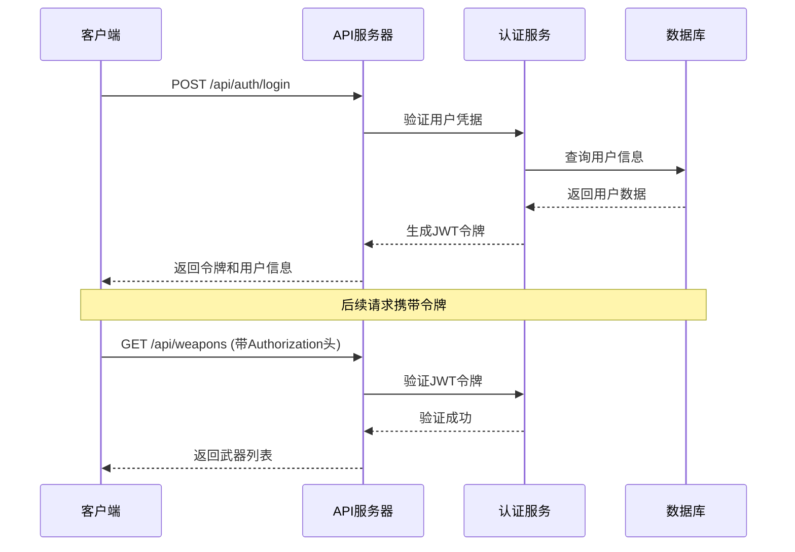
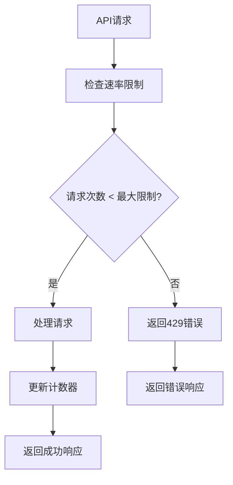

# 兵智世界API文档

<cite>
**本文档引用的文件**
- [backend/src/app.js](file://backend/src/app.js)
- [backend/src/routes/auth.js](file://backend/src/routes/auth.js)
- [backend/src/routes/weapons.js](file://backend/src/routes/weapons.js)
- [backend/src/routes/knowledge.js](file://backend/src/routes/knowledge.js)
- [backend/src/routes/weapon-images.js](file://backend/src/routes/weapon-images.js)
- [backend/src/routes/weapon-videos.js](file://backend/src/routes/weapon-videos.js)
- [backend/routes/auth.py](file://backend/routes/auth.py)
- [backend/routes/knowledge.py](file://backend/routes/knowledge.py)
- [backend/routes/weapon.py](file://backend/routes/weapon.py)
- [backend/src/middleware/auth.js](file://backend/src/middleware/auth.js)
- [backend/src/middleware/validation.js](file://backend/src/middleware/validation.js)
- [backend/src/config/index.js](file://backend/src/config/index.js)
- [backend/test-api.js](file://backend/test-api.js)
</cite>

## 目录
1. [简介](#简介)
2. [API基础信息](#api基础信息)
3. [认证系统](#认证系统)
4. [武器管理API](#武器管理api)
5. [知识图谱API](#知识图谱api)
6. [用户认证API](#用户认证api)
7. [图片管理API](#图片管理api)
8. [视频管理API](#视频管理api)
9. [错误处理](#错误处理)
10. [速率限制](#速率限制)
11. [API测试示例](#api测试示例)

## 简介

兵智世界是一个军事武器知识管理平台，提供完整的RESTful API接口，支持武器信息管理、知识图谱查询、用户认证、图片上传和视频管理等功能。API采用现代化架构设计，支持多种数据格式和安全认证机制。

## API基础信息

### 基础URL
```
https://api.military-world.com/v1
```

### 内容类型
- **请求**: `application/json`
- **响应**: `application/json`

### 认证方式
- **JWT Token**: `Authorization: Bearer <token>`
- **可选认证**: 部分接口支持匿名访问

### 分页参数
- `page`: 当前页码（默认：1）
- `limit`: 每页条目数（默认：20，最大：100）

## 认证系统

### JWT令牌管理



**图表来源**
- [backend/src/routes/auth.js](file://backend/src/routes/auth.js#L1-L144)
- [backend/src/middleware/auth.js](file://backend/src/middleware/auth.js#L1-L106)

**节来源**
- [backend/src/routes/auth.js](file://backend/src/routes/auth.js#L1-L144)
- [backend/src/middleware/auth.js](file://backend/src/middleware/auth.js#L1-L106)

## 武器管理API

### 获取武器列表

**端点**: `GET /api/weapons`

**认证**: 可选

**查询参数**:
- `category` (可选): 武器类型过滤
- `country` (可选): 制造国家过滤
- `page` (可选): 页码，默认1
- `limit` (可选): 每页数量，默认20

**响应格式**:
```json
{
  "success": true,
  "data": {
    "weapons": [
      {
        "id": "1",
        "name": "AK-47",
        "type": "步枪",
        "country": "苏联",
        "year": 1947,
        "description": "卡拉什尼科夫自动步枪...",
        "images": []
      }
    ],
    "pagination": {
      "current_page": 1,
      "total_pages": 10,
      "total_items": 200,
      "items_per_page": 20
    }
  }
}
```

**节来源**
- [backend/src/routes/weapons.js](file://backend/src/routes/weapons.js#L1-L50)

### 搜索武器

**端点**: `GET /api/weapons/search`

**认证**: 可选

**查询参数**:
- `q` (必需): 搜索关键词
- `category` (可选): 武器类型
- `country` (可选): 制造国家

**响应示例**:
```json
{
  "success": true,
  "data": {
    "weapons": [
      {
        "id": "1",
        "name": "AK-47",
        "type": "步枪",
        "country": "苏联",
        "similarity_score": 0.95
      }
    ]
  }
}
```

**节来源**
- [backend/src/routes/weapons.js](file://backend/src/routes/weapons.js#L51-L75)

### 获取武器详情

**端点**: `GET /api/weapons/{id}`

**认证**: 可选

**路径参数**:
- `id` (必需): 武器唯一标识符

**响应包含**:
- 武器基本信息
- 技术规格
- 关联关系
- 用户兴趣记录

**节来源**
- [backend/src/routes/weapons.js](file://backend/src/routes/weapons.js#L76-L100)

### 武器管理（管理员）

**创建武器**:
```http
POST /api/weapons
Content-Type: application/json
Authorization: Bearer <token>

{
  "name": "F-22猛禽",
  "type": "战斗机",
  "country": "美国",
  "year": 1997,
  "description": "第五代隐身战斗机",
  "specifications": {
    "max_speed": "2.25马赫",
    "range": "3700公里",
    "crew": 1
  }
}
```

**更新武器**:
```http
PUT /api/weapons/{id}
Content-Type: application/json
Authorization: Bearer <token>

{
  "description": "更新后的描述",
  "specifications": {
    "range": "4000公里"
  }
}
```

**删除武器**:
```http
DELETE /api/weapons/{id}
Authorization: Bearer <token>
```

**节来源**
- [backend/src/routes/weapons.js](file://backend/src/routes/weapons.js#L101-L150)

### 武器识别

**端点**: `POST /api/weapon/recognize`

**认证**: 必需

**请求格式**: multipart/form-data
- `image` (必需): 武器图片文件

**响应**:
```json
{
  "code": 200,
  "message": "识别成功",
  "result": {
    "recognized_weapon": "AK-47",
    "confidence": 0.98,
    "alternative_matches": [
      {"weapon": "AK-74", "confidence": 0.02}
    ]
  }
}
```

**Base64识别**:
```http
POST /api/weapon/recognize-base64
Content-Type: application/json
Authorization: Bearer <token>

{
  "image_data": "data:image/jpeg;base64,/9j/4AAQSkZJRgABAQEASABIAAD..."
}
```

**节来源**
- [backend/routes/weapon.py](file://backend/routes/weapon.py#L1-L98)

## 知识图谱API

### 获取知识图谱概览

**端点**: `GET /api/knowledge/graph`

**认证**: 必需

**响应格式**:
```json
{
  "code": 200,
  "message": "获取知识图谱成功",
  "data": {
    "nodes": [
      {
        "id": "weapon1",
        "label": "步枪",
        "type": "武器"
      },
      {
        "id": "feature1",
        "label": "射程远",
        "type": "特性"
      }
    ],
    "edges": [
      {
        "source": "weapon1",
        "target": "feature1",
        "label": "具备"
      }
    ]
  }
}
```

**节来源**
- [backend/routes/knowledge.py](file://backend/routes/knowledge.py#L1-L36)

### 武器知识图谱查询

**端点**: `GET /api/knowledge/weapon/{id}`

**认证**: 可选

**查询参数**:
- `depth` (可选): 查询深度，默认2，最大5

**响应**: 包含武器及其关联实体的知识图谱数据

### 知识图谱搜索

**端点**: `GET /api/knowledge/search`

**查询参数**:
- `q` (必需): 搜索关键词
- `types` (可选): 节点类型过滤（逗号分隔）
- `limit` (可选): 结果数量限制，默认20

### 路径查询

**端点**: `GET /api/knowledge/path`

**查询参数**:
- `start` (必需): 起始节点ID
- `end` (必需): 结束节点ID
- `maxDepth` (可选): 最大深度，默认5，最大10

### Cypher查询

**端点**: `POST /api/knowledge/query`

**请求格式**:
```json
{
  "query": "MATCH (w:Weapon) WHERE w.name CONTAINS $name RETURN w",
  "parameters": {
    "name": "AK"
  }
}
```

**安全限制**: 禁止危险操作（DELETE, REMOVE, DROP等）

**节来源**
- [backend/src/routes/knowledge.js](file://backend/src/routes/knowledge.js#L1-L182)

## 用户认证API

### 用户注册

**端点**: `POST /api/auth/register`

**请求格式**:
```json
{
  "username": "testuser",
  "email": "test@example.com",
  "password": "securepassword123",
  "name": "测试用户"
}
```

**验证规则**:
- `username`: 3-30字符，字母数字组合
- `email`: 有效邮箱地址
- `password`: 6-128字符
- `name`: 2-50字符（可选）

**响应**:
```json
{
  "success": true,
  "message": "注册成功",
  "data": {
    "user": {
      "id": 1,
      "username": "testuser",
      "email": "test@example.com",
      "created_at": "2024-01-01T00:00:00Z"
    },
    "token": "jwt_token_here"
  }
}
```

**节来源**
- [backend/src/routes/auth.js](file://backend/src/routes/auth.js#L1-L30)

### 用户登录

**端点**: `POST /api/auth/login`

**请求格式**:
```json
{
  "username": "testuser",
  "password": "securepassword123"
}
```

**响应**:
```json
{
  "success": true,
  "message": "登录成功",
  "data": {
    "user": {
      "id": 1,
      "username": "testuser",
      "email": "test@example.com",
      "role": "user"
    },
    "token": "jwt_token_here"
  }
}
```

**节来源**
- [backend/src/routes/auth.js](file://backend/src/routes/auth.js#L31-L50)

### 获取用户信息

**端点**: `GET /api/auth/profile`

**认证**: 必需

**响应**:
```json
{
  "success": true,
  "data": {
    "id": 1,
    "username": "testuser",
    "email": "test@example.com",
    "name": "测试用户",
    "preferences": {},
    "avatar": "https://example.com/avatar.jpg",
    "created_at": "2024-01-01T00:00:00Z"
  }
}
```

**节来源**
- [backend/src/routes/auth.js](file://backend/src/routes/auth.js#L51-L70)

### 更新用户资料

**端点**: `PUT /api/auth/profile`

**请求格式**:
```json
{
  "name": "新名字",
  "preferences": {
    "language": "zh-CN",
    "theme": "dark"
  },
  "avatar": "https://example.com/new-avatar.jpg"
}
```

**节来源**
- [backend/src/routes/auth.js](file://backend/src/routes/auth.js#L71-L85)

### 修改密码

**端点**: `PUT /api/auth/change-password`

**请求格式**:
```json
{
  "oldPassword": "old_secure_password",
  "newPassword": "new_secure_password123"
}
```

**验证规则**:
- 新密码至少6个字符
- 需提供正确的原密码

**节来源**
- [backend/src/routes/auth.js](file://backend/src/routes/auth.js#L86-L110)

### 令牌刷新

**端点**: `POST /api/auth/refresh`

**认证**: 必需

**响应**:
```json
{
  "success": true,
  "message": "令牌刷新成功",
  "data": {
    "token": "new_jwt_token_here"
  }
}
```

**节来源**
- [backend/src/routes/auth.js](file://backend/src/routes/auth.js#L111-L130)

## 图片管理API

### 获取武器图片

**端点**: `GET /api/weapon-images/{weaponId}`

**认证**: 可选

**路径参数**:
- `weaponId` (必需): 武器ID

**响应格式**:
```json
{
  "success": true,
  "data": {
    "weaponId": 1,
    "weaponName": "AK-47",
    "images": [
      {
        "id": 1640995200000,
        "filename": "weapon-1640995200000-123456789.jpg",
        "originalName": "ak47.jpg",
        "path": "/uploads/weapons/weapon-1640995200000-123456789.jpg",
        "size": 102400,
        "description": "AK-47正面图",
        "uploadedAt": "2024-01-01T00:00:00.000Z"
      }
    ]
  }
}
```

**节来源**
- [backend/src/routes/weapon-images.js](file://backend/src/routes/weapon-images.js#L40-L120)

### 上传武器图片

**端点**: `POST /api/weapon-images/{weaponId}`

**认证**: 管理员必需

**请求格式**: multipart/form-data
- `image` (必需): 图片文件
- `description` (可选): 图片描述

**文件限制**:
- 类型: jpeg, jpg, png, gif, webp
- 大小: 最大5MB

**响应**:
```json
{
  "success": true,
  "message": "图片上传成功",
  "data": {
    "image": {
      "id": 1640995200001,
      "filename": "weapon-1640995200001-987654321.jpg",
      "originalName": "ak47_side.jpg",
      "path": "/uploads/weapons/weapon-1640995200001-987654321.jpg",
      "size": 153600,
      "description": "AK-47侧面图",
      "uploadedAt": "2024-01-01T00:00:01.000Z"
    }
  }
}
```

**节来源**
- [backend/src/routes/weapon-images.js](file://backend/src/routes/weapon-images.js#L121-L200)

### 删除武器图片

**端点**: `DELETE /api/weapon-images/{weaponId}/{imageId}`

**认证**: 管理员必需

**路径参数**:
- `weaponId`: 武器ID
- `imageId`: 图片ID

**响应**:
```json
{
  "success": true,
  "message": "图片删除成功"
}
```

**节来源**
- [backend/src/routes/weapon-images.js](file://backend/src/routes/weapon-images.js#L201-L250)

### 更新图片描述

**端点**: `PUT /api/weapon-images/{weaponId}/{imageId}`

**认证**: 管理员必需

**请求格式**:
```json
{
  "description": "更新后的图片描述"
}
```

**响应**:
```json
{
  "success": true,
  "message": "图片描述更新成功",
  "data": {
    "image": {
      "id": 1640995200001,
      "description": "更新后的图片描述"
    }
  }
}
```

**节来源**
- [backend/src/routes/weapon-images.js](file://backend/src/routes/weapon-images.js#L251-L300)

## 视频管理API

### 获取武器视频列表

**端点**: `GET /api/weapon-videos/weapon/{weaponId}`

**认证**: 可选

**路径参数**:
- `weaponId` (必需): 武器ID

**响应格式**:
```json
{
  "success": true,
  "data": [
    {
      "id": 1,
      "weapon_id": 1,
      "filename": "weapon-video-1640995200000-123456789.mp4",
      "original_name": "ak47_demo.mp4",
      "file_path": "uploads/weapons/videos/weapon-video-1640995200000-123456789.mp4",
      "file_size": 52428800,
      "mime_type": "video/mp4",
      "duration": 120,
      "description": "AK-47射击演示",
      "upload_time": "2024-01-01T00:00:00.000Z"
    }
  ]
}
```

**节来源**
- [backend/src/routes/weapon-videos.js](file://backend/src/routes/weapon-videos.js#L60-L90)

### 上传视频

**端点**: `POST /api/weapon-videos/weapon/{weaponId}/upload`

**认证**: 必需（管理员）

**请求格式**: multipart/form-data
- `video` (必需): 视频文件
- `description` (可选): 视频描述

**文件限制**:
- 类型: mp4, avi, mov, wmv, flv, webm
- 大小: 最大100MB

**响应**:
```json
{
  "success": true,
  "message": "视频上传成功",
  "data": {
    "id": 1,
    "filename": "weapon-video-1640995200001-987654321.mp4",
    "originalName": "f22_demo.mp4",
    "fileSize": 104857600,
    "mimeType": "video/mp4",
    "description": "F-22战斗机演示"
  }
}
```

**节来源**
- [backend/src/routes/weapon-videos.js](file://backend/src/routes/weapon-videos.js#L91-L150)

### 获取视频文件

**端点**: `GET /api/weapon-videos/file/{filename}`

**认证**: 可选

**路径参数**:
- `filename` (必需): 视频文件名

**支持范围请求**: 支持视频流播放

**响应**: 视频文件流

### 更新视频信息

**端点**: `PUT /api/weapon-videos/{videoId}`

**认证**: 必需（管理员）

**请求格式**:
```json
{
  "description": "更新后的视频描述"
}
```

**响应**:
```json
{
  "success": true,
  "message": "视频信息更新成功"
}
```

**节来源**
- [backend/src/routes/weapon-videos.js](file://backend/src/routes/weapon-videos.js#L250-L290)

### 删除视频

**端点**: `DELETE /api/weapon-videos/{videoId}`

**认证**: 必需（管理员）

**路径参数**:
- `videoId` (必需): 视频ID

**响应**:
```json
{
  "success": true,
  "message": "视频删除成功"
}
```

**节来源**
- [backend/src/routes/weapon-videos.js](file://backend/src/routes/weapon-videos.js#L291-L340)

### 视频统计

**端点**: `GET /api/weapon-videos/weapon/{weaponId}/stats`

**认证**: 可选

**路径参数**:
- `weaponId` (必需): 武器ID

**响应格式**:
```json
{
  "success": true,
  "data": {
    "total_videos": 5,
    "total_size": 262144000,
    "avg_size": 52428800
  }
}
```

**节来源**
- [backend/src/routes/weapon-videos.js](file://backend/src/routes/weapon-videos.js#L341-L370)

## 错误处理

### 标准错误响应格式

```json
{
  "success": false,
  "message": "错误描述",
  "error": {
    "code": "ERROR_CODE",
    "details": "详细错误信息"
  }
}
```

### HTTP状态码

| 状态码 | 描述 | 场景 |
|--------|------|------|
| 200 | 成功 | 请求成功处理 |
| 201 | 创建成功 | 资源创建成功 |
| 400 | 请求错误 | 参数验证失败、格式错误 |
| 401 | 未授权 | 令牌缺失或无效 |
| 403 | 权限不足 | 需要管理员权限 |
| 404 | 资源不存在 | 请求的资源不存在 |
| 429 | 请求过于频繁 | 超出速率限制 |
| 500 | 服务器内部错误 | 服务器处理错误 |

### 常见错误类型

**认证错误**:
```json
{
  "success": false,
  "message": "访问令牌缺失",
  "error": {
    "code": "AUTH_TOKEN_MISSING"
  }
}
```

**验证错误**:
```json
{
  "success": false,
  "message": "数据验证失败",
  "errors": [
    {
      "field": "username",
      "message": "用户名至少需要3个字符"
    }
  ]
}
```

**节来源**
- [backend/src/app.js](file://backend/src/app.js#L120-L180)

## 速率限制

### 限制配置

系统采用基于IP的速率限制机制，防止API滥用。

**默认配置**:
- **时间窗口**: 15分钟（900,000毫秒）
- **最大请求数**: 1000个请求
- **响应头**: `X-RateLimit-Limit`, `X-RateLimit-Remaining`, `X-RateLimit-Reset`

### 限制策略



**图表来源**
- [backend/src/app.js](file://backend/src/app.js#L70-L85)

### 自定义限制

对于高频API，系统提供更宽松的限制：

```javascript
// 高频API使用更高限制
const highFrequencyLimiter = rateLimit({
  windowMs: config.rateLimit.windowMs,
  max: config.rateLimit.maxRequests * 2, // 两倍限制
  message: { success: false, message: '请求过于频繁，请稍后再试' }
});
```

**节来源**
- [backend/src/config/index.js](file://backend/src/config/index.js#L40-L50)
- [backend/src/app.js](file://backend/src/app.js#L70-L85)

## API测试示例

### 健康检查

```bash
curl -X GET "https://api.military-world.com/health"
```

**响应**:
```json
{
  "success": true,
  "message": "服务运行正常",
  "timestamp": "2024-01-01T00:00:00.000Z",
  "uptime": 3600
}
```

### 获取武器列表

```bash
curl -X GET "https://api.military-world.com/api/weapons?page=1&limit=10"
```

### 用户注册

```bash
curl -X POST "https://api.military-world.com/api/auth/register" \
  -H "Content-Type: application/json" \
  -d '{
    "username": "testuser",
    "email": "test@example.com",
    "password": "securepassword123"
  }'
```

### 上传武器图片

```bash
curl -X POST "https://api.military-world.com/api/weapon-images/1" \
  -H "Authorization: Bearer YOUR_JWT_TOKEN" \
  -F "image=@weapon.jpg" \
  -F "description=AK-47正面图"
```

### 知识图谱查询

```bash
curl -X POST "https://api.military-world.com/api/knowledge/query" \
  -H "Content-Type: application/json" \
  -H "Authorization: Bearer YOUR_JWT_TOKEN" \
  -d '{
    "query": "MATCH (w:Weapon) WHERE w.name CONTAINS $name RETURN w",
    "parameters": {"name": "AK"}
  }'
```

**节来源**
- [backend/test-api.js](file://backend/test-api.js#L1-L129)

## 批量操作

### 批量创建武器

```bash
curl -X POST "https://api.military-world.com/api/weapons/batch" \
  -H "Content-Type: application/json" \
  -H "Authorization: Bearer YOUR_JWT_TOKEN" \
  -d '[{}, {}, {}]'
```

### 批量删除图片

```bash
curl -X DELETE "https://api.military-world.com/api/weapon-images/batch" \
  -H "Content-Type: application/json" \
  -H "Authorization: Bearer YOUR_JWT_TOKEN" \
  -d '[1, 2, 3]'
```

## 文件上传处理

### Multer配置

系统使用Multer中间件处理文件上传，支持：

**图片上传**:
- 存储路径: `./uploads/weapons/`
- 文件大小限制: 5MB
- 允许格式: jpeg, jpg, png, gif, webp

**视频上传**:
- 存储路径: `./uploads/weapons/videos/`
- 文件大小限制: 100MB
- 允许格式: mp4, avi, mov, wmv, flv, webm

### 文件清理

系统自动清理上传的临时文件，确保磁盘空间的有效利用。

## 分页查询

### 标准分页参数

```javascript
const pagination = {
  page: parseInt(req.query.page) || 1,
  limit: parseInt(req.query.limit) || 20
};
```

### 分页响应格式

```json
{
  "success": true,
  "data": {
    "items": [...],
    "pagination": {
      "current_page": 1,
      "total_pages": 10,
      "total_items": 200,
      "items_per_page": 20
    }
  }
}
```

## 性能优化

### 缓存策略

- **知识图谱**: TTL 2小时
- **用户数据**: TTL 30分钟
- **武器列表**: TTL 1小时

### 数据库优化

- **Neo4j**: 使用索引和查询优化
- **MongoDB**: 文档查询优化
- **SQLite**: 事务管理和连接池

## 安全措施

### 输入验证

所有API请求都经过严格的数据验证：

```javascript
const weaponSchema = Joi.object({
  name: Joi.string().min(2).max(100).required(),
  type: Joi.string().valid(...weaponTypes).required(),
  country: Joi.string().min(2).max(50).required(),
  year: Joi.number().integer().min(1800).max(2030),
  description: Joi.string().max(1000),
  specifications: Joi.object()
});
```

### SQL注入防护

- 使用参数化查询
- 数据库连接池管理
- 查询结果安全输出

### XSS防护

- 输入内容HTML转义
- 输出内容安全编码
- 内容安全策略(CSP)

**节来源**
- [backend/src/middleware/validation.js](file://backend/src/middleware/validation.js#L1-L178)

## 总结

兵智世界API提供了完整的军事武器知识管理解决方案，支持：

- **全面的武器信息管理**：增删改查、批量操作
- **智能知识图谱**：关系查询、路径发现、推荐系统
- **媒体资源管理**：图片上传、视频管理、文件存储
- **用户认证体系**：JWT令牌、权限控制、会话管理
- **高性能架构**：速率限制、缓存策略、数据库优化

API设计遵循RESTful原则，提供清晰的错误处理和详细的文档说明，便于开发者集成和使用。