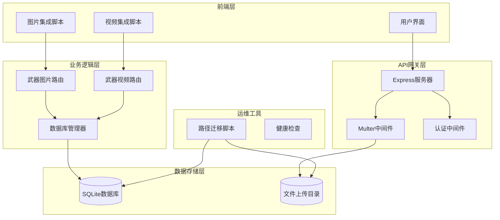
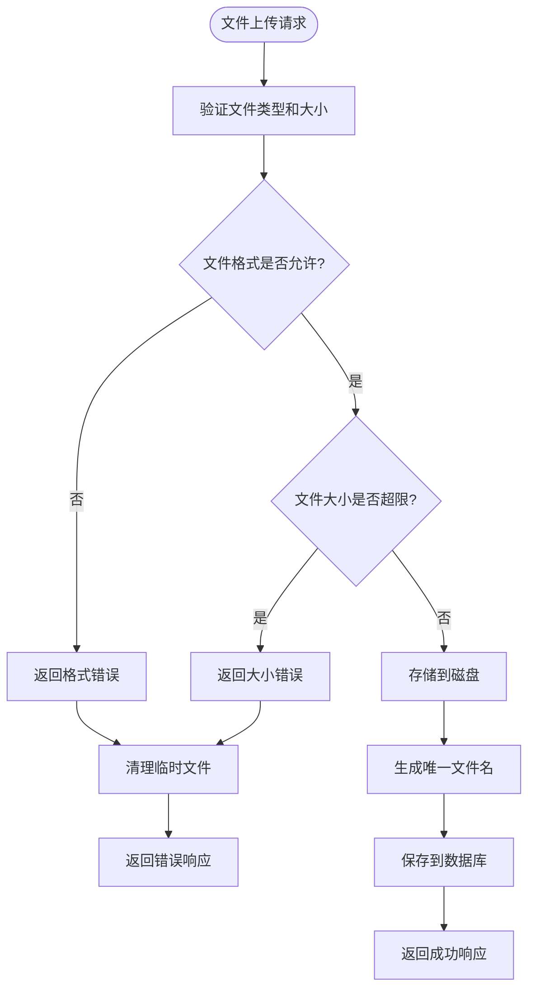
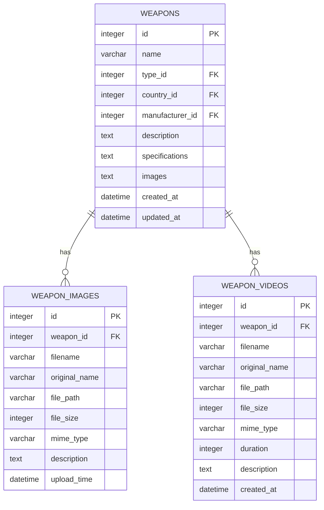
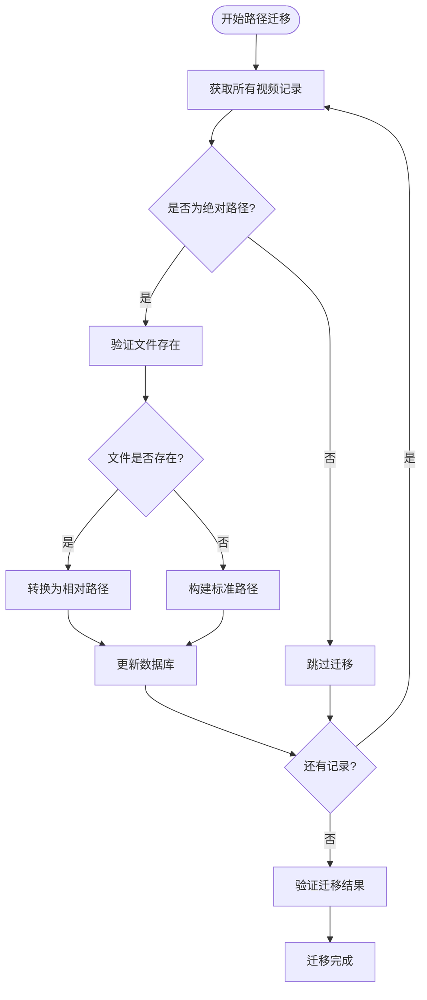

# 多媒体管理API详细文档

<cite>
**本文档引用的文件**
- [weapon-images.js](file://backend/src/routes/weapon-images.js)
- [weapon-videos.js](file://backend/src/routes/weapon-videos.js)
- [migrate-video-paths.js](file://backend/scripts/migrate-video-paths.js)
- [weapon-image-integration.js](file://scripts/weapon-image-integration.js)
- [weapon-video-integration.js](file://scripts/weapon-video-integration.js)
- [app.js](file://backend/src/app.js)
- [index.js](file://backend/src/config/index.js)
- [.env](file://backend/.env)
- [database-simple.js](file://backend/src/config/database-simple.js)
</cite>

## 目录
1. [简介](#简介)
2. [系统架构](#系统架构)
3. [API端点详解](#api端点详解)
4. [文件上传机制](#文件上传机制)
5. [数据库设计](#数据库设计)
6. [前端集成](#前端集成)
7. [文件路径管理](#文件路径管理)
8. [性能优化](#性能优化)
9. [错误处理](#错误处理)
10. [部署指南](#部署指南)

## 简介

兵智世界多媒体管理API是一套完整的武器图片和视频管理系统，提供高效的文件上传、存储、检索和管理功能。该系统采用Node.js Express框架构建，支持多种文件格式，具备完善的权限控制和CDN集成能力。

### 核心功能特性
- ✅ 武器图片上传、获取、编辑、删除
- ✅ 武器视频上传、流式播放、管理
- ✅ 多格式文件支持（图片：JPG、PNG、GIF、WebP；视频：MP4、AVI、MOV、WMV、FLV、WebM）
- ✅ 文件大小限制和格式验证
- ✅ 数据库存储和文件系统分离
- ✅ 缩略图生成和预览功能
- ✅ 视频流式播放支持
- ✅ 路径迁移和CDN集成准备

## 系统架构



**图表来源**
- [app.js](file://backend/src/app.js#L1-L50)
- [weapon-images.js](file://backend/src/routes/weapon-images.js#L1-L30)
- [weapon-videos.js](file://backend/src/routes/weapon-videos.js#L1-L30)

## API端点详解

### 武器图片管理API

#### 1. 获取武器图片列表
**GET** `/api/weapon-images/:weaponId`

**功能描述**: 根据武器ID获取该武器的所有图片信息

**请求参数**:
- `weaponId` (路径参数): 武器唯一标识符，支持多种格式（weapon_123、123_abc、123）

**响应格式**:
```json
{
  "success": true,
  "data": {
    "weaponId": 123,
    "weaponName": "M16步枪",
    "images": [
      {
        "id": 1698745600000,
        "filename": "weapon-1698745600000-123456789.jpg",
        "originalName": "m16_main.jpg",
        "path": "/uploads/weapons/weapon-1698745600000-123456789.jpg",
        "size": 2048576,
        "description": "主武器外观",
        "uploadedAt": "2023-10-31T10:26:40.000Z"
      }
    ]
  }
}
```

**错误响应**:
- `400 Bad Request`: 无效的武器ID格式
- `404 Not Found`: 武器不存在
- `500 Internal Server Error`: 数据库查询失败

#### 2. 上传武器图片
**POST** `/api/weapon-images/:weaponId`

**功能描述**: 为指定武器上传新的图片文件

**请求头**:
- `Content-Type`: `multipart/form-data`
- `x-admin-user`: `true` (管理员认证)

**请求体**:
- `image` (文件字段): 图片文件（最大5MB）
- `description` (文本字段): 图片描述信息

**响应格式**:
```json
{
  "success": true,
  "message": "图片上传成功",
  "data": {
    "image": {
      "id": 1698745600001,
      "filename": "weapon-1698745600001-987654321.png",
      "originalName": "m16_detail.png",
      "path": "/uploads/weapons/weapon-1698745600001-987654321.png",
      "size": 1572864,
      "description": "细节特写",
      "uploadedAt": "2023-10-31T10:26:41.000Z"
    }
  }
}
```

**支持的图片格式**: JPEG、JPG、PNG、GIF、WebP

#### 3. 删除武器图片
**DELETE** `/api/weapon-images/:weaponId/:imageId`

**功能描述**: 删除指定武器的某张图片

**权限要求**: 管理员权限

**响应格式**:
```json
{
  "success": true,
  "message": "图片删除成功"
}
```

#### 4. 更新图片描述
**PUT** `/api/weapon-images/:weaponId/:imageId`

**功能描述**: 更新图片的描述信息

**请求体**:
```json
{
  "description": "更新后的图片描述"
}
```

**响应格式**:
```json
{
  "success": true,
  "message": "图片描述更新成功",
  "data": {
    "image": {
      "id": 1698745600001,
      "description": "更新后的图片描述",
      "updatedAt": "2023-10-31T10:30:00.000Z"
    }
  }
}
```

### 武器视频管理API

#### 1. 获取武器视频列表
**GET** `/api/weapon-videos/weapon/:weaponId`

**功能描述**: 获取指定武器的所有视频文件信息

**响应格式**:
```json
{
  "success": true,
  "data": [
    {
      "id": 1,
      "weapon_id": 123,
      "filename": "weapon-video-1698745600000-123456789.mp4",
      "original_name": "m16_operation.mp4",
      "file_path": "uploads/weapons/videos/weapon-video-1698745600000-123456789.mp4",
      "file_size": 52428800,
      "mime_type": "video/mp4",
      "duration": 120,
      "description": "M16操作演示",
      "created_at": "2023-10-31T10:26:40.000Z"
    }
  ]
}
```

#### 2. 上传武器视频
**POST** `/api/weapon-videos/weapon/:weaponId/upload`

**功能描述**: 为指定武器上传视频文件

**请求头**:
- `Content-Type`: `multipart/form-data`
- `x-admin-user`: `true` (管理员认证)

**请求体**:
- `video` (文件字段): 视频文件（最大100MB）
- `description` (文本字段): 视频描述信息

**响应格式**:
```json
{
  "success": true,
  "message": "视频上传成功",
  "data": {
    "id": 2,
    "filename": "weapon-video-1698745600001-987654321.avi",
    "originalName": "m16_training.avi",
    "fileSize": 83886080,
    "mimeType": "video/avi",
    "description": "训练教程"
  }
}
```

**支持的视频格式**: MP4、AVI、MOV、WMV、FLV、WebM

#### 3. 获取视频文件流
**GET** `/api/weapon-videos/file/:filename`

**功能描述**: 流式传输视频文件，支持断点续传

**支持的HTTP头部**:
- `Range`: 支持HTTP Range请求，实现视频流播放和断点续传
- `Accept-Ranges`: bytes

**响应头**:
- `Content-Type`: 视频文件的MIME类型
- `Content-Length`: 文件大小
- `Content-Range`: 分块传输范围（如果支持Range）

#### 4. 更新视频信息
**PUT** `/api/weapon-videos/:videoId`

**功能描述**: 更新视频的描述信息

**请求体**:
```json
{
  "description": "更新后的视频描述"
}
```

#### 5. 删除视频
**DELETE** `/api/weapon-videos/:videoId`

**功能描述**: 删除指定视频文件

**响应格式**:
```json
{
  "success": true,
  "message": "视频删除成功"
}
```

#### 6. 获取视频统计信息
**GET** `/api/weapon-videos/weapon/:weaponId/stats`

**功能描述**: 获取武器视频的统计信息

**响应格式**:
```json
{
  "success": true,
  "data": {
    "total_videos": 5,
    "total_size": 268435456,
    "avg_size": 53687091
  }
}
```

**节来源**
- [weapon-images.js](file://backend/src/routes/weapon-images.js#L42-L120)
- [weapon-videos.js](file://backend/src/routes/weapon-videos.js#L82-L160)

## 文件上传机制

### Multer中间件配置

系统使用Multer中间件处理文件上传，提供强大的文件处理能力：



**图表来源**
- [weapon-images.js](file://backend/src/routes/weapon-images.js#L13-L40)
- [weapon-videos.js](file://backend/src/routes/weapon-videos.js#L25-L40)

### 图片上传配置

**文件大小限制**: 5MB
**支持格式**: JPEG、JPG、PNG、GIF、WebP
**存储位置**: `backend/uploads/weapons/`
**文件命名**: `weapon-{timestamp}-{random}.{ext}`

### 视频上传配置

**文件大小限制**: 100MB
**支持格式**: MP4、AVI、MOV、WMV、FLV、WebM
**存储位置**: `backend/uploads/weapons/videos/`
**文件命名**: `weapon-video-{timestamp}-{random}.{ext}`

### 文件过滤器实现

系统实现了严格的文件类型验证：

```javascript
// 图片文件过滤器
const allowedTypes = /jpeg|jpg|png|gif|webp/;
const extname = allowedTypes.test(path.extname(file.originalname).toLowerCase());
const mimetype = allowedTypes.test(file.mimetype);

// 视频文件过滤器  
const allowedTypes = ['video/mp4', 'video/avi', 'video/mov', 'video/wmv', 'video/flv', 'video/webm'];
```

**节来源**
- [weapon-images.js](file://backend/src/routes/weapon-images.js#L25-L40)
- [weapon-videos.js](file://backend/src/routes/weapon-videos.js#L25-L35)

## 数据库设计

### 核心数据表结构



**图表来源**
- [database-simple.js](file://backend/src/config/database-simple.js#L84-L122)

### 数据库表说明

#### 武器表 (weapons)
- 存储武器基本信息
- `images`字段存储图片元数据的JSON数组
- 支持武器分类、国家、制造商关联

#### 武器图片表 (weapon_images)
- 独立的图片管理表
- 支持详细的图片元数据
- 与武器表建立外键关联

#### 武器视频表 (weapon_videos)
- 支持视频元数据存储
- 包含视频时长、MIME类型等信息
- 支持视频描述和上传时间

**节来源**
- [database-simple.js](file://backend/src/config/database-simple.js#L84-L122)

## 前端集成

### 图片管理集成

前端提供了完整的武器图片管理界面，支持以下功能：

#### 主要功能组件
- **图片上传界面**: 支持拖拽上传和文件选择
- **图片预览**: 缩略图网格显示
- **图片编辑**: 实时编辑图片描述
- **图片删除**: 安全删除确认机制
- **灯箱查看**: 全屏图片浏览

#### API调用示例

```javascript
// 上传图片
async uploadImage() {
    const formData = new FormData();
    formData.append('image', fileInput.files[0]);
    formData.append('description', description);
    
    const response = await fetch(`/api/weapon-images/${weaponId}`, {
        method: 'POST',
        headers: {
            'x-admin-user': 'true'
        },
        body: formData
    });
}
```

### 视频管理集成

#### 视频播放器功能
- **流式播放**: 支持视频断点续传
- **进度控制**: 拖拽进度条
- **全屏模式**: 全屏视频播放
- **信息展示**: 视频元数据显示

#### 视频上传流程

```javascript
// 视频上传实现
async uploadVideo() {
    const formData = new FormData();
    formData.append('video', selectedFile);
    formData.append('description', description);
    
    const xhr = new XMLHttpRequest();
    xhr.upload.onprogress = (e) => {
        updateProgressBar(e.loaded, e.total);
    };
    
    xhr.open('POST', `/api/weapon-videos/weapon/${weaponId}/upload`);
    xhr.send(formData);
}
```

**节来源**
- [weapon-image-integration.js](file://scripts/weapon-image-integration.js#L400-L500)
- [weapon-video-integration.js](file://scripts/weapon-video-integration.js#L700-L800)

## 文件路径管理

### 路径迁移系统

系统提供了完整的文件路径迁移功能，确保文件路径的一致性和可维护性：



**图表来源**
- [migrate-video-paths.js](file://backend/scripts/migrate-video-paths.js#L20-L80)

### 路径处理策略

#### 1. 相对路径优先
系统优先使用相对路径，便于部署迁移：

```javascript
// 路径转换逻辑
const relativePath = path.relative(projectRoot, absolutePath);
// 或者构建标准路径
const stdPath = path.join('uploads', 'weapons', 'videos', filename);
```

#### 2. 路径验证机制
迁移脚本包含完整的路径验证：

```javascript
// 验证迁移结果
const fullPath = path.isAbsolute(video.file_path) 
    ? video.file_path 
    : path.join(projectRoot, video.file_path);

if (fs.existsSync(fullPath)) {
    validCount++;
} else {
    console.log(`文件不存在: ${video.file_path} (ID: ${video.id})`);
}
```

#### 3. 回滚机制
提供完整的路径回滚功能：

```javascript
// 回滚到绝对路径
const absolutePath = path.join(projectRoot, relativePath);
updateStmt.run(absolutePath, videoId);
```

**节来源**
- [migrate-video-paths.js](file://backend/scripts/migrate-video-paths.js#L100-L150)

## 性能优化

### 1. 文件上传优化

#### 分块上传支持
- **断点续传**: 支持HTTP Range请求
- **进度监控**: 实时上传进度反馈
- **并发控制**: 防止同时多个上传任务

#### 内存管理
- **流式处理**: 大文件使用流式读取
- **临时文件**: 自动清理上传临时文件
- **内存限制**: 设置合理的文件大小限制

### 2. 数据库优化

#### 索引策略
```sql
-- 为武器ID创建索引
CREATE INDEX idx_weapon_videos_weapon_id ON weapon_videos(weapon_id);
CREATE INDEX idx_weapon_images_weapon_id ON weapon_images(weapon_id);
```

#### 查询优化
- **批量查询**: 减少数据库连接次数
- **结果缓存**: 缓存常用的武器图片数据
- **分页支持**: 大量图片时使用分页

### 3. 前端性能

#### 图片优化
- **懒加载**: 滚动时动态加载图片
- **缩略图**: 使用小尺寸预览图
- **CDN支持**: 准备CDN集成方案

#### 视频优化
- **流式播放**: 避免下载整个视频文件
- **格式检测**: 自动选择最佳播放格式
- **缓冲策略**: 智能预加载下一帧

## 错误处理

### 1. 文件上传错误

#### 常见错误类型
- **格式错误**: 不支持的文件类型
- **大小超限**: 文件超过限制大小
- **权限错误**: 无上传权限
- **磁盘空间不足**: 服务器存储空间不够

#### 错误响应格式
```json
{
  "success": false,
  "message": "只允许上传图片文件 (jpeg, jpg, png, gif, webp)",
  "errorCode": "INVALID_FORMAT"
}
```

### 2. 数据库错误

#### 连接错误处理
```javascript
// 数据库连接错误
if (error.name === 'MongoError' || error.name === 'Neo4jError') {
    return res.status(503).json({
        success: false,
        message: '数据库连接错误，请稍后重试'
    });
}
```

### 3. 文件系统错误

#### 路径错误处理
```javascript
// 文件不存在错误
if (!fs.existsSync(fullPath)) {
    console.error(`视频文件不存在: ${fullPath}`);
    return res.status(404).json({
        success: false,
        message: '视频文件不存在'
    });
}
```

**节来源**
- [weapon-images.js](file://backend/src/routes/weapon-images.js#L170-L190)
- [weapon-videos.js](file://backend/src/routes/weapon-videos.js#L200-L220)

## 部署指南

### 1. 环境配置

#### 必需环境变量
```bash
# 服务器配置
PORT=3001
NODE_ENV=production

# JWT配置
JWT_SECRET=your-complex-secret-key-32-characters-minimum

# 数据库配置
DB_PATH=./data/military-knowledge.db

# 文件上传配置
UPLOAD_PATH=uploads/
MAX_FILE_SIZE=10485760  # 10MB
```

#### 目录权限设置
```bash
# 创建必要的目录
mkdir -p uploads/weapons
mkdir -p uploads/weapons/videos
mkdir -p logs

# 设置目录权限
chmod -R 755 uploads
chmod -R 755 logs
```

### 2. 服务启动

#### 开发环境
```bash
# 安装依赖
npm install

# 启动开发服务器
npm run dev

# 或直接运行
node backend/src/app.js
```

#### 生产环境
```bash
# 安装生产依赖
npm install --production

# 启动生产服务器
npm start

# 或使用PM2守护进程
pm2 start backend/src/app.js --name military-api
```

### 3. 监控和维护

#### 健康检查
```bash
# 健康检查端点
curl http://localhost:3001/health

# 返回示例
{
  "success": true,
  "message": "服务运行正常",
  "timestamp": "2023-10-31T10:00:00.000Z",
  "uptime": 3600
}
```

#### 日志管理
```bash
# 查看应用日志
tail -f logs/app.log

# 日志轮转配置
logrotate -f /etc/logrotate.d/military-api
```

### 4. 扩展和优化

#### CDN集成准备
- **静态资源分离**: 将上传文件与应用代码分离
- **URL重写**: 支持CDN域名映射
- **缓存策略**: 设置合适的缓存头

#### 水平扩展
- **负载均衡**: 使用Nginx或HAProxy
- **数据库分片**: 大规模数据时考虑分片
- **缓存层**: 添加Redis缓存层

**节来源**
- [.env](file://backend/.env#L1-L35)
- [app.js](file://backend/src/app.js#L180-L220)

## 结论

兵智世界多媒体管理API提供了一套完整、高效、可扩展的武器图片和视频管理解决方案。通过合理的设计架构、完善的错误处理机制和丰富的前端集成功能，该系统能够满足现代军事知识管理平台的需求。

### 主要优势
- **安全性**: 完善的权限控制和文件验证
- **可扩展性**: 模块化设计，易于扩展新功能
- **性能**: 优化的文件处理和数据库查询
- **易用性**: 丰富的前端集成和直观的API设计

### 发展方向
- **CDN集成**: 支持大规模文件分发
- **AI增强**: 图片识别和视频分析功能
- **移动端支持**: 响应式设计和移动应用接口
- **国际化**: 多语言支持和本地化适配