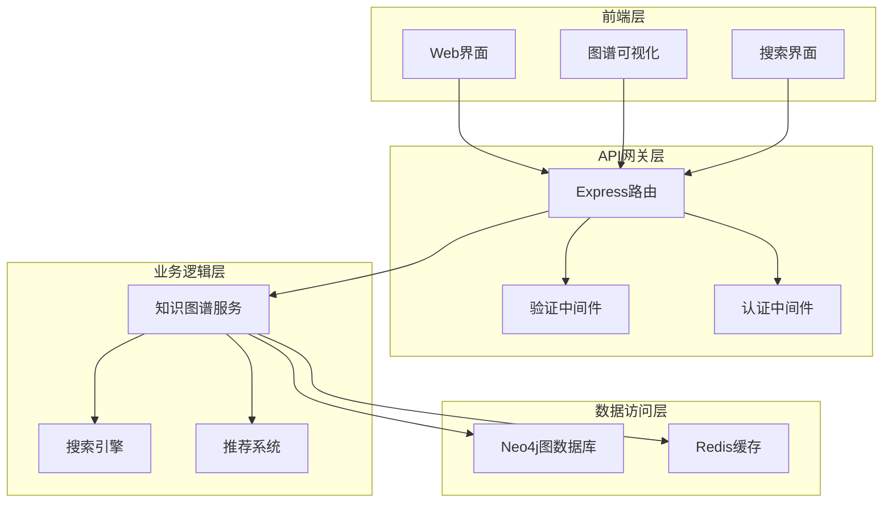
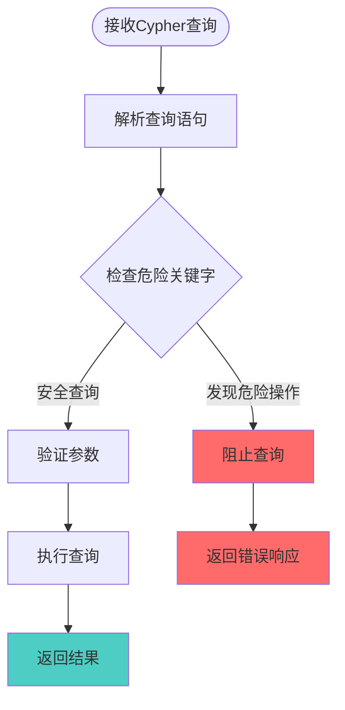
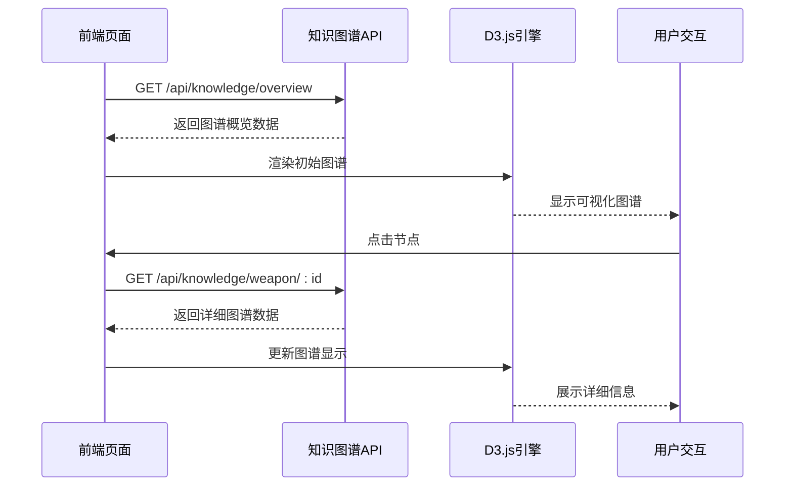
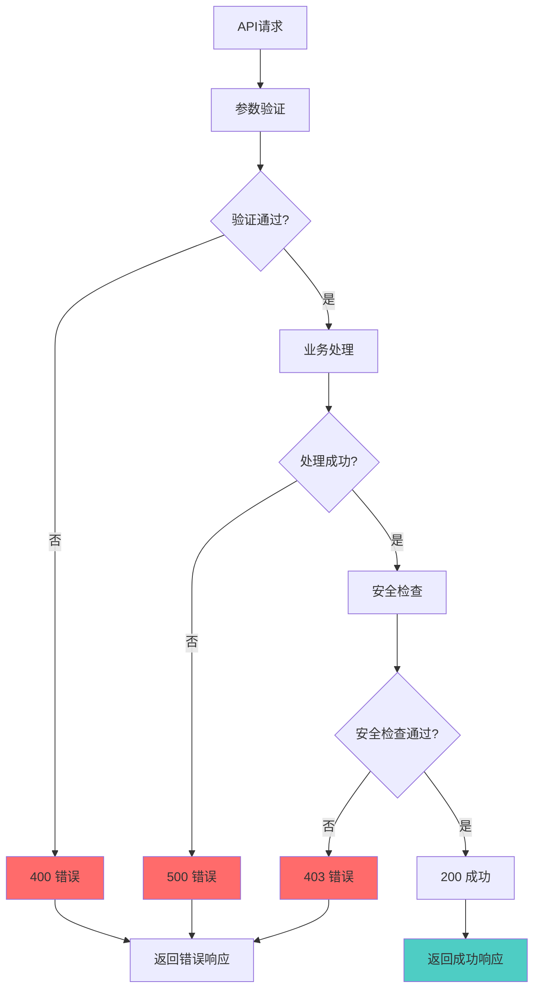

# 知识图谱API

<cite>
**本文档引用的文件**
- [backend/src/routes/knowledge.js](file://backend/src/routes/knowledge.js)
- [backend/src/services/knowledgeGraphService.js](file://backend/src/services/knowledgeGraphService.js)
- [backend/src/middleware/validation.js](file://backend/src/middleware/validation.js)
- [backend/src/config/database_Neo4j.js](file://backend/src/config/database_Neo4j.js)
- [knowledge-graph.js](file://knowledge-graph.js)
- [knowledge-graph.html](file://knowledge-graph.html)
- [test-search-api-debug.js](file://test-search-api-debug.js)
</cite>

## 目录
1. [简介](#简介)
2. [API架构概述](#api架构概述)
3. [核心端点详解](#核心端点详解)
4. [安全机制](#安全机制)
5. [前端集成指南](#前端集成指南)
6. [错误处理与性能优化](#错误处理与性能优化)
7. [实际使用示例](#实际使用示例)
8. [最佳实践](#最佳实践)

## 简介

知识图谱API是一个基于Neo4j图数据库的强大知识发现系统，提供了全面的武器装备知识图谱查询、搜索、推荐和可视化功能。该API采用RESTful设计，支持复杂的图谱遍历、路径查找和自定义Cypher查询，为军事爱好者和研究人员提供深入的知识洞察。

### 主要功能特性

- **图谱概览**：获取知识图谱的整体统计信息和结构
- **武器详情**：基于武器ID的深度图谱查询
- **智能搜索**：全文搜索和类型过滤的综合搜索功能
- **节点邻居**：探索特定节点的直接关联关系
- **路径查找**：计算两个节点间的最短路径
- **Cypher查询**：安全的自定义查询执行
- **个性化推荐**：基于用户兴趣的武器推荐系统

## API架构概述



**图表来源**
- [backend/src/routes/knowledge.js](file://backend/src/routes/knowledge.js#L1-L182)
- [backend/src/services/knowledgeGraphService.js](file://backend/src/services/knowledgeGraphService.js#L1-L430)

**章节来源**
- [backend/src/routes/knowledge.js](file://backend/src/routes/knowledge.js#L1-L182)
- [backend/src/services/knowledgeGraphService.js](file://backend/src/services/knowledgeGraphService.js#L1-L430)

## 核心端点详解

### 1. GET /api/knowledge/overview - 图谱概览

获取知识图谱的整体统计信息和结构概览。

#### 请求参数
- **无参数**

#### 响应结构
```json
{
  "success": true,
  "data": {
    "node_statistics": [
      {
        "labels": ["Weapon"],
        "count": 150
      },
      {
        "labels": ["Country"],
        "count": 50
      }
    ],
    "relationship_statistics": [
      {
        "type": "MANUFACTURED_BY",
        "count": 200
      }
    ],
    "total_nodes": 300,
    "total_relationships": 400
  }
}
```

#### 使用场景
- 页面初始化时加载图谱基本信息
- 为用户提供知识图谱规模概览
- 支持图谱统计分析和监控

**章节来源**
- [backend/src/routes/knowledge.js](file://backend/src/routes/knowledge.js#L8-L20)
- [backend/src/services/knowledgeGraphService.js](file://backend/src/services/knowledgeGraphService.js#L45-L85)

### 2. GET /api/knowledge/weapon/:id - 武器知识图谱

获取指定武器ID的详细知识图谱，支持深度控制的图谱遍历。

#### 请求参数
- **id** (路径参数): 武器唯一标识符
- **depth** (查询参数): 图谱遍历深度，默认为2，最大为5

#### 响应结构
```json
{
  "success": true,
  "data": {
    "nodes": [
      {
        "id": "weapon123",
        "labels": ["Weapon"],
        "properties": {
          "name": "M16自动步枪",
          "description": "美国制式自动步枪",
          "year": 1964
        }
      }
    ],
    "relationships": [
      {
        "id": "rel456",
        "type": "MANUFACTURED_BY",
        "properties": {},
        "source": "weapon123",
        "target": "manufacturer789"
      }
    ],
    "center_weapon_id": "weapon123"
  }
}
```

#### 深度控制机制
- **depth=1**: 仅包含武器本身
- **depth=2**: 包含武器及其直接关联（制造商、国家等）
- **depth=3+**: 递归扩展到指定层级
- **安全限制**: 最大深度为5层，防止性能问题

**章节来源**
- [backend/src/routes/knowledge.js](file://backend/src/routes/knowledge.js#L22-L45)
- [backend/src/services/knowledgeGraphService.js](file://backend/src/services/knowledgeGraphService.js#L87-L145)

### 3. GET /api/knowledge/search - 图谱搜索

执行全文搜索和类型过滤的综合搜索功能。

#### 请求参数
- **q** (查询参数): 搜索关键词（必填）
- **types** (查询参数): 节点类型过滤，逗号分隔的类型列表
- **limit** (查询参数): 结果数量限制，默认20

#### 响应结构
```json
{
  "success": true,
  "data": {
    "results": [
      {
        "id": "weapon123",
        "labels": ["Weapon"],
        "properties": {
          "name": "M16自动步枪",
          "description": "美国制式自动步枪",
          "year": 1964
        }
      }
    ],
    "search_term": "步枪",
    "total_found": 15
  }
}
```

#### 搜索策略
- **全文匹配**: 在name和description字段中搜索
- **类型过滤**: 支持按节点类型精确过滤
- **结果排序**: 按匹配度和相关性排序
- **性能优化**: 限制最大结果数量为100

**章节来源**
- [backend/src/routes/knowledge.js](file://backend/src/routes/knowledge.js#L47-L67)
- [backend/src/services/knowledgeGraphService.js](file://backend/src/services/knowledgeGraphService.js#L147-L195)

### 4. GET /api/knowledge/node/:id/neighbors - 节点邻居

获取指定节点的所有直接邻居节点和关联关系。

#### 请求参数
- **id** (路径参数): 节点唯一标识符
- **types** (查询参数): 关系类型过滤，逗号分隔的类型列表
- **limit** (查询参数): 结果数量限制，默认10

#### 响应结构
```json
{
  "success": true,
  "data": {
    "neighbors": [
      {
        "node": {
          "id": "weapon456",
          "labels": ["Weapon"],
          "properties": {
            "name": "M4卡宾枪",
            "year": 1994
          }
        },
        "relationship": {
          "id": "rel789",
          "type": "SIMILAR_TO",
          "properties": {
            "similarity_score": 0.85
          }
        }
      }
    ],
    "center_node_id": "weapon123"
  }
}
```

#### 邻居探索功能
- **直接关联**: 获取与指定节点直接相连的所有节点
- **关系过滤**: 支持按关系类型筛选
- **双向关系**: 同时考虑入边和出边
- **性能控制**: 限制最大邻居数量

**章节来源**
- [backend/src/routes/knowledge.js](file://backend/src/routes/knowledge.js#L69-L88)
- [backend/src/services/knowledgeGraphService.js](file://backend/src/services/knowledgeGraphService.js#L197-L250)

### 5. GET /api/knowledge/path - 路径查找

查找两个节点之间的最短路径，支持深度限制。

#### 请求参数
- **start** (查询参数): 起始节点ID（必填）
- **end** (查询参数): 结束节点ID（必填）
- **maxDepth** (查询参数): 最大搜索深度，默认5，最大10

#### 响应结构
```json
{
  "success": true,
  "data": {
    "path_found": true,
    "path_length": 3,
    "nodes": [
      {
        "id": "weapon123",
        "labels": ["Weapon"],
        "properties": {
          "name": "M16"
        }
      }
    ],
    "relationships": [
      {
        "id": "rel456",
        "type": "USED_BY",
        "properties": {}
      }
    ]
  }
}
```

#### 路径查找算法
- **最短路径算法**: 使用Neo4j的最短路径算法
- **深度限制**: 防止过深搜索导致的性能问题
- **路径验证**: 自动检测路径是否存在
- **结果优化**: 返回最优路径而非所有可能路径

**章节来源**
- [backend/src/routes/knowledge.js](file://backend/src/routes/knowledge.js#L90-L125)
- [backend/src/services/knowledgeGraphService.js](file://backend/src/services/knowledgeGraphService.js#L252-L305)

### 6. POST /api/knowledge/query - Cypher查询执行

执行自定义Cypher查询，支持复杂的数据分析和图谱操作。

#### 请求参数
```json
{
  "query": "MATCH (w:Weapon {name: $weaponName})-[:MANUFACTURED_BY]->(m:Manufacturer) RETURN w, m",
  "parameters": {
    "weaponName": "M16"
  }
}
```

#### 响应结构
```json
{
  "success": true,
  "data": {
    "records": [
      {
        "w": {
          "identity": "123",
          "labels": ["Weapon"],
          "properties": {
            "name": "M16",
            "year": 1964
          }
        },
        "m": {
          "identity": "456",
          "labels": ["Manufacturer"],
          "properties": {
            "name": "柯尔特公司"
          }
        }
      }
    ],
    "summary": {
      "query": "MATCH ...",
      "parameters": {},
      "recordCount": 1
    }
  }
}
```

#### 安全机制
- **危险操作过滤**: 自动阻止DELETE、REMOVE、DROP等危险操作
- **参数化查询**: 支持参数化防止SQL注入
- **权限控制**: 基于用户权限的查询限制
- **查询审计**: 记录所有查询操作用于安全审计

**章节来源**
- [backend/src/routes/knowledge.js](file://backend/src/routes/knowledge.js#L127-L155)
- [backend/src/services/knowledgeGraphService.js](file://backend/src/services/knowledgeGraphService.js#L3-L43)

### 7. GET /api/knowledge/recommendations/:userId - 推荐武器

基于用户兴趣图谱的个性化武器推荐系统。

#### 请求参数
- **userId** (路径参数): 用户唯一标识符
- **limit** (查询参数): 推荐数量限制，默认10

#### 响应结构
```json
{
  "success": true,
  "data": {
    "recommendations": [
      {
        "weapon_id": "weapon789",
        "name": "F-22猛禽战斗机",
        "type": "战斗机",
        "country": "美国",
        "relevance_score": 0.92
      }
    ],
    "user_id": "user123"
  }
}
```

#### 推荐算法
- **协同过滤**: 基于相似用户的兴趣推荐
- **内容相似性**: 基于武器特征的相似度计算
- **热度因素**: 考虑武器的流行程度
- **多样性保证**: 确保推荐结果的多样性

**章节来源**
- [backend/src/routes/knowledge.js](file://backend/src/routes/knowledge.js#L157-L175)
- [backend/src/services/knowledgeGraphService.js](file://backend/src/services/knowledgeGraphService.js#L350-L390)

## 安全机制

### Cypher查询安全防护



**图表来源**
- [backend/src/routes/knowledge.js](file://backend/src/routes/knowledge.js#L127-L145)

### 安全检查规则

| 操作类型 | 禁止关键字 | 安全替代方案 |
|---------|-----------|-------------|
| 数据删除 | DELETE, REMOVE | 使用标记删除 |
| 数据结构修改 | DROP, CREATE | 使用事务控制 |
| 权限提升 | MERGE, SET | 使用角色权限 |
| 数据泄露 | MATCH * | 使用条件过滤 |

### 认证与授权

- **JWT令牌验证**: 所有API端点都需要有效的JWT令牌
- **可选认证**: 部分公开端点支持匿名访问
- **权限分级**: 不同用户角色具有不同的API访问权限
- **速率限制**: 防止API滥用和DDoS攻击

**章节来源**
- [backend/src/routes/knowledge.js](file://backend/src/routes/knowledge.js#L127-L145)
- [backend/src/middleware/validation.js](file://backend/src/middleware/validation.js#L1-L178)

## 前端集成指南

### 知识图谱可视化集成

前端通过`knowledge-graph.js`脚本实现知识图谱的可视化展示：

#### 图谱渲染流程



**图表来源**
- [knowledge-graph.js](file://knowledge-graph.js#L1-L796)
- [knowledge-graph.html](file://knowledge-graph.html#L1-L603)

#### 关键集成点

1. **数据获取**: 通过API获取图谱数据
2. **可视化渲染**: 使用D3.js绘制力导向图
3. **交互控制**: 支持节点点击、拖拽、缩放
4. **实时更新**: 动态更新图谱显示

### API调用示例

#### 基础图谱加载
```javascript
// 加载知识图谱概览
fetch('/api/knowledge/overview')
  .then(response => response.json())
  .then(data => {
    // 使用data.nodes和data.relationships渲染图谱
    renderKnowledgeGraph(data);
  });
```

#### 武器详情查询
```javascript
// 获取特定武器的详细图谱
function loadWeaponDetails(weaponId, depth = 2) {
  const url = `/api/knowledge/weapon/${weaponId}?depth=${depth}`;
  return fetch(url)
    .then(response => response.json())
    .then(data => {
      // 更新图谱显示
      updateGraphVisualization(data);
    });
}
```

#### 搜索功能实现
```javascript
// 执行知识图谱搜索
function searchKnowledgeGraph(query, types = [], limit = 20) {
  const params = new URLSearchParams({
    q: query,
    types: types.join(','),
    limit: limit
  });
  
  return fetch(`/api/knowledge/search?${params}`)
    .then(response => response.json())
    .then(data => {
      // 更新搜索结果显示
      updateSearchResults(data.results);
    });
}
```

**章节来源**
- [knowledge-graph.js](file://knowledge-graph.js#L1-L796)
- [knowledge-graph.html](file://knowledge-graph.html#L1-L603)

## 错误处理与性能优化

### 错误处理策略



**图表来源**
- [backend/src/routes/knowledge.js](file://backend/src/routes/knowledge.js#L1-L182)

### 性能优化策略

#### 1. 查询优化
- **索引策略**: 在常用查询字段上建立索引
- **查询计划**: 使用Neo4j查询计划分析器优化复杂查询
- **结果限制**: 默认限制最大返回结果数量
- **分页支持**: 对大量数据支持分页查询

#### 2. 缓存机制
- **Redis缓存**: 缓存频繁查询的结果
- **缓存策略**: 基于TTL的智能缓存管理
- **缓存失效**: 基于数据变更的主动缓存清理

#### 3. 并发控制
- **连接池管理**: 合理配置数据库连接池
- **请求限流**: 防止系统过载
- **异步处理**: 复杂查询采用异步处理

### 监控指标

| 指标类型 | 监控内容 | 告警阈值 |
|---------|---------|---------|
| 响应时间 | API平均响应时间 | >500ms |
| 错误率 | 5xx错误比例 | >5% |
| 并发数 | 同时处理请求数 | >100 |
| 数据库连接 | 连接池使用率 | >80% |

**章节来源**
- [backend/src/services/knowledgeGraphService.js](file://backend/src/services/knowledgeGraphService.js#L1-L430)
- [backend/src/config/database_Neo4j.js](file://backend/src/config/database_Neo4j.js#L1-L141)

## 实际使用示例

### curl命令示例

#### 1. 获取图谱概览
```bash
curl -X GET "http://localhost:3001/api/knowledge/overview" \
  -H "Authorization: Bearer YOUR_JWT_TOKEN"
```

#### 2. 获取武器详细信息
```bash
curl -X GET "http://localhost:3001/api/knowledge/weapon/M16?depth=3" \
  -H "Authorization: Bearer YOUR_JWT_TOKEN"
```

#### 3. 执行知识图谱搜索
```bash
curl -X GET "http://localhost:3001/api/knowledge/search?q=步枪&types=Weapon&limit=10" \
  -H "Authorization: Bearer YOUR_JWT_TOKEN"
```

#### 4. 查找节点路径
```bash
curl -X GET "http://localhost:3001/api/knowledge/path?start=M16&end=F-22&maxDepth=5" \
  -H "Authorization: Bearer YOUR_JWT_TOKEN"
```

#### 5. 执行Cypher查询
```bash
curl -X POST "http://localhost:3001/api/knowledge/query" \
  -H "Content-Type: application/json" \
  -H "Authorization: Bearer YOUR_JWT_TOKEN" \
  -d '{
    "query": "MATCH (w:Weapon {name: $weaponName}) RETURN w.name, w.year",
    "parameters": {
      "weaponName": "M16"
    }
  }'
```

#### 6. 获取用户推荐
```bash
curl -X GET "http://localhost:3001/api/knowledge/recommendations/user123?limit=5" \
  -H "Authorization: Bearer YOUR_JWT_TOKEN"
```

### JavaScript集成示例

#### 基础API调用封装
```javascript
class KnowledgeGraphAPI {
  constructor(baseUrl, token) {
    this.baseUrl = baseUrl;
    this.token = token;
  }
  
  async getOverview() {
    return this._request('/knowledge/overview');
  }
  
  async getWeaponDetails(weaponId, depth = 2) {
    return this._request(`/knowledge/weapon/${weaponId}`, {
      params: { depth }
    });
  }
  
  async search(query, options = {}) {
    const params = new URLSearchParams({
      q: query,
      ...options
    });
    return this._request(`/knowledge/search?${params}`);
  }
  
  async findPath(start, end, maxDepth = 5) {
    const params = new URLSearchParams({ start, end, maxDepth });
    return this._request(`/knowledge/path?${params}`);
  }
  
  async executeQuery(query, parameters = {}) {
    return this._post('/knowledge/query', { query, parameters });
  }
  
  async getRecommendations(userId, limit = 10) {
    const params = new URLSearchParams({ limit });
    return this._request(`/knowledge/recommendations/${userId}?${params}`);
  }
  
  _request(endpoint, { params } = {}) {
    const url = new URL(endpoint, this.baseUrl);
    if (params) {
      url.search = new URLSearchParams(params);
    }
    
    return fetch(url, {
      headers: {
        'Authorization': `Bearer ${this.token}`,
        'Content-Type': 'application/json'
      }
    }).then(this._handleResponse);
  }
  
  _post(endpoint, body) {
    return fetch(new URL(endpoint, this.baseUrl), {
      method: 'POST',
      headers: {
        'Authorization': `Bearer ${this.token}`,
        'Content-Type': 'application/json'
      },
      body: JSON.stringify(body)
    }).then(this._handleResponse);
  }
  
  _handleResponse(response) {
    if (!response.ok) {
      throw new Error(`HTTP error! status: ${response.status}`);
    }
    return response.json();
  }
}
```

**章节来源**
- [test-search-api-debug.js](file://test-search-api-debug.js#L1-L54)
- [knowledge-graph.js](file://knowledge-graph.js#L1-L796)

## 最佳实践

### 开发建议

1. **参数验证**: 始终验证所有输入参数
2. **错误处理**: 实现完善的错误处理机制
3. **性能监控**: 监控API性能指标
4. **安全防护**: 遵循最小权限原则
5. **文档维护**: 保持API文档的及时更新

### 生产环境部署

1. **负载均衡**: 使用负载均衡器分发请求
2. **数据库优化**: 配置合适的数据库参数
3. **缓存策略**: 实施合理的缓存策略
4. **监控告警**: 建立完善的监控体系
5. **备份恢复**: 制定数据备份和恢复计划

### 性能调优

1. **查询优化**: 定期分析和优化Cypher查询
2. **索引管理**: 合理创建和维护数据库索引
3. **连接池**: 优化数据库连接池配置
4. **并发控制**: 实施适当的并发控制策略
5. **资源监控**: 监控系统资源使用情况

### 安全最佳实践

1. **数据加密**: 敏感数据传输使用HTTPS
2. **访问控制**: 实施细粒度的访问控制
3. **审计日志**: 记录所有重要操作
4. **定期审查**: 定期审查和更新安全策略
5. **漏洞扫描**: 定期进行安全漏洞扫描

通过遵循这些最佳实践，可以确保知识图谱API系统的稳定性、安全性和高性能，为用户提供优质的知识发现体验。