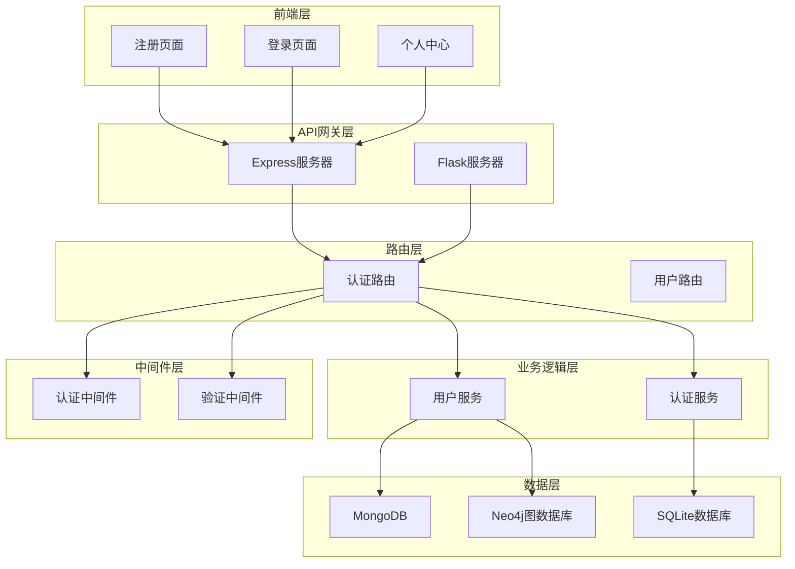
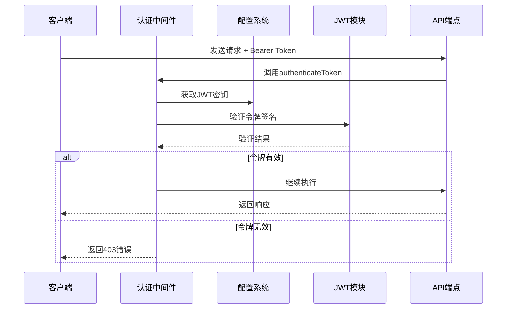
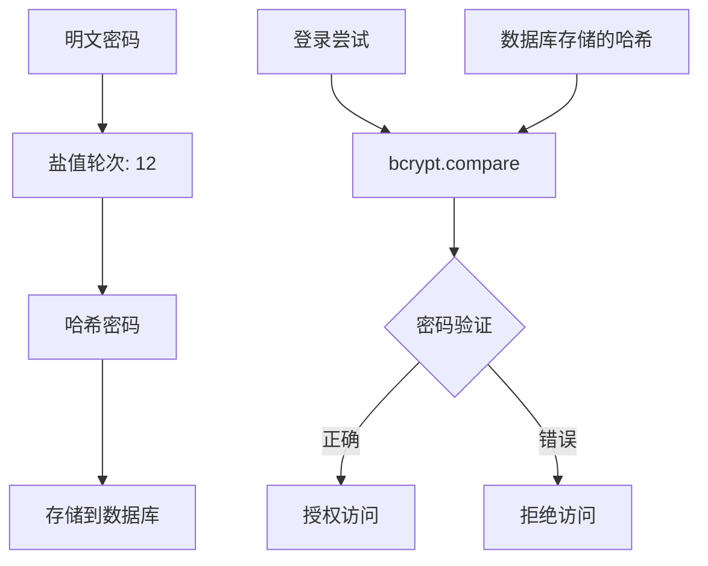
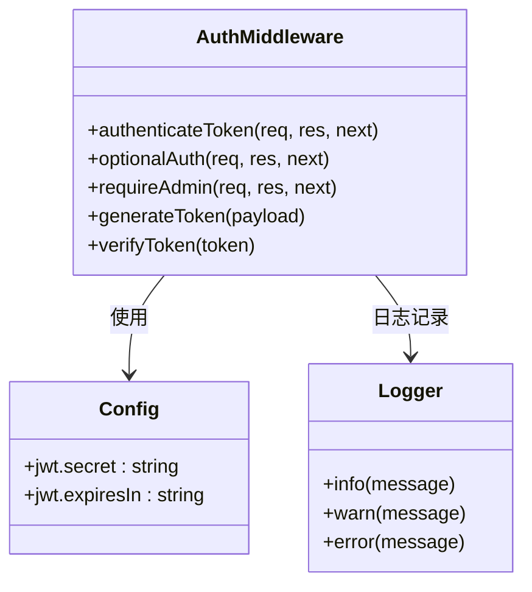

# 认证与用户API

<cite>
**本文档中引用的文件**
- [backend/routes/auth.py](file://backend/routes/auth.py)
- [backend/src/routes/auth.js](file://backend/src/routes/auth.js)
- [backend/src/middleware/auth.js](file://backend/src/middleware/auth.js)
- [backend/models/user.py](file://backend/models/user.py)
- [backend/src/services/userService.js](file://backend/src/services/userService.js)
- [backend/src/middleware/validation.js](file://backend/src/middleware/validation.js)
- [backend/src/config/index.js](file://backend/src/config/index.js)
- [register.html](file://register.html)
- [login.html](file://login.html)
- [profile.html](file://profile.html)
</cite>

## 目录
1. [简介](#简介)
2. [项目架构](#项目架构)
3. [JWT认证机制](#jwt认证机制)
4. [API端点详解](#api端点详解)
5. [密码加密与安全](#密码加密与安全)
6. [中间件系统](#中间件系统)
7. [前端集成示例](#前端集成示例)
8. [安全最佳实践](#安全最佳实践)
9. [故障排除指南](#故障排除指南)
10. [总结](#总结)

## 简介

本文档详细介绍了兵智世界项目的认证与用户管理API系统。该系统采用现代化的JWT（JSON Web Token）认证机制，支持用户注册、登录、个人信息管理、密码修改等功能。系统设计遵循RESTful API原则，提供完整的用户生命周期管理解决方案。

## 项目架构



**图表来源**
- [backend/src/routes/auth.js](file://backend/src/routes/auth.js#L1-L144)
- [backend/routes/auth.py](file://backend/routes/auth.py#L1-L100)
- [backend/src/middleware/auth.js](file://backend/src/middleware/auth.js#L1-L106)

**章节来源**
- [backend/src/routes/auth.js](file://backend/src/routes/auth.js#L1-L144)
- [backend/routes/auth.py](file://backend/routes/auth.py#L1-L100)
- [backend/src/middleware/auth.js](file://backend/src/middleware/auth.js#L1-L106)

## JWT认证机制

### 令牌生成与验证流程



**图表来源**
- [backend/src/middleware/auth.js](file://backend/src/middleware/auth.js#L5-L35)
- [backend/src/config/index.js](file://backend/src/config/index.js#L10-L15)

### 令牌结构与配置

| 配置项 | 默认值 | 环境变量 | 说明 |
|--------|--------|----------|------|
| 密钥 | 'default-secret-key' | JWT_SECRET | JWT签名密钥 |
| 过期时间 | '7d' | JWT_EXPIRES_IN | 令牌有效期 |
| 算法 | HS256 | - | HMAC SHA256算法 |

**章节来源**
- [backend/src/config/index.js](file://backend/src/config/index.js#L10-L15)
- [backend/src/middleware/auth.js](file://backend/src/middleware/auth.js#L85-L95)

## API端点详解

### 1. 用户注册 - POST /api/auth/register

#### 请求参数
| 参数名 | 类型 | 必填 | 说明 | 格式要求 |
|--------|------|------|------|----------|
| username | string | 是 | 用户名 | 3-30个字符，仅字母数字 |
| email | string | 是 | 电子邮箱 | 有效邮箱格式 |
| password | string | 是 | 密码 | 6-128字符 |
| name | string | 否 | 姓名 | 2-50字符 |

#### 请求体示例
```json
{
  "username": "testuser",
  "email": "test@example.com",
  "password": "securePassword123",
  "name": "测试用户"
}
```

#### 响应格式
```json
{
  "success": true,
  "message": "注册成功",
  "data": {
    "user": {
      "id": "64bit_string_id",
      "username": "testuser",
      "email": "test@example.com",
      "profile": {
        "name": "测试用户",
        "avatar": null,
        "preferences": {
          "theme": "light",
          "language": "zh-cn"
        }
      },
      "role": "user"
    },
    "token": "jwt_token_string"
  }
}
```

#### HTTP状态码
- `201 Created`: 注册成功
- `400 Bad Request`: 参数错误或用户名已存在

**章节来源**
- [backend/src/routes/auth.js](file://backend/src/routes/auth.js#L7-L25)
- [backend/src/services/userService.js](file://backend/src/services/userService.js#L10-L85)

### 2. 用户登录 - POST /api/auth/login

#### 请求参数
| 参数名 | 类型 | 必填 | 说明 |
|--------|------|------|------|
| username | string | 是 | 用户名或邮箱 |
| password | string | 是 | 密码 |

#### 请求体示例
```json
{
  "username": "testuser",
  "password": "securePassword123"
}
```

#### 响应格式
```json
{
  "success": true,
  "message": "登录成功",
  "data": {
    "user": {
      "id": "64bit_string_id",
      "username": "testuser",
      "email": "test@example.com",
      "profile": {
        "name": "测试用户",
        "avatar": null,
        "preferences": {
          "theme": "light",
          "language": "zh-cn"
        }
      },
      "role": "user",
      "status": "active",
      "created_at": "2024-01-01T00:00:00.000Z",
      "last_login": "2024-01-01T10:00:00.000Z"
    },
    "token": "jwt_token_string"
  }
}
```

#### HTTP状态码
- `200 OK`: 登录成功
- `401 Unauthorized`: 用户名或密码错误

**章节来源**
- [backend/src/routes/auth.js](file://backend/src/routes/auth.js#L27-L42)
- [backend/src/services/userService.js](file://backend/src/services/userService.js#L87-L155)

### 3. 获取用户信息 - GET /api/auth/profile

#### 请求头
| 头部字段 | 值 | 说明 |
|----------|-----|------|
| Authorization | Bearer {token} | 包含JWT令牌的授权头 |

#### 响应格式
```json
{
  "success": true,
  "data": {
    "id": "64bit_string_id",
    "username": "testuser",
    "email": "test@example.com",
    "profile": {
      "name": "测试用户",
      "avatar": null,
      "preferences": {
        "theme": "light",
        "language": "zh-cn"
      }
    },
    "role": "user",
    "status": "active",
    "created_at": "2024-01-01T00:00:00.000Z",
    "last_login": "2024-01-01T10:00:00.000Z"
  }
}
```

#### HTTP状态码
- `200 OK`: 获取成功
- `401 Unauthorized`: 未提供令牌
- `403 Forbidden`: 令牌无效或已过期

**章节来源**
- [backend/src/routes/auth.js](file://backend/src/routes/auth.js#L44-L55)
- [backend/src/services/userService.js](file://backend/src/services/userService.js#L157-L185)

### 4. 更新用户资料 - PUT /api/auth/profile

#### 请求参数
| 参数名 | 类型 | 必填 | 说明 |
|--------|------|------|------|
| name | string | 否 | 用户姓名 |
| preferences | object | 否 | 用户偏好设置 |
| avatar | string | 否 | 头像URL |

#### 请求体示例
```json
{
  "name": "新名字",
  "preferences": {
    "theme": "dark",
    "language": "zh-cn"
  },
  "avatar": "https://example.com/avatar.jpg"
}
```

#### 响应格式
```json
{
  "success": true,
  "message": "资料更新成功"
}
```

#### HTTP状态码
- `200 OK`: 更新成功
- `400 Bad Request`: 参数错误
- `401 Unauthorized`: 未认证

**章节来源**
- [backend/src/routes/auth.js](file://backend/src/routes/auth.js#L57-L72)
- [backend/src/services/userService.js](file://backend/src/services/userService.js#L187-L220)

### 5. 修改密码 - PUT /api/auth/change-password

#### 请求参数
| 参数名 | 类型 | 必填 | 说明 |
|--------|------|------|------|
| oldPassword | string | 是 | 原密码 |
| newPassword | string | 是 | 新密码 |

#### 请求体示例
```json
{
  "oldPassword": "oldSecurePassword123",
  "newPassword": "newSecurePassword456"
}
```

#### 响应格式
```json
{
  "success": true,
  "message": "密码修改成功"
}
```

#### HTTP状态码
- `200 OK`: 修改成功
- `400 Bad Request`: 参数错误或原密码错误
- `401 Unauthorized`: 未认证

**章节来源**
- [backend/src/routes/auth.js](file://backend/src/routes/auth.js#L74-L95)
- [backend/src/services/userService.js](file://backend/src/services/userService.js#L222-L287)

### 6. 刷新令牌 - POST /api/auth/refresh

#### 请求头
| 头部字段 | 值 | 说明 |
|----------|-----|------|
| Authorization | Bearer {token} | 当前有效令牌 |

#### 响应格式
```json
{
  "success": true,
  "message": "令牌刷新成功",
  "data": {
    "token": "new_jwt_token_string"
  }
}
```

#### HTTP状态码
- `200 OK`: 刷新成功
- `400 Bad Request`: 刷新失败
- `401 Unauthorized`: 当前令牌无效

**章节来源**
- [backend/src/routes/auth.js](file://backend/src/routes/auth.js#L97-L115)
- [backend/src/middleware/auth.js](file://backend/src/middleware/auth.js#L85-L95)

### 7. 退出登录 - POST /api/auth/logout

#### 请求头
| 头部字段 | 值 | 说明 |
|----------|-----|------|
| Authorization | Bearer {token} | 当前有效令牌 |

#### 响应格式
```json
{
  "success": true,
  "message": "退出登录成功"
}
```

#### HTTP状态码
- `200 OK`: 退出成功
- `401 Unauthorized`: 未认证

**章节来源**
- [backend/src/routes/auth.js](file://backend/src/routes/auth.js#L117-L130)

## 密码加密与安全

### bcrypt密码加密

系统使用bcryptjs库进行密码加密，确保密码安全存储：



**图表来源**
- [backend/src/services/userService.js](file://backend/src/services/userService.js#L237-L287)

### 密码强度要求

| 要求 | 规则 | 说明 |
|------|------|------|
| 最小长度 | 6字符 | 至少6个字符 |
| 最大长度 | 128字符 | 不超过128个字符 |
| 字符类型 | 无限制 | 支持任何字符组合 |
| 特殊要求 | 无 | 无需特定字符类型 |

**章节来源**
- [backend/src/middleware/validation.js](file://backend/src/middleware/validation.js#L35-L50)
- [backend/src/services/userService.js](file://backend/src/services/userService.js#L237-L287)

## 中间件系统

### 认证中间件



**图表来源**
- [backend/src/middleware/auth.js](file://backend/src/middleware/auth.js#L1-L106)

### 验证中间件

系统使用Joi库进行请求数据验证：

| 验证规则 | 应用场景 | 错误处理 |
|----------|----------|----------|
| 用户名格式 | 注册、登录 | 返回具体字段错误 |
| 密码长度 | 所有涉及密码的接口 | 统一错误消息 |
| 邮箱格式 | 注册、登录 | 验证邮箱有效性 |
| 数字范围 | 年份、限制数量 | 范围验证错误 |

**章节来源**
- [backend/src/middleware/validation.js](file://backend/src/middleware/validation.js#L1-L178)
- [backend/src/middleware/auth.js](file://backend/src/middleware/auth.js#L1-L106)

## 前端集成示例

### curl命令示例

#### 用户注册
```bash
curl -X POST http://localhost:3001/api/auth/register \
  -H "Content-Type: application/json" \
  -d '{
    "username": "testuser",
    "email": "test@example.com",
    "password": "securePassword123",
    "name": "测试用户"
  }'
```

#### 用户登录
```bash
curl -X POST http://localhost:3001/api/auth/login \
  -H "Content-Type: application/json" \
  -d '{
    "username": "testuser",
    "password": "securePassword123"
  }'
```

#### 获取用户信息
```bash
curl -X GET http://localhost:3001/api/auth/profile \
  -H "Authorization: Bearer YOUR_JWT_TOKEN"
```

#### 更新用户资料
```bash
curl -X PUT http://localhost:3001/api/auth/profile \
  -H "Content-Type: application/json" \
  -H "Authorization: Bearer YOUR_JWT_TOKEN" \
  -d '{
    "name": "新名字",
    "preferences": {
      "theme": "dark",
      "language": "zh-cn"
    }
  }'
```

### JavaScript集成示例

前端JavaScript集成的关键要点：

```javascript
// 保存令牌到localStorage
localStorage.setItem('authToken', token);

// 发送带有认证头的请求
const response = await fetch('/api/auth/profile', {
  headers: {
    'Authorization': `Bearer ${authToken}`
  }
});
```

**章节来源**
- [register.html](file://register.html#L50-L85)
- [login.html](file://login.html#L45-L80)
- [profile.html](file://profile.html#L50-L120)

## 安全最佳实践

### 令牌管理

1. **短期令牌**: JWT令牌设置合理的过期时间（默认7天）
2. **自动刷新**: 提供令牌刷新机制避免频繁重新登录
3. **安全存储**: 前端使用localStorage安全存储令牌
4. **传输安全**: 强制使用HTTPS传输敏感数据

### 输入验证

1. **严格验证**: 使用Joi库进行全面的数据验证
2. **格式检查**: 验证用户名、邮箱、密码格式
3. **长度限制**: 设置合理的输入长度限制
4. **特殊字符**: 允许特殊字符但进行适当过滤

### 错误处理

1. **信息脱敏**: 不向客户端暴露详细的错误信息
2. **日志记录**: 详细记录安全相关事件
3. **统一响应**: 使用统一的错误响应格式
4. **状态码规范**: 使用标准HTTP状态码

### 数据保护

1. **密码加密**: 使用bcrypt进行密码哈希
2. **敏感信息**: 不在日志中记录敏感信息
3. **传输加密**: 强制HTTPS协议
4. **CORS配置**: 合理配置跨域资源共享

**章节来源**
- [backend/src/middleware/auth.js](file://backend/src/middleware/auth.js#L5-L35)
- [backend/src/middleware/validation.js](file://backend/src/middleware/validation.js#L1-L50)

## 故障排除指南

### 常见问题及解决方案

#### 1. 令牌验证失败 (403)
**症状**: 接收到"访问令牌无效或已过期"错误
**原因**: 
- 令牌已过期
- 令牌格式不正确
- 密钥不匹配

**解决方案**:
- 检查令牌是否在有效期内
- 确认Authorization头格式正确
- 验证JWT_SECRET配置

#### 2. 登录失败 (401)
**症状**: 用户名或密码错误
**原因**:
- 用户名不存在
- 密码不匹配
- 账户被禁用

**解决方案**:
- 验证用户名是否存在
- 确认密码正确性
- 检查账户状态

#### 3. 注册失败
**症状**: 用户名或邮箱已存在
**原因**:
- 用户名重复
- 邮箱重复
- 数据库约束冲突

**解决方案**:
- 使用不同的用户名
- 使用不同的邮箱地址
- 检查数据库索引

#### 4. 前端认证问题
**症状**: 无法保持登录状态
**原因**:
- 令牌存储问题
- 浏览器Cookie设置
- 跨域问题

**解决方案**:
- 检查localStorage设置
- 验证CORS配置
- 确认HTTPS设置

### 调试技巧

1. **浏览器开发者工具**: 检查网络请求和响应
2. **控制台日志**: 查看JavaScript错误信息
3. **服务器日志**: 分析后端错误日志
4. **Postman测试**: 单独测试API端点

**章节来源**
- [backend/src/middleware/auth.js](file://backend/src/middleware/auth.js#L5-L35)
- [profile.html](file://profile.html#L120-L180)

## 总结

兵智世界的认证与用户管理API系统提供了完整的用户生命周期管理解决方案。系统采用现代的JWT认证机制，结合bcrypt密码加密、严格的输入验证和完善的错误处理，确保了系统的安全性、可靠性和易用性。

### 主要特性

1. **现代化认证**: 基于JWT的无状态认证机制
2. **密码安全**: bcrypt加密确保密码安全存储
3. **输入验证**: Joi库提供全面的数据验证
4. **错误处理**: 统一的错误响应和日志记录
5. **前端集成**: 完整的前端页面和JavaScript示例
6. **安全最佳实践**: 多层次的安全防护措施

### 技术优势

- **可扩展性**: 模块化设计便于功能扩展
- **性能优化**: 合理的缓存策略和数据库设计
- **开发友好**: 清晰的API文档和示例代码
- **安全可靠**: 多重安全防护和错误处理

该系统为兵智世界项目提供了坚实的基础认证能力，支持用户注册、登录、个人信息管理等核心功能，同时具备良好的安全性和可维护性。