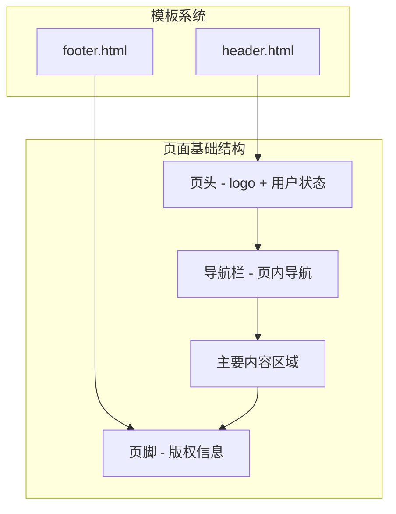
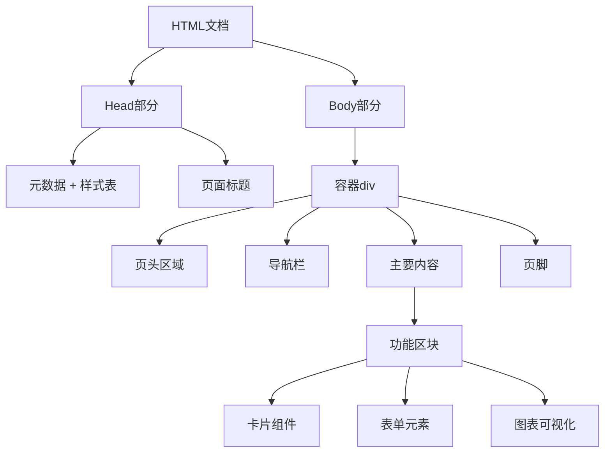
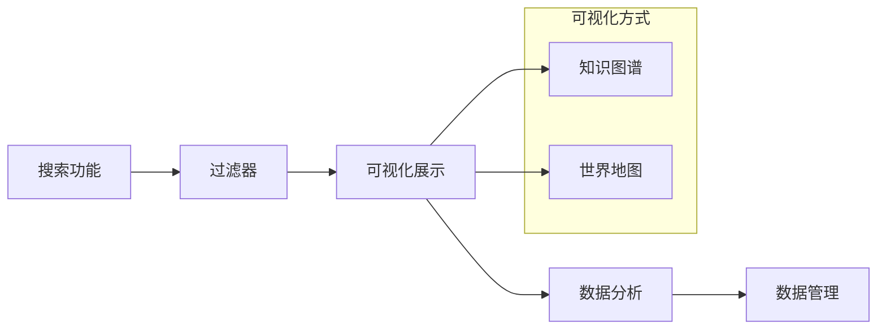
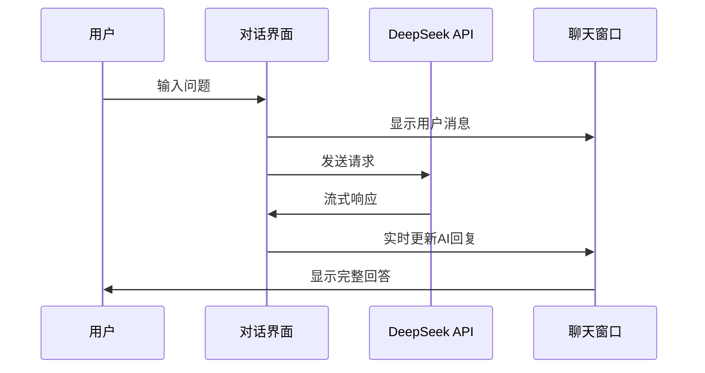
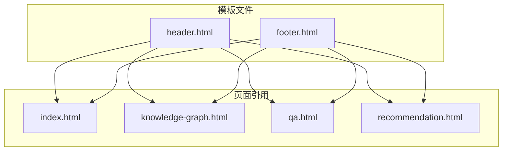
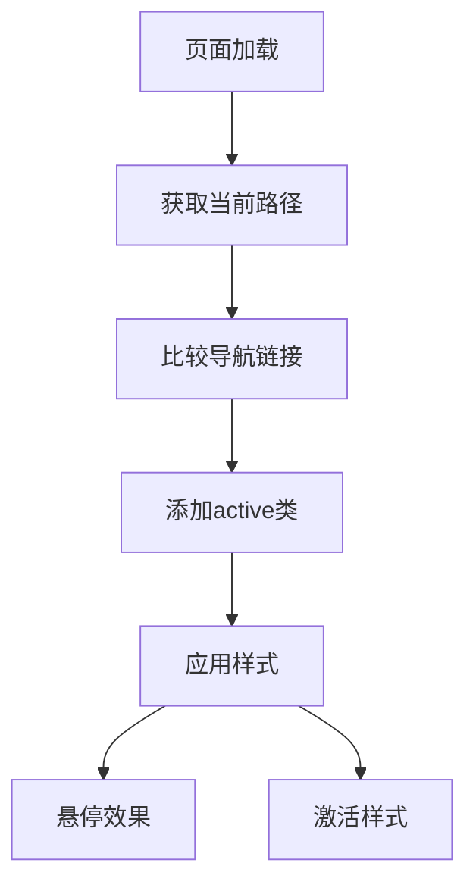
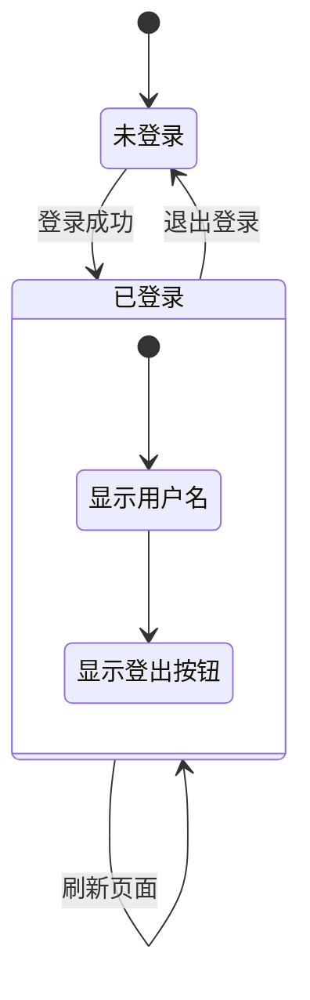
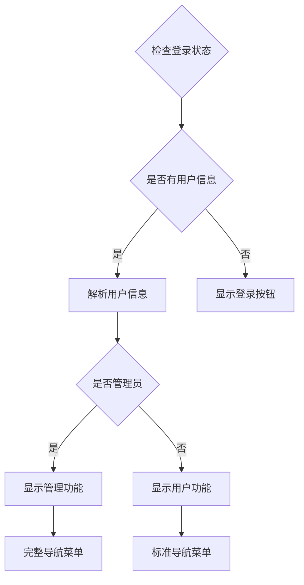
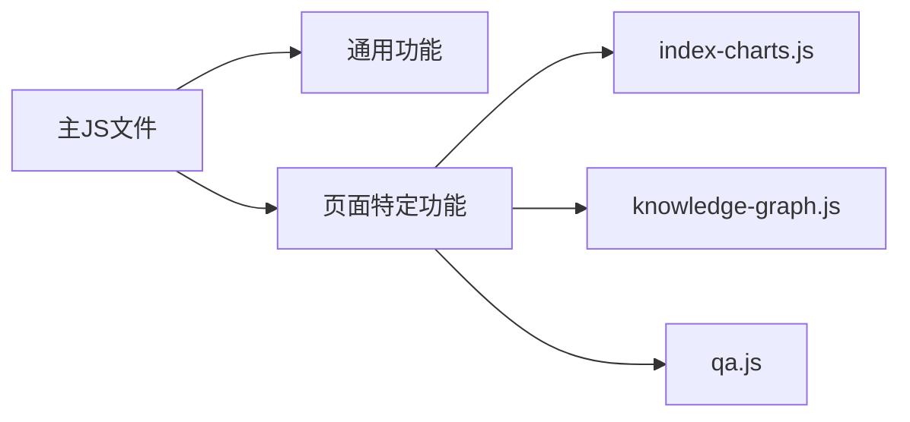

# 前端UI结构

<cite>
**本文档引用的文件**
- [index.html](file://index.html)
- [knowledge-graph.html](file://knowledge-graph.html)
- [qa.html](file://qa.html)
- [recommendation.html](file://recommendation.html)
- [templates/header.html](file://templates/header.html)
- [templates/footer.html](file://templates/footer.html)
- [styles/common.css](file://styles/common.css)
- [styles/index.css](file://styles/index.css)
- [styles/knowledge-graph.css](file://styles/knowledge-graph.css)
- [styles/qa.css](file://styles/qa.css)
- [styles/recommendation.css](file://styles/recommendation.css)
- [scripts/common.js](file://scripts/common.js)
- [scripts/auth.js](file://scripts/auth.js)
- [scripts/index-charts.js](file://scripts/index-charts.js)
- [scripts/knowledge-graph.js](file://scripts/knowledge-graph.js)
- [scripts/qa.js](file://scripts/qa.js)
</cite>

## 目录
1. [项目概述](#项目概述)
2. [页面架构设计](#页面架构设计)
3. [核心页面分析](#核心页面分析)
4. [模板系统](#模板系统)
5. [导航与状态管理](#导航与状态管理)
6. [用户角色与UI差异](#用户角色与ui差异)
7. [响应式设计](#响应式设计)
8. [可访问性考虑](#可访问性考虑)
9. [性能优化建议](#性能优化建议)
10. [总结](#总结)

## 项目概述

兵智世界前端采用模块化的HTML页面架构，结合CSS样式系统和JavaScript交互功能，构建了一个完整的武器装备知识图谱智能平台。整个系统围绕四个核心页面展开：主页面、知识图谱页、问答页和推荐页，每个页面都具有独特的功能定位和视觉风格。

## 页面架构设计

### 整体架构模式

系统采用统一的页面框架设计，所有页面都遵循相同的结构模式：



**图表来源**
- [index.html](file://index.html#L1-L234)
- [templates/header.html](file://templates/header.html#L1-L18)
- [templates/footer.html](file://templates/footer.html#L1-L4)

### 页面布局层次

每个页面都采用语义化HTML标签组织内容，确保良好的可读性和SEO优化：



**节来源**
- [index.html](file://index.html#L1-L234)
- [knowledge-graph.html](file://knowledge-graph.html#L1-L603)
- [qa.html](file://qa.html#L1-L78)
- [recommendation.html](file://recommendation.html#L1-L119)

## 核心页面分析

### 主页面（index.html）

主页面作为系统的入口页面，采用现代化的卡片布局和轮播展示：

#### 页面特色功能

1. **图片轮播系统**：使用Swiper.js实现自动轮播，展示各类武器装备
2. **仪表盘统计**：集成Chart.js图表，展示系统使用情况和统计数据
3. **快速入口**：提供五个主要功能的快捷链接

#### 技术实现要点

- **轮播组件**：通过JavaScript动态控制轮播效果和武器详情展示
- **图表可视化**：集成多种类型的图表，包括柱状图、折线图、雷达图等
- **响应式设计**：确保在移动设备上的良好体验

**节来源**
- [index.html](file://index.html#L40-L120)
- [scripts/index-charts.js](file://scripts/index-charts.js#L1-L199)

### 知识图谱页（knowledge-graph.html）

知识图谱页是系统的核心功能页面，专注于武器装备的知识关联展示：

#### 核心功能模块



**图表来源**
- [knowledge-graph.html](file://knowledge-graph.html#L40-L150)
- [scripts/knowledge-graph.js](file://scripts/knowledge-graph.js#L1-L199)

#### 技术架构特点

- **D3.js可视化**：使用D3.js创建复杂的知识图谱和世界地图
- **Neo4j集成**：通过Neo4j驱动程序连接知识图谱数据库
- **多视图切换**：支持图谱视图和地图视图的无缝切换

**节来源**
- [knowledge-graph.html](file://knowledge-graph.html#L150-L300)
- [styles/knowledge-graph.css](file://styles/knowledge-graph.css#L1-L199)

### 问答页（qa.html）

问答页提供智能对话功能，集成DeepSeek API实现AI问答：

#### 对话界面设计



**图表来源**
- [qa.html](file://qa.html#L30-L50)
- [scripts/qa.js](file://scripts/qa.js#L1-L199)

#### 功能特性

- **Markdown渲染**：支持富文本格式的消息显示
- **流式响应**：模拟真实的对话体验
- **代码高亮**：对技术内容进行语法高亮显示

**节来源**
- [qa.html](file://qa.html#L50-L78)
- [scripts/qa.js](file://scripts/qa.js#L100-L199)

### 推荐页（recommendation.html）

推荐页展示基于用户兴趣的个性化内容推荐：

#### 内容卡片设计

页面采用卡片式布局展示推荐内容，每张卡片包含：
- 标题和标签分类
- 简短描述和评分信息
- 阅读人数统计
- "阅读全文"链接

**节来源**
- [recommendation.html](file://recommendation.html#L30-L119)

## 模板系统

### 复用机制设计

系统采用模板复用机制，通过外部HTML文件实现代码共享：



**图表来源**
- [templates/header.html](file://templates/header.html#L1-L18)
- [templates/footer.html](file://templates/footer.html#L1-L4)

### 动态加载机制

除了静态模板外，问答页还实现了动态加载机制：

```javascript
// 动态加载头部和底部
fetch('templates/header.html')
    .then(response => response.text())
    .then(data => {
        document.getElementById('header-placeholder').innerHTML = data;
    });

fetch('templates/footer.html')
    .then(response => response.text())
    .then(data => {
        document.getElementById('footer-placeholder').innerHTML = data;
    });
```

**节来源**
- [qa.html](file://qa.html#L60-L78)

## 导航与状态管理

### 导航激活机制

系统通过JavaScript实现导航链接的动态激活：



**图表来源**
- [scripts/common.js](file://scripts/common.js#L1-L17)

### 用户状态管理

通过localStorage实现用户状态的持久化管理：



**图表来源**
- [scripts/auth.js](file://scripts/auth.js#L1-L62)

**节来源**
- [scripts/common.js](file://scripts/common.js#L1-L17)
- [scripts/auth.js](file://scripts/auth.js#L1-L62)

## 用户角色与UI差异

### 角色识别机制

系统通过用户状态判断用户角色，并相应调整UI呈现：

#### 普通用户界面
- 基础功能访问权限
- 标准导航菜单
- 通用内容展示

#### 管理员界面
- 数据管理功能可见
- 高级操作权限
- 管理工具可用

### 权限控制实现



**图表来源**
- [scripts/auth.js](file://scripts/auth.js#L15-L45)

**节来源**
- [scripts/auth.js](file://scripts/auth.js#L15-L62)

## 响应式设计

### 断点策略

系统采用移动优先的设计理念，通过CSS媒体查询实现响应式布局：

| 设备类型 | 断点范围 | 布局调整 |
|---------|---------|---------|
| 桌面端 | ≥1024px | 完整网格布局 |
| 平板端 | 768px-1023px | 垂直导航菜单 |
| 移动端 | ≤767px | 折叠导航菜单 |

### 关键响应式特性

- **导航栏适配**：移动端自动切换为垂直布局
- **卡片网格**：根据屏幕宽度调整列数
- **字体缩放**：确保在小屏幕上文字可读

**节来源**
- [styles/common.css](file://styles/common.css#L150-L199)

## 可访问性考虑

### 语义化标记

所有页面都采用语义化HTML标签，提升可访问性：

```html
<!-- 主要内容区域 -->
<main>
    <h1>页面标题</h1>
    <section>
        <h2>功能标题</h2>
        <article>
            <h3>内容标题</h3>
            <p>段落内容</p>
        </article>
    </section>
</main>
```

### 键盘导航支持

- **Tab键导航**：所有交互元素均可通过Tab键访问
- **快捷键支持**：问答页面支持Ctrl+Enter发送消息
- **焦点指示**：清晰的键盘焦点指示器

### 屏幕阅读器友好

- **ARIA标签**：重要交互元素添加ARIA属性
- **语义标题**：合理的标题层级结构
- **替代文本**：所有图片都有适当的alt属性

## 性能优化建议

### 资源加载优化

1. **延迟加载**：非关键资源采用异步加载
2. **CDN加速**：第三方库使用CDN服务
3. **缓存策略**：合理设置HTTP缓存头

### 代码分割



### 性能监控

- **加载时间监控**：跟踪关键资源加载时间
- **交互延迟测量**：监控用户操作响应时间
- **内存使用优化**：及时清理不需要的DOM元素

## 总结

兵智世界的前端UI结构展现了现代Web应用的最佳实践：

### 设计优势

1. **模块化架构**：清晰的页面分离和模板复用
2. **用户体验**：流畅的交互和响应式设计
3. **技术先进**：采用最新的Web技术和API集成
4. **可维护性**：良好的代码组织和注释规范

### 改进建议

1. **性能优化**：进一步减少首屏加载时间
2. **可访问性增强**：完善ARIA标签和键盘导航
3. **国际化支持**：添加多语言切换功能
4. **离线功能**：考虑添加PWA特性

该前端架构为武器装备知识图谱平台提供了坚实的基础，既满足了当前的功能需求，也为未来的扩展预留了充足的空间。