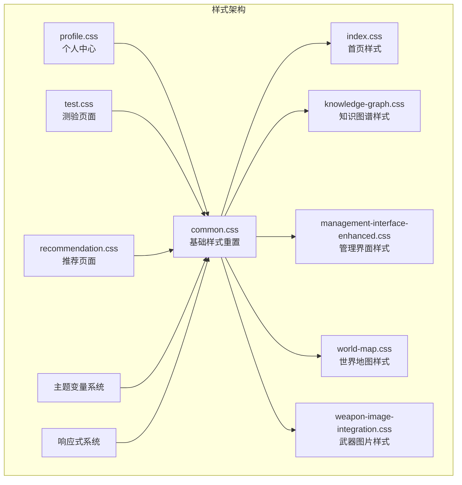
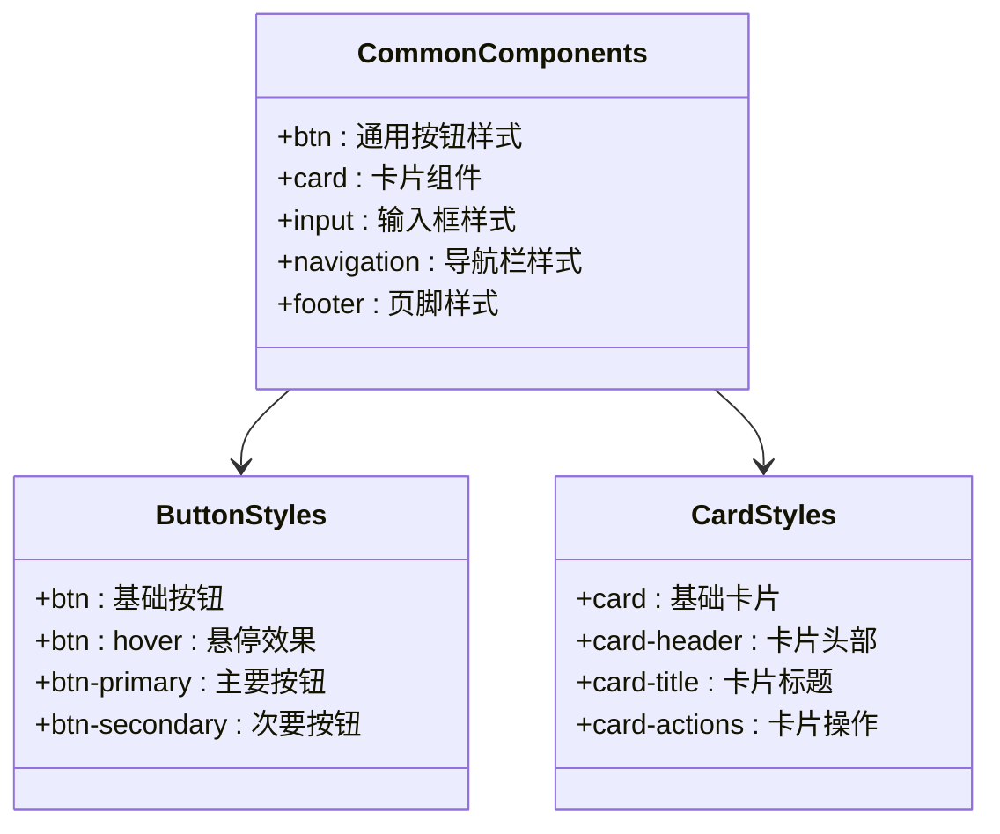
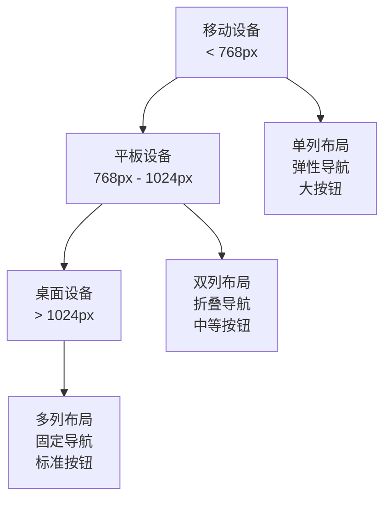
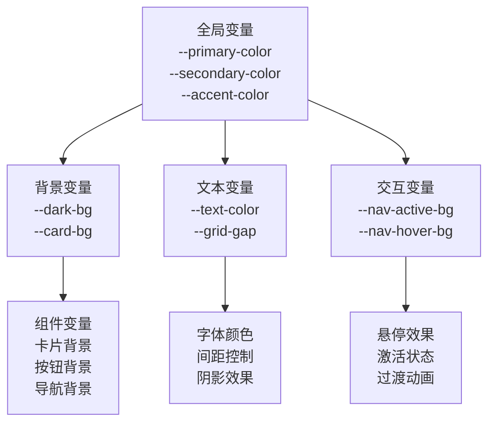
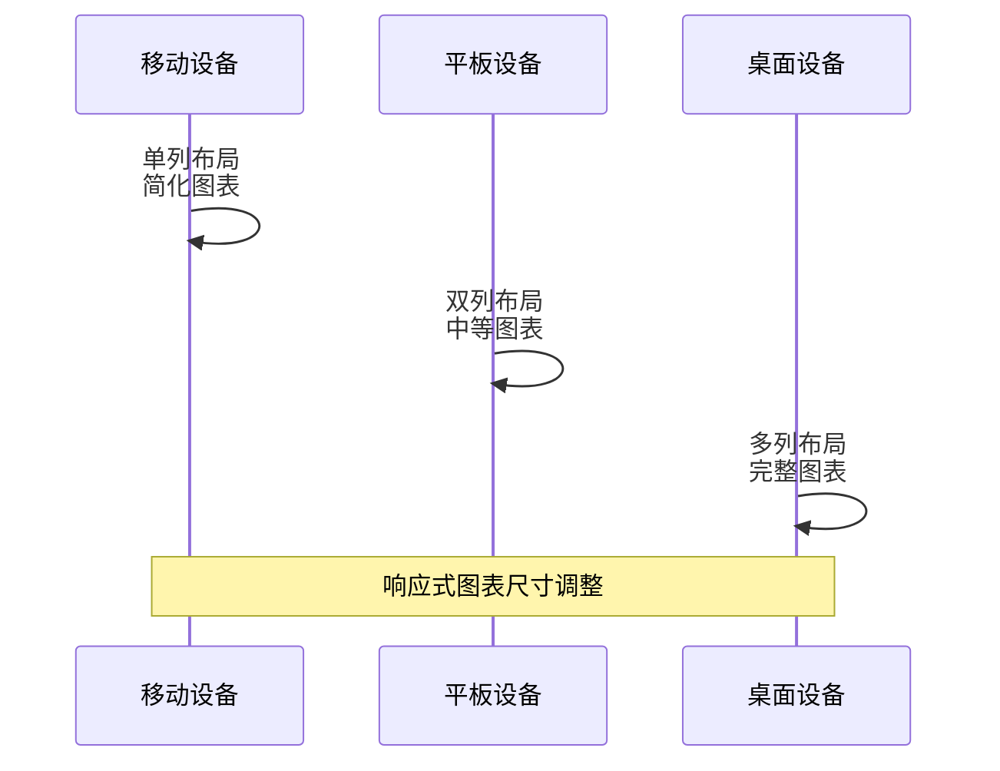
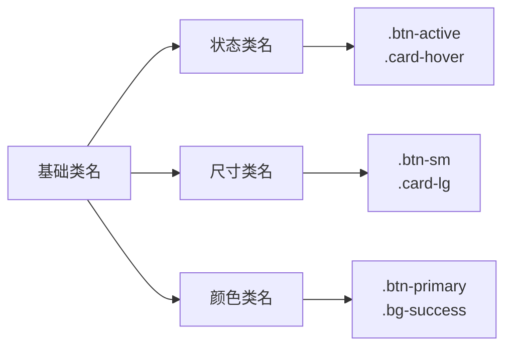
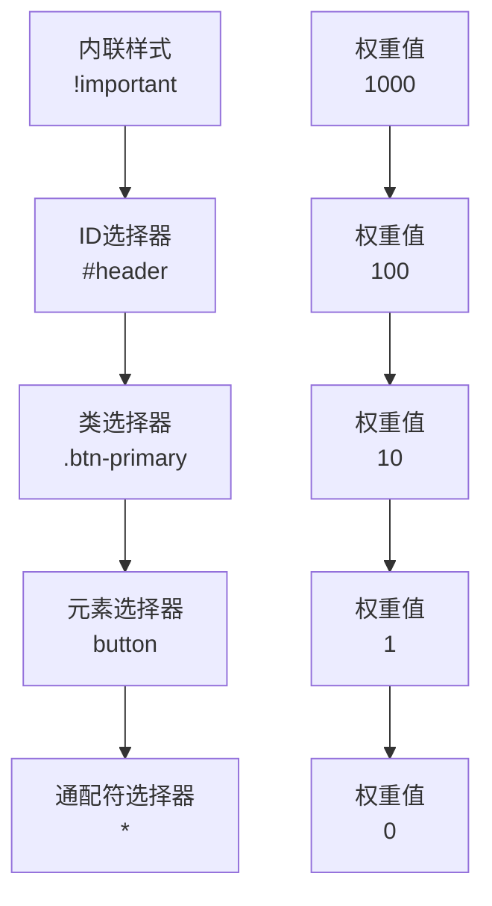

# 样式管理

<cite>
**本文档引用的文件**
- [common.css](file://styles/common.css)
- [knowledge-graph.css](file://styles/knowledge-graph.css)
- [weapon-image-integration.css](file://styles/weapon-image-integration.css)
- [management-interface-enhanced.css](file://styles/management-interface-enhanced.css)
- [world-map.css](file://styles/world-map.css)
- [index.css](file://styles/index.css)
- [profile.css](file://styles/profile.css)
- [recommendation.css](file://styles/recommendation.css)
- [test.css](file://styles/test.css)
- [index.html](file://index.html)
- [knowledge-graph.html](file://knowledge-graph.html)
</cite>

## 目录
1. [概述](#概述)
2. [CSS架构设计](#css架构设计)
3. [基础样式重置系统](#基础样式重置系统)
4. [响应式布局实现](#响应式布局实现)
5. [组件级样式封装](#组件级样式封装)
6. [主题管理系统](#主题管理系统)
7. [关键模块样式分析](#关键模块样式分析)
8. [CSS类名命名规范](#css类名命名规范)
9. [选择器优先级控制](#选择器优先级控制)
10. [性能优化策略](#性能优化策略)
11. [样式冲突解决方案](#样式冲突解决方案)
12. [维护建议](#维护建议)

## 概述

兵智世界前端采用模块化的CSS架构设计，通过统一的主题变量系统、清晰的模块划分和响应式布局策略，构建了一个完整的样式管理体系。该系统涵盖了从基础样式重置到复杂可视化组件的全方位样式解决方案。

## CSS架构设计

### 模块化架构

系统采用模块化CSS架构，每个功能模块拥有独立的样式文件，确保样式的可维护性和复用性：



**图表来源**
- [common.css](file://styles/common.css#L1-L76)
- [index.css](file://styles/index.css#L1-L76)
- [knowledge-graph.css](file://styles/knowledge-graph.css#L1-L50)

### 样式文件组织结构

| 文件名 | 主要功能 | 核心特性 |
|--------|----------|----------|
| common.css | 基础样式重置和通用组件 | 变量系统、导航栏、卡片组件 |
| index.css | 首页特定样式 | 仪表板布局、图表样式 |
| knowledge-graph.css | 知识图谱可视化 | D3.js集成、交互式图表 |
| management-interface-enhanced.css | 管理界面增强 | 动画效果、状态管理 |
| world-map.css | 世界地图可视化 | SVG地图、地理信息展示 |
| weapon-image-integration.css | 武器图片管理 | 图片网格、编辑功能 |

**章节来源**
- [common.css](file://styles/common.css#L1-L421)
- [index.css](file://styles/index.css#L1-L331)

## 基础样式重置系统

### CSS变量系统

系统采用CSS自定义属性（CSS Variables）作为主题管理的核心，提供了统一的颜色变量和间距变量：

```css
:root {
    --primary-color: #2c3e50;
    --secondary-color: #3498db;
    --accent-color: #1abc9c;
    --dark-bg: #0a0e17;
    --card-bg: #131a27;
    --text-color: #e0e0e0;
    --grid-gap: 1.5rem;
    --nav-active-bg: #1abc9c;
    --nav-hover-bg: rgba(52, 152, 219, 0.7);
}
```

### 通用样式重置

采用全局重置策略，确保跨浏览器的一致性：

```css
* {
    margin: 0;
    padding: 0;
    box-sizing: border-box;
    font-family: 'Segoe UI', Tahoma, Geneva, Verdana, sans-serif;
}

body {
    background-color: var(--dark-bg);
    color: var(--text-color);
    line-height: 1.6;
}
```

### 通用组件样式

系统定义了通用的UI组件样式，包括按钮、卡片、输入框等：



**图表来源**
- [common.css](file://styles/common.css#L78-L147)
- [common.css](file://styles/common.css#L210-L225)

**章节来源**
- [common.css](file://styles/common.css#L1-L421)

## 响应式布局实现

### Flexbox和Grid布局

系统广泛使用Flexbox和CSS Grid进行布局设计：

#### 首页仪表板布局
```css
.dashboard {
    display: grid;
    grid-template-columns: repeat(auto-fit, minmax(300px, 1fr));
    gap: var(--grid-gap);
}
```

#### 响应式导航栏
```css
@media (max-width: 768px) {
    nav ul {
        flex-direction: column;
        align-items: center;
        gap: 1rem;
    }
    
    nav ul li a {
        width: 100%;
        justify-content: center;
    }
}
```

### 媒体查询策略

采用移动优先的设计理念，通过媒体查询实现响应式适配：



**图表来源**
- [common.css](file://styles/common.css#L155-L165)
- [index.css](file://styles/index.css#L290-L310)

**章节来源**
- [common.css](file://styles/common.css#L155-L165)
- [index.css](file://styles/index.css#L290-L331)

## 组件级样式封装

### 卡片组件系统

系统实现了统一的卡片组件系统，支持多种变体：

```css
.card {
    background-color: var(--card-bg);
    border-radius: 8px;
    padding: 1.5rem;
    box-shadow: 0 4px 6px rgba(0, 0, 0, 0.1);
}

.card-header {
    display: flex;
    justify-content: space-between;
    align-items: center;
    margin-bottom: 1rem;
    color: var(--secondary-color);
}
```

### 按钮组件系统

提供多种按钮样式和状态：

```css
.btn {
    display: inline-block;
    padding: 0.5rem 1rem;
    background-color: var(--secondary-color);
    color: white;
    text-decoration: none;
    border-radius: 4px;
    transition: background-color 0.3s;
}

.btn:hover {
    background-color: var(--accent-color);
}
```

**章节来源**
- [common.css](file://styles/common.css#L210-L225)
- [common.css](file://styles/common.css#L83-L94)

## 主题管理系统

### CSS变量层次结构

系统采用分层的CSS变量体系：



**图表来源**
- [common.css](file://styles/common.css#L3-L12)

### 暗色主题适配

系统自动适配用户的暗色主题偏好：

```css
@media (prefers-color-scheme: dark) {
    .management-section {
        background: linear-gradient(135deg, rgba(52, 152, 219, 0.08) 0%, rgba(155, 89, 182, 0.08) 100%);
        border-color: rgba(52, 152, 219, 0.2);
    }
}
```

**章节来源**
- [common.css](file://styles/common.css#L3-L12)
- [management-interface-enhanced.css](file://styles/management-interface-enhanced.css#L480-L490)

## 关键模块样式分析

### 知识图谱可视化（knowledge-graph.css）

#### D3.js集成样式

知识图谱模块专门针对D3.js可视化进行了样式优化：

```css
.graph-visualization {
    width: 100%;
    height: 100%;
    min-height: 500px;
    background-color: rgba(255, 255, 255, 0.02);
    border-radius: 4px;
    position: relative;
    overflow: hidden;
}
```

#### 节点和连线样式

```css
.node {
    cursor: pointer;
    stroke: #fff;
    stroke-width: 1.5px;
}

.node:hover {
    stroke: var(--secondary-color);
    stroke-width: 2.5px;
}

.link {
    stroke: rgba(255, 255, 255, 0.2);
    stroke-width: 1.5px;
}
```

#### 响应式图表系统



**图表来源**
- [knowledge-graph.css](file://styles/knowledge-graph.css#L15-L25)
- [knowledge-graph.css](file://styles/knowledge-graph.css#L280-L290)

**章节来源**
- [knowledge-graph.css](file://styles/knowledge-graph.css#L1-L799)

### 武器图片集成（weapon-image-integration.css）

#### 图片网格布局

采用CSS Grid实现响应式图片网格：

```css
.weapon-images-grid {
    display: grid;
    grid-template-columns: repeat(auto-fill, minmax(200px, 1fr));
    gap: 15px;
    margin-top: 15px;
}
```

#### 图片卡片交互效果

```css
.weapon-image-card {
    background: white;
    border-radius: 8px;
    overflow: hidden;
    box-shadow: 0 2px 8px rgba(0,0,0,0.1);
    transition: all 0.3s ease;
    border: 1px solid #e9ecef;
}

.weapon-image-card:hover {
    transform: translateY(-2px);
    box-shadow: 0 4px 15px rgba(0,0,0,0.15);
}
```

**章节来源**
- [weapon-image-integration.css](file://styles/weapon-image-integration.css#L100-L120)

### 管理界面增强（management-interface-enhanced.css）

#### 动画和过渡效果

系统大量使用CSS动画提升用户体验：

```css
.item-row {
    animation: fadeInUp 0.3s ease forwards;
    opacity: 0;
    transform: translateY(20px);
}

@keyframes fadeInUp {
    to {
        opacity: 1;
        transform: translateY(0);
    }
}
```

#### 状态管理样式

```css
.edit-item-btn {
    background: linear-gradient(135deg, #3498db, #2980b9);
    color: white;
    box-shadow: 0 2px 8px rgba(52, 152, 219, 0.3);
}

.delete-item-btn {
    background: linear-gradient(135deg, #e74c3c, #c0392b);
    color: white;
    box-shadow: 0 2px 8px rgba(231, 76, 60, 0.3);
}
```

**章节来源**
- [management-interface-enhanced.css](file://styles/management-interface-enhanced.css#L490-L521)

### 世界地图（world-map.css）

#### SVG地图样式

针对SVG地图元素的专门样式：

```css
.country {
    transition: all 0.3s ease;
}

.country:hover {
    fill: #2e8b57 !important;
    stroke: #fff;
    stroke-width: 1.5;
    cursor: pointer;
}
```

#### 地图工具提示

```css
.map-tooltip {
    position: absolute;
    background: rgba(0, 0, 0, 0.9) !important;
    color: white !important;
    padding: 8px 12px !important;
    border-radius: 6px !important;
    font-size: 12px !important;
    font-weight: 500 !important;
    pointer-events: none !important;
    z-index: 1000 !important;
    box-shadow: 0 4px 12px rgba(0, 0, 0, 0.3);
}
```

**章节来源**
- [world-map.css](file://styles/world-map.css#L40-L60)
- [world-map.css](file://styles/world-map.css#L120-L130)

## CSS类名命名规范

### 命名约定

系统采用简洁明了的类名命名规范：

| 类名类型 | 命名规则 | 示例 | 使用场景 |
|----------|----------|------|----------|
| 基础组件 | 单词小写 | `.btn`, `.card`, `.input` | 通用UI组件 |
| 状态修饰 | `-active`, `-hover`, `-disabled` | `.btn-primary`, `.card-header` | 组件状态 |
| 尺寸修饰 | `-sm`, `-lg`, `-xl` | `.btn-sm`, `.card-lg` | 组件尺寸 |
| 颜色修饰 | `-{color}` | `.btn-primary`, `.bg-success` | 颜色变体 |

### 组件层次结构



**图表来源**
- [common.css](file://styles/common.css#L83-L94)
- [index.css](file://styles/index.css#L60-L68)

### 命名一致性原则

1. **语义化命名**：类名反映其功能而非外观
2. **层级化组织**：相关功能使用共同前缀
3. **避免过度嵌套**：保持选择器简洁
4. **状态分离**：状态类与功能类分离

**章节来源**
- [common.css](file://styles/common.css#L83-L94)
- [index.css](file://styles/index.css#L60-L78)

## 选择器优先级控制

### 优先级计算策略

系统采用明确的选择器优先级策略，避免样式冲突：



### 选择器最佳实践

1. **避免使用ID选择器**：除非绝对必要
2. **使用语义化类名**：提高代码可读性
3. **最小化嵌套**：保持选择器简洁
4. **合理使用!important**：仅在极端情况下使用

### 样式隔离机制

```css
/* 模块化样式隔离 */
.knowledge-graph-container {
    /* 知识图谱专用样式 */
}

.management-section {
    /* 管理界面专用样式 */
}
```

**章节来源**
- [knowledge-graph.css](file://styles/knowledge-graph.css#L1-L10)
- [management-interface-enhanced.css](file://styles/management-interface-enhanced.css#L1-L10)

## 性能优化策略

### CSS加载优化

#### 模块化加载

```html
<!-- 按需加载样式 -->
<link rel="stylesheet" href="styles/common.css">
<link rel="stylesheet" href="styles/[module].css">
```

#### 关键CSS内联

将首屏关键CSS内联到HTML中：

```html
<style>
    /* 首屏关键样式 */
    body { margin: 0; }
    .container { max-width: 1400px; }
</style>
```

### 选择器优化

#### 避免深层嵌套

```css
/* 不推荐 */
.container .content .article .title h1 {
    font-size: 2rem;
}

/* 推荐 */
.article-title {
    font-size: 2rem;
}
```

#### 使用高效选择器

```css
/* 高效选择器 */
.btn { /* ... */ }
.card-header { /* ... */ }

/* 低效选择器 */
div.container > .content > article.title h1 { /* ... */ }
```

### 动画性能优化

#### GPU加速

```css
.card {
    transform: translateZ(0);
    will-change: transform, opacity;
}
```

#### 减少重排重绘

```css
/* 避免频繁触发重排 */
.element {
    /* 使用transform替代margin */
    transform: translateX(100px);
    
    /* 使用opacity替代display */
    opacity: 0;
}
```

**章节来源**
- [common.css](file://styles/common.css#L1-L20)
- [management-interface-enhanced.css](file://styles/management-interface-enhanced.css#L490-L521)

## 样式冲突解决方案

### 冲突预防机制

#### 命名空间隔离

```css
/* 知识图谱模块 */
.knowledge-graph-container .node { /* ... */ }

/* 管理界面模块 */
.management-section .item-row { /* ... */ }
```

#### 继承控制

```css
/* 限制样式继承 */
.container * {
    font-family: inherit;
    color: inherit;
}
```

### 冲突检测和解决

#### 开发时检测

1. **使用CSS预处理器**：如Sass、Less
2. **代码审查**：检查重复和冲突的样式
3. **自动化测试**：CSS回归测试

#### 生产环境监控

```javascript
// 监控样式冲突
window.addEventListener('load', () => {
    const conflicts = detectStyleConflicts();
    if (conflicts.length > 0) {
        console.warn('发现样式冲突:', conflicts);
    }
});
```

### 向后兼容性

#### 渐进增强策略

```css
/* 基础样式 */
.button {
    background: #ccc;
    border: 1px solid #999;
}

/* 增强样式 */
@media (min-width: 768px) {
    .button {
        background: linear-gradient(to bottom, #eee, #ccc);
        border: 1px solid #bbb;
    }
}
```

**章节来源**
- [knowledge-graph.css](file://styles/knowledge-graph.css#L1-L20)
- [management-interface-enhanced.css](file://styles/management-interface-enhanced.css#L1-L20)

## 维护建议

### 代码组织建议

#### 文件结构优化

```
styles/
├── base/           # 基础样式
│   ├── _variables.scss
│   ├── _mixins.scss
│   └── _reset.scss
├── components/     # 组件样式
│   ├── _buttons.scss
│   ├── _cards.scss
│   └── _navigation.scss
├── pages/         # 页面样式
│   ├── _home.scss
│   ├── _knowledge-graph.scss
│   └── _profile.scss
└── utils/         # 工具类
    ├── _functions.scss
    └── _helpers.scss
```

#### 注释规范

```css
/* ==========================================================================
   知识图谱模块
   ========================================================================== */

/* 基础容器样式 */
.knowledge-graph-container {
    /* ... */
}

/* 图表容器样式 */
.graph-container {
    /* ... */
}
```

### 版本控制建议

#### Git工作流

1. **功能分支**：为新功能创建独立分支
2. **样式重构**：定期进行样式重构
3. **依赖更新**：及时更新CSS库和框架

#### 发布流程

```bash
# 构建生产版本
npm run build:css

# 压缩和优化
npm run optimize:css

# 部署到生产环境
npm run deploy:css
```

### 测试和质量保证

#### 自动化测试

```javascript
// CSS测试脚本
describe('样式测试', () => {
    it('应该正确应用主题颜色', () => {
        expect(getComputedStyle(element).color)
            .toBe('rgb(52, 152, 219)');
    });
});
```

#### 性能监控

```javascript
// 监控CSS性能
const cssMetrics = {
    loadTime: performance.getEntriesByType('resource')
        .filter(entry => entry.name.includes('.css'))
        .reduce((sum, entry) => sum + entry.duration, 0)
};
```

### 文档维护

#### 样式指南

1. **编写样式指南**：定义项目的样式规范
2. **维护变更日志**：记录样式的重大变更
3. **提供示例代码**：展示正确的使用方式

#### 团队协作

```markdown
# 样式开发规范

## 命名规范
- 使用kebab-case命名
- 避免使用ID选择器
- 语义化优于美观化

## 性能考虑
- 避免深层嵌套
- 使用CSS变量
- 减少重排重绘
```

**章节来源**
- [common.css](file://styles/common.css#L1-L421)
- [knowledge-graph.css](file://styles/knowledge-graph.css#L1-L799)

## 总结

兵智世界的CSS样式管理体系展现了现代前端开发的最佳实践。通过模块化架构、统一的主题变量系统、响应式布局策略和完善的组件封装，构建了一个既美观又高效的用户界面。该系统不仅满足了当前的功能需求，还为未来的扩展和维护奠定了坚实的基础。

关键成功因素包括：
- 清晰的架构设计和模块划分
- 统一的主题变量系统
- 完善的响应式布局策略
- 严格的命名规范和选择器优先级控制
- 持续的性能优化和维护

这套样式管理体系为兵智世界提供了稳定、可维护的前端样式基础，确保了用户体验的一致性和系统的长期可维护性。