# 脚本逻辑

<cite>
**本文档引用的文件**
- [knowledge-graph.js](file://scripts/knowledge-graph.js)
- [weapon-image-integration.js](file://scripts/weapon-image-integration.js)
- [weapon-video-integration.js](file://scripts/weapon-video-integration.js)
- [common.js](file://scripts/common.js)
- [index-charts.js](file://scripts/index-charts.js)
- [manufacturer-management.js](file://scripts/manufacturer-management.js)
- [weapon-country-management.js](file://scripts/weapon-country-management.js)
- [weapon-type-management.js](file://scripts/weapon-type-management.js)
- [knowledge-graph.html](file://knowledge-graph.html)
- [index.html](file://index.html)
</cite>

## 目录
1. [项目概述](#项目概述)
2. [核心架构设计](#核心架构设计)
3. [知识图谱动态渲染系统](#知识图谱动态渲染系统)
4. [武器媒体集成系统](#武器媒体集成系统)
5. [统计图表可视化系统](#统计图表可视化系统)
6. [管理模块CRUD系统](#管理模块crud系统)
7. [公共工具函数设计](#公共工具函数设计)
8. [性能优化策略](#性能优化策略)
9. [错误处理与调试](#错误处理与调试)
10. [最佳实践指南](#最佳实践指南)

## 项目概述

兵智世界v1.3是一个基于Web的知识图谱平台，采用前后端分离架构，前端主要使用JavaScript构建动态交互界面。项目包含知识图谱可视化、武器媒体管理、统计图表展示和数据管理四大核心功能模块。

### 技术栈概览

- **可视化引擎**: D3.js v7（力导向图、世界地图）
- **图表库**: Chart.js（统计图表）
- **数据管理**: Neo4j图数据库
- **前端框架**: 原生JavaScript + HTML5 + CSS3
- **第三方库**: Font Awesome图标、Swiper轮播组件

## 核心架构设计

### 整体架构模式

项目采用模块化架构设计，每个功能模块独立封装，通过事件驱动和回调机制实现模块间通信。

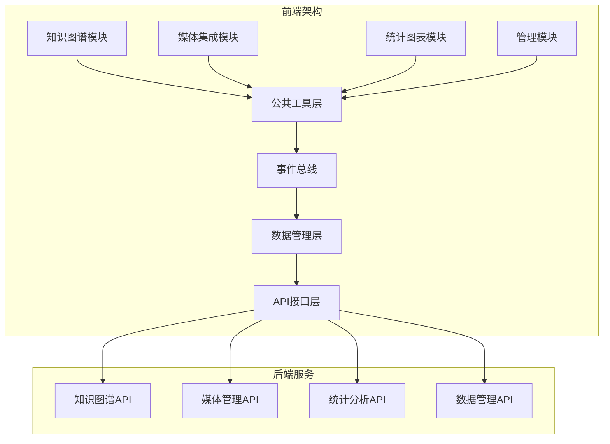
```mermaid
graph TB
subgraph "前端架构"
A[知识图谱模块] --> D[公共工具层]
B[媒体集成模块] --> D
C[统计图表模块] --> D
E[管理模块] --> D
D --> F[事件总线]
F --> G[数据管理层]
G --> H[API接口层]
end
subgraph "后端服务"
H --> I[知识图谱API]
H --> J[媒体管理API]
H --> K[统计分析API]
H --> L[数据管理API]
end
```

**图表来源**
- [knowledge-graph.js](file://scripts/knowledge-graph.js#L1-L50)
- [weapon-image-integration.js](file://scripts/weapon-image-integration.js#L1-L50)
- [index-charts.js](file://scripts/index-charts.js#L1-L50)

### 模块依赖关系

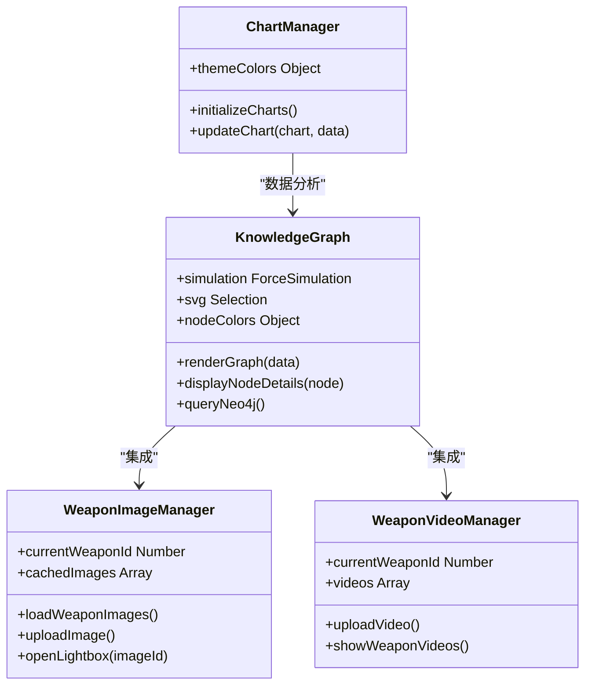
```mermaid
classDiagram
class KnowledgeGraph {
+simulation ForceSimulation
+svg Selection
+nodeColors Object
+renderGraph(data)
+displayNodeDetails(node)
+queryNeo4j()
}
class WeaponImageManager {
+currentWeaponId Number
+cachedImages Array
+loadWeaponImages()
+uploadImage()
+openLightbox(imageId)
}
class WeaponVideoManager {
+currentWeaponId Number
+videos Array
+uploadVideo()
+showWeaponVideos()
}
class ChartManager {
+themeColors Object
+initializeCharts()
+updateChart(chart, data)
}
KnowledgeGraph --> WeaponImageManager : "集成"
KnowledgeGraph --> WeaponVideoManager : "集成"
ChartManager --> KnowledgeGraph : "数据分析"
```

**图表来源**
- [knowledge-graph.js](file://scripts/knowledge-graph.js#L8-L49)
- [weapon-image-integration.js](file://scripts/weapon-image-integration.js#L1-L50)
- [weapon-video-integration.js](file://scripts/weapon-video-integration.js#L1-L50)

**章节来源**
- [knowledge-graph.js](file://scripts/knowledge-graph.js#L1-L100)
- [weapon-image-integration.js](file://scripts/weapon-image-integration.js#L1-L100)

## 知识图谱动态渲染系统

### D3.js力导向图实现

知识图谱系统是项目的核心功能，基于D3.js v7实现了复杂的力导向图可视化。

#### 节点布局算法

系统采用四力模拟算法实现节点布局：

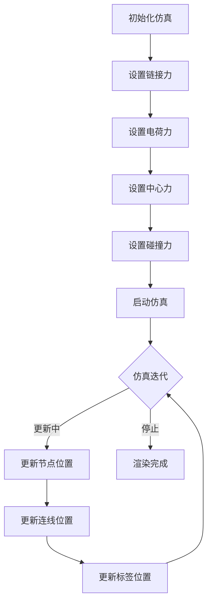
```mermaid
flowchart TD
A[初始化仿真] --> B[设置链接力]
B --> C[设置电荷力]
C --> D[设置中心力]
D --> E[设置碰撞力]
E --> F[启动仿真]
F --> G{仿真迭代}
G --> |更新中| H[更新节点位置]
H --> I[更新连线位置]
I --> J[更新标签位置]
J --> G
G --> |停止| K[渲染完成]
```

**图表来源**
- [knowledge-graph.js](file://scripts/knowledge-graph.js#L60-L75)

#### 力导向图配置参数

| 参数 | 默认值 | 说明 | 调优建议 |
|------|--------|------|----------|
| link.distance | 100 | 连接线长度 | 根据节点密度调整 |
| charge.strength | -200 | 节点排斥强度 | 避免节点过于分散 |
| collision.radius | 30 | 碰撞半径 | 平衡节点间距 |
| center.x | width/2 | 中心点X坐标 | 自适应容器尺寸 |
| center.y | height/2 | 中心点Y坐标 | 保持视觉居中 |

#### 交互事件处理机制

系统实现了多层次的交互事件处理：

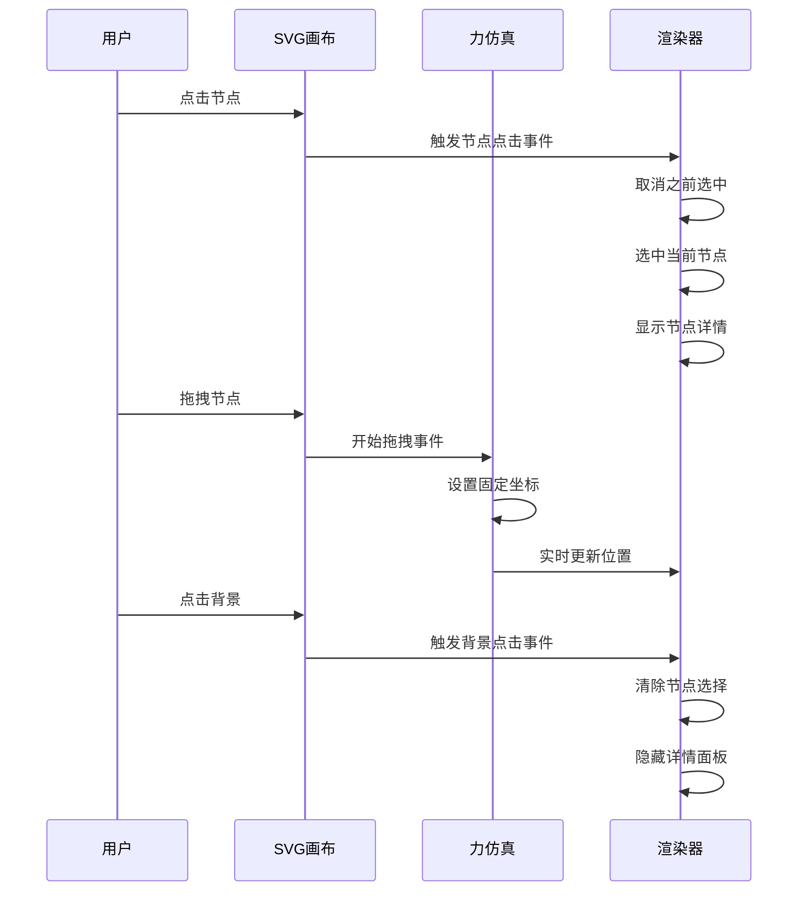
```mermaid
sequenceDiagram
participant User as 用户
participant SVG as SVG画布
participant Simulation as 力仿真
participant Renderer as 渲染器
User->>SVG : 点击节点
SVG->>Renderer : 触发节点点击事件
Renderer->>Renderer : 取消之前选中
Renderer->>Renderer : 选中当前节点
Renderer->>Renderer : 显示节点详情
User->>SVG : 拖拽节点
SVG->>Simulation : 开始拖拽事件
Simulation->>Simulation : 设置固定坐标
Simulation->>Renderer : 实时更新位置
User->>SVG : 点击背景
SVG->>Renderer : 触发背景点击事件
Renderer->>Renderer : 清除节点选择
Renderer->>Renderer : 隐藏详情面板
```

**图表来源**
- [knowledge-graph.js](file://scripts/knowledge-graph.js#L127-L169)

#### 节点颜色映射系统

系统为不同类型节点分配特定颜色：

| 节点类型 | 颜色代码 | 用途 | 识别特征 |
|----------|----------|------|----------|
| Weapon | #ff6b6b | 武器实体 | 红色标识，突出显示 |
| Country | #4ecdc4 | 国家实体 | 青绿色，代表地理概念 |
| Manufacturer | #ffbe0b | 制造商实体 | 黄色，商业属性 |
| Type | #a786df | 武器类型 | 紫色，分类属性 |
| default | #999999 | 其他节点 | 灰色，辅助信息 |

**章节来源**
- [knowledge-graph.js](file://scripts/knowledge-graph.js#L15-L25)
- [knowledge-graph.js](file://scripts/knowledge-graph.js#L127-L200)

## 武器媒体集成系统

### 图片管理系统

武器图片管理系统提供了完整的图片生命周期管理功能，包括上传、展示、编辑和删除。

#### 图片管理架构

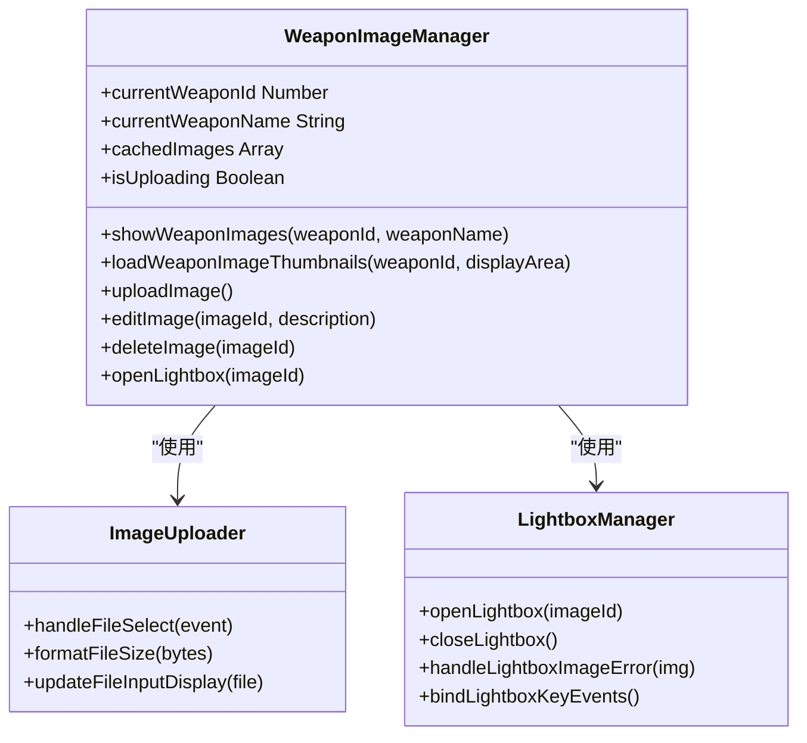
```mermaid
classDiagram
class WeaponImageManager {
+currentWeaponId Number
+currentWeaponName String
+cachedImages Array
+isUploading Boolean
+showWeaponImages(weaponId, weaponName)
+loadWeaponImageThumbnails(weaponId, displayArea)
+uploadImage()
+editImage(imageId, description)
+deleteImage(imageId)
+openLightbox(imageId)
}
class ImageUploader {
+handleFileSelect(event)
+formatFileSize(bytes)
+updateFileInputDisplay(file)
}
class LightboxManager {
+openLightbox(imageId)
+closeLightbox()
+handleLightboxImageError(img)
+bindLightboxKeyEvents()
}
WeaponImageManager --> ImageUploader : "使用"
WeaponImageManager --> LightboxManager : "使用"
```

**图表来源**
- [weapon-image-integration.js](file://scripts/weapon-image-integration.js#L1-L50)

#### 图片上传流程

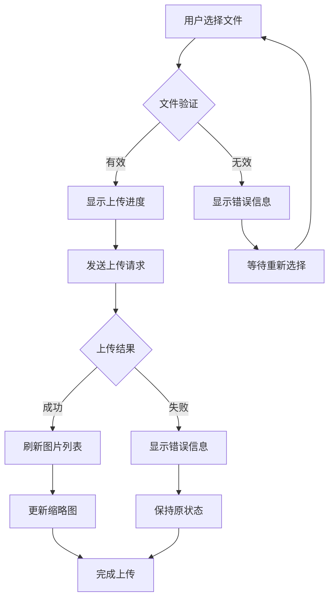
```mermaid
flowchart TD
A[用户选择文件] --> B{文件验证}
B --> |有效| C[显示上传进度]
B --> |无效| D[显示错误信息]
C --> E[发送上传请求]
E --> F{上传结果}
F --> |成功| G[刷新图片列表]
F --> |失败| H[显示错误信息]
G --> I[更新缩略图]
H --> J[保持原状态]
D --> K[等待重新选择]
I --> L[完成上传]
J --> L
K --> A
```

**图表来源**
- [weapon-image-integration.js](file://scripts/weapon-image-integration.js#L400-L450)

#### 灯箱显示系统

图片灯箱系统提供了沉浸式的图片浏览体验：

| 功能特性 | 实现方式 | 用户体验 |
|----------|----------|----------|
| 图片预加载 | 异步加载 + 占位符 | 减少等待时间 |
| 键盘导航 | Escape键关闭 | 提升无障碍体验 |
| 缩略图预览 | 点击切换 | 快速浏览功能 |
| 图片信息 | 底部信息栏 | 详细描述展示 |
| 编辑删除 | 顶部操作按钮 | 直观的操作入口 |

**章节来源**
- [weapon-image-integration.js](file://scripts/weapon-image-integration.js#L500-L600)

### 视频管理系统

视频管理系统实现了完整的视频媒体处理功能，支持拖拽上传、进度监控和播放控制。

#### 视频上传架构

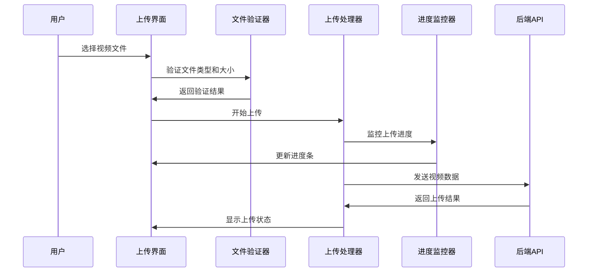
```mermaid
sequenceDiagram
participant User as 用户
participant UI as 上传界面
participant Validator as 文件验证器
participant Uploader as 上传处理器
participant Progress as 进度监控器
participant API as 后端API
User->>UI : 选择视频文件
UI->>Validator : 验证文件类型和大小
Validator->>UI : 返回验证结果
UI->>Uploader : 开始上传
Uploader->>Progress : 监控上传进度
Progress->>UI : 更新进度条
Uploader->>API : 发送视频数据
API->>Uploader : 返回上传结果
Uploader->>UI : 显示上传状态
```

**图表来源**
- [weapon-video-integration.js](file://scripts/weapon-video-integration.js#L1-L50)

#### 视频管理功能

| 功能模块 | 技术实现 | 性能优化 |
|----------|----------|----------|
| 文件拖拽 | dragover/drop事件 | 拖拽区域高亮反馈 |
| 格式验证 | MIME类型检测 | 实时格式提示 |
| 大小限制 | 文件大小检查 | 预防大文件上传 |
| 进度监控 | XMLHttpRequest | 分段上传进度 |
| 错误处理 | 异常捕获机制 | 用户友好错误提示 |

**章节来源**
- [weapon-video-integration.js](file://scripts/weapon-video-integration.js#L200-L300)

## 统计图表可视化系统

### Chart.js数据绑定机制

统计图表系统基于Chart.js构建，实现了多种类型的统计图表展示。

#### 图表类型与应用场景

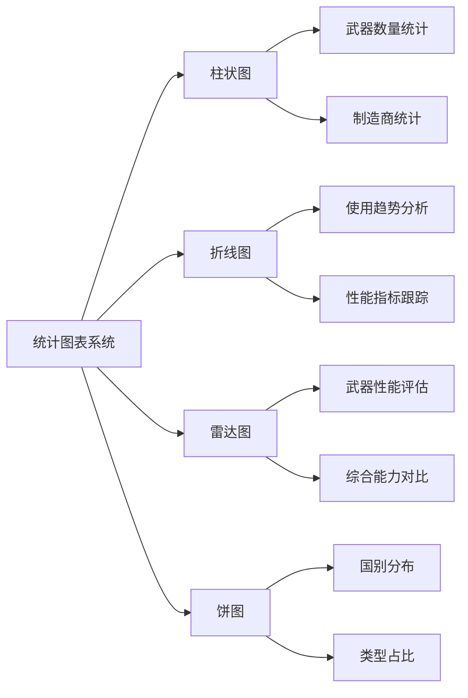
```mermaid
graph LR
A[统计图表系统] --> B[柱状图]
A --> C[折线图]
A --> D[雷达图]
A --> E[饼图]
B --> B1[武器数量统计]
B --> B2[制造商统计]
C --> C1[使用趋势分析]
C --> C2[性能指标跟踪]
D --> D1[武器性能评估]
D --> D2[综合能力对比]
E --> E1[国别分布]
E --> E2[类型占比]
```

**图表来源**
- [index-charts.js](file://scripts/index-charts.js#L40-L120)

#### 主题色彩系统

系统定义了一套统一的主题色彩体系：

| 色彩类别 | 颜色代码 | 应用场景 | 视觉效果 |
|----------|----------|----------|----------|
| 蓝色系列 | #3498db | 主要图表颜色 | 专业、可靠感 |
| 绿色系列 | #1abc9c | 成功状态颜色 | 积极、正面 |
| 黄色系列 | #f1c40f | 警告状态颜色 | 注意、提醒 |
| 红色系列 | #e74c3c | 错误状态颜色 | 危险、重要 |
| 紫色系列 | #9b59b6 | 特殊图表颜色 | 创新、独特 |

#### 数据刷新机制

```mermaid
flowchart TD
A[用户点击刷新按钮] --> B[触发数据更新事件]
B --> C[生成随机数据]
C --> D[更新图表数据集]
D --> E[调用chart.update()]
E --> F[重新渲染图表]
F --> G[动画过渡效果]
G --> H[完成刷新]
```

**图表来源**
- [index-charts.js](file://scripts/index-charts.js#L200-L250)

**章节来源**
- [index-charts.js](file://scripts/index-charts.js#L1-L100)

## 管理模块CRUD系统

### 制造商管理模块

制造商管理模块实现了完整的CRUD操作，支持制造商的创建、查询、更新和删除。

#### CRUD操作流程

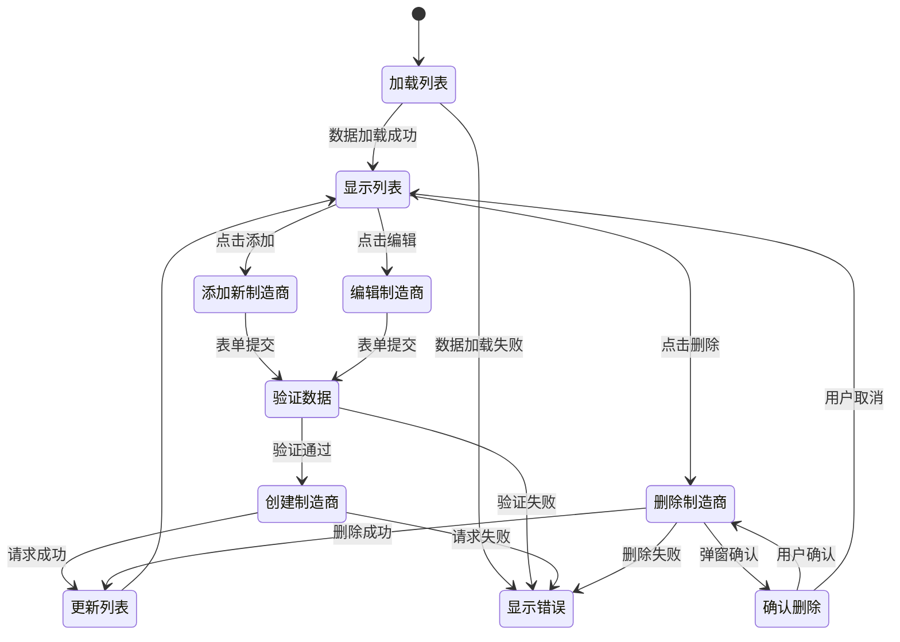
```mermaid
stateDiagram-v2
[*] --> 加载列表
加载列表 --> 显示列表 : 数据加载成功
加载列表 --> 显示错误 : 数据加载失败
显示列表 --> 添加新制造商 : 点击添加
显示列表 --> 编辑制造商 : 点击编辑
显示列表 --> 删除制造商 : 点击删除
添加新制造商 --> 验证数据 : 表单提交
编辑制造商 --> 验证数据 : 表单提交
删除制造商 --> 确认删除 : 弹窗确认
验证数据 --> 创建制造商 : 验证通过
验证数据 --> 显示错误 : 验证失败
创建制造商 --> 更新列表 : 请求成功
创建制造商 --> 显示错误 : 请求失败
更新列表 --> 显示列表
确认删除 --> 删除制造商 : 用户确认
确认删除 --> 显示列表 : 用户取消
删除制造商 --> 更新列表 : 删除成功
删除制造商 --> 显示错误 : 删除失败
```

**图表来源**
- [manufacturer-management.js](file://scripts/manufacturer-management.js#L1-L50)

#### 数据验证机制

| 字段名称 | 验证规则 | 错误提示 | 处理方式 |
|----------|----------|----------|----------|
| 制造商名称 | 必填字段 | 请输入制造商名称 | 表单级验证 |
| 成立年份 | 数字范围 | 年份必须在1800-2030之间 | 输入验证 |
| 国家信息 | 可选字段 | 无需验证 | 容错处理 |
| 描述信息 | 文本字段 | 最大长度限制 | 字符计数 |

### 国家管理模块

国家管理模块提供了国家数据的统一管理功能，支持国家的添加、编辑和删除操作。

#### 国家数据结构

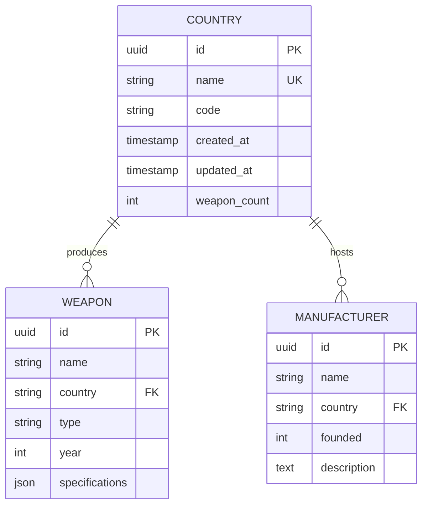
```mermaid
erDiagram
COUNTRY {
uuid id PK
string name UK
string code
timestamp created_at
timestamp updated_at
int weapon_count
}
WEAPON {
uuid id PK
string name
string country FK
string type
int year
json specifications
}
MANUFACTURER {
uuid id PK
string name
string country FK
int founded
text description
}
COUNTRY ||--o{ WEAPON : "produces"
COUNTRY ||--o{ MANUFACTURER : "hosts"
```

**图表来源**
- [weapon-country-management.js](file://scripts/weapon-country-management.js#L1-L50)

### 武器类型管理模块

武器类型管理模块实现了武器分类的标准化管理，支持类型的数据结构化组织。

#### 类型管理功能特性

| 功能特性 | 实现方式 | 用户价值 |
|----------|----------|----------|
| 实时搜索 | 前端过滤算法 | 快速定位目标类型 |
| 批量操作 | 复选框选择机制 | 提高管理效率 |
| 数据验证 | 唯一性约束检查 | 确保数据完整性 |
| 错误提示 | 友好的错误消息 | 改善用户体验 |
| 操作确认 | 模态框确认对话框 | 防止误操作 |

**章节来源**
- [manufacturer-management.js](file://scripts/manufacturer-management.js#L50-L150)
- [weapon-country-management.js](file://scripts/weapon-country-management.js#L50-L150)
- [weapon-type-management.js](file://scripts/weapon-type-management.js#L50-L150)

## 公共工具函数设计

### 导航激活状态管理

common.js模块提供了页面导航的统一管理功能，实现了导航链接的自动激活状态设置。

#### 导航激活逻辑

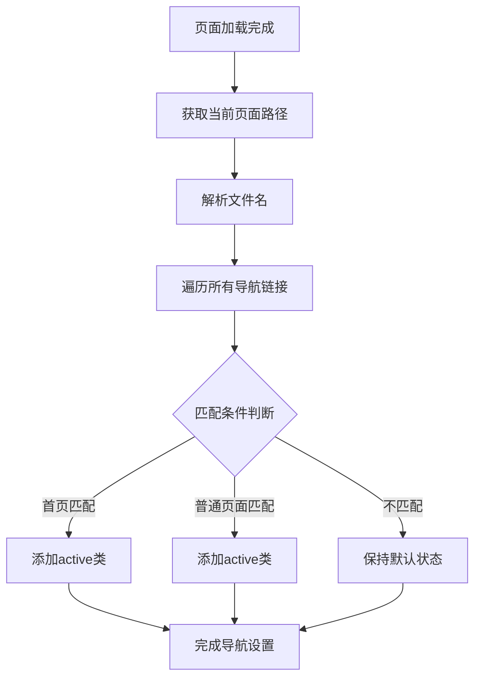
```mermaid
flowchart TD
A[页面加载完成] --> B[获取当前页面路径]
B --> C[解析文件名]
C --> D[遍历所有导航链接]
D --> E{匹配条件判断}
E --> |首页匹配| F[添加active类]
E --> |普通页面匹配| G[添加active类]
E --> |不匹配| H[保持默认状态]
F --> I[完成导航设置]
G --> I
H --> I
```

**图表来源**
- [common.js](file://scripts/common.js#L1-L17)

#### URL匹配策略

系统采用智能URL匹配策略，支持多种页面路径格式：

| 匹配场景 | 实现逻辑 | 示例 |
|----------|----------|------|
| 首页匹配 | pathname为空或index.html | `/` → `index.html` |
| 普通页面 | 精确匹配文件名 | `/knowledge-graph.html` |
| 子目录页面 | 相对路径匹配 | `/admin/users.html` |
| 参数页面 | 基础路径匹配 | `/profile?id=123` |

**章节来源**
- [common.js](file://scripts/common.js#L1-L17)

## 性能优化策略

### 知识图谱渲染优化

#### 虚拟化技术应用

对于大规模知识图谱数据，系统采用了多种性能优化策略：

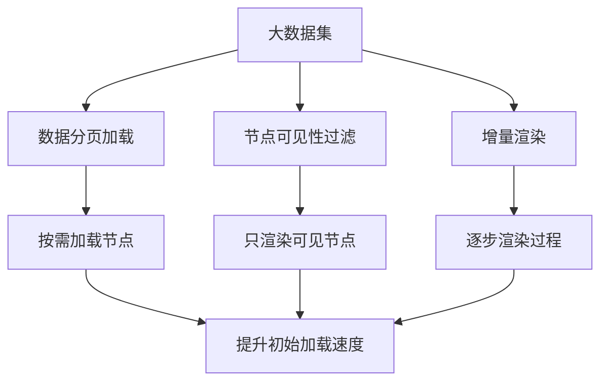
```mermaid
graph TB
A[大数据集] --> B[数据分页加载]
A --> C[节点可见性过滤]
A --> D[增量渲染]
B --> E[按需加载节点]
C --> F[只渲染可见节点]
D --> G[逐步渲染过程]
E --> H[提升初始加载速度]
F --> H
G --> H
```

#### 力仿真优化参数

| 优化策略 | 参数调整 | 性能收益 |
|----------|----------|----------|
| 节点数量限制 | 限制同时渲染节点数 | 减少计算复杂度 |
| 迭代频率控制 | 降低仿真迭代频率 | 减少CPU占用 |
| 碰撞检测优化 | 简化碰撞检测算法 | 提升渲染帧率 |
| 缓存机制 | 缓存计算结果 | 避免重复计算 |

### 图片加载优化

#### 懒加载机制

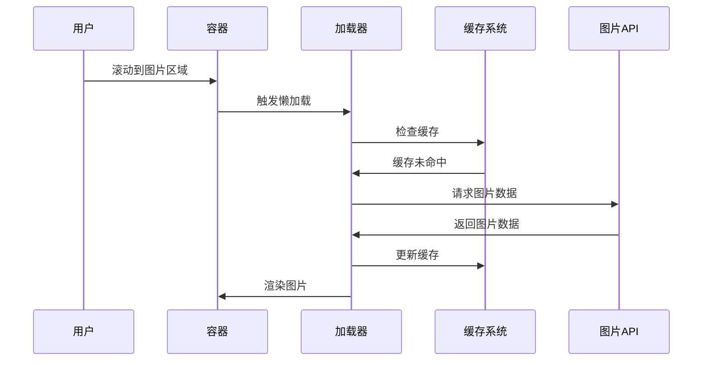
```mermaid
sequenceDiagram
participant User as 用户
participant Container as 容器
participant Loader as 加载器
participant Cache as 缓存系统
participant API as 图片API
User->>Container : 滚动到图片区域
Container->>Loader : 触发懒加载
Loader->>Cache : 检查缓存
Cache->>Loader : 缓存未命中
Loader->>API : 请求图片数据
API->>Loader : 返回图片数据
Loader->>Cache : 更新缓存
Loader->>Container : 渲染图片
```

#### 图片压缩策略

| 压缩级别 | 文件大小 | 质量损失 | 适用场景 |
|----------|----------|----------|----------|
| 高质量 | 原始大小 | 无 | 展示图、封面图 |
| 标准质量 | 50-70% | 轻微 | 缩略图、列表图 |
| 高压缩 | 20-30% | 明显 | 移动端、快速加载 |

### 数据缓存机制

#### 多层缓存架构

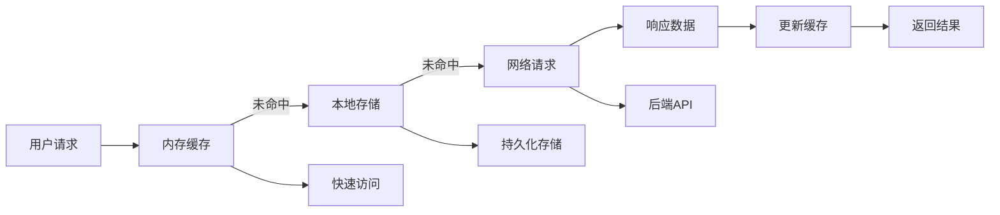
```mermaid
graph LR
A[用户请求] --> B[内存缓存]
B --> |未命中| C[本地存储]
C --> |未命中| D[网络请求]
D --> E[响应数据]
E --> F[更新缓存]
F --> G[返回结果]
B --> H[快速访问]
C --> I[持久化存储]
D --> J[后端API]
```

**图表来源**
- [weapon-image-integration.js](file://scripts/weapon-image-integration.js#L100-L150)

## 错误处理与调试

### 统一错误处理机制

系统实现了多层次的错误处理机制，确保用户体验的连续性。

#### 错误分类体系

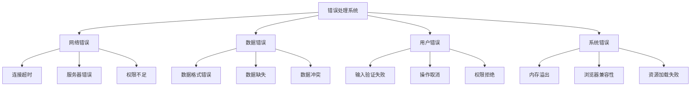
```mermaid
graph TB
A[错误处理系统] --> B[网络错误]
A --> C[数据错误]
A --> D[用户错误]
A --> E[系统错误]
B --> B1[连接超时]
B --> B2[服务器错误]
B --> B3[权限不足]
C --> C1[数据格式错误]
C --> C2[数据缺失]
C --> C3[数据冲突]
D --> D1[输入验证失败]
D --> D2[操作取消]
D --> D3[权限拒绝]
E --> E1[内存溢出]
E --> E2[浏览器兼容性]
E --> E3[资源加载失败]
```

#### 错误恢复策略

| 错误类型 | 恢复策略 | 用户提示 |
|----------|----------|----------|
| 网络超时 | 自动重试机制 | "正在重试..." |
| 数据加载失败 | 显示默认数据 | "加载失败，显示默认内容" |
| 用户操作错误 | 清除错误状态 | "操作已取消" |
| 系统异常 | 优雅降级 | "系统出现异常，请刷新页面" |

### 调试工具集成

#### 开发者工具支持

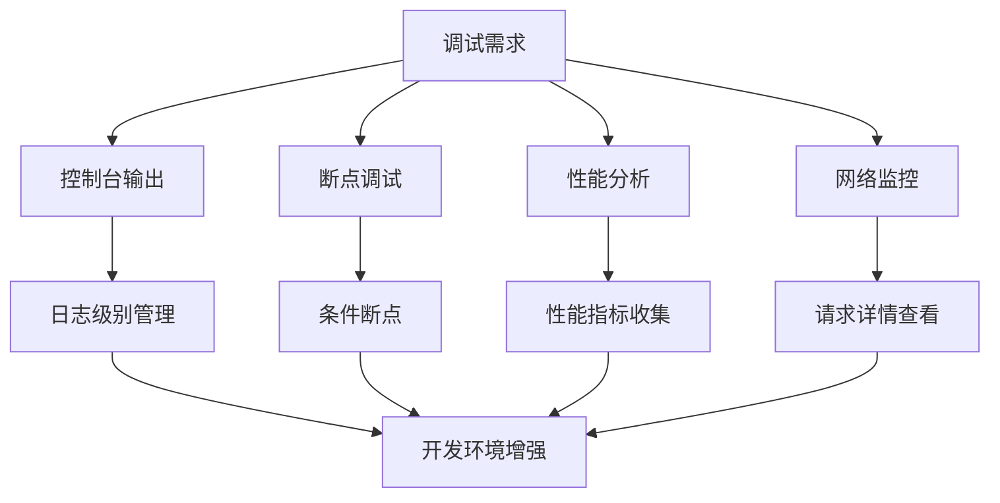
```mermaid
flowchart TD
A[调试需求] --> B[控制台输出]
A --> C[断点调试]
A --> D[性能分析]
A --> E[网络监控]
B --> F[日志级别管理]
C --> G[条件断点]
D --> H[性能指标收集]
E --> I[请求详情查看]
F --> J[开发环境增强]
G --> J
H --> J
I --> J
```

#### 性能监控指标

| 监控指标 | 正常范围 | 警告阈值 | 优化建议 |
|----------|----------|----------|----------|
| 首次渲染时间 | < 2秒 | > 5秒 | 优化数据加载 |
| 交互响应时间 | < 100ms | > 300ms | 减少DOM操作 |
| 内存使用率 | < 100MB | > 500MB | 优化缓存策略 |
| 网络请求次数 | < 10次 | > 20次 | 合并请求 |

**章节来源**
- [knowledge-graph.js](file://scripts/knowledge-graph.js#L700-L799)
- [weapon-image-integration.js](file://scripts/weapon-image-integration.js#L500-L640)

## 最佳实践指南

### 代码组织原则

#### 模块化设计规范

1. **单一职责原则**: 每个模块只负责一个特定功能
2. **开放封闭原则**: 对扩展开放，对修改封闭
3. **依赖倒置原则**: 依赖抽象而非具体实现
4. **接口隔离原则**: 提供最小化的接口

#### 命名约定标准

| 元素类型 | 命名规范 | 示例 |
|----------|----------|------|
| 变量 | camelCase | `currentWeaponId` |
| 函数 | camelCase | `loadWeaponImages()` |
| 类 | PascalCase | `WeaponImageManager` |
| 常量 | UPPER_SNAKE_CASE | `NODE_COLORS` |
| 私有成员 | _开头 | `_privateMethod()` |

### 安全性考虑

#### 输入验证策略

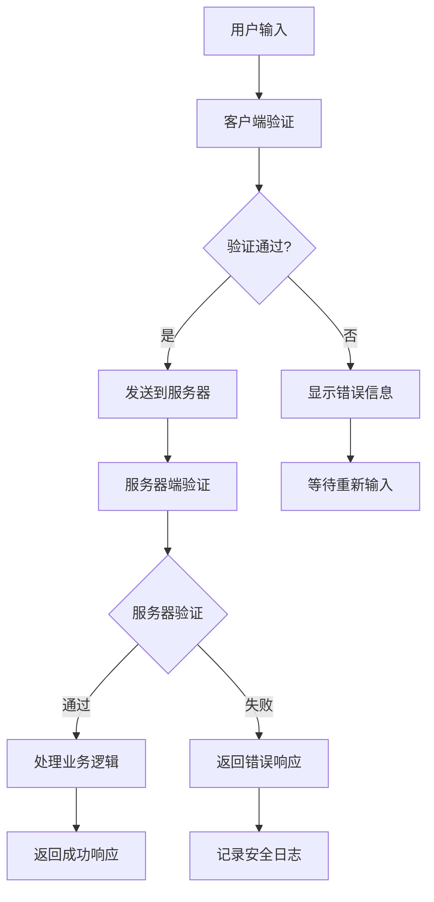
```mermaid
flowchart TD
A[用户输入] --> B[客户端验证]
B --> C{验证通过?}
C --> |是| D[发送到服务器]
C --> |否| E[显示错误信息]
D --> F[服务器端验证]
F --> G{服务器验证}
G --> |通过| H[处理业务逻辑]
G --> |失败| I[返回错误响应]
E --> J[等待重新输入]
I --> K[记录安全日志]
H --> L[返回成功响应]
```

#### 数据安全措施

| 安全层面 | 实施措施 | 验证方法 |
|----------|----------|----------|
| 输入过滤 | XSS攻击防护 | 自动转义特殊字符 |
| 权限控制 | API认证机制 | JWT令牌验证 |
| 数据加密 | HTTPS传输 | SSL证书检查 |
| 访问控制 | 角色权限管理 | RBAC权限模型 |

### 可维护性优化

#### 代码质量保证

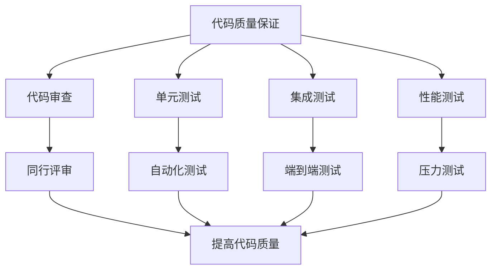
```mermaid
graph TB
A[代码质量保证] --> B[代码审查]
A --> C[单元测试]
A --> D[集成测试]
A --> E[性能测试]
B --> F[同行评审]
C --> G[自动化测试]
D --> H[端到端测试]
E --> I[压力测试]
F --> J[提高代码质量]
G --> J
H --> J
I --> J
```

#### 文档维护策略

| 文档类型 | 更新频率 | 维护责任 | 质量要求 |
|----------|----------|----------|----------|
| API文档 | 随功能更新 | 开发团队 | 完整准确 |
| 架构文档 | 随架构变更 | 架构师 | 清晰易懂 |
| 用户手册 | 随功能发布 | 产品经理 | 实用性强 |
| 开发指南 | 随开发规范 | 技术负责人 | 指导性强 |

### 扩展性设计

#### 插件化架构

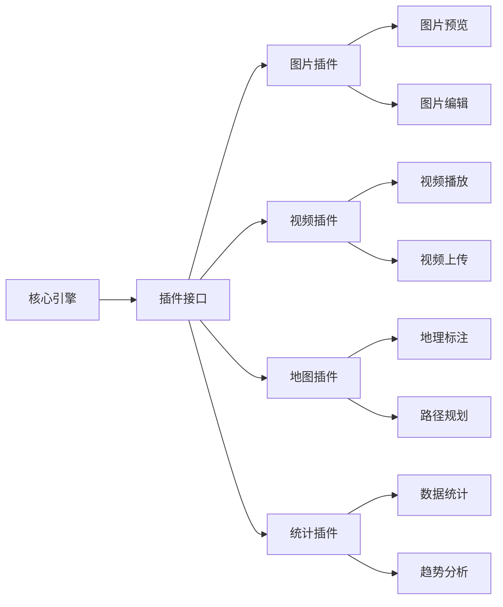
```mermaid
graph LR
A[核心引擎] --> B[插件接口]
B --> C[图片插件]
B --> D[视频插件]
B --> E[地图插件]
B --> F[统计插件]
C --> G[图片预览]
C --> H[图片编辑]
D --> I[视频播放]
D --> J[视频上传]
E --> K[地理标注]
E --> L[路径规划]
F --> M[数据统计]
F --> N[趋势分析]
```

#### 微服务拆分策略

| 服务边界 | 职责范围 | 技术栈 | 部署方式 |
|----------|----------|--------|----------|
| 知识图谱服务 | 图数据查询 | Neo4j + Python | 独立容器 |
| 媒体服务 | 文件存储管理 | MongoDB + Nginx | 独立容器 |
| 统计服务 | 数据分析计算 | PostgreSQL + Node.js | 独立容器 |
| 用户服务 | 认证授权 | Redis + JWT | 独立容器 |

通过以上架构设计和实现策略，兵智世界v1.3项目构建了一个高性能、可扩展、易维护的前端JavaScript应用程序。系统不仅满足了当前的功能需求，还为未来的功能扩展和技术升级奠定了坚实的基础。