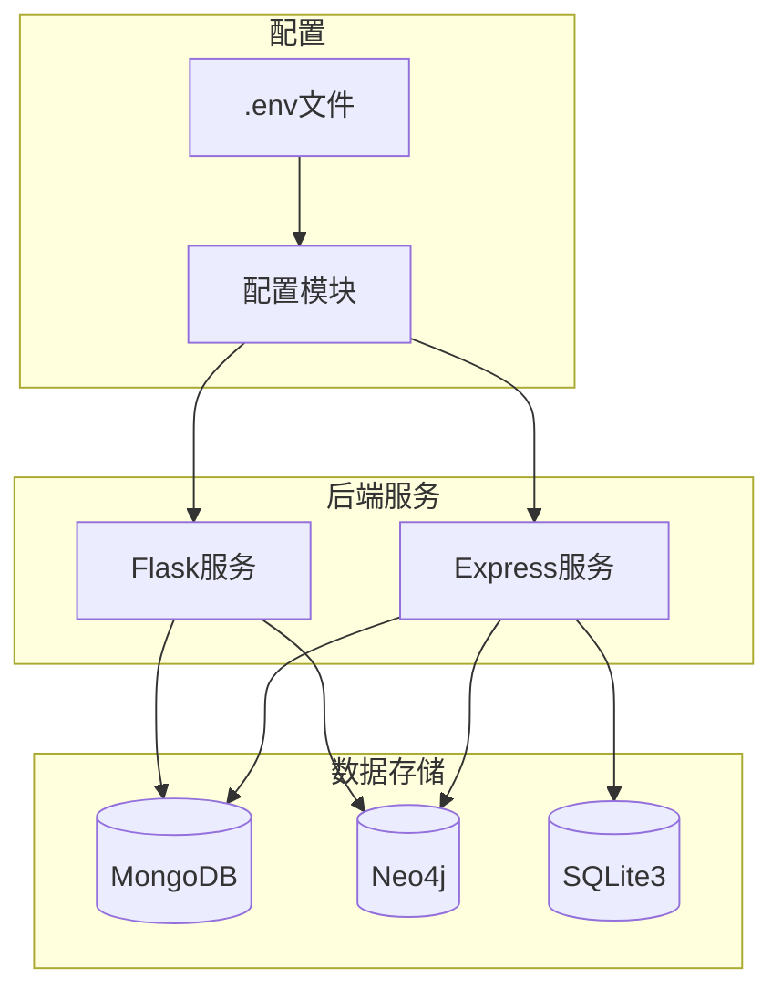
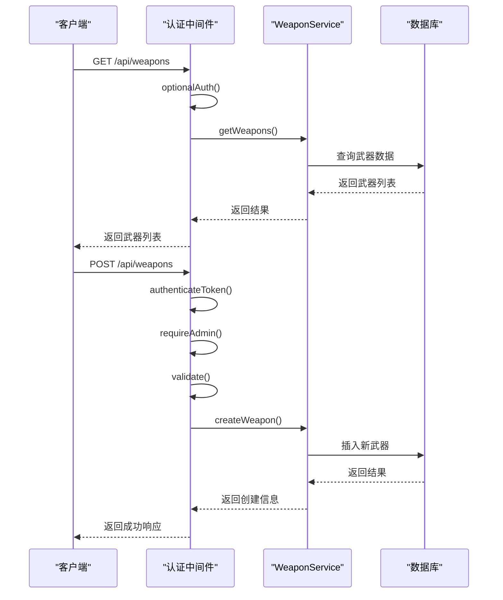
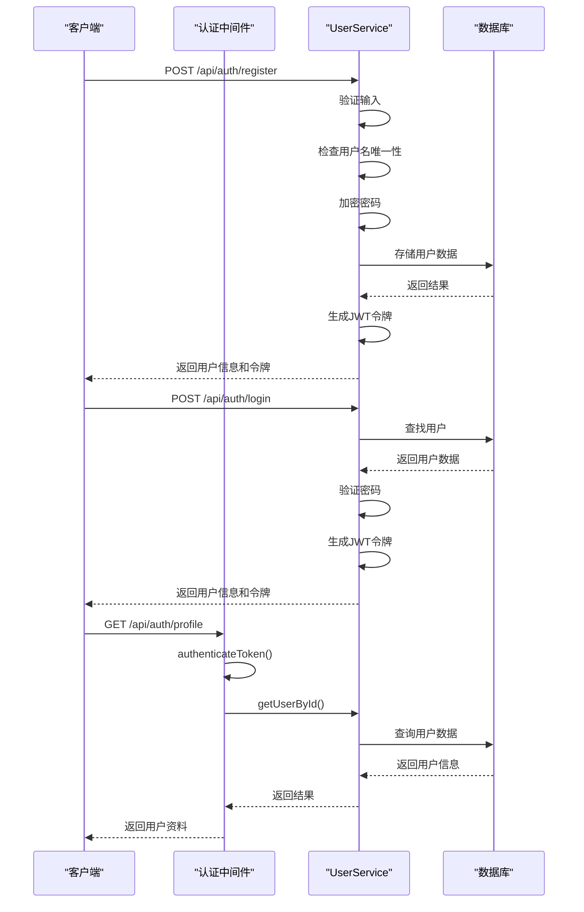
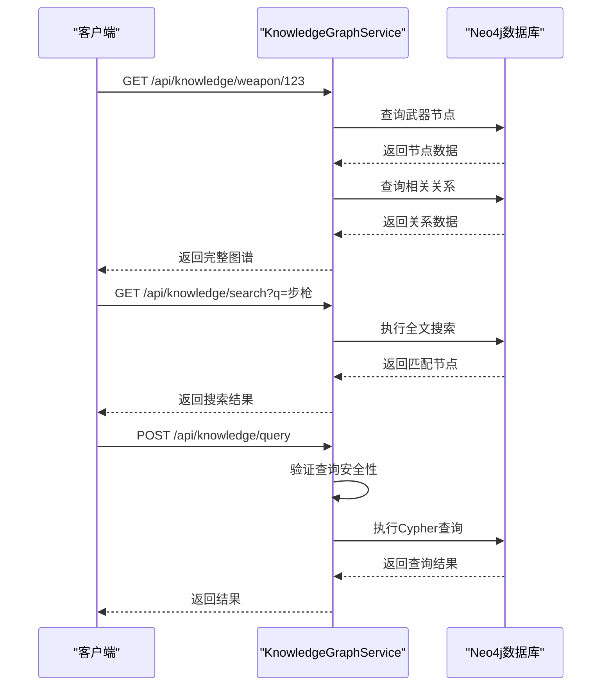
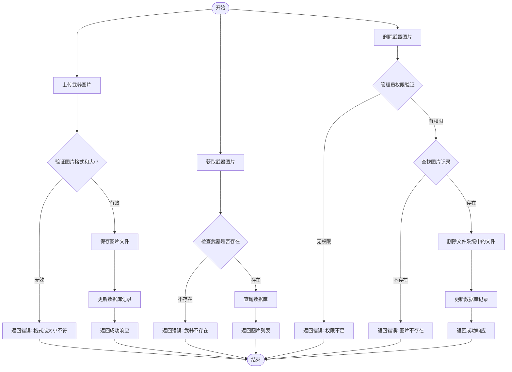
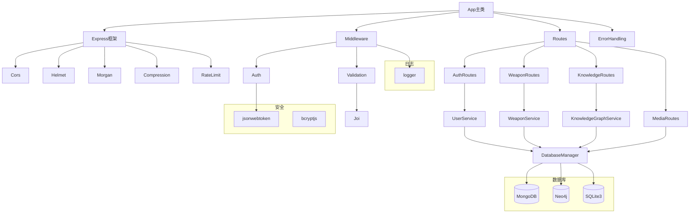

# API路由

<cite>
**本文档中引用的文件**   
- [weapon.py](file://backend/routes/weapon.py)
- [auth.py](file://backend/routes/auth.py)
- [knowledge.py](file://backend/routes/knowledge.py)
- [weapons.js](file://backend/src/routes/weapons.js)
- [auth.js](file://backend/src/routes/auth.js)
- [weapon-images.js](file://backend/src/routes/weapon-images.js)
- [weapon-videos.js](file://backend/src/routes/weapon-videos.js)
- [knowledge.js](file://backend/src/routes/knowledge.js)
- [app.py](file://backend/app.py)
- [app.js](file://backend/src/app.js)
- [config.js](file://backend/src/config/index.js)
- [weaponService.js](file://backend/src/services/weaponService.js)
- [userService.js](file://backend/src/services/userService.js)
- [auth.js](file://backend/src/middleware/auth.js)
- [validation.js](file://backend/src/middleware/validation.js)
</cite>

## 目录
1. [引言](#引言)
2. [项目结构](#项目结构)
3. [武器管理API](#武器管理api)
4. [用户认证API](#用户认证api)
5. [知识图谱API](#知识图谱api)
6. [多媒体管理API](#多媒体管理api)
7. [依赖分析](#依赖分析)
8. [性能考虑](#性能考虑)
9. [故障排除指南](#故障排除指南)
10. [结论](#结论)

## 引言
本文档全面记录了兵智世界系统的API路由定义和实现。系统提供了一套完整的RESTful接口，用于管理武器信息、用户认证、知识图谱数据和多媒体内容。API设计遵循现代Web服务最佳实践，采用分层架构，结合Flask和Express.js框架实现，支持JWT身份验证和细粒度权限控制。系统通过MongoDB存储详细数据，Neo4j管理知识图谱关系，并提供全面的错误处理和输入验证机制。

## 项目结构
兵智世界后端系统采用混合架构，包含Python Flask和Node.js Express两个服务层。主要功能模块包括武器管理、用户认证、知识图谱和多媒体处理。系统使用环境变量进行配置管理，支持开发和生产环境的灵活切换。数据库方面，系统采用多数据库策略，使用MongoDB存储文档数据，Neo4j管理图谱关系，SQLite3处理简单数据存储。

**图源**
- [app.py](file://backend/app.py#L1-L43)
- [app.js](file://backend/src/app.js#L1-L248)
- [config.js](file://backend/src/config/index.js#L1-L73)

**节源**
- [app.py](file://backend/app.py#L1-L43)
- [app.js](file://backend/src/app.js#L1-L248)

## 武器管理API

武器管理API提供完整的CRUD操作，支持武器信息的创建、读取、更新和删除。系统还提供搜索、统计和相似武器推荐功能。所有管理操作都需要管理员权限，而查询操作对所有用户开放。

### 武器列表与详情

#### 获取武器列表
- **URL**: `GET /api/weapons`
- **权限**: 无（可选认证）
- **参数**:
  - `category`: 武器类型过滤
  - `country`: 制造国家过滤
  - `page`: 页码（默认1）
  - `limit`: 每页数量（默认20）
- **响应**: 分页的武器列表

#### 搜索武器
- **URL**: `GET /api/weapons/search`
- **权限**: 无（可选认证）
- **参数**:
  - `q`: 搜索关键词（必填）
  - `category`: 类型过滤
  - `country`: 国家过滤
- **响应**: 匹配的武器列表

#### 获取武器详情
- **URL**: `GET /api/weapons/:id`
- **权限**: 无（可选认证）
- **参数**: 武器ID
- **响应**: 武器详细信息，包括技术规格和关系数据

#### 获取相似武器
- **URL**: `GET /api/weapons/:id/similar`
- **权限**: 无
- **参数**:
  - `id`: 参考武器ID
  - `limit`: 返回数量（默认5）
- **响应**: 相似武器列表

### 武器管理操作

#### 创建武器
- **URL**: `POST /api/weapons`
- **权限**: 管理员
- **请求体**: 武器数据对象
- **验证**: 使用Joi进行数据验证
- **响应**: 创建的武器信息

#### 更新武器
- **URL**: `PUT /api/weapons/:id`
- **权限**: 管理员
- **参数**: 武器ID
- **请求体**: 更新的武器数据
- **响应**: 更新后的武器信息

#### 删除武器
- **URL**: `DELETE /api/weapons/:id`
- **权限**: 管理员
- **参数**: 武器ID
- **响应**: 删除确认信息

### 武器统计与推荐

#### 获取武器统计
- **URL**: `GET /api/weapons/statistics`
- **权限**: 无
- **响应**: 按类型和国家的武器统计信息

#### 用户收藏武器
- **URL**: `POST /api/weapons/:id/favorite`
- **权限**: 认证用户
- **参数**: 武器ID
- **响应**: 收藏成功确认

#### 取消收藏武器
- **URL**: `DELETE /api/weapons/:id/favorite`
- **权限**: 认证用户
- **参数**: 武器ID
- **响应**: 取消收藏确认

**图源**
- [weapons.js](file://backend/src/routes/weapons.js#L1-L218)
- [weaponService.js](file://backend/src/services/weaponService.js#L1-L486)

**节源**
- [weapons.js](file://backend/src/routes/weapons.js#L1-L218)
- [weaponService.js](file://backend/src/services/weaponService.js#L1-L486)

## 用户认证API

用户认证API提供完整的用户生命周期管理，包括注册、登录、资料管理和安全控制。系统采用JWT进行身份验证，支持密码加密存储和令牌刷新机制。

### 认证流程

#### 用户注册
- **URL**: `POST /api/auth/register`
- **权限**: 无
- **请求体**:
  - `username`: 用户名（3-30字符，字母数字）
  - `email`: 邮箱地址
  - `password`: 密码（至少6字符）
  - `name`: 姓名（可选）
- **验证**: Joi验证规则
- **响应**: 用户信息和JWT令牌

#### 用户登录
- **URL**: `POST /api/auth/login`
- **权限**: 无
- **请求体**:
  - `username`: 用户名或邮箱
  - `password`: 密码
- **响应**: 用户信息和JWT令牌（有效期7天）

#### 获取用户资料
- **URL**: `GET /api/auth/profile`
- **权限**: 认证用户
- **响应**: 当前用户完整信息

#### 更新用户资料
- **URL**: `PUT /api/auth/profile`
- **权限**: 认证用户
- **请求体**:
  - `name`: 姓名
  - `preferences`: 用户偏好
  - `avatar`: 头像URL
- **响应**: 更新成功确认

#### 修改密码
- **URL**: `PUT /api/auth/change-password`
- **权限**: 认证用户
- **请求体**:
  - `oldPassword`: 原密码
  - `newPassword`: 新密码（至少6字符）
- **响应**: 密码修改成功确认

#### 刷新令牌
- **URL**: `POST /api/auth/refresh`
- **权限**: 认证用户
- **响应**: 新的JWT令牌

#### 退出登录
- **URL**: `POST /api/auth/logout`
- **权限**: 认证用户
- **响应**: 退出成功确认

**图源**
- [auth.js](file://backend/src/routes/auth.js#L1-L144)
- [userService.js](file://backend/src/services/userService.js#L1-L318)
- [auth.js](file://backend/src/middleware/auth.js#L1-L106)
- [validation.js](file://backend/src/middleware/validation.js#L1-L178)

**节源**
- [auth.js](file://backend/src/routes/auth.js#L1-L144)
- [userService.js](file://backend/src/services/userService.js#L1-L318)

## 知识图谱API

知识图谱API提供基于Neo4j图数据库的高级查询功能，支持武器知识的深度探索和分析。系统实现图谱数据的查询、搜索、路径查找和推荐功能。

### 图谱查询功能

#### 获取知识图谱概览
- **URL**: `GET /api/knowledge/overview`
- **权限**: 无
- **响应**: 图谱统计信息

#### 获取武器知识图谱
- **URL**: `GET /api/knowledge/weapon/:id`
- **权限**: 无（可选认证）
- **参数**:
  - `id`: 武器ID
  - `depth`: 查询深度（默认2，最大5）
- **响应**: 武器及其关联实体的图谱数据

#### 搜索知识图谱
- **URL**: `GET /api/knowledge/search`
- **权限**: 无
- **参数**:
  - `q`: 搜索关键词（必填）
  - `types`: 节点类型过滤
  - `limit`: 返回数量（默认20）
- **响应**: 匹配的节点列表

#### 获取节点邻居
- **URL**: `GET /api/knowledge/node/:id/neighbors`
- **权限**: 无
- **参数**:
  - `id`: 节点ID
  - `types`: 关系类型过滤
  - `limit`: 返回数量（默认10）
- **响应**: 邻居节点列表

#### 查找路径
- **URL**: `GET /api/knowledge/path`
- **权限**: 无
- **参数**:
  - `start`: 起始节点ID
  - `end`: 结束节点ID
  - `maxDepth`: 最大深度（默认5，最大10）
- **响应**: 两个节点间的路径信息

#### 执行Cypher查询
- **URL**: `POST /api/knowledge/query`
- **权限**: 无
- **请求体**:
  - `query`: Cypher查询语句
  - `parameters`: 查询参数
- **安全**: 禁止DELETE、REMOVE等危险操作
- **响应**: 查询结果

#### 获取推荐武器
- **URL**: `GET /api/knowledge/recommendations/:userId`
- **权限**: 无
- **参数**:
  - `userId`: 用户ID
  - `limit`: 推荐数量（默认10）
- **响应**: 基于用户兴趣的推荐武器列表

#### 获取图谱统计
- **URL**: `GET /api/knowledge/statistics`
- **权限**: 无
- **响应**: 图谱统计信息

**图源**
- [knowledge.js](file://backend/src/routes/knowledge.js#L1-L182)
- [knowledgeGraphService.js](file://backend/src/services/knowledgeGraphService.js)

**节源**
- [knowledge.js](file://backend/src/routes/knowledge.js#L1-L182)

## 多媒体管理API

多媒体管理API提供武器相关图片和视频的上传、获取和删除功能。系统实现文件上传验证、存储管理和安全访问控制。

### 武器图片管理

#### 获取武器图片
- **URL**: `GET /api/weapon-images/:weaponId`
- **权限**: 无
- **参数**: 武器ID（支持多种格式）
- **响应**: 武器的所有图片信息

#### 上传武器图片
- **URL**: `POST /api/weapon-images/:weaponId`
- **权限**: 管理员
- **参数**: 武器ID
- **请求体**: 
  - `image`: 图片文件（multipart/form-data）
  - `description`: 图片描述
- **限制**: 
  - 文件大小：5MB
  - 格式：JPEG、JPG、PNG、GIF、WebP
- **响应**: 上传的图片信息

#### 删除武器图片
- **URL**: `DELETE /api/weapon-images/:weaponId/:imageId`
- **权限**: 管理员
- **参数**:
  - `weaponId`: 武器ID
  - `imageId`: 图片ID
- **响应**: 删除成功确认

#### 更新图片描述
- **URL**: `PUT /api/weapon-images/:weaponId/:imageId`
- **权限**: 管理员
- **参数**:
  - `weaponId`: 武器ID
  - `imageId`: 图片ID
- **请求体**: `description`: 新的描述
- **响应**: 更新后的图片信息

### 武器视频管理

#### 获取武器视频
- **URL**: `GET /api/weapon-videos/weapon/:weaponId`
- **权限**: 无
- **参数**: 武器ID
- **响应**: 武器的所有视频信息

#### 上传视频
- **URL**: `POST /api/weapon-videos/weapon/:weaponId/upload`
- **权限**: 管理员
- **参数**: 武器ID
- **请求体**:
  - `video`: 视频文件
  - `description`: 视频描述
- **限制**:
  - 文件大小：100MB
  - 格式：MP4、AVI、MOV、WMV、FLV、WebM
- **响应**: 上传的视频信息

#### 获取视频文件流
- **URL**: `GET /api/weapon-videos/file/:filename`
- **权限**: 无
- **参数**: 文件名
- **功能**: 支持HTTP范围请求，实现视频流播放
- **响应**: 视频文件流

#### 更新视频信息
- **URL**: `PUT /api/weapon-videos/:videoId`
- **权限**: 管理员
- **参数**: 视频ID
- **请求体**: `description`: 新的描述
- **响应**: 更新成功确认

#### 删除视频
- **URL**: `DELETE /api/weapon-videos/:videoId`
- **权限**: 管理员
- **参数**: 视频ID
- **响应**: 删除成功确认

#### 获取视频统计
- **URL**: `GET /api/weapon-videos/weapon/:weaponId/stats`
- **权限**: 无
- **参数**: 武器ID
- **响应**: 视频数量和大小统计

**图源**
- [weapon-images.js](file://backend/src/routes/weapon-images.js#L1-L370)
- [weapon-videos.js](file://backend/src/routes/weapon-videos.js#L1-L404)

**节源**
- [weapon-images.js](file://backend/src/routes/weapon-images.js#L1-L370)
- [weapon-videos.js](file://backend/src/routes/weapon-videos.js#L1-L404)

## 依赖分析

兵智世界系统采用模块化设计，各组件之间有清晰的依赖关系。系统主要依赖包括Web框架、数据库驱动、安全库和工具库。

**图源**
- [app.js](file://backend/src/app.js#L1-L248)
- [database.js](file://backend/src/config/database.js)
- [database_Neo4j.js](file://backend/src/config/database_Neo4j.js)

**节源**
- [app.js](file://backend/src/app.js#L1-L248)

## 性能考虑

系统在设计时考虑了多项性能优化措施：

1. **数据库优化**: 使用MongoDB存储文档数据，Neo4j处理图谱关系，充分发挥各数据库的优势
2. **缓存机制**: 配置合理的缓存策略，减少数据库查询压力
3. **API限流**: 实现请求频率限制，防止滥用
4. **文件上传限制**: 设置合理的文件大小限制，防止资源耗尽
5. **连接池管理**: 有效管理数据库连接，提高资源利用率
6. **异步处理**: 使用异步操作提高响应速度
7. **数据压缩**: 启用响应压缩，减少网络传输量
8. **日志级别控制**: 根据环境调整日志详细程度，减少I/O开销

## 故障排除指南

### 常见问题及解决方案

#### 认证失败
- **症状**: 返回401或403状态码
- **可能原因**:
  - JWT令牌缺失或格式错误
  - 令牌已过期
  - 用户权限不足
- **解决方案**:
  - 检查Authorization头格式（Bearer TOKEN）
  - 重新登录获取新令牌
  - 确认用户角色和权限

#### 数据库连接错误
- **症状**: 返回500状态码，错误信息包含数据库相关描述
- **可能原因**:
  - 数据库服务未启动
  - 连接配置错误
  - 网络问题
- **解决方案**:
  - 检查数据库服务状态
  - 验证.env文件中的连接字符串
  - 检查网络连接

#### 文件上传失败
- **症状**: 返回400状态码，提示文件相关错误
- **可能原因**:
  - 文件大小超过限制
  - 文件格式不支持
  - 上传目录权限不足
- **解决方案**:
  - 检查文件大小是否符合要求
  - 确认文件格式在支持列表中
  - 检查uploads目录的读写权限

#### API响应缓慢
- **症状**: 请求响应时间过长
- **可能原因**:
  - 数据库查询复杂
  - 网络延迟
  - 服务器资源不足
- **解决方案**:
  - 优化数据库查询和索引
  - 检查网络状况
  - 监控服务器资源使用情况

**节源**
- [app.js](file://backend/src/app.js#L1-L248)
- [middleware/auth.js](file://backend/src/middleware/auth.js#L1-L106)
- [error-handling.js](file://backend/src/middleware/error-handling.js)

## 结论

兵智世界系统的API设计完整且合理，提供了全面的武器信息管理功能。系统采用现代化的技术栈，实现了高内聚、低耦合的模块化架构。通过JWT认证和细粒度权限控制，确保了系统的安全性。多数据库策略充分发挥了不同数据库的优势，满足了复杂的数据管理需求。系统的错误处理机制完善，提供了清晰的错误信息，便于开发和维护。整体设计考虑了性能和可扩展性，为未来的功能扩展奠定了良好基础。