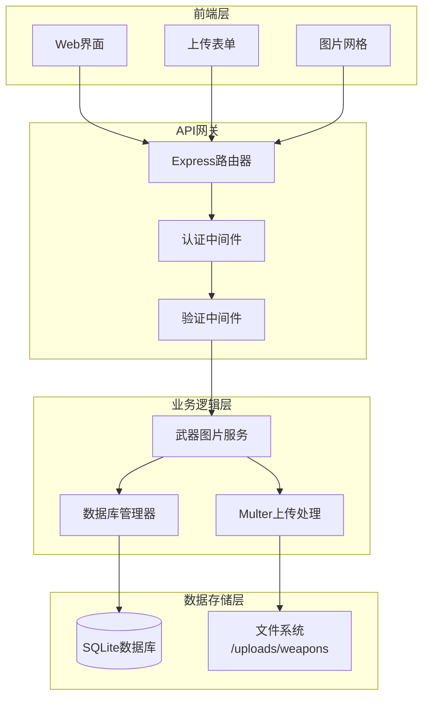
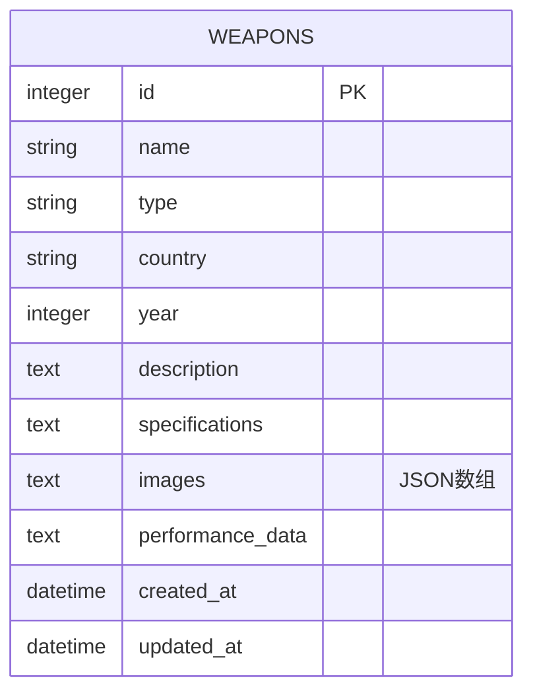
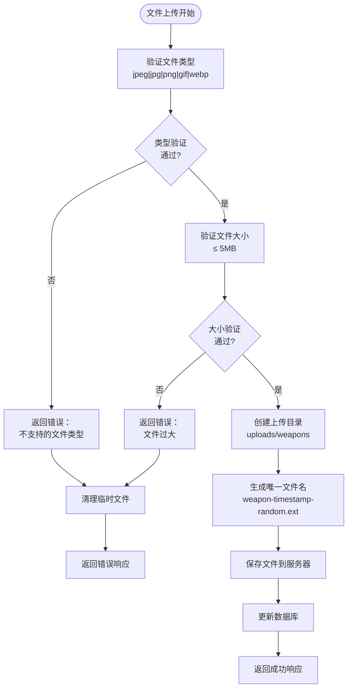
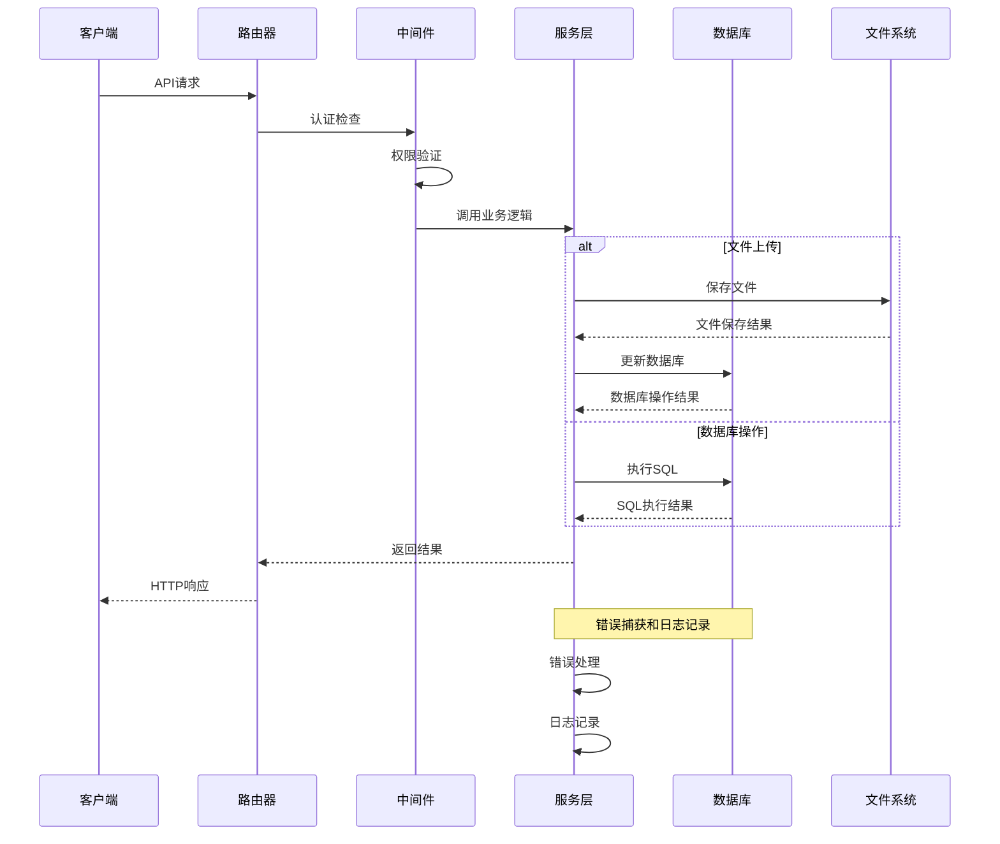

# 武器图片管理API详细文档

<cite>
**本文档中引用的文件**
- [weapon-images.js](file://backend/src/routes/weapon-images.js)
- [database-simple.js](file://backend/src/config/database-simple.js)
- [auth.js](file://backend/src/middleware/auth.js)
- [test-weapon-image-upload-fixed.html](file://test_pages/test-weapon-image-upload-fixed.html)
- [weapon-service.py](file://backend/services/weapon_service.py)
- [weapon.py](file://backend/routes/weapon.py)
</cite>

## 目录
1. [简介](#简介)
2. [系统架构概览](#系统架构概览)
3. [API接口详细说明](#api接口详细说明)
4. [数据库设计](#数据库设计)
5. [文件上传配置](#文件上传配置)
6. [错误处理机制](#错误处理机制)
7. [前端集成指南](#前端集成指南)
8. [性能优化建议](#性能优化建议)
9. [故障排除指南](#故障排除指南)
10. [总结](#总结)

## 简介

武器图片管理API是一个完整的图片管理系统，专为军事知识平台设计。该系统提供了武器图片的上传、下载、删除和更新功能，支持多种图片格式，并具备完善的权限控制和错误处理机制。

### 主要特性
- **多格式支持**：支持JPEG、JPG、PNG、GIF、WebP格式
- **文件大小限制**：单文件最大5MB
- **权限控制**：基于JWT和简化管理员模式的双重认证
- **JSON存储**：图片元数据以JSON格式存储在SQLite数据库中
- **文件系统管理**：图片文件存储在本地文件系统中

## 系统架构概览



**图表来源**
- [weapon-images.js](file://backend/src/routes/weapon-images.js#L1-L370)
- [database-simple.js](file://backend/src/config/database-simple.js#L1-L323)

## API接口详细说明

### GET /api/weapon-images/:weaponId

获取指定武器的所有图片信息。

#### 请求参数
| 参数名 | 类型 | 必需 | 说明 |
|--------|------|------|------|
| weaponId | string/number | 是 | 武器ID，支持多种格式 |

#### ID格式转换逻辑
系统自动处理多种ID格式：
- `weapon_2` → `2`
- `weapon_3_abc` → `3`
- `2` → `2`（保持不变）

#### 响应格式
```json
{
  "success": true,
  "data": {
    "weaponId": 364,
    "weaponName": "95式自动步枪",
    "images": [
      {
        "id": 1634567890123,
        "filename": "weapon-1634567890123-abcd1234.jpg",
        "originalName": "ak47_original.jpg",
        "path": "/uploads/weapons/weapon-1634567890123-abcd1234.jpg",
        "size": 2048576,
        "description": "经典AK-47步枪",
        "uploadedAt": "2023-10-15T09:30:00.000Z"
      }
    ]
  }
}
```

#### 错误响应
| 状态码 | 错误信息 | 说明 |
|--------|----------|------|
| 400 | "无效的武器ID格式" | ID格式无法转换为数字 |
| 404 | "武器不存在" | 武器ID不存在于数据库中 |
| 500 | "数据库连接错误" | 数据库连接失败 |

**章节来源**
- [weapon-images.js](file://backend/src/routes/weapon-images.js#L43-L127)

### POST /api/weapon-images/:weaponId

上传新的武器图片。

#### 请求头
| 头部名称 | 值 | 说明 |
|----------|-----|------|
| Content-Type | multipart/form-data | 必须使用表单数据格式 |
| x-admin-user | true | 简化管理员认证 |

#### 请求体参数
| 参数名 | 类型 | 必需 | 说明 |
|--------|------|------|------|
| image | file | 是 | 图片文件 |
| description | string | 否 | 图片描述 |

#### 成功响应
```json
{
  "success": true,
  "message": "图片上传成功",
  "data": {
    "image": {
      "id": 1634567890123,
      "filename": "weapon-1634567890123-abcd1234.jpg",
      "originalName": "new_weapon.jpg",
      "path": "/uploads/weapons/weapon-1634567890123-abcd1234.jpg",
      "size": 3145728,
      "description": "新武器测试图片",
      "uploadedAt": "2023-10-15T10:15:00.000Z"
    }
  }
}
```

#### 错误响应
| 状态码 | 错误信息 | 说明 |
|--------|----------|------|
| 400 | "请选择要上传的图片" | 未选择文件 |
| 400 | "只允许上传图片文件" | 不支持的文件类型 |
| 400 | "文件大小超过限制" | 超过5MB限制 |
| 404 | "武器不存在" | 武器ID不存在 |
| 500 | "上传图片失败" | 服务器内部错误 |

**章节来源**
- [weapon-images.js](file://backend/src/routes/weapon-images.js#L129-L223)

### DELETE /api/weapon-images/:weaponId/:imageId

删除指定的武器图片。

#### 权限要求
- 需要管理员权限
- 支持简化管理员模式（x-admin-user: true）

#### 成功响应
```json
{
  "success": true,
  "message": "图片删除成功"
}
```

#### 错误响应
| 状态码 | 错误信息 | 说明 |
|--------|----------|------|
| 404 | "武器不存在" | 武器ID不存在 |
| 404 | "图片不存在" | 图片ID不存在于武器中 |
| 500 | "删除图片失败" | 服务器内部错误 |

**章节来源**
- [weapon-images.js](file://backend/src/routes/weapon-images.js#L225-L295)

### PUT /api/weapon-images/:weaponId/:imageId

更新图片描述信息。

#### 请求体参数
| 参数名 | 类型 | 必需 | 说明 |
|--------|------|------|------|
| description | string | 是 | 新的图片描述 |

#### 成功响应
```json
{
  "success": true,
  "message": "图片描述更新成功",
  "data": {
    "image": {
      "id": 1634567890123,
      "filename": "weapon-1634567890123-abcd1234.jpg",
      "originalName": "new_weapon.jpg",
      "path": "/uploads/weapons/weapon-1634567890123-abcd1234.jpg",
      "size": 3145728,
      "description": "更新后的图片描述",
      "uploadedAt": "2023-10-15T10:15:00.000Z",
      "updatedAt": "2023-10-15T11:30:00.000Z"
    }
  }
}
```

#### 错误响应
| 状态码 | 错误信息 | 说明 |
|--------|----------|------|
| 404 | "武器不存在" | 武器ID不存在 |
| 404 | "图片不存在" | 图片ID不存在于武器中 |
| 500 | "更新图片描述失败" | 服务器内部错误 |

**章节来源**
- [weapon-images.js](file://backend/src/routes/weapon-images.js#L297-L369)

## 数据库设计

### 武器表结构



**图表来源**
- [database-simple.js](file://backend/src/config/database-simple.js#L84-L95)

### 图片元数据结构

图片信息以JSON数组格式存储在`weapons.images`字段中：

```json
[
  {
    "id": 1634567890123,
    "filename": "weapon-1634567890123-abcd1234.jpg",
    "originalName": "ak47_original.jpg",
    "path": "/uploads/weapons/weapon-1634567890123-abcd1234.jpg",
    "size": 2048576,
    "description": "经典AK-47步枪",
    "uploadedAt": "2023-10-15T09:30:00.000Z"
  }
]
```

### 字段说明

| 字段名 | 类型 | 说明 |
|--------|------|------|
| id | number | 图片唯一标识符（时间戳） |
| filename | string | 服务器端生成的文件名 |
| originalName | string | 用户上传时的原始文件名 |
| path | string | 访问路径（相对于根目录） |
| size | number | 文件大小（字节） |
| description | string | 图片描述信息 |
| uploadedAt | string | ISO格式上传时间 |
| updatedAt | string | ISO格式更新时间（仅更新时存在） |

**章节来源**
- [database-simple.js](file://backend/src/config/database-simple.js#L84-L95)

## 文件上传配置

### Multer配置详解



**图表来源**
- [weapon-images.js](file://backend/src/routes/weapon-images.js#L14-L36)

### 配置参数

| 参数 | 值 | 说明 |
|------|-----|------|
| storage.destination | uploads/weapons | 上传目录路径 |
| storage.filename | weapon-timestamp-random.ext | 文件名生成规则 |
| limits.fileSize | 5MB | 单文件大小限制 |
| fileFilter | jpeg\|jpg\|png\|gif\|webp | 允许的文件类型 |

### 文件名生成规则

系统使用以下格式生成唯一文件名：
```
weapon-{timestamp}-{random_number}.{extension}
```

示例：
- `weapon-1634567890123-123456789.jpg`
- `weapon-1634567890123-987654321.png`

**章节来源**
- [weapon-images.js](file://backend/src/routes/weapon-images.js#L14-L36)

## 错误处理机制

### 分层错误处理



**图表来源**
- [weapon-images.js](file://backend/src/routes/weapon-images.js#L43-L369)

### 错误分类与处理

| 错误类型 | HTTP状态码 | 处理策略 | 示例场景 |
|----------|------------|----------|----------|
| 认证错误 | 401/403 | 立即返回 | 未登录或权限不足 |
| 参数错误 | 400 | 详细错误信息 | 无效ID格式、文件类型错误 |
| 资源不存在 | 404 | 清理资源 | 武器不存在、图片不存在 |
| 服务器错误 | 500 | 通用错误消息 | 数据库连接失败、文件系统错误 |

### 日志记录策略

系统采用分级日志记录：
- **INFO**：正常操作记录
- **WARN**：警告信息（如解析失败）
- **ERROR**：错误信息和堆栈跟踪

**章节来源**
- [weapon-images.js](file://backend/src/routes/weapon-images.js#L43-L369)

## 前端集成指南

### 基本集成步骤

#### 1. HTML表单结构

```html
<form id="uploadForm" enctype="multipart/form-data">
    <input type="hidden" id="weaponId" value="364">
    <input type="file" id="imageFile" accept="image/*" required>
    <textarea id="description" placeholder="图片描述"></textarea>
    <button type="submit">上传图片</button>
</form>
```

#### 2. JavaScript上传实现

```javascript
async function uploadImage() {
    const weaponId = document.getElementById('weaponId').value;
    const fileInput = document.getElementById('imageFile');
    const description = document.getElementById('description').value;
    
    const formData = new FormData();
    formData.append('image', fileInput.files[0]);
    formData.append('description', description);
    
    const response = await fetch(`/api/weapon-images/${weaponId}`, {
        method: 'POST',
        headers: {
            'x-admin-user': 'true'
        },
        body: formData
    });
    
    const result = await response.json();
    return result;
}
```

#### 3. 图片展示组件

```javascript
function displayImages(weaponData) {
    const container = document.getElementById('imagesContainer');
    let html = '';
    
    weaponData.images.forEach(image => {
        html += `
            <div class="image-item">
                
                <p>${image.description}</p>
                <button onclick="deleteImage(${weaponData.weaponId}, ${image.id})">
                    删除
                </button>
            </div>
        `;
    });
    
    container.innerHTML = html;
}
```

### 权限控制集成

#### 简化管理员模式
```javascript
// 在开发环境中使用简化管理员模式
fetch('/api/weapon-images/364', {
    headers: {
        'x-admin-user': 'true'  // 开发环境专用
    }
});
```

#### JWT认证模式
```javascript
// 生产环境使用JWT认证
fetch('/api/weapon-images/364', {
    headers: {
        'Authorization': 'Bearer ' + jwtToken
    }
});
```

**章节来源**
- [test-weapon-image-upload-fixed.html](file://test_pages/test-weapon-image-upload-fixed.html#L1-L249)

## 性能优化建议

### 1. 缓存策略

- **数据库查询缓存**：对频繁访问的武器图片数据实施缓存
- **图片预加载**：在知识图谱中预加载武器图片缩略图
- **CDN加速**：将图片文件部署到CDN以提高访问速度

### 2. 文件系统优化

- **分目录存储**：按日期或武器类型分目录存储图片
- **压缩优化**：对大尺寸图片进行压缩处理
- **定期清理**：建立垃圾回收机制清理无效文件

### 3. 数据库优化

- **索引优化**：在`weapons.id`上建立索引
- **JSON查询优化**：考虑将常用图片字段提取到独立列
- **连接池管理**：使用连接池管理数据库连接

### 4. 前端优化

- **懒加载**：图片列表采用懒加载技术
- **图片压缩**：前端对大图片进行预压缩
- **进度提示**：上传过程中显示进度条

## 故障排除指南

### 常见问题及解决方案

#### 1. 文件上传失败

**问题症状**：
- 上传后返回500错误
- 文件未出现在服务器目录

**排查步骤**：
1. 检查上传目录权限：`chmod 755 uploads/weapons`
2. 验证磁盘空间：确保有足够的可用空间
3. 检查文件名冲突：确认文件名唯一性
4. 查看服务器日志：定位具体错误原因

**解决方案**：
```bash
# 创建上传目录并设置权限
mkdir -p uploads/weapons
chmod 755 uploads/weapons
chown www-data:www-data uploads/weapons
```

#### 2. 图片显示异常

**问题症状**：
- 图片无法加载
- 显示默认占位符

**排查步骤**：
1. 检查文件路径是否正确
2. 验证文件权限设置
3. 确认Web服务器配置
4. 检查图片格式兼容性

**解决方案**：
```javascript
// 前端图片加载错误处理

```

#### 3. 数据库连接问题

**问题症状**：
- API返回500错误
- 数据库查询超时

**排查步骤**：
1. 检查数据库文件权限
2. 验证数据库连接字符串
3. 确认SQLite版本兼容性
4. 检查数据库文件完整性

**解决方案**：
```javascript
// 数据库连接检查
const db = databaseManager.getDatabase();
if (!db) {
    console.error('数据库连接未初始化');
    // 实施重连机制
}
```

### 调试工具

#### 1. 日志分析
```bash
# 查看应用日志
tail -f logs/app.log

# 查看错误日志
tail -f logs/error.log
```

#### 2. 网络抓包
```bash
# 使用curl测试API
curl -X POST http://localhost:3001/api/weapon-images/364 \
     -H "x-admin-user: true" \
     -F "image=@test.jpg" \
     -F "description=测试图片"
```

#### 3. 数据库检查
```sql
-- 检查武器图片数据
SELECT id, name, json_array_length(images) as image_count 
FROM weapons 
WHERE json_array_length(images) > 0;

-- 检查特定武器图片
SELECT * FROM weapons 
WHERE id = 364 AND images IS NOT NULL;
```

**章节来源**
- [weapon-images.js](file://backend/src/routes/weapon-images.js#L43-L369)

## 总结

武器图片管理API提供了一个完整、可靠的图片管理系统，具备以下核心优势：

### 技术特点
- **安全性**：双重认证机制（JWT + 简化模式）
- **可靠性**：完善的错误处理和日志记录
- **扩展性**：模块化设计便于功能扩展
- **易用性**：RESTful API设计符合标准规范

### 功能完整性
- 支持多种图片格式和文件大小限制
- 提供完整的CRUD操作接口
- 实现了前后端分离的架构模式
- 具备良好的错误处理和用户体验

### 应用价值
该系统不仅满足了军事知识平台的图片管理需求，还为类似项目提供了可参考的解决方案。通过合理的架构设计和完善的错误处理机制，确保了系统的稳定性和可维护性。

对于开发者而言，该API提供了清晰的接口规范和详细的错误处理指南，便于快速集成和二次开发。同时，系统内置的调试工具和监控机制也为生产环境的运维提供了有力支持。