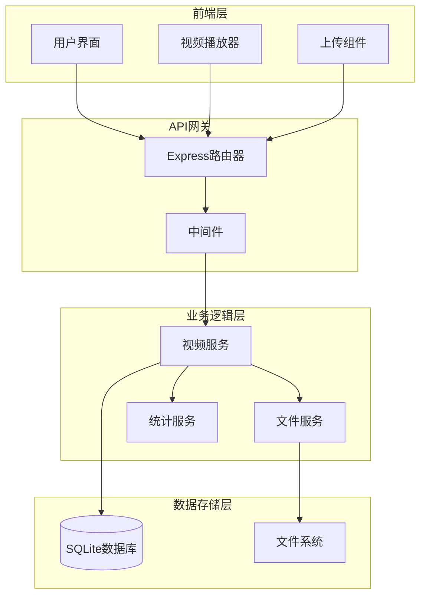
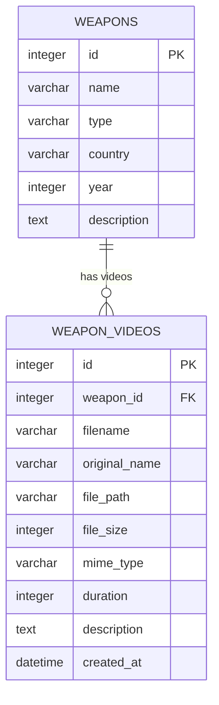
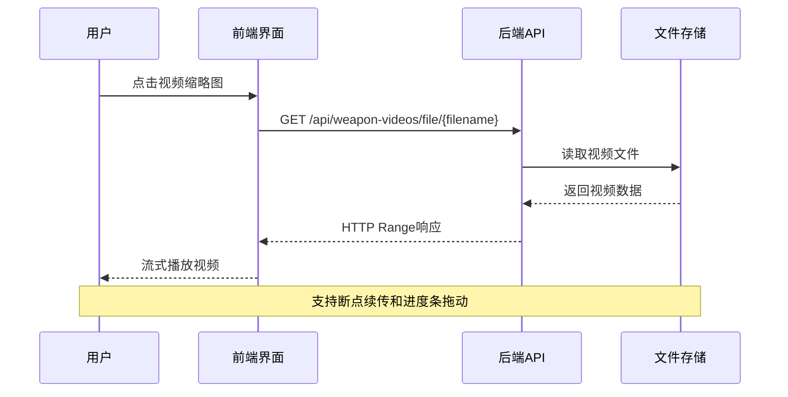

# 武器视频管理API

<cite>
**本文档引用的文件**
- [backend/src/routes/weapon-videos.js](file://backend/src/routes/weapon-videos.js)
- [function_description/武器视频管理系统实现说明.md](file://function_description/武器视频管理系统实现说明.md)
- [scripts/weapon-video-integration.js](file://scripts/weapon-video-integration.js)
- [test_pages/test-weapon-video.html](file://test_pages/test-weapon-video.html)
- [styles/weapon-video-integration.css](file://styles/weapon-video-integration.css)
- [backend/scripts/migrate-video-paths.js](file://backend/scripts/migrate-video-paths.js)
- [backend/scripts/check-deployment.js](file://backend/scripts/check-deployment.js)
</cite>

## 目录
1. [简介](#简介)
2. [系统架构](#系统架构)
3. [API接口详情](#api接口详情)
4. [数据库设计](#数据库设计)
5. [文件存储管理](#文件存储管理)
6. [前端集成](#前端集成)
7. [错误处理](#错误处理)
8. [性能优化](#性能优化)
9. [部署配置](#部署配置)
10. [故障排除](#故障排除)

## 简介

武器视频管理系统是"兵智世界"项目的核心功能模块，为每个武器节点提供完整的视频上传、管理、播放和展示功能。系统采用前后端分离架构，实现了文件上传、进度显示、视频流播放等完整功能。

### 主要特性
- **多格式支持**：MP4, AVI, MOV, WMV, FLV, WebM
- **文件大小限制**：最大100MB
- **流媒体播放**：支持HTTP Range请求和断点续传
- **级联操作**：删除武器时自动删除关联视频
- **统计功能**：提供视频数量和存储统计

## 系统架构



**图表来源**
- [backend/src/routes/weapon-videos.js](file://backend/src/routes/weapon-videos.js#L1-L50)
- [scripts/weapon-video-integration.js](file://scripts/weapon-video-integration.js#L1-L50)

## API接口详情

### 1. 获取武器视频列表

**接口地址**: `GET /api/weapon-videos/weapon/:weaponId`

**功能描述**: 获取指定武器ID的所有视频列表

**请求参数**:
| 参数名 | 类型 | 必填 | 说明 |
|--------|------|------|------|
| weaponId | integer | 是 | 武器唯一标识符 |

**响应数据结构**:
```json
{
    "success": true,
    "data": [
        {
            "id": 1,
            "weapon_id": 123,
            "filename": "weapon-video-123456789.mp4",
            "original_name": "战斗场景演示.mp4",
            "file_path": "uploads/weapons/videos/weapon-video-123456789.mp4",
            "file_size": 52428800,
            "mime_type": "video/mp4",
            "duration": 120,
            "description": "战斗场景演示视频",
            "upload_time": "2024-01-15T10:30:00Z"
        }
    ]
}
```

**状态码**:
- `200`: 成功返回视频列表
- `400`: 无效的武器ID
- `404`: 武器不存在
- `500`: 服务器内部错误

**节来源**
- [backend/src/routes/weapon-videos.js](file://backend/src/routes/weapon-videos.js#L60-L85)

### 2. 视频上传

**接口地址**: `POST /api/weapon-videos/weapon/:weaponId/upload`

**功能描述**: 上传视频文件到指定武器

**请求格式**: `multipart/form-data`

**请求参数**:
| 参数名 | 类型 | 必填 | 说明 |
|--------|------|------|------|
| video | file | 是 | 视频文件 |
| description | string | 否 | 视频描述 |

**支持的视频格式**:
- MP4 (.mp4)
- AVI (.avi)
- MOV (.mov)
- WMV (.wmv)
- FLV (.flv)
- WebM (.webm)

**文件限制**:
- 最大文件大小: 100MB
- 支持格式: 上述六种格式

**响应数据结构**:
```json
{
    "success": true,
    "message": "视频上传成功",
    "data": {
        "id": 1,
        "filename": "weapon-video-123456789.mp4",
        "originalName": "战斗场景演示.mp4",
        "fileSize": 52428800,
        "mimeType": "video/mp4",
        "description": "战斗场景演示视频"
    }
}
```

**节来源**
- [backend/src/routes/weapon-videos.js](file://backend/src/routes/weapon-videos.js#L87-L170)

### 3. 视频文件流媒体接口

**接口地址**: `GET /api/weapon-videos/file/:filename`

**功能描述**: 提供视频文件的流媒体播放支持，支持HTTP Range请求实现断点续传和进度条拖动播放

**请求参数**:
| 参数名 | 类型 | 必填 | 说明 |
|--------|------|------|------|
| filename | string | 是 | 视频文件名 |

**HTTP Range请求支持**:
- 支持标准的HTTP Range请求头
- 实现分段传输
- 支持视频进度条拖动播放

**响应头**:
- `Content-Type`: 视频MIME类型
- `Content-Length`: 文件大小
- `Accept-Ranges`: bytes
- `Content-Range`: 分段范围信息（当使用Range请求时）

**节来源**
- [backend/src/routes/weapon-videos.js](file://backend/src/routes/weapon-videos.js#L172-L240)

### 4. 更新视频信息

**接口地址**: `PUT /api/weapon-videos/:videoId`

**功能描述**: 更新视频的描述信息

**请求参数**:
| 参数名 | 类型 | 必填 | 说明 |
|--------|------|------|------|
| videoId | integer | 是 | 视频唯一标识符 |
| description | string | 是 | 新的视频描述 |

**响应数据结构**:
```json
{
    "success": true,
    "message": "视频信息更新成功"
}
```

**节来源**
- [backend/src/routes/weapon-videos.js](file://backend/src/routes/weapon-videos.js#L242-L280)

### 5. 删除视频

**接口地址**: `DELETE /api/weapon-videos/:videoId`

**功能描述**: 删除指定的视频文件和数据库记录

**请求参数**:
| 参数名 | 类型 | 必填 | 说明 |
|--------|------|------|------|
| videoId | integer | 是 | 视频唯一标识符 |

**级联操作**:
- 删除数据库中的视频记录
- 删除对应的视频文件
- 自动处理相对路径和绝对路径

**响应数据结构**:
```json
{
    "success": true,
    "message": "视频删除成功"
}
```

**节来源**
- [backend/src/routes/weapon-videos.js](file://backend/src/routes/weapon-videos.js#L282-L330)

### 6. 获取视频统计信息

**接口地址**: `GET /api/weapon-videos/weapon/:weaponId/stats`

**功能描述**: 获取指定武器的视频统计信息

**请求参数**:
| 参数名 | 类型 | 必填 | 说明 |
|--------|------|------|------|
| weaponId | integer | 是 | 武器唯一标识符 |

**响应数据结构**:
```json
{
    "success": true,
    "data": {
        "total_videos": 5,
        "total_size": 262144000,
        "avg_size": 52428800
    }
}
```

**统计字段说明**:
- `total_videos`: 该武器的视频总数
- `total_size`: 所有视频的总大小（字节）
- `avg_size`: 平均视频大小（字节）

**节来源**
- [backend/src/routes/weapon-videos.js](file://backend/src/routes/weapon-videos.js#L332-L374)

## 数据库设计

### weapon_videos表结构



**图表来源**
- [backend/src/routes/weapon-videos.js](file://backend/src/routes/weapon-videos.js#L40-L55)

### 字段说明

| 字段名 | 类型 | 说明 | 约束 |
|--------|------|------|------|
| id | INTEGER PRIMARY KEY AUTOINCREMENT | 视频唯一标识符 | 主键，自增 |
| weapon_id | INTEGER NOT NULL | 关联的武器ID | 外键，引用weapons表 |
| filename | VARCHAR(255) NOT NULL | 服务器生成的文件名 | 唯一 |
| original_name | VARCHAR(255) NOT NULL | 用户上传的原始文件名 | 保留原始文件名 |
| file_path | VARCHAR(500) NOT NULL | 文件存储路径 | 相对路径存储 |
| file_size | INTEGER | 文件大小（字节） | 存储文件大小 |
| mime_type | VARCHAR(100) | MIME类型 | 支持多种视频格式 |
| duration | INTEGER | 视频时长（秒） | 可选字段 |
| description | TEXT | 视频描述 | 用户添加的说明 |
| created_at | DATETIME DEFAULT CURRENT_TIMESTAMP | 上传时间 | 自动记录 |

### 外键约束

```sql
FOREIGN KEY (weapon_id) REFERENCES weapons(id) ON DELETE CASCADE
```

**约束说明**:
- 当删除武器时，自动删除所有关联的视频
- 确保数据完整性
- 支持级联删除操作

**节来源**
- [backend/src/routes/weapon-videos.js](file://backend/src/routes/weapon-videos.js#L40-L55)

## 文件存储管理

### 存储路径结构

```
项目根目录/
├── backend/
│   ├── uploads/
│   │   └── weapons/
│   │       └── videos/
│   │           ├── weapon-video-123456789-abc123.mp4
│   │           ├── weapon-video-987654321-def456.avi
│   │           └── ...
│   └── data/
│       └── military-knowledge.db
```

### 路径管理策略

1. **相对路径存储**: 数据库存储相对路径，提高可移植性
2. **文件重命名**: 使用时间戳+随机数避免文件名冲突
3. **路径转换**: 自动处理相对路径和绝对路径转换
4. **路径迁移**: 支持路径格式迁移和回滚

### 文件安全措施

1. **类型验证**: 严格验证MIME类型
2. **大小限制**: 100MB文件大小限制
3. **文件名安全**: 时间戳重命名防止恶意文件名
4. **路径安全**: 相对路径存储避免路径遍历攻击

**节来源**
- [backend/src/routes/weapon-videos.js](file://backend/src/routes/weapon-videos.js#L15-L25)
- [backend/scripts/migrate-video-paths.js](file://backend/scripts/migrate-video-paths.js#L1-L50)

## 前端集成

### 视频播放器集成



**图表来源**
- [scripts/weapon-video-integration.js](file://scripts/weapon-video-integration.js#L1200-L1240)
- [test_pages/test-weapon-video.html](file://test_pages/test-weapon-video.html#L246-L273)

### 知识图谱集成

系统与知识图谱系统无缝集成，在武器节点上显示视频缩略图：

1. **节点显示**: 武器节点显示视频数量和缩略图
2. **快速访问**: 点击节点直接进入视频管理界面
3. **统计信息**: 显示视频数量统计

### 用户界面设计

#### 1. 视频管理界面
- **渐变色标题栏**: 现代化设计风格
- **卡片式布局**: 响应式网格系统
- **交互反馈**: 悬停效果和动画过渡

#### 2. 上传区域
- **拖拽上传**: 虚线边框和拖拽状态提示
- **进度显示**: 滑入动画效果和渐变色进度条
- **实时状态**: 颜色状态指示（蓝色上传中→绿色成功→红色失败）

#### 3. 视频播放器
- **全屏体验**: 黑色背景和居中播放
- **信息叠加**: 渐变遮罩和可控显示
- **操作按钮**: 圆形按钮和图标切换

**节来源**
- [styles/weapon-video-integration.css](file://styles/weapon-video-integration.css#L1-L100)
- [scripts/weapon-video-integration.js](file://scripts/weapon-video-integration.js#L1-L200)

## 错误处理

### 常见错误码及处理

| 错误类型 | HTTP状态码 | 错误信息 | 处理建议 |
|----------|------------|----------|----------|
| 无效武器ID | 400 | "无效的武器ID" | 检查武器ID有效性 |
| 武器不存在 | 404 | "武器不存在" | 验证武器是否存在于数据库 |
| 视频不存在 | 404 | "视频不存在" | 检查视频ID和文件是否存在 |
| 文件不存在 | 404 | "视频文件不存在" | 检查文件系统中的实际文件 |
| 文件过大 | 400 | "文件大小超过限制" | 限制文件大小不超过100MB |
| 格式不支持 | 400 | "只支持指定格式的视频文件" | 仅支持MP4、AVI、MOV等格式 |
| 上传失败 | 500 | "上传视频失败" | 检查磁盘空间和权限 |
| 删除失败 | 500 | "删除视频失败" | 检查文件权限和数据库连接 |

### 错误恢复机制

1. **文件清理**: 上传失败时自动删除临时文件
2. **事务处理**: 数据库操作使用事务保证一致性
3. **路径验证**: 上传前验证目标路径可写性
4. **权限检查**: 确保必要的文件系统权限

**节来源**
- [backend/src/routes/weapon-videos.js](file://backend/src/routes/weapon-videos.js#L150-L170)

## 性能优化

### 前端优化

1. **进度显示**: 使用XMLHttpRequest原生支持进度监听
2. **内存管理**: 及时清理DOM元素和事件监听器
3. **事件绑定**: 防抖处理减少频繁操作
4. **状态管理**: 上传锁定机制防止重复提交

### 后端优化

1. **流式传输**: HTTP Range支持实现高效流媒体
2. **文件缓存**: Express静态文件服务优化
3. **数据库索引**: weapon_id索引优化查询性能
4. **错误恢复**: 事务处理保证数据一致性

### 性能监控指标

- **上传速度**: 监控平均上传速度
- **播放流畅度**: 监控视频播放缓冲情况
- **存储空间**: 监控视频文件存储使用情况
- **响应时间**: 监控API接口响应时间

**节来源**
- [scripts/weapon-video-integration.js](file://scripts/weapon-video-integration.js#L800-L900)

## 部署配置

### 环境要求

- **Node.js**: 版本14或更高
- **SQLite3**: 数据库引擎
- **文件系统**: 写权限用于上传目录
- **内存**: 至少512MB可用内存

### 目录结构

```
backend/
├── uploads/weapons/videos/     # 视频文件存储
├── src/routes/weapon-videos.js # 视频路由
├── data/military-knowledge.db  # 数据库文件
└── src/app-simple.js           # 应用入口
```

### 配置文件

```javascript
// 后端配置
const uploadDir = path.join(__dirname, '../../uploads/weapons/videos');
if (!fs.existsSync(uploadDir)) {
    fs.mkdirSync(uploadDir, { recursive: true });
}

// 静态文件服务
app.use('/uploads', express.static('uploads'));
app.use('/api/weapon-videos', weaponVideosRouter);
```

### 数据库初始化

系统启动时自动创建weapon_videos表，包含完整的外键约束和索引。

**节来源**
- [backend/src/routes/weapon-videos.js](file://backend/src/routes/weapon-videos.js#L15-L25)

## 故障排除

### 常见问题及解决方案

#### 1. 视频上传失败
**症状**: 上传过程中断或返回错误
**可能原因**:
- 磁盘空间不足
- 文件权限问题
- 网络连接中断

**解决方法**:
- 检查磁盘剩余空间
- 确认uploads目录写权限
- 检查网络连接稳定性

#### 2. 视频播放卡顿
**症状**: 视频播放不流畅
**可能原因**:
- 网络带宽不足
- 服务器性能瓶颈
- 视频文件过大

**解决方法**:
- 检查网络带宽
- 优化服务器性能
- 压缩视频文件

#### 3. 文件路径问题
**症状**: 视频文件找不到
**可能原因**:
- 路径格式不正确
- 文件被意外删除
- 权限设置错误

**解决方法**:
- 运行路径迁移脚本
- 检查文件系统权限
- 验证数据库路径记录

### 监控和日志

系统提供详细的日志记录：

1. **上传日志**: 记录每次上传操作
2. **播放日志**: 记录视频播放访问
3. **错误日志**: 记录异常和错误信息
4. **性能日志**: 记录响应时间和资源使用

### 数据备份

建议定期进行以下备份：

1. **数据库备份**: 定期备份military-knowledge.db
2. **文件备份**: 备份uploads目录下的所有视频文件
3. **配置备份**: 备份关键配置文件

**节来源**
- [backend/scripts/check-deployment.js](file://backend/scripts/check-deployment.js#L1-L50)

## 结论

武器视频管理系统提供了完整的视频管理解决方案，具备以下优势：

1. **功能完整**: 支持上传、播放、管理、统计等完整功能
2. **性能优异**: 流媒体播放支持断点续传和进度条拖动
3. **易于集成**: 与知识图谱系统无缝集成
4. **安全可靠**: 完善的错误处理和安全措施
5. **易于维护**: 清晰的架构设计和完善的监控机制

该系统为"兵智世界"项目提供了强大的多媒体内容管理能力，支持丰富的武器展示和教育应用场景。