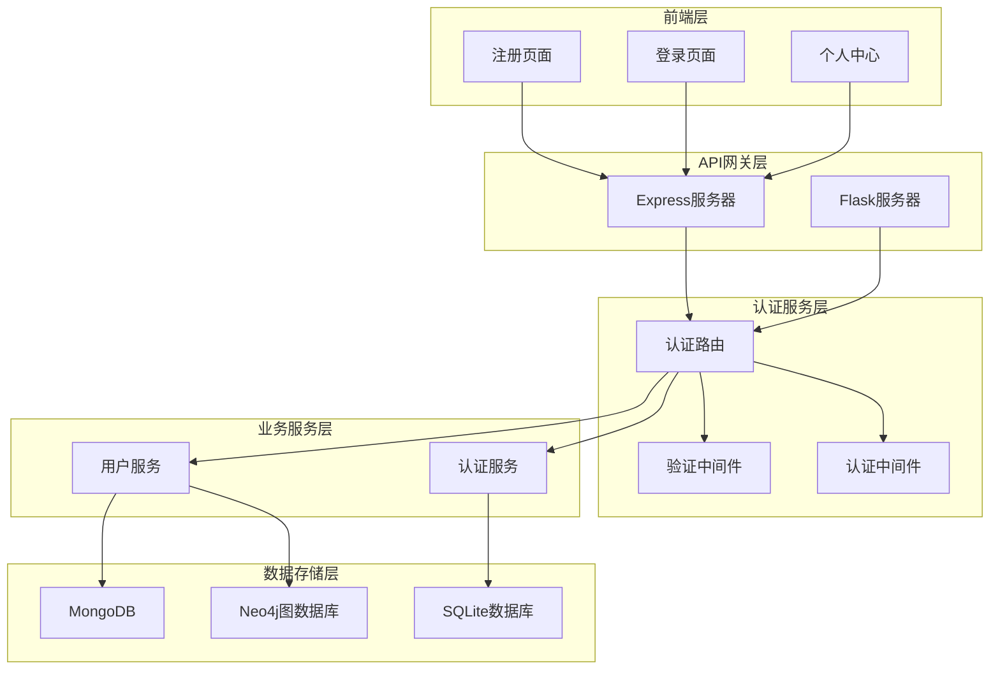
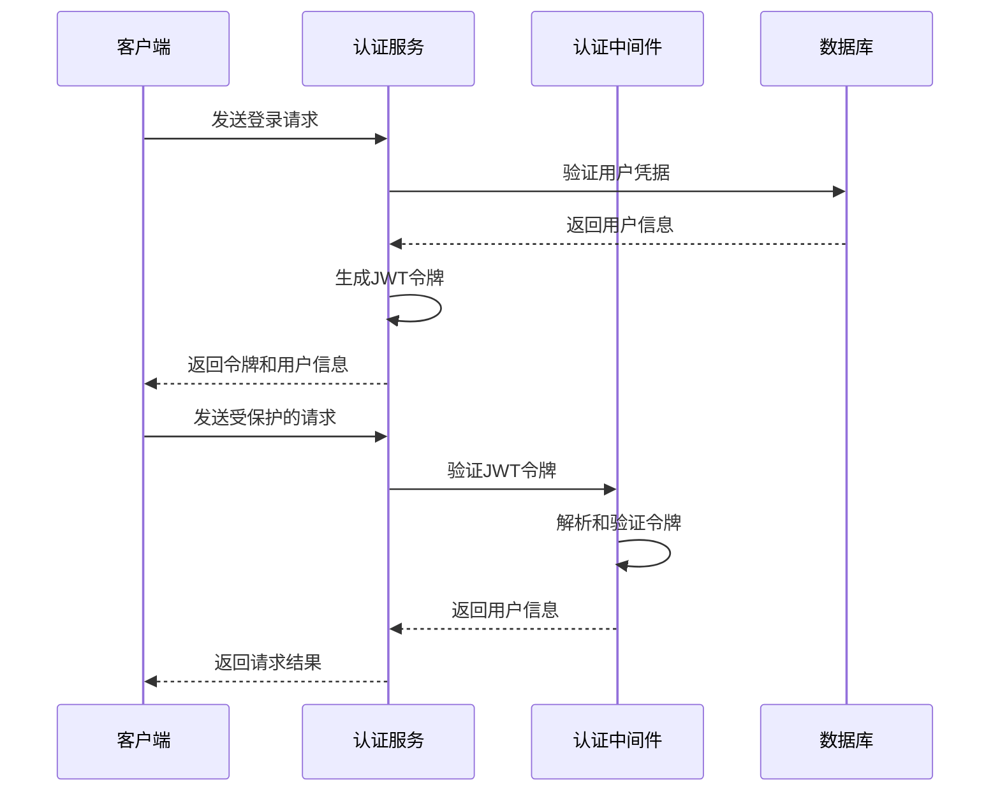
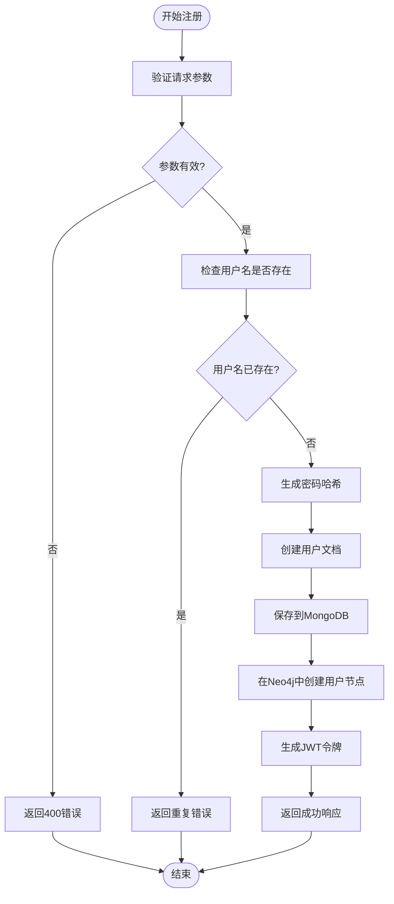
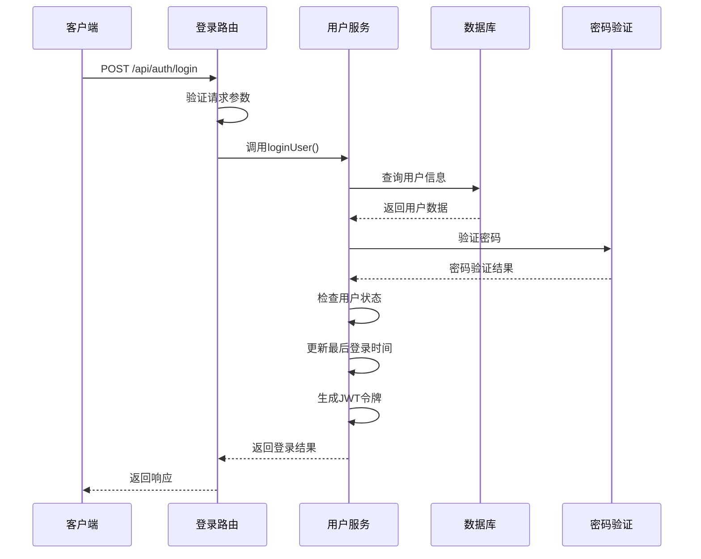
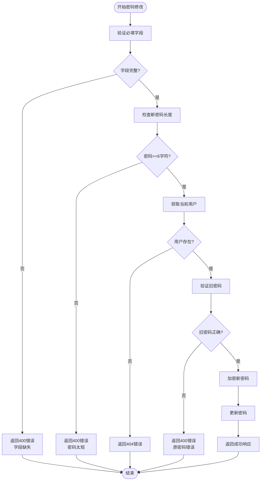
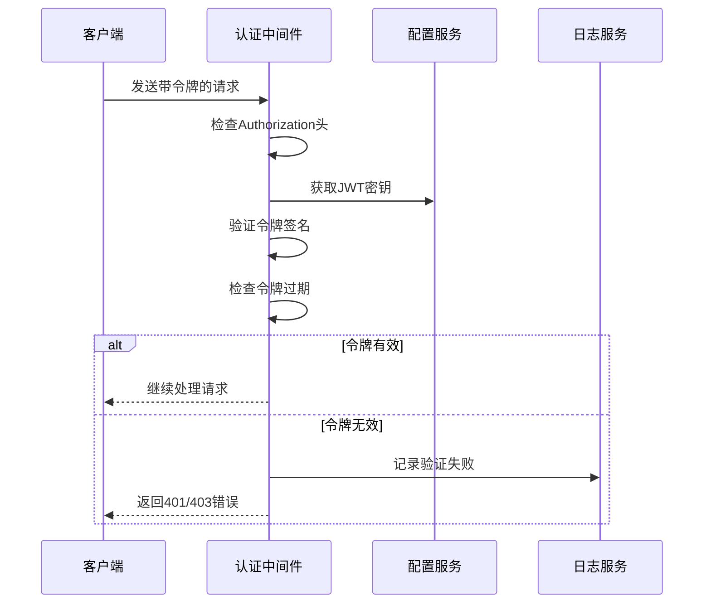

# 用户认证API

<cite>
**本文档中引用的文件**
- [backend/routes/auth.py](file://backend/routes/auth.py)
- [backend/src/routes/auth.js](file://backend/src/routes/auth.js)
- [backend/models/user.py](file://backend/models/user.py)
- [backend/src/middleware/auth.js](file://backend/src/middleware/auth.js)
- [backend/src/middleware/validation.js](file://backend/src/middleware/validation.js)
- [backend/src/services/userService.js](file://backend/src/services/userService.js)
- [backend/app.py](file://backend/app.py)
- [backend/src/app.js](file://backend/src/app.js)
- [register.html](file://register.html)
- [login.html](file://login.html)
- [profile.html](file://profile.html)
- [backend/src/config/index.js](file://backend/src/config/index.js)
- [backend/.env](file://backend/.env)
</cite>

## 目录
1. [简介](#简介)
2. [系统架构](#系统架构)
3. [JWT令牌机制](#jwt令牌机制)
4. [用户注册接口](#用户注册接口)
5. [用户登录接口](#用户登录接口)
6. [用户信息管理接口](#用户信息管理接口)
7. [密码管理接口](#密码管理接口)
8. [令牌管理接口](#令牌管理接口)
9. [错误处理机制](#错误处理机制)
10. [前端集成指南](#前端集成指南)
11. [最佳实践](#最佳实践)

## 简介

本文档详细描述了兵智世界系统的用户认证API接口。该系统采用现代化的JWT（JSON Web Token）认证机制，支持多种认证场景，包括标准用户认证、管理员简化模式和可选认证。系统设计遵循RESTful API原则，提供完整的用户生命周期管理功能。

## 系统架构



**图表来源**
- [backend/src/app.js](file://backend/src/app.js#L1-L248)
- [backend/app.py](file://backend/app.py#L1-L43)
- [backend/src/routes/auth.js](file://backend/src/routes/auth.js#L1-L144)

**章节来源**
- [backend/src/app.js](file://backend/src/app.js#L1-L248)
- [backend/app.py](file://backend/app.py#L1-L43)

## JWT令牌机制

### 令牌生成与验证

系统采用JWT（JSON Web Token）作为主要的身份认证机制，支持以下特性：

- **令牌结构**：包含用户ID、用户名、角色和过期时间
- **加密算法**：使用HS256算法进行签名
- **过期时间**：默认7天，可在配置中调整
- **安全机制**：支持令牌黑名单和刷新机制



**图表来源**
- [backend/src/middleware/auth.js](file://backend/src/middleware/auth.js#L1-L106)
- [backend/src/services/userService.js](file://backend/src/services/userService.js#L1-L318)

### 令牌配置

| 配置项 | 默认值 | 描述 |
|--------|--------|------|
| SECRET_KEY | 'default-secret-key' | JWT签名密钥 |
| JWT_EXPIRES_IN | '7d' | 令牌过期时间 |
| ALGORITHM | 'HS256' | 签名算法 |

**章节来源**
- [backend/src/config/index.js](file://backend/src/config/index.js#L1-L73)
- [backend/.env](file://backend/.env#L1-L36)

## 用户注册接口

### 接口规范

**POST /api/auth/register**

用户注册接口负责创建新用户账户，执行完整的用户创建流程。

#### 请求参数

| 参数名 | 类型 | 必填 | 验证规则 | 描述 |
|--------|------|------|----------|------|
| username | string | 是 | 字母数字，3-30字符 | 用户唯一标识符 |
| email | string | 是 | 有效邮箱格式 | 用户联系邮箱 |
| password | string | 是 | 最少6字符 | 用户登录密码 |
| name | string | 否 | 2-50字符 | 用户真实姓名 |

#### 请求示例

```javascript
// 前端请求示例
fetch('http://localhost:3001/api/auth/register', {
    method: 'POST',
    headers: {
        'Content-Type': 'application/json'
    },
    body: JSON.stringify({
        username: 'testuser',
        email: 'test@example.com',
        password: 'securepassword123',
        name: '测试用户'
    })
})
```

#### 响应格式

**成功响应 (201)**：
```json
{
    "success": true,
    "message": "注册成功",
    "data": {
        "user": {
            "id": "64bit_unique_id",
            "username": "testuser",
            "email": "test@example.com",
            "profile": {
                "name": "测试用户",
                "avatar": null,
                "preferences": {
                    "theme": "light",
                    "language": "zh-cn"
                }
            },
            "role": "user",
            "status": "active"
        },
        "token": "jwt_token_here"
    }
}
```

**错误响应 (400)**：
```json
{
    "success": false,
    "message": "数据验证失败",
    "errors": [
        {
            "field": "username",
            "message": "用户名只能包含字母和数字"
        },
        {
            "field": "password",
            "message": "密码至少需要6个字符"
        }
    ]
}
```

#### 注册流程



**图表来源**
- [backend/src/services/userService.js](file://backend/src/services/userService.js#L15-L85)
- [backend/src/middleware/validation.js](file://backend/src/middleware/validation.js#L1-L178)

**章节来源**
- [backend/src/routes/auth.js](file://backend/src/routes/auth.js#L1-L15)
- [backend/src/services/userService.js](file://backend/src/services/userService.js#L15-L85)
- [backend/src/middleware/validation.js](file://backend/src/middleware/validation.js#L25-L65)

## 用户登录接口

### 接口规范

**POST /api/auth/login**

用户登录接口验证用户凭据并发放JWT访问令牌。

#### 请求参数

| 参数名 | 类型 | 必填 | 描述 |
|--------|------|------|------|
| username | string | 是 | 用户名或邮箱 |
| password | string | 是 | 用户密码 |

#### 请求示例

```javascript
// 前端请求示例
fetch('http://localhost:3001/api/auth/login', {
    method: 'POST',
    headers: {
        'Content-Type': 'application/json'
    },
    body: JSON.stringify({
        username: 'testuser',
        password: 'securepassword123'
    })
})
```

#### 响应格式

**成功响应 (200)**：
```json
{
    "success": true,
    "message": "登录成功",
    "data": {
        "user": {
            "id": "64bit_unique_id",
            "username": "testuser",
            "email": "test@example.com",
            "profile": {
                "name": "测试用户",
                "avatar": null,
                "preferences": {
                    "theme": "light",
                    "language": "zh-cn"
                }
            },
            "role": "user",
            "status": "active",
            "last_login": "2024-01-15T10:30:00Z"
        },
        "token": "jwt_token_here"
    }
}
```

**错误响应 (401)**：
```json
{
    "success": false,
    "message": "用户名或密码错误"
}
```

#### 登录验证流程



**图表来源**
- [backend/src/services/userService.js](file://backend/src/services/userService.js#L87-L150)
- [backend/src/middleware/auth.js](file://backend/src/middleware/auth.js#L10-L35)

**章节来源**
- [backend/src/routes/auth.js](file://backend/src/routes/auth.js#L17-L32)
- [backend/src/services/userService.js](file://backend/src/services/userService.js#L87-L150)

## 用户信息管理接口

### 获取用户信息

**GET /api/auth/profile**

获取当前认证用户的详细信息。

#### 请求头

| 头部字段 | 值 | 描述 |
|----------|-----|------|
| Authorization | Bearer {token} | 包含JWT令牌的授权头 |

#### 响应格式

**成功响应 (200)**：
```json
{
    "success": true,
    "data": {
        "id": "64bit_unique_id",
        "username": "testuser",
        "email": "test@example.com",
        "profile": {
            "name": "测试用户",
            "avatar": "/uploads/avatar.jpg",
            "preferences": {
                "theme": "dark",
                "language": "zh-cn"
            }
        },
        "role": "user",
        "status": "active",
        "created_at": "2024-01-01T00:00:00Z",
        "last_login": "2024-01-15T10:30:00Z"
    }
}
```

### 更新用户资料

**PUT /api/auth/profile**

更新当前用户的个人资料信息。

#### 请求参数

| 参数名 | 类型 | 必填 | 描述 |
|--------|------|------|------|
| name | string | 否 | 用户姓名 |
| preferences | object | 否 | 用户偏好设置 |
| avatar | string | 否 | 头像URL |

#### 请求示例

```javascript
// 前端请求示例
fetch('http://localhost:3001/api/auth/profile', {
    method: 'PUT',
    headers: {
        'Content-Type': 'application/json',
        'Authorization': 'Bearer jwt_token_here'
    },
    body: JSON.stringify({
        name: '新名字',
        preferences: {
            theme: 'dark',
            language: 'zh-cn'
        },
        avatar: '/uploads/new_avatar.jpg'
    })
})
```

#### 响应格式

**成功响应 (200)**：
```json
{
    "success": true,
    "message": "资料更新成功"
}
```

**章节来源**
- [backend/src/routes/auth.js](file://backend/src/routes/auth.js#L34-L65)
- [backend/src/services/userService.js](file://backend/src/services/userService.js#L180-L220)

## 密码管理接口

### 修改密码

**PUT /api/auth/change-password**

修改用户密码的安全接口，包含严格的验证流程。

#### 请求参数

| 参数名 | 类型 | 必填 | 验证规则 | 描述 |
|--------|------|------|----------|------|
| oldPassword | string | 是 | 无特殊要求 | 当前密码 |
| newPassword | string | 是 | 至少6字符 | 新密码 |

#### 请求示例

```javascript
// 前端请求示例
fetch('http://localhost:3001/api/auth/change-password', {
    method: 'PUT',
    headers: {
        'Content-Type': 'application/json',
        'Authorization': 'Bearer jwt_token_here'
    },
    body: JSON.stringify({
        oldPassword: 'current_password',
        newPassword: 'new_secure_password'
    })
})
```

#### 验证规则



**图表来源**
- [backend/src/routes/auth.js](file://backend/src/routes/auth.js#L67-L85)
- [backend/src/services/userService.js](file://backend/src/services/userService.js#L222-L270)

#### 错误响应

**字段缺失**：
```json
{
    "success": false,
    "message": "原密码和新密码都是必填项"
}
```

**密码太短**：
```json
{
    "success": false,
    "message": "新密码至少需要6个字符"
}
```

**原密码错误**：
```json
{
    "success": false,
    "message": "原密码错误"
}
```

**章节来源**
- [backend/src/routes/auth.js](file://backend/src/routes/auth.js#L67-L85)
- [backend/src/services/userService.js](file://backend/src/services/userService.js#L222-L270)

## 令牌管理接口

### 令牌刷新

**POST /api/auth/refresh**

刷新现有的JWT访问令牌，延长用户会话。

#### 请求头

| 头部字段 | 值 | 描述 |
|----------|-----|------|
| Authorization | Bearer {token} | 包含当前JWT令牌 |

#### 响应格式

**成功响应 (200)**：
```json
{
    "success": true,
    "message": "令牌刷新成功",
    "data": {
        "token": "new_jwt_token_here"
    }
}
```

### 退出登录

**POST /api/auth/logout**

使当前JWT令牌失效，完成用户登出操作。

#### 实现特点

- **简单实现**：目前仅返回成功消息
- **扩展性**：支持将来实现令牌黑名单机制
- **安全性**：客户端负责清除本地存储的令牌

#### 响应格式

**成功响应 (200)**：
```json
{
    "success": true,
    "message": "退出登录成功"
}
```

**章节来源**
- [backend/src/routes/auth.js](file://backend/src/routes/auth.js#L87-L143)

## 错误处理机制

### HTTP状态码

| 状态码 | 场景 | 描述 |
|--------|------|------|
| 200 | 成功 | 请求处理成功 |
| 201 | 创建成功 | 资源创建成功 |
| 400 | 验证错误 | 请求参数验证失败 |
| 401 | 未授权 | 令牌缺失或无效 |
| 403 | 权限不足 | 访问被拒绝 |
| 404 | 资源不存在 | 请求的资源不存在 |
| 500 | 服务器错误 | 内部服务器错误 |

### 错误响应格式

```javascript
// 通用错误响应结构
{
    "success": false,
    "message": "错误描述信息",
    "details": {
        "field": "错误字段名",
        "message": "具体的错误消息"
    }
}
```

### JWT令牌使用规范

#### 请求头格式

```javascript
// 正确的Authorization头格式
headers: {
    'Authorization': 'Bearer your_jwt_token_here'
}

// 错误格式示例
headers: {
    'Authorization': 'Bearer' // 缺少空格
}
headers: {
    'Authorization': 'Bearer' // 缺少令牌
}
```

#### 令牌验证流程



**图表来源**
- [backend/src/middleware/auth.js](file://backend/src/middleware/auth.js#L10-L35)

**章节来源**
- [backend/src/app.js](file://backend/src/app.js#L130-L180)
- [backend/src/middleware/auth.js](file://backend/src/middleware/auth.js#L10-L35)

## 前端集成指南

### 注册页面集成

前端注册页面实现了完整的用户注册流程，包括：

- **实时验证**：用户名格式、密码强度、邮箱有效性
- **密码确认**：确保两次输入的密码一致
- **本地存储**：自动保存JWT令牌和用户信息
- **用户体验**：加载状态提示和错误反馈

#### 关键代码片段

```javascript
// 注册成功后的处理
if (data.success) {
    // 保存令牌和用户信息
    localStorage.setItem('authToken', data.data.token);
    localStorage.setItem('userInfo', JSON.stringify({
        ...data.data.user,
        isLoggedIn: true
    }));
    
    // 跳转到个人中心
    window.location.href = 'profile.html';
}
```

### 登录页面集成

登录页面支持：

- **自动重定向**：已登录用户自动跳转到个人中心
- **记住我功能**：支持长期会话保持
- **令牌管理**：自动保存和更新JWT令牌
- **错误处理**：友好的错误提示和恢复机制

#### 登录流程

```javascript
// 登录成功后的处理
if (data.success) {
    // 保存用户信息和令牌
    localStorage.setItem('authToken', data.data.token);
    localStorage.setItem('userInfo', JSON.stringify({
        ...data.data.user,
        isLoggedIn: true,
        loginTime: new Date().toISOString()
    }));
    
    // 跳转到个人中心
    window.location.href = 'profile.html';
}
```

### 个人中心集成

个人中心页面实现了：

- **用户信息展示**：动态加载和显示用户资料
- **资料编辑**：支持在线修改个人信息
- **退出登录**：一键登出功能
- **令牌管理**：自动处理令牌过期和刷新

#### 令牌过期处理

```javascript
// 检查令牌过期的处理逻辑
if (response.status === 401 || response.status === 403) {
    // 清除本地存储的令牌
    localStorage.removeItem('authToken');
    localStorage.removeItem('userInfo');
    
    // 跳转到登录页面
    alert('登录已过期，请重新登录');
    window.location.href = 'login.html';
}
```

**章节来源**
- [register.html](file://register.html#L1-L127)
- [login.html](file://login.html#L1-L120)
- [profile.html](file://profile.html#L1-L250)

## 最佳实践

### 安全建议

1. **HTTPS强制**：生产环境中必须启用HTTPS
2. **令牌安全**：避免在URL中传输JWT令牌
3. **过期时间**：合理设置令牌过期时间
4. **错误处理**：不要在错误消息中泄露敏感信息
5. **输入验证**：严格验证所有用户输入

### 性能优化

1. **缓存策略**：合理使用Redis缓存用户信息
2. **数据库索引**：为常用查询字段建立索引
3. **连接池**：使用数据库连接池提高性能
4. **限流机制**：实施API限流防止滥用

### 监控和日志

1. **请求监控**：记录所有API请求和响应
2. **错误追踪**：集中化错误日志管理
3. **性能监控**：监控API响应时间和成功率
4. **安全审计**：记录认证相关的安全事件

### 扩展功能

1. **多因素认证**：支持短信验证码等额外验证
2. **OAuth集成**：支持第三方登录
3. **令牌黑名单**：实现即时令牌失效
4. **会话管理**：支持多设备同时登录