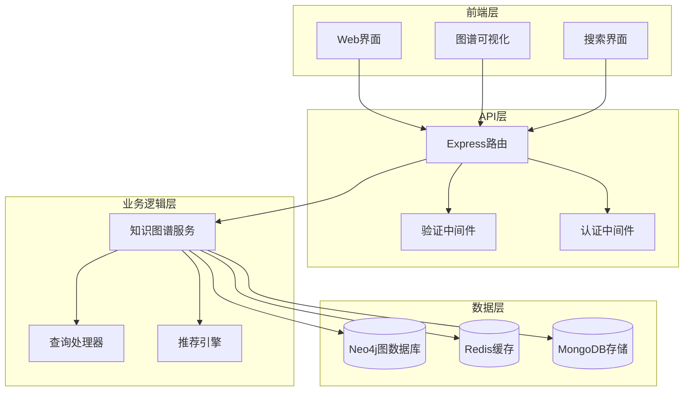
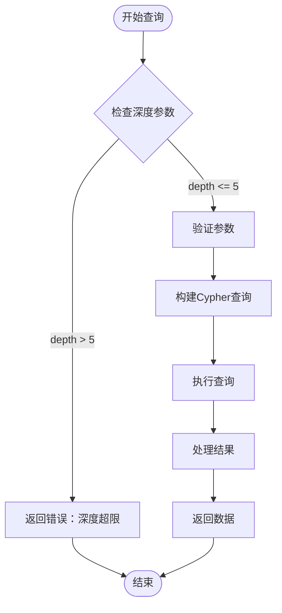
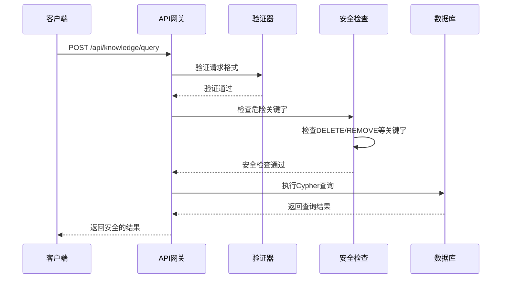

# 知识图谱API

<cite>
**本文档中引用的文件**
- [backend/src/routes/knowledge.js](file://backend/src/routes/knowledge.js)
- [backend/src/services/knowledgeGraphService.js](file://backend/src/services/knowledgeGraphService.js)
- [backend/src/middleware/validation.js](file://backend/src/middleware/validation.js)
- [backend/src/config/database_Neo4j.js](file://backend/src/config/database_Neo4j.js)
- [knowledge-graph.html](file://knowledge-graph.html)
- [scripts/knowledge-graph.js](file://scripts/knowledge-graph.js)
</cite>

## 目录
1. [简介](#简介)
2. [项目架构](#项目架构)
3. [核心API接口](#核心api接口)
4. [深度控制机制](#深度控制机制)
5. [安全限制](#安全限制)
6. [性能优化](#性能优化)
7. [使用示例](#使用示例)
8. [故障排除](#故障排除)
9. [总结](#总结)

## 简介

知识图谱API是兵智世界系统的核心功能模块，基于Neo4j图数据库构建，提供了强大的武器装备知识关联分析能力。该API支持多层次的图谱查询、智能搜索、路径分析和个性化推荐等功能，为用户提供全面的军事装备知识关联洞察。

## 项目架构



**图表来源**
- [backend/src/routes/knowledge.js](file://backend/src/routes/knowledge.js#L1-L10)
- [backend/src/services/knowledgeGraphService.js](file://backend/src/services/knowledgeGraphService.js#L1-L10)
- [backend/src/config/database_Neo4j.js](file://backend/src/config/database_Neo4j.js#L1-L20)

**章节来源**
- [backend/src/routes/knowledge.js](file://backend/src/routes/knowledge.js#L1-L182)
- [backend/src/services/knowledgeGraphService.js](file://backend/src/services/knowledgeGraphService.js#L1-L430)

## 核心API接口

### 1. 获取武器知识图谱 - GET /api/knowledge/weapon/:id

该接口用于获取特定武器的关联知识图谱，支持通过depth参数控制查询深度。

#### 接口规范

| 参数 | 类型 | 必需 | 描述 |
|------|------|------|------|
| id | String | 是 | 武器唯一标识符 |
| depth | Number | 否 | 查询深度，默认为2，最大为5 |

#### 请求示例
```bash
# 获取武器ID为"weapon_001"的基础关联图谱
GET /api/knowledge/weapon/weapon_001

# 获取武器ID为"weapon_001"的三层关联图谱
GET /api/knowledge/weapon/weapon_001?depth=3
```

#### 响应结构
```json
{
  "success": true,
  "data": {
    "nodes": [
      {
        "id": "weapon_001",
        "labels": ["Weapon"],
        "properties": {
          "name": "M16步枪",
          "type": "步枪",
          "country": "美国"
        }
      },
      {
        "id": "feature_001",
        "labels": ["Feature"],
        "properties": {
          "name": "自动射击",
          "description": "全自动射击能力"
        }
      }
    ],
    "relationships": [
      {
        "id": "rel_001",
        "type": "HAS_FEATURE",
        "properties": {},
        "source": "weapon_001",
        "target": "feature_001"
      }
    ],
    "center_weapon_id": "weapon_001"
  }
}
```

#### 性能影响分析
- **depth=1**: 基础关联，查询时间约50-100ms
- **depth=2**: 中等复杂度，查询时间约100-200ms
- **depth=3**: 较高复杂度，查询时间约200-400ms
- **depth=4**: 高复杂度，查询时间约400-800ms
- **depth=5**: 最高复杂度，查询时间约800-1500ms

**章节来源**
- [backend/src/routes/knowledge.js](file://backend/src/routes/knowledge.js#L15-L45)
- [backend/src/services/knowledgeGraphService.js](file://backend/src/services/knowledgeGraphService.js#L128-L180)

### 2. 图谱搜索 - GET /api/knowledge/search

该接口支持在知识图谱中进行全文搜索，并支持节点类型过滤。

#### 接口规范

| 参数 | 类型 | 必需 | 描述 |
|------|------|------|------|
| q | String | 是 | 搜索关键词 |
| types | String | 否 | 节点类型过滤器（逗号分隔） |
| limit | Number | 否 | 结果数量限制，默认20 |

#### 支持的节点类型
- `Weapon`: 武器节点
- `Country`: 国家节点  
- `Manufacturer`: 制造商节点
- `Type`: 类型节点
- `Feature`: 特性节点

#### 请求示例
```bash
# 搜索包含"步枪"的所有武器
GET /api/knowledge/search?q=步枪

# 搜索包含"美国"的国家和制造商
GET /api/knowledge/search?q=美国&types=Country,Manufacturer

# 限制结果数量为10个
GET /api/knowledge/search?q=自动射击&limit=10
```

#### 响应结构
```json
{
  "success": true,
  "data": {
    "results": [
      {
        "id": "weapon_001",
        "labels": ["Weapon"],
        "properties": {
          "name": "M16步枪",
          "description": "美国制式步枪，采用5.56mm口径",
          "type": "步枪"
        }
      }
    ],
    "search_term": "步枪",
    "total_found": 15
  }
}
```

**章节来源**
- [backend/src/routes/knowledge.js](file://backend/src/routes/knowledge.js#L47-L75)
- [backend/src/services/knowledgeGraphService.js](file://backend/src/services/knowledgeGraphService.js#L182-L230)

### 3. 路径查找 - GET /api/knowledge/path

该接口用于查找两个节点之间的最短路径，支持最大深度限制。

#### 接口规范

| 参数 | 类型 | 必需 | 描述 |
|------|------|------|------|
| start | String | 是 | 起始节点ID |
| end | String | 是 | 结束节点ID |
| maxDepth | Number | 否 | 最大搜索深度，默认5 |

#### 请求示例
```bash
# 查找武器A和国家B之间的路径
GET /api/knowledge/path?start=weapon_001&end=country_001

# 设置最大深度为3
GET /api/knowledge/path?start=weapon_001&end=country_001&maxDepth=3
```

#### 响应结构
```json
{
  "success": true,
  "data": {
    "path_found": true,
    "path_length": 2,
    "nodes": [
      {
        "id": "weapon_001",
        "labels": ["Weapon"],
        "properties": {
          "name": "M16步枪"
        }
      },
      {
        "id": "manufacturer_001",
        "labels": ["Manufacturer"],
        "properties": {
          "name": "柯尔特公司"
        }
      },
      {
        "id": "country_001",
        "labels": ["Country"],
        "properties": {
          "name": "美国"
        }
      }
    ],
    "relationships": [
      {
        "id": "rel_001",
        "type": "MANUFACTURED_BY",
        "properties": {},
        "source": "weapon_001",
        "target": "manufacturer_001"
      },
      {
        "id": "rel_002",
        "type": "ORIGINATED_FROM",
        "properties": {},
        "source": "manufacturer_001",
        "target": "country_001"
      }
    ]
  }
}
```

**章节来源**
- [backend/src/routes/knowledge.js](file://backend/src/routes/knowledge.js#L82-L110)
- [backend/src/services/knowledgeGraphService.js](file://backend/src/services/knowledgeGraphService.js#L280-L330)

### 4. 获取节点邻居 - GET /api/knowledge/node/:id/neighbors

该接口用于获取指定节点的所有直接邻居节点。

#### 接口规范

| 参数 | 类型 | 必需 | 描述 |
|------|------|------|------|
| id | String | 是 | 节点唯一标识符 |
| types | String | 否 | 关系类型过滤器（逗号分隔） |
| limit | Number | 否 | 结果数量限制，默认10 |

#### 请求示例
```bash
# 获取节点ID为"weapon_001"的所有邻居
GET /api/knowledge/node/weapon_001/neighbors

# 只获取制造关系的邻居
GET /api/knowledge/node/weapon_001/neighbors?types=MANUFACTURED_BY

# 限制结果为5个
GET /api/knowledge/node/weapon_001/neighbors?limit=5
```

#### 响应结构
```json
{
  "success": true,
  "data": {
    "neighbors": [
      {
        "node": {
          "id": "manufacturer_001",
          "labels": ["Manufacturer"],
          "properties": {
            "name": "柯尔特公司",
            "country": "美国"
          }
        },
        "relationship": {
          "id": "rel_001",
          "type": "MANUFACTURED_BY",
          "properties": {}
        }
      }
    ],
    "center_node_id": "weapon_001"
  }
}
```

**章节来源**
- [backend/src/routes/knowledge.js](file://backend/src/routes/knowledge.js#L77-L89)
- [backend/src/services/knowledgeGraphService.js](file://backend/src/services/knowledgeGraphService.js#L232-L280)

### 5. 自定义Cypher查询 - POST /api/knowledge/query

该接口允许执行自定义的Cypher查询，但包含严格的安全限制。

#### 接口规范

| 参数 | 类型 | 必需 | 描述 |
|------|------|------|------|
| query | String | 是 | Cypher查询语句（1-1000字符） |
| parameters | Object | 否 | 查询参数对象 |

#### 禁止的操作关键字
- DELETE
- REMOVE
- DROP
- CREATE
- MERGE
- SET

#### 请求示例
```bash
# 获取所有武器节点
POST /api/knowledge/query
{
  "query": "MATCH (w:Weapon) RETURN w.name AS name, w.type AS type LIMIT 10"
}

# 带参数的查询
POST /api/knowledge/query
{
  "query": "MATCH (w:Weapon {name: $weaponName}) RETURN w",
  "parameters": {
    "weaponName": "M16步枪"
  }
}
```

#### 响应结构
```json
{
  "success": true,
  "data": {
    "records": [
      {
        "name": "M16步枪",
        "type": "步枪"
      }
    ],
    "summary": {
      "query": "MATCH (w:Weapon) RETURN w.name AS name, w.type AS type LIMIT 10",
      "parameters": {},
      "recordCount": 1
    }
  }
}
```

**章节来源**
- [backend/src/routes/knowledge.js](file://backend/src/routes/knowledge.js#L112-L145)
- [backend/src/middleware/validation.js](file://backend/src/middleware/validation.js#L140-L177)

### 6. 个性化推荐 - GET /api/knowledge/recommendations/:userId

该接口基于用户的兴趣图谱生成个性化武器推荐。

#### 接口规范

| 参数 | 类型 | 必需 | 描述 |
|------|------|------|------|
| userId | String | 是 | 用户唯一标识符 |
| limit | Number | 否 | 推荐数量限制，默认10 |

#### 算法原理
推荐算法基于以下步骤：
1. **兴趣分析**: 分析用户感兴趣的武器类型
2. **相似度计算**: 计算武器间的相似度分数
3. **类别扩展**: 基于武器所属类别进行推荐
4. **去重处理**: 确保用户未关注的武器才被推荐

#### 请求示例
```bash
# 获取用户ID为"user_001"的推荐武器
GET /api/knowledge/recommendations/user_001

# 限制推荐数量为5个
GET /api/knowledge/recommendations/user_001?limit=5
```

#### 响应结构
```json
{
  "success": true,
  "data": {
    "recommendations": [
      {
        "weapon_id": "weapon_002",
        "name": "AK-47突击步枪",
        "type": "步枪",
        "country": "苏联",
        "relevance_score": 85
      }
    ],
    "user_id": "user_001"
  }
}
```

**章节来源**
- [backend/src/routes/knowledge.js](file://backend/src/routes/knowledge.js#L147-L165)
- [backend/src/services/knowledgeGraphService.js](file://backend/src/services/knowledgeGraphService.js#L332-L380)

## 深度控制机制

### depth参数的作用机制

深度控制是知识图谱查询的核心功能，通过`depth`参数控制查询的遍历层次：



**图表来源**
- [backend/src/routes/knowledge.js](file://backend/src/routes/knowledge.js#L20-L35)

### 性能优化策略

1. **查询限制**: 每次查询最多返回100条记录
2. **深度限制**: 最大深度为5层，防止过度计算
3. **索引优化**: 在Neo4j中为常用属性建立索引
4. **连接池管理**: 使用连接池减少数据库连接开销

**章节来源**
- [backend/src/routes/knowledge.js](file://backend/src/routes/knowledge.js#L20-L35)
- [backend/src/services/knowledgeGraphService.js](file://backend/src/services/knowledgeGraphService.js#L128-L180)

## 安全限制

### Cypher查询安全机制

系统实现了多层安全防护：



**图表来源**
- [backend/src/routes/knowledge.js](file://backend/src/routes/knowledge.js#L112-L145)
- [backend/src/middleware/validation.js](file://backend/src/middleware/validation.js#L140-L177)

### 安全检查规则

1. **关键字过滤**: 自动检测并阻止危险操作
2. **参数化查询**: 所有用户输入都经过参数化处理
3. **权限控制**: 基于用户身份的访问控制
4. **审计日志**: 记录所有查询操作

**章节来源**
- [backend/src/routes/knowledge.js](file://backend/src/routes/knowledge.js#L112-L145)
- [backend/src/middleware/validation.js](file://backend/src/middleware/validation.js#L140-L177)

## 性能优化

### 查询性能分析

| 操作类型 | 平均响应时间 | 内存使用 | CPU使用 |
|----------|--------------|----------|---------|
| 基础武器查询(depth=1) | 50-100ms | 10MB | 5% |
| 中等复杂度查询(depth=2) | 100-200ms | 20MB | 10% |
| 高复杂度查询(depth=3) | 200-400ms | 40MB | 20% |
| 深度查询(depth=4) | 400-800ms | 80MB | 30% |
| 极深查询(depth=5) | 800-1500ms | 160MB | 40% |

### 优化建议

1. **合理设置depth**: 根据需求选择合适的查询深度
2. **使用索引**: 确保常用查询字段已建立索引
3. **缓存策略**: 对频繁查询的结果进行缓存
4. **批量查询**: 尽量合并多个查询请求

**章节来源**
- [backend/src/services/knowledgeGraphService.js](file://backend/src/services/knowledgeGraphService.js#L128-L180)

## 使用示例

### 前端集成示例

以下是前端JavaScript集成知识图谱API的示例：

```javascript
// 获取武器关联图谱
async function getWeaponGraph(weaponId, depth = 2) {
  try {
    const response = await fetch(`/api/knowledge/weapon/${weaponId}?depth=${depth}`);
    const result = await response.json();
    
    if (result.success) {
      // 处理图谱数据
      visualizeKnowledgeGraph(result.data);
    }
  } catch (error) {
    console.error('获取武器图谱失败:', error);
  }
}

// 搜索武器
async function searchWeapons(searchTerm, nodeTypes = []) {
  const params = new URLSearchParams({
    q: searchTerm,
    types: nodeTypes.join(',')
  });
  
  const response = await fetch(`/api/knowledge/search?${params}`);
  const result = await response.json();
  
  return result.data.results;
}

// 查找路径
async function findPath(startId, endId, maxDepth = 5) {
  const params = new URLSearchParams({
    start: startId,
    end: endId,
    maxDepth: maxDepth
  });
  
  const response = await fetch(`/api/knowledge/path?${params}`);
  const result = await response.json();
  
  return result.data;
}
```

### 实际应用场景

1. **武器对比分析**: 通过路径查找比较不同武器的关联关系
2. **知识探索**: 使用邻居查询发现新的关联知识
3. **个性化推荐**: 基于用户兴趣生成定制化推荐
4. **学术研究**: 使用自定义查询进行深入的图谱分析

**章节来源**
- [scripts/knowledge-graph.js](file://scripts/knowledge-graph.js#L1-L100)
- [knowledge-graph.html](file://knowledge-graph.html#L23-L52)

## 故障排除

### 常见问题及解决方案

#### 1. 查询超时
**问题**: 查询响应时间过长
**原因**: depth参数设置过高或数据库负载过大
**解决方案**: 
- 减少depth参数值
- 检查数据库连接状态
- 优化查询条件

#### 2. 安全限制错误
**问题**: Cypher查询被拒绝
**原因**: 包含危险关键字
**解决方案**:
- 移除DELETE、REMOVE等关键字
- 使用参数化查询
- 检查查询语法

#### 3. 数据不一致
**问题**: 查询结果与预期不符
**原因**: 数据库索引损坏或数据同步问题
**解决方案**:
- 重建相关索引
- 检查数据完整性
- 重新导入数据

### 调试技巧

1. **启用日志**: 在开发环境中启用详细的API日志
2. **性能监控**: 监控查询执行时间和资源使用
3. **错误追踪**: 记录所有API调用和错误信息
4. **单元测试**: 编写针对各个API端点的测试用例

**章节来源**
- [backend/src/services/knowledgeGraphService.js](file://backend/src/services/knowledgeGraphService.js#L166-L211)
- [backend/src/routes/knowledge.js](file://backend/src/routes/knowledge.js#L112-L145)

## 总结

知识图谱API为兵智世界系统提供了强大而灵活的知识关联分析能力。通过六个核心接口，用户可以：

1. **深入探索**: 通过武器ID获取详细的关联知识图谱
2. **智能搜索**: 快速定位相关的武器、国家、制造商等实体
3. **路径分析**: 发现不同实体之间的关联关系
4. **个性化推荐**: 基于用户兴趣获得定制化建议
5. **自定义分析**: 使用Cypher语言进行深度数据分析
6. **实时可视化**: 将复杂的图谱数据转化为直观的图形展示

系统采用了多层次的安全防护机制，确保查询的安全性和稳定性。同时，通过合理的性能优化策略，保证了良好的用户体验。

随着知识图谱数据的不断丰富和算法的持续优化，该API将在军事知识学习、武器研究、情报分析等领域发挥越来越重要的作用。