# 兵智世界业务服务层深度文档

<cite>
**本文档引用的文件**
- [weaponService.js](file://backend/src/services/weaponService.js)
- [userService.js](file://backend/src/services/userService.js)
- [userService-simple.js](file://backend/src/services/userService-simple.js)
- [knowledgeGraphService.js](file://backend/src/services/knowledgeGraphService.js)
- [database_Neo4j.js](file://backend/src/config/database_Neo4j.js)
- [logger.js](file://backend/src/utils/logger.js)
- [auth.js](file://backend/src/middleware/auth.js)
- [validation.js](file://backend/src/middleware/validation.js)
- [weapons.js](file://backend/src/routes/weapons.js)
- [auth.js](file://backend/src/routes/auth.js)
- [knowledge-graph.js](file://backend/src/routes/knowledge-graph.js)
- [graphData.json](file://data/graphData.json)
- [countries.json](file://data/countries.json)
</cite>

## 目录
1. [项目概述](#项目概述)
2. [架构总览](#架构总览)
3. [核心业务服务](#核心业务服务)
4. [数据库集成策略](#数据库集成策略)
5. [服务间协作机制](#服务间协作机制)
6. [事务管理与数据一致性](#事务管理与数据一致性)
7. [性能优化策略](#性能优化策略)
8. [安全机制](#安全机制)
9. [故障排除指南](#故障排除指南)
10. [总结](#总结)

## 项目概述

兵智世界是一个复杂的军事武器知识管理系统，采用双数据库架构：MongoDB用于存储武器的详细文档信息，Neo4j用于构建和维护实体关系图谱。该系统通过三个核心业务服务模块实现完整的CRUD操作、用户管理和知识图谱推理功能。

### 技术栈特点
- **前端框架**: HTML5 + JavaScript + D3.js
- **后端框架**: Express.js
- **数据库**: MongoDB + Neo4j + SQLite3
- **缓存**: Redis
- **认证**: JWT + 自定义认证中间件
- **数据验证**: Joi + 自定义验证规则

## 架构总览

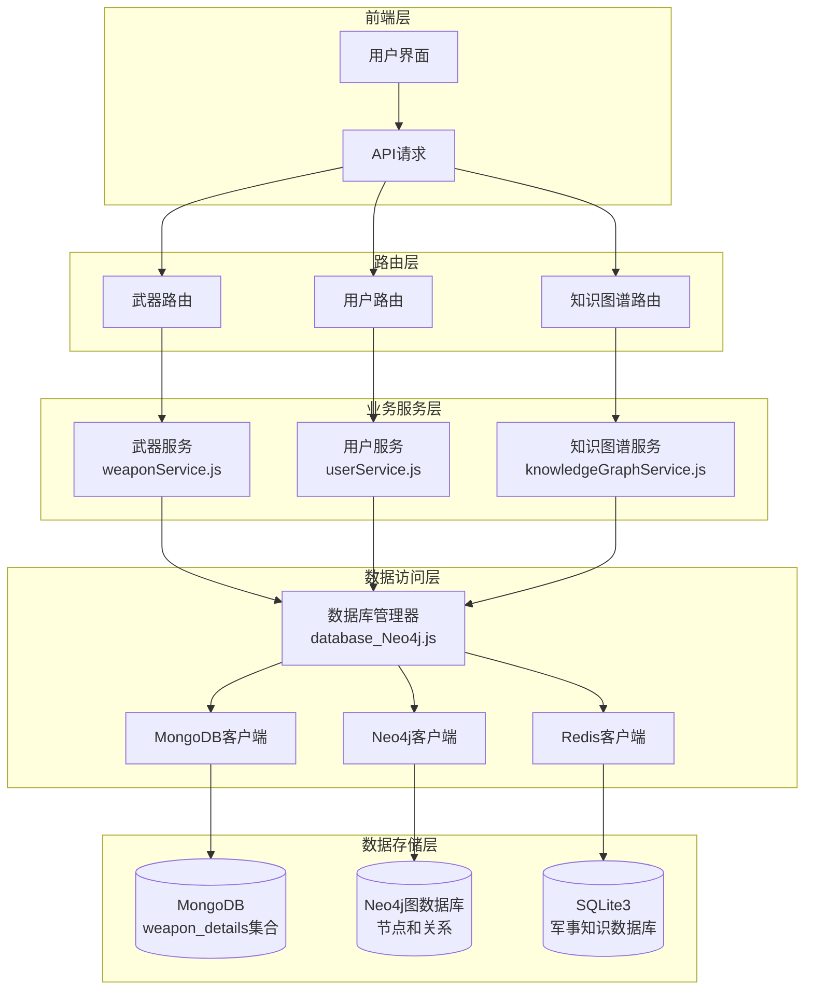

**图表来源**
- [weaponService.js](file://backend/src/services/weaponService.js#L1-L486)
- [userService.js](file://backend/src/services/userService.js#L1-L318)
- [knowledgeGraphService.js](file://backend/src/services/knowledgeGraphService.js#L1-L430)
- [database_Neo4j.js](file://backend/src/config/database_Neo4j.js#L1-L141)

## 核心业务服务

### 武器服务 (WeaponService)

武器服务是系统的核心业务组件，负责武器的全生命周期管理，包括CRUD操作和复杂的关系查询。

#### 主要功能模块

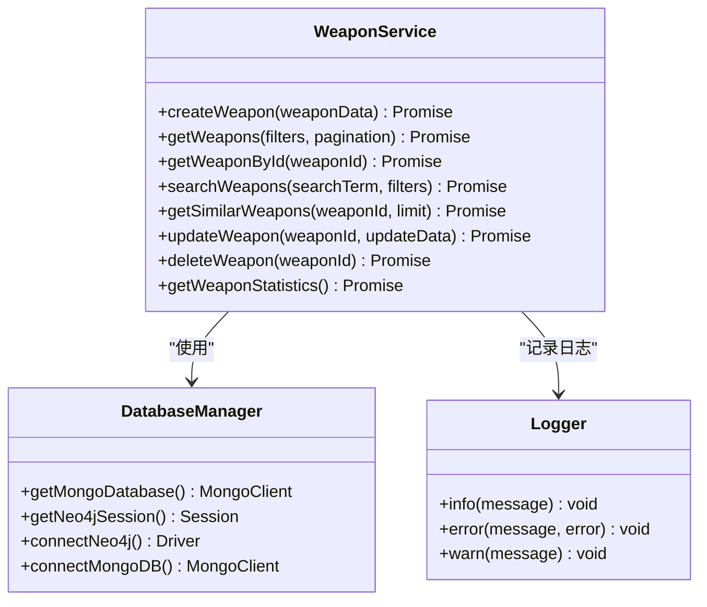

**图表来源**
- [weaponService.js](file://backend/src/services/weaponService.js#L2-L486)
- [database_Neo4j.js](file://backend/src/config/database_Neo4j.js#L6-L141)

#### CRUD操作详解

**创建武器 (createWeapon)**

创建武器涉及两个数据库的同步操作：

1. **MongoDB存储**: 将武器的详细文档存储在`weapon_details`集合中
2. **Neo4j图谱**: 创建武器节点并建立与类别、国家的关联关系

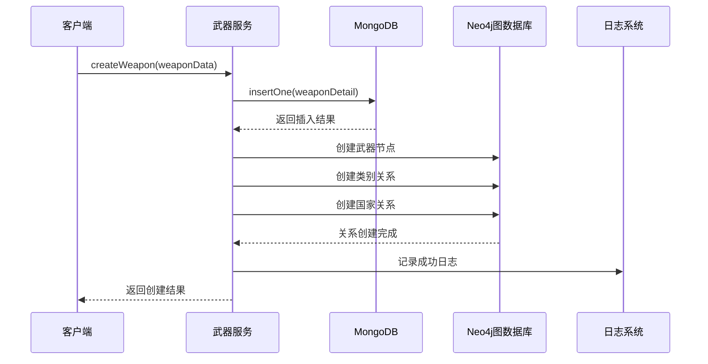

**图表来源**
- [weaponService.js](file://backend/src/services/weaponService.js#L5-L70)

**更新武器 (updateWeapon)**

更新操作确保两个数据库的一致性：

1. **MongoDB更新**: 更新武器的详细信息文档
2. **Neo4j同步**: 更新节点属性并重建关系

**删除武器 (deleteWeapon)**

采用级联删除策略：

1. **MongoDB删除**: 删除武器的详细文档
2. **Neo4j删除**: 使用`DETACH DELETE`移除节点及其所有关系

#### 相似武器推荐 (getSimilarWeapons)

利用Neo4j的图查询能力实现智能推荐：

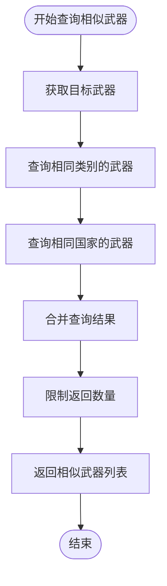

**图表来源**
- [weaponService.js](file://backend/src/services/weaponService.js#L220-L250)

**节来源**
- [weaponService.js](file://backend/src/services/weaponService.js#L5-L486)

### 用户服务 (UserService)

用户服务提供完整的用户管理功能，包括注册、登录、资料管理和兴趣记录。

#### 功能架构

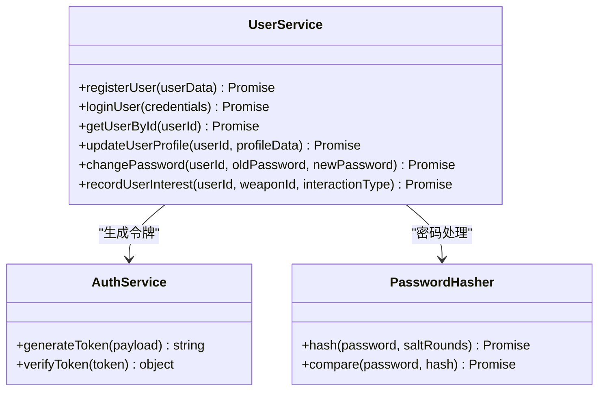

**图表来源**
- [userService.js](file://backend/src/services/userService.js#L6-L318)

#### 用户注册流程

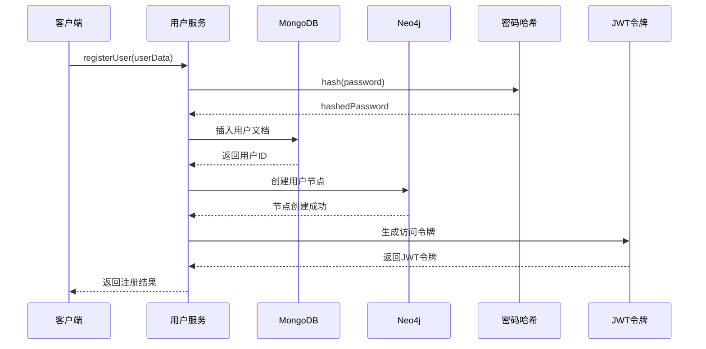

**图表来源**
- [userService.js](file://backend/src/services/userService.js#L8-L80)

#### 用户兴趣记录

用户服务提供了强大的兴趣记录功能，用于构建推荐系统：

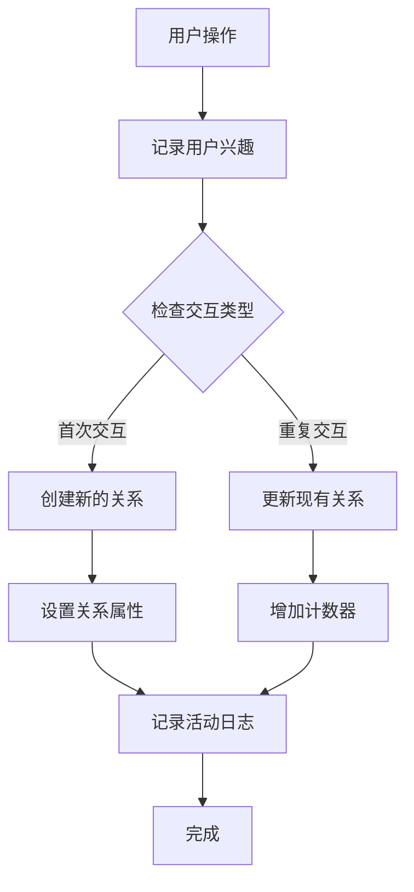

**图表来源**
- [userService.js](file://backend/src/services/userService.js#L290-L318)

**节来源**
- [userService.js](file://backend/src/services/userService.js#L1-L318)

### 知识图谱服务 (KnowledgeGraphService)

知识图谱服务专门处理Neo4j图数据库的操作，提供复杂的图查询和推理功能。

#### 核心功能模块

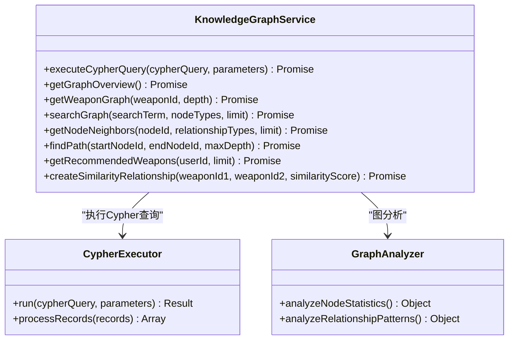

**图表来源**
- [knowledgeGraphService.js](file://backend/src/services/knowledgeGraphService.js#L4-L430)

#### 推荐算法实现

知识图谱服务实现了基于用户兴趣的武器推荐算法：

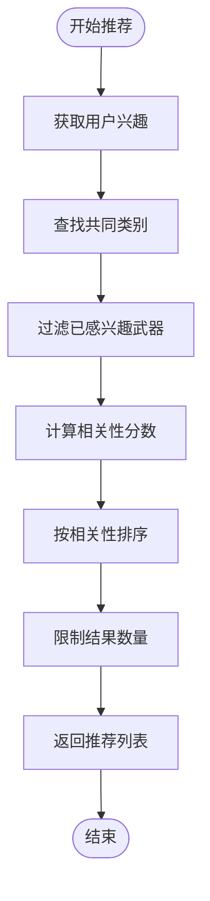

**图表来源**
- [knowledgeGraphService.js](file://backend/src/services/knowledgeGraphService.js#L380-L410)

**节来源**
- [knowledgeGraphService.js](file://backend/src/services/knowledgeGraphService.js#L1-L430)

## 数据库集成策略

### 双数据库架构设计

系统采用混合数据库架构，充分发挥不同数据库的优势：

| 数据库 | 存储内容 | 查询优势 | 使用场景 |
|--------|----------|----------|----------|
| MongoDB | 武器详细文档 | 文档查询、全文搜索 | 武器详情、搜索、统计 |
| Neo4j | 实体关系图谱 | 图遍历、关联查询 | 推荐系统、路径查找 |
| SQLite3 | 静态数据、地图数据 | 快速读取、地理信息 | 国家信息、静态配置 |

### 数据同步机制

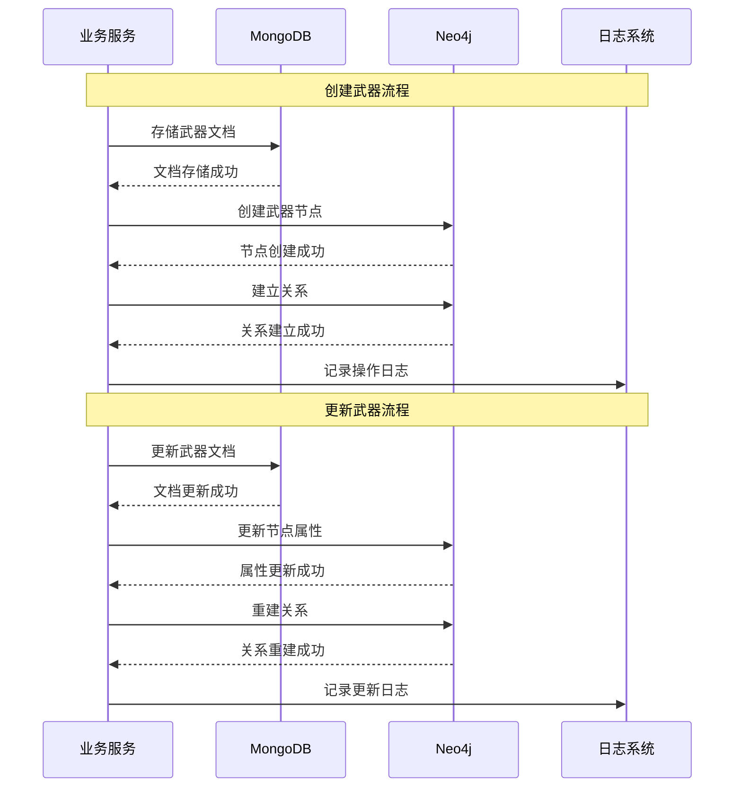

**图表来源**
- [weaponService.js](file://backend/src/services/weaponService.js#L5-L70)
- [weaponService.js](file://backend/src/services/weaponService.js#L252-L320)

**节来源**
- [database_Neo4j.js](file://backend/src/config/database_Neo4j.js#L1-L141)

## 服务间协作机制

### 路由层协调

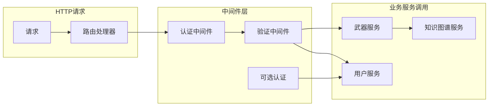

**图表来源**
- [weapons.js](file://backend/src/routes/weapons.js#L1-L218)
- [auth.js](file://backend/src/routes/auth.js#L1-L144)

### 权限控制机制

系统实现了多层次的权限控制：

| 中间件 | 功能 | 使用场景 |
|--------|------|----------|
| authenticateToken | JWT认证 | 需要登录的功能 |
| optionalAuth | 可选认证 | 可选登录的功能 |
| requireAdmin | 管理员权限 | 管理员专用功能 |

**节来源**
- [auth.js](file://backend/src/middleware/auth.js#L1-L106)

## 事务管理与数据一致性

### ACID特性保障

由于使用了两个不同的数据库，系统采用了最终一致性的策略：

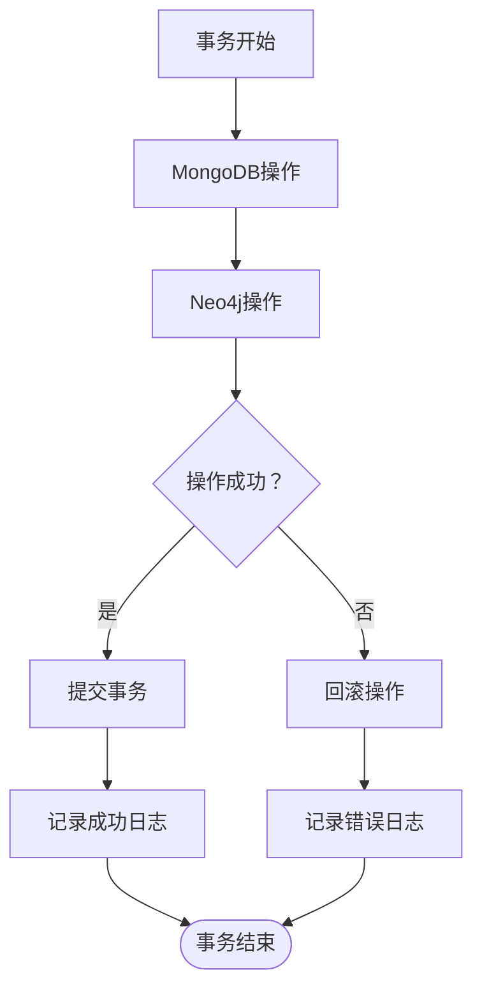

### 错误处理策略

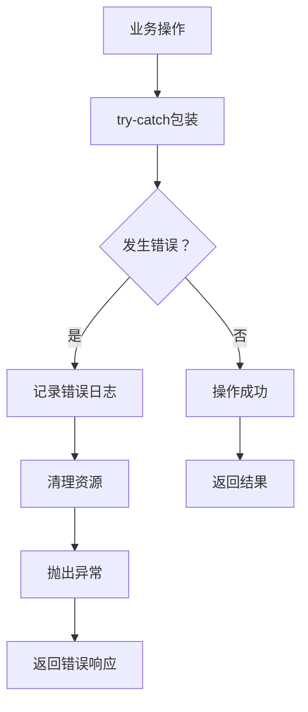

**图表来源**
- [weaponService.js](file://backend/src/services/weaponService.js#L15-L25)
- [userService.js](file://backend/src/services/userService.js#L15-L25)

**节来源**
- [weaponService.js](file://backend/src/services/weaponService.js#L15-L486)
- [userService.js](file://backend/src/services/userService.js#L15-L318)

## 性能优化策略

### 缓存机制

系统集成了Redis缓存层，提升频繁访问数据的性能：

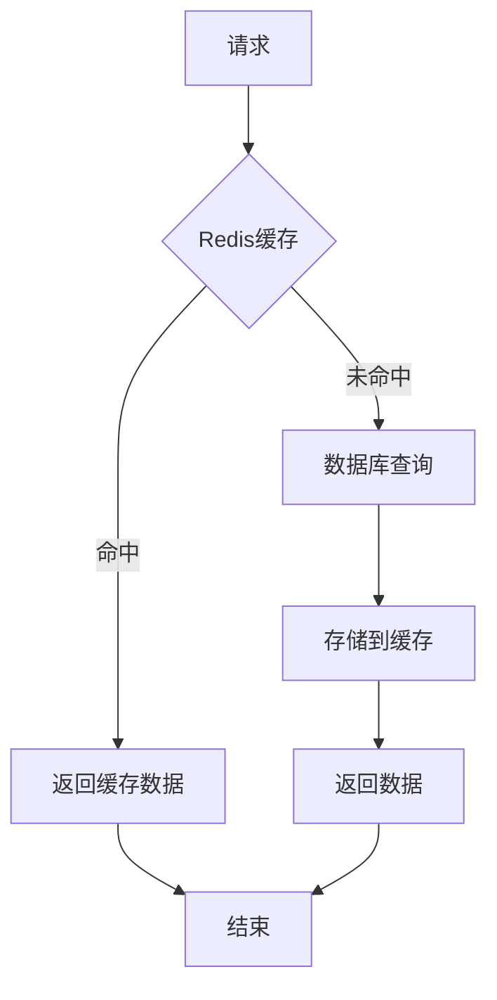

### 查询优化

1. **MongoDB优化**: 使用索引、分页查询、投影选择
2. **Neo4j优化**: Cypher查询优化、关系遍历限制
3. **并发控制**: 数据库连接池管理

### 连接管理

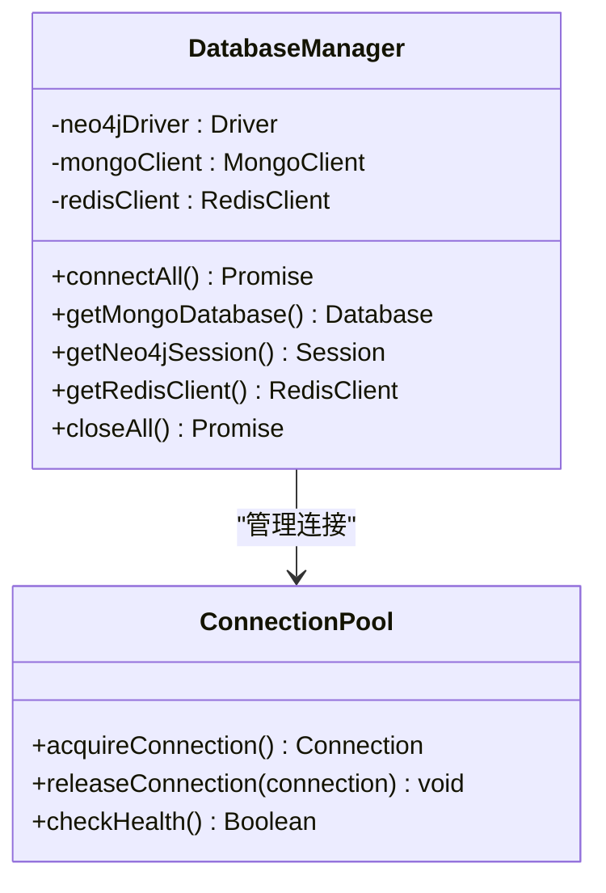

**图表来源**
- [database_Neo4j.js](file://backend/src/config/database_Neo4j.js#L6-L141)

**节来源**
- [database_Neo4j.js](file://backend/src/config/database_Neo4j.js#L1-L141)

## 安全机制

### 数据验证

系统实现了全面的数据验证机制：

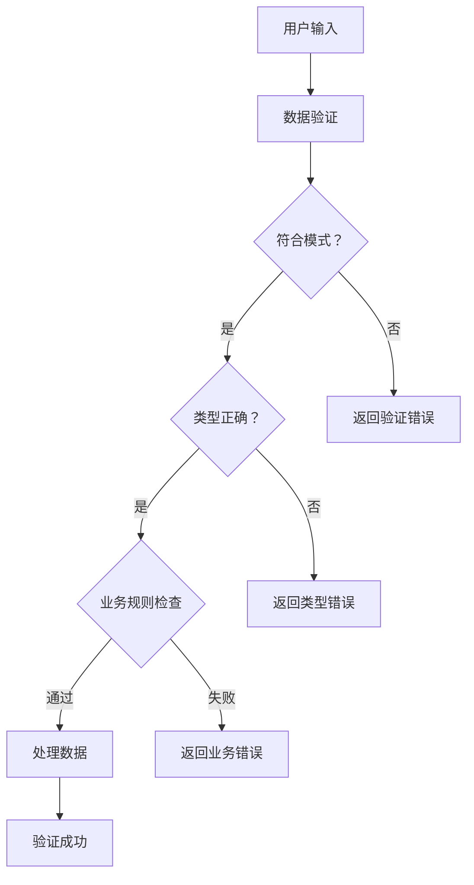

**图表来源**
- [validation.js](file://backend/src/middleware/validation.js#L8-L25)

### 认证与授权

1. **JWT令牌**: 无状态认证机制
2. **密码加密**: bcrypt哈希算法
3. **权限控制**: 角色基础访问控制

**节来源**
- [validation.js](file://backend/src/middleware/validation.js#L1-L178)
- [auth.js](file://backend/src/middleware/auth.js#L1-L106)

## 故障排除指南

### 常见问题诊断

| 问题类型 | 症状 | 可能原因 | 解决方案 |
|----------|------|----------|----------|
| 数据库连接失败 | 服务启动失败 | 配置错误、网络问题 | 检查环境变量、网络连通性 |
| 数据不一致 | 两个数据库数据不同步 | 事务中断、异常处理不当 | 实施补偿机制、重试策略 |
| 查询性能差 | 响应时间过长 | 缺少索引、查询复杂度过高 | 优化查询、添加索引 |
| 内存泄漏 | 服务内存持续增长 | 连接未正确释放 | 检查连接池配置、资源清理 |

### 日志分析

系统提供了完善的日志记录机制：

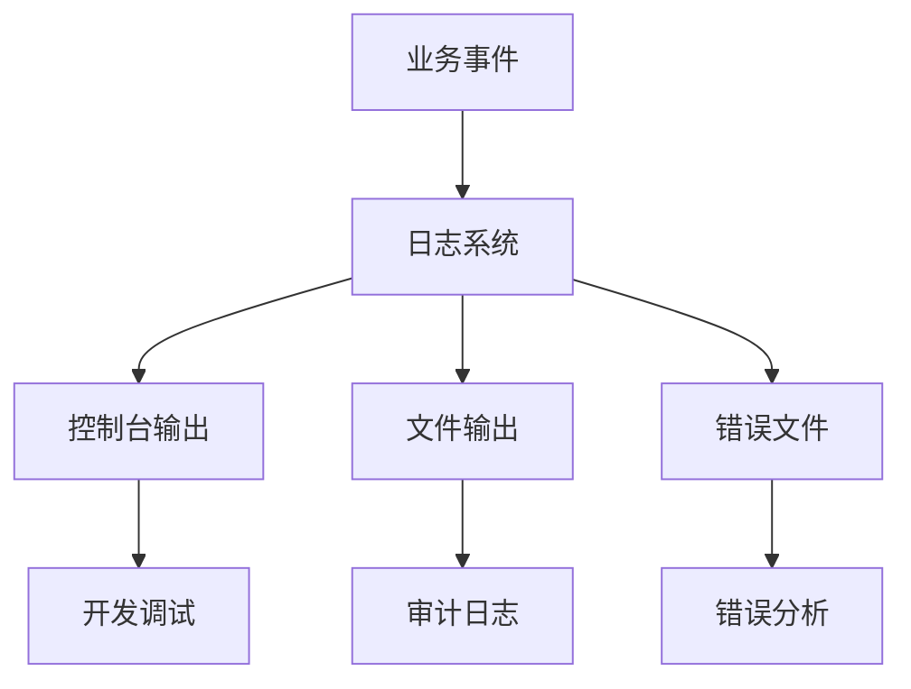

**图表来源**
- [logger.js](file://backend/src/utils/logger.js#L1-L47)

**节来源**
- [logger.js](file://backend/src/utils/logger.js#L1-L47)

## 总结

兵智世界的业务服务层展现了现代Web应用的最佳实践：

### 核心优势

1. **双数据库架构**: 充分发挥MongoDB和Neo4j各自的优势
2. **服务化设计**: 清晰的职责分离和模块化架构
3. **数据一致性**: 通过最终一致性策略保证数据完整性
4. **性能优化**: 多层次缓存和查询优化
5. **安全保障**: 全面的认证授权和数据验证

### 技术创新

- **图数据库应用**: 利用Neo4j的强大图查询能力实现智能推荐
- **混合存储**: 根据数据特征选择最适合的存储方式
- **微服务理念**: 单一职责原则和松耦合设计

### 发展方向

1. **容器化部署**: 提升部署灵活性和可扩展性
2. **监控告警**: 建立完善的运维监控体系
3. **API版本控制**: 支持向后兼容的API演进
4. **自动化测试**: 提升代码质量和发布效率

这个业务服务层为兵智世界提供了坚实的技术基础，支撑着复杂的军事武器知识管理需求，展现了企业级应用开发的成熟度和专业性。