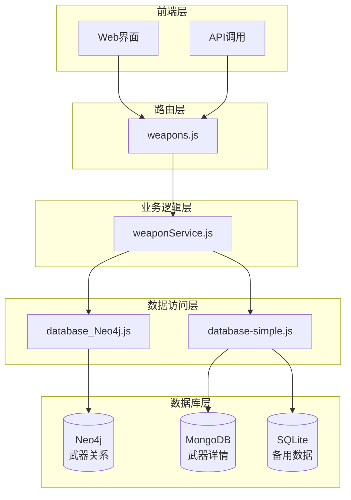
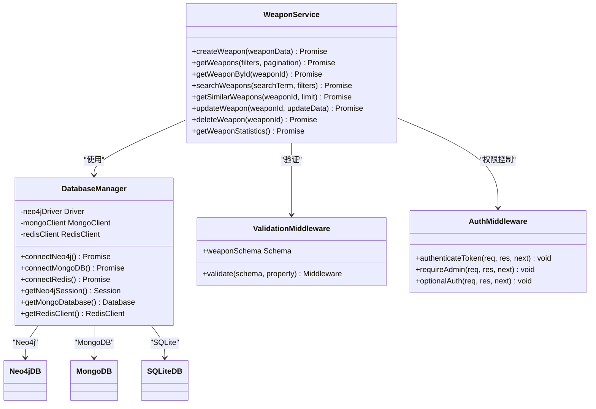
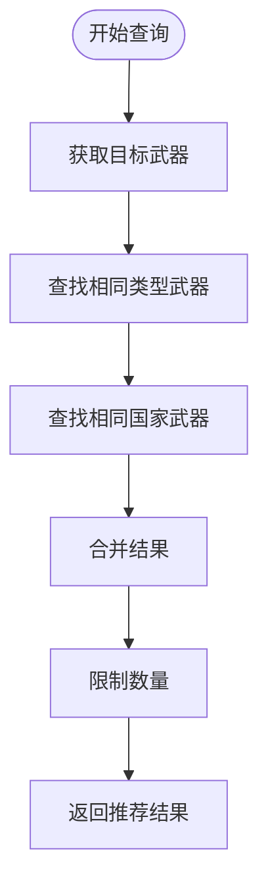
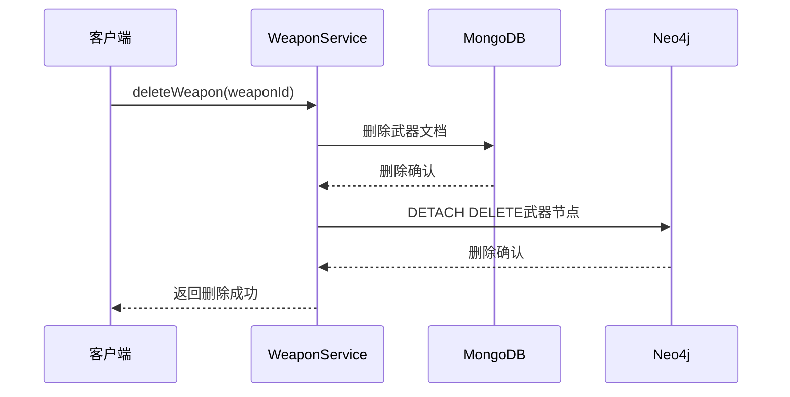
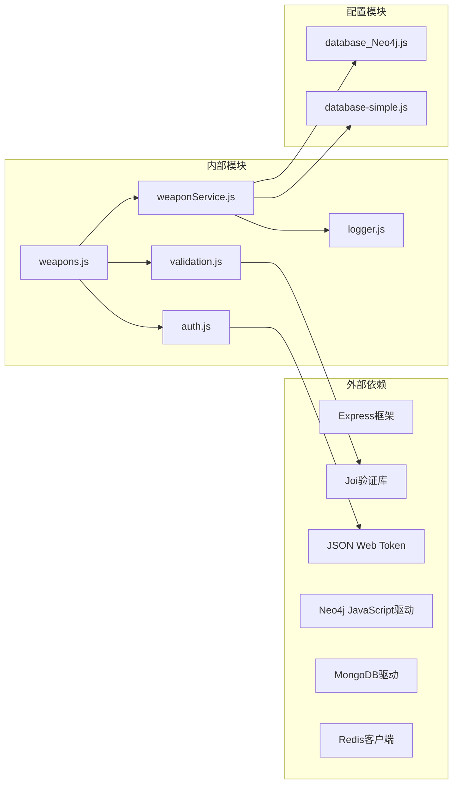

# 武器服务

<cite>
**本文档中引用的文件**
- [weaponService.js](file://backend/src/services/weaponService.js)
- [weapons.js](file://backend/src/routes/weapons.js)
- [database_Neo4j.js](file://backend/src/config/database_Neo4j.js)
- [database-simple.js](file://backend/src/config/database-simple.js)
- [validation.js](file://backend/src/middleware/validation.js)
- [auth.js](file://backend/src/middleware/auth.js)
</cite>

## 目录
1. [简介](#简介)
2. [项目结构](#项目结构)
3. [核心组件](#核心组件)
4. [架构概览](#架构概览)
5. [详细组件分析](#详细组件分析)
6. [依赖关系分析](#依赖关系分析)
7. [性能考虑](#性能考虑)
8. [故障排除指南](#故障排除指南)
9. [结论](#结论)

## 简介

weaponService.js是兵智世界系统中的核心业务逻辑层，负责处理武器相关的所有业务操作。该服务采用双数据库架构，结合MongoDB的文档存储能力和Neo4j的图数据库特性，实现了复杂的武器数据管理和关联查询功能。

该服务提供了完整的CRUD操作，包括武器创建、查询、更新、删除以及高级功能如相似武器推荐、全文搜索和统计分析。通过精心设计的业务逻辑，确保了MongoDB和Neo4j两个数据库之间的数据一致性。

## 项目结构

武器服务位于系统的业务逻辑层，与路由层和数据访问层形成清晰的分层架构：



**图表来源**
- [weapons.js](file://backend/src/routes/weapons.js#L1-L218)
- [weaponService.js](file://backend/src/services/weaponService.js#L1-L486)
- [database_Neo4j.js](file://backend/src/config/database_Neo4j.js#L1-L141)

**章节来源**
- [weaponService.js](file://backend/src/services/weaponService.js#L1-L50)
- [weapons.js](file://backend/src/routes/weapons.js#L1-L30)

## 核心组件

WeaponService类是整个武器业务逻辑的核心，包含以下主要组件：

### 数据库管理器
- **Neo4j会话管理**：负责图数据库连接和事务处理
- **MongoDB集合管理**：处理文档数据库的CRUD操作
- **连接池管理**：维护数据库连接的生命周期

### 业务逻辑方法
- **CRUD操作**：createWeapon、getWeaponById、updateWeapon、deleteWeapon
- **查询功能**：getWeapons、searchWeapons、getSimilarWeapons
- **统计分析**：getWeaponStatistics

### 验证系统
- **输入验证**：使用Joi进行数据验证
- **权限控制**：基于JWT的身份认证和授权
- **错误处理**：统一的异常处理和日志记录

**章节来源**
- [weaponService.js](file://backend/src/services/weaponService.js#L4-L486)
- [database_Neo4j.js](file://backend/src/config/database_Neo4j.js#L4-L141)

## 架构概览

武器服务采用双数据库架构，结合了文档数据库和图数据库的优势：



**图表来源**
- [weaponService.js](file://backend/src/services/weaponService.js#L4-L486)
- [database_Neo4j.js](file://backend/src/config/database_Neo4j.js#L4-L141)
- [validation.js](file://backend/src/middleware/validation.js#L1-L178)
- [auth.js](file://backend/src/middleware/auth.js#L1-L106)

## 详细组件分析

### createWeapon 方法 - 武器创建

createWeapon方法实现了复杂的双数据库创建流程，确保武器数据在MongoDB和Neo4j中的一致性。

#### MongoDB存储逻辑
- **文档结构**：存储武器的详细信息，包括名称、类型、国家、年份等
- **默认字段**：自动添加创建时间和更新时间戳
- **数组字段**：预初始化空数组用于存储图片、文档和性能数据

#### Neo4j图数据库逻辑
- **节点创建**：为每个武器创建唯一的Weapon节点
- **关系建立**：
  - BELONGS_TO：与武器类型分类节点建立关系
  - MANUFACTURED_BY：与制造国家节点建立关系
- **MERGE操作**：确保分类和国家节点的唯一性

#### 错误处理策略
- **事务保证**：使用try-finally确保资源正确释放
- **日志记录**：详细的操作日志便于调试和监控
- **异常传播**：捕获并重新抛出错误以便上层处理

**章节来源**
- [weaponService.js](file://backend/src/services/weaponService.js#L6-L85)

### getWeapons 方法 - 分页查询

getWeapons方法提供了强大的分页查询功能，支持多种过滤条件。

#### 查询构建
- **过滤条件**：支持按武器类型和制造国家过滤
- **分页参数**：灵活的分页控制，默认每页20条记录
- **排序机制**：按创建时间降序排列

#### 性能优化
- **索引利用**：MongoDB查询优化
- **结果映射**：高效的对象转换
- **总数计算**：独立的计数查询避免数据传输

#### 返回结构
```javascript
{
  success: true,
  data: {
    weapons: [...],
    pagination: {
      current_page: 1,
      total_pages: 5,
      total_items: 100,
      items_per_page: 20
    }
  }
}
```

**章节来源**
- [weaponService.js](file://backend/src/services/weaponService.js#L87-L140)

### getWeaponById 方法 - 详情获取

getWeaponById方法展示了如何结合两种数据库的优势获取完整武器信息。

#### MongoDB数据获取
- **精确查询**：使用ObjectId进行精确匹配
- **字段选择**：只获取必要的字段减少网络传输
- **存在性检查**：提前验证武器是否存在

#### Neo4j关系查询
- **关系遍历**：获取武器的所有关联关系
- **关系类型**：区分不同类型的关联（BELONGS_TO、MANUFACTURED_BY等）
- **限制数量**：防止返回过多关系数据

#### 关联数据结构
```javascript
relationships: [
  {
    type: "BELONGS_TO",
    related_entity: {
      labels: ["Category"],
      properties: { name: "步枪" }
    }
  }
]
```

**章节来源**
- [weaponService.js](file://backend/src/services/weaponService.js#L142-L185)

### searchWeapons 方法 - 全文搜索

searchWeapons方法实现了基于正则表达式的全文搜索功能。

#### 搜索策略
- **多字段搜索**：同时搜索武器名称和描述
- **模糊匹配**：使用正则表达式实现大小写不敏感搜索
- **结果限制**：最多返回50条匹配记录

#### 过滤增强
- **类型过滤**：可按武器类型筛选
- **国家过滤**：可按制造国家筛选
- **组合查询**：支持多个条件的组合搜索

#### 性能考虑
- **索引优化**：MongoDB文本索引的合理使用
- **结果截断**：避免大量数据传输影响性能
- **内存管理**：及时释放查询结果

**章节来源**
- [weaponService.js](file://backend/src/services/weaponService.js#L187-L220)

### getSimilarWeapons 方法 - 相似推荐

getSimilarWeapons方法利用Neo4j的图算法实现智能推荐功能。

#### 图查询逻辑
- **类别相似**：查找相同类型的其他武器
- **国家相似**：查找同一国家生产的其他武器
- **联合查询**：合并两种相似度来源的结果

#### 查询优化
- **LIMIT子句**：控制返回结果数量
- **UNION操作**：合并多个查询结果
- **去重机制**：确保结果唯一性

#### 推荐策略


**图表来源**
- [weaponService.js](file://backend/src/services/weaponService.js#L222-L255)

**章节来源**
- [weaponService.js](file://backend/src/services/weaponService.js#L222-L255)

### updateWeapon 方法 - 数据同步更新

updateWeapon方法确保MongoDB和Neo4j中的数据保持同步更新。

#### MongoDB更新流程
- **字段更新**：更新武器的基本信息
- **时间戳更新**：自动更新修改时间
- **存在性验证**：确保武器确实存在

#### Neo4j同步更新
- **节点属性更新**：同步更新武器节点的属性
- **关系重建**：删除旧关系并创建新关系
- **MERGE操作**：确保关联节点的唯一性

#### 数据一致性保证
- **原子性**：使用事务确保操作的原子性
- **回滚机制**：失败时自动回滚所有更改
- **状态验证**：验证更新操作的成功状态

**章节来源**
- [weaponService.js](file://backend/src/services/weaponService.js#L257-L357)

### deleteWeapon 方法 - 级联删除

deleteWeapon方法实现了完整的级联删除机制，确保数据完整性。

#### MongoDB删除
- **精确删除**：使用ObjectId进行精确匹配删除
- **存在性检查**：验证武器是否存在
- **删除确认**：返回删除结果状态

#### Neo4j级联删除
- **DETACH DELETE**：删除节点及其所有关系
- **完整性保证**：确保没有孤立的关系
- **性能优化**：Neo4j的高效删除机制

#### 清理策略


**图表来源**
- [weaponService.js](file://backend/src/services/weaponService.js#L359-L390)

**章节来源**
- [weaponService.js](file://backend/src/services/weaponService.js#L359-L390)

### getWeaponStatistics 方法 - 聚合统计

getWeaponStatistics方法提供了全面的武器数据分析功能。

#### 统计维度
- **按类型统计**：统计各类武器的数量分布
- **按国家统计**：统计各国家生产的武器数量
- **总数统计**：计算总的武器数量

#### 聚合查询
- **MongoDB聚合管道**：使用$group和$sort进行统计
- **数量排序**：按数量降序排列
- **结果限制**：国家统计最多返回前10名

#### 数据结构
```javascript
{
  total_weapons: 1000,
  by_type: [
    { type: "步枪", count: 400 },
    { type: "手枪", count: 300 }
  ],
  by_country: [
    { country: "中国", count: 200 },
    { country: "美国", count: 150 }
  ]
}
```

**章节来源**
- [weaponService.js](file://backend/src/services/weaponService.js#L392-L425)

## 依赖关系分析

武器服务的依赖关系展现了清晰的分层架构：



**图表来源**
- [weaponService.js](file://backend/src/services/weaponService.js#L1-L5)
- [weapons.js](file://backend/src/routes/weapons.js#L1-L10)
- [database_Neo4j.js](file://backend/src/config/database_Neo4j.js#L1-L10)

### 核心依赖说明

| 依赖项 | 版本要求 | 用途 | 重要性 |
|--------|----------|------|--------|
| express | ^4.18.0 | Web框架 | 必需 |
| neo4j-driver | ^5.0.0 | Neo4j数据库驱动 | 必需 |
| mongodb | ^5.0.0 | MongoDB数据库驱动 | 必需 |
| joi | ^17.0.0 | 数据验证 | 必需 |
| jsonwebtoken | ^9.0.0 | JWT认证 | 必需 |

**章节来源**
- [weaponService.js](file://backend/src/services/weaponService.js#L1-L5)
- [weapons.js](file://backend/src/routes/weapons.js#L1-L10)

## 性能考虑

武器服务在设计时充分考虑了性能优化：

### 查询优化
- **索引策略**：MongoDB集合上的适当索引
- **查询限制**：避免返回过多数据
- **连接池管理**：数据库连接的有效复用

### 内存管理
- **流式处理**：大数据量查询的流式处理
- **及时释放**：确保数据库连接及时关闭
- **缓存策略**：Redis缓存的合理使用

### 并发处理
- **异步操作**：所有数据库操作都是异步的
- **错误隔离**：单个操作失败不影响其他操作
- **超时控制**：合理的操作超时设置

## 故障排除指南

### 常见问题及解决方案

#### 数据库连接问题
- **症状**：连接超时或连接拒绝
- **原因**：数据库服务未启动或网络问题
- **解决**：检查数据库服务状态和网络连接

#### 数据一致性问题
- **症状**：MongoDB和Neo4j数据不匹配
- **原因**：更新操作部分失败
- **解决**：实施补偿机制和数据校验

#### 性能问题
- **症状**：查询响应缓慢
- **原因**：缺少索引或查询过于复杂
- **解决**：添加适当索引和优化查询

**章节来源**
- [weaponService.js](file://backend/src/services/weaponService.js#L80-L85)
- [database_Neo4j.js](file://backend/src/config/database_Neo4j.js#L15-L40)

## 结论

weaponService.js展现了现代Web应用中复杂业务逻辑的最佳实践。通过双数据库架构，它成功地结合了文档数据库的灵活性和图数据库的强大关联能力。该服务的设计体现了以下关键原则：

### 技术优势
- **数据一致性**：通过精心设计的事务机制确保MongoDB和Neo4j的数据同步
- **性能优化**：合理的查询策略和索引使用
- **可扩展性**：模块化的架构便于功能扩展
- **可靠性**：完善的错误处理和日志记录

### 业务价值
- **用户体验**：快速响应的查询和丰富的关联数据
- **数据质量**：严格的验证和清理机制
- **管理效率**：直观的统计和分析功能
- **开发效率**：清晰的代码结构和完善的文档

该服务为兵智世界系统提供了坚实的武器数据管理基础，支持了复杂的军事知识图谱应用需求。其设计理念和实现方式可以作为类似项目的参考范例。