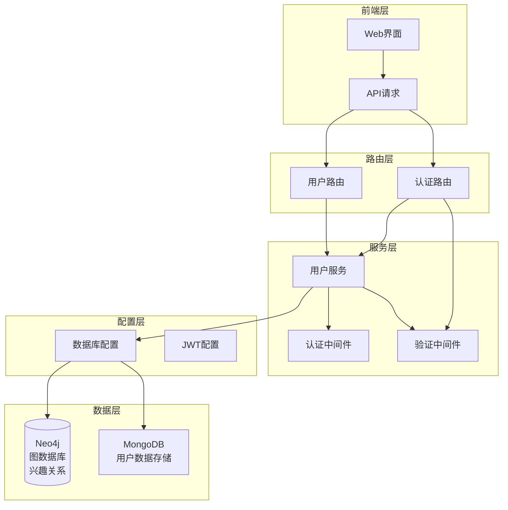
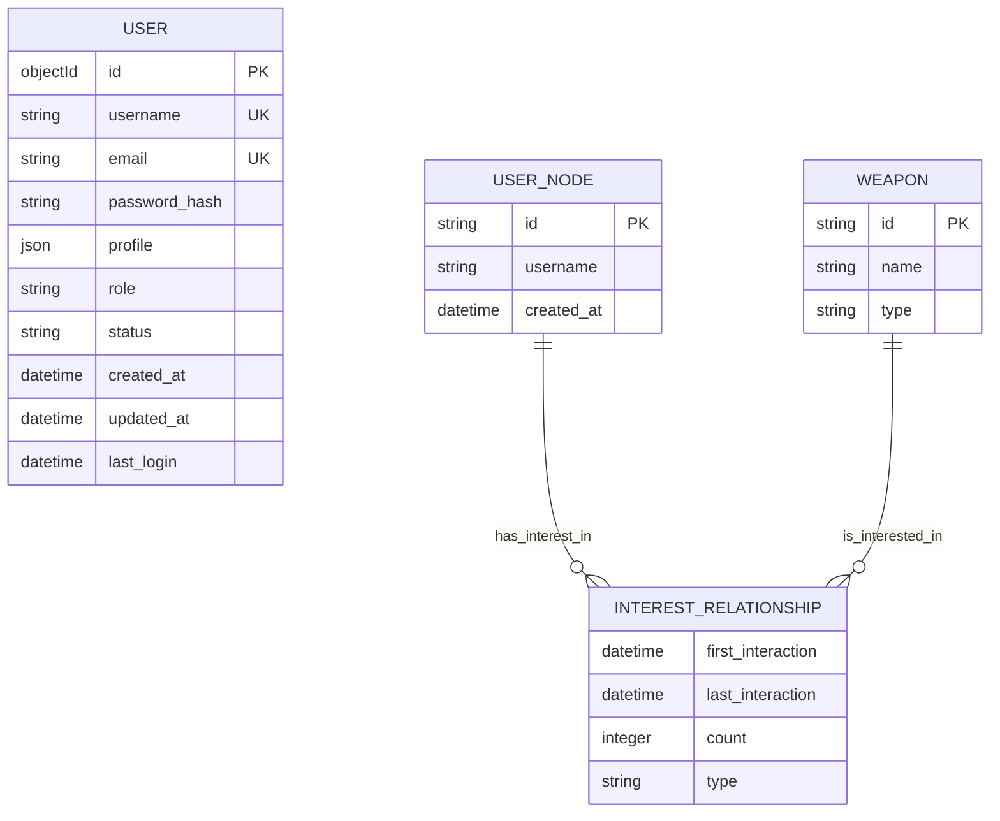
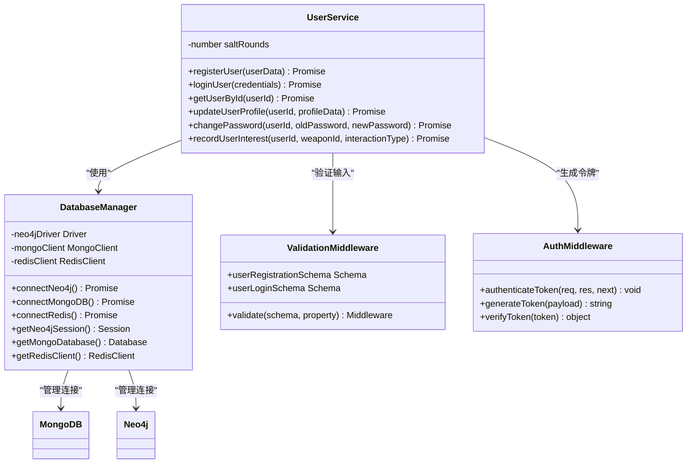
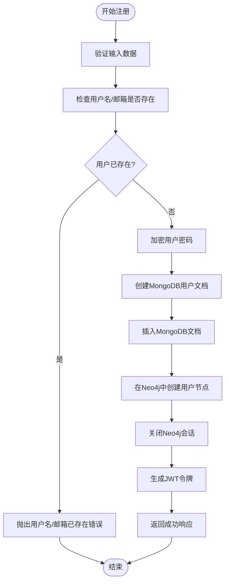
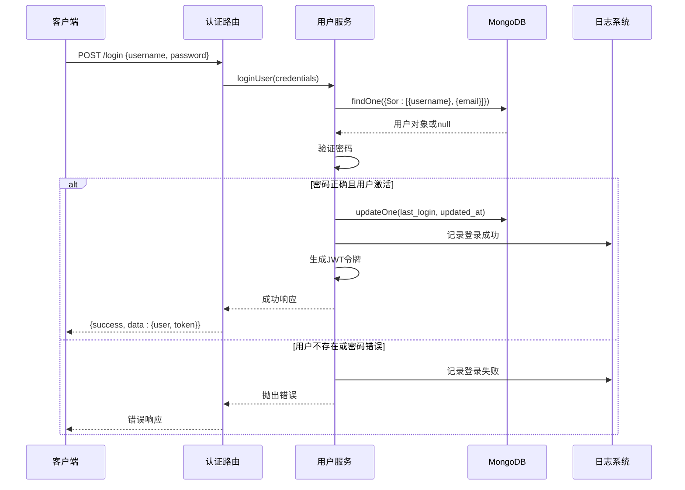
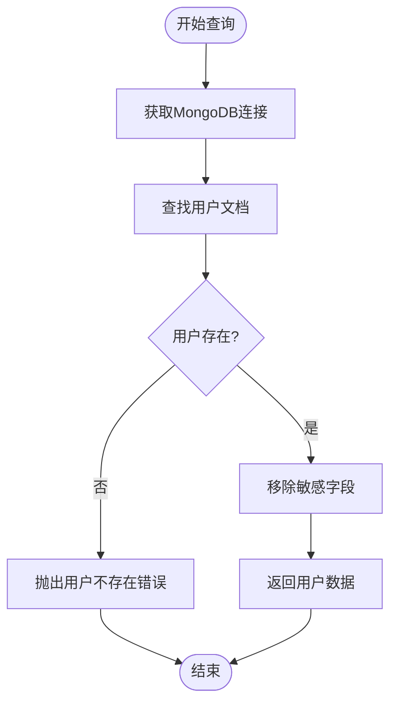
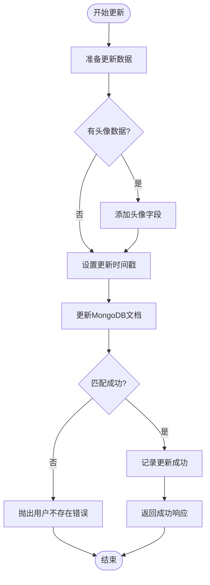
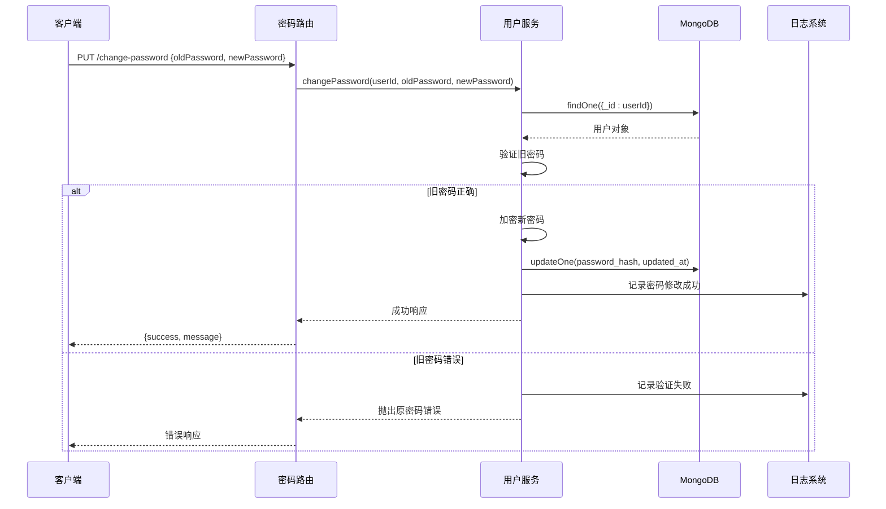
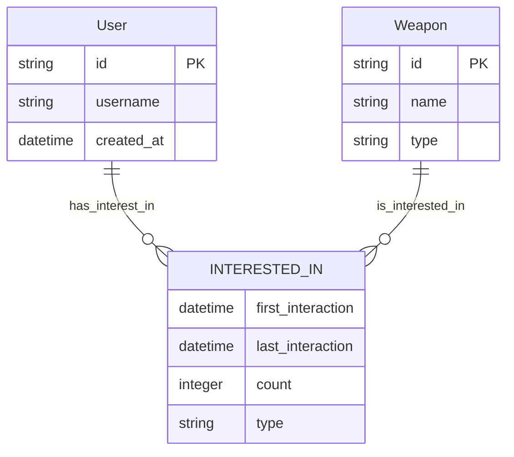
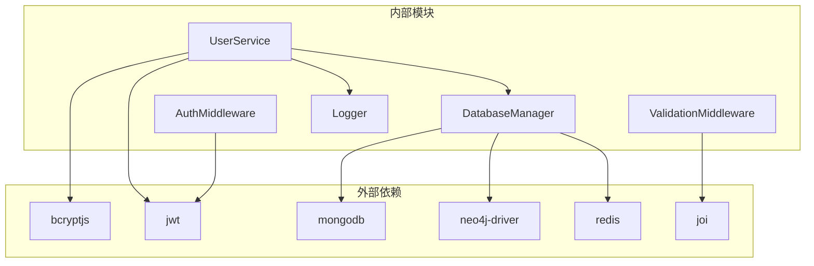

# 用户服务

<cite>
**本文档中引用的文件**
- [userService.js](file://backend/src/services/userService.js)
- [auth.js](file://backend/src/routes/auth.js)
- [database_Neo4j.js](file://backend/src/config/database_Neo4j.js)
- [validation.js](file://backend/src/middleware/validation.js)
- [auth.js](file://backend/src/middleware/auth.js)
</cite>

## 目录
1. [简介](#简介)
2. [项目结构](#项目结构)
3. [核心组件](#核心组件)
4. [架构概览](#架构概览)
5. [详细组件分析](#详细组件分析)
6. [依赖关系分析](#依赖关系分析)
7. [性能考虑](#性能考虑)
8. [故障排除指南](#故障排除指南)
9. [结论](#结论)

## 简介

用户服务（UserService）是兵智世界系统中的核心模块，负责处理所有用户相关的业务逻辑。该服务采用双数据库架构，结合MongoDB和Neo4j数据库，实现了完整的用户生命周期管理功能，包括用户注册、登录认证、资料管理、密码安全和兴趣记录等核心功能。

## 项目结构

用户服务位于系统的后端服务层，与数据库配置层和路由层紧密协作：



**图表来源**
- [userService.js](file://backend/src/services/userService.js#L1-L318)
- [auth.js](file://backend/src/routes/auth.js#L1-L144)
- [database_Neo4j.js](file://backend/src/config/database_Neo4j.js#L1-L141)

**章节来源**
- [userService.js](file://backend/src/services/userService.js#L1-L318)
- [auth.js](file://backend/src/routes/auth.js#L1-L144)

## 核心组件

用户服务包含以下核心功能模块：

### 主要功能模块表

| 功能模块 | 方法名 | 数据库 | 主要职责 |
|---------|--------|--------|----------|
| 用户注册 | registerUser | MongoDB+Neo4j | 创建用户文档，加密密码，在Neo4j中创建用户节点 |
| 用户登录 | loginUser | MongoDB | 验证用户凭据，生成JWT令牌 |
| 用户查询 | getUserById | MongoDB | 查询用户详细信息 |
| 资料更新 | updateUserProfile | MongoDB | 更新用户个人资料 |
| 密码修改 | changePassword | MongoDB | 安全验证并修改用户密码 |
| 兴趣记录 | recordUserInterest | Neo4j | 记录用户对武器的兴趣关系 |

### 数据模型设计



**图表来源**
- [userService.js](file://backend/src/services/userService.js#L15-L60)
- [userService.js](file://backend/src/services/userService.js#L289-L318)

**章节来源**
- [userService.js](file://backend/src/services/userService.js#L1-L318)

## 架构概览

用户服务采用分层架构设计，确保关注点分离和代码可维护性：



**图表来源**
- [userService.js](file://backend/src/services/userService.js#L6-L318)
- [database_Neo4j.js](file://backend/src/config/database_Neo4j.js#L6-L141)
- [auth.js](file://backend/src/middleware/auth.js#L1-L106)

## 详细组件分析

### registerUser - 用户注册功能

用户注册方法实现了完整的用户创建流程，包括数据验证、密码加密和多数据库同步。

#### 注册流程图



**图表来源**
- [userService.js](file://backend/src/services/userService.js#L10-L98)

#### 输入参数验证规则

| 参数 | 类型 | 必填 | 验证规则 | 错误消息 |
|------|------|------|----------|----------|
| username | string | 是 | 字母数字，3-30字符 | 用户名只能包含字母和数字 |
| email | string | 是 | 有效邮箱格式 | 请输入有效的邮箱地址 |
| password | string | 是 | 6-128字符 | 密码至少需要6个字符 |
| name | string | 否 | 2-50字符 | 姓名至少需要2个字符 |

#### 安全考虑

1. **密码加密**：使用bcrypt.js，盐值轮数为12
2. **重复检查**：同时检查用户名和邮箱的唯一性
3. **日志记录**：记录注册成功和失败事件
4. **数据脱敏**：不返回敏感信息如密码哈希

**章节来源**
- [userService.js](file://backend/src/services/userService.js#L10-L98)
- [validation.js](file://backend/src/middleware/validation.js#L15-L70)

### loginUser - 用户登录认证

登录功能实现了基于JWT的身份验证机制，确保用户身份的安全验证。

#### 登录认证流程



**图表来源**
- [userService.js](file://backend/src/services/userService.js#L100-L170)
- [auth.js](file://backend/src/routes/auth.js#L18-L28)

#### 认证安全机制

1. **双重验证**：用户名/邮箱匹配和密码验证
2. **状态检查**：验证用户账户是否激活
3. **时间更新**：自动更新最后登录时间和更新时间
4. **令牌生成**：使用环境变量配置的密钥生成JWT

**章节来源**
- [userService.js](file://backend/src/services/userService.js#L100-L170)
- [auth.js](file://backend/src/middleware/auth.js#L1-L106)

### getUserById - 用户信息查询

用户信息查询功能提供了安全的用户数据检索机制。

#### 查询逻辑分析



**图表来源**
- [userService.js](file://backend/src/services/userService.js#L172-L195)

#### 数据脱敏策略

查询结果自动移除了以下敏感字段：
- `password_hash`：密码哈希值
- 其他可能泄露隐私的信息

**章节来源**
- [userService.js](file://backend/src/services/userService.js#L172-L195)

### updateUserProfile - 用户资料更新

资料更新功能允许用户修改个人信息，同时保持数据的一致性和安全性。

#### 更新流程



**图表来源**
- [userService.js](file://backend/src/services/userService.js#L197-L235)

#### 支持的更新字段

| 字段路径 | 类型 | 描述 |
|----------|------|------|
| profile.name | string | 用户姓名 |
| profile.avatar | string | 头像URL |
| profile.preferences | object | 用户偏好设置 |
| updated_at | datetime | 更新时间戳 |

**章节来源**
- [userService.js](file://backend/src/services/userService.js#L197-L235)

### changePassword - 密码修改功能

密码修改功能实现了安全的密码变更机制，确保用户密码的安全性。

#### 密码修改安全流程



**图表来源**
- [userService.js](file://backend/src/services/userService.js#L237-L287)
- [auth.js](file://backend/src/routes/auth.js#L45-L75)

#### 安全验证步骤

1. **用户存在性检查**：确认目标用户存在
2. **旧密码验证**：使用bcrypt比较当前密码
3. **新密码加密**：使用相同盐值轮数加密新密码
4. **原子更新**：确保密码更新的原子性

**章节来源**
- [userService.js](file://backend/src/services/userService.js#L237-L287)
- [auth.js](file://backend/src/routes/auth.js#L45-L75)

### recordUserInterest - 用户兴趣记录

兴趣记录功能为推荐系统提供数据支持，通过Neo4j图数据库建立用户与武器的兴趣关系。

#### 兴趣关系建模



**图表来源**
- [userService.js](file://backend/src/services/userService.js#L289-L318)

#### 图数据库操作

兴趣记录使用Neo4j的MERGE语句实现：

```cypher
MATCH (u:User {id: $userId})
MATCH (w:Weapon {id: $weaponId})
MERGE (u)-[r:INTERESTED_IN]->(w)
ON CREATE SET r.first_interaction = datetime(), r.count = 1, r.type = $interactionType
ON MATCH SET r.last_interaction = datetime(), r.count = r.count + 1
```

这个查询实现了：
1. **关系创建**：首次交互时创建新的兴趣关系
2. **关系更新**：后续交互时更新计数和时间戳
3. **类型区分**：支持不同类型的交互（浏览、收藏等）

**章节来源**
- [userService.js](file://backend/src/services/userService.js#L289-L318)

## 依赖关系分析

用户服务的依赖关系展现了清晰的分层架构：



**图表来源**
- [userService.js](file://backend/src/services/userService.js#L1-L5)
- [database_Neo4j.js](file://backend/src/config/database_Neo4j.js#L1-L5)

### 核心依赖说明

| 依赖模块 | 版本要求 | 用途 | 安全影响 |
|----------|----------|------|----------|
| bcryptjs | ^2.4.3 | 密码加密 | 防止密码泄露 |
| jsonwebtoken | ^8.5.1 | JWT令牌生成 | 身份认证 |
| mongodb | ^4.0.0 | MongoDB客户端 | 数据持久化 |
| neo4j-driver | ^4.0.0 | Neo4j图数据库 | 关系数据存储 |
| joi | ^17.0.0 | 数据验证 | 输入安全 |

**章节来源**
- [userService.js](file://backend/src/services/userService.js#L1-L5)
- [database_Neo4j.js](file://backend/src/config/database_Neo4j.js#L1-L5)

## 性能考虑

### 数据库优化策略

1. **连接池管理**：数据库连接采用单例模式和连接池
2. **索引优化**：MongoDB集合使用用户名和邮箱的复合索引
3. **会话管理**：Neo4j会话采用自动关闭机制
4. **异步操作**：所有数据库操作都使用Promise和async/await

### 缓存策略

虽然当前实现没有显式的缓存层，但可以通过以下方式优化：
- Redis缓存用户会话信息
- 缓存频繁查询的用户资料
- 实现令牌黑名单机制

### 安全优化

1. **盐值固定**：使用固定的12轮盐值提高安全性
2. **输入验证**：严格的输入数据验证
3. **错误处理**：统一的错误处理机制，避免信息泄露
4. **日志记录**：详细的审计日志

## 故障排除指南

### 常见问题及解决方案

#### 注册失败

**问题症状**：用户注册时收到"用户名或邮箱已存在"错误

**排查步骤**：
1. 检查MongoDB中是否存在同名用户名或邮箱
2. 验证数据库连接是否正常
3. 确认用户名和邮箱格式是否符合验证规则

**解决方案**：
- 清理重复数据
- 检查数据库配置
- 验证输入数据格式

#### 登录失败

**问题症状**：用户登录时收到"用户名或密码错误"错误

**排查步骤**：
1. 验证用户账户状态是否为"active"
2. 检查密码哈希是否正确
3. 确认数据库连接状态

**解决方案**：
- 激活被禁用的账户
- 重新设置密码
- 检查数据库服务状态

#### 密码修改失败

**问题症状**：密码修改时收到"原密码错误"错误

**排查步骤**：
1. 验证提供的旧密码是否正确
2. 检查用户是否存在
3. 确认密码加密算法一致性

**解决方案**：
- 确保提供正确的旧密码
- 使用密码重置功能
- 检查密码加密配置

#### 兴趣记录失败

**问题症状**：用户兴趣记录操作失败

**排查步骤**：
1. 检查Neo4j数据库连接
2. 验证用户ID和武器ID的有效性
3. 确认Neo4j驱动版本兼容性

**解决方案**：
- 重启Neo4j服务
- 验证ID格式正确性
- 更新Neo4j驱动版本

**章节来源**
- [userService.js](file://backend/src/services/userService.js#L10-L98)
- [userService.js](file://backend/src/services/userService.js#L100-L170)
- [userService.js](file://backend/src/services/userService.js#L237-L287)
- [userService.js](file://backend/src/services/userService.js#L289-L318)

## 结论

用户服务模块展现了现代Web应用中用户管理的最佳实践。通过采用双数据库架构（MongoDB+Neo4j），实现了传统关系数据和复杂图数据的有效结合。主要优势包括：

### 技术亮点

1. **安全性**：完善的密码加密、输入验证和错误处理机制
2. **可扩展性**：模块化的架构设计，便于功能扩展
3. **可靠性**：完善的日志记录和异常处理机制
4. **性能**：异步操作和连接池管理确保高性能

### 架构优势

1. **分层清晰**：服务层、路由层、配置层职责明确
2. **依赖解耦**：通过依赖注入降低模块间耦合
3. **数据一致性**：多数据库同步确保数据完整性
4. **监控完善**：详细的日志记录支持运维监控

### 改进建议

1. **缓存集成**：引入Redis缓存提升查询性能
2. **限流机制**：添加API限流防止恶意攻击
3. **审计增强**：增加更详细的审计日志
4. **测试覆盖**：完善单元测试和集成测试

该用户服务模块为兵智世界系统提供了坚实的基础，支持复杂的用户交互和推荐系统需求，是整个系统架构中的关键组件。