# 知识图谱服务

<cite>
**本文档中引用的文件**
- [knowledgeGraphService.js](file://backend/src/services/knowledgeGraphService.js)
- [knowledge.js](file://backend/src/routes/knowledge.js)
- [database_Neo4j.js](file://backend/src/config/database_Neo4j.js)
- [knowledge-graph.js](file://backend/src/routes/knowledge-graph.js)
- [knowledge.py](file://backend/routes/knowledge.py)
</cite>

## 目录
1. [简介](#简介)
2. [项目结构](#项目结构)
3. [核心组件](#核心组件)
4. [架构概览](#架构概览)
5. [详细组件分析](#详细组件分析)
6. [依赖关系分析](#依赖关系分析)
7. [性能考虑](#性能考虑)
8. [故障排除指南](#故障排除指南)
9. [结论](#结论)

## 简介

知识图谱服务是兵智世界系统的核心组件之一，基于Neo4j图数据库构建，提供了强大的知识图谱数据处理和查询功能。该服务通过Cypher查询语言实现了复杂的图数据分析，包括节点关系查询、路径查找、推荐算法等功能。

## 项目结构

知识图谱服务在项目中的组织结构如下：

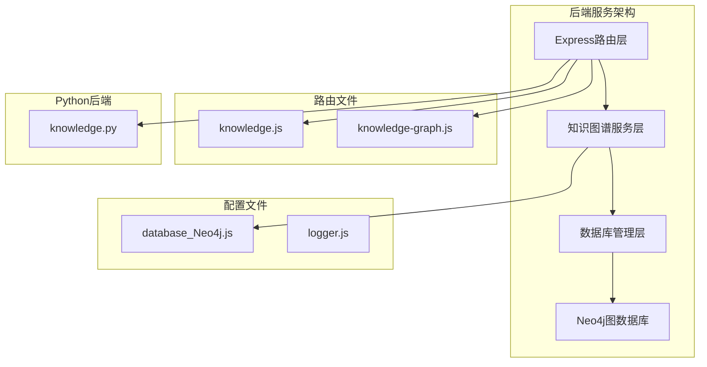

**图表来源**
- [knowledgeGraphService.js](file://backend/src/services/knowledgeGraphService.js#L1-L10)
- [database_Neo4j.js](file://backend/src/config/database_Neo4j.js#L1-L20)
- [knowledge.js](file://backend/src/routes/knowledge.js#L1-L10)

**章节来源**
- [knowledgeGraphService.js](file://backend/src/services/knowledgeGraphService.js#L1-L430)
- [database_Neo4j.js](file://backend/src/config/database_Neo4j.js#L1-L141)

## 核心组件

知识图谱服务包含以下核心功能模块：

### 主要功能模块
1. **Cypher查询执行器** - 安全执行Neo4j Cypher查询
2. **图谱概览统计** - 提供节点和关系统计信息
3. **武器图谱获取** - 基于深度遍历的武器关联数据
4. **图谱搜索引擎** - 支持属性和类型的多维搜索
5. **邻居节点发现** - 获取指定节点的直接关联节点
6. **最短路径查找** - 基于Neo4j算法的路径发现
7. **推荐系统** - 基于用户兴趣的武器推荐
8. **相似关系创建** - 自动生成武器间的相似性关系

**章节来源**
- [knowledgeGraphService.js](file://backend/src/services/knowledgeGraphService.js#L4-L430)

## 架构概览

知识图谱服务采用分层架构设计，确保了良好的可维护性和扩展性：

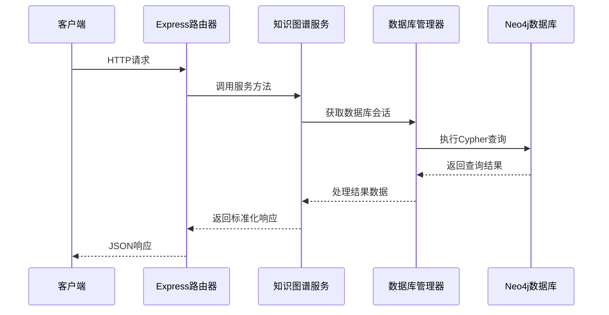

**图表来源**
- [knowledge.js](file://backend/src/routes/knowledge.js#L1-L50)
- [knowledgeGraphService.js](file://backend/src/services/knowledgeGraphService.js#L5-L50)
- [database_Neo4j.js](file://backend/src/config/database_Neo4j.js#L70-L90)

## 详细组件分析

### executeCypherQuery方法 - 安全Cypher查询执行

executeCypherQuery方法是知识图谱服务的核心查询接口，负责安全地执行Cypher查询并处理复杂的数据结构。

#### 查询执行流程

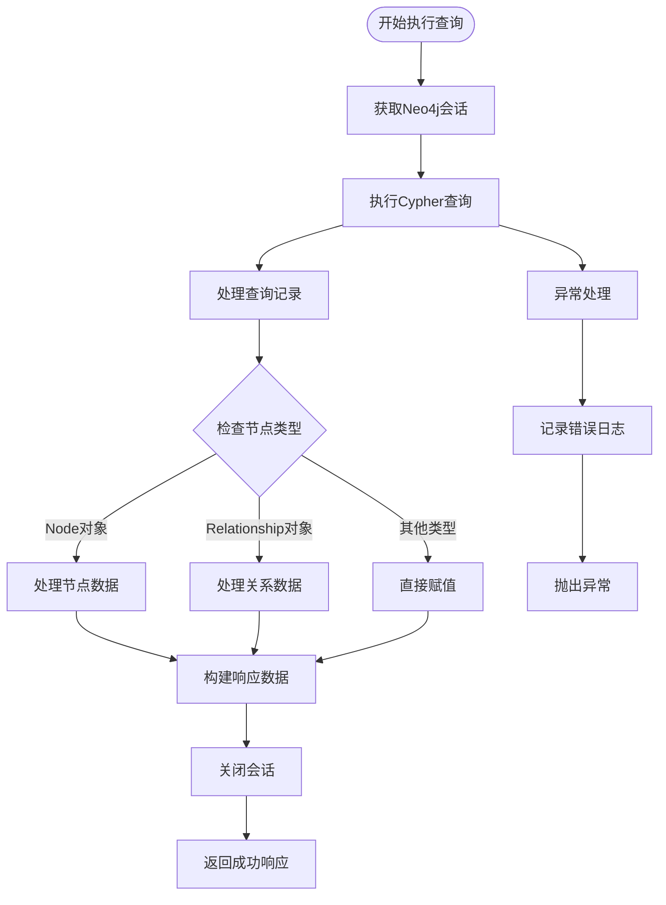

**图表来源**
- [knowledgeGraphService.js](file://backend/src/services/knowledgeGraphService.js#L5-L50)

#### 节点和关系对象处理

服务能够智能识别和处理Neo4j返回的复杂对象类型：

| 对象类型 | 处理方式 | 返回结构 |
|---------|---------|---------|
| Node对象 | 提取identity、labels、properties | `{id, labels, properties}` |
| Relationship对象 | 提取identity、type、properties及start/end | `{id, type, properties, source, target}` |
| 其他类型 | 直接返回原始值 | `{原始值}` |

**章节来源**
- [knowledgeGraphService.js](file://backend/src/services/knowledgeGraphService.js#L5-L50)

### getGraphOverview方法 - 图谱统计功能

getGraphOverview方法提供全面的知识图谱统计信息，帮助用户了解图谱的整体结构和规模。

#### 统计查询逻辑

```mermaid
graph LR
subgraph "节点统计"
A[MATCH (n)] --> B[RETURN labels(n), count(n)]
B --> C[ORDER BY count DESC]
end
subgraph "关系统计"
D[MATCH ()-[r]->()] --> E[RETURN type(r), count(r)]
E --> F[ORDER BY count DESC]
end
subgraph "汇总计算"
G[节点总数计算]
H[关系总数计算]
end
C --> G
F --> H
```

**图表来源**
- [knowledgeGraphService.js](file://backend/src/services/knowledgeGraphService.js#L52-L85)

#### 统计指标说明

| 指标类型 | 查询语句 | 计算方式 |
|---------|---------|---------|
| 节点统计 | `MATCH (n) RETURN labels(n), count(n)` | 按标签分组计数 |
| 关系统计 | `MATCH ()-[r]->() RETURN type(r), count(r)` | 按关系类型分组计数 |
| 总节点数 | `SUM(count)` | 所有节点类型的计数总和 |
| 总关系数 | `SUM(count)` | 所有关系类型的计数总和 |

**章节来源**
- [knowledgeGraphService.js](file://backend/src/services/knowledgeGraphService.js#L52-L85)

### getWeaponGraph方法 - 武器关联图谱

getWeaponGraph方法实现基于深度遍历的武器关联数据获取，支持灵活的查询深度控制。

#### 深度遍历算法

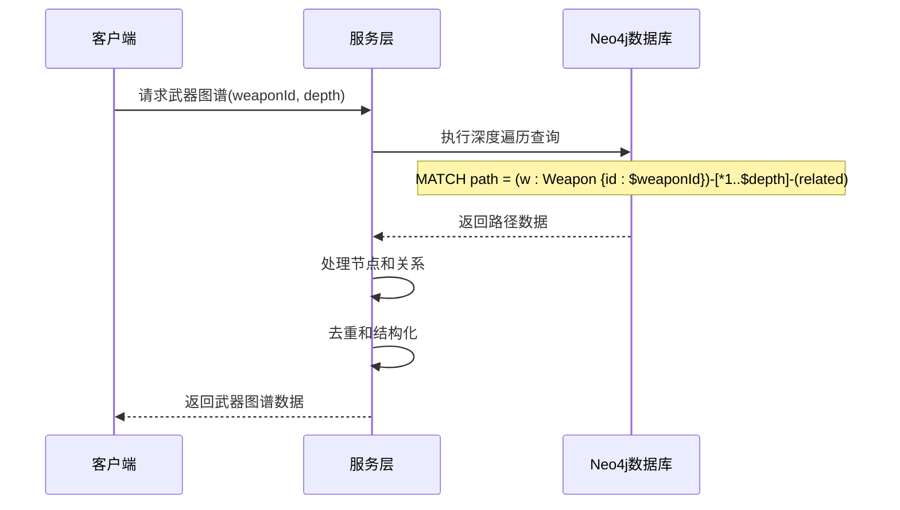

**图表来源**
- [knowledgeGraphService.js](file://backend/src/services/knowledgeGraphService.js#L87-L130)

#### 查询参数控制

| 参数 | 类型 | 默认值 | 说明 |
|------|------|--------|------|
| weaponId | String | 必需 | 目标武器的唯一标识符 |
| depth | Number | 2 | 遍历的最大深度，范围1-5 |
| limit | Number | 100 | 结果集限制 |

**章节来源**
- [knowledgeGraphService.js](file://backend/src/services/knowledgeGraphService.js#L87-L130)

### searchGraph方法 - 图谱搜索机制

searchGraph方法提供强大的图谱搜索功能，支持按节点属性和类型进行多维过滤。

#### 搜索查询构建

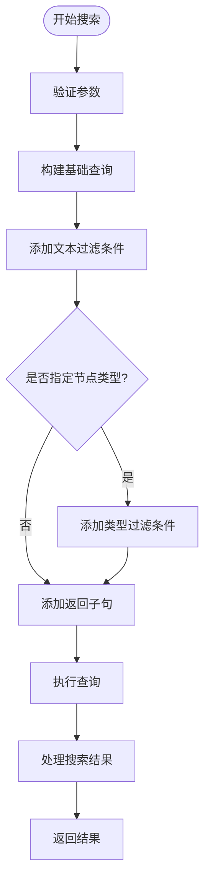

**图表来源**
- [knowledgeGraphService.js](file://backend/src/services/knowledgeGraphService.js#L132-L180)

#### 搜索条件组合

| 条件类型 | Cypher表达式 | 示例 |
|---------|-------------|------|
| 文本搜索 | `n.name CONTAINS $searchTerm` | 搜索武器名称包含"AK"的节点 |
| 类型过滤 | `$label0 IN labels(n) OR $label1 IN labels(n)` | 只搜索武器和国家节点 |
| 组合条件 | `WHERE condition1 AND condition2` | 同时满足文本和类型条件 |

**章节来源**
- [knowledgeGraphService.js](file://backend/src/services/knowledgeGraphService.js#L132-L180)

### getNodeNeighbors方法 - 邻居节点发现

getNodeNeighbors方法实现节点邻居的高效发现，支持关系类型过滤和结果限制。

#### 邻居发现算法

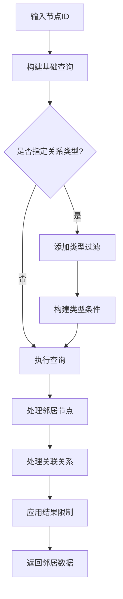

**图表来源**
- [knowledgeGraphService.js](file://backend/src/services/knowledgeGraphService.js#L182-L230)

#### 查询优化策略

| 优化技术 | 实现方式 | 性能收益 |
|---------|---------|---------|
| 关系类型过滤 | `type(r) IN [type1, type2]` | 减少不必要的关系扫描 |
| 结果限制 | `LIMIT $limit` | 控制内存使用和响应时间 |
| ID精确匹配 | `id(n) = $nodeId` | 利用索引加速查找 |

**章节来源**
- [knowledgeGraphService.js](file://backend/src/services/knowledgeGraphService.js#L182-L230)

### findPath方法 - 最短路径查找

findPath方法利用Neo4j的内置最短路径算法，查找两个节点之间的最优连接路径。

#### 路径查找流程

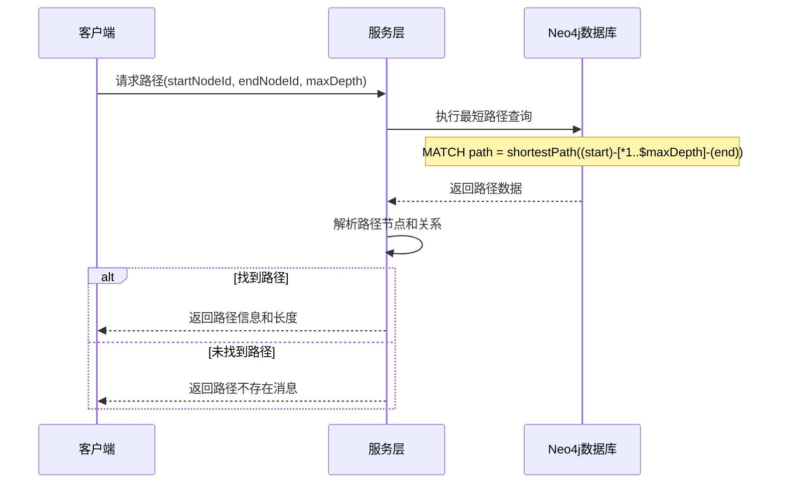

**图表来源**
- [knowledgeGraphService.js](file://backend/src/services/knowledgeGraphService.js#L232-L280)

#### 路径查询参数

| 参数 | 类型 | 默认值 | 限制 | 说明 |
|------|------|--------|------|------|
| startNodeId | Number | 必需 | 无 | 起始节点的内部ID |
| endNodeId | Number | 必需 | 无 | 结束节点的内部ID |
| maxDepth | Number | 5 | ≤10 | 最大搜索深度 |

**章节来源**
- [knowledgeGraphService.js](file://backend/src/services/knowledgeGraphService.js#L232-L280)

### getRecommendedWeapons方法 - 推荐算法

getRecommendedWeapons方法基于用户兴趣图谱实现智能武器推荐，采用协同过滤思想。

#### 推荐算法流程

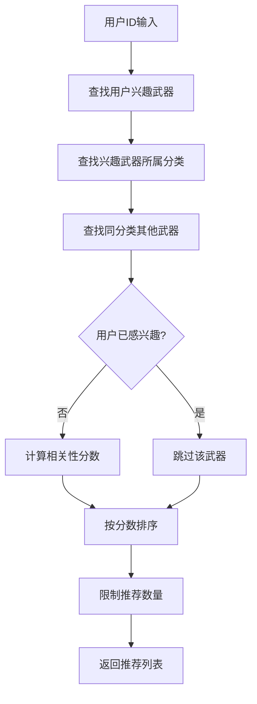

**图表来源**
- [knowledgeGraphService.js](file://backend/src/services/knowledgeGraphService.js#L282-L320)

#### 推荐评分机制

| 评分因素 | 计算方式 | 权重 |
|---------|---------|------|
| 分类匹配度 | 同一分类的武器数量 | 主要 |
| 用户兴趣覆盖 | 已感兴趣的武器排除 | 排序依据 |
| 数量统计 | 相似武器的数量 | 评分依据 |

**章节来源**
- [knowledgeGraphService.js](file://backend/src/services/knowledgeGraphService.js#L282-L320)

### createSimilarityRelationship方法 - 相似关系创建

createSimilarityRelationship方法实现武器间的相似性关系建立，支持自定义相似度阈值。

#### 关系创建逻辑

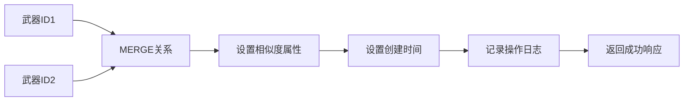

**图表来源**
- [knowledgeGraphService.js](file://backend/src/services/knowledgeGraphService.js#L322-L350)

#### 关系属性配置

| 属性名 | 类型 | 默认值 | 说明 |
|-------|------|--------|------|
| similarity_score | Float | 0.8 | 相似度分数，范围0-1 |
| created_at | DateTime | 当前时间 | 关系创建时间戳 |

**章节来源**
- [knowledgeGraphService.js](file://backend/src/services/knowledgeGraphService.js#L322-L350)

## 依赖关系分析

知识图谱服务的依赖关系体现了清晰的分层架构：

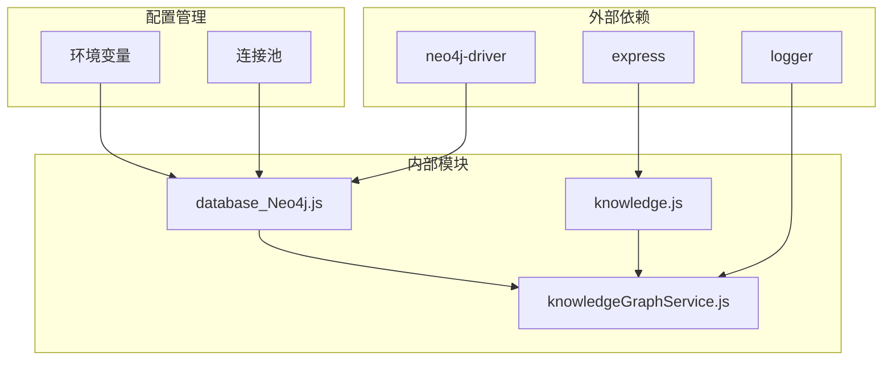

**图表来源**
- [knowledgeGraphService.js](file://backend/src/services/knowledgeGraphService.js#L1-L5)
- [database_Neo4j.js](file://backend/src/config/database_Neo4j.js#L1-L10)

### 模块间交互

| 调用方 | 被调用方 | 调用方式 | 参数传递 |
|-------|---------|---------|---------|
| knowledge.js | knowledgeGraphService | 直接调用 | HTTP请求参数 |
| knowledgeGraphService | databaseManager | 方法调用 | Cypher查询和参数 |
| databaseManager | neo4j-driver | 底层API | 连接配置 |

**章节来源**
- [knowledge.js](file://backend/src/routes/knowledge.js#L1-L10)
- [knowledgeGraphService.js](file://backend/src/services/knowledgeGraphService.js#L1-L10)

## 性能考虑

### 查询优化策略

1. **索引利用**：充分利用Neo4j的索引机制，特别是对常用查询字段如`id`和`name`建立索引
2. **查询限制**：合理设置查询结果的LIMIT值，避免返回过多数据
3. **深度控制**：对深度遍历查询设置合理的最大深度限制
4. **连接池管理**：通过数据库管理器实现连接池复用

### 缓存策略

虽然当前实现没有显式的缓存层，但可以通过以下方式优化：
- 对频繁访问的图谱统计数据进行缓存
- 缓存常用的搜索结果
- 对推荐结果实施短期缓存

### 错误处理机制

服务实现了多层次的错误处理：

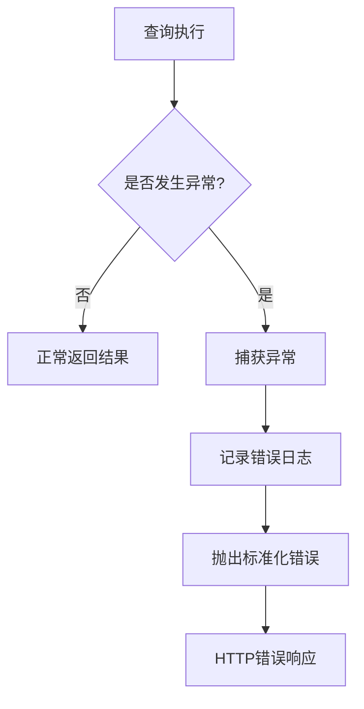

**图表来源**
- [knowledgeGraphService.js](file://backend/src/services/knowledgeGraphService.js#L35-L50)

## 故障排除指南

### 常见问题及解决方案

| 问题类型 | 症状 | 可能原因 | 解决方案 |
|---------|------|---------|---------|
| 连接失败 | 数据库连接超时 | Neo4j服务不可用 | 检查服务状态和网络连接 |
| 查询超时 | 请求处理时间过长 | 查询复杂度过高 | 优化查询条件和增加LIMIT |
| 内存溢出 | 服务崩溃 | 返回结果过大 | 减少查询深度和结果数量 |
| 权限错误 | Cypher查询被拒绝 | 使用了危险操作 | 移除DELETE、DROP等关键字 |

### 监控和调试

1. **日志监控**：通过logger模块记录详细的执行日志
2. **性能监控**：监控查询执行时间和资源使用情况
3. **错误追踪**：建立完善的错误报告和处理机制

**章节来源**
- [knowledgeGraphService.js](file://backend/src/services/knowledgeGraphService.js#L35-L50)
- [database_Neo4j.js](file://backend/src/config/database_Neo4j.js#L15-L30)

## 结论

知识图谱服务是一个功能完整、设计合理的图数据库应用服务。它通过精心设计的API接口和查询优化策略，为兵智世界系统提供了强大的知识图谱分析能力。

### 主要优势

1. **安全性**：实现了完善的参数化查询和危险操作防护
2. **性能**：通过合理的查询限制和优化策略保证了良好的响应性能
3. **可扩展性**：模块化的架构设计便于功能扩展和维护
4. **可靠性**：完善的错误处理和日志记录机制确保了服务稳定性

### 改进建议

1. **缓存机制**：引入适当的缓存策略提升高频查询性能
2. **批量操作**：支持批量查询和操作以提高效率
3. **实时更新**：实现图谱数据的实时同步和更新机制
4. **可视化接口**：提供更丰富的图谱可视化和分析工具

该服务为兵智世界的知识管理提供了坚实的技术基础，支撑了系统的智能化分析和决策功能。