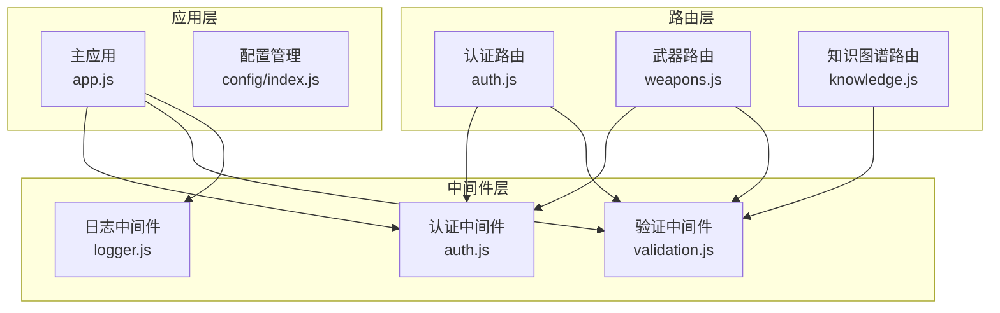
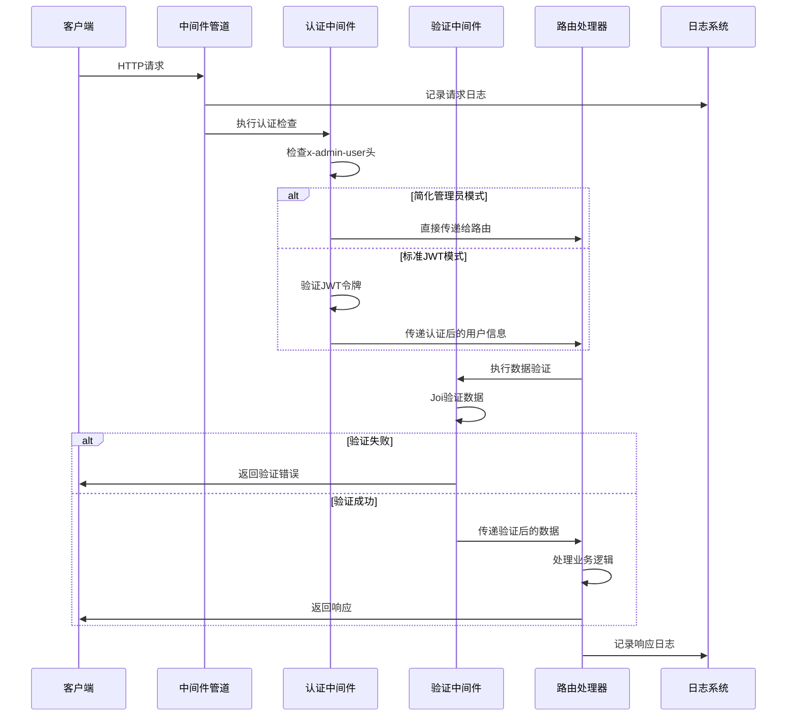
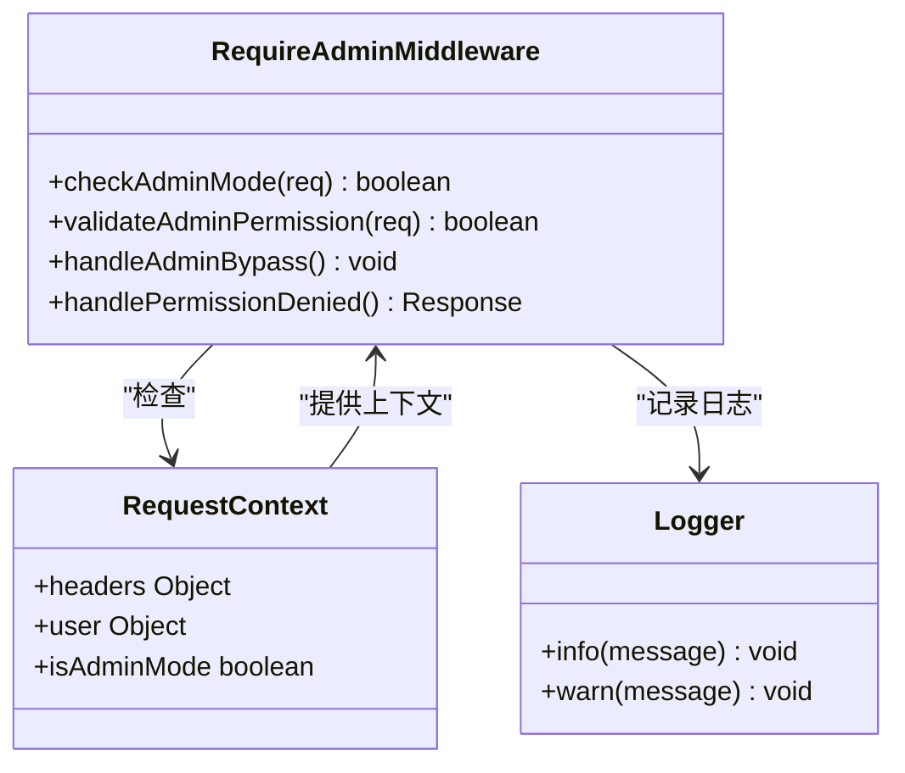
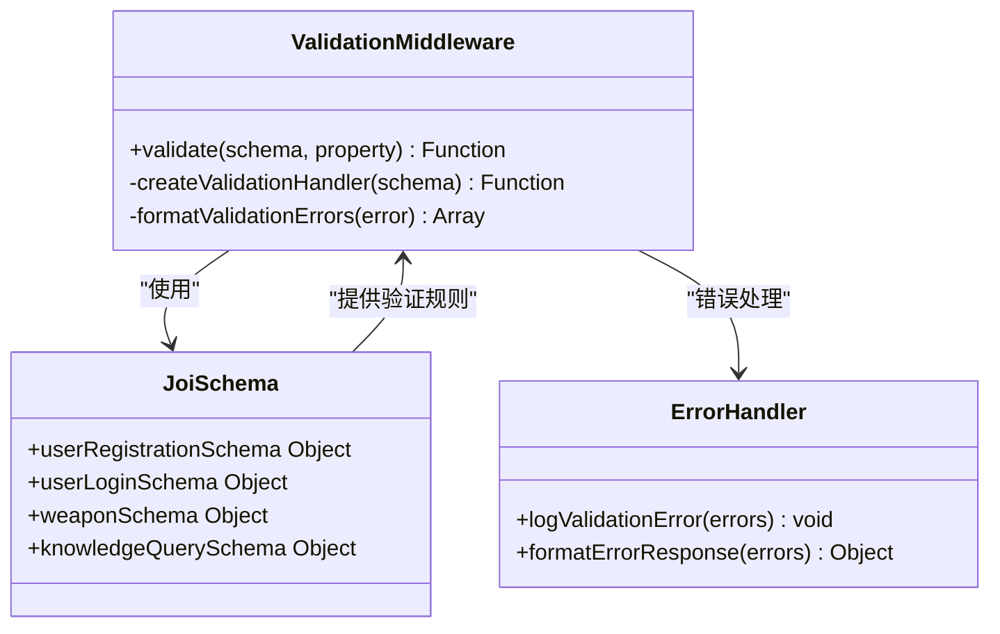
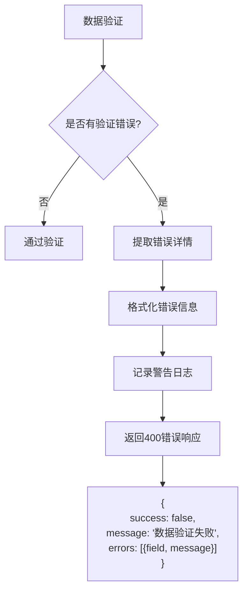
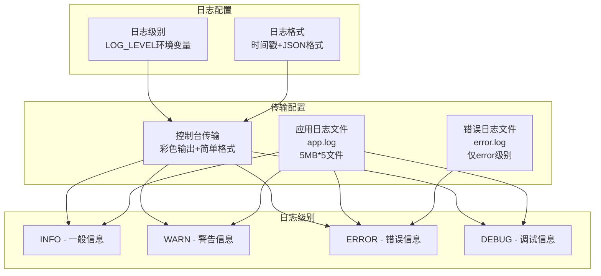
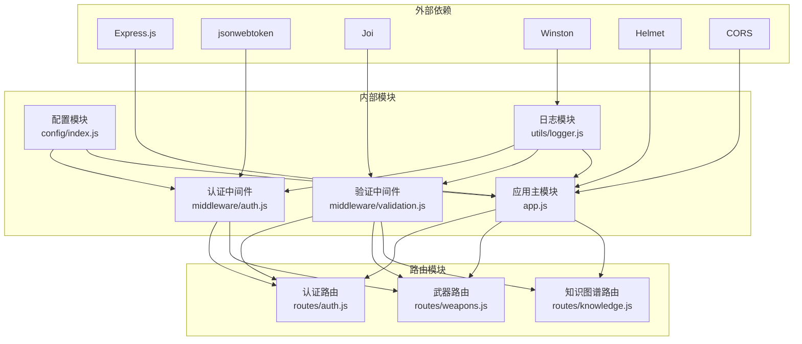

# 中间件系统

<cite>
**本文档引用的文件**
- [auth.js](file://backend/src/middleware/auth.js)
- [validation.js](file://backend/src/middleware/validation.js)
- [logger.js](file://backend/src/utils/logger.js)
- [app.js](file://backend/src/app.js)
- [index.js](file://backend/src/config/index.js)
- [auth.js](file://backend/src/routes/auth.js)
- [weapons.js](file://backend/src/routes/weapons.js)
- [knowledge.js](file://backend/src/routes/knowledge.js)
</cite>

## 目录
1. [简介](#简介)
2. [项目结构](#项目结构)
3. [核心组件](#核心组件)
4. [架构概览](#架构概览)
5. [详细组件分析](#详细组件分析)
6. [依赖关系分析](#依赖关系分析)
7. [性能考虑](#性能考虑)
8. [故障排除指南](#故障排除指南)
9. [结论](#结论)

## 简介

兵智世界后端中间件系统是一个基于Express.js构建的现代化Web应用中间件框架，专门设计用于处理认证、数据验证和日志记录三大核心功能。该系统采用模块化设计，支持JWT令牌认证、Joi数据验证、Winston日志记录，并提供了灵活的管理员模式和可选认证机制。

系统的核心设计理念是安全性、可扩展性和易用性，通过中间件链的方式实现了请求处理管道的清晰分离和职责单一化。每个中间件组件都可以独立工作，也可以组合使用以满足复杂的业务需求。

## 项目结构

中间件系统在项目中的组织结构体现了清晰的分层架构：



**图表来源**
- [app.js](file://backend/src/app.js#L1-L50)
- [auth.js](file://backend/src/middleware/auth.js#L1-L20)
- [validation.js](file://backend/src/middleware/validation.js#L1-L20)

**章节来源**
- [app.js](file://backend/src/app.js#L1-L248)
- [auth.js](file://backend/src/middleware/auth.js#L1-L106)

## 核心组件

### 认证中间件 (auth.js)

认证中间件是系统安全的核心组件，负责处理用户身份验证和权限控制。它支持两种认证模式：

1. **标准JWT认证模式**：使用Bearer Token进行身份验证
2. **简化管理员模式**：通过HTTP头`x-admin-user`启用的快速管理员访问

### 验证中间件 (validation.js)

验证中间件基于Joi库实现，提供强大的数据验证功能。它支持：
- 结构化数据验证
- 自定义验证规则
- 详细的错误信息返回
- 多种数据类型的验证支持

### 日志中间件 (logger.js)

基于Winston的日志系统提供：
- 多级别的日志记录
- 结构化日志格式
- 文件和控制台双重输出
- 异常处理和监控

**章节来源**
- [auth.js](file://backend/src/middleware/auth.js#L1-L106)
- [validation.js](file://backend/src/middleware/validation.js#L1-L178)
- [logger.js](file://backend/src/utils/logger.js#L1-L47)

## 架构概览

中间件系统采用管道模式(Pipeline Pattern)，在Express应用中形成完整的请求处理链：



**图表来源**
- [auth.js](file://backend/src/middleware/auth.js#L5-L48)
- [validation.js](file://backend/src/middleware/validation.js#L5-L25)
- [logger.js](file://backend/src/utils/logger.js#L15-L47)

## 详细组件分析

### JWT认证中间件 (authenticateToken)

authenticateToken中间件是系统安全的核心，实现了多层次的身份验证机制：

#### 核心功能特性

1. **多模式认证支持**
   - 简化管理员模式：通过`x-admin-user: true`头启用
   - 标准JWT模式：通过Authorization头的Bearer Token验证

2. **令牌解析机制**
   ```mermaid
flowchart TD
Start([请求到达]) --> CheckAdmin["检查x-admin-user头"]
CheckAdmin --> IsAdmin{"是否为管理员模式?"}
IsAdmin --> |是| SetAdmin["设置管理员用户信息"]
IsAdmin --> |否| CheckToken["检查Authorization头"]
CheckToken --> HasToken{"是否有Token?"}
HasToken --> |否| Return401["返回401未授权"]
HasToken --> |是| VerifyToken["验证JWT令牌"]
VerifyToken --> TokenValid{"令牌有效?"}
TokenValid --> |否| Return403["返回403禁止访问"]
TokenValid --> |是| SetUser["设置用户信息"]
SetAdmin --> Next([继续处理])
SetUser --> Next
Return401 --> End([结束])
Return403 --> End
```

**图表来源**
- [auth.js](file://backend/src/middleware/auth.js#L5-L48)

3. **错误处理策略**
   - 令牌缺失：返回401状态码
   - 令牌无效或过期：返回403状态码
   - 记录详细的错误日志供调试

#### 管理员权限控制 (requireAdmin)

requireAdmin中间件实现了细粒度的权限控制：



**图表来源**
- [auth.js](file://backend/src/middleware/auth.js#L65-L85)

#### 可选认证中间件 (optionalAuth)

optionalAuth中间件提供了灵活的认证选择机制，适用于需要匿名访问的场景：

- 当存在有效令牌时，设置认证用户信息
- 当令牌无效或缺失时，设置`req.user = null`
- 支持混合认证模式的应用场景

**章节来源**
- [auth.js](file://backend/src/middleware/auth.js#L1-L106)

### 数据验证中间件 (validation.js)

验证中间件基于Joi库构建，提供了强大而灵活的数据验证能力：

#### 验证架构设计



**图表来源**
- [validation.js](file://backend/src/middleware/validation.js#L5-L25)

#### 验证规则配置

系统预定义了多种验证规则，每种都针对特定的业务场景：

| 验证规则 | 适用场景 | 主要字段 | 验证要求 |
|---------|---------|---------|---------|
| userRegistrationSchema | 用户注册 | username, email, password, name | 字符长度限制、格式验证 |
| userLoginSchema | 用户登录 | username, password | 必填项验证 |
| weaponSchema | 武器数据 | name, type, country, year, description | 类型枚举、数值范围、字符串长度 |
| knowledgeQuerySchema | 知识图谱查询 | query, limit | 查询安全、限制参数 |

#### 错误处理机制

验证失败时，系统会返回结构化的错误响应：



**图表来源**
- [validation.js](file://backend/src/middleware/validation.js#L10-L25)

**章节来源**
- [validation.js](file://backend/src/middleware/validation.js#L1-L178)

### Winston日志系统 (logger.js)

日志系统基于Winston构建，提供了全面的日志记录解决方案：

#### 日志配置架构



**图表来源**
- [logger.js](file://backend/src/utils/logger.js#L15-L47)

#### 日志格式化

系统采用结构化日志格式，确保日志的可读性和可分析性：

- 时间戳格式：`YYYY-MM-DD HH:mm:ss`
- 错误堆栈跟踪：完整的调用栈信息
- JSON格式：便于机器解析和自动化处理

#### 多重输出策略

1. **控制台输出**：开发环境下的实时调试
2. **文件输出**：生产环境的持久化存储
3. **分级存储**：普通日志和错误日志分别存储

**章节来源**
- [logger.js](file://backend/src/utils/logger.js#L1-L47)

## 依赖关系分析

中间件系统的依赖关系体现了清晰的分层架构和模块化设计：



**图表来源**
- [app.js](file://backend/src/app.js#L1-L15)
- [auth.js](file://backend/src/middleware/auth.js#L1-L5)
- [validation.js](file://backend/src/middleware/validation.js#L1-L5)
- [logger.js](file://backend/src/utils/logger.js#L1-L5)

### 关键依赖说明

1. **Express生态系统**：提供基础的Web框架功能
2. **安全中间件**：Helmet提供HTTP头部安全保护
3. **认证库**：jsonwebtoken处理JWT令牌的生成和验证
4. **验证库**：Joi提供声明式的数据验证
5. **日志库**：Winston提供强大的日志记录功能

**章节来源**
- [app.js](file://backend/src/app.js#L1-L15)
- [auth.js](file://backend/src/middleware/auth.js#L1-L5)
- [validation.js](file://backend/src/middleware/validation.js#L1-L5)

## 性能考虑

中间件系统在设计时充分考虑了性能优化：

### 认证性能优化

1. **令牌缓存**：JWT令牌验证结果可以在内存中缓存
2. **早期退出**：无效的请求在认证阶段就被拦截
3. **异步处理**：所有认证操作都是异步的，不会阻塞主线程

### 验证性能优化

1. **延迟验证**：只有在必要时才执行数据验证
2. **错误聚合**：一次性返回所有验证错误，避免多次往返
3. **格式化优化**：使用高效的JSON序列化

### 日志性能优化

1. **异步写入**：日志写入操作是非阻塞的
2. **缓冲机制**：大量日志会自动缓冲，减少I/O操作
3. **分级输出**：不同级别的日志采用不同的输出策略

## 故障排除指南

### 常见问题及解决方案

#### 认证相关问题

**问题**：JWT令牌验证失败
- **原因**：令牌过期、签名不匹配、密钥错误
- **解决方案**：检查JWT密钥配置，验证令牌格式

**问题**：简化管理员模式不生效
- **原因**：缺少正确的HTTP头或值
- **解决方案**：确保发送`x-admin-user: true`头

#### 验证相关问题

**问题**：数据验证总是失败
- **原因**：请求数据格式不正确或缺少必需字段
- **解决方案**：检查请求体格式，参考验证规则

**问题**：自定义验证规则不生效
- **原因**：Joi schema配置错误
- **解决方案**：检查schema语法和消息配置

#### 日志相关问题

**问题**：日志文件无法创建
- **原因**：日志目录权限不足或磁盘空间不足
- **解决方案**：检查目录权限和磁盘空间

**问题**：日志格式不正确
- **原因**：Winston配置错误
- **解决方案**：检查日志格式配置

**章节来源**
- [auth.js](file://backend/src/middleware/auth.js#L25-L48)
- [validation.js](file://backend/src/middleware/validation.js#L10-L25)
- [logger.js](file://backend/src/utils/logger.js#L15-L30)

## 结论

兵智世界后端中间件系统是一个设计精良、功能完备的现代Web应用中间件框架。它通过模块化的设计理念，将认证、验证和日志三大核心功能有机结合，形成了一个高效、安全、可扩展的中间件生态系统。

### 主要优势

1. **安全性**：完善的JWT认证机制和权限控制
2. **可靠性**：健壮的错误处理和异常恢复机制
3. **可维护性**：清晰的模块划分和文档化
4. **可扩展性**：灵活的中间件组合和配置选项

### 最佳实践建议

1. **合理使用中间件组合**：根据具体需求选择合适的中间件组合
2. **定期更新依赖**：保持中间件库的最新版本
3. **完善监控机制**：结合日志系统建立完整的监控体系
4. **安全配置**：正确配置JWT密钥和环境变量

该中间件系统为兵智世界项目提供了坚实的技术基础，能够支持复杂的企业级应用场景，同时保持良好的开发体验和运维效率。