# 数据验证中间件

<cite>
**本文档引用的文件**   
- [validation.js](file://backend/src/middleware/validation.js)
- [auth.js](file://backend/src/routes/auth.js)
- [weapons.js](file://backend/src/routes/weapons.js)
- [knowledge.js](file://backend/src/routes/knowledge.js)
- [userService.js](file://backend/src/services/userService.js)
- [weaponService.js](file://backend/src/services/weaponService.js)
- [logger.js](file://backend/src/utils/logger.js)
</cite>

## 目录
1. [引言](#引言)
2. [验证中间件架构](#验证中间件架构)
3. [核心验证函数分析](#核心验证函数分析)
4. [预定义验证规则详解](#预定义验证规则详解)
5. [错误处理流程](#错误处理流程)
6. [路由中的实际应用](#路由中的实际应用)
7. [批量错误反馈优势](#批量错误反馈优势)
8. [结论](#结论)

## 引言
本文档深入解析基于Joi库的数据验证中间件系统，详细说明其在兵智世界项目中的实现和应用。该系统为API接口提供了强大的数据校验能力，确保了数据的完整性和安全性。

## 验证中间件架构
该数据验证系统采用模块化设计，通过Joi库实现强大的数据验证功能。系统架构包含通用验证函数、预定义验证规则和错误处理机制，为不同业务场景提供灵活的验证解决方案。

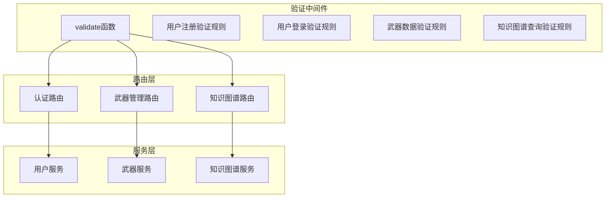

**图示来源**
- [validation.js](file://backend/src/middleware/validation.js#L1-L177)
- [auth.js](file://backend/src/routes/auth.js#L1-L144)
- [weapons.js](file://backend/src/routes/weapons.js#L1-L218)
- [knowledge.js](file://backend/src/routes/knowledge.js#L1-L182)

**本节来源**
- [validation.js](file://backend/src/middleware/validation.js#L1-L177)

## 核心验证函数分析
`validate`高阶函数是整个验证系统的核心，它根据传入的schema和property参数动态创建验证中间件。该函数支持对请求体、查询参数等不同数据源进行校验。

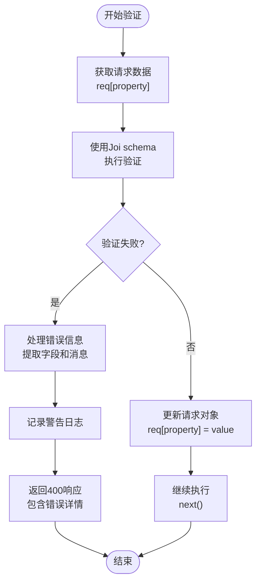

**图示来源**
- [validation.js](file://backend/src/middleware/validation.js#L4-L25)

**本节来源**
- [validation.js](file://backend/src/middleware/validation.js#L4-L25)

## 预定义验证规则详解

### 用户注册验证规则
`userRegistrationSchema`定义了用户注册时的数据约束，包括用户名、邮箱、密码和姓名等字段的验证规则。

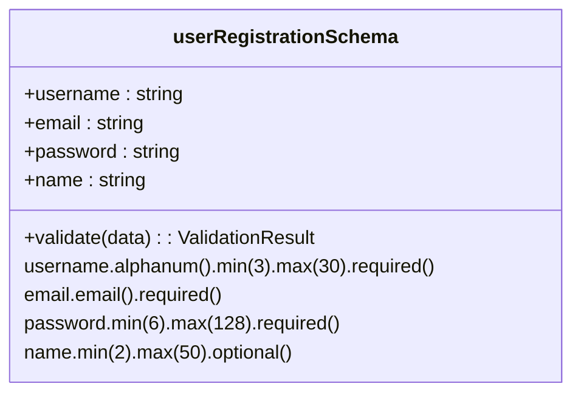

**图示来源**
- [validation.js](file://backend/src/middleware/validation.js#L27-L77)

**本节来源**
- [validation.js](file://backend/src/middleware/validation.js#L27-L77)

### 用户登录验证规则
`userLoginSchema`定义了用户登录时的基本验证规则，确保必要的认证信息完整。

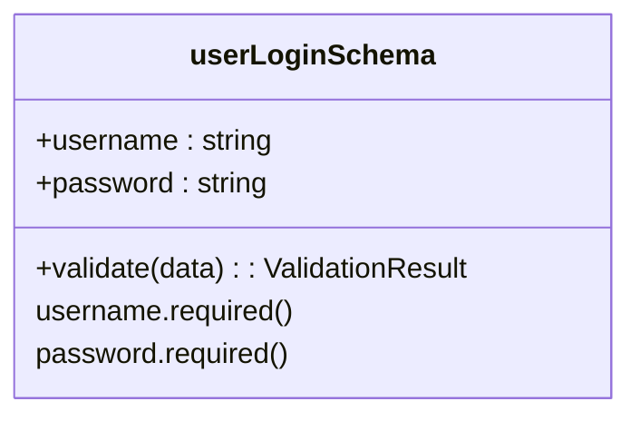

**图示来源**
- [validation.js](file://backend/src/middleware/validation.js#L79-L94)

**本节来源**
- [validation.js](file://backend/src/middleware/validation.js#L79-L94)

### 武器数据验证规则
`weaponSchema`定义了武器数据的完整验证规则，涵盖名称、类型、国家、年份等关键属性。

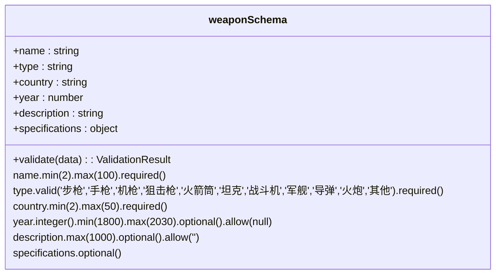

**图示来源**
- [validation.js](file://backend/src/middleware/validation.js#L96-L142)

**本节来源**
- [validation.js](file://backend/src/middleware/validation.js#L96-L142)

### 知识图谱查询验证规则
`knowledgeQuerySchema`定义了知识图谱查询的验证规则，确保查询请求的合法性和安全性。

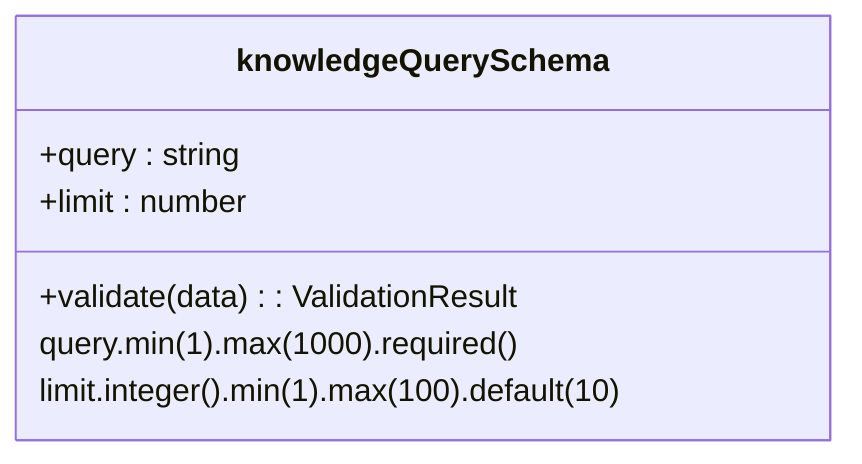

**图示来源**
- [validation.js](file://backend/src/middleware/validation.js#L144-L177)

**本节来源**
- [validation.js](file://backend/src/middleware/validation.js#L144-L177)

## 错误处理流程
当验证失败时，系统会执行完整的错误处理流程，包括错误信息的结构化输出和日志记录。

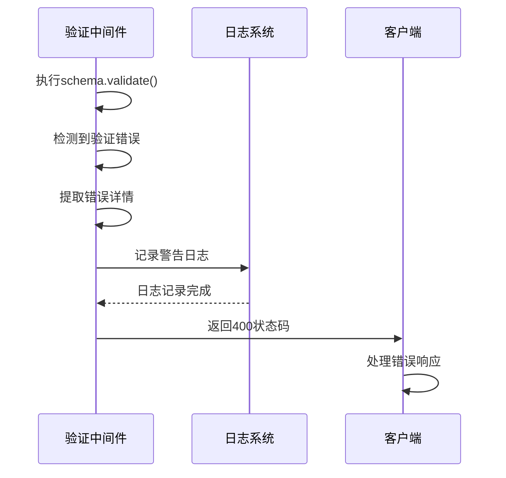

**图示来源**
- [validation.js](file://backend/src/middleware/validation.js#L10-L23)
- [logger.js](file://backend/src/utils/logger.js#L1-L47)

**本节来源**
- [validation.js](file://backend/src/middleware/validation.js#L10-L23)

## 路由中的实际应用
验证中间件在各个路由中被实际应用，通过串联验证规则来保护API接口。

### 认证路由中的应用
在用户认证路由中，验证中间件被用于注册和登录接口。

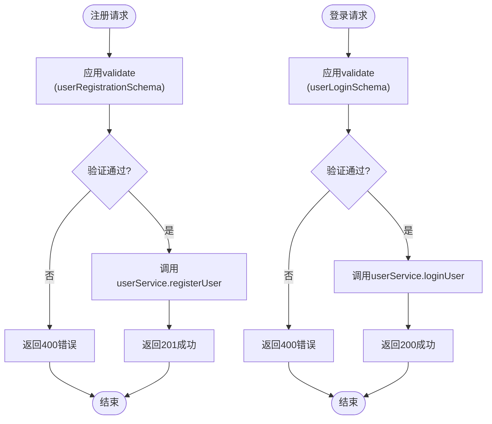

**图示来源**
- [auth.js](file://backend/src/routes/auth.js#L1-L144)
- [validation.js](file://backend/src/middleware/validation.js#L1-L177)

**本节来源**
- [auth.js](file://backend/src/routes/auth.js#L1-L144)

### 武器管理路由中的应用
在武器管理路由中，验证中间件用于创建和更新武器的接口。

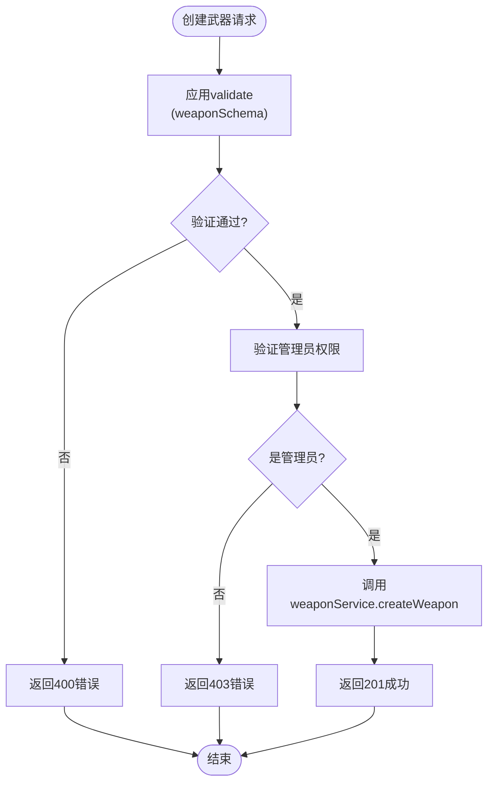

**图示来源**
- [weapons.js](file://backend/src/routes/weapons.js#L1-L218)
- [validation.js](file://backend/src/middleware/validation.js#L1-L177)

**本节来源**
- [weapons.js](file://backend/src/routes/weapons.js#L1-L218)

### 知识图谱查询路由中的应用
在知识图谱查询路由中，验证中间件用于保护查询接口。

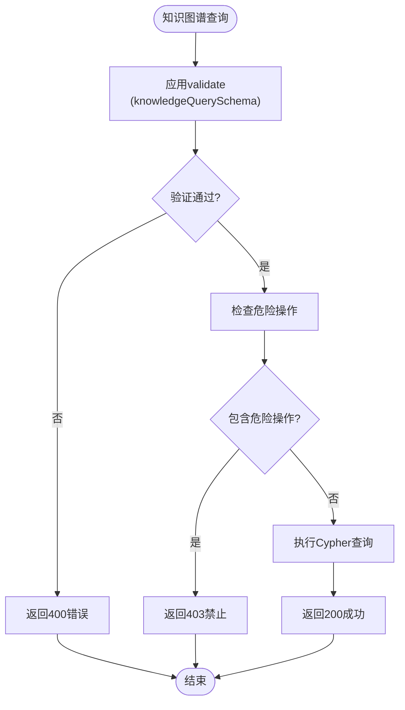

**图示来源**
- [knowledge.js](file://backend/src/routes/knowledge.js#L1-L182)
- [validation.js](file://backend/src/middleware/validation.js#L1-L177)

**本节来源**
- [knowledge.js](file://backend/src/routes/knowledge.js#L1-L182)

## 批量错误反馈优势
`abortEarly: false`配置带来了批量错误反馈的优势，允许系统一次性返回所有验证错误，而不是在遇到第一个错误时就停止验证。

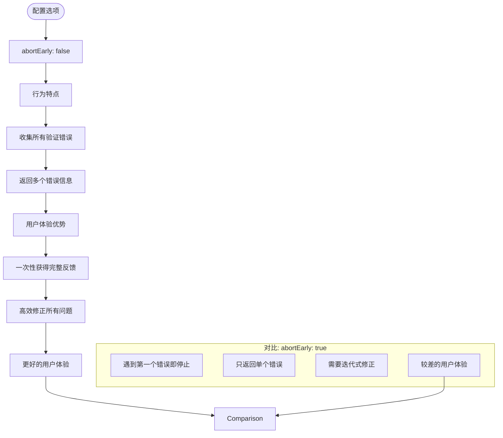

**图示来源**
- [validation.js](file://backend/src/middleware/validation.js#L7-L8)

**本节来源**
- [validation.js](file://backend/src/middleware/validation.js#L7-L8)

## 结论
该数据验证中间件系统通过Joi库实现了强大而灵活的数据校验功能。`validate`高阶函数的设计使得验证逻辑可以复用，预定义的验证规则覆盖了主要业务场景。系统不仅提供了详细的错误信息反馈，还通过日志记录增强了可维护性。在实际应用中，该中间件有效地保护了API接口，确保了数据的质量和系统的安全性。