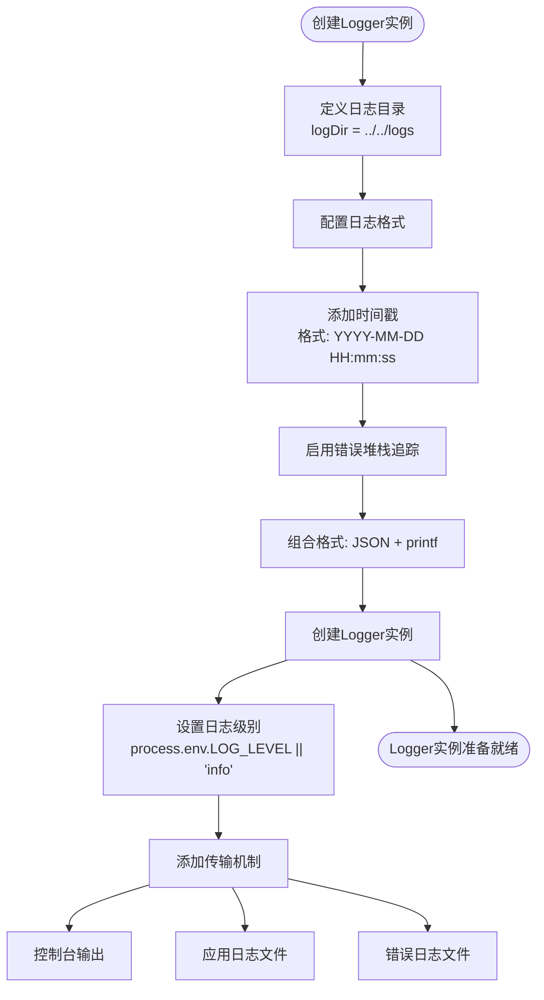
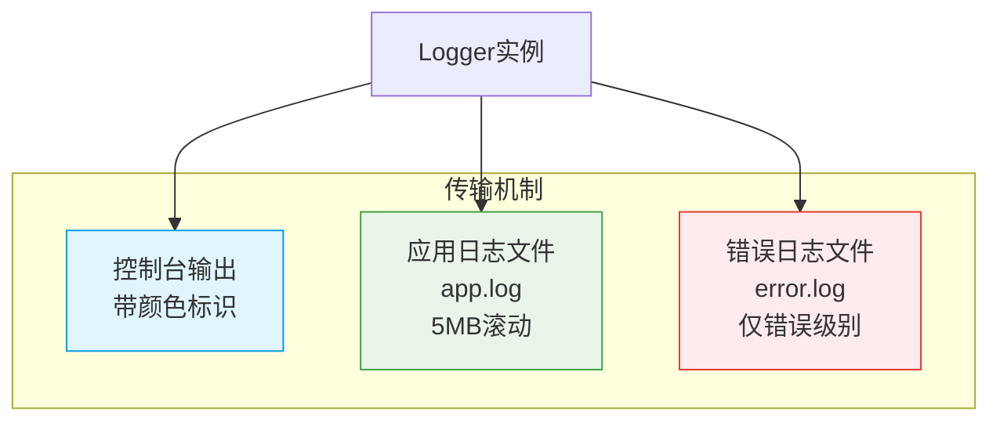
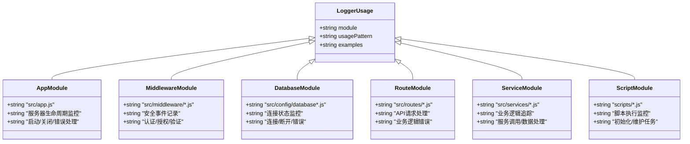
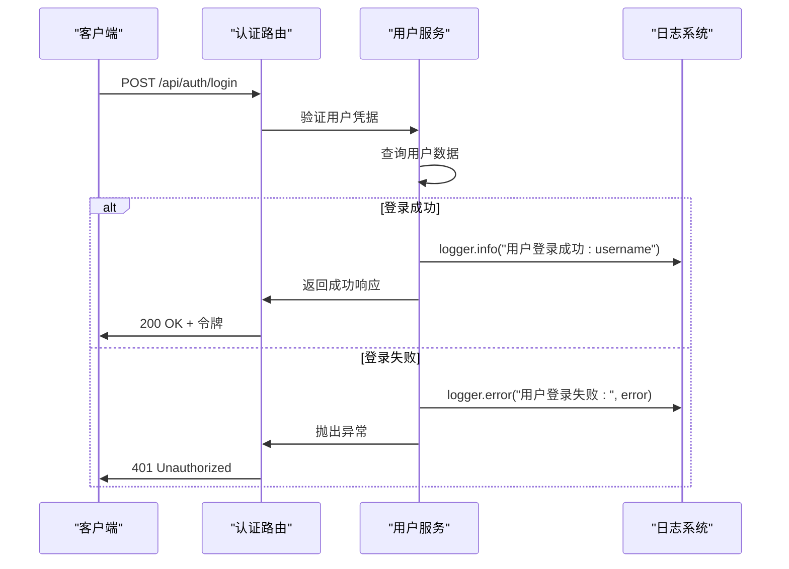

# 日志系统

<cite>
**本文档引用文件**   
- [logger.js](file://backend/src/utils/logger.js)
- [app.js](file://backend/src/app.js)
- [app-simple.js](file://backend/src/app-simple.js)
- [auth.js](file://backend/src/middleware/auth.js)
- [database_Neo4j.js](file://backend/src/config/database_Neo4j.js)
- [init-database.js](file://backend/scripts/init-database.js)
- [userService.js](file://backend/src/services/userService.js)
- [auth.js](file://backend/src/routes/auth.js)
- [CONFIG.md](file://backend/CONFIG.md)
</cite>

## 目录
1. [日志系统概述](#日志系统概述)
2. [Logger实例创建与配置](#logger实例创建与配置)
3. [传输机制](#传输机制)
4. [日志格式化器](#日志格式化器)
5. [模块使用模式](#模块使用模式)
6. [日志级别使用示例](#日志级别使用示例)
7. [配置管理](#配置管理)

## 日志系统概述

本系统采用Winston作为核心日志框架，为"兵智世界"后端服务提供全面的日志记录功能。该日志系统设计用于捕获应用程序运行时的关键事件、错误信息和调试数据，支持多环境部署和灵活的配置选项。系统通过统一的logger实例在各个模块间共享，确保日志格式和行为的一致性。

日志系统在应用程序的多个层面发挥作用，包括服务器启动、数据库连接、用户认证、API请求处理和后台脚本执行等。通过结构化的日志记录，开发团队能够有效监控系统健康状况、诊断问题并分析用户行为。

**Section sources**
- [logger.js](file://backend/src/utils/logger.js)
- [app.js](file://backend/src/app.js)

## Logger实例创建与配置

日志系统的核心是位于`src/utils/logger.js`中的logger实例，该实例通过Winston库创建并配置了多种日志记录特性。

logger实例的创建过程遵循以下步骤：
1. 引入Winston和Path模块
2. 定义日志存储目录（相对于当前文件位置的`../../logs`）
3. 配置复合日志格式
4. 创建logger实例并设置传输机制

关键配置参数包括：
- **日志级别**：由`LOG_LEVEL`环境变量控制，默认为`info`
- **时间戳格式**：采用`YYYY-MM-DD HH:mm:ss`格式
- **错误堆栈追踪**：启用错误对象的堆栈信息记录
- **日志输出格式**：结合JSON格式和可读性格式



**Diagram sources**
- [logger.js](file://backend/src/utils/logger.js#L1-L46)

**Section sources**
- [logger.js](file://backend/src/utils/logger.js#L1-L46)

## 传输机制

日志系统实现了三种不同的传输机制，确保日志信息能够以多种方式被记录和访问。

### 控制台输出

控制台传输器提供带颜色标识的日志输出，便于开发和调试时快速识别不同级别的日志信息。该传输器使用Winston的`colorize()`格式化器为不同日志级别分配颜色：
- **错误(error)**：红色
- **警告(warn)**：黄色
- **信息(info)**：蓝色
- **调试(debug)**：青色

控制台输出采用简化格式，突出显示关键信息，适合实时监控应用程序行为。

### 应用日志文件

应用日志文件传输器将所有级别的日志（从`error`到`debug`）记录到`app.log`文件中。此传输器具有以下特性：
- **文件滚动**：当文件大小达到5MB（5242880字节）时自动滚动
- **文件保留**：最多保留5个历史日志文件
- **路径**：存储在`logs/app.log`目录下

这种配置平衡了磁盘空间使用和历史日志保留需求，确保不会因日志文件过大而影响系统性能。

### 错误专用日志文件

错误专用日志文件传输器专门用于记录`error`级别的日志信息。其特性包括：
- **级别过滤**：仅记录`error`级别的日志
- **独立文件**：存储在`logs/error.log`中，与应用日志分离
- **相同滚动策略**：5MB大小限制，最多保留5个文件

这种分离式设计使得系统管理员能够专注于错误排查，而无需在大量信息性日志中筛选错误记录。



**Diagram sources**
- [logger.js](file://backend/src/utils/logger.js#L20-L40)

**Section sources**
- [logger.js](file://backend/src/utils/logger.js#L20-L40)

## 日志格式化器

日志系统采用复合格式化策略，结合多种格式化器以实现JSON格式与可读性格式的平衡。

### 格式化器组合

系统使用`winston.format.combine()`方法将多个格式化器组合在一起，执行顺序如下：

1. **时间戳格式化器**：添加格式化的`YYYY-MM-DD HH:mm:ss`时间戳
2. **错误格式化器**：启用`stack: true`选项，确保错误对象的堆栈追踪信息被包含
3. **JSON格式化器**：将日志数据转换为JSON格式，便于机器解析
4. **printf格式化器**：最终格式化输出，决定最终显示格式


### 输出格式

最终的日志输出格式为：
```
{timestamp} [{LEVEL}]: {message或stack}
```

例如：
```
2024-01-15 14:30:25 [ERROR]: 用户登录失败: Invalid credentials
```

这种设计既保留了JSON格式的结构化优势（便于日志分析工具处理），又通过printf格式化器确保了人类可读性。

**Section sources**
- [logger.js](file://backend/src/utils/logger.js#L7-L18)

## 模块使用模式

日志系统在项目各模块中采用统一的引入和使用模式，确保日志记录的一致性和可维护性。

### 统一引入模式

所有模块通过相对路径引入logger实例：
```javascript
const logger = require('../utils/logger');
```

这种模式在以下文件中广泛使用：
- `src/app.js` - 主应用程序入口
- `src/app-simple.js` - 简化版应用程序入口
- `src/middleware/auth.js` - 认证中间件
- `src/config/database_Neo4j.js` - 数据库配置
- `src/routes/*.js` - 各API路由模块
- `src/services/*.js` - 业务服务模块
- `scripts/*.js` - 后台脚本

### 使用场景分析

不同模块根据其功能特点使用logger记录不同类型的事件：

#### 应用程序入口
在`app.js`和`app-simple.js`中，logger用于记录服务器生命周期事件：
- 服务器启动和端口监听
- 数据库连接状态
- 优雅关闭过程
- 全局错误处理

#### 中间件模块
在`middleware/auth.js`中，logger用于记录安全相关事件：
- JWT验证成功/失败
- 简化管理员模式访问
- 权限检查结果

#### 数据库配置
在`database_Neo4j.js`中，logger用于记录数据库连接状态：
- 连接成功/失败
- 连接关闭
- 连接池管理

#### 后台脚本
在`scripts/init-database.js`中，logger用于记录脚本执行进度：
- 初始化步骤开始/完成
- 数据导入状态
- 错误处理



**Diagram sources**
- [app.js](file://backend/src/app.js#L10)
- [auth.js](file://backend/src/middleware/auth.js#L2)
- [database_Neo4j.js](file://backend/src/config/database_Neo4j.js#L3)
- [init-database.js](file://backend/scripts/init-database.js#L1)

**Section sources**
- [app.js](file://backend/src/app.js#L10)
- [auth.js](file://backend/src/middleware/auth.js#L2)
- [database_Neo4j.js](file://backend/src/config/database_Neo4j.js#L3)
- [init-database.js](file://backend/scripts/init-database.js#L1)

## 日志级别使用示例

系统根据不同业务场景使用适当的日志级别，确保日志信息的准确分类和有效利用。

### Info级别

`info`级别用于记录系统正常运行的关键事件，如：

**服务器启动**
```javascript
logger.info(`兵智世界后端服务启动成功`);
logger.info(`服务器运行在端口: ${port}`);
```

**用户操作**
```javascript
logger.info(`新用户注册成功: ${username}`);
logger.info(`用户登录成功: ${user.username}`);
```

**系统状态**
```javascript
logger.info('所有数据库连接初始化完成');
logger.info('示例数据创建完成');
```

### Warn级别

`warn`级别用于记录潜在问题或非关键性异常，如：

**安全相关**
```javascript
logger.warn('JWT验证失败:', err.message);
```

**数据一致性**
```javascript
// 当检测到可能的数据问题但不影响系统运行时
logger.warn('检测到重复的武器记录', { count: duplicateCount });
```

**性能警告**
```javascript
// 当操作耗时较长但仍在可接受范围内
logger.warn('数据库查询耗时较长', { duration: slowQueryTime, query: queryInfo });
```

### Error级别

`error`级别用于记录系统错误和异常情况，如：

**数据库错误**
```javascript
logger.error('Neo4j数据库连接失败:', error);
logger.error('MongoDB初始化失败:', error);
```

**业务逻辑错误**
```javascript
logger.error('用户注册失败:', error);
logger.error('登录接口错误:', error);
```

**系统级错误**
```javascript
logger.error('服务器启动失败:', error);
logger.error('优雅关闭过程中出错:', error);
```

### 实际业务场景

#### 用户登录流程



**Diagram sources**
- [auth.js](file://backend/src/routes/auth.js#L30-L38)
- [userService.js](file://backend/src/services/userService.js#L150-L175)

#### JWT验证失败

当JWT令牌验证失败时，系统记录警告日志：

```javascript
jwt.verify(token, config.jwt.secret, (err, user) => {
    if (err) {
        logger.warn('JWT验证失败:', err.message);
        return res.status(403).json({
            success: false,
            message: '访问令牌无效或已过期'
        });
    }
    // 验证成功处理
});
```

此模式确保了安全事件的可追溯性，同时避免将敏感信息记录为错误级别。

**Section sources**
- [auth.js](file://backend/src/middleware/auth.js#L15-L25)
- [userService.js](file://backend/src/services/userService.js#L150-L175)

## 配置管理

日志系统的配置通过环境变量和配置文件进行管理，支持不同环境下的灵活调整。

### 环境变量控制

主要通过`LOG_LEVEL`环境变量控制日志记录级别，支持以下值：
- `error`：仅记录错误
- `warn`：记录警告和错误
- `info`：记录信息、警告和错误（推荐）
- `debug`：记录所有信息（开发调试用）

### 配置文件

在`backend/CONFIG.md`文件中提供了详细的配置说明，包括生产环境配置建议：

```bash
# 生产环境配置示例
LOG_LEVEL=warn
```

这种配置策略确保了开发环境可以获得详细的调试信息，而生产环境则保持日志输出的简洁性，避免过多的日志影响系统性能和存储空间。

**Section sources**
- [CONFIG.md](file://backend/CONFIG.md#L50-L65)
- [logger.js](file://backend/src/utils/logger.js#L25)