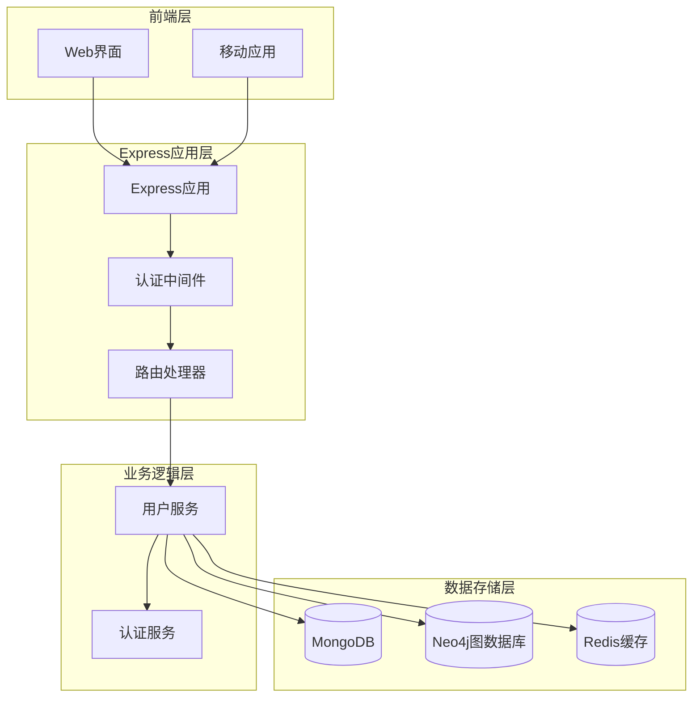
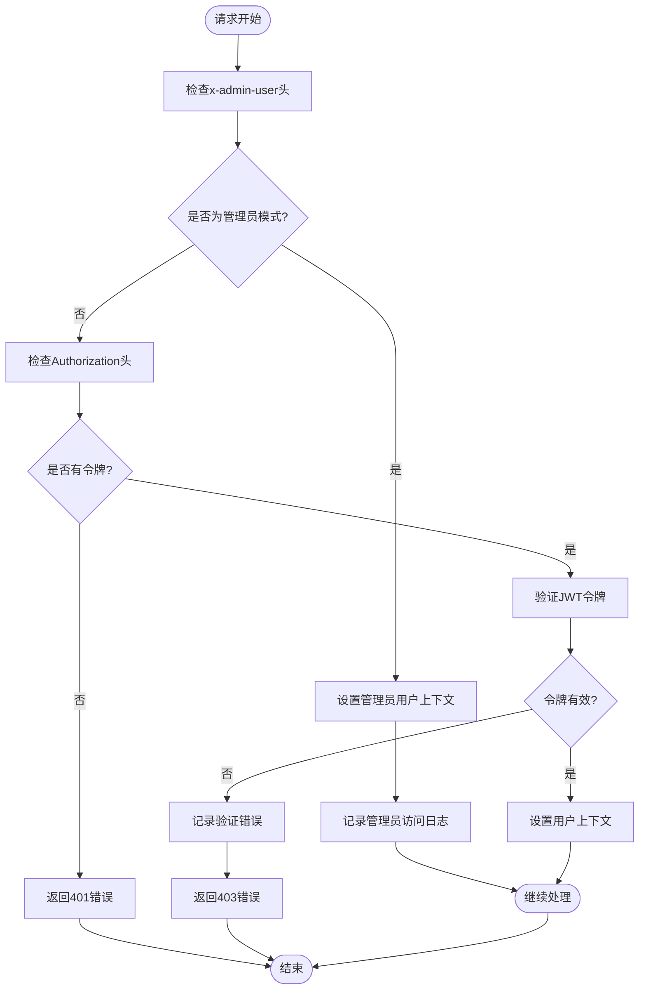
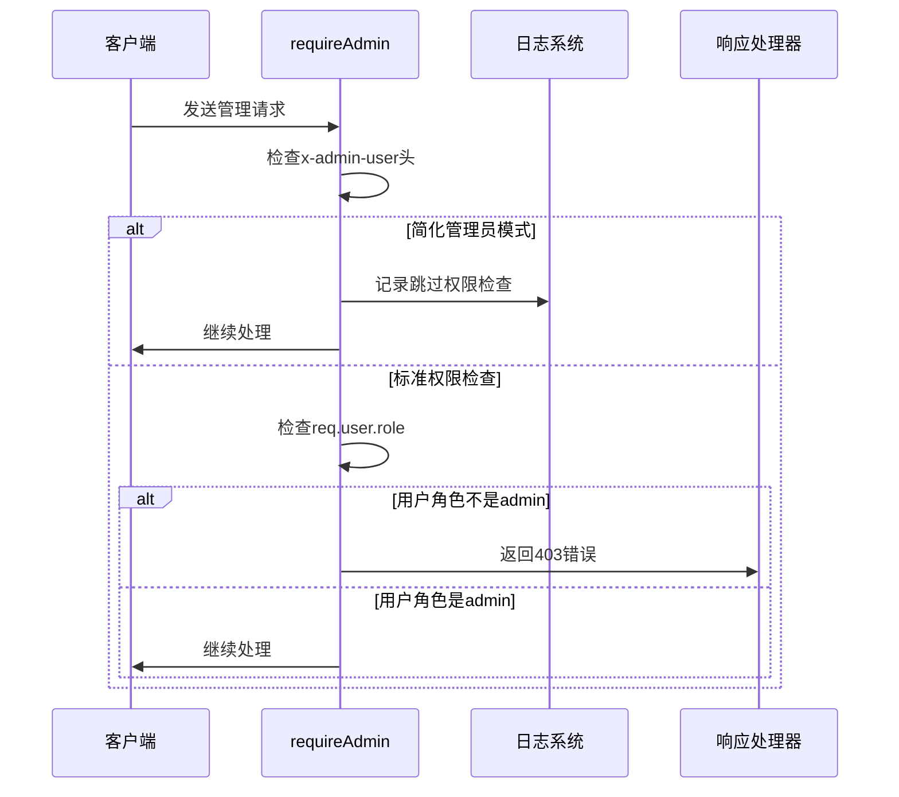
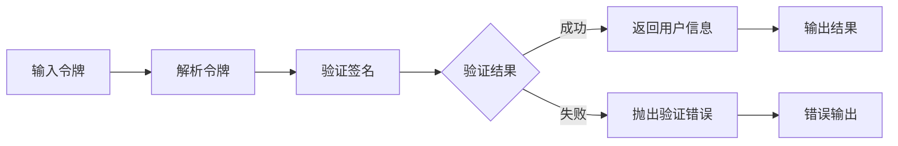
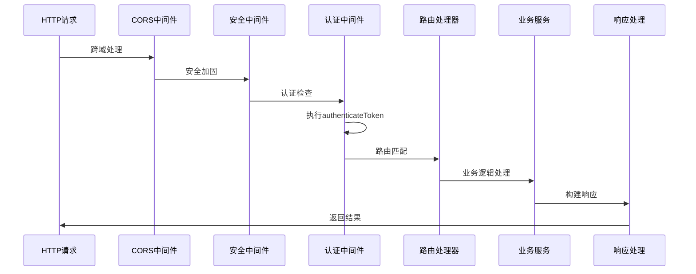
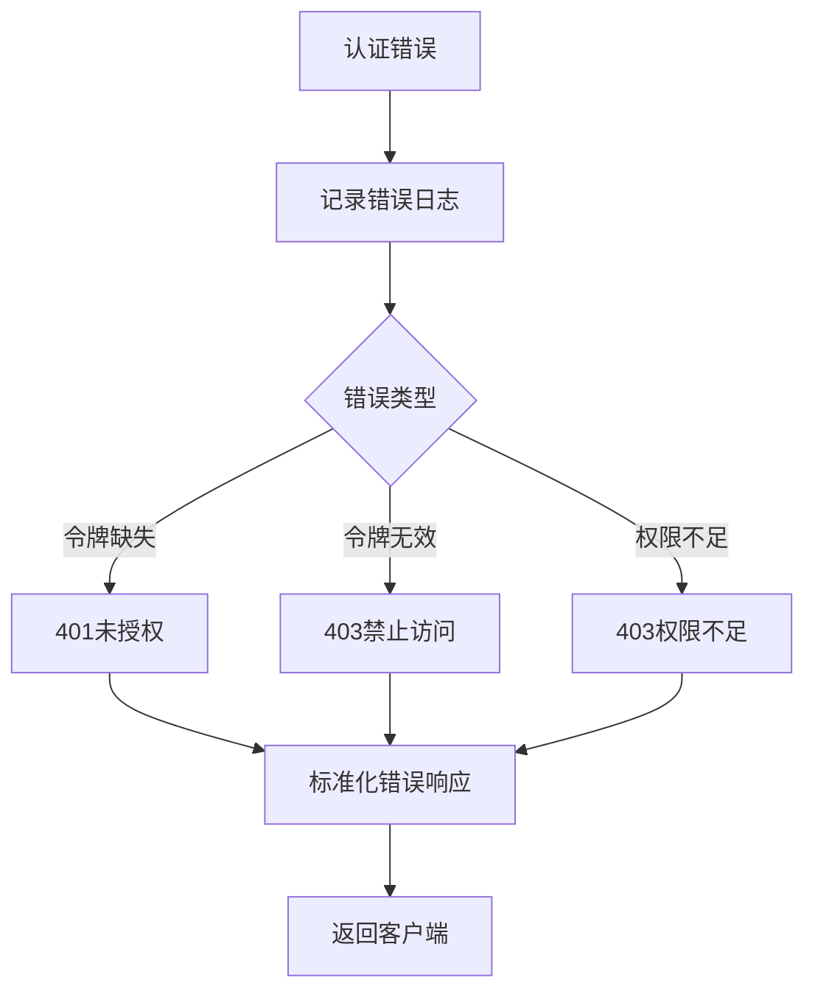
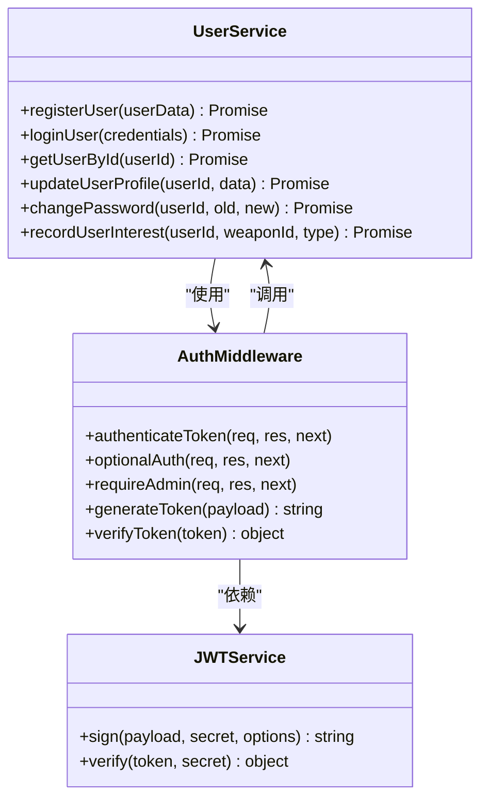

# JWT认证中间件详细文档

<cite>
**本文档引用的文件**
- [auth.js](file://backend/src/middleware/auth.js)
- [auth.js](file://backend/src/routes/auth.js)
- [userService.js](file://backend/src/services/userService.js)
- [index.js](file://backend/src/config/index.js)
- [app.js](file://backend/src/app.js)
</cite>

## 目录
1. [简介](#简介)
2. [项目架构概览](#项目架构概览)
3. [核心认证中间件组件](#核心认证中间件组件)
4. [JWT令牌生成与验证机制](#jwt令牌生成与验证机制)
5. [简化管理员模式实现](#简化管理员模式实现)
6. [可选认证中间件](#可选认证中间件)
7. [Express请求处理流程](#express请求处理流程)
8. [错误处理策略](#错误处理策略)
9. [与用户服务的集成](#与用户服务的集成)
10. [最佳实践与安全考虑](#最佳实践与安全考虑)

## 简介

本文档详细介绍了兵智世界项目中JWT认证中间件的完整实现机制。该认证系统采用现代化的JWT（JSON Web Token）技术，结合Express框架，为军事知识管理系统提供安全可靠的用户身份验证和授权功能。

认证中间件系统包含以下核心特性：
- 基于Bearer Token的JWT认证机制
- 简化管理员开发模式（x-admin-user头）
- 可选登录场景支持（optionalAuth中间件）
- 完整的错误处理和响应格式标准化
- 与用户服务的无缝集成

## 项目架构概览

**图表来源**
- [app.js](file://backend/src/app.js#L1-L50)
- [auth.js](file://backend/src/middleware/auth.js#L1-L20)

**章节来源**
- [app.js](file://backend/src/app.js#L1-L248)
- [auth.js](file://backend/src/middleware/auth.js#L1-L106)

## 核心认证中间件组件

### authenticateToken中间件

authenticateToken是系统的主要认证中间件，负责验证客户端提供的JWT令牌并设置用户上下文。

**图表来源**
- [auth.js](file://backend/src/middleware/auth.js#L6-L48)

#### 主要功能特性

1. **双重认证模式支持**
   - 标准JWT认证模式
   - 开发环境简化管理员模式

2. **令牌解析机制**
   - 支持标准Bearer Token格式
   - 自动提取Authorization头中的令牌

3. **用户上下文注入**
   - 将验证后的用户信息注入到req.user
   - 供后续中间件和路由处理器使用

**章节来源**
- [auth.js](file://backend/src/middleware/auth.js#L6-L48)

### requireAdmin中间件

管理员权限检查中间件，确保只有具有管理员角色的用户才能访问受保护的管理功能。

**图表来源**
- [auth.js](file://backend/src/middleware/auth.js#L58-L75)

**章节来源**
- [auth.js](file://backend/src/middleware/auth.js#L58-L75)

## JWT令牌生成与验证机制

### generateToken工具函数

generateToken函数负责创建新的JWT令牌，包含用户身份信息和过期时间。

#### 实现特点

1. **标准化令牌结构**
   - 包含userId、username、role等关键信息
   - 使用配置文件中的密钥进行签名
   - 支持自定义过期时间

2. **安全性保障**
   - 使用强加密算法（默认HS256）
   - 密钥存储在环境变量中
   - 支持多种过期时间配置

**章节来源**
- [auth.js](file://backend/src/middleware/auth.js#L80-L85)

### verifyToken工具函数

verifyToken函数提供独立的令牌验证功能，不依赖Express中间件上下文。

#### 验证流程

**图表来源**
- [auth.js](file://backend/src/middleware/auth.js#L87-L93)

**章节来源**
- [auth.js](file://backend/src/middleware/auth.js#L87-L93)

## 简化管理员模式实现

### x-admin-user头机制

简化管理员模式是开发环境的重要功能，允许开发者绕过复杂的认证流程直接获得管理员权限。

#### 工作原理

1. **头部检测**
   - 中间件检查请求头中的`x-admin-user`字段
   - 当值为`true`时激活简化模式

2. **虚拟用户上下文**
   - 自动创建管理员用户对象
   - 固定用户ID: 1
   - 固定用户名: 'admin'
   - 固定角色: 'admin'

3. **日志记录**
   - 记录简化模式的使用情况
   - 便于开发调试和问题追踪

#### 应用场景

- 开发环境快速测试
- 管理员功能开发
- 权限验证测试
- 快速原型开发

**章节来源**
- [auth.js](file://backend/src/middleware/auth.js#L6-L15)

## 可选认证中间件

### optionalAuth中间件设计

optionalAuth中间件专门处理可选登录的场景，允许未登录用户访问部分内容，但会根据认证状态提供不同的功能级别。

#### 功能特性

1. **无状态处理**
   - 不强制要求认证令牌
   - 未认证时设置req.user为null

2. **智能认证检测**
   - 检测并尝试验证提供的令牌
   - 验证失败时保持无认证状态

3. **渐进式功能**
   - 已认证用户：完整功能访问
   - 未认证用户：受限功能访问
   - 认证失败：降级功能访问

#### 使用场景

- 公开内容浏览
- 部分功能预览
- 用户体验优化
- 渐进式功能解锁

**章节来源**
- [auth.js](file://backend/src/middleware/auth.js#L50-L57)

## Express请求处理流程

### 中间件执行顺序

**图表来源**
- [app.js](file://backend/src/app.js#L35-L85)
- [auth.js](file://backend/src/middleware/auth.js#L6-L48)

### 路由集成示例

认证中间件在路由中的典型使用方式：

| 路由类型 | 认证需求 | 中间件使用 | 功能描述 |
|---------|---------|-----------|----------|
| 用户注册 | 无需认证 | 无 | 公开注册接口 |
| 用户登录 | 无需认证 | 无 | 公开登录接口 |
| 用户资料 | 必须认证 | authenticateToken | 个人资料管理 |
| 密码修改 | 必须认证 | authenticateToken | 密码安全更新 |
| 令牌刷新 | 必须认证 | authenticateToken | 令牌续期 |
| 管理功能 | 管理员权限 | authenticateToken + requireAdmin | 系统管理操作 |

**章节来源**
- [auth.js](file://backend/src/routes/auth.js#L1-L144)

## 错误处理策略

### 标准化错误响应格式

系统采用统一的成功/失败响应格式，确保客户端能够正确处理各种认证场景。

#### 错误类型与响应

| 错误类型 | HTTP状态码 | 响应格式 | 处理方式 |
|---------|-----------|---------|----------|
| 令牌缺失 | 401 | `{success: false, message: '访问令牌缺失'}` | 引导用户登录 |
| 令牌无效 | 403 | `{success: false, message: '访问令牌无效或已过期'}` | 重新认证 |
| 权限不足 | 403 | `{success: false, message: '需要管理员权限'}` | 显示权限错误 |
| 简化模式错误 | 403 | `{success: false, message: '访问被拒绝'}` | 检查请求头 |

#### 错误处理流程

**图表来源**
- [auth.js](file://backend/src/middleware/auth.js#L25-L45)

**章节来源**
- [auth.js](file://backend/src/middleware/auth.js#L25-L45)

## 与用户服务的集成

### 认证流程集成

认证中间件与用户服务紧密集成，形成完整的用户身份验证生态系统。

**图表来源**
- [userService.js](file://backend/src/services/userService.js#L1-L50)
- [auth.js](file://backend/src/middleware/auth.js#L1-L10)

### 令牌生成集成

用户服务在注册和登录时自动调用认证中间件的令牌生成功能：

1. **注册流程**
   - 用户数据验证
   - 密码加密存储
   - JWT令牌生成
   - 用户上下文创建

2. **登录流程**
   - 凭据验证
   - 用户状态检查
   - 新令牌生成
   - 登录时间更新

**章节来源**
- [userService.js](file://backend/src/services/userService.js#L25-L100)
- [userService.js](file://backend/src/services/userService.js#L110-L180)

## 最佳实践与安全考虑

### 安全配置建议

1. **JWT密钥管理**
   - 使用强随机密钥
   - 定期轮换密钥
   - 环境变量存储
   - 权限最小化原则

2. **令牌过期策略**
   - 合理设置过期时间
   - 支持令牌刷新
   - 实施黑名单机制（可选）

3. **传输安全**
   - HTTPS强制使用
   - Secure Cookie标志
   - CSRF防护措施

### 性能优化建议

1. **缓存策略**
   - 用户信息缓存
   - 权限检查缓存
   - 令牌验证结果缓存

2. **并发处理**
   - 异步验证机制
   - 连接池管理
   - 资源释放及时性

### 监控与审计

1. **日志记录**
   - 认证事件记录
   - 错误详情追踪
   - 性能指标监控

2. **安全审计**
   - 异常访问检测
   - 权限提升监控
   - 安全事件告警

**章节来源**
- [index.js](file://backend/src/config/index.js#L10-L15)
- [app.js](file://backend/src/app.js#L180-L220)

## 结论

兵智世界的JWT认证中间件系统提供了一个完整、安全、高效的用户身份验证解决方案。通过模块化设计、标准化接口和完善的错误处理机制，该系统能够满足现代Web应用的安全需求，同时为开发者提供便捷的开发体验。

系统的主要优势包括：
- 灵活的认证模式支持
- 完善的错误处理机制
- 与业务逻辑的深度集成
- 开发友好的简化模式
- 标准化的响应格式

通过持续的监控和优化，该认证系统能够为兵智世界项目提供稳定可靠的身份验证服务，保障系统的安全性和可用性。