# 后端架构文档

<cite>
**本文档引用的文件**
- [app.js](file://backend/src/app.js)
- [weapons.js](file://backend/src/routes/weapons.js)
- [weaponService.js](file://backend/src/services/weaponService.js)
- [auth.js](file://backend/src/middleware/auth.js)
- [logger.js](file://backend/src/utils/logger.js)
- [auth.js](file://backend/src/routes/auth.js)
- [index.js](file://backend/src/config/index.js)
- [database_Neo4j.js](file://backend/src/config/database_Neo4j.js)
- [validation.js](file://backend/src/middleware/validation.js)
- [userService.js](file://backend/src/services/userService.js)
- [knowledge.js](file://backend/src/routes/knowledge.js)
- [knowledgeGraphService.js](file://backend/src/services/knowledgeGraphService.js)
- [package.json](file://backend/package.json)
</cite>

## 目录
1. [项目概述](#项目概述)
2. [系统架构](#系统架构)
3. [核心组件分析](#核心组件分析)
4. [MVC模式实现](#mvc模式实现)
5. [认证与授权机制](#认证与授权机制)
6. [数据库连接管理](#数据库连接管理)
7. [中间件系统](#中间件系统)
8. [错误处理与日志记录](#错误处理与日志记录)
9. [API路由设计](#api路由设计)
10. [性能优化策略](#性能优化策略)
11. [总结](#总结)

## 项目概述

兵智世界后端系统是一个基于Express.js构建的现代化Web应用，采用MVC架构模式，提供军事知识图谱与武器识别相关的API服务。系统支持多种数据库技术，包括Neo4j图数据库、MongoDB文档数据库和Redis缓存，为复杂的军事知识管理提供了强大的数据支撑。

### 技术栈概览

- **框架**: Express.js 4.x
- **数据库**: Neo4j (图数据库) + MongoDB (文档数据库) + Redis (缓存)
- **认证**: JWT + x-admin-user简化模式
- **验证**: Joi数据验证
- **日志**: Winston日志系统
- **部署**: Node.js环境

**章节来源**
- [package.json](file://backend/package.json#L1-L44)
- [app.js](file://backend/src/app.js#L1-L20)

## 系统架构

兵智世界后端系统采用分层架构设计，遵循MVC模式，确保代码的可维护性和扩展性。

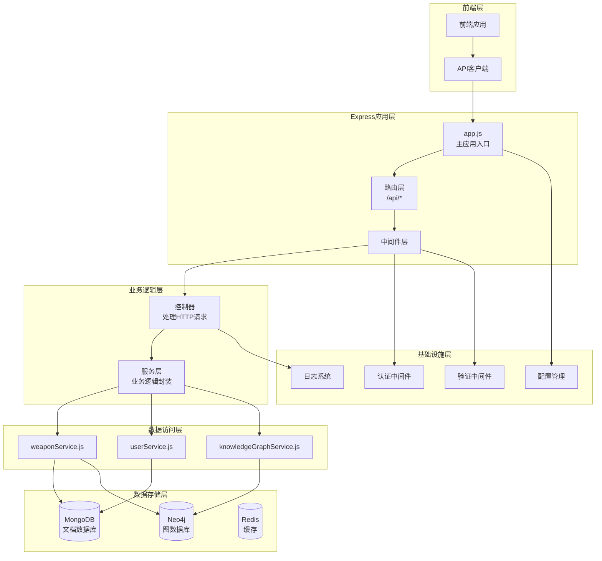

**图表来源**
- [app.js](file://backend/src/app.js#L1-L50)
- [weapons.js](file://backend/src/routes/weapons.js#L1-L20)
- [weaponService.js](file://backend/src/services/weaponService.js#L1-L30)

## 核心组件分析

### 应用主入口 (app.js)

应用主入口负责整个Express应用的初始化和配置，采用类式架构设计，确保模块化和可测试性。

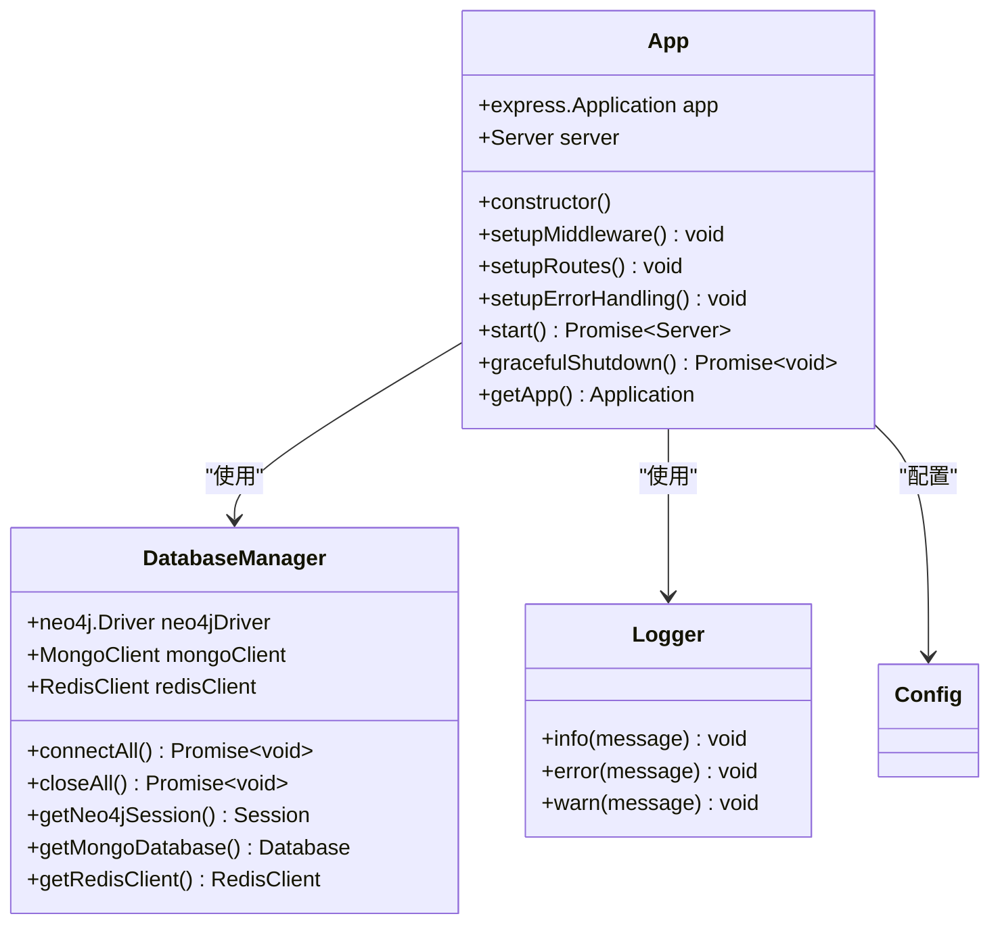

**图表来源**
- [app.js](file://backend/src/app.js#L15-L40)
- [database_Neo4j.js](file://backend/src/config/database_Neo4j.js#L10-L30)
- [logger.js](file://backend/src/utils/logger.js#L1-L20)

### 路由层设计

路由层采用模块化设计，每个功能模块对应独立的路由文件，支持RESTful API规范。

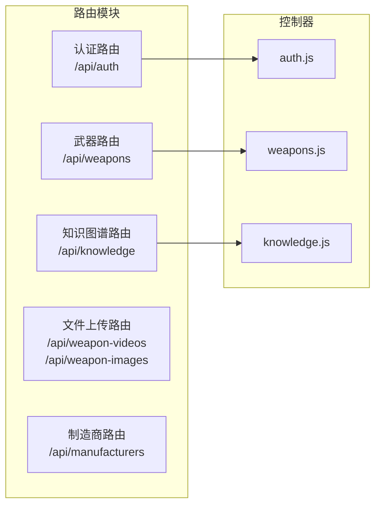

**图表来源**
- [app.js](file://backend/src/app.js#L100-L130)
- [auth.js](file://backend/src/routes/auth.js#L1-L20)
- [weapons.js](file://backend/src/routes/weapons.js#L1-L30)

**章节来源**
- [app.js](file://backend/src/app.js#L1-L248)
- [weapons.js](file://backend/src/routes/weapons.js#L1-L218)

## MVC模式实现

### 模型层 (Models)

系统采用混合数据模型，根据数据特性和查询需求选择合适的数据库：

- **MongoDB**: 存储武器详细信息、用户资料、媒体文件元数据
- **Neo4j**: 存储武器关系网络、知识图谱结构
- **Redis**: 缓存热点数据、会话信息

### 视图层 (Views)

虽然这是一个纯API后端，但视图概念体现在响应格式标准化：
- 统一的成功响应格式 `{success: true, data: {...}}`
- 统一的错误响应格式 `{success: false, message: "..."}`
- 分页数据结构 `{data: {...}, pagination: {...}}`

### 控制器层 (Controllers)

控制器负责处理HTTP请求，协调服务层和中间件：

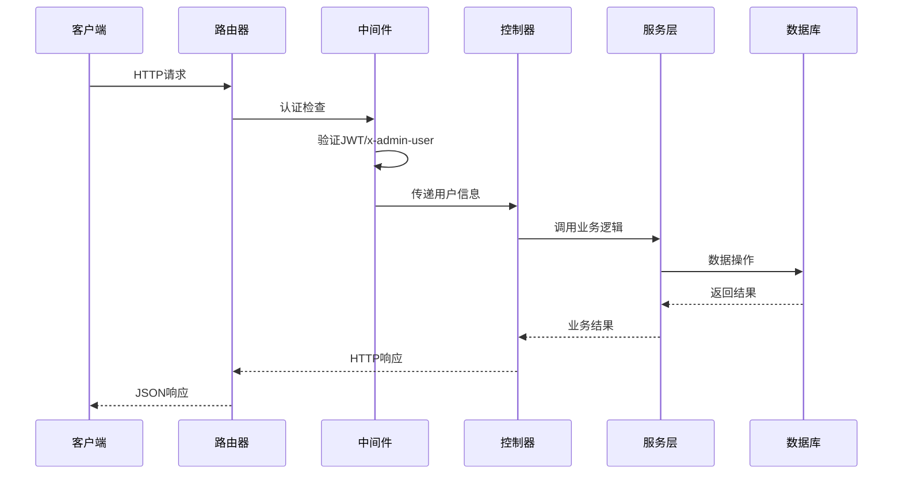

**图表来源**
- [weapons.js](file://backend/src/routes/weapons.js#L10-L50)
- [auth.js](file://backend/src/middleware/auth.js#L1-L50)

### 服务层 (Services)

服务层封装业务逻辑，提供事务性和数据转换能力：

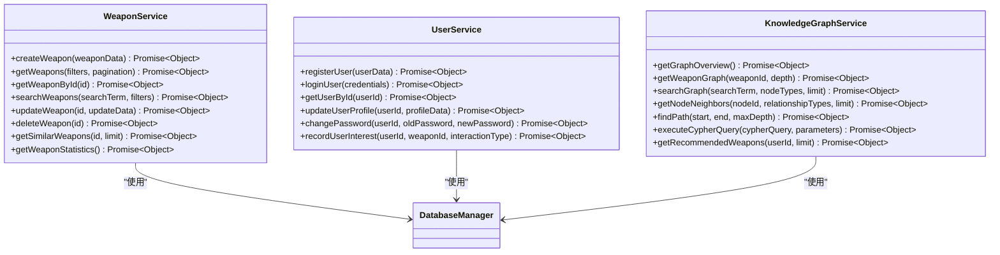

**图表来源**
- [weaponService.js](file://backend/src/services/weaponService.js#L5-L50)
- [userService.js](file://backend/src/services/userService.js#L5-L50)
- [knowledgeGraphService.js](file://backend/src/services/knowledgeGraphService.js#L5-L50)

**章节来源**
- [weaponService.js](file://backend/src/services/weaponService.js#L1-L486)
- [userService.js](file://backend/src/services/userService.js#L1-L318)
- [knowledgeGraphService.js](file://backend/src/services/knowledgeGraphService.js#L1-L253)

## 认证与授权机制

系统实现了双重认证机制，支持JWT标准认证和简化管理员模式。

### JWT认证流程

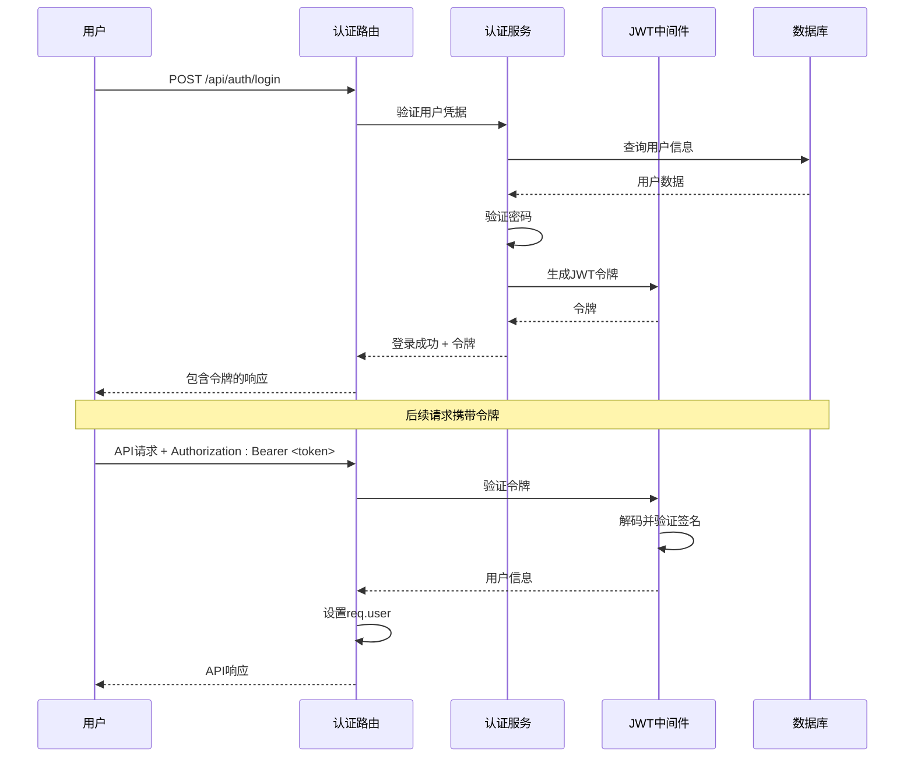

**图表来源**
- [auth.js](file://backend/src/routes/auth.js#L10-L30)
- [auth.js](file://backend/src/middleware/auth.js#L10-L50)

### x-admin-user简化模式

为了开发和测试便利，系统提供了简化管理员模式：

| 特性 | JWT模式 | x-admin-user模式 |
|------|---------|------------------|
| 认证方式 | JWT令牌 | HTTP头 `x-admin-user: true` |
| 用户信息 | 从令牌解析 | 固定管理员用户 |
| 权限检查 | 基于角色 | 跳过权限检查 |
| 使用场景 | 生产环境 | 开发/测试环境 |

### 权限中间件设计

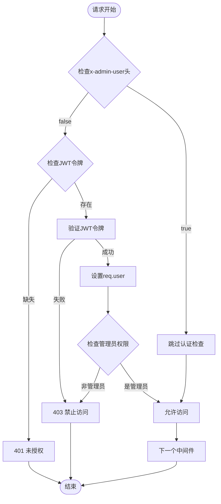

**图表来源**
- [auth.js](file://backend/src/middleware/auth.js#L1-L106)

**章节来源**
- [auth.js](file://backend/src/middleware/auth.js#L1-L106)
- [auth.js](file://backend/src/routes/auth.js#L1-L144)

## 数据库连接管理

系统采用多数据库架构，通过统一的数据库管理器协调不同数据库的连接和操作。

### 数据库架构

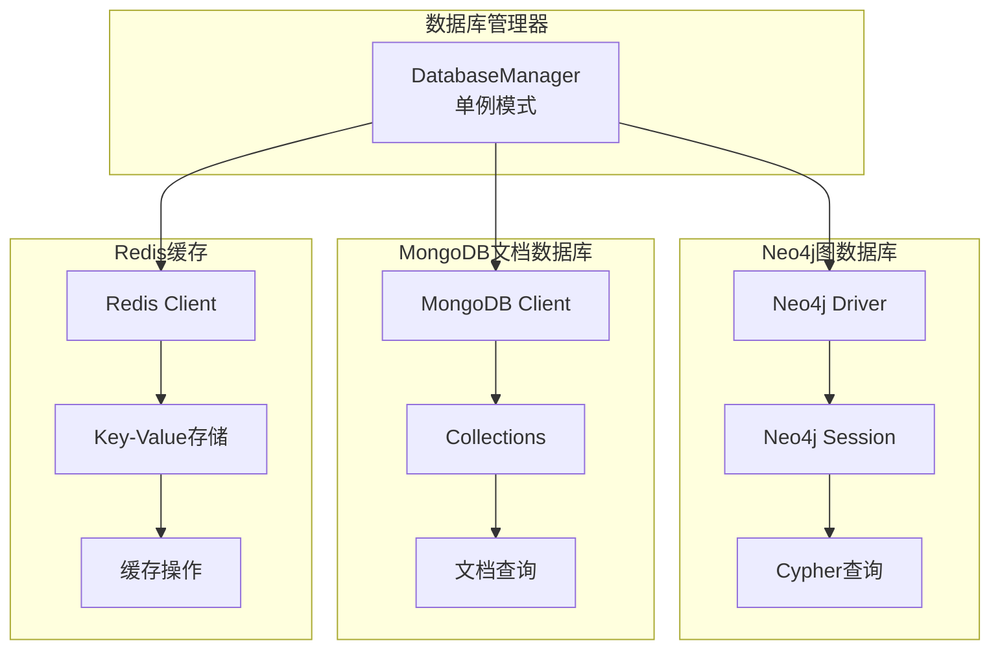

**图表来源**
- [database_Neo4j.js](file://backend/src/config/database_Neo4j.js#L10-L50)

### 连接池管理

数据库管理器负责：
- **连接初始化**: 并行初始化所有数据库连接
- **会话管理**: 为Neo4j提供会话生命周期管理
- **资源清理**: 优雅关闭所有连接
- **错误处理**: 统一的连接错误处理

### 数据一致性保证

对于涉及多个数据库的操作，系统采用以下策略：
1. **事务边界**: 在单一数据库内保证ACID特性
2. **补偿机制**: 对跨数据库操作实施补偿逻辑
3. **最终一致性**: 对于无法保证强一致性的场景，采用最终一致性模型

**章节来源**
- [database_Neo4j.js](file://backend/src/config/database_Neo4j.js#L1-L141)
- [index.js](file://backend/src/config/index.js#L1-L73)

## 中间件系统

中间件系统提供了横切关注点的统一处理，包括认证、验证、错误处理等功能。

### 中间件架构

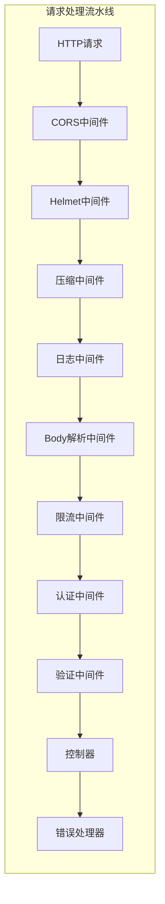

**图表来源**
- [app.js](file://backend/src/app.js#L40-L90)

### 验证中间件

系统使用Joi进行数据验证，提供声明式的验证规则：

| 验证类型 | 场景 | 主要字段验证 |
|----------|------|-------------|
| 用户注册 | `/api/auth/register` | username, email, password, name |
| 用户登录 | `/api/auth/login` | username, password |
| 武器创建/更新 | `/api/weapons/*` | name, type, country, year, description |
| 知识图谱查询 | `/api/knowledge/query` | query, parameters |

### 安全中间件

系统实现了多层次的安全防护：

1. **CORS配置**: 支持跨域资源共享
2. **Helmet**: HTTP头部安全增强
3. **压缩**: Gzip压缩减少传输体积
4. **限流**: 防止API滥用
5. **静态文件保护**: 安全的文件上传目录

**章节来源**
- [validation.js](file://backend/src/middleware/validation.js#L1-L178)
- [app.js](file://backend/src/app.js#L40-L90)

## 错误处理与日志记录

系统实现了完善的错误处理和日志记录机制，确保系统的可观测性和可维护性。

### 错误处理层次

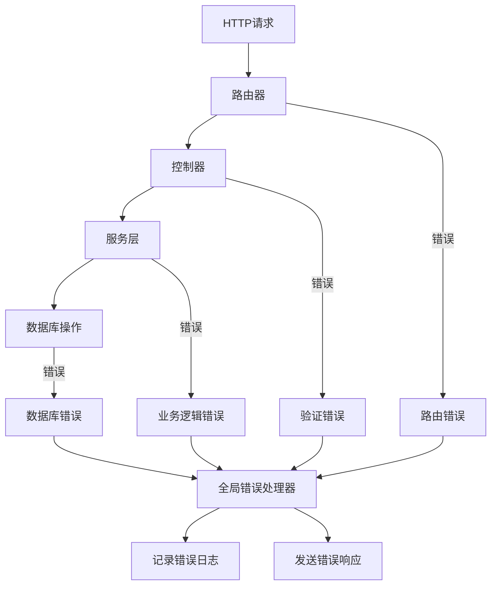

**图表来源**
- [app.js](file://backend/src/app.js#L130-L180)

### 日志系统设计

系统采用Winston日志库，提供结构化日志记录：

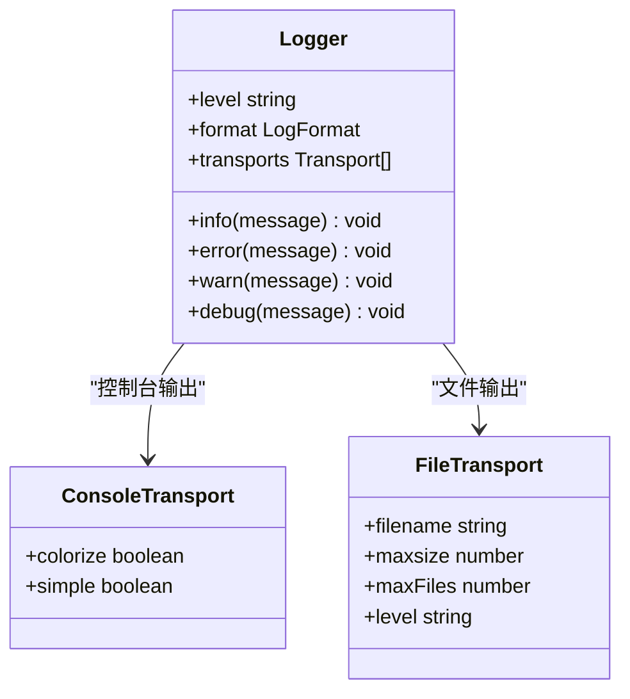

**图表来源**
- [logger.js](file://backend/src/utils/logger.js#L15-L45)

### 日志级别与格式

| 级别 | 用途 | 示例场景 |
|------|------|----------|
| ERROR | 错误信息 | 数据库连接失败、业务逻辑异常 |
| WARN | 警告信息 | JWT验证失败、数据验证失败 |
| INFO | 一般信息 | 服务启动、API调用成功 |
| DEBUG | 调试信息 | 详细的请求处理过程 |

### 异常监控

系统实现了多层次的异常监控：
- **未捕获异常**: 监控未处理的同步异常
- **Promise拒绝**: 监控未处理的异步异常
- **优雅关闭**: 处理服务器关闭信号

**章节来源**
- [logger.js](file://backend/src/utils/logger.js#L1-L47)
- [app.js](file://backend/src/app.js#L180-L220)

## API路由设计

系统采用RESTful API设计原则，提供清晰的资源层次结构。

### 核心API端点

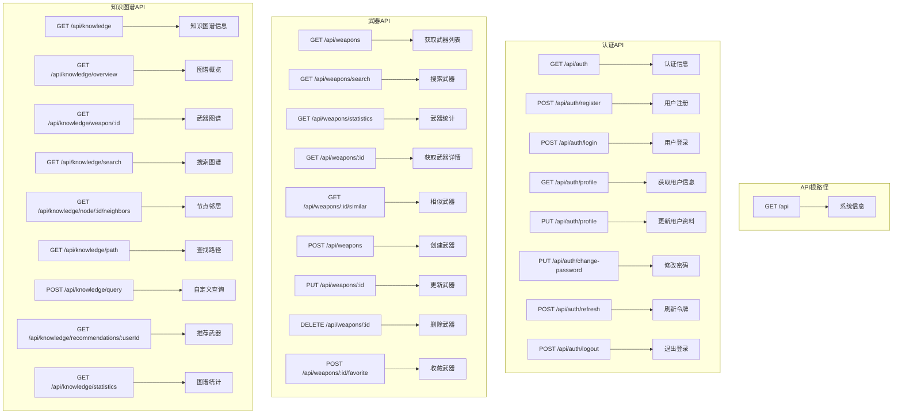

**图表来源**
- [app.js](file://backend/src/app.js#L100-L130)
- [auth.js](file://backend/src/routes/auth.js#L1-L144)
- [weapons.js](file://backend/src/routes/weapons.js#L1-L218)
- [knowledge.js](file://backend/src/routes/knowledge.js#L1-L182)

### API响应格式

所有API响应都遵循统一的格式规范：

| 字段 | 类型 | 说明 |
|------|------|------|
| success | boolean | 操作是否成功 |
| message | string | 人类可读的消息 |
| data | object/array | 实际响应数据 |
| errors | array | 验证错误详情（仅验证失败时） |
| pagination | object | 分页信息（仅分页查询时） |

### 健康检查端点

系统提供健康检查端点 `/health`，用于监控服务状态：

```json
{
  "success": true,
  "message": "服务运行正常",
  "timestamp": "2024-01-01T00:00:00.000Z",
  "uptime": 3600
}
```

**章节来源**
- [app.js](file://backend/src/app.js#L100-L130)
- [auth.js](file://backend/src/routes/auth.js#L1-L144)
- [weapons.js](file://backend/src/routes/weapons.js#L1-L218)
- [knowledge.js](file://backend/src/routes/knowledge.js#L1-L182)

## 性能优化策略

### 缓存策略

系统采用多层缓存策略提升性能：

1. **Redis缓存**: 热点数据缓存
2. **数据库连接池**: 减少连接开销
3. **文件上传缓存**: 静态资源优化

### 限流机制

系统实现了智能限流，防止API滥用：

| 参数 | 默认值 | 说明 |
|------|--------|------|
| 时间窗口 | 15分钟 | 在此时间内计算请求数量 |
| 最大请求数 | 1000 | 超出此数量将被限流 |
| 响应格式 | 自定义 | 包含限流相关信息 |

### 数据库优化

1. **索引策略**: 在Neo4j中为常用查询创建索引
2. **查询优化**: 使用参数化查询避免SQL注入
3. **连接复用**: 数据库连接池管理
4. **读写分离**: 根据查询特点选择合适的数据源

### 文件处理优化

- **文件大小限制**: 10MB限制防止过大文件
- **MIME类型检查**: 验证上传文件类型
- **安全存储**: 文件存储在受保护的目录

## 总结

兵智世界后端系统展现了现代Web应用的最佳实践，通过以下关键特性实现了高质量的架构设计：

### 架构优势

1. **模块化设计**: 清晰的分层架构，便于维护和扩展
2. **多数据库支持**: 根据数据特性选择最适合的存储方案
3. **完善的认证机制**: 支持标准JWT和简化开发模式
4. **全面的错误处理**: 结构化的错误处理和日志记录
5. **高性能优化**: 多层缓存和智能限流

### 技术亮点

- **MVC模式**: 清晰的职责分离
- **中间件系统**: 可插拔的横切关注点处理
- **数据验证**: 基于Joi的声明式验证
- **日志系统**: 结构化和分级的日志记录
- **安全防护**: 多层次的安全中间件

### 扩展性考虑

系统设计充分考虑了未来的扩展需求：
- 新增API端点只需添加路由和服务
- 数据库切换可通过配置轻松实现
- 中间件可以按需添加新的功能
- 日志系统支持多种输出格式

这套架构为兵智世界的军事知识管理平台提供了坚实的技术基础，支持复杂的数据关系处理和大规模并发访问，是现代企业级应用开发的优秀范例。