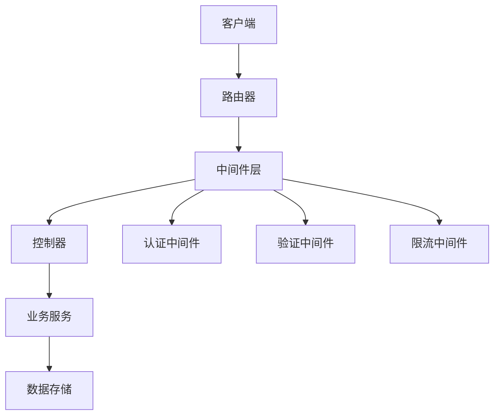
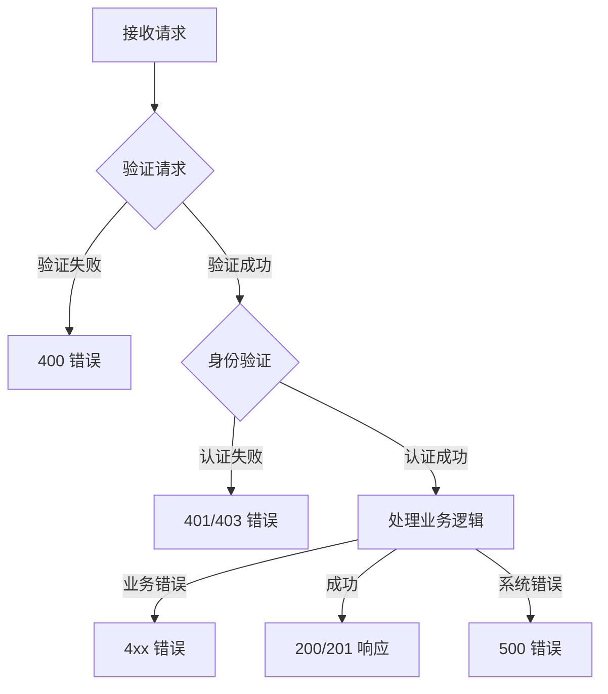
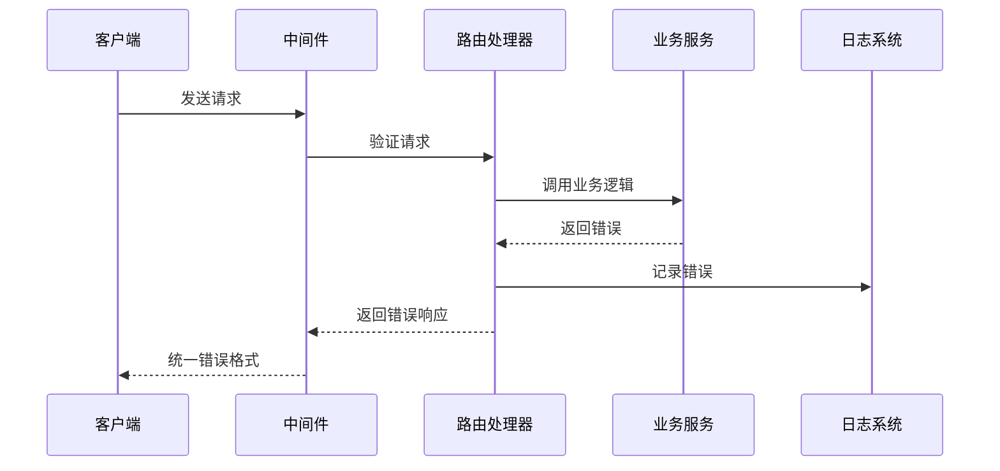
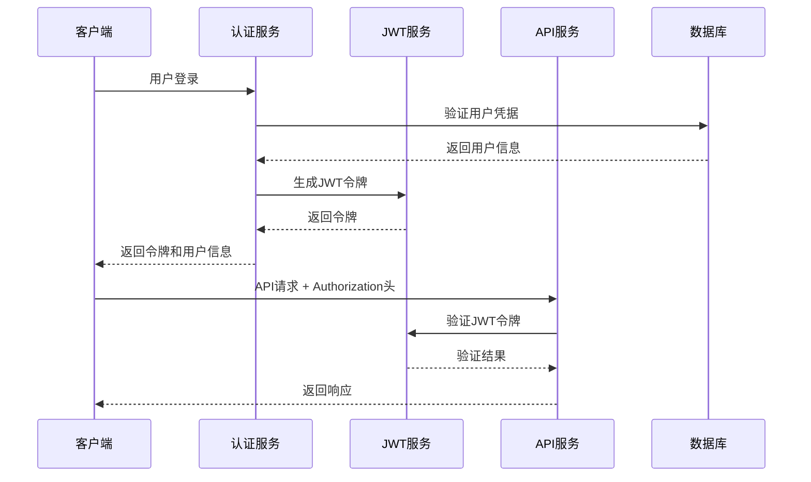
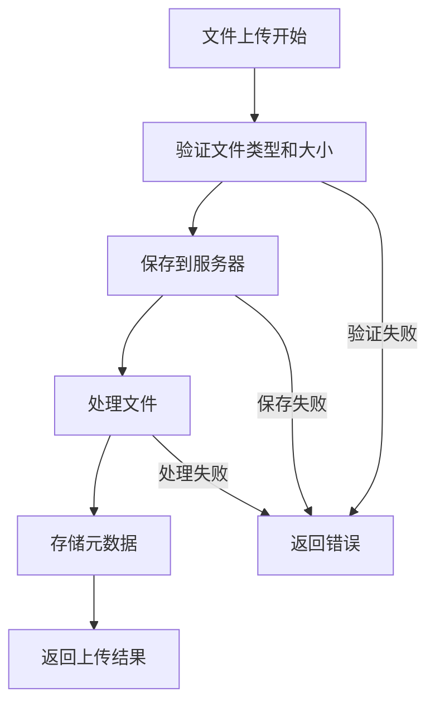

# API接口设计规范

<cite>
**本文档引用的文件**
- [weapons.js](file://backend/src/routes/weapons.js)
- [auth.js](file://backend/src/routes/auth.js)
- [auth.py](file://backend/routes/auth.py)
- [weapon.py](file://backend/routes/weapon.py)
- [app.js](file://backend/src/app.js)
- [auth.js](file://backend/src/middleware/auth.js)
- [validation.js](file://backend/src/middleware/validation.js)
- [weaponService.js](file://backend/src/services/weaponService.js)
- [userService.js](file://backend/src/services/userService.js)
- [index.js](file://backend/src/config/index.js)
- [test-frontend-backend-connection.html](file://test_pages/test-frontend-backend-connection.html)
- [前后端连接实现说明.md](file://function_description/前后端连接实现说明.md)
</cite>

## 目录
1. [概述](#概述)
2. [RESTful API设计原则](#restful-api设计原则)
3. [URL命名规范](#url命名规范)
4. [HTTP方法使用规则](#http方法使用规则)
5. [状态码返回策略](#状态码返回策略)
6. [请求/响应数据结构](#请求响应数据结构)
7. [API版本控制策略](#api版本控制策略)
8. [错误响应格式](#错误响应格式)
9. [认证与授权机制](#认证与授权机制)
10. [数据验证规范](#数据验证规范)
11. [文件上传处理](#文件上传处理)
12. [速率限制机制](#速率限制机制)
13. [最佳实践指南](#最佳实践指南)
14. [示例代码分析](#示例代码分析)

## 概述

兵智世界项目采用前后端分离架构，实现了完整的RESTful API设计标准。本规范基于项目的实际实现，定义了统一的API设计原则、数据结构和开发标准，确保接口的可维护性、可扩展性和一致性。

## RESTful API设计原则

### 核心设计原则

1. **资源导向**: 将系统中的每个实体视为资源，通过URL标识
2. **无状态通信**: 每个请求包含完整信息，服务器不保存客户端状态
3. **统一接口**: 使用标准HTTP方法和状态码
4. **可缓存性**: 支持HTTP缓存机制
5. **分层系统**: 支持代理、网关等中间层

### 设计模式



**图表来源**
- [app.js](file://backend/src/app.js#L40-L120)
- [auth.js](file://backend/src/middleware/auth.js#L1-L106)

## URL命名规范

### 命名约定

1. **全部小写**: URL路径使用小写字母
2. **连字符分隔**: 单词间使用连字符（-）分隔
3. **复数形式**: 资源名称使用复数形式
4. **层次清晰**: 体现资源间的层次关系

### URL结构示例

| 资源类型 | URL格式 | 示例 |
|---------|---------|------|
| 用户认证 | `/api/auth/{action}` | `/api/auth/register` |
| 武器资源 | `/api/weapons` | `/api/weapons` |
| 武器详情 | `/api/weapons/:id` | `/api/weapons/123` |
| 武器搜索 | `/api/weapons/search` | `/api/weapons/search?q=tank` |
| 文件管理 | `/api/{resource}/{id}/files` | `/api/weapons/123/images` |
| 统计数据 | `/api/statistics/{type}` | `/api/manufacturer-statistics` |

### 特殊路径命名

1. **动作路径**: 使用动词表示具体操作
   - `/favorite`: 收藏操作
   - `/similar`: 获取相似资源
   - `/statistics`: 获取统计数据

2. **关联资源**: 显示资源间的关联关系
   - `/weapons/:id/similar`: 相似武器
   - `/weapons/:id/favorite`: 武器收藏

**章节来源**
- [weapons.js](file://backend/src/routes/weapons.js#L1-L218)
- [auth.js](file://backend/src/routes/auth.js#L1-L144)

## HTTP方法使用规则

### 标准方法映射

| HTTP方法 | 用途 | 幂等性 | 安全性 | 示例 |
|---------|------|--------|--------|------|
| GET | 获取资源 | 是 | 是 | `/api/weapons` |
| POST | 创建资源 | 否 | 否 | `/api/weapons` |
| PUT | 更新完整资源 | 是 | 否 | `/api/weapons/123` |
| PATCH | 更新部分资源 | 是 | 否 | `/api/weapons/123` |
| DELETE | 删除资源 | 是 | 否 | `/api/weapons/123` |
| OPTIONS | 获取支持的方法 | 是 | 是 | `/api/weapons` |

### 特殊方法处理

1. **收藏操作**: 使用POST而非PUT
   ```javascript
   // 收藏武器
   POST /api/weapons/:id/favorite
   
   // 取消收藏
   DELETE /api/weapons/:id/favorite
   ```

2. **查询操作**: 使用GET但包含复杂参数
   ```javascript
   // 搜索武器
   GET /api/weapons/search?q=关键词&category=类型&country=国家
   ```

**章节来源**
- [weapons.js](file://backend/src/routes/weapons.js#L15-L180)
- [auth.js](file://backend/src/routes/auth.js#L10-L140)

## 状态码返回策略

### 成功状态码

| 状态码 | 含义 | 使用场景 | 示例 |
|-------|------|----------|------|
| 200 | OK | 请求成功，返回数据 | GET请求成功 |
| 201 | Created | 资源创建成功 | POST请求成功 |
| 204 | No Content | 请求成功但无返回内容 | DELETE请求成功 |

### 客户端错误

| 状态码 | 含义 | 使用场景 | 示例 |
|-------|------|----------|------|
| 400 | Bad Request | 请求参数错误 | 数据验证失败 |
| 401 | Unauthorized | 未认证 | JWT令牌缺失 |
| 403 | Forbidden | 权限不足 | 非管理员操作 |
| 404 | Not Found | 资源不存在 | 武器ID不存在 |

### 服务器错误

| 状态码 | 含义 | 使用场景 | 示例 |
|-------|------|----------|------|
| 500 | Internal Server Error | 服务器内部错误 | 数据库连接失败 |
| 503 | Service Unavailable | 服务不可用 | 数据库超时 |

### 错误处理流程



**图表来源**
- [app.js](file://backend/src/app.js#L125-L200)

**章节来源**
- [app.js](file://backend/src/app.js#L125-L200)
- [weapons.js](file://backend/src/routes/weapons.js#L15-L50)

## 请求/响应数据结构

### 统一响应格式

所有API响应都遵循统一的数据结构：

```javascript
// 成功响应
{
  "success": true,
  "message": "操作成功",
  "data": {
    // 具体数据内容
  }
}

// 失败响应
{
  "success": false,
  "message": "错误描述",
  "data": null
}
```

### 分页响应结构

```javascript
{
  "success": true,
  "data": {
    "items": [...],
    "pagination": {
      "current_page": 1,
      "total_pages": 10,
      "total_items": 100,
      "items_per_page": 10
    }
  }
}
```

### 查询参数规范

| 参数名 | 类型 | 必填 | 默认值 | 说明 |
|-------|------|------|--------|------|
| `page` | Number | 否 | 1 | 页码 |
| `limit` | Number | 否 | 20 | 每页数量 |
| `q` | String | 否 | - | 搜索关键词 |
| `category` | String | 否 | - | 资源分类 |
| `country` | String | 否 | - | 国家筛选 |

### 请求体数据结构

#### 武器创建请求
```javascript
{
  "name": "武器名称",
  "type": "步枪",
  "country": "中国",
  "year": 2023,
  "description": "武器描述",
  "specifications": {
    "weight": "10kg",
    "length": "120cm"
  }
}
```

#### 用户注册请求
```javascript
{
  "username": "用户名",
  "email": "邮箱地址",
  "password": "密码",
  "name": "真实姓名"
}
```

**章节来源**
- [weapons.js](file://backend/src/routes/weapons.js#L15-L30)
- [auth.js](file://backend/src/routes/auth.js#L10-L25)
- [validation.js](file://backend/src/middleware/validation.js#L20-L80)

## API版本控制策略

### 版本控制方案

兵智世界采用URL路径版本控制策略：

```
/api/v1/weapons
/api/v1/auth
/api/v1/knowledge
```

### 当前版本策略

目前项目使用版本1.0.0，所有API路径以`/api`开头，未来可通过以下方式升级：

1. **URL路径版本**: `/api/v2/weapons`
2. **请求头版本**: `Accept: application/vnd.military.v2+json`
3. **查询参数版本**: `/api/weapons?version=2`

### 版本兼容性

- **向后兼容**: 新版本保持旧版本API的基本功能
- **废弃通知**: 通过响应头或文档告知废弃的API
- **迁移指南**: 提供详细的版本升级指导

**章节来源**
- [app.js](file://backend/src/app.js#L85-L115)

## 错误响应格式

### 统一错误结构

```javascript
{
  "success": false,
  "message": "错误描述",
  "code": "ERROR_CODE",
  "details": {
    // 详细错误信息
  }
}
```

### 错误类型分类

| 错误类型 | 错误码 | 描述 | 示例 |
|---------|-------|------|------|
| 验证错误 | VALIDATION_ERROR | 数据验证失败 | 字段格式错误 |
| 权限错误 | AUTHORIZATION_ERROR | 权限不足 | 非管理员操作 |
| 资源错误 | RESOURCE_NOT_FOUND | 资源不存在 | 武器ID不存在 |
| 系统错误 | INTERNAL_ERROR | 内部服务器错误 | 数据库连接失败 |

### 错误处理中间件



**图表来源**
- [app.js](file://backend/src/app.js#L125-L200)

**章节来源**
- [app.js](file://backend/src/app.js#L125-L200)
- [weapons.js](file://backend/src/routes/weapons.js#L15-L50)

## 认证与授权机制

### JWT令牌认证

#### 认证流程



**图表来源**
- [auth.js](file://backend/src/middleware/auth.js#L1-L50)
- [userService.js](file://backend/src/services/userService.js#L50-L100)

#### 令牌结构

```javascript
{
  "userId": "用户ID",
  "username": "用户名",
  "role": "用户角色",
  "exp": "过期时间戳"
}
```

### 权限控制

#### 中间件层级

1. **可选认证**: `optionalAuth` - 可选登录的接口
2. **必需认证**: `authenticateToken` - 必须登录的接口
3. **管理员权限**: `requireAdmin` - 管理员专用接口

#### 简化管理员模式

为了开发便利，系统支持简化管理员模式：

```javascript
// 在请求头中添加
X-Admin-User: true
```

这将绕过JWT验证，直接设置管理员用户。

**章节来源**
- [auth.js](file://backend/src/middleware/auth.js#L1-L106)
- [auth.js](file://backend/src/routes/auth.js#L10-L50)

## 数据验证规范

### 验证中间件

系统使用Joi库实现统一的数据验证：

```javascript
// 用户注册验证规则
const userRegistrationSchema = Joi.object({
  username: Joi.string()
    .alphanum()
    .min(3)
    .max(30)
    .required(),
  email: Joi.string()
    .email()
    .required(),
  password: Joi.string()
    .min(6)
    .max(128)
    .required(),
  name: Joi.string()
    .min(2)
    .max(50)
    .optional()
});
```

### 验证规则类型

| 验证类型 | 说明 | 示例 |
|---------|------|------|
| 字符串长度 | 最小/最大长度限制 | `.min(3).max(30)` |
| 格式验证 | 邮箱、URL等格式 | `.email()` |
| 数值范围 | 数字范围限制 | `.min(1800).max(2030)` |
| 枚举值 | 预定义选项 | `.valid('步枪', '手枪')` |
| 必填验证 | 必填字段检查 | `.required()` |

### 验证错误处理

```javascript
{
  "success": false,
  "message": "数据验证失败",
  "errors": [
    {
      "field": "username",
      "message": "用户名至少需要3个字符"
    },
    {
      "field": "email",
      "message": "请输入有效的邮箱地址"
    }
  ]
}
```

**章节来源**
- [validation.js](file://backend/src/middleware/validation.js#L1-L178)
- [weapons.js](file://backend/src/routes/weapons.js#L15-L30)

## 文件上传处理

### 支持的文件类型

| 资源类型 | 支持格式 | 大小限制 | 示例 |
|---------|---------|----------|------|
| 武器图片 | JPG, PNG, GIF | 10MB | `/api/weapon-images/weapon/:id/upload` |
| 武器视频 | MP4, AVI, MOV | 100MB | `/api/weapon-videos/weapon/:id/upload` |
| 用户头像 | JPG, PNG | 5MB | `/api/auth/profile` |

### 上传流程



**图表来源**
- [weapon.py](file://backend/routes/weapon.py#L15-L80)

### 上传接口示例

#### 图片上传
```javascript
// 前端FormData格式
const formData = new FormData();
formData.append('image', file);
formData.append('description', '武器图片');

// API请求
POST /api/weapon-images/weapon/:id/upload
Content-Type: multipart/form-data

// 响应格式
{
  "success": true,
  "message": "图片上传成功",
  "data": {
    "filename": "weapon_123.jpg",
    "fileSize": 1024000,
    "mimeType": "image/jpeg"
  }
}
```

**章节来源**
- [weapon.py](file://backend/routes/weapon.py#L15-L80)
- [index.js](file://backend/src/config/index.js#L35-L45)

## 速率限制机制

### 限流策略

系统采用基于IP的请求频率限制：

```javascript
const limiter = rateLimit({
  windowMs: 900000, // 15分钟
  max: 1000,        // 最大请求数
  message: {
    success: false,
    message: '请求过于频繁，请稍后再试'
  }
});
```

### 路由级别限流

不同API路径可设置不同的限流策略：

| 路径 | 限制频率 | 说明 |
|------|---------|------|
| `/api/` | 1000次/15分钟 | 基础API限流 |
| `/api/weapons` | 2000次/15分钟 | 高频武器API |
| `/api/auth` | 50次/15分钟 | 认证相关API |

### 限流响应

```javascript
{
  "success": false,
  "message": "请求过于频繁，请稍后再试"
}
```

**章节来源**
- [app.js](file://backend/src/app.js#L65-L80)
- [index.js](file://backend/src/config/index.js#L50-L55)

## 最佳实践指南

### 接口设计原则

1. **单一职责**: 每个接口只负责一个业务功能
2. **幂等性**: GET、PUT、DELETE操作应该是幂等的
3. **一致性**: 保持相同的命名约定和数据结构
4. **可扩展性**: 设计时考虑未来的功能扩展

### 错误处理最佳实践

1. **详细错误信息**: 提供具体的错误原因和解决建议
2. **错误分类**: 区分业务错误和系统错误
3. **日志记录**: 记录详细的错误信息用于调试
4. **用户友好**: 向用户提供友好的错误提示

### 性能优化

1. **分页处理**: 大量数据使用分页机制
2. **缓存策略**: 合理使用缓存减少数据库压力
3. **异步处理**: 大文件上传使用异步处理
4. **连接池**: 数据库连接使用连接池管理

### 安全考虑

1. **输入验证**: 严格验证所有用户输入
2. **权限控制**: 实施细粒度的权限控制
3. **HTTPS**: 所有API使用HTTPS传输
4. **CORS配置**: 正确配置跨域资源共享

## 示例代码分析

### 武器管理API示例

以下是武器管理API的完整实现分析：

#### 获取武器列表
```javascript
// 路由定义
router.get('/', optionalAuth, async (req, res) => {
  try {
    const { category, country, page, limit } = req.query;
    const filters = { category, country };
    const pagination = { 
      page: parseInt(page) || 1, 
      limit: parseInt(limit) || 20 
    };

    const result = await weaponService.getWeapons(filters, pagination);
    res.json(result);
  } catch (error) {
    logger.error('获取武器列表错误:', error);
    res.status(500).json({
      success: false,
      message: '获取武器列表失败'
    });
  }
});
```

#### 创建武器
```javascript
// 管理员权限验证
router.post('/', authenticateToken, requireAdmin, validate(weaponSchema), async (req, res) => {
  try {
    const result = await weaponService.createWeapon(req.body);
    res.status(201).json(result);
  } catch (error) {
    logger.error('创建武器错误:', error);
    res.status(400).json({
      success: false,
      message: error.message || '创建武器失败'
    });
  }
});
```

### 用户认证API示例

#### 用户注册
```javascript
router.post('/register', validate(userRegistrationSchema), async (req, res) => {
  try {
    const result = await userService.registerUser(req.body);
    res.status(201).json(result);
  } catch (error) {
    logger.error('注册接口错误:', error);
    res.status(400).json({
      success: false,
      message: error.message || '注册失败'
    });
  }
});
```

#### 用户登录
```javascript
router.post('/login', validate(userLoginSchema), async (req, res) => {
  try {
    const result = await userService.loginUser(req.body);
    res.json(result);
  } catch (error) {
    logger.error('登录接口错误:', error);
    res.status(401).json({
      success: false,
      message: error.message || '登录失败'
    });
  }
});
```

**章节来源**
- [weapons.js](file://backend/src/routes/weapons.js#L15-L180)
- [auth.js](file://backend/src/routes/auth.js#L10-L80)

### 前端集成示例

基于测试页面的前端集成模式：

```javascript
// 获取武器列表
async function fetchWeapons() {
  try {
    const response = await fetch(`${API_BASE}/api/weapons?limit=10`);
    const data = await response.json();
    
    if (data.success) {
      // 处理武器数据
      renderWeapons(data.data.weapons);
    } else {
      throw new Error(data.message);
    }
  } catch (error) {
    console.error('获取武器失败:', error);
  }
}

// 创建武器（需要管理员权限）
async function createWeapon(weaponData) {
  try {
    const response = await fetch(`${API_BASE}/api/weapons`, {
      method: 'POST',
      headers: {
        'Content-Type': 'application/json',
        'x-admin-user': 'true'
      },
      body: JSON.stringify(weaponData)
    });
    
    const data = await response.json();
    return data;
  } catch (error) {
    console.error('创建武器失败:', error);
  }
}
```

**章节来源**
- [test-frontend-backend-connection.html](file://test_pages/test-frontend-backend-connection.html#L300-L400)

## 总结

兵智世界项目的API设计规范体现了现代Web应用的最佳实践，通过统一的设计原则、标准化的数据结构和完善的错误处理机制，确保了系统的可维护性、可扩展性和安全性。这套规范不仅适用于当前项目，也可以作为其他类似项目的参考模板。

关键特性包括：
- **RESTful设计**: 符合REST架构风格的最佳实践
- **统一响应格式**: 标准化的JSON响应结构
- **完善的认证机制**: JWT令牌和多级权限控制
- **严格的数据验证**: Joi验证库确保数据质量
- **健壮的错误处理**: 分类明确的错误响应格式
- **性能优化**: 速率限制和缓存策略
- **安全考虑**: 输入验证和权限控制

这套API设计规范为项目的长期发展奠定了坚实的基础，有助于团队协作和代码维护。