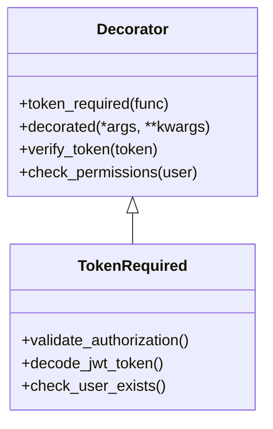
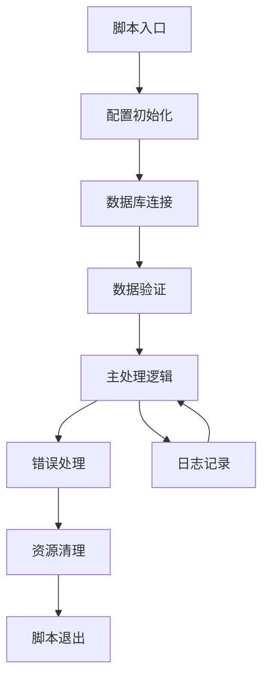
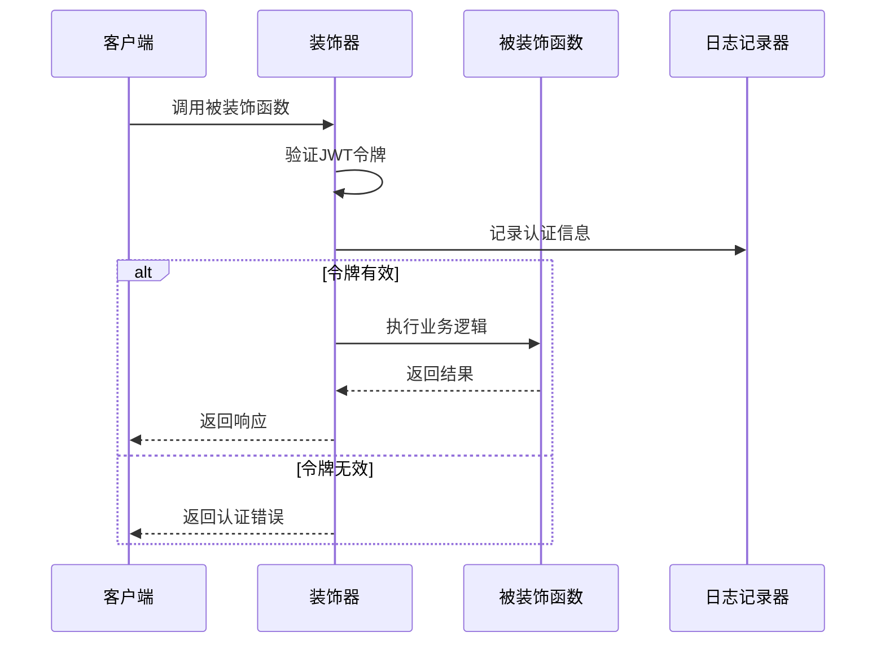
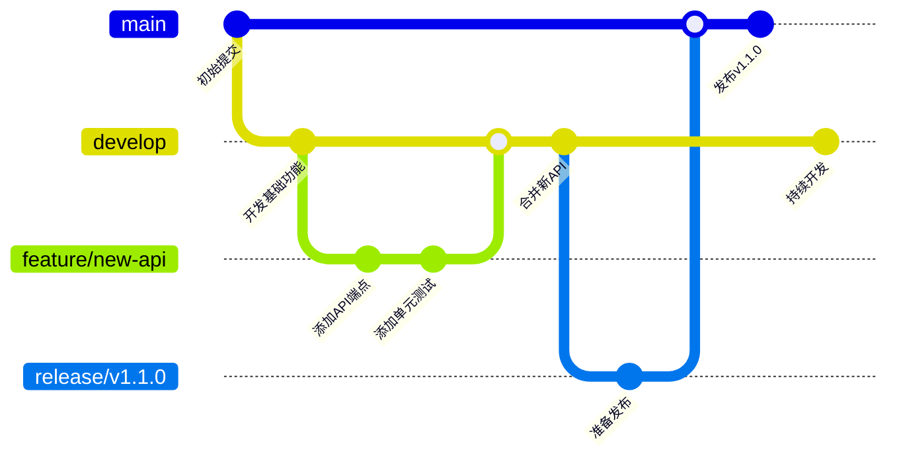
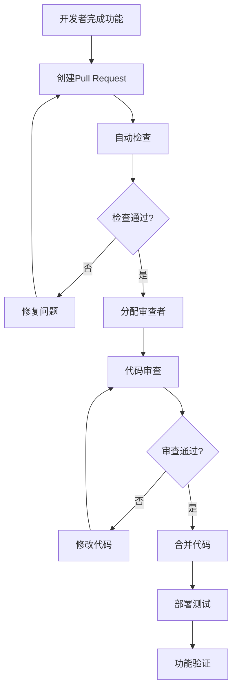

# 代码规范与协作

<cite>
**本文档引用的文件**
- [clean-duplicate-weapons.js](file://backend/scripts/clean-duplicate-weapons.js)
- [fix-database-integrity.js](file://backend/scripts/fix-database-integrity.js)
- [decorators.py](file://backend/utils/decorators.py)
- [auth.py](file://backend/routes/auth.py)
- [weapons.js](file://backend/src/routes/weapons.js)
- [weaponService.js](file://backend/src/services/weaponService.js)
- [auth.js](file://backend/src/middleware/auth.js)
- [logger.js](file://backend/src/utils/logger.js)
- [前后端连接实现说明.md](file://function_description/前后端连接实现说明.md)
- [init-database.js](file://backend/scripts/init-database.js)
- [database-health-check.js](file://backend/scripts/database-health-check.js)
- [index.js](file://backend/src/config/index.js)
- [package.json](file://package.json)
</cite>

## 目录
1. [项目概述](#项目概述)
2. [代码风格规范](#代码风格规范)
3. [文件组织结构](#文件组织结构)
4. [注释标准](#注释标准)
5. [数据处理脚本范式](#数据处理脚本范式)
6. [API接口设计与文档](#api接口设计与文档)
7. [装饰器使用规范](#装饰器使用规范)
8. [Git分支策略](#git分支策略)
9. [提交信息格式](#提交信息格式)
10. [代码审查流程](#代码审查流程)
11. [最佳实践总结](#最佳实践总结)

## 项目概述

兵智世界项目是一个现代化的军事武器知识图谱系统，采用前后端分离架构，集成了武器信息管理、知识图谱可视化、多媒体展示等功能。项目包含多个技术栈，包括Node.js/Express后端、Python Flask后端、前端JavaScript等。

## 代码风格规范

### JavaScript/Node.js规范

#### 命名约定
- **变量和函数**: 使用驼峰命名法（camelCase）
- **常量**: 使用全大写字母和下划线分隔（UPPER_CASE）
- **类名**: 使用帕斯卡命名法（PascalCase）
- **文件名**: 使用小写字母和连字符分隔（kebab-case）

#### 代码格式化
```javascript
// 示例：函数定义
function getUserProfile(userId) {
    // 函数逻辑
}

// 示例：类定义
class DatabaseManager {
    constructor(config) {
        this.config = config;
    }
}

// 示例：常量定义
const MAX_RETRIES = 3;
const API_BASE_URL = 'http://localhost:3001/api';
```

#### 异步编程规范
```javascript
// 使用async/await而非回调
async function fetchData() {
    try {
        const response = await fetch(API_URL);
        const data = await response.json();
        return data;
    } catch (error) {
        logger.error('数据获取失败:', error);
        throw error;
    }
}
```

#### 错误处理规范
```javascript
// 统一错误处理模式
try {
    // 业务逻辑
} catch (error) {
    logger.error('操作失败:', error);
    return res.status(500).json({
        success: false,
        message: '操作失败',
        error: process.env.NODE_ENV === 'production' ? '服务器错误' : error.message
    });
}
```

### Python规范

#### 命名约定
- **函数和变量**: 使用下划线分隔的小写（snake_case）
- **类名**: 使用帕斯卡命名法（PascalCase）
- **常量**: 使用全大写字母和下划线分隔（UPPER_CASE）

#### 装饰器使用
```python
# 装饰器示例
@token_required
def get_profile(current_user):
    return jsonify({
        'code': 200,
        'user': current_user.to_dict()
    }), 200
```

### Python装饰器规范

项目中的装饰器使用遵循以下规范：



**图表来源**
- [decorators.py](file://backend/utils/decorators.py#L1-L51)

**章节来源**
- [decorators.py](file://backend/utils/decorators.py#L1-L51)

## 文件组织结构

### 后端文件结构规范

```
backend/
├── src/                    # 主要源代码
│   ├── routes/            # API路由
│   ├── services/          # 业务逻辑服务
│   ├── middleware/        # 中间件
│   ├── config/           # 配置文件
│   ├── utils/            # 工具函数
│   └── app.js           # 应用入口
├── scripts/              # 维护脚本
├── utils/                # Python工具
├── models/               # 数据模型
├── routes/               # Python路由
└── config.py            # Python配置
```

### 前端文件结构规范

```
frontend/
├── scripts/              # JavaScript脚本
├── styles/               # CSS样式
├── templates/            # HTML模板
├── uploads/              # 上传文件
└── pages/                # 页面文件
```

### 文件命名规范

| 类型 | 命名规则 | 示例 |
|------|----------|------|
| 路由文件 | kebab-case.js | `weapon-service.js` |
| 服务文件 | PascalCase.js | `WeaponService.js` |
| 配置文件 | snake_case.js | `database_config.js` |
| 工具函数 | camelCase.js | `loggerUtils.js` |
| 样式文件 | kebab-case.css | `knowledge-graph.css` |
| HTML模板 | kebab-case.html | `profile-page.html` |

## 注释标准

### JavaScript注释规范

#### 单行注释
```javascript
// 这是一个单行注释
const userId = 123; // 用户ID
```

#### 多行注释
```javascript
/**
 * 数据库连接管理器
 * @class DatabaseManager
 * @description 管理多种数据库连接
 */
class DatabaseManager {
    // 类实现
}
```

#### 函数注释
```javascript
/**
 * 获取武器列表
 * @param {Object} filters - 过滤条件
 * @param {Object} pagination - 分页参数
 * @returns {Promise<Object>} 武器列表数据
 */
async function getWeapons(filters = {}, pagination = {}) {
    // 函数实现
}
```

### Python注释规范

#### 函数注释
```python
def token_required(f):
    """
    JWT令牌验证装饰器
    
    Args:
        f (function): 被装饰的函数
        
    Returns:
        function: 装饰后的函数
        
    Raises:
        HTTPException: 当令牌无效或过期时抛出
    """
    @wraps(f)
    def decorated(*args, **kwargs):
        # 实现
        pass
    return decorated
```

### 文档字符串规范

#### 类文档字符串
```javascript
/**
 * 武器服务类
 * @class WeaponService
 * @description 提供武器相关的业务逻辑
 */
class WeaponService {
    // 类实现
}
```

#### 方法文档字符串
```javascript
/**
 * 创建武器
 * @param {Object} weaponData - 武器数据
 * @returns {Promise<Object>} 创建结果
 * @throws {Error} 当创建失败时抛出
 */
async createWeapon(weaponData) {
    // 实现
}
```

## 数据处理脚本范式

### 脚本结构模板

基于项目中的维护脚本，数据处理脚本应遵循以下结构：



**图表来源**
- [clean-duplicate-weapons.js](file://backend/scripts/clean-duplicate-weapons.js#L1-L113)
- [fix-database-integrity.js](file://backend/scripts/fix-database-integrity.js#L1-L302)

### 脚本编写规范

#### 1. 模块化设计
```javascript
// 使用类封装脚本逻辑
class DataProcessor {
    constructor() {
        this.dbPath = path.join(__dirname, '../data/database.db');
        this.logger = require('../utils/logger');
    }

    async run() {
        try {
            await this.connect();
            await this.processData();
            await this.cleanup();
            this.logger.info('脚本执行完成');
        } catch (error) {
            this.logger.error('脚本执行失败:', error);
            process.exit(1);
        }
    }

    async connect() {
        // 数据库连接逻辑
    }

    async processData() {
        // 数据处理逻辑
    }

    async cleanup() {
        // 资源清理逻辑
    }
}
```

#### 2. 错误处理规范
```javascript
// 统一的错误处理模式
async function processData() {
    try {
        // 主要业务逻辑
        const result = await this.performOperation();
        this.logger.info('操作成功:', result);
        return result;
    } catch (error) {
        this.logger.error('操作失败:', error);
        throw new Error(`数据处理失败: ${error.message}`);
    }
}
```

#### 3. 日志记录规范
```javascript
// 结构化日志记录
this.logger.info('开始处理数据...', {
    operation: 'clean_duplicates',
    batchSize: 1000,
    startTime: new Date().toISOString()
});

this.logger.warn('发现重复数据', {
    count: duplicates.length,
    sample: duplicates.slice(0, 5)
});

this.logger.error('处理失败', {
    error: error.message,
    stack: error.stack
});
```

#### 4. 配置管理
```javascript
// 配置文件示例
const config = {
    database: {
        path: process.env.DB_PATH || './data/database.db',
        timeout: process.env.DB_TIMEOUT || 30000
    },
    batchSize: process.env.BATCH_SIZE || 1000,
    logLevel: process.env.LOG_LEVEL || 'info'
};
```

**章节来源**
- [clean-duplicate-weapons.js](file://backend/scripts/clean-duplicate-weapons.js#L1-L113)
- [fix-database-integrity.js](file://backend/scripts/fix-database-integrity.js#L1-L302)
- [init-database.js](file://backend/scripts/init-database.js#L1-L334)
- [database-health-check.js](file://backend/scripts/database-health-check.js#L1-L176)

## API接口设计与文档

### RESTful API设计原则

#### 1. 资源命名规范
```javascript
// 资源URL设计
GET    /api/weapons          // 获取武器列表
GET    /api/weapons/:id      // 获取单个武器
POST   /api/weapons          // 创建武器
PUT    /api/weapons/:id      // 更新武器
DELETE /api/weapons/:id      // 删除武器
```

#### 2. 请求响应格式
```javascript
// 成功响应格式
{
    "success": true,
    "data": {
        // 实际数据
    },
    "message": "操作成功",
    "timestamp": "2024-01-01T12:00:00Z"
}

// 错误响应格式
{
    "success": false,
    "error": {
        "code": "VALIDATION_ERROR",
        "message": "请求参数验证失败",
        "details": [
            {
                "field": "username",
                "message": "用户名不能为空"
            }
        ]
    },
    "timestamp": "2024-01-01T12:00:00Z"
}
```

#### 3. 状态码规范
| 状态码 | 含义 | 使用场景 |
|--------|------|----------|
| 200 | OK | 请求成功 |
| 201 | Created | 资源创建成功 |
| 400 | Bad Request | 请求参数错误 |
| 401 | Unauthorized | 未认证 |
| 403 | Forbidden | 权限不足 |
| 404 | Not Found | 资源不存在 |
| 500 | Internal Server Error | 服务器内部错误 |

### 中间件认证规范

#### JWT认证中间件
```javascript
// 认证中间件示例
const authenticateToken = (req, res, next) => {
    const authHeader = req.headers['authorization'];
    const token = authHeader && authHeader.split(' ')[1];

    if (!token) {
        return res.status(401).json({
            success: false,
            message: '访问令牌缺失'
        });
    }

    jwt.verify(token, config.jwt.secret, (err, user) => {
        if (err) {
            return res.status(403).json({
                success: false,
                message: '访问令牌无效或已过期'
            });
        }
        req.user = user;
        next();
    });
};
```

#### 权限控制中间件
```javascript
// 管理员权限检查
const requireAdmin = (req, res, next) => {
    if (!req.user || req.user.role !== 'admin') {
        return res.status(403).json({
            success: false,
            message: '需要管理员权限'
        });
    }
    next();
};
```

### API文档模板

#### 接口文档示例
```markdown
### 获取武器列表

**接口**: `GET /api/weapons`

**权限**: 无需认证

**请求参数**:
- `category` (string, 可选): 武器类型
- `country` (string, 可选): 制造国家
- `page` (number, 可选): 页码，默认1
- `limit` (number, 可选): 每页数量，默认20

**响应**:
```json
{
    "success": true,
    "data": {
        "weapons": [...],
        "pagination": {
            "current_page": 1,
            "total_pages": 5,
            "total_items": 100,
            "items_per_page": 20
        }
    }
}
```
```

**章节来源**
- [weapons.js](file://backend/src/routes/weapons.js#L1-L218)
- [auth.js](file://backend/routes/auth.py#L1-L100)
- [auth.js](file://backend/src/middleware/auth.js#L1-L106)

## 装饰器使用规范

### Python装饰器模式

项目中的装饰器使用遵循以下模式：



**图表来源**
- [decorators.py](file://backend/utils/decorators.py#L1-L51)

### 装饰器实现规范

#### 1. JWT令牌验证装饰器
```python
def token_required(f):
    @wraps(f)
    def decorated(*args, **kwargs):
        token = None
        
        # 从请求头中获取 token
        if 'Authorization' in request.headers:
            token = request.headers['Authorization'].replace('Bearer ', '')
        
        if not token:
            return jsonify({
                'code': 401,
                'message': '认证令牌缺失'
            }), 401
        
        try:
            # 解码 token
            data = jwt.decode(token, app.config['SECRET_KEY'], algorithms=['HS256'])
            
            # 查找用户
            current_user = User.query.filter_by(id=data['user_id']).first()
            
            if not current_user:
                return jsonify({
                    'code': 401,
                    'message': '用户不存在'
                }), 401
                
        except jwt.ExpiredSignatureError:
            return jsonify({
                'code': 401,
                'message': '令牌已过期'
            }), 401
            
        except jwt.InvalidTokenError:
            return jsonify({
                'code': 401,
                'message': '无效令牌'
            }), 401
            
        # 将当前用户作为参数传递给被装饰的函数
        return f(current_user, *args, **kwargs)
    
    return decorated
```

#### 2. 装饰器使用规范
```python
# 在视图函数中使用
@bp.route('/profile', methods=['GET'])
@token_required
def get_profile(current_user):
    """获取当前用户信息"""
    return jsonify({
        'code': 200,
        'user': current_user.to_dict()
    }), 200

# 多个装饰器组合使用
@bp.route('/admin/dashboard', methods=['GET'])
@token_required
@require_admin
def admin_dashboard(current_user):
    """管理员仪表板"""
    return render_template('admin/dashboard.html')
```

#### 3. 装饰器扩展模式
```python
# 权限检查装饰器
def permission_required(permission):
    def decorator(f):
        @wraps(f)
        def decorated(*args, **kwargs):
            if not hasattr(current_user, 'has_permission'):
                return jsonify({'error': '权限检查失败'}), 403
            
            if not current_user.has_permission(permission):
                return jsonify({'error': '权限不足'}), 403
            
            return f(*args, **kwargs)
        return decorated
    return decorator
```

**章节来源**
- [decorators.py](file://backend/utils/decorators.py#L1-L51)
- [auth.py](file://backend/routes/auth.py#L1-L100)

## Git分支策略

### 分支命名规范

#### 1. 主分支
- `main`: 生产环境代码
- `develop`: 开发环境代码

#### 2. 功能分支
- `feature/功能名称`: 新功能开发
- `bugfix/问题描述`: 问题修复
- `hotfix/紧急修复`: 紧急修复

#### 3. 发布分支
- `release/v1.x.x`: 版本发布准备

#### 4. 实验分支
- `experiment/实验名称`: 新技术尝试

### Git工作流程



## 提交信息格式

### 提交信息结构

```
<类型>(<范围>): <简短描述>

<详细描述>

<相关问题>
```

### 提交类型

| 类型 | 描述 | 示例 |
|------|------|------|
| feat | 新功能 | `feat(auth): 添加JWT认证` |
| fix | 错误修复 | `fix(api): 修复用户注册bug` |
| docs | 文档更新 | `docs(readme): 更新部署说明` |
| style | 代码格式 | `style(css): 优化样式文件` |
| refactor | 代码重构 | `refactor(service): 优化服务层` |
| test | 测试相关 | `test(unit): 添加单元测试` |
| chore | 构建过程 | `chore(deps): 更新依赖包` |

### 提交信息示例

```
feat(api): 添加武器搜索功能

- 实现武器名称和描述的全文搜索
- 添加高级筛选功能（类型、国家）
- 优化搜索性能，添加缓存机制
- 添加搜索结果排序功能

Closes #123
```

## 代码审查流程

### 审查清单

#### 1. 代码质量
- [ ] 代码符合项目风格规范
- [ ] 变量和函数命名清晰
- [ ] 适当的注释和文档
- [ ] 错误处理完善
- [ ] 性能考虑充分

#### 2. 功能正确性
- [ ] 功能实现符合需求
- [ ] 边界条件处理正确
- [ ] 数据验证完整
- [ ] 安全性考虑充分

#### 3. 测试覆盖
- [ ] 单元测试通过
- [ ] 集成测试完整
- [ ] 性能测试达标
- [ ] 安全测试通过

### 审查流程



### 审查要点

#### 1. 逻辑审查
- 检查算法复杂度
- 验证边界条件
- 确保业务逻辑正确

#### 2. 安全审查
- 输入验证
- 权限检查
- 敏感数据保护

#### 3. 性能审查
- 数据库查询优化
- 缓存策略
- 并发处理

#### 4. 可维护性审查
- 代码可读性
- 模块化程度
- 文档完整性

## 最佳实践总结

### 1. 代码质量保证
- 遵循统一的代码风格规范
- 使用适当的注释和文档
- 编写全面的测试用例
- 定期进行代码审查

### 2. 数据处理规范
- 使用事务确保数据一致性
- 实现完善的错误处理机制
- 添加详细的日志记录
- 提供数据验证和清理功能

### 3. API设计原则
- 遵循RESTful设计原则
- 使用一致的响应格式
- 实现适当的认证和授权
- 提供详细的API文档

### 4. 开发协作
- 使用标准化的Git工作流程
- 遵循规范的提交信息格式
- 建立有效的代码审查机制
- 保持良好的沟通和协作

### 5. 持续改进
- 定期回顾和优化代码规范
- 学习和应用新的开发实践
- 收集团队反馈并持续改进
- 保持技术栈的更新和维护

通过遵循这些规范和最佳实践，团队可以确保代码的质量、可维护性和协作效率，为项目的长期发展奠定坚实的基础。