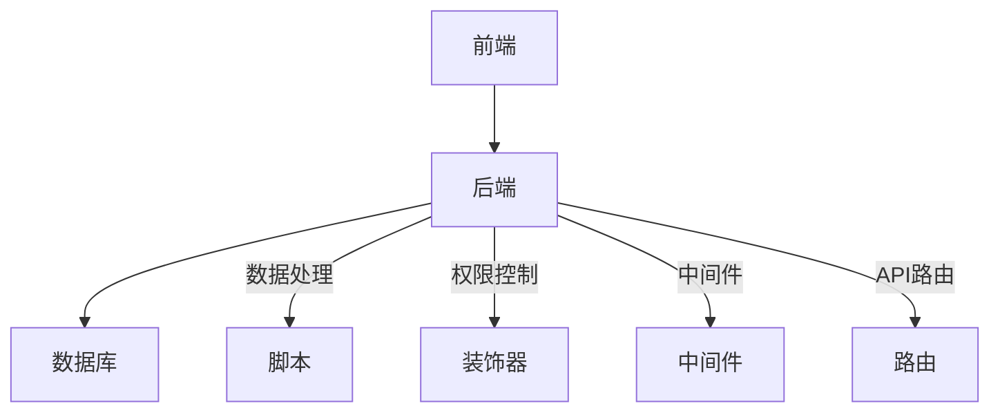
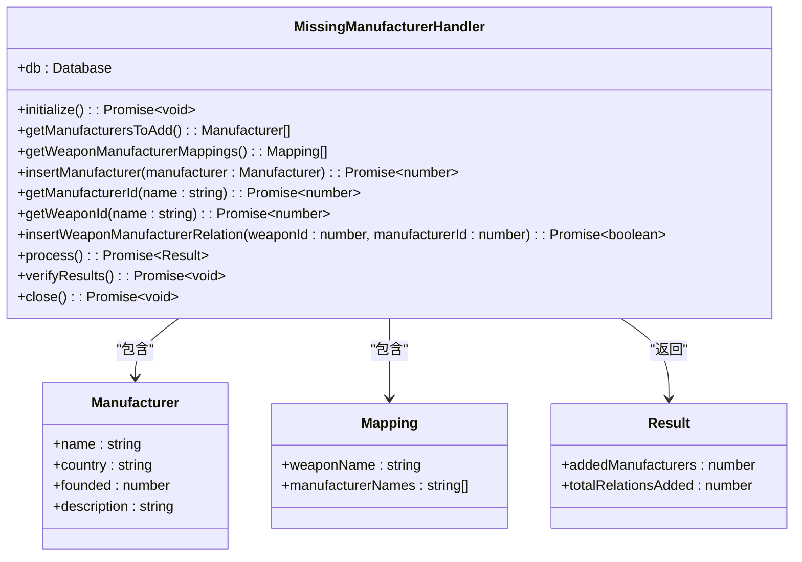
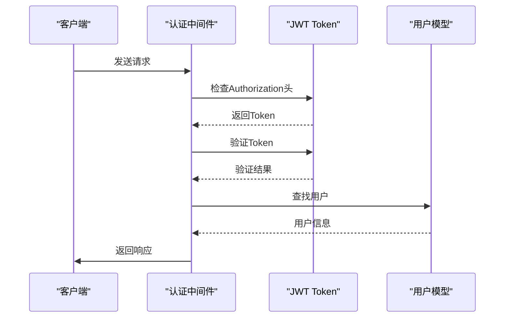
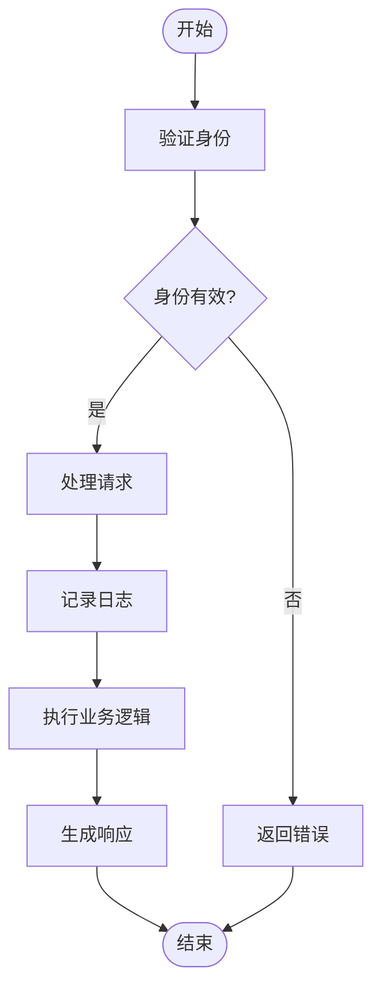

# 代码风格规范

<cite>
**本文档引用的文件**
- [add-missing-manufacturers.js](file://backend/scripts/add-missing-manufacturers.js)
- [clean-duplicate-weapons.js](file://backend/scripts/clean-duplicate-weapons.js)
- [decorators.py](file://backend/utils/decorators.py)
- [auth.js](file://backend/src/middleware/auth.js)
- [weapon_service.py](file://backend/services/weapon_service.py)
- [weapons.js](file://backend/src/routes/weapons.js)
- [auth.py](file://backend/routes/auth.py)
- [app.js](file://backend/src/app.js)
- [app.py](file://backend/app.py)
- [index.js](file://backend/src/config/index.js)
- [logger.js](file://backend/src/utils/logger.js)
</cite>

## 目录
1. [引言](#引言)
2. [项目结构](#项目结构)
3. [核心组件](#核心组件)
4. [架构概述](#架构概述)
5. [详细组件分析](#详细组件分析)
6. [依赖分析](#依赖分析)
7. [性能考虑](#性能考虑)
8. [故障排除指南](#故障排除指南)
9. [结论](#结论)

## 引言
本文档旨在为JavaScript和Python代码制定统一的编码风格规范，涵盖命名约定、缩进、文件组织结构和注释标准。通过分析backend/scripts中的数据处理脚本和decorators.py中的装饰器实现，提取最佳实践，并提供ESLint和Pylint配置建议，确保团队成员遵循一致的编码风格。

## 项目结构
该项目采用分层架构，将前端和后端分离。后端主要由JavaScript和Python文件组成，分别处理不同的业务逻辑。JavaScript文件主要用于处理API路由和中间件，而Python文件则用于处理数据库操作和业务逻辑。

```mermaid
graph TD
backend[backend]
backend --> models[models]
backend --> public[public]
backend --> routes[routes]
backend --> scripts[scripts]
backend --> services[services]
backend --> src[src]
backend --> utils[utils]
backend --> .env[.env]
backend --> CONFIG.md[CONFIG.md]
backend --> README-SIMPLE.md[README-SIMPLE.md]
backend --> api.py[api.py]
backend --> app.py[app.py]
backend --> config.py[config.py]
backend --> package-lock.json[package-lock.json]
backend --> package.json[package.json]
backend --> requirements.txt[requirements.txt]
backend --> test-api.js[test-api.js]
```

**图示来源**
- [add-missing-manufacturers.js](file://backend/scripts/add-missing-manufacturers.js)
- [clean-duplicate-weapons.js](file://backend/scripts/clean-duplicate-weapons.js)
- [decorators.py](file://backend/utils/decorators.py)

**章节来源**
- [add-missing-manufacturers.js](file://backend/scripts/add-missing-manufacturers.js)
- [clean-duplicate-weapons.js](file://backend/scripts/clean-duplicate-weapons.js)
- [decorators.py](file://backend/utils/decorators.py)

## 核心组件
本项目的核心组件包括数据处理脚本、装饰器、中间件和API路由。这些组件共同构成了系统的骨架，确保了数据的一致性和安全性。

**章节来源**
- [add-missing-manufacturers.js](file://backend/scripts/add-missing-manufacturers.js)
- [clean-duplicate-weapons.js](file://backend/scripts/clean-duplicate-weapons.js)
- [decorators.py](file://backend/utils/decorators.py)
- [auth.js](file://backend/src/middleware/auth.js)
- [weapons.js](file://backend/src/routes/weapons.js)

## 架构概述
系统采用微服务架构，前端通过API与后端通信。后端由多个服务组成，每个服务负责特定的业务逻辑。数据处理脚本用于维护数据库的完整性，而装饰器则用于权限控制。

**图示来源**
- [add-missing-manufacturers.js](file://backend/scripts/add-missing-manufacturers.js)
- [clean-duplicate-weapons.js](file://backend/scripts/clean-duplicate-weapons.js)
- [decorators.py](file://backend/utils/decorators.py)
- [auth.js](file://backend/src/middleware/auth.js)
- [weapons.js](file://backend/src/routes/weapons.js)

## 详细组件分析
### 数据处理脚本分析
数据处理脚本主要用于维护数据库的完整性，例如添加缺失的制造商信息和清理重复的武器数据。

#### 类图

**图示来源**
- [add-missing-manufacturers.js](file://backend/scripts/add-missing-manufacturers.js)

**章节来源**
- [add-missing-manufacturers.js](file://backend/scripts/add-missing-manufacturers.js)

### 装饰器分析
装饰器用于实现权限控制，确保只有经过身份验证的用户才能访问某些资源。

#### 序列图

**图示来源**
- [decorators.py](file://backend/utils/decorators.py)
- [auth.js](file://backend/src/middleware/auth.js)

**章节来源**
- [decorators.py](file://backend/utils/decorators.py)
- [auth.js](file://backend/src/middleware/auth.js)

### 中间件分析
中间件用于处理请求和响应，例如身份验证、日志记录和错误处理。

#### 流程图

**图示来源**
- [auth.js](file://backend/src/middleware/auth.js)
- [logger.js](file://backend/src/utils/logger.js)

**章节来源**
- [auth.js](file://backend/src/middleware/auth.js)
- [logger.js](file://backend/src/utils/logger.js)

## 依赖分析
项目依赖于多个外部库，如Express、Flask、JWT等。这些库提供了必要的功能，如HTTP服务器、身份验证和数据库连接。

```mermaid
graph TD
backend[backend]
backend --> express[express]
backend --> flask[flask]
backend --> jwt[jwt]
backend --> sqlite3[sqlite3]
backend --> bcryptjs[bcryptjs]
backend --> cors[cors]
backend --> helmet[helmet]
backend --> morgan[morgan]
backend --> compression[compression]
backend --> rateLimit[express-rate-limit]
backend --> dotenv[dotenv]
backend --> joi[joi]
backend --> jsonwebtoken[jsonwebtoken]
backend --> multer[multer]
backend --> node-fetch[node-fetch]
backend --> winston[winston]
backend --> jest[jest]
backend --> nodemon[nodemon]
backend --> supertest[supertest]
```

**图示来源**
- [package.json](file://backend/package.json)
- [requirements.txt](file://backend/requirements.txt)

**章节来源**
- [package.json](file://backend/package.json)
- [requirements.txt](file://backend/requirements.txt)

## 性能考虑
为了提高性能，项目采用了多种优化措施，如API限流、压缩响应和缓存。这些措施有助于减少服务器负载，提高响应速度。

## 故障排除指南
当遇到问题时，可以参考以下步骤进行排查：
1. 检查日志文件，查看是否有错误信息。
2. 确认数据库连接是否正常。
3. 检查环境变量是否正确设置。
4. 确认依赖库是否已正确安装。

**章节来源**
- [logger.js](file://backend/src/utils/logger.js)
- [app.js](file://backend/src/app.js)
- [app.py](file://backend/app.py)

## 结论
通过制定统一的代码风格规范，可以提高代码的可读性和可维护性。本文档提供了详细的指导，帮助团队成员遵循一致的编码风格，从而提高开发效率和代码质量。