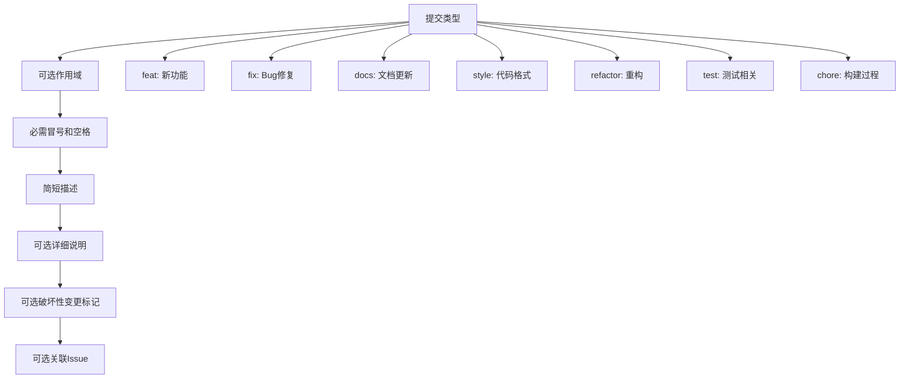
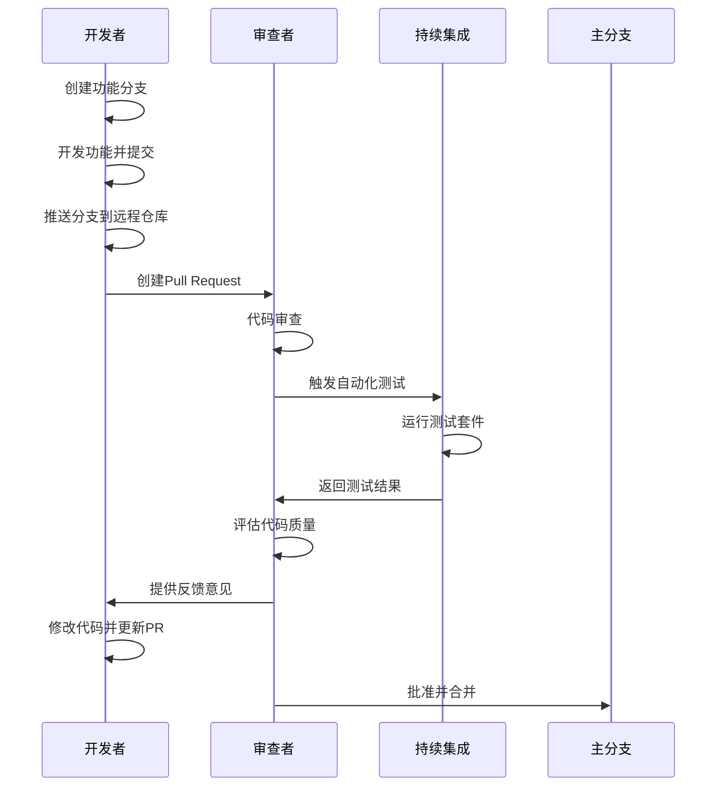
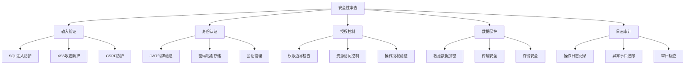
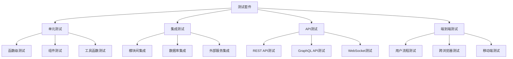
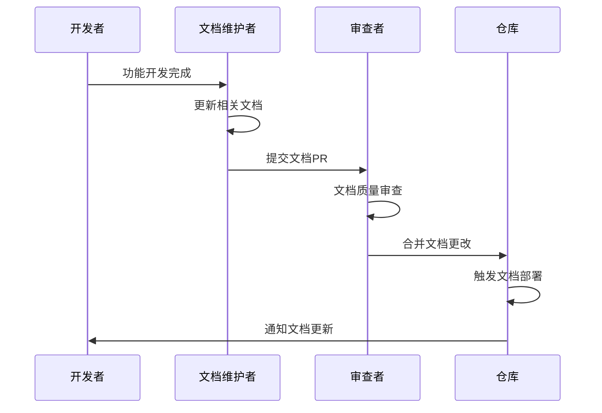
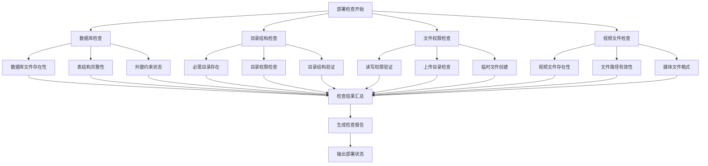
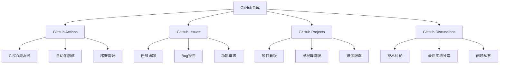

# 团队协作流程

<cite>
**本文档引用的文件**
- [README.md](file://README.md)
- [backend/README-SIMPLE.md](file://backend/README-SIMPLE.md)
- [backend/CONFIG.md](file://backend/CONFIG.md)
- [function_description/README-数据管理功能.md](file://function_description/README-数据管理功能.md)
- [backend/package.json](file://backend/package.json)
- [package.json](file://package.json)
- [backend/scripts/check-deployment.js](file://backend/scripts/check-deployment.js)
- [backend/scripts/database-health-check.js](file://backend/scripts/database-health-check.js)
- [cline_mcp_settings.json](file://cline_mcp_settings.json)
</cite>

## 目录
1. [项目概述](#项目概述)
2. [Git分支管理策略](#git分支管理策略)
3. [提交信息规范](#提交信息规范)
4. [Pull Request审查流程](#pull-request审查流程)
5. [代码审查重点](#代码审查重点)
6. [自动化测试集成](#自动化测试集成)
7. [文档与代码同步机制](#文档与代码同步机制)
8. [部署检查与质量保证](#部署检查与质量保证)
9. [团队协作工具](#团队协作工具)
10. [最佳实践建议](#最佳实践建议)

## 项目概述

兵智世界是一个基于知识图谱的现代化军事武器信息管理与可视化系统，采用前后端分离架构。项目包含多个功能模块，涉及复杂的数据库关系管理和多媒体文件处理。

**项目特点：**
- 前后端分离架构
- 知识图谱可视化功能
- 多媒体文件管理
- 用户认证与权限控制
- 数据导入导出功能

**Section sources**
- [README.md](file://README.md#L1-L50)
- [backend/README-SIMPLE.md](file://backend/README-SIMPLE.md#L1-L30)

## Git分支管理策略

### 分支模型设计

项目采用标准的Git Flow分支模型，结合功能开发和发布管理的最佳实践：


**图表来源**
- [README.md](file://README.md#L1-L100)
- [backend/README-SIMPLE.md](file://backend/README-SIMPLE.md#L1-L50)

### 分支命名规范

| 分支类型 | 命名格式 | 示例 | 用途 |
|---------|---------|------|------|
| 主分支 | `main` | main | 生产环境稳定版本 |
| 开发分支 | `develop` | develop | 日常开发集成 |
| 功能分支 | `feature/{功能名称}` | feature/api-authentication | 新功能开发 |
| 修复分支 | `fix/{问题编号}` | fix/123-login-bug | Bug修复 |
| 发布分支 | `release/v{版本号}` | release/v1.3.1 | 版本发布准备 |
| 热修复分支 | `hotfix/{紧急修复}` | hotfix/security-patch | 紧急安全修复 |

### 分支保护规则

1. **main分支保护**
   - 禁止直接推送
   - 必须通过Pull Request合并
   - 需要至少2名开发者审查
   - 必须通过所有自动化测试

2. **develop分支保护**
   - 禁止直接推送
   - 必须通过代码审查
   - 需要持续集成验证
   - 保持最新状态

3. **功能分支管理**
   - 定期与develop分支同步
   - 保持小而专注的功能范围
   - 及时清理已完成的分支

**Section sources**
- [README.md](file://README.md#L1-L100)
- [backend/README-SIMPLE.md](file://backend/README-SIMPLE.md#L1-L100)

## 提交信息规范

### Conventional Commits规范

项目采用Conventional Commits规范，确保提交信息的结构化和可追溯性：



**图表来源**
- [backend/package.json](file://backend/package.json#L1-L44)

### 提交信息格式

| 类型 | 格式 | 示例 | 说明 |
|------|------|------|------|
| 功能新增 | `feat(scope): description` | `feat(api): 添加用户认证接口` | 新功能开发 |
| Bug修复 | `fix(scope): description` | `fix(auth): 修复登录状态丢失` | Bug修复 |
| 文档更新 | `docs(scope): description` | `docs(readme): 更新部署说明` | 文档相关 |
| 性能优化 | `perf(scope): description` | `perf(api): 优化查询性能` | 性能改进 |
| 重构代码 | `refactor(scope): description` | `refactor(models): 重构数据模型` | 代码重构 |
| 测试相关 | `test(scope): description` | `test(unit): 添加单元测试` | 测试相关 |
| 配置变更 | `chore(scope): description` | `chore(deps): 更新依赖版本` | 配置变更 |

### 提交信息模板

```yaml
# 提交信息模板
type(scope?): subject

body?

footer?

# 类型说明：
# feat: 新功能
# fix: Bug修复
# docs: 文档更新
# style: 代码格式
# refactor: 代码重构
# test: 测试相关
# chore: 构建过程

# Scope（作用域）：可选，描述变更的影响范围
# Subject：简短描述，不超过50字符
# Body：详细说明，每行不超过72字符
# Footer：破坏性变更或关闭Issue
```

**Section sources**
- [backend/package.json](file://backend/package.json#L1-L44)

## Pull Request审查流程

### PR创建标准



**图表来源**
- [backend/scripts/check-deployment.js](file://backend/scripts/check-deployment.js#L1-L50)

### 审查清单

#### 代码质量检查
- [ ] 代码符合项目编码规范
- [ ] 函数和变量命名清晰有意义
- [ ] 适当的注释和文档
- [ ] 无明显性能问题
- [ ] 错误处理完善

#### 功能验证
- [ ] 功能按预期工作
- [ ] 边界条件处理正确
- [ ] 数据验证完整
- [ ] 权限控制正确
- [ ] 日志记录适当

#### 测试覆盖
- [ ] 单元测试通过
- [ ] 集成测试覆盖
- [ ] 性能测试达标
- [ ] 安全扫描通过

### 审查流程步骤

1. **自动检查阶段**
   - 代码格式检查
   - 静态代码分析
   - 依赖安全扫描
   - 性能基准测试

2. **人工审查阶段**
   - 代码逻辑审查
   - 架构设计评估
   - 安全风险评估
   - 可维护性评估

3. **测试验证阶段**
   - 自动化测试运行
   - 手动测试验证
   - 性能回归测试
   - 兼容性测试

4. **最终决策阶段**
   - 审查者批准
   - 最终代码审查
   - 文档更新确认
   - 合并准备就绪

**Section sources**
- [backend/scripts/check-deployment.js](file://backend/scripts/check-deployment.js#L1-L100)
- [backend/scripts/database-health-check.js](file://backend/scripts/database-health-check.js#L1-L50)

## 代码审查重点

### 安全性审查



**图表来源**
- [backend/CONFIG.md](file://backend/CONFIG.md#L1-L100)

### 性能审查要点

#### 数据库操作优化
- 查询语句优化
- 索引使用合理性
- 连接池配置
- 批量操作处理

#### API性能考量
- 响应时间控制
- 并发处理能力
- 缓存策略应用
- 资源使用监控

#### 前端性能优化
- 文件大小控制
- 加载顺序优化
- 渲染性能提升
- 内存使用管理

### 可读性评估标准

#### 代码结构
- 函数长度适中（建议不超过50行）
- 类职责单一明确
- 模块边界清晰
- 依赖关系合理

#### 命名规范
- 变量名语义明确
- 函数名动词开头
- 常量名全大写
- 类名首字母大写

#### 注释质量
- 关键算法说明
- 复杂业务逻辑解释
- 接口使用说明
- 注意事项提醒

**Section sources**
- [backend/CONFIG.md](file://backend/CONFIG.md#L1-L196)

## 自动化测试集成

### 测试框架配置

项目使用Jest作为主要测试框架，配合Supertest进行API测试：



**图表来源**
- [backend/package.json](file://backend/package.json#L6-L10)

### 测试执行流程

#### 开发阶段测试
1. **单元测试**：开发完成后立即运行
2. **代码覆盖率检查**：确保测试覆盖率达到要求
3. **静态分析**：代码质量检查
4. **性能基准测试**：关键路径性能验证

#### 集成阶段测试
1. **持续集成测试**：每次提交触发
2. **自动化回归测试**：核心功能验证
3. **兼容性测试**：多环境验证
4. **安全扫描**：漏洞检测

#### 部署阶段测试
1. **部署验证测试**：确保部署成功
2. **功能验收测试**：业务功能验证
3. **性能压力测试**：负载能力测试
4. **监控告警测试**：系统监控验证

### 测试报告与监控

| 测试类型 | 执行频率 | 报告格式 | 关键指标 |
|----------|----------|----------|----------|
| 单元测试 | 每次提交 | HTML/JSON | 覆盖率、通过率 |
| 集成测试 | 每日构建 | JUnit/XML | 成功次数、失败次数 |
| API测试 | 持续集成 | JSON/HTML | 响应时间、成功率 |
| 性能测试 | 每周 | 图表/报告 | TPS、响应时间 |
| 安全测试 | 每月 | PDF/HTML | 漏洞数量、严重程度 |

**Section sources**
- [backend/package.json](file://backend/package.json#L6-L10)

## 文档与代码同步机制

### 文档更新策略



**图表来源**
- [function_description/README-数据管理功能.md](file://function_description/README-数据管理功能.md#L1-L50)

### 文档分类与更新要求

#### 功能说明文档
- **更新时机**：功能开发完成后
- **更新内容**：API接口说明、使用示例、注意事项
- **审查要求**：技术准确性、示例完整性

#### 部署配置文档
- **更新时机**：配置变更时
- **更新内容**：环境配置、部署步骤、故障排除
- **审查要求**：步骤准确性、兼容性验证

#### 设计架构文档
- **更新时机**：架构变更时
- **更新内容**：系统架构、数据流图、组件关系
- **审查要求**：逻辑一致性、图表准确性

### 文档版本管理

| 文档类型 | 版本控制策略 | 更新频率 | 审查周期 |
|----------|-------------|----------|----------|
| API文档 | 语义化版本 | 功能发布时 | 每次发布 |
| 部署手册 | 时间戳版本 | 配置变更时 | 每月一次 |
| 架构文档 | 小版本控制 | 架构变更时 | 季度审查 |
| 用户指南 | 主版本控制 | 功能重大更新 | 半年审查 |

**Section sources**
- [function_description/README-数据管理功能.md](file://function_description/README-数据管理功能.md#L1-L241)
- [README.md](file://README.md#L1-L522)

## 部署检查与质量保证

### 自动化部署检查

项目提供了完整的部署检查脚本，确保系统在各种环境下的稳定性：



**图表来源**
- [backend/scripts/check-deployment.js](file://backend/scripts/check-deployment.js#L1-L100)

### 质量保证流程

#### 持续集成检查
1. **代码质量检查**
   - ESLint代码规范检查
   - Prettier格式化验证
   - 静态代码分析
   - 安全漏洞扫描

2. **测试验证**
   - 单元测试执行
   - 集成测试运行
   - 性能基准测试
   - 兼容性测试

3. **部署验证**
   - 环境配置检查
   - 依赖版本验证
   - 服务启动测试
   - 功能可用性验证

#### 质量门禁设置

| 检查项目 | 通过标准 | 失败处理 | 重试机制 |
|----------|----------|----------|----------|
| 代码质量 | 无严重违规 | 阻止合并 | 开发者修复后重试 |
| 测试覆盖率 | ≥80% | 阻止合并 | 补充测试后重试 |
| 性能基准 | 基准值±10% | 警告但允许 | 性能优化后重试 |
| 安全扫描 | 无高危漏洞 | 阻止合并 | 漏洞修复后重试 |

**Section sources**
- [backend/scripts/check-deployment.js](file://backend/scripts/check-deployment.js#L1-L260)
- [backend/scripts/database-health-check.js](file://backend/scripts/database-health-check.js#L1-L176)

## 团队协作工具

### GitHub工作流集成

项目集成了多种GitHub协作工具和服务：



**图表来源**
- [cline_mcp_settings.json](file://cline_mcp_settings.json#L1-L37)

### 开发工具配置

#### VS Code扩展推荐
- **GitHub Copilot**：AI代码助手
- **ESLint**：代码质量检查
- **Prettier**：代码格式化
- **GitLens**：Git增强功能
- **Docker**：容器化开发

#### 命令行工具
- **nodemon**：开发服务器热重载
- **jest**：测试运行器
- **eslint**：代码检查
- **prettier**：代码格式化

### 通信协作平台

| 工具类型 | 具体工具 | 用途 | 集成方式 |
|----------|----------|------|----------|
| 即时通讯 | Microsoft Teams | 日常沟通 | 集成GitHub通知 |
| 项目管理 | Jira | 任务跟踪 | GitHub Issues同步 |
| 文档协作 | Confluence | 文档共享 | Markdown同步 |
| 代码审查 | Phabricator | 代码审查 | GitHub PR集成 |
| 持续集成 | Jenkins | 自动化构建 | GitHub Webhook |

**Section sources**
- [cline_mcp_settings.json](file://cline_mcp_settings.json#L1-L37)

## 最佳实践建议

### 开发流程优化

#### 1. 功能开发最佳实践
- **小步快跑**：每次提交功能相对独立
- **及时测试**：开发过程中持续编写测试
- **代码复用**：避免重复代码，建立工具函数库
- **错误处理**：完善的异常处理机制

#### 2. 代码审查最佳实践
- **提前沟通**：复杂功能开发前先讨论设计方案
- **分批审查**：大型功能拆分为多个小PR
- **关注重点**：安全性和性能优先于代码风格
- **建设性反馈**：提供具体的改进建议

#### 3. 测试策略优化
- **测试金字塔**：单元测试占大多数，集成测试适量
- **测试自动化**：关键路径测试完全自动化
- **测试数据管理**：使用测试专用数据库
- **测试环境隔离**：测试环境与生产环境分离

### 团队协作优化

#### 1. 知识共享
- **技术分享**：定期组织技术分享会
- **文档维护**：及时更新技术文档
- **经验总结**：项目结束后进行经验总结
- **最佳实践**：建立团队最佳实践库

#### 2. 质量文化建设
- **质量意识**：全员重视代码质量
- **持续改进**：定期回顾和改进流程
- **工具支持**：提供必要的开发工具
- **培训发展**：定期技术培训和技能提升

#### 3. 风险管理
- **技术债务**：定期评估和偿还技术债务
- **依赖管理**：监控第三方依赖的安全性
- **备份策略**：重要数据定期备份
- **应急响应**：建立应急响应机制

### 性能与安全

#### 性能优化重点
- **数据库优化**：合理使用索引，避免N+1查询
- **API优化**：合理的API设计，避免过度请求
- **前端优化**：资源压缩，懒加载策略
- **缓存策略**：合理使用缓存减少重复计算

#### 安全防护措施
- **输入验证**：所有用户输入都进行验证
- **权限控制**：最小权限原则
- **数据加密**：敏感数据加密存储
- **安全审计**：定期安全审计和漏洞扫描

通过实施这些团队协作流程和最佳实践，可以显著提升开发效率、代码质量和团队协作效果，确保项目能够持续稳定地发展。