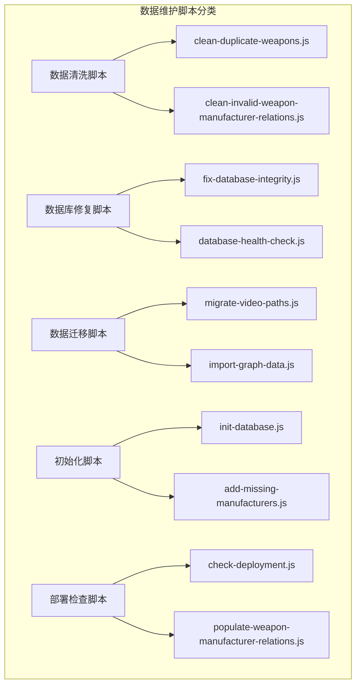
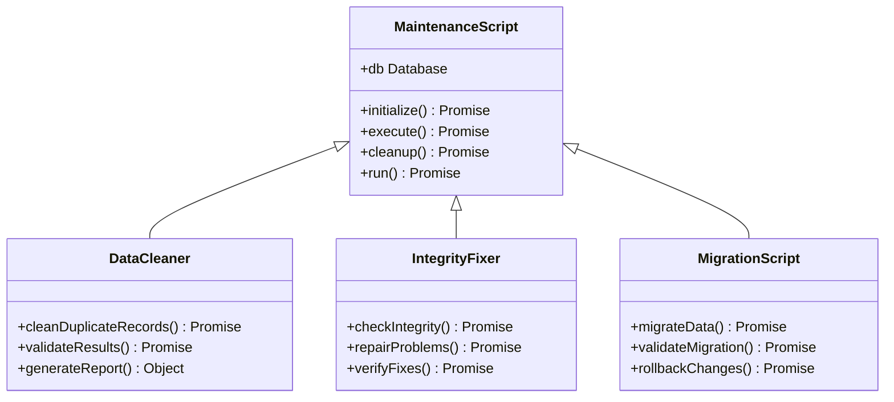
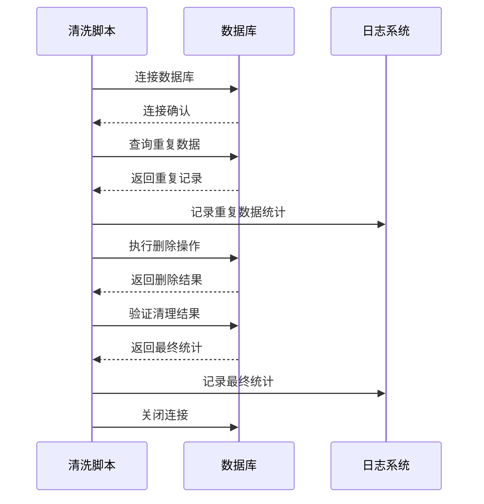
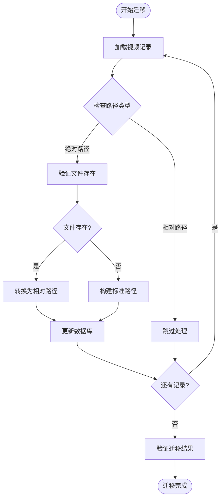
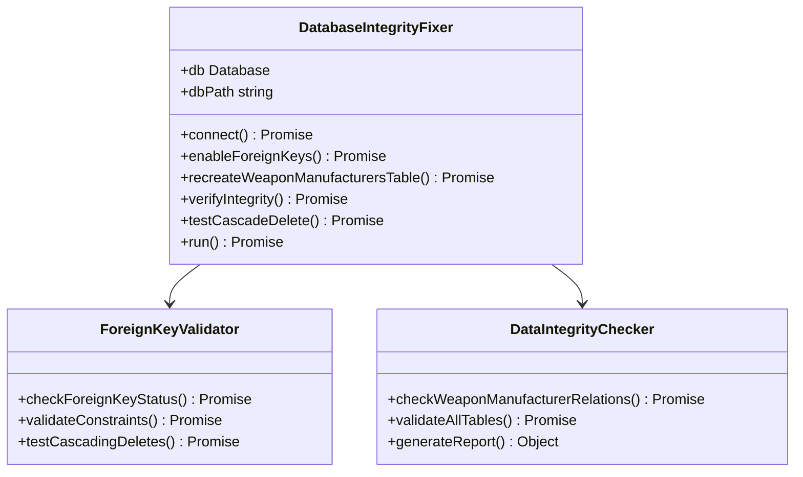
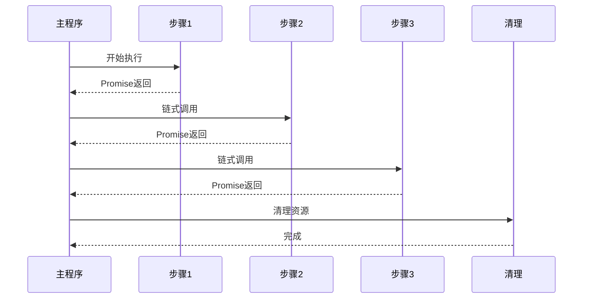
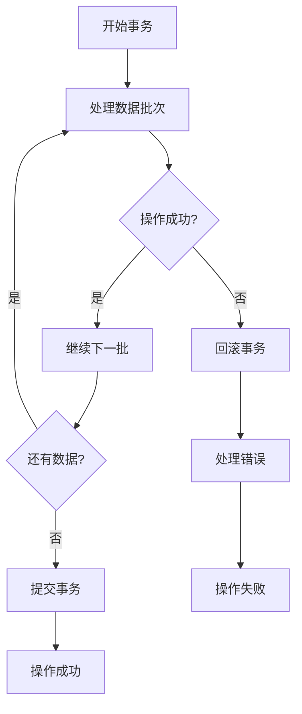
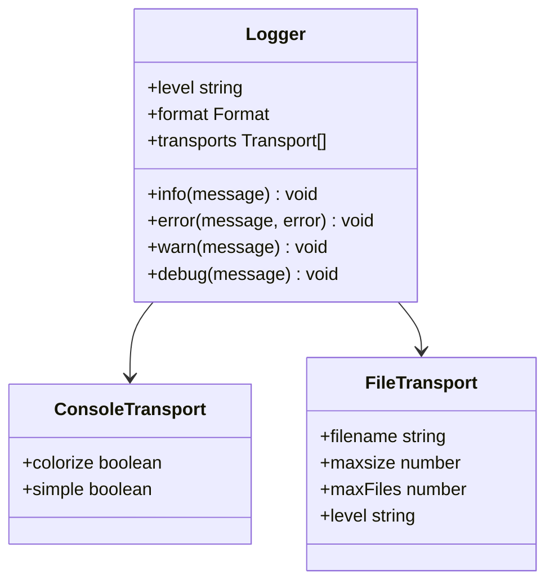
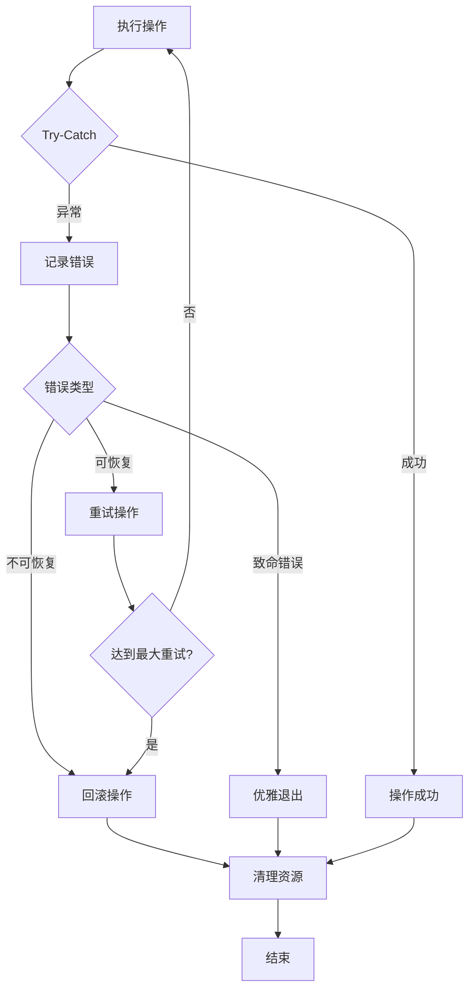
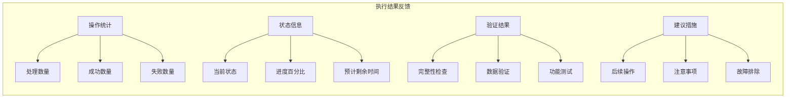

# 数据处理脚本开发范式

<cite>
**本文档中引用的文件**
- [clean-duplicate-weapons.js](file://backend/scripts/clean-duplicate-weapons.js)
- [fix-database-integrity.js](file://backend/scripts/fix-database-integrity.js)
- [database-health-check.js](file://backend/scripts/database-health-check.js)
- [logger.js](file://backend/src/utils/logger.js)
- [init-database.js](file://backend/scripts/init-database.js)
- [add-missing-manufacturers.js](file://backend/scripts/add-missing-manufacturers.js)
- [populate-weapon-manufacturer-relations.js](file://backend/scripts/populate-weapon-manufacturer-relations.js)
- [clean-invalid-weapon-manufacturer-relations.js](file://backend/scripts/clean-invalid-weapon-manufacturer-relations.js)
- [import-graph-data.js](file://backend/scripts/import-graph-data.js)
- [check-deployment.js](file://backend/scripts/check-deployment.js)
- [migrate-video-paths.js](file://backend/scripts/migrate-video-paths.js)
</cite>

## 目录
1. [项目概述](#项目概述)
2. [核心架构设计](#核心架构设计)
3. [数据清洗开发模式](#数据清洗开发模式)
4. [数据库迁移开发模式](#数据库迁移开发模式)
5. [完整性修复开发模式](#完整性修复开发模式)
6. [异步操作管理模式](#异步操作管理模式)
7. [数据库事务处理](#数据库事务处理)
8. [日志记录系统](#日志记录系统)
9. [错误恢复机制](#错误恢复机制)
10. [执行结果反馈](#执行结果反馈)
11. [最佳实践总结](#最佳实践总结)

## 项目概述

兵智世界项目的backend/scripts目录包含了多个专业的数据维护脚本，涵盖了数据清洗、迁移、修复和健康检查等多个方面。这些脚本采用统一的开发范式，确保了代码的一致性、可维护性和可靠性。

### 脚本分类体系

**图表来源**
- [clean-duplicate-weapons.js](file://backend/scripts/clean-duplicate-weapons.js#L1-L113)
- [fix-database-integrity.js](file://backend/scripts/fix-database-integrity.js#L1-L302)
- [database-health-check.js](file://backend/scripts/database-health-check.js#L1-L176)

## 核心架构设计

### 统一的脚本架构模式

所有维护脚本都遵循以下核心架构模式：

**图表来源**
- [clean-duplicate-weapons.js](file://backend/scripts/clean-duplicate-weapons.js#L15-L113)
- [fix-database-integrity.js](file://backend/scripts/fix-database-integrity.js#L5-L302)
- [migrate-video-paths.js](file://backend/scripts/migrate-video-paths.js#L5-L172)

### 通用开发原则

1. **模块化设计**: 每个脚本都是独立的功能模块
2. **错误隔离**: 单个操作失败不影响整体流程
3. **资源管理**: 自动化的连接管理和清理
4. **进度跟踪**: 实时的状态更新和进度报告
5. **结果验证**: 完整的操作结果验证机制

**章节来源**
- [clean-duplicate-weapons.js](file://backend/scripts/clean-duplicate-weapons.js#L1-L113)
- [fix-database-integrity.js](file://backend/scripts/fix-database-integrity.js#L1-L302)

## 数据清洗开发模式

### 批量删除操作的安全执行

以`clean-duplicate-weapons.js`为例，展示了安全的批量删除操作模式：

**图表来源**
- [clean-duplicate-weapons.js](file://backend/scripts/clean-duplicate-weapons.js#L15-L85)

### 清洗操作的核心模式

1. **预检查阶段**: 分析现有数据，识别问题区域
2. **备份策略**: 在关键操作前进行数据备份
3. **增量处理**: 对大量数据进行分批处理
4. **验证机制**: 清理后立即验证结果
5. **回滚准备**: 保留回滚和恢复的能力

**章节来源**
- [clean-duplicate-weapons.js](file://backend/scripts/clean-duplicate-weapons.js#L15-L113)

## 数据库迁移开发模式

### 智能路径迁移实现

`migrate-video-paths.js`展示了数据库迁移的最佳实践：

**图表来源**
- [migrate-video-paths.js](file://backend/scripts/migrate-video-paths.js#L15-L100)

### 迁移脚本的关键特性

1. **智能路径检测**: 自动识别绝对路径和相对路径
2. **容错处理**: 对缺失文件提供替代方案
3. **事务保证**: 使用数据库事务确保一致性
4. **回滚能力**: 支持迁移失败后的回滚操作
5. **验证机制**: 迁移后自动验证文件可用性

**章节来源**
- [migrate-video-paths.js](file://backend/scripts/migrate-video-paths.js#L1-L172)

## 完整性修复开发模式

### 外键约束修复逻辑

`fix-database-integrity.js`展示了数据库完整性修复的完整流程：

**图表来源**
- [fix-database-integrity.js](file://backend/scripts/fix-database-integrity.js#L5-L302)

### 完整性修复的核心步骤

1. **状态检测**: 检查当前数据库状态和约束设置
2. **问题诊断**: 识别具体的完整性问题
3. **修复策略**: 制定针对性的修复方案
4. **渐进修复**: 分步骤实施修复操作
5. **功能测试**: 验证修复后的功能正常性

**章节来源**
- [fix-database-integrity.js](file://backend/scripts/fix-database-integrity.js#L1-L302)

## 异步操作管理模式

### Promise链式调用模式

所有维护脚本都采用Promise链式调用来管理异步操作：

**图表来源**
- [clean-duplicate-weapons.js](file://backend/scripts/clean-duplicate-weapons.js#L85-L113)
- [fix-database-integrity.js](file://backend/scripts/fix-database-integrity.js#L280-L302)

### 异步操作的最佳实践

1. **错误传播**: 确保错误能够正确传播到顶层
2. **资源清理**: 使用finally块确保资源释放
3. **进度跟踪**: 在每个步骤提供进度反馈
4. **超时处理**: 为长时间运行的操作设置超时
5. **并发控制**: 避免不必要的并发操作

**章节来源**
- [clean-duplicate-weapons.js](file://backend/scripts/clean-duplicate-weapons.js#L85-L113)
- [fix-database-integrity.js](file://backend/scripts/fix-database-integrity.js#L280-L302)

## 数据库事务处理

### 事务管理策略

不同类型的脚本采用不同的事务管理策略：

| 脚本类型 | 事务策略 | 示例 |
|---------|---------|------|
| 数据清洗 | 单次提交 | clean-duplicate-weapons.js |
| 完整性修复 | 分步事务 | fix-database-integrity.js |
| 数据导入 | 批量事务 | import-graph-data.js |
| 路径迁移 | 原子操作 | migrate-video-paths.js |

### 事务处理模式

**图表来源**
- [import-graph-data.js](file://backend/scripts/import-graph-data.js#L15-L228)
- [migrate-video-paths.js](file://backend/scripts/migrate-video-paths.js#L40-L80)

**章节来源**
- [import-graph-data.js](file://backend/scripts/import-graph-data.js#L1-L229)
- [migrate-video-paths.js](file://backend/scripts/migrate-video-paths.js#L1-L172)

## 日志记录系统

### 结构化日志记录

`logger.js`提供了完整的日志记录基础设施：

**图表来源**
- [logger.js](file://backend/src/utils/logger.js#L1-L47)

### 日志记录规范

1. **分级记录**: 不同级别的信息使用相应的日志级别
2. **结构化格式**: 统一的时间戳和消息格式
3. **多渠道输出**: 控制台和文件同时输出
4. **错误追踪**: 包含堆栈信息的错误记录
5. **性能监控**: 关键操作的耗时记录

**章节来源**
- [logger.js](file://backend/src/utils/logger.js#L1-L47)

## 错误恢复机制

### 多层错误处理

### 错误恢复策略

1. **自动重试**: 对临时性错误进行指数退避重试
2. **部分回滚**: 只回滚受影响的部分操作
3. **状态恢复**: 恢复到操作前的稳定状态
4. **用户通知**: 向用户提供清晰的错误信息
5. **审计记录**: 记录所有错误和恢复操作

**章节来源**
- [fix-database-integrity.js](file://backend/scripts/fix-database-integrity.js#L280-L302)
- [migrate-video-paths.js](file://backend/scripts/migrate-video-paths.js#L150-L172)

## 执行结果反馈

### 统计报告生成

所有维护脚本都提供详细的执行统计和结果报告：

### 反馈机制设计

1. **实时更新**: 操作过程中的实时状态更新
2. **汇总报告**: 操作完成后的详细统计报告
3. **可视化展示**: 使用颜色和图标增强可读性
4. **历史记录**: 保存操作历史和结果
5. **自动化通知**: 关键事件的自动通知机制

**章节来源**
- [clean-duplicate-weapons.js](file://backend/scripts/clean-duplicate-weapons.js#L85-L113)
- [database-health-check.js](file://backend/scripts/database-health-check.js#L150-L176)

## 最佳实践总结

### 开发规范

1. **统一入口**: 所有脚本都支持直接执行和模块导出
2. **参数验证**: 对输入参数进行严格验证
3. **资源管理**: 自动化的数据库连接和文件句柄管理
4. **错误处理**: 完善的错误捕获和处理机制
5. **文档注释**: 详细的代码注释和使用说明

### 性能优化

1. **批量处理**: 对大数据量操作进行批量处理
2. **索引利用**: 合理使用数据库索引提高查询效率
3. **内存管理**: 避免内存泄漏和过度占用
4. **并发控制**: 合理控制并发度避免系统过载
5. **缓存策略**: 对重复计算的结果进行缓存

### 可维护性

1. **模块化设计**: 功能明确的模块划分
2. **配置分离**: 将配置信息与代码分离
3. **版本兼容**: 保持向后兼容性
4. **测试覆盖**: 提供充分的测试用例
5. **持续改进**: 定期审查和优化代码质量

### 安全考虑

1. **SQL注入防护**: 使用参数化查询防止SQL注入
2. **文件访问控制**: 限制文件系统的访问范围
3. **权限检查**: 验证操作权限和文件权限
4. **敏感信息保护**: 避免在日志中记录敏感信息
5. **审计跟踪**: 记录所有重要操作的审计信息

这些维护脚本体现了现代数据处理的最佳实践，为类似项目提供了宝贵的参考模板。通过统一的架构设计、完善的错误处理和详尽的日志记录，确保了数据维护工作的可靠性和可追溯性。