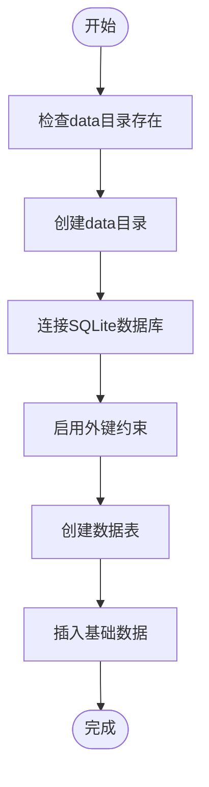
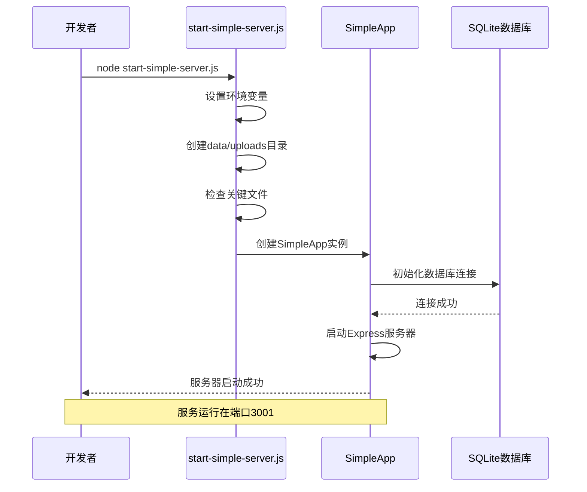

# 环境配置

<cite>
**本文档引用的文件**  
- [package.json](file://backend/package.json)
- [requirements.txt](file://backend/requirements.txt)
- [.env](file://backend/.env)
- [CONFIG.md](file://backend/CONFIG.md)
- [start-simple-server.js](file://start-simple-server.js)
- [database-simple.js](file://backend/src/config/database-simple.js)
- [database_Neo4j.js](file://backend/src/config/database_Neo4j.js)
- [app-simple.js](file://backend/src/app-simple.js)
- [init-db.js](file://backend/init-db.js)
- [config.py](file://backend/config.py)
- [app.py](file://backend/app.py)
- [api.py](file://backend/api.py)
</cite>

## 目录
1. [开发环境搭建](#开发环境搭建)
2. [Node.js依赖安装](#nodejs依赖安装)
3. [Python依赖安装](#python依赖安装)
4. [数据库初始化](#数据库初始化)
5. [多数据库连接配置](#多数据库连接配置)
6. [环境变量配置](#环境变量配置)
7. [简易服务启动](#简易服务启动)
8. [常见问题解决方案](#常见问题解决方案)

## 开发环境搭建

本项目为前后端一体化系统，前端基于HTML/CSS/JavaScript，后端包含Node.js和Python双服务架构。开发环境搭建需完成以下步骤：
1. 安装Node.js（v16+）和Python（v3.8+）
2. 配置包管理工具npm和pip
3. 安装项目依赖
4. 初始化数据库
5. 配置环境变量
6. 启动服务

**Section sources**
- [package.json](file://backend/package.json)
- [requirements.txt](file://backend/requirements.txt)
- [start-simple-server.js](file://start-simple-server.js)

## Node.js依赖安装

通过`package.json`文件管理Node.js依赖，执行以下命令安装：

```bash
# 进入后端目录
cd backend

# 安装生产依赖
npm install

# 或使用yarn
yarn install
```

根据`package.json`文件，项目依赖包括：
- **express**: Web服务器框架
- **better-sqlite3**: SQLite数据库驱动
- **dotenv**: 环境变量管理
- **jsonwebtoken**: JWT身份验证
- **cors**: 跨域资源共享
- **winston**: 日志记录
- **express-rate-limit**: API限流

开发依赖包括：
- **nodemon**: 开发服务器热重载
- **jest**: 测试框架

安装完成后，可使用`npm run dev`启动开发服务器。

**Section sources**
- [package.json](file://backend/package.json)

## Python依赖安装

通过`requirements.txt`文件管理Python依赖，执行以下命令安装：

```bash
# 进入后端目录
cd backend

# 创建虚拟环境（推荐）
python -m venv venv
source venv/bin/activate  # Linux/Mac
venv\Scripts\activate     # Windows

# 安装依赖
pip install -r requirements.txt
```

根据`requirements.txt`文件，Python依赖包括：
- **flask**: Web框架
- **flask-sqlalchemy**: ORM数据库操作
- **flask-cors**: 跨域支持
- **python-dotenv**: 环境变量管理
- **Werkzeug**: WSGI工具库

**Section sources**
- [requirements.txt](file://backend/requirements.txt)
- [config.py](file://backend/config.py)
- [app.py](file://backend/app.py)

## 数据库初始化

项目支持SQLite和Neo4j两种数据库，初始化方法如下：

### SQLite数据库初始化

使用`init-db.js`脚本初始化SQLite数据库：

```bash
# 进入后端目录
cd backend

# 执行初始化脚本
node init-db.js
```

或使用`scripts/init-database.js`进行完整初始化：

```bash
node scripts/init-database.js
```

该脚本会创建`data/military-knowledge.db`数据库文件，并初始化以下数据表：
- users: 用户表
- weapons: 武器表
- categories: 武器类别表
- countries: 国家表
- manufacturers: 制造商表
- weapon_manufacturers: 武器-制造商关联表

### Neo4j数据库初始化

Neo4j数据库通过`import-graph-data.js`脚本初始化：

```bash
# 导入图数据
node scripts/import-graph-data.js
```

需要确保Neo4j服务已启动，并在`.env`文件中正确配置连接参数。



**Diagram sources**
- [init-db.js](file://backend/init-db.js)
- [database-simple.js](file://backend/src/config/database-simple.js)

**Section sources**
- [init-db.js](file://backend/init-db.js)
- [database-simple.js](file://backend/src/config/database-simple.js)

## 多数据库连接配置

根据`CONFIG.md`文件，项目支持多数据库连接配置，主要通过`src/config/`目录下的配置文件实现。

### SQLite配置

`database-simple.js`文件配置SQLite连接：

```javascript
const dbPath = path.join(__dirname, '../../data/military-knowledge.db');
```

该配置会自动创建`data`目录和数据库文件，启用外键约束，并初始化所有数据表。

### Neo4j及其他数据库配置

`database_Neo4j.js`文件配置多数据库连接：

```javascript
// Neo4j配置
NEO4J_URI=bolt://localhost:7687
NEO4J_USERNAME=neo4j
NEO4J_PASSWORD=neo4j123456

// MongoDB配置
MONGODB_URI=mongodb://localhost:27017/military-knowledge

// Redis配置
REDIS_HOST=localhost
REDIS_PORT=6379
```

通过`DatabaseManager`类统一管理多个数据库连接：

```mermaid
classDiagram
class DatabaseManager {
+neo4jDriver
+mongoClient
+redisClient
+connectNeo4j() Promise
+connectMongoDB() Promise
+connectRedis() Promise
+connectAll() Promise
+closeAll() Promise
}
class SimpleDatabaseManager {
+db
+cache
+connect() Promise
+initializeTables() Promise
+close() Promise
}
DatabaseManager --> "Neo4j" : 使用
DatabaseManager --> "MongoDB" : 使用
DatabaseManager --> "Redis" : 使用
SimpleDatabaseManager --> "SQLite" : 使用
```

**Diagram sources**
- [database_Neo4j.js](file://backend/src/config/database_Neo4j.js)
- [database-simple.js](file://backend/src/config/database-simple.js)

**Section sources**
- [CONFIG.md](file://backend/CONFIG.md)
- [database_Neo4j.js](file://backend/src/config/database_Neo4j.js)
- [database-simple.js](file://backend/src/config/database-simple.js)

## 环境变量配置

环境变量通过`.env`文件配置，项目启动时自动加载。

### 主要配置项

| 配置项 | 说明 | 默认值 |
|-------|------|-------|
| PORT | 服务器端口 | 3001 |
| NODE_ENV | 运行环境 | development |
| JWT_SECRET | JWT密钥 | your-super-secret-jwt-key-here |
| JWT_EXPIRES_IN | JWT过期时间 | 7d |
| NEO4J_URI | Neo4j连接地址 | bolt://localhost:7687 |
| NEO4J_USERNAME | Neo4j用户名 | neo4j |
| NEO4J_PASSWORD | Neo4j密码 | neo4j123456 |
| UPLOAD_PATH | 上传文件路径 | uploads/ |
| MAX_FILE_SIZE | 最大文件大小 | 10485760 |

### 生产环境配置建议

根据`CONFIG.md`文件，生产环境应修改以下配置：

```bash
# 生产环境配置
NODE_ENV=production
PORT=3001
JWT_SECRET=生产环境强密钥（32位以上）
LOG_LEVEL=warn
RATE_LIMIT_WINDOW_MS=600000
RATE_LIMIT_MAX_REQUESTS=50
```

JWT密钥生成方法：
```bash
# 使用Node.js生成32位密钥
node -e "console.log(require('crypto').randomBytes(32).toString('hex'))"
```

**Section sources**
- [.env](file://backend/.env)
- [CONFIG.md](file://backend/CONFIG.md)

## 简易服务启动

通过`start-simple-server.js`脚本启动简化版服务：

```bash
# 启动服务
node start-simple-server.js
```

该脚本会：
1. 设置环境变量
2. 创建必要目录（data、uploads）
3. 检查关键文件存在性
4. 启动基于SQLite的后端服务

服务启动后，可通过以下端点访问：
- 健康检查: `http://localhost:3001/health`
- API文档: `http://localhost:3001/api`
- 武器管理: `http://localhost:3001/api/weapons`



**Diagram sources**
- [start-simple-server.js](file://start-simple-server.js)
- [app-simple.js](file://backend/src/app-simple.js)

**Section sources**
- [start-simple-server.js](file://start-simple-server.js)
- [app-simple.js](file://backend/src/app-simple.js)

## 常见问题解决方案

### 端口冲突

**问题**: `EADDRINUSE: address already in use`
**解决方案**:
1. 修改`.env`文件中的PORT配置
```bash
PORT=8080
```
2. 或关闭占用端口的程序
```bash
# 查找占用3001端口的进程
lsof -i :3001  # Mac/Linux
netstat -ano | findstr :3001  # Windows
```

### 依赖版本不兼容

**问题**: npm包版本冲突
**解决方案**:
1. 清除缓存并重新安装
```bash
cd backend
rm -rf node_modules package-lock.json
npm cache clean --force
npm install
```
2. 使用特定版本
```bash
npm install express@4.18.2
```

### 数据库权限问题

**问题**: `EACCES: permission denied`
**解决方案**:
```bash
# 确保data目录有写入权限
mkdir -p backend/data
chmod 755 backend/data
```

### JWT密钥过短警告

**问题**: `JWT secret should be at least 32 characters`
**解决方案**:
```bash
# 生成32位以上密钥
node -e "console.log(require('crypto').randomBytes(32).toString('hex'))"
```

### Python环境问题

**问题**: 模块导入错误
**解决方案**:
1. 确保虚拟环境激活
2. 重新安装依赖
```bash
pip install --upgrade pip
pip install -r requirements.txt
```

**Section sources**
- [CONFIG.md](file://backend/CONFIG.md)
- [.env](file://backend/.env)
- [package.json](file://backend/package.json)
- [requirements.txt](file://backend/requirements.txt)