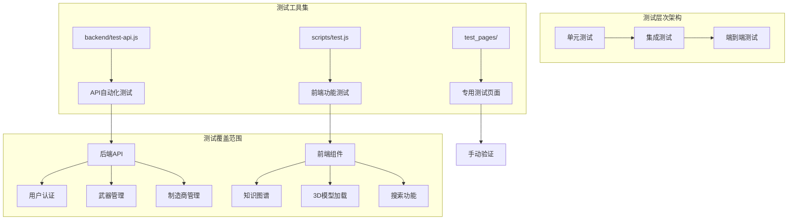
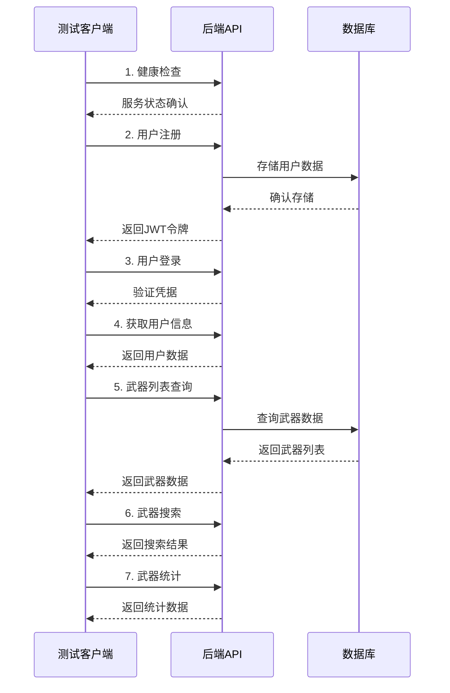
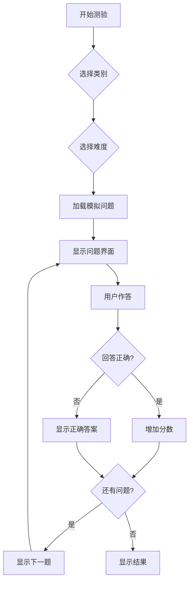
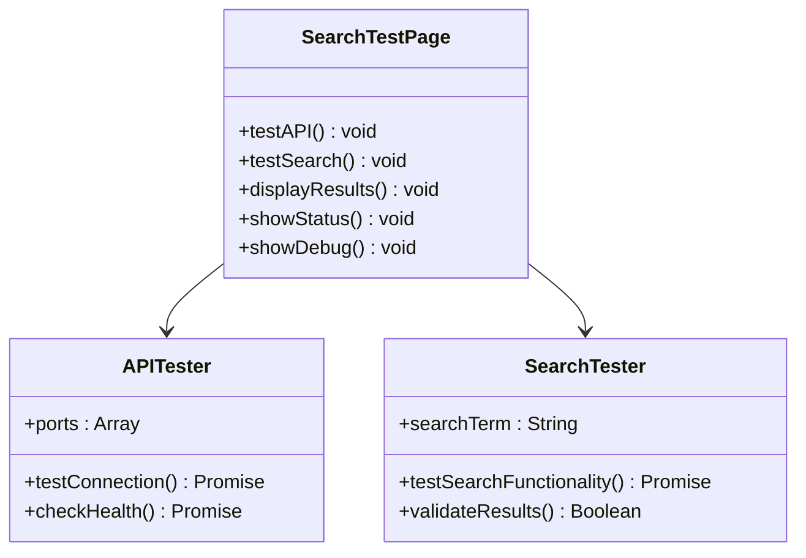
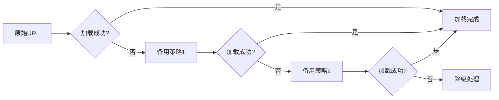
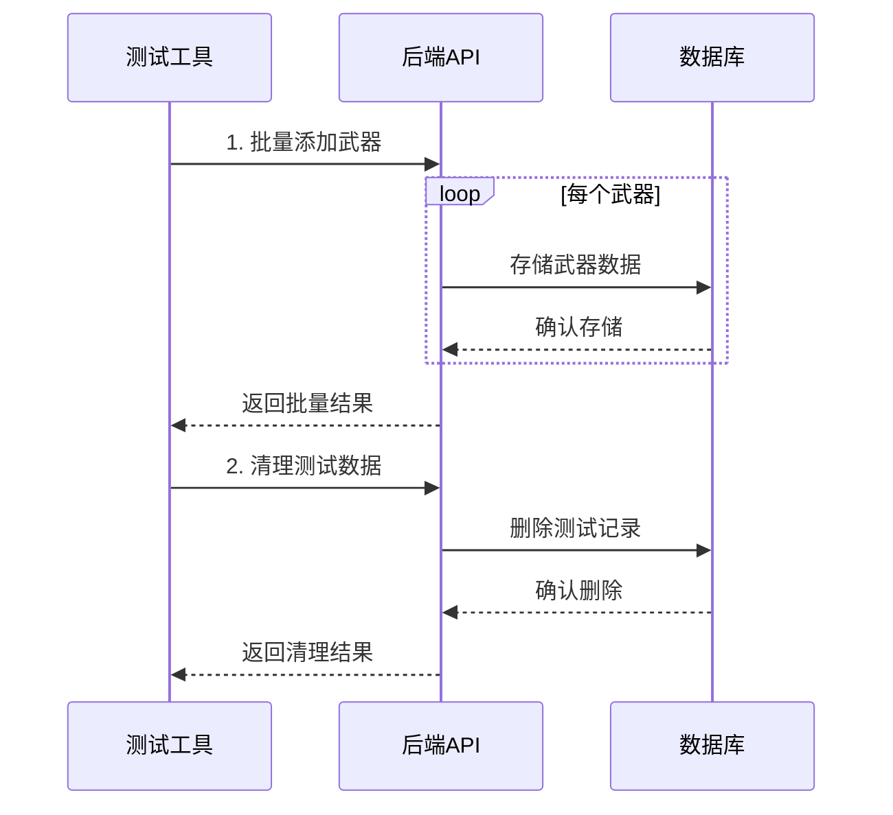
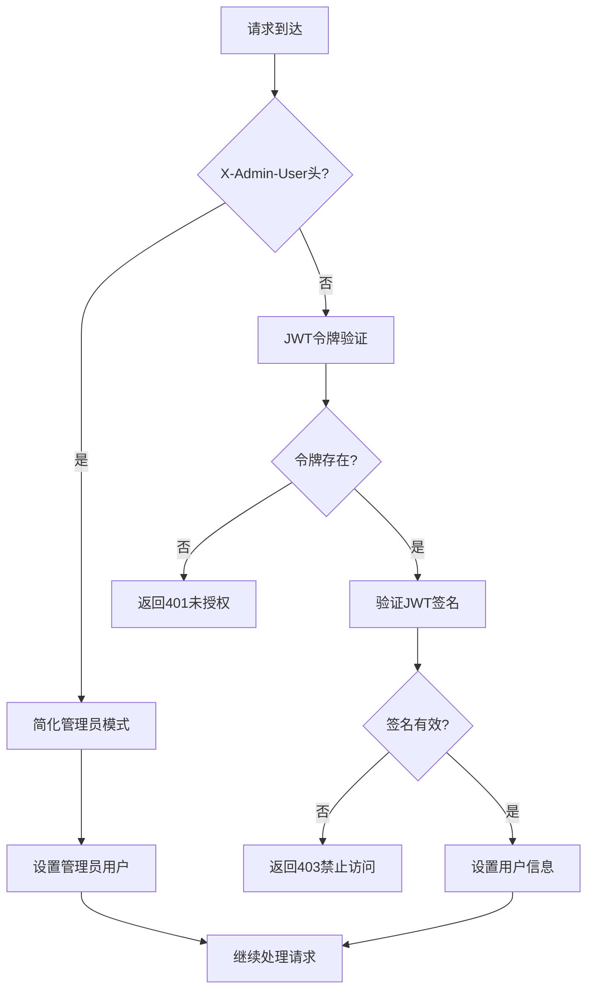

# 测试策略

<cite>
**本文档引用的文件**
- [backend/test-api.js](file://backend/test-api.js)
- [scripts/test.js](file://scripts/test.js)
- [test_pages/test-weapon-search.html](file://test_pages/test-weapon-search.html)
- [test_pages/test-model-loading.html](file://test_pages/test-model-loading.html)
- [test_pages/test-data-management.html](file://test_pages/test-data-management.html)
- [test_pages/test-frontend-backend.html](file://test_pages/test-frontend-backend.html)
- [test_pages/test-manufacturer-api.html](file://test_pages/test-manufacturer-api.html)
- [package.json](file://package.json)
- [test-api.json](file://test-api.json)
- [backend/src/middleware/auth.js](file://backend/src/middleware/auth.js)
</cite>

## 目录
1. [概述](#概述)
2. [测试体系架构](#测试体系架构)
3. [后端API自动化测试](#后端api自动化测试)
4. [前端核心逻辑测试](#前端核心逻辑测试)
5. [专用测试页面](#专用测试页面)
6. [测试数据管理](#测试数据管理)
7. [JWT认证与安全测试](#jwt认证与安全测试)
8. [测试最佳实践](#测试最佳实践)
9. [测试环境配置](#测试环境配置)
10. [测试覆盖率目标](#测试覆盖率目标)

## 概述

兵智世界v1.3采用多层次测试策略，涵盖单元测试、集成测试和端到端测试。测试体系包括自动化API测试、前端功能测试、专用测试页面以及手动验证工具，确保系统的稳定性、可靠性和安全性。

### 测试目标

- **功能完整性**：验证所有核心功能模块的正确性
- **性能稳定性**：确保系统在各种负载下的稳定运行
- **安全性保障**：验证JWT认证、权限控制等安全机制
- **数据一致性**：保证数据操作的完整性和一致性
- **用户体验**：确保前端交互的流畅性和响应性

## 测试体系架构



**图表来源**
- [backend/test-api.js](file://backend/test-api.js#L1-L129)
- [scripts/test.js](file://scripts/test.js#L1-L905)
- [test_pages/test-weapon-search.html](file://test_pages/test-weapon-search.html#L1-L280)

## 后端API自动化测试

### test-api.js自动化测试框架

兵智世界提供了专门的后端API自动化测试工具，能够全面验证RESTful API的功能和性能。

#### 测试流程设计



**图表来源**
- [backend/test-api.js](file://backend/test-api.js#L15-L128)

#### 关键测试功能

1. **健康检查测试**：验证服务器运行状态和数据库连接
2. **用户认证测试**：注册、登录、令牌验证全流程
3. **数据查询测试**：武器列表、详情、搜索、统计功能
4. **异步处理测试**：网络请求超时、错误处理机制
5. **断言验证**：响应状态码、数据格式、业务逻辑验证

#### JWT认证模拟

测试工具内置了完整的JWT认证流程，包括：
- 用户注册后自动生成测试令牌
- 令牌有效期验证
- 权限级别检查
- 异常情况处理（过期令牌、无效令牌）

**章节来源**
- [backend/test-api.js](file://backend/test-api.js#L1-L129)

## 前端核心逻辑测试

### scripts/test.js军事测验功能测试

前端核心逻辑测试主要集中在军事知识测验功能，通过模拟用户交互验证核心业务逻辑。

#### 测验功能测试架构



**图表来源**
- [scripts/test.js](file://scripts/test.js#L1-L905)

#### 核心测试功能

1. **问题加载测试**：验证模拟数据生成和随机排序
2. **答案验证测试**：检查正确答案判断逻辑
3. **计时器测试**：验证倒计时功能和超时处理
4. **提示功能测试**：测试提示使用次数和显示逻辑
5. **成绩计算测试**：验证分数统计和勋章系统

#### Mock数据构建

测试系统使用静态模拟数据，包含：
- **武器类**：12个不同类型的问题
- **历史类**：12个军事历史相关问题  
- **战略类**：12个军事理论问题
- **国家类**：12个国际关系问题

每类问题包含：
- 正确答案索引
- 图片资源路径
- 提示信息
- 选项数组

**章节来源**
- [scripts/test.js](file://scripts/test.js#L1-L905)

## 专用测试页面

### test-weapon-search.html武器搜索功能测试

专门的搜索功能测试页面提供了实时的API连接测试和搜索功能验证。

#### 测试功能模块



**图表来源**
- [test_pages/test-weapon-search.html](file://test_pages/test-weapon-search.html#L1-L280)

#### 关键测试特性

1. **多端口连接测试**：同时测试多个API端口
2. **实时搜索验证**：验证搜索功能的响应性
3. **错误处理测试**：模拟网络异常和API错误
4. **结果验证**：检查搜索结果的完整性和准确性

### test-model-loading.html 3D模型加载测试

3D模型加载测试专注于验证3D模型的加载、渲染和跨平台兼容性。

#### 加载策略测试



**图表来源**
- [test_pages/test-model-loading.html](file://test_pages/test-model-loading.html#L1-L330)

#### 测试项目分类

1. **后端路径查找**：验证文件路径解析和访问权限
2. **URL验证功能**：测试HTTP HEAD请求和响应验证
3. **备用加载策略**：多种加载方案的容错处理
4. **完整加载测试**：Three.js场景创建和模型渲染

**章节来源**
- [test_pages/test-weapon-search.html](file://test_pages/test-weapon-search.html#L1-L280)
- [test_pages/test-model-loading.html](file://test_pages/test-model-loading.html#L1-L330)

## 测试数据管理

### test-data-management.html数据管理功能测试

数据管理测试页面提供了全面的CRUD操作测试，验证武器和制造商数据的完整管理流程。

#### 数据操作测试矩阵

| 测试功能 | 接口路径 | 方法 | 验证要点 |
|---------|----------|------|----------|
| 服务器连接 | /health | GET | 服务状态、数据库类型 |
| 武器列表 | /weapons | GET | 分页、过滤、排序 |
| 武器搜索 | /weapons/search | GET | 模糊匹配、结果数量 |
| 武器统计 | /weapons/statistics | GET | 总数、分类统计 |
| 添加武器 | /weapons | POST | 权限验证、数据验证 |
| 添加制造商 | /manufacturers | POST | 数据完整性、关联关系 |

#### 批量操作测试



**图表来源**
- [test_pages/test-data-management.html](file://test_pages/test-data-management.html#L1-L490)

#### 数据隔离与可重复性

测试系统确保：
- **独立测试环境**：使用唯一标识符避免数据冲突
- **事务回滚**：测试失败时自动清理数据
- **幂等性保证**：多次执行结果一致
- **数据备份**：重要测试前备份原始数据

**章节来源**
- [test_pages/test-data-management.html](file://test_pages/test-data-management.html#L1-L490)

## JWT认证与安全测试

### 认证中间件测试

兵智世界实现了完整的JWT认证机制，支持简化管理员模式和标准JWT验证。

#### 认证流程测试



**图表来源**
- [backend/src/middleware/auth.js](file://backend/src/middleware/auth.js#L1-L48)

#### 安全测试重点

1. **令牌有效性验证**：测试过期、篡改、伪造令牌
2. **权限控制测试**：验证角色级别的访问控制
3. **CSRF防护**：测试跨站请求伪造防护机制
4. **输入验证**：验证恶意输入的处理
5. **错误处理**：测试安全错误信息的返回

**章节来源**
- [backend/src/middleware/auth.js](file://backend/src/middleware/auth.js#L1-L48)

## 测试最佳实践

### 编写新测试用例指南

#### 测试用例结构规范

```javascript
// 测试用例模板
describe('功能模块名称', () => {
    beforeEach(async () => {
        // 测试前置条件
        await setupTestEnvironment();
    });
    
    afterEach(async () => {
        // 测试清理工作
        await cleanupTestData();
    });
    
    test('测试场景描述', async () => {
        // Arrange - 准备阶段
        const testData = generateTestData();
        
        // Act - 执行阶段
        const result = await executeTestFunction(testData);
        
        // Assert - 断言阶段
        expect(result).toBe(expectedValue);
        expect(result.status).toBe(200);
    });
});
```

#### Mock数据构建原则

1. **真实性**：模拟数据应反映真实业务场景
2. **完整性**：包含所有必要的字段和关联关系
3. **一致性**：保持数据格式和约束的一致性
4. **可预测性**：确保测试结果的可重复性

#### 异步操作处理

```javascript
// 异步测试最佳实践
test('异步API调用测试', async () => {
    // 使用Promise.all处理并发请求
    const [userResponse, weaponsResponse] = await Promise.all([
        fetch('/api/users'),
        fetch('/api/weapons')
    ]);
    
    // 使用try-catch处理可能的异常
    try {
        const result = await processAsyncOperation();
        expect(result).toBeDefined();
    } catch (error) {
        expect(error).toBeInstanceOf(Error);
    }
});
```

### 测试覆盖率目标

#### 功能覆盖率要求

| 模块类型 | 最低覆盖率 | 目标覆盖率 | 优先级 |
|---------|-----------|-----------|--------|
| 核心业务逻辑 | 80% | 90% | 高 |
| API接口 | 75% | 85% | 高 |
| 用户认证 | 90% | 95% | 最高 |
| 数据管理 | 70% | 80% | 中 |
| 前端组件 | 60% | 75% | 中 |

#### 代码质量指标

- **圈复杂度**：控制在10以内
- **测试用例数量**：每个功能至少2个测试用例
- **边界条件覆盖**：包含正常、异常、边界三种情况
- **错误处理测试**：验证所有可能的错误场景

## 测试环境配置

### 本地开发环境

#### 环境要求

```json
{
    "node_version": ">=16.0.0",
    "dependencies": {
        "axios": "^1.0.0",
        "node-fetch": "^3.3.2"
    },
    "ports": {
        "backend": 3001,
        "frontend": 3000
    }
}
```

#### 启动顺序

1. **启动后端服务**：`cd backend && npm run dev`
2. **启动前端服务**：`node start-simple-server.js`
3. **运行API测试**：`node backend/test-api.js`
4. **运行前端测试**：打开相应测试页面

### 测试数据准备

#### 数据库初始化

```sql
-- 测试数据库初始化脚本
CREATE TABLE IF NOT EXISTS test_users (
    id INTEGER PRIMARY KEY AUTOINCREMENT,
    username TEXT UNIQUE NOT NULL,
    email TEXT UNIQUE NOT NULL,
    password_hash TEXT NOT NULL,
    created_at TIMESTAMP DEFAULT CURRENT_TIMESTAMP
);

-- 插入测试用户
INSERT OR IGNORE INTO test_users (username, email, password_hash) 
VALUES ('testuser', 'test@example.com', '$2b$10$...');
```

#### 环境变量配置

```bash
# 测试环境配置
export NODE_ENV=test
export TEST_DB_PATH=./test.db
export JWT_SECRET=test_secret_key
export API_BASE_URL=http://localhost:3001
```

**章节来源**
- [package.json](file://package.json#L1-L7)

## 结论

兵智世界v1.3的测试策略通过多层次、全方位的测试覆盖，确保了系统的高质量和稳定性。自动化测试工具、专用测试页面和手动验证相结合，形成了完整的测试闭环。

### 主要优势

1. **全面覆盖**：从API接口到前端交互的完整测试链
2. **自动化程度高**：减少人工干预，提高测试效率
3. **易于扩展**：模块化设计便于添加新的测试用例
4. **可视化反馈**：直观的测试结果展示和调试信息

### 持续改进方向

1. **测试自动化**：引入CI/CD集成，实现持续测试
2. **性能测试**：增加压力测试和性能监控
3. **安全测试**：加强安全漏洞扫描和渗透测试
4. **用户体验测试**：引入用户行为分析和体验评估

通过遵循本文档的测试策略和最佳实践，开发团队可以确保兵智世界v1.3的质量和可靠性，为用户提供优质的军事知识学习体验。