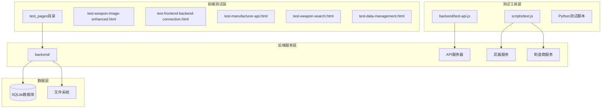
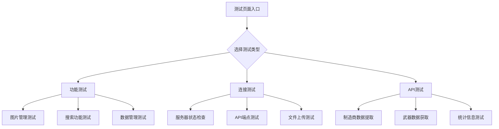
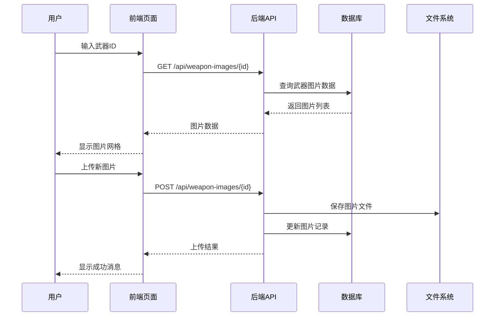
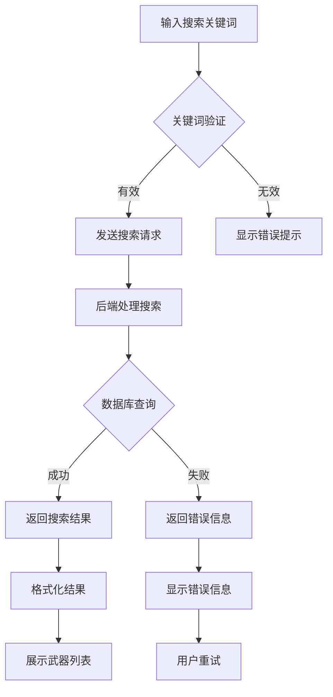
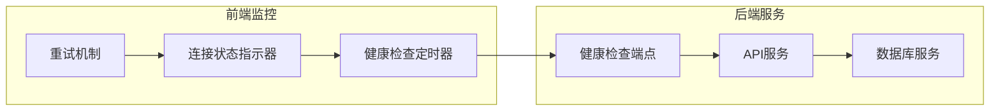
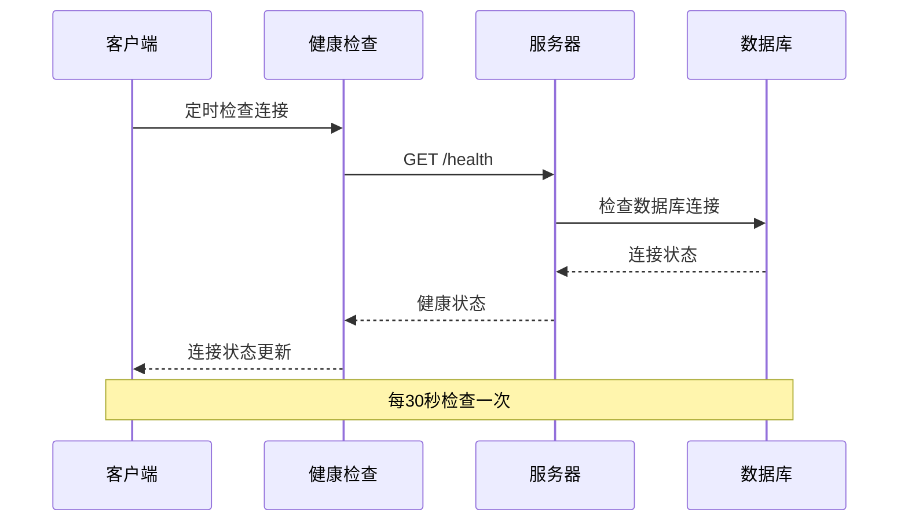
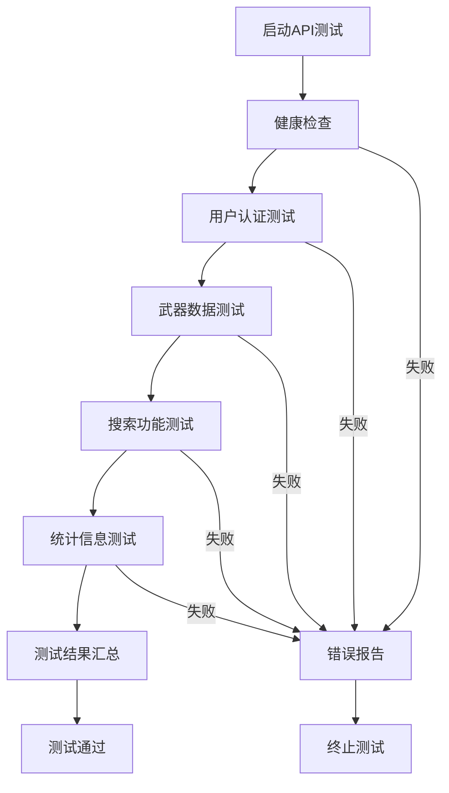
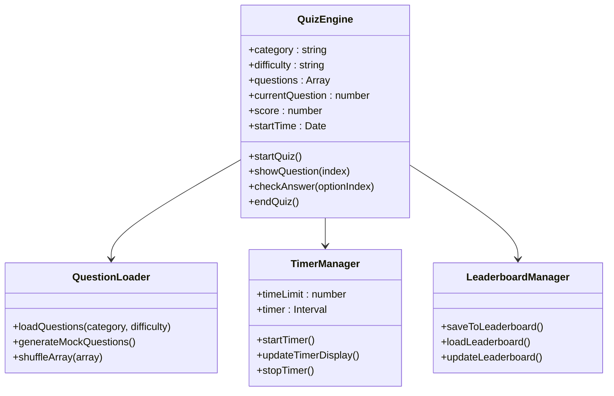
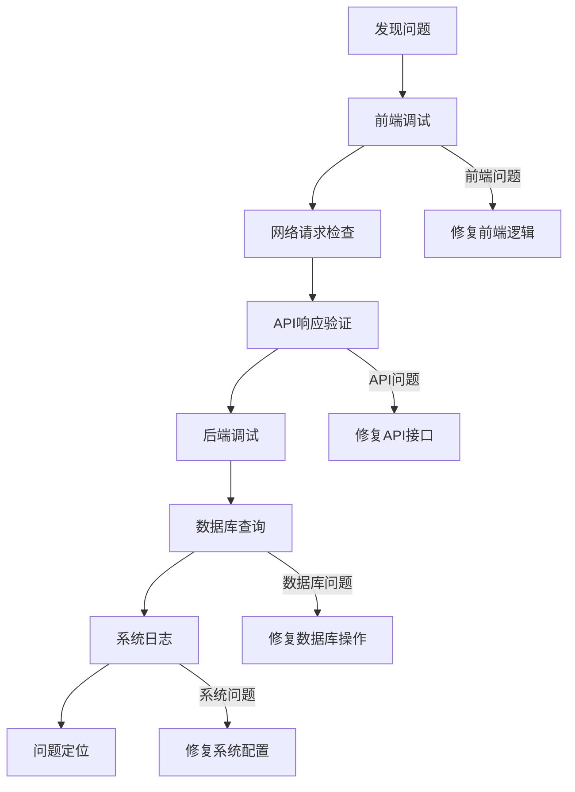
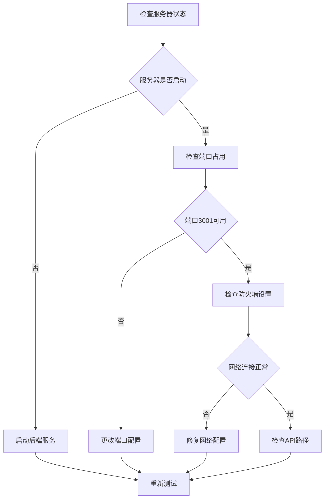

# 调试与测试

<cite>
**本文档引用的文件**
- [test-weapon-image-enhanced.html](file://test_pages/test-weapon-image-enhanced.html)
- [test-frontend-backend-connection.html](file://test_pages/test-frontend-backend-connection.html)
- [test-manufacturer-api.html](file://test_pages/test-manufacturer-api.html)
- [test-weapon-search.html](file://test_pages/test-weapon-search.html)
- [test-data-management.html](file://test_pages/test-data-management.html)
- [test-api.js](file://backend/test-api.js)
- [test.js](file://scripts/test.js)
- [武器图片功能修复说明.md](file://function_description/武器图片功能修复说明.md)
- [前后端连接实现说明.md](file://function_description/前后端连接实现说明.md)
- [package.json](file://backend/package.json)
</cite>

## 目录
1. [项目概述](#项目概述)
2. [测试页面架构](#测试页面架构)
3. [功能验证测试](#功能验证测试)
4. [前后端连接测试](#前后端连接测试)
5. [API测试与调试](#api测试与调试)
6. [缺陷模式分析](#缺陷模式分析)
7. [最佳实践指南](#最佳实践指南)
8. [故障排除](#故障排除)
9. [总结](#总结)

## 项目概述

兵智世界项目是一个军事武器知识管理系统，采用前后端分离架构，包含完整的用户认证、武器数据管理和媒体资源管理功能。项目提供了丰富的测试页面和调试工具，帮助开发者验证系统功能和排查问题。

### 技术架构概览



**图表来源**
- [test-weapon-image-enhanced.html](file://test_pages/test-weapon-image-enhanced.html#L1-L50)
- [test-frontend-backend-connection.html](file://test_pages/test-frontend-backend-connection.html#L1-L50)
- [backend/test-api.js](file://backend/test-api.js#L1-L30)

## 测试页面架构

### 测试页面分类

项目包含多个专门的测试页面，每个页面针对特定功能模块进行验证：

| 测试页面 | 功能范围 | 主要测试目标 |
|---------|----------|-------------|
| test-weapon-image-enhanced.html | 武器图片管理 | 图片上传、编辑、删除、预览功能 |
| test-frontend-backend-connection.html | 前后端连接 | API连通性、数据传输、错误处理 |
| test-manufacturer-api.html | 制造商API | 数据提取、统计分析、连接稳定性 |
| test-weapon-search.html | 武器搜索 | 搜索功能、结果过滤、性能测试 |
| test-data-management.html | 数据管理 | CRUD操作、批量处理、数据完整性 |

### 测试页面结构



**节来源**
- [test-weapon-image-enhanced.html](file://test_pages/test-weapon-image-enhanced.html#L1-L100)
- [test-frontend-backend-connection.html](file://test_pages/test-frontend-backend-connection.html#L1-L100)

## 功能验证测试

### 武器图片功能测试

武器图片功能是项目的核心特性之一，测试页面提供了完整的图片管理功能验证：

#### 测试流程



**图表来源**
- [test-weapon-image-enhanced.html](file://test_pages/test-weapon-image-enhanced.html#L400-L500)
- [test-weapon-image-enhanced.html](file://test_pages/test-weapon-image-enhanced.html#L600-L700)

#### 关键测试点

1. **图片上传功能**
   - 支持多种图片格式（JPG、PNG、GIF、WebP）
   - 文件大小限制（最大5MB）
   - 图片描述功能
   - 上传进度显示

2. **图片管理功能**
   - 图片编辑（修改描述）
   - 图片删除（带确认提示）
   - 图片预览（放大缩小）
   - 图片下载

3. **错误处理**
   - 网络连接失败处理
   - 文件格式错误提示
   - 权限不足错误处理
   - 数据库连接错误

**节来源**
- [test-weapon-image-enhanced.html](file://test_pages/test-weapon-image-enhanced.html#L300-L450)

### 武器搜索功能测试

搜索功能测试验证系统的检索能力和响应性能：

#### 搜索测试流程



**图表来源**
- [test-weapon-search.html](file://test_pages/test-weapon-search.html#L100-L200)

**节来源**
- [test-weapon-search.html](file://test_pages/test-weapon-search.html#L1-L100)

## 前后端连接测试

### 连接状态监控

系统提供了实时的连接状态监控功能，确保前后端通信正常：

#### 连接测试架构



**图表来源**
- [test-frontend-backend-connection.html](file://test_pages/test-frontend-backend-connection.html#L200-L250)

#### 测试项目

| 测试项目 | API端点 | 测试目的 | 验证内容 |
|---------|---------|----------|----------|
| 服务器状态检查 | GET /health | 服务可用性 | 服务器运行状态、数据库连接 |
| API端点测试 | GET /api | 接口连通性 | 所有可用API端点 |
| 武器数据获取 | GET /api/weapons | 数据传输 | 武器列表、搜索功能 |
| 文件上传测试 | POST /api/* | 文件处理 | 图片、视频上传功能 |
| 数据库操作测试 | POST/PUT/DELETE | CRUD操作 | 数据增删改查 |
| 统计数据获取 | GET /api/statistics | 数据分析 | 制造商、武器类型统计 |

### 连接测试实现

#### 健康检查机制



**图表来源**
- [test-frontend-backend-connection.html](file://test_pages/test-frontend-backend-connection.html#L230-L280)

**节来源**
- [test-frontend-backend-connection.html](file://test_pages/test-frontend-backend-connection.html#L150-L300)

## API测试与调试

### 后端API测试

项目提供了专门的后端API测试脚本，用于自动化测试核心功能：

#### API测试流程



**图表来源**
- [test-api.js](file://backend/test-api.js#L5-L50)

#### 测试覆盖范围

| 测试类别 | 测试方法 | 验证内容 | 预期结果 |
|---------|----------|----------|----------|
| 用户认证 | 注册+登录 | JWT令牌生成、用户信息获取 | 成功创建用户、获取有效令牌 |
| 武器数据 | GET /weapons | 数据获取、分页、过滤 | 返回正确的武器列表 |
| 武器搜索 | GET /weapons/search | 搜索功能、模糊匹配 | 返回相关武器结果 |
| 数据统计 | GET /weapons/statistics | 统计计算 | 正确的统计信息 |
| 错误处理 | 异常请求 | 错误响应格式 | 适当的错误码和消息 |

### 前端测试脚本

前端测试脚本提供了交互式的功能验证：

#### 测试脚本架构



**图表来源**
- [test.js](file://scripts/test.js#L1-L100)

**节来源**
- [test-api.js](file://backend/test-api.js#L1-L129)
- [test.js](file://scripts/test.js#L1-L200)

## 缺陷模式分析

### 典型缺陷模式

基于功能修复说明文档，项目中常见的缺陷模式包括：

#### 1. 数据库连接问题

**问题表现**：
- 404错误：数据库中没有武器图片数据
- ID格式不匹配：知识图谱ID格式与数据库ID格式不一致

**修复方案**：
- 自动ID格式转换（weapon_X → X）
- 提供示例图片数据作为后备
- 增强错误处理和日志记录

#### 2. API路径问题

**问题表现**：
- 前端使用相对路径 `/api/weapon-images/${weaponId}`
- 需要使用完整路径 `http://localhost:3001/api/weapon-images/${weaponId}`

**修复方案**：
- 使用完整API路径
- 添加路径验证和错误处理
- 提供重试机制

#### 3. 前后端通信问题

**问题表现**：
- CORS跨域问题
- JWT令牌验证失败
- 数据格式不匹配

**修复方案**：
- 配置CORS中间件
- 实现令牌刷新机制
- 添加数据验证层

### 调试思路

#### 分层调试方法



**图表来源**
- [武器图片功能修复说明.md](file://function_description/武器图片功能修复说明.md#L1-L50)

#### 调试工具使用

| 调试阶段 | 工具/方法 | 使用场景 | 关键指标 |
|---------|-----------|----------|----------|
| 前端调试 | 浏览器开发者工具 | 网络请求、DOM元素、JavaScript错误 | 请求状态码、响应时间、错误堆栈 |
| 后端调试 | 日志分析、断点调试 | 业务逻辑、数据库操作、API响应 | 请求参数、处理时间、异常信息 |
| 数据库调试 | SQL查询、数据库监控 | 数据一致性、性能问题 | 查询执行计划、锁等待、慢查询 |
| 系统调试 | 系统监控、性能分析 | 服务器负载、资源使用 | CPU使用率、内存占用、磁盘IO |

**节来源**
- [武器图片功能修复说明.md](file://function_description/武器图片功能修复说明.md#L1-L153)

## 最佳实践指南

### 编写新测试用例

#### 测试用例设计原则

1. **单一职责原则**
   - 每个测试用例只验证一个功能点
   - 测试用例之间相互独立

2. **可重复性原则**
   - 测试结果应该可重现
   - 使用固定的测试数据

3. **完整性原则**
   - 包含正常流程和异常流程
   - 覆盖边界条件

#### 测试用例模板

```javascript
// 测试用例模板示例
async function testNewFeature() {
    // 1. 准备测试数据
    const testData = {
        name: "测试数据",
        type: "测试类型",
        description: "测试描述"
    };
    
    try {
        // 2. 执行测试操作
        const response = await fetch('/api/new-feature', {
            method: 'POST',
            headers: {
                'Content-Type': 'application/json'
            },
            body: JSON.stringify(testData)
        });
        
        // 3. 验证响应
        expect(response.ok).toBe(true);
        
        const result = await response.json();
        expect(result.success).toBe(true);
        expect(result.data.name).toBe(testData.name);
        
        // 4. 清理测试数据
        await cleanupTestData(result.data.id);
        
    } catch (error) {
        console.error('测试失败:', error);
        throw error;
    }
}
```

### 测试页面开发规范

#### HTML结构规范

```html
<!-- 测试页面结构示例 -->
<div class="test-section">
    <h3>功能测试标题</h3>
    <p>测试功能的简要描述</p>
    
    <!-- 测试控件 -->
    <div class="test-controls">
        <button class="btn" onclick="testFunction()">开始测试</button>
        <button class="btn" onclick="clearResults()">清除结果</button>
    </div>
    
    <!-- 结果显示 -->
    <div id="testResult" class="result"></div>
    
    <!-- 调试信息 -->
    <div id="debugInfo" class="debug-info" style="display: none;"></div>
</div>
```

#### JavaScript编码规范

1. **错误处理**
   ```javascript
   async function testFunction() {
       try {
           // 测试逻辑
           const result = await apiCall();
           showSuccess("测试成功");
       } catch (error) {
           showError(`测试失败: ${error.message}`);
           console.error(error);
       }
   }
   ```

2. **状态管理**
   ```javascript
   function showStatus(message, type = 'info') {
       const statusDiv = document.getElementById('status');
       statusDiv.className = `status ${type}`;
       statusDiv.textContent = message;
   }
   ```

3. **结果展示**
   ```javascript
   function showResult(elementId, message, type) {
       const element = document.getElementById(elementId);
       element.textContent = message;
       element.className = `result ${type}`;
       element.style.display = 'block';
   }
   ```

### 自动化测试集成

#### CI/CD集成

```yaml
# GitHub Actions 示例
name: 测试套件
on: [push, pull_request]
jobs:
  test:
    runs-on: ubuntu-latest
    steps:
    - uses: actions/checkout@v2
    - name: 启动后端服务
      run: cd backend && npm install && npm run dev &
    - name: 等待服务启动
      run: sleep 10
    - name: 运行API测试
      run: cd backend && npm test
    - name: 运行前端测试
      run: python -m unittest discover tests/
```

**节来源**
- [test-frontend-backend-connection.html](file://test_pages/test-frontend-backend-connection.html#L1-L100)
- [test-data-management.html](file://test_pages/test-data-management.html#L1-L100)

## 故障排除

### 常见问题及解决方案

#### 1. 服务器连接问题

**问题症状**：
- "后端未连接"状态指示
- API请求超时
- 404 Not Found错误

**排查步骤**：


**解决方案**：
1. 确保后端服务已启动：`cd backend && npm run dev`
2. 检查端口占用：`netstat -an | grep 3001`
3. 验证防火墙设置
4. 检查API路径配置

#### 2. 数据库连接问题

**问题症状**：
- 数据库连接失败
- 查询超时
- 数据不一致

**排查方法**：
```javascript
// 数据库连接测试
async function testDatabaseConnection() {
    try {
        const db = require('./database');
        const result = await db.query('SELECT 1');
        console.log('数据库连接成功:', result);
    } catch (error) {
        console.error('数据库连接失败:', error.message);
        // 检查数据库文件是否存在
        // 检查数据库权限
        // 检查数据库版本兼容性
    }
}
```

#### 3. 文件上传问题

**问题症状**：
- 文件上传失败
- 文件格式不支持
- 文件大小超出限制

**解决方案**：
1. 检查文件格式支持（JPG、PNG、GIF、WebP）
2. 验证文件大小限制（最大5MB）
3. 确认文件上传路径权限
4. 检查MIME类型检测

#### 4. JWT令牌问题

**问题症状**：
- 401 Unauthorized错误
- 令牌过期
- 令牌格式错误

**解决方案**：
1. 检查JWT密钥配置
2. 验证令牌签名
3. 检查令牌过期时间
4. 实现令牌刷新机制

### 调试工具推荐

#### 1. 网络调试工具

| 工具 | 平台 | 功能特点 | 使用场景 |
|------|------|----------|----------|
| Chrome DevTools | Chrome浏览器 | 网络面板、Console调试 | 前端网络请求调试 |
| Postman | 跨平台 | API测试、请求构建 | 后端API调试 |
| curl | 命令行 | 简洁高效 | 快速API测试 |
| Fiddler | Windows | 网络抓包、代理 | 网络流量分析 |

#### 2. 日志分析工具

```bash
# 后端日志分析
tail -f backend/logs/app.log | grep ERROR

# 前端错误监控
console.log('API响应:', response);
console.error('API错误:', error);

# 数据库查询日志
SET sql_log_bin = 1;
SET GLOBAL general_log = 'ON';
```

#### 3. 性能监控工具

```javascript
// 性能监控示例
const performanceMonitor = {
    startTime: null,
    
    start(operation) {
        this.startTime = performance.now();
        console.log(`[${operation}] 开始`);
    },
    
    end(operation) {
        const duration = performance.now() - this.startTime;
        console.log(`[${operation}] 结束，耗时: ${duration.toFixed(2)}ms`);
    }
};

// 使用示例
performanceMonitor.start('API请求');
await fetch('/api/weapons');
performanceMonitor.end('API请求');
```

**节来源**
- [test-frontend-backend-connection.html](file://test_pages/test-frontend-backend-connection.html#L200-L300)

## 总结

兵智世界项目的调试与测试体系涵盖了从前端到后端的完整测试链路，通过多种测试页面和工具，开发者可以：

### 核心优势

1. **全面的功能覆盖**
   - 前后端连接测试
   - API功能验证
   - 数据管理测试
   - 文件处理测试

2. **完善的错误处理**
   - 多层次错误捕获
   - 用户友好的错误提示
   - 详细的调试信息

3. **灵活的测试工具**
   - 可扩展的测试页面
   - 自动化测试脚本
   - 实时状态监控

### 最佳实践要点

1. **分层测试策略**
   - 前端功能测试
   - 后端API测试
   - 系统集成测试

2. **持续改进**
   - 定期更新测试用例
   - 收集用户反馈
   - 优化测试覆盖率

3. **文档维护**
   - 保持测试文档同步
   - 记录常见问题解决方案
   - 建立知识库

通过遵循本文档提供的指导原则和最佳实践，开发者可以有效地验证系统功能，快速定位和解决问题，确保兵智世界项目的稳定性和可靠性。