# 兵智世界v1.3项目调试指南

<cite>
**本文档引用的文件**
- [function_description/武器图片功能修复说明.md](file://function_description/武器图片功能修复说明.md)
- [function_description/制造商API修复说明.md](file://function_description/制造商API修复说明.md)
- [test_pages/test-frontend-backend-connection.html](file://test_pages/test-frontend-backend-connection.html)
- [test_pages/test-manufacturer-api.html](file://test_pages/test-manufacturer-api.html)
- [test_pages/test-weapon-image-enhanced.html](file://test_pages/test-weapon-image-enhanced.html)
- [test_pages/test-data-management.html](file://test_pages/test-data-management.html)
- [test_pages/test-video-fix.html](file://test_pages/test-video-fix.html)
- [backend/src/app.js](file://backend/src/app.js)
- [backend/src/config/index.js](file://backend/src/config/index.js)
- [backend/src/config/database_Neo4j.js](file://backend/src/config/database_Neo4j.js)
</cite>

## 目录
1. [概述](#概述)
2. [典型缺陷模式分析](#典型缺陷模式分析)
3. [核心测试页面详解](#核心测试页面详解)
4. [调试工具与方法](#调试工具与方法)
5. [常见故障排查清单](#常见故障排查清单)
6. [故障案例深度分析](#故障案例深度分析)
7. [最佳实践建议](#最佳实践建议)

## 概述

兵智世界v1.3项目是一个复杂的军事知识管理系统，采用前后端分离架构。本调试指南基于项目中的实际缺陷修复经验，提炼出典型的缺陷模式和调试路径，为开发者提供系统性的故障排除方法。

### 项目架构特点
- **前后端分离**：前端使用HTML/CSS/JavaScript，后端基于Node.js/Express
- **多数据库支持**：同时使用Neo4j图数据库和MongoDB文档数据库
- **RESTful API设计**：统一的API接口规范
- **静态资源管理**：支持图片、视频、3D模型等多种媒体资源

## 典型缺陷模式分析

### 1. 数据关联断裂模式

#### 问题特征
- **ID格式不匹配**：前端使用`weapon_2`格式，后端期望纯数字ID
- **数据完整性缺失**：数据库中存在孤立的数据记录
- **关联查询失败**：多表关联查询返回空结果

#### 根源分析
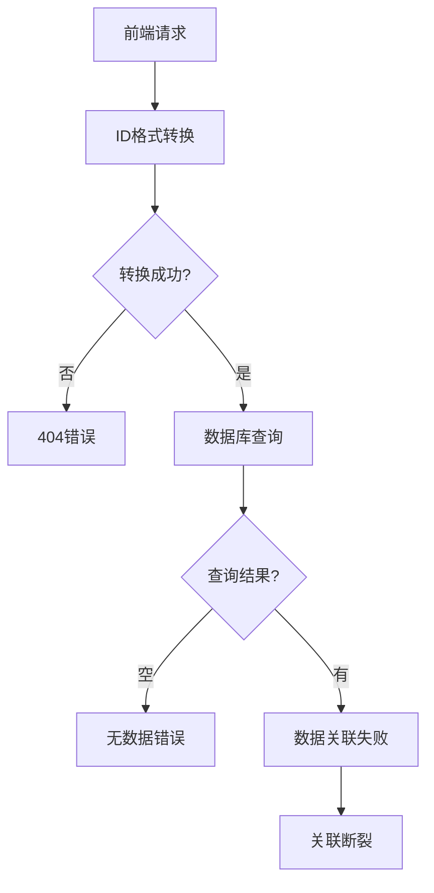
```mermaid
flowchart TD
A["前端请求"] --> B["ID格式转换"]
B --> C{"转换成功?"}
C --> |否| D["404错误"]
C --> |是| E["数据库查询"]
E --> F{"查询结果?"}
F --> |空| G["无数据错误"]
F --> |有| H["数据关联失败"]
H --> I["关联断裂"]
```

**图表来源**
- [function_description/武器图片功能修复说明.md](file://function_description/武器图片功能修复说明.md#L1-L50)

#### 修复策略
1. **自动ID转换**：在后端API中添加格式转换逻辑
2. **数据验证**：增加输入参数验证和错误处理
3. **关联完整性检查**：定期检查数据关联完整性

### 2. 路径配置错误模式

#### 问题特征
- **静态资源404**：图片、视频等资源无法访问
- **API路径错误**：相对路径vs绝对路径混淆
- **跨平台路径问题**：Windows vs Unix路径差异

#### 根源分析
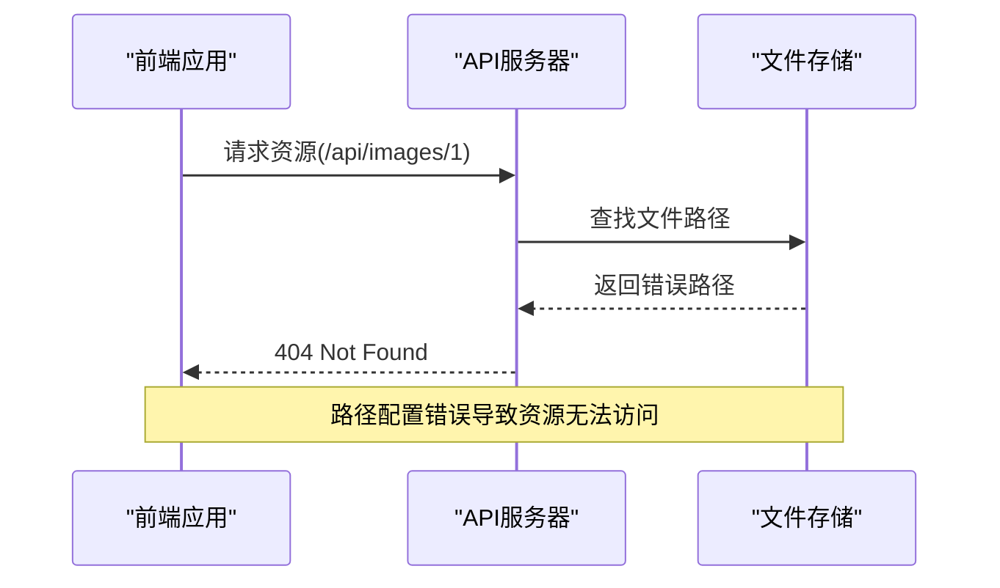
```mermaid
sequenceDiagram
participant Frontend as "前端应用"
participant API as "API服务器"
participant Storage as "文件存储"
Frontend->>API : 请求资源(/api/images/1)
API->>Storage : 查找文件路径
Storage-->>API : 返回错误路径
API-->>Frontend : 404 Not Found
Note over Frontend,Storage : 路径配置错误导致资源无法访问
```

**图表来源**
- [backend/src/routes/weapon-videos.js](file://backend/src/routes/weapon-videos.js#L199-L234)

### 3. 接口验证失效模式

#### 问题特征
- **认证失败**：JWT令牌验证不过
- **权限不足**：管理员权限检查失败
- **数据格式错误**：请求参数格式不正确

#### 根源分析
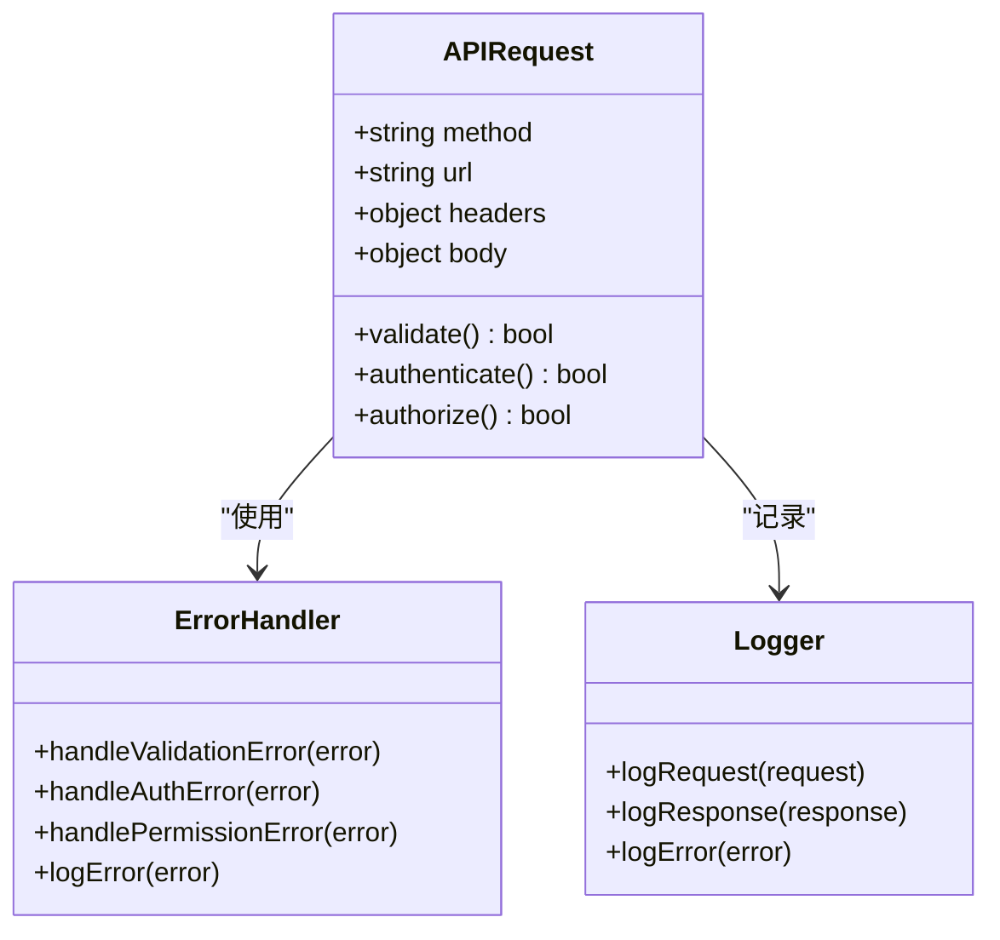
```mermaid
classDiagram
class APIRequest {
+string method
+string url
+object headers
+object body
+validate() bool
+authenticate() bool
+authorize() bool
}
class ErrorHandler {
+handleValidationError(error)
+handleAuthError(error)
+handlePermissionError(error)
+logError(error)
}
class Logger {
+logRequest(request)
+logResponse(response)
+logError(error)
}
APIRequest --> ErrorHandler : "使用"
APIRequest --> Logger : "记录"
```

**图表来源**
- [backend/src/app.js](file://backend/src/app.js#L100-L150)

**章节来源**
- [function_description/武器图片功能修复说明.md](file://function_description/武器图片功能修复说明.md#L1-L153)
- [function_description/制造商API修复说明.md](file://function_description/制造商API修复说明.md#L1-L97)

## 核心测试页面详解

### 1. 前后端连接测试 (test-frontend-backend-connection.html)

#### 功能概述
该测试页面提供全面的前后端连接验证，涵盖服务器状态、API端点、数据交互等各个方面。

#### 测试模块架构
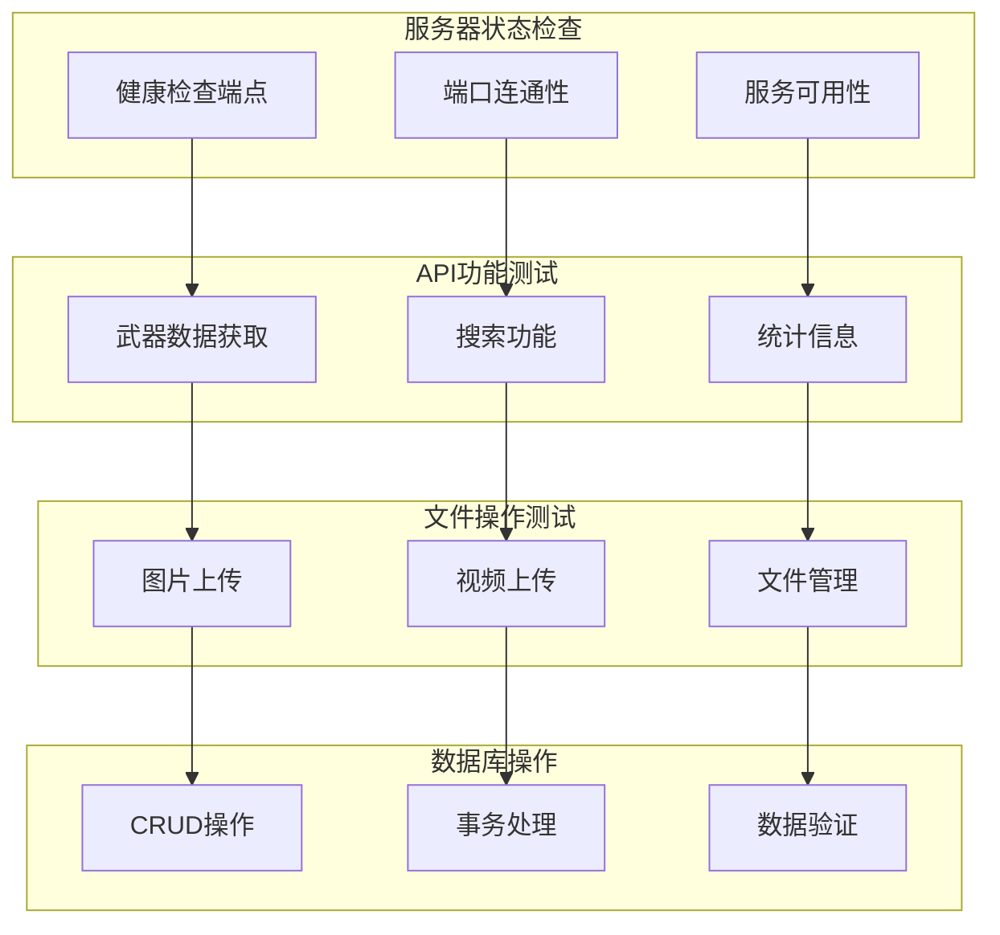
```mermaid
graph TB
subgraph "服务器状态检查"
A1["健康检查端点"]
A2["端口连通性"]
A3["服务可用性"]
end
subgraph "API功能测试"
B1["武器数据获取"]
B2["搜索功能"]
B3["统计信息"]
end
subgraph "文件操作测试"
C1["图片上传"]
C2["视频上传"]
C3["文件管理"]
end
subgraph "数据库操作"
D1["CRUD操作"]
D2["事务处理"]
D3["数据验证"]
end
A1 --> B1
A2 --> B2
A3 --> B3
B1 --> C1
B2 --> C2
B3 --> C3
C1 --> D1
C2 --> D2
C3 --> D3
```

**图表来源**
- [test_pages/test-frontend-backend-connection.html](file://test_pages/test-frontend-backend-connection.html#L1-L100)

#### 关键测试场景
1. **服务器健康状态检测**
   - 检查`/health`端点响应
   - 验证数据库连接状态
   - 监控服务运行时间

2. **API端点连通性测试**
   - GET `/api` 获取可用端点
   - POST/PUT/DELETE CRUD操作
   - 错误处理验证

3. **文件上传功能验证**
   - 图片文件上传（最大5MB）
   - 视频文件上传（支持多种格式）
   - 上传进度监控

**章节来源**
- [test_pages/test-frontend-backend-connection.html](file://test_pages/test-frontend-backend-connection.html#L1-L523)

### 2. 制造商API测试 (test-manufacturer-api.html)

#### 功能特点
专门针对制造商相关API的功能测试，重点验证数据关联和统计计算。

#### 测试流程设计
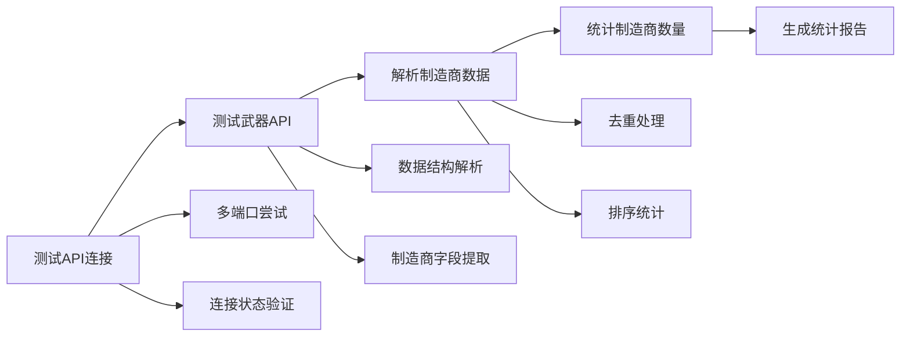
```mermaid
flowchart LR
A["测试API连接"] --> B["测试武器API"]
B --> C["解析制造商数据"]
C --> D["统计制造商数量"]
D --> E["生成统计报告"]
A --> A1["多端口尝试"]
A --> A2["连接状态验证"]
B --> B1["数据结构解析"]
B --> B2["制造商字段提取"]
C --> C1["去重处理"]
C --> C2["排序统计"]
```

**图表来源**
- [test-manufacturer-api.html](file://test_pages/test-manufacturer-api.html#L1-L100)

#### 核心测试功能
1. **多端口连接测试**：自动尝试3000和3001端口
2. **数据解析验证**：检查武器数据中的制造商字段
3. **统计计算准确性**：验证制造商数量统计结果

**章节来源**
- [test_pages/test-manufacturer-api.html](file://test_pages/test-manufacturer-api.html#L1-L305)

### 3. 武器图片增强测试 (test-weapon-image-enhanced.html)

#### 功能特性
全面的武器图片管理系统测试，包括上传、编辑、删除等完整功能链。

#### 系统架构图
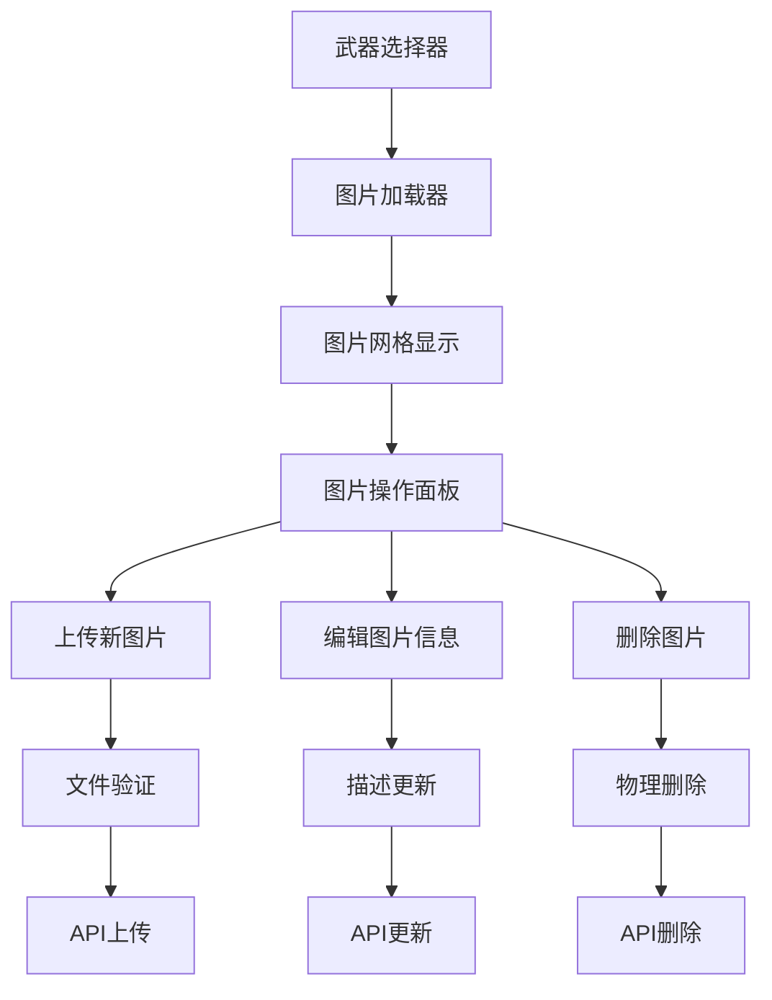
```mermaid
graph TD
A["武器选择器"] --> B["图片加载器"]
B --> C["图片网格显示"]
C --> D["图片操作面板"]
D --> E["上传新图片"]
D --> F["编辑图片信息"]
D --> G["删除图片"]
E --> H["文件验证"]
F --> I["描述更新"]
G --> J["物理删除"]
H --> K["API上传"]
I --> L["API更新"]
J --> M["API删除"]
```

**图表来源**
- [test_pages/test-weapon-image-enhanced.html](file://test_pages/test-weapon-image-enhanced.html#L1-L200)

#### 关键测试场景
1. **图片加载验证**：确保图片能正确从API获取
2. **上传功能测试**：验证图片上传流程
3. **编辑功能验证**：测试图片描述更新
4. **删除操作测试**：验证图片删除功能

**章节来源**
- [test_pages/test-weapon-image-enhanced.html](file://test_pages/test-weapon-image-enhanced.html#L1-L857)

### 4. 数据管理测试 (test-data-management.html)

#### 功能范围
专注于武器数据的增删改查功能测试，提供完整的数据管理验证。

#### 测试矩阵
| 测试类别 | 子功能 | 验证要点 | 预期结果 |
|---------|--------|----------|----------|
| **连接测试** | 服务器连接 | 端口可达性、响应时间 | 连接成功，响应正常 |
| **查询测试** | 武器列表 | 数据完整性、分页效果 | 正确返回指定数量记录 |
| **搜索测试** | 关键词搜索 | 搜索准确性、模糊匹配 | 返回相关武器记录 |
| **添加测试** | 新增武器 | 数据验证、权限检查 | 添加成功，数据持久化 |
| **修改测试** | 更新操作 | 数据一致性、冲突处理 | 更新成功，数据同步 |
| **删除测试** | 删除功能 | 级联删除、权限验证 | 删除成功，关联数据处理 |

**章节来源**
- [test_pages/test-data-management.html](file://test_pages/test-data-management.html#L1-L490)

### 5. 视频功能测试 (test-video-fix.html)

#### 特色功能
专门针对视频资源的访问和管理功能测试。

#### 测试验证点
1. **视频列表API**：验证视频数据获取
2. **文件访问测试**：检查视频文件可访问性
3. **视频播放器集成**：验证视频播放功能

**章节来源**
- [test_pages/test-video-fix.html](file://test_pages/test-video-fix.html#L1-L205)

## 调试工具与方法

### 1. 浏览器开发者工具

#### 网络面板使用技巧
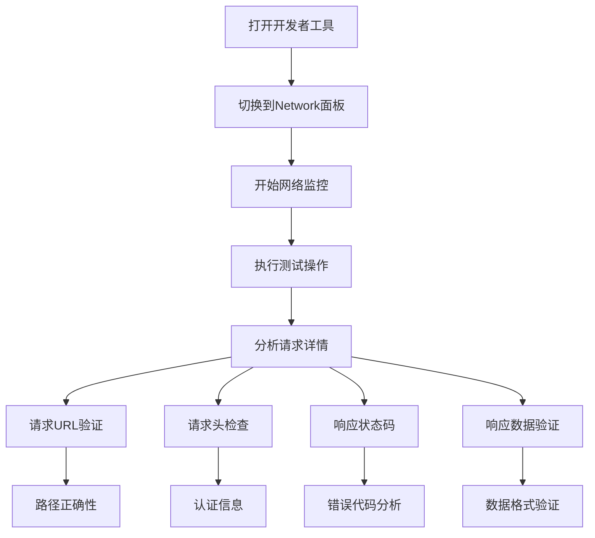
```mermaid
flowchart TD
A["打开开发者工具"] --> B["切换到Network面板"]
B --> C["开始网络监控"]
C --> D["执行测试操作"]
D --> E["分析请求详情"]
E --> F["请求URL验证"]
E --> G["请求头检查"]
E --> H["响应状态码"]
E --> I["响应数据验证"]
F --> J["路径正确性"]
G --> K["认证信息"]
H --> L["错误代码分析"]
I --> M["数据格式验证"]
```

#### 常用快捷键
- **F12**：打开开发者工具
- **Ctrl+Shift+I**：快速打开
- **Ctrl+R**：强制刷新页面
- **Ctrl+F**：搜索页面内容

### 2. Postman API测试

#### 测试集合设计
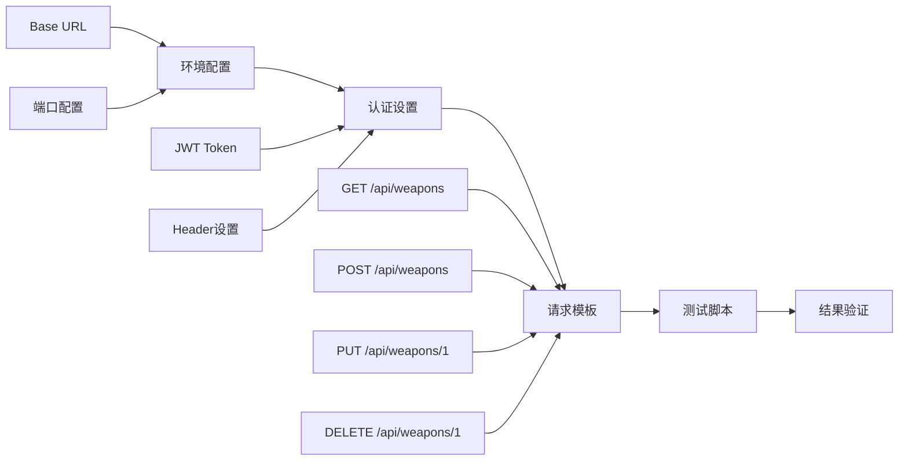
```mermaid
graph LR
A["环境配置"] --> B["认证设置"]
B --> C["请求模板"]
C --> D["测试脚本"]
D --> E["结果验证"]
A1["Base URL"] --> A
A2["端口配置"] --> A
B1["JWT Token"] --> B
B2["Header设置"] --> B
C1["GET /api/weapons"] --> C
C2["POST /api/weapons"] --> C
C3["PUT /api/weapons/1"] --> C
C4["DELETE /api/weapons/1"] --> C
```

#### 关键测试场景
1. **认证测试**：验证JWT令牌有效性
2. **数据验证**：检查请求参数格式
3. **错误处理**：测试各种错误情况
4. **性能测试**：评估API响应时间

### 3. 日志监控系统

#### 日志级别定义
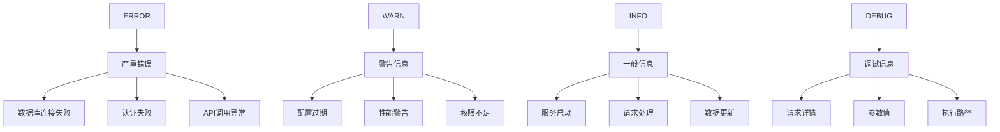
```mermaid
graph TD
A["ERROR"] --> B["严重错误"]
C["WARN"] --> D["警告信息"]
E["INFO"] --> F["一般信息"]
G["DEBUG"] --> H["调试信息"]
B --> B1["数据库连接失败"]
B --> B2["认证失败"]
B --> B3["API调用异常"]
D --> D1["配置过期"]
D --> D2["性能警告"]
D --> D3["权限不足"]
F --> F1["服务启动"]
F --> F2["请求处理"]
F --> F3["数据更新"]
H --> H1["请求详情"]
H --> H2["参数值"]
H --> H3["执行路径"]
```

#### 日志分析技巧
1. **时间戳分析**：定位问题发生时间
2. **错误堆栈**：追踪错误源头
3. **请求链路**：分析请求处理流程
4. **性能指标**：识别性能瓶颈

**章节来源**
- [backend/src/app.js](file://backend/src/app.js#L50-L100)
- [backend/src/utils/logger.js](file://backend/src/utils/logger.js)

## 常见故障排查清单

### 1. 跨域问题 (CORS)

#### 问题症状
- 浏览器控制台出现"Access-Control-Allow-Origin"错误
- API请求被阻止，状态码403
- 预检请求失败

#### 排查步骤
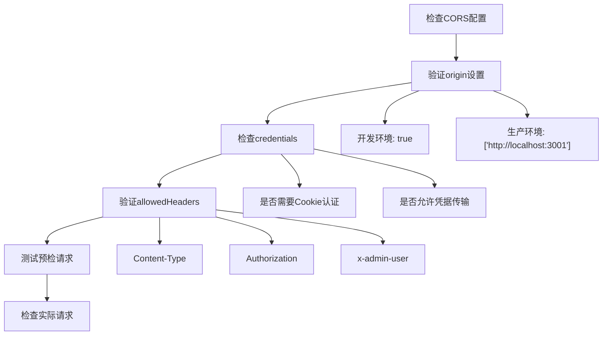
```mermaid
flowchart TD
A["检查CORS配置"] --> B["验证origin设置"]
B --> C["检查credentials"]
C --> D["验证allowedHeaders"]
D --> E["测试预检请求"]
E --> F["检查实际请求"]
B --> B1["开发环境: true"]
B --> B2["生产环境: ['http://localhost:3001']"]
C --> C1["是否需要Cookie认证"]
C --> C2["是否允许凭据传输"]
D --> D1["Content-Type"]
D --> D2["Authorization"]
D --> D3["x-admin-user"]
```

#### 解决方案
1. **开发环境配置**：设置`origin: true`允许所有域名
2. **生产环境配置**：明确指定允许的域名列表
3. **凭据支持**：启用`credentials: true`支持Cookie认证
4. **头部白名单**：添加必要的自定义头部

### 2. 数据库连接失败

#### 故障分类
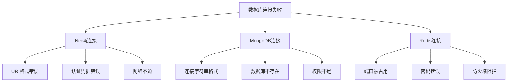
```mermaid
graph TD
A["数据库连接失败"] --> B["Neo4j连接"]
A --> C["MongoDB连接"]
A --> D["Redis连接"]
B --> B1["URI格式错误"]
B --> B2["认证凭据错误"]
B --> B3["网络不通"]
C --> C1["连接字符串格式"]
C --> C2["数据库不存在"]
C --> C3["权限不足"]
D --> D1["端口被占用"]
D --> D2["密码错误"]
D --> D3["防火墙阻拦"]
```

#### 排查清单
1. **连接字符串验证**：检查URI格式和参数
2. **网络连通性**：使用telnet测试端口
3. **认证信息**：验证用户名密码正确性
4. **服务状态**：确认数据库服务正在运行
5. **防火墙设置**：检查端口是否开放

### 3. 静态资源404错误

#### 问题分析
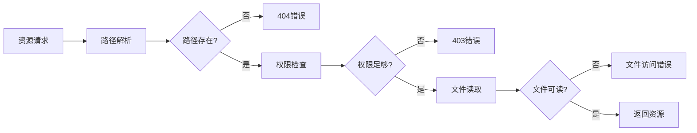
```mermaid
flowchart LR
A["资源请求"] --> B["路径解析"]
B --> C{"路径存在?"}
C --> |否| D["404错误"]
C --> |是| E["权限检查"]
E --> F{"权限足够?"}
F --> |否| G["403错误"]
F --> |是| H["文件读取"]
H --> I{"文件可读?"}
I --> |否| J["文件访问错误"]
I --> |是| K["返回资源"]
```

#### 解决策略
1. **路径映射检查**：验证静态文件服务配置
2. **文件权限验证**：检查文件和目录权限
3. **缓存清理**：清除浏览器和服务器缓存
4. **符号链接检查**：验证软链接有效性

### 4. API响应异常

#### 错误类型分析
| 错误类型 | 状态码 | 常见原因 | 解决方法 |
|---------|--------|----------|----------|
| **请求错误** | 400 | 参数格式错误 | 验证请求参数 |
| **认证失败** | 401 | JWT令牌无效 | 重新登录获取令牌 |
| **权限不足** | 403 | 权限验证失败 | 检查用户角色 |
| **资源不存在** | 404 | 资源ID错误 | 验证资源存在性 |
| **服务器错误** | 500 | 后端逻辑异常 | 检查服务器日志 |
| **服务不可用** | 503 | 服务暂时不可用 | 等待服务恢复 |

### 5. 文件上传问题

#### 上传流程验证
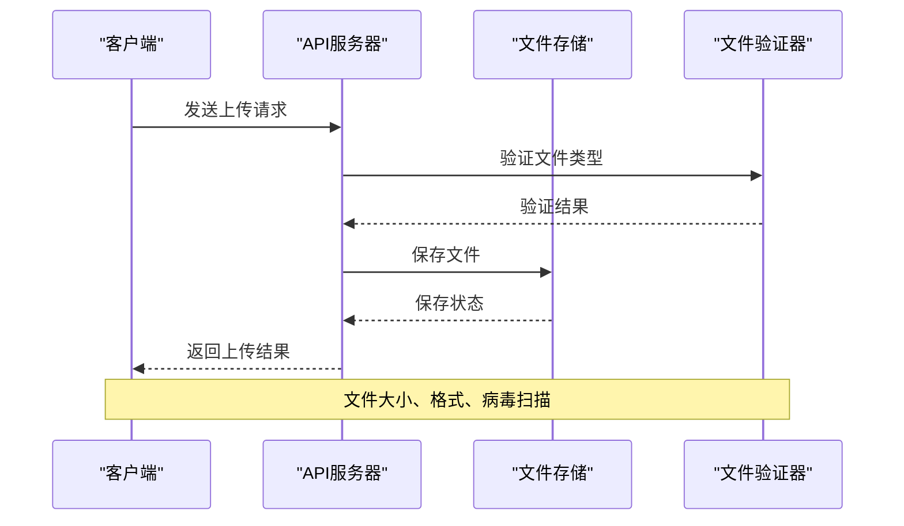
```mermaid
sequenceDiagram
participant Client as "客户端"
participant API as "API服务器"
participant Storage as "文件存储"
participant Validator as "文件验证器"
Client->>API : 发送上传请求
API->>Validator : 验证文件类型
Validator-->>API : 验证结果
API->>Storage : 保存文件
Storage-->>API : 保存状态
API-->>Client : 返回上传结果
Note over Client,Validator : 文件大小、格式、病毒扫描
```

#### 常见问题及解决方案
1. **文件大小限制**：调整`maxFileSize`配置
2. **文件类型验证**：检查MIME类型白名单
3. **磁盘空间不足**：监控存储空间使用
4. **并发上传冲突**：实现文件锁定机制

**章节来源**
- [backend/src/app.js](file://backend/src/app.js#L35-L79)
- [backend/src/config/index.js](file://backend/src/config/index.js#L1-L73)

## 故障案例深度分析

### 案例1：武器图片功能修复

#### 问题背景
项目初期发现武器图片功能无法正常工作，40个武器记录均无图片数据。

#### 诊断过程
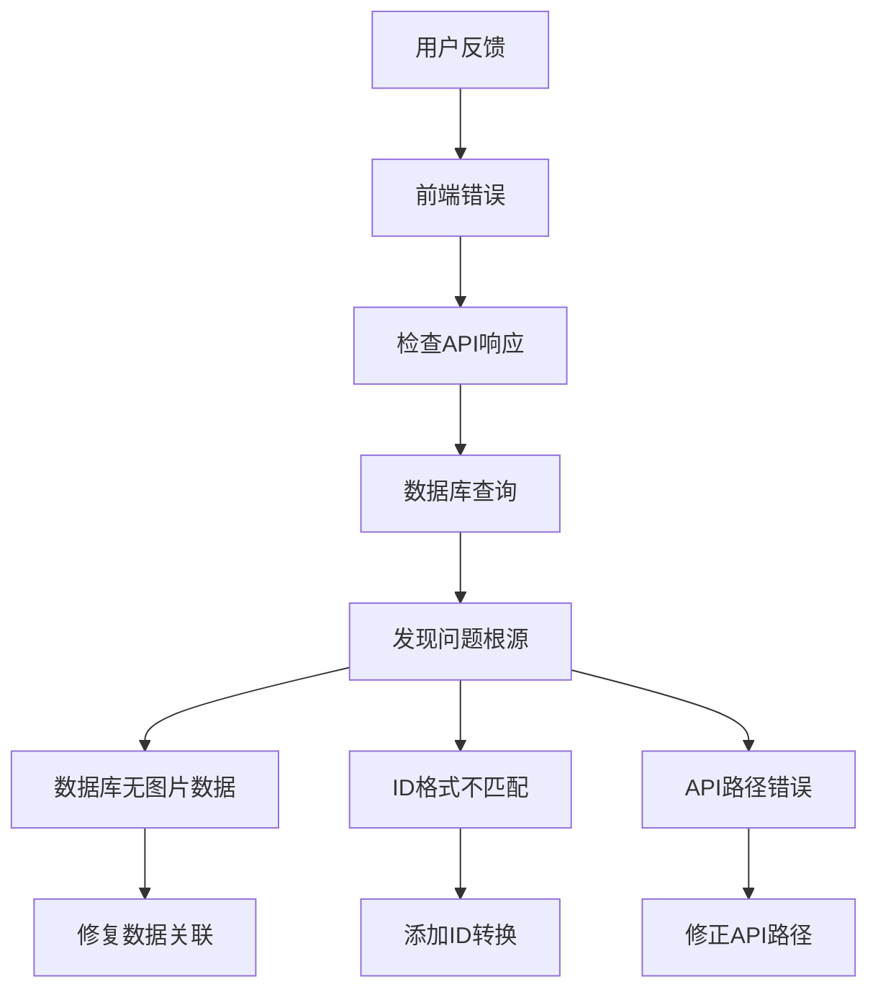
```mermaid
flowchart TD
A["用户反馈"] --> B["前端错误"]
B --> C["检查API响应"]
C --> D["数据库查询"]
D --> E["发现问题根源"]
E --> F["数据库无图片数据"]
E --> G["ID格式不匹配"]
E --> H["API路径错误"]
F --> I["修复数据关联"]
G --> J["添加ID转换"]
H --> K["修正API路径"]
```

#### 根源分析
1. **数据层问题**：`weapons`表中`images`字段为空
2. **格式层问题**：前端ID格式与后端期望不符
3. **网络层问题**：相对路径导致API调用失败

#### 修复方案
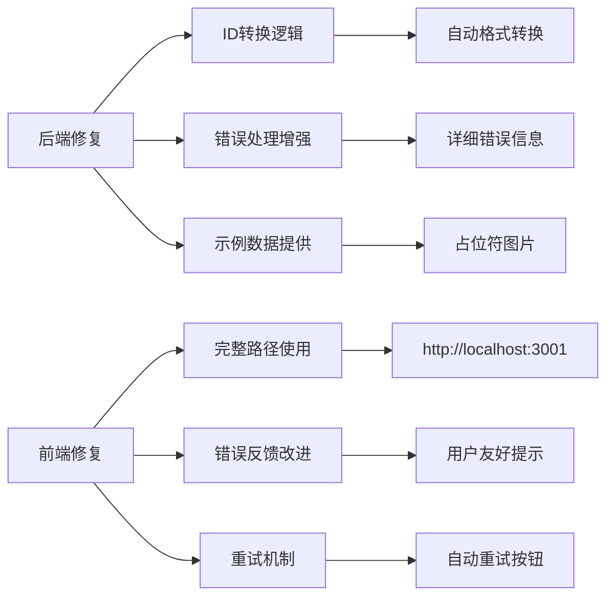
```mermaid
graph LR
A["后端修复"] --> B["ID转换逻辑"]
A --> C["错误处理增强"]
A --> D["示例数据提供"]
E["前端修复"] --> F["完整路径使用"]
E --> G["错误反馈改进"]
E --> H["重试机制"]
B --> I["自动格式转换"]
C --> J["详细错误信息"]
D --> K["占位符图片"]
F --> L["http://localhost:3001"]
G --> M["用户友好提示"]
H --> N["自动重试按钮"]
```

**图表来源**
- [function_description/武器图片功能修复说明.md](file://function_description/武器图片功能修复说明.md#L50-L100)

### 案例2：制造商API统计问题

#### 问题现象
制造商武器数量统计功能无法正常工作，API返回空数据。

#### 问题定位
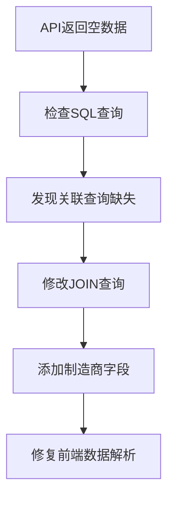
```mermaid
flowchart TD
A["API返回空数据"] --> B["检查SQL查询"]
B --> C["发现关联查询缺失"]
C --> D["修改JOIN查询"]
D --> E["添加制造商字段"]
E --> F["修复前端数据解析"]
```

#### 核心修复点
1. **数据库查询修复**：
   ```sql
   -- 修复前
   SELECT id, name, type, country, year, description FROM weapons
   
   -- 修复后  
   SELECT w.id, w.name, w.type, w.country, w.year, w.description, m.name as manufacturer
   FROM weapons w
   LEFT JOIN weapon_manufacturers wm ON w.id = wm.weapon_id
   LEFT JOIN manufacturers m ON wm.manufacturer_id = m.id
   ```

2. **前端数据处理改进**：添加多端口连接尝试机制

#### 测试验证
- **API测试**：验证修复后的查询结果
- **前端测试**：确认数据正确显示
- **性能测试**：评估查询性能影响

**章节来源**
- [function_description/制造商API修复说明.md](file://function_description/制造商API修复说明.md#L20-L70)

### 案例3：视频功能访问问题

#### 问题描述
视频文件无法正常播放，出现404错误。

#### 排查流程

```mermaid
flowchart LR
A["视频播放失败"] --> B["检查API响应"]
B --> C["验证文件路径"]
C --> D["检查文件存在性"]
D --> E["验证文件权限"]
E --> F["测试文件访问"]
F --> G["修复路径配置"]
```

#### 解决方案
1. **路径规范化**：处理相对路径和绝对路径差异
2. **文件存在性检查**：添加文件存在性验证
3. **Range请求支持**：实现视频流播放支持
4. **错误处理增强**：提供友好的错误提示

**章节来源**
- [test_pages/test-video-fix.html](file://test_pages/test-video-fix.html#L50-L150)

## 最佳实践建议

### 1. 调试流程标准化

#### 分阶段调试策略
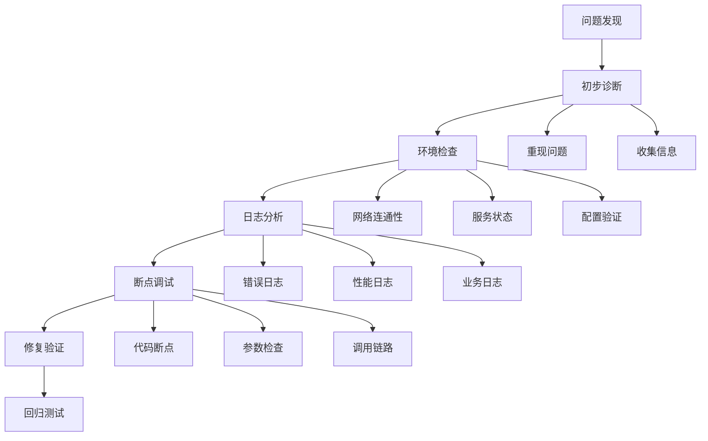
```mermaid
graph TD
A["问题发现"] --> B["初步诊断"]
B --> C["环境检查"]
C --> D["日志分析"]
D --> E["断点调试"]
E --> F["修复验证"]
F --> G["回归测试"]
B --> B1["重现问题"]
B --> B2["收集信息"]
C --> C1["网络连通性"]
C --> C2["服务状态"]
C --> C3["配置验证"]
D --> D1["错误日志"]
D --> D2["性能日志"]
D --> D3["业务日志"]
E --> E1["代码断点"]
E --> E2["参数检查"]
E --> E3["调用链路"]
```

#### 调试检查清单
1. **环境准备**：确认开发环境配置正确
2. **依赖检查**：验证所有依赖服务正常运行
3. **数据验证**：检查测试数据的完整性和正确性
4. **权限验证**：确认用户权限和认证状态
5. **网络连通性**：测试所有网络连接点

### 2. 错误处理最佳实践

#### 分层错误处理
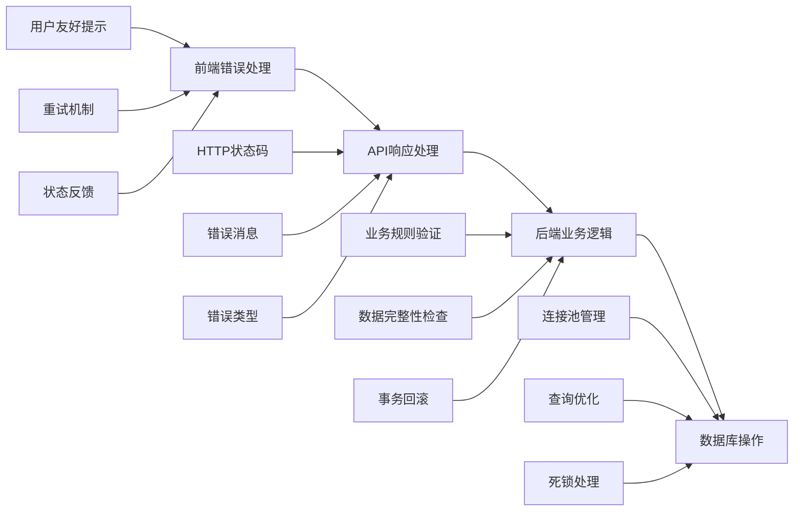
```mermaid
graph LR
A["前端错误处理"] --> B["API响应处理"]
B --> C["后端业务逻辑"]
C --> D["数据库操作"]
A1["用户友好提示"] --> A
A2["重试机制"] --> A
A3["状态反馈"] --> A
B1["HTTP状态码"] --> B
B2["错误消息"] --> B
B3["错误类型"] --> B
C1["业务规则验证"] --> C
C2["数据完整性检查"] --> C
C3["事务回滚"] --> C
D1["连接池管理"] --> D
D2["查询优化"] --> D
D3["死锁处理"] --> D
```

#### 错误分类策略
1. **用户错误**：输入格式错误、权限不足
2. **系统错误**：网络中断、服务不可用
3. **数据错误**：数据格式错误、约束违反
4. **逻辑错误**：算法错误、业务规则冲突

### 3. 性能优化建议

#### 关键性能指标
| 指标类型 | 监控项目 | 正常范围 | 优化目标 |
|---------|----------|----------|----------|
| **响应时间** | API平均响应 | < 200ms | < 100ms |
| **吞吐量** | QPS峰值 | > 1000 | > 2000 |
| **错误率** | 5xx错误 | < 0.1% | < 0.05% |
| **资源使用** | CPU使用率 | < 70% | < 50% |
| **内存使用** | 内存占用 | < 80% | < 60% |

#### 优化策略
1. **数据库优化**：添加索引、优化查询、使用连接池
2. **缓存策略**：实施多级缓存、合理设置TTL
3. **异步处理**：使用队列处理耗时任务
4. **负载均衡**：实施水平扩展和负载分发

### 4. 监控和告警体系

#### 监控指标设计
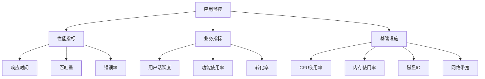
```mermaid
graph TD
A["应用监控"] --> B["性能指标"]
A --> C["业务指标"]
A --> D["基础设施"]
B --> B1["响应时间"]
B --> B2["吞吐量"]
B --> B3["错误率"]
C --> C1["用户活跃度"]
C --> C2["功能使用率"]
C --> C3["转化率"]
D --> D1["CPU使用率"]
D --> D2["内存使用率"]
D --> D3["磁盘IO"]
D --> D4["网络带宽"]
```

#### 告警规则设置
1. **实时告警**：系统不可用、严重错误
2. **阈值告警**：性能指标超过设定阈值
3. **趋势告警**：性能指标呈现恶化趋势
4. **业务告警**：关键业务指标异常

### 5. 文档和知识管理

#### 调试文档结构
1. **问题描述**：详细的问题现象和影响范围
2. **诊断过程**：逐步的排查思路和方法
3. **解决方案**：具体的修复步骤和代码变更
4. **验证测试**：修复后的验证方法和结果
5. **预防措施**：避免类似问题再次发生的建议

#### 知识库建设
1. **常见问题库**：整理常见故障和解决方案
2. **最佳实践库**：积累优秀的开发和运维实践
3. **工具使用库**：整理调试工具的使用方法
4. **监控指标库**：建立完善的监控指标体系

通过系统性的调试指南和最佳实践，开发者可以更高效地定位和解决问题，提升系统的稳定性和用户体验。本指南基于兵智世界v1.3项目的实际经验，具有很强的实用价值和参考意义。