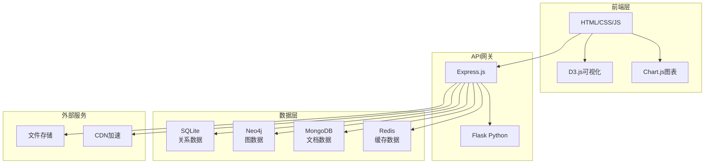
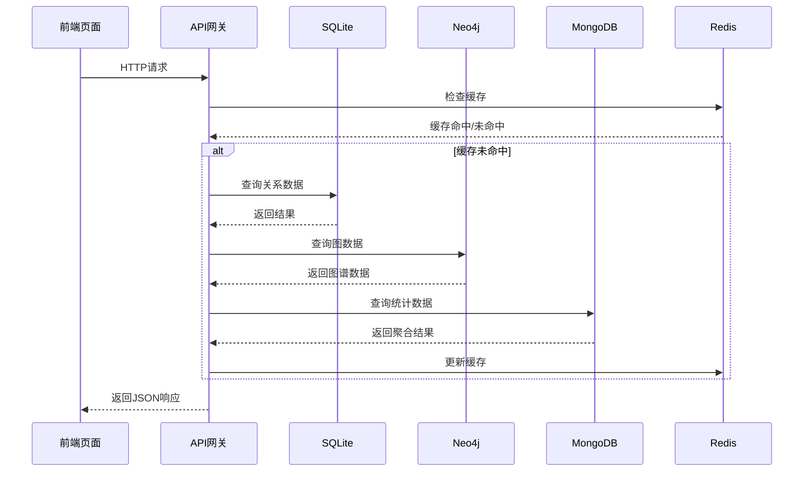

# 技术栈与依赖

<cite>
**本文档中引用的文件**
- [package.json](file://package.json)
- [backend/package.json](file://backend/package.json)
- [backend/requirements.txt](file://backend/requirements.txt)
- [backend/src/config/index.js](file://backend/src/config/index.js)
- [backend/src/config/database-simple.js](file://backend/src/config/database-simple.js)
- [backend/src/config/database_Neo4j.js](file://backend/src/config/database_Neo4j.js)
- [backend/src/app-simple.js](file://backend/src/app-simple.js)
- [backend/app.py](file://backend/app.py)
- [index.html](file://index.html)
- [knowledge-graph.html](file://knowledge-graph.html)
- [scripts/knowledge-graph.js](file://scripts/knowledge-graph.js)
- [scripts/index-charts.js](file://scripts/index-charts.js)
- [backend/src/utils/logger.js](file://backend/src/utils/logger.js)
- [backend/src/services/userService.js](file://backend/src/services/userService.js)
- [backend/src/services/userService-simple.js](file://backend/src/services/userService-simple.js)
</cite>

## 目录
1. [项目概述](#项目概述)
2. [前端技术栈](#前端技术栈)
3. [后端技术栈](#后端技术栈)
4. [数据库架构](#数据库架构)
5. [开发工具与构建](#开发工具与构建)
6. [关键依赖库详解](#关键依赖库详解)
7. [多数据库架构设计](#多数据库架构设计)
8. [技术组件协作关系](#技术组件协作关系)
9. [版本信息与兼容性](#版本信息与兼容性)

## 项目概述

兵智世界v1.3是一个现代化的军事武器知识图谱系统，采用前后端分离架构，集成了武器信息管理、知识图谱可视化、多媒体展示等功能。系统基于知识图谱技术，为用户提供直观的武器装备关系网络可视化和智能分析能力。

## 前端技术栈

### HTML/CSS/JavaScript
- **HTML5**: 使用语义化标签构建现代化网页结构
- **CSS3**: 采用模块化CSS架构，支持响应式设计
- **原生JavaScript**: ES6+语法，无第三方框架依赖

### 数据可视化库
- **D3.js (v7)**: 用于知识图谱的动态渲染和交互式可视化
- **Chart.js**: 用于统计图表的展示和数据分析

### 前端库与插件
- **Swiper**: 图片轮播组件，提供流畅的移动端体验
- **Font Awesome**: 图标字体库，提供丰富的图标资源
- **Lightbox**: 图片灯箱效果，增强用户体验

### 前端架构特点
- **模块化设计**: 按功能划分脚本文件，便于维护
- **响应式布局**: 支持桌面和移动设备的完美适配
- **异步数据加载**: 通过AJAX与后端API通信

**章节来源**
- [index.html](file://index.html#L1-L50)
- [knowledge-graph.html](file://knowledge-graph.html#L1-L50)
- [scripts/knowledge-graph.js](file://scripts/knowledge-graph.js#L1-L50)
- [scripts/index-charts.js](file://scripts/index-charts.js#L1-L50)

## 后端技术栈

### Node.js + Express框架
- **Node.js**: 服务器运行环境，版本要求14.0+
- **Express.js**: Web应用框架，提供RESTful API支持
- **Python Flask**: 辅助后端服务，提供额外的API接口

### 核心中间件
- **CORS**: 跨域资源共享，支持前端跨域访问
- **Helmet**: 安全中间件，提供HTTP头部保护
- **Compression**: 响应压缩，优化传输效率
- **Rate Limit**: API限流，防止恶意请求

### 文件处理
- **Multer**: 文件上传处理，支持图片和视频上传
- **Better-SQLite3**: 高性能SQLite驱动

### 安全与认证
- **bcryptjs**: 密码哈希加密，确保用户信息安全
- **jsonwebtoken**: JWT令牌认证，实现无状态身份验证
- **Joi**: 输入验证，确保数据完整性

### 日志与监控
- **winston**: 结构化日志记录，支持多级别日志输出

**章节来源**
- [backend/src/app-simple.js](file://backend/src/app-simple.js#L1-L100)
- [backend/app.py](file://backend/app.py#L1-L43)
- [backend/src/utils/logger.js](file://backend/src/utils/logger.js#L1-L46)

## 数据库架构

### SQLite轻量级关系数据库
- **用途**: 主要数据存储，包括用户信息、武器数据、分类信息
- **特点**: 轻量级、零配置、ACID事务支持
- **驱动**: Better-SQLite3，提供高性能的数据库操作

### Neo4j图数据库
- **用途**: 知识图谱数据存储，处理复杂的实体关系
- **特点**: 图形化数据模型，高效的关系查询
- **应用场景**: 武器-制造商-国家-类型的多层关系网络

### MongoDB文档数据库
- **用途**: 大容量数据存储，支持复杂查询和聚合
- **特点**: 文档型数据库，灵活的schema设计
- **应用场景**: 用户行为数据、日志数据、统计分析

### Redis缓存系统
- **用途**: 高速缓存，提升系统响应性能
- **特点**: 内存数据库，支持多种数据结构
- **应用场景**: 会话存储、API响应缓存、热点数据缓存

**章节来源**
- [backend/src/config/database-simple.js](file://backend/src/config/database-simple.js#L1-L100)
- [backend/src/config/database_Neo4j.js](file://backend/src/config/database_Neo4j.js#L1-L141)

## 开发工具与构建

### 构建工具
- **npm**: 包管理器，版本1.6+
- **nodemon**: 开发热重载，提升开发效率
- **ESLint**: 代码质量检查
- **Prettier**: 代码格式化

### 部署工具
- **PM2**: 生产环境进程管理
- **Docker**: 容器化部署支持
- **Nginx**: 反向代理和负载均衡

### 测试框架
- **Jest**: JavaScript单元测试框架
- **Supertest**: HTTP断言测试库

### 开发环境配置
- **环境变量**: 通过dotenv管理配置
- **多环境支持**: 开发、测试、生产环境分离
- **健康检查**: 自动化部署检查脚本

**章节来源**
- [backend/package.json](file://backend/package.json#L1-L44)
- [backend/requirements.txt](file://backend/requirements.txt#L1-L6)

## 关键依赖库详解

### axios (^1.6.2)
- **作用**: HTTP客户端，用于前端与后端API通信
- **特点**: Promise-based，支持拦截器和转换器
- **应用场景**: 知识图谱数据获取、用户认证、文件上传

### bcryptjs (^2.4.3)
- **作用**: 密码哈希加密库
- **特点**: 无依赖的JavaScript实现，安全性高
- **应用场景**: 用户密码加密存储，确保数据安全

### jsonwebtoken (^9.0.2)
- **作用**: JWT令牌生成和验证
- **特点**: 无状态认证，支持签名和验证
- **应用场景**: 用户身份认证，API访问授权

### winston (^3.11.0)
- **作用**: 结构化日志记录库
- **特点**: 多传输支持，可配置的日志级别
- **应用场景**: 应用日志记录，错误追踪，性能监控

### multer (^1.4.5-lts.1)
- **作用**: 文件上传中间件
- **特点**: 支持多文件上传，内存和磁盘存储
- **应用场景**: 武器图片上传，视频文件管理

### express-rate-limit (^7.1.5)
- **作用**: API请求限流
- **特点**: 防止滥用和DDoS攻击
- **应用场景**: 整个API服务的流量控制

### helmet (^7.1.0)
- **作用**: HTTP头部安全中间件
- **特点**: 自动添加安全头部
- **应用场景**: 整个应用的安全防护

**章节来源**
- [backend/src/services/userService.js](file://backend/src/services/userService.js#L92-L145)
- [backend/src/services/userService-simple.js](file://backend/src/services/userService-simple.js#L138-L164)

## 多数据库架构设计

### 设计理念
兵智世界采用混合数据库架构，针对不同数据类型和访问模式选择最适合的数据库解决方案：

#### SQLite + Neo4j + MongoDB 的协同使用
- **SQLite**: 适用于结构化数据存储，提供ACID事务保证
- **Neo4j**: 专精于图数据模型，支持复杂关系查询
- **MongoDB**: 适合半结构化数据，提供灵活的查询能力
- **Redis**: 提供高速缓存服务，提升系统整体性能

### 数据流架构

**图表来源**
- [backend/src/config/database-simple.js](file://backend/src/config/database-simple.js#L1-L50)
- [backend/src/config/database_Neo4j.js](file://backend/src/config/database_Neo4j.js#L1-L50)

### 数据一致性策略
- **最终一致性**: 通过事件驱动和消息队列保证数据同步
- **缓存策略**: Redis缓存热点数据，减少数据库压力
- **备份机制**: 多数据库备份，确保数据安全

**章节来源**
- [backend/src/config/database_Neo4j.js](file://backend/src/config/database_Neo4j.js#L97-L140)

## 技术组件协作关系

### 前后端通信架构

**图表来源**
- [backend/src/app-simple.js](file://backend/src/app-simple.js#L50-L100)
- [scripts/knowledge-graph.js](file://scripts/knowledge-graph.js#L288-L321)

### 知识图谱渲染流程
1. **数据获取**: 前端通过API从后端获取图谱数据
2. **数据转换**: 将Neo4j查询结果转换为D3.js格式
3. **布局计算**: D3.js计算节点位置和连接关系
4. **视觉渲染**: SVG元素绘制节点和连线
5. **交互处理**: 用户点击、拖拽、缩放等操作响应

### 缓存策略
- **分层缓存**: Redis → 内存缓存 → 数据库
- **智能过期**: 基于数据更新频率设置不同的TTL
- **预热机制**: 系统启动时预加载热点数据

**章节来源**
- [scripts/knowledge-graph.js](file://scripts/knowledge-graph.js#L794-L829)
- [backend/src/config/database-simple.js](file://backend/src/config/database-simple.js#L200-L250)

## 版本信息与兼容性

### Node.js生态系统
- **Node.js**: 14.0+ 版本要求
- **npm**: 6.0+ 版本要求
- **Express**: ^4.18.2
- **其他核心包**: 最新稳定版本

### Python生态系统
- **Python**: 3.8+ 版本要求
- **Flask**: ^2.3.3
- **Flask-SQLAlchemy**: ^3.0.5
- **Flask-CORS**: ^4.0.0

### 前端库版本
- **D3.js**: v7.x 稳定版本
- **Chart.js**: 最新版本
- **Swiper**: v11.x 稳定版本
- **Font Awesome**: v6.0.0+

### 数据库版本
- **SQLite**: 内置版本，无需单独安装
- **Neo4j**: 4.x+ 版本要求
- **MongoDB**: 4.4+ 版本要求
- **Redis**: 6.0+ 版本要求

### 环境要求
- **操作系统**: Windows、Linux、macOS
- **内存**: 最低4GB RAM
- **存储**: 至少1GB可用空间
- **网络**: 稳定的互联网连接

**章节来源**
- [backend/package.json](file://backend/package.json#L1-L44)
- [backend/requirements.txt](file://backend/requirements.txt#L1-L6)
- [README.md](file://README.md#L60-L80)

## 总结

兵智世界v1.3采用了现代化的技术栈组合，通过混合数据库架构实现了最佳的数据处理效果。前端采用原生技术栈，确保了良好的性能和兼容性；后端结合Node.js和Python，提供了强大的API服务能力；多数据库架构则充分发挥了各种数据库的优势，满足了不同场景下的数据处理需求。

这种技术选型不仅保证了系统的可扩展性和稳定性，还为未来的功能扩展和技术升级奠定了坚实的基础。通过合理的依赖管理和版本控制，确保了系统的长期维护性和安全性。