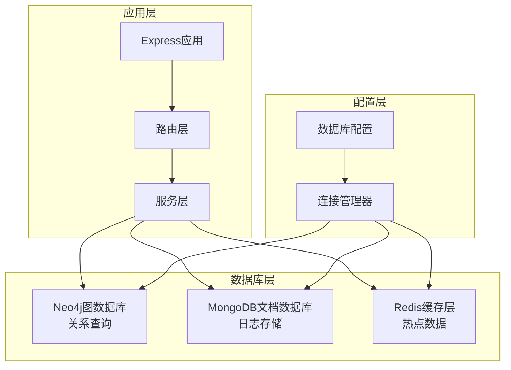
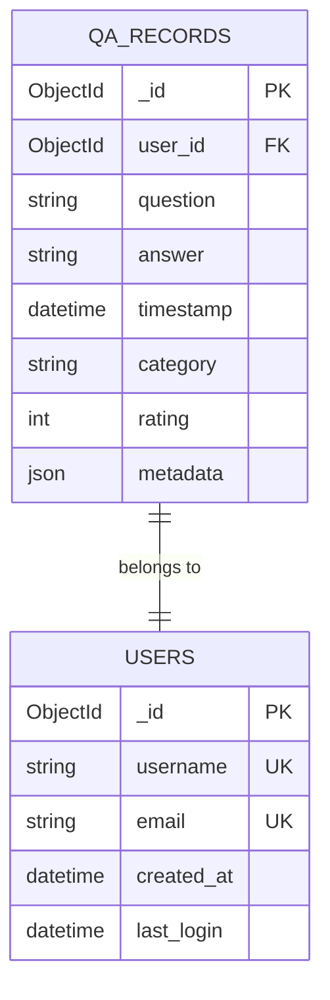
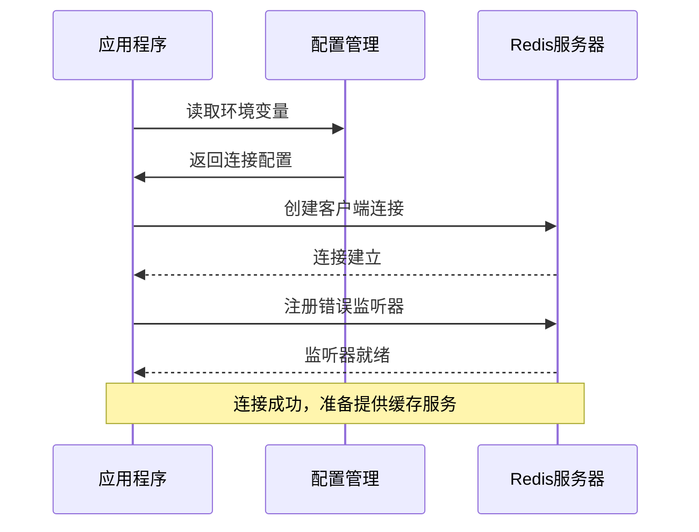
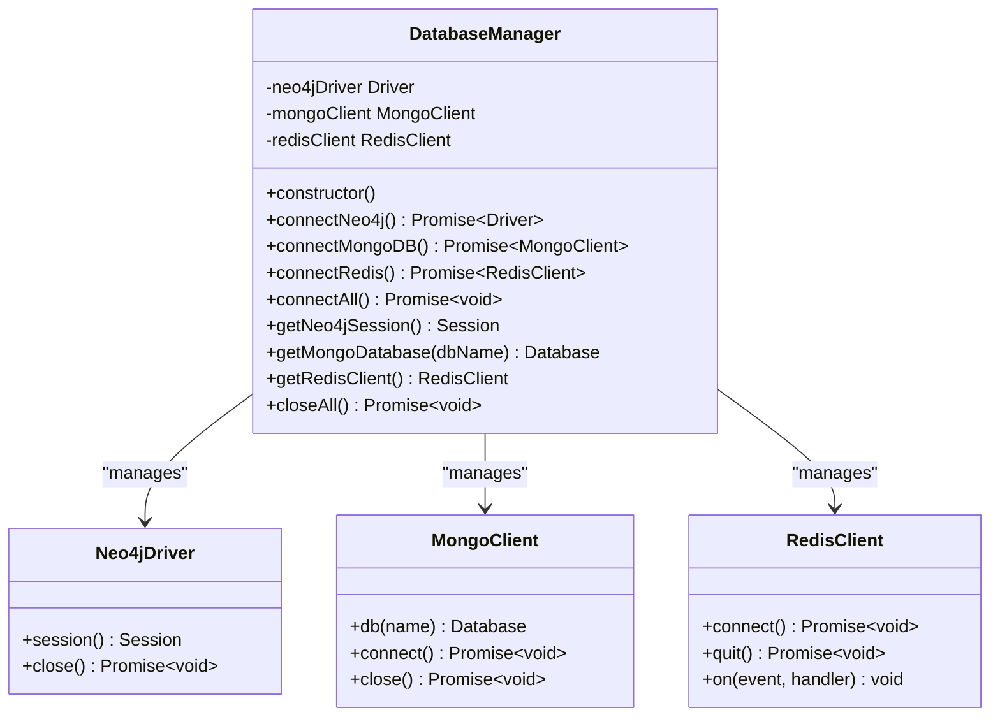
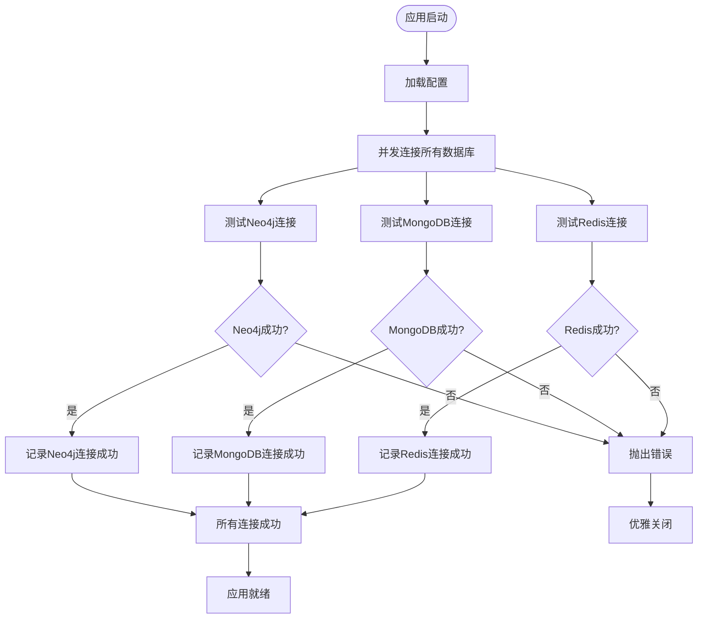
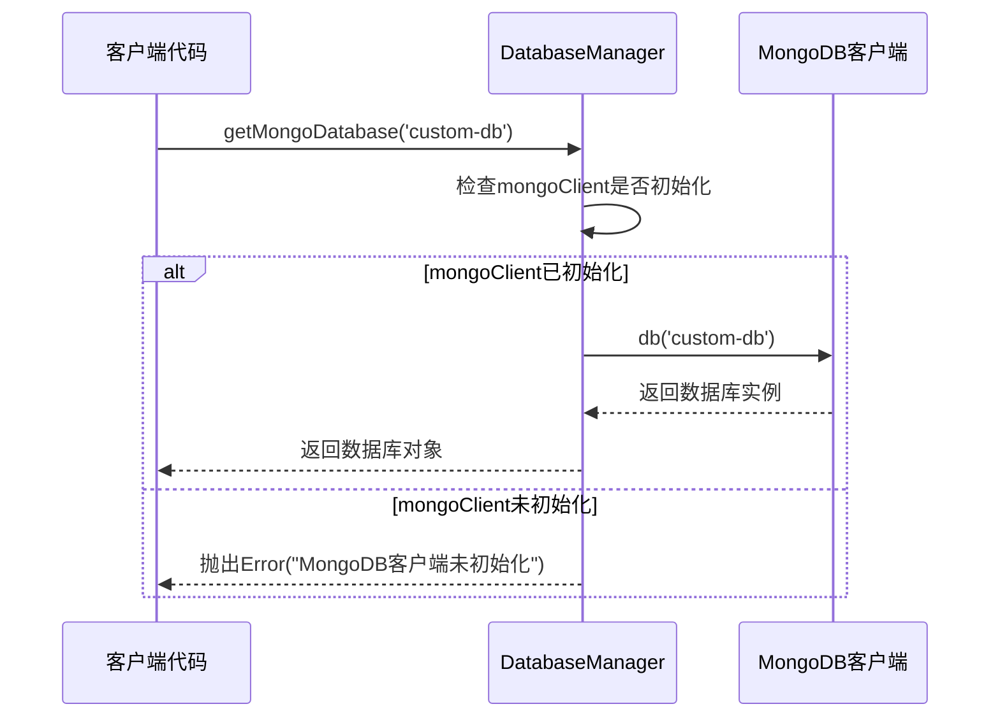
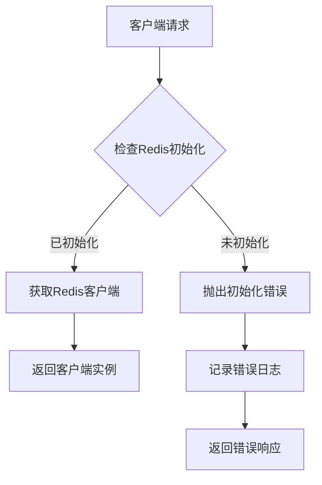
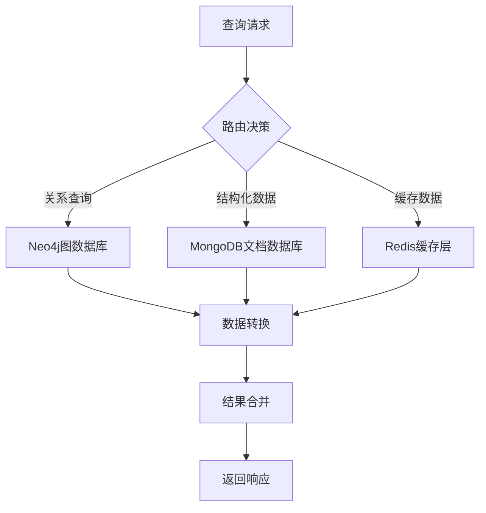
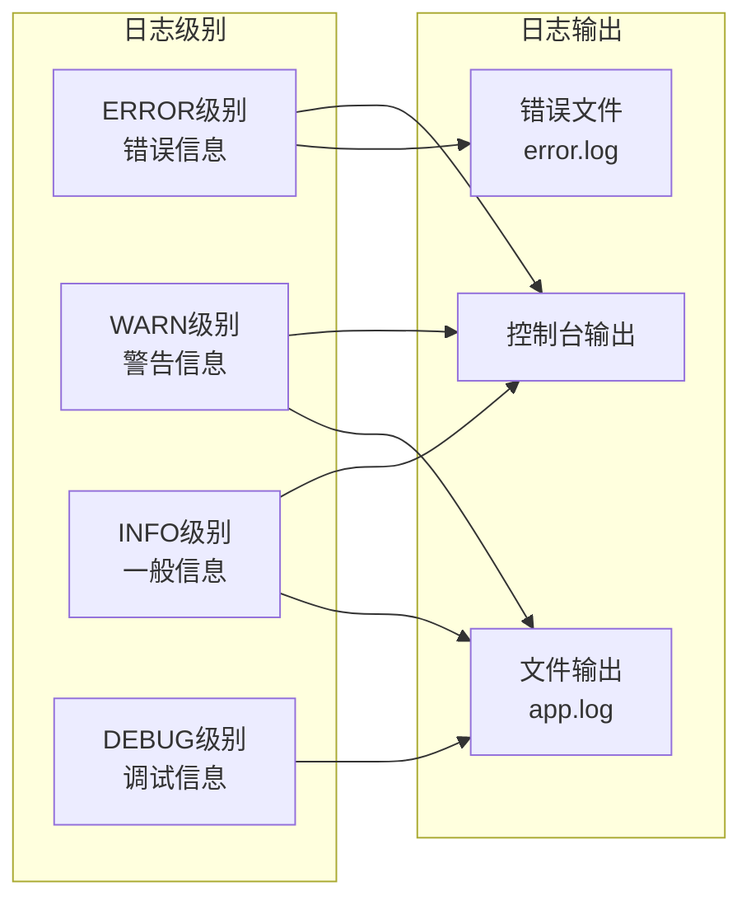

# MongoDB与Redis集成设计

<cite>
**本文档引用的文件**
- [database_Neo4j.js](file://backend/src/config/database_Neo4j.js)
- [index.js](file://backend/src/config/index.js)
- [logger.js](file://backend/src/utils/logger.js)
- [knowledgeGraphService.js](file://backend/src/services/knowledgeGraphService.js)
- [userService.js](file://backend/src/services/userService.js)
- [knowledge.js](file://backend/src/routes/knowledge.js)
- [auth.js](file://backend/src/routes/auth.js)
- [init-database.js](file://backend/scripts/init-database.js)
- [.env](file://backend/.env)
- [app.js](file://backend/src/app.js)
</cite>

## 目录
1. [项目概述](#项目概述)
2. [数据库架构设计](#数据库架构设计)
3. [MongoDB文档存储角色](#mongodb文档存储角色)
4. [Redis缓存层设计](#redis缓存层设计)
5. [连接池配置与管理](#连接池配置与管理)
6. [性能优化策略](#性能优化策略)
7. [数据协同策略](#数据协同策略)
8. [监控与维护](#监控与维护)
9. [最佳实践建议](#最佳实践建议)

## 项目概述

兵智世界项目采用多数据库架构，整合了Neo4j图数据库、MongoDB文档数据库和Redis缓存层，构建了一个高性能、可扩展的知识管理系统。该架构充分利用了各数据库的优势，实现了复杂关系查询、非结构化数据存储和高速缓存访问的完美结合。

## 数据库架构设计

**图表来源**
- [database_Neo4j.js](file://backend/src/config/database_Neo4j.js#L1-L141)
- [app.js](file://backend/src/app.js#L1-L248)

**章节来源**
- [database_Neo4j.js](file://backend/src/config/database_Neo4j.js#L1-L141)
- [index.js](file://backend/src/config/index.js#L1-L73)

## MongoDB文档存储角色

### 日志记录系统

MongoDB在系统中承担着重要的日志记录职责，主要用于存储用户活动、系统事件和审计信息。

#### 用户活动日志
- **用户登录记录**: 记录用户的登录时间、IP地址、设备信息
- **操作行为追踪**: 跟踪用户在系统中的关键操作
- **错误事件记录**: 保存系统异常和错误信息

#### 系统事件日志
- **数据库变更记录**: 记录数据结构变更和重要操作
- **性能监控数据**: 存储系统性能指标和响应时间
- **安全事件日志**: 记录安全相关事件和威胁检测

### 问答记录存储

MongoDB专门创建了`qa_records`集合来存储问答系统的完整记录：

**图表来源**
- [init-database.js](file://backend/scripts/init-database.js#L155-L175)

### 非结构化数据管理

#### 用户资料存储
- **个人资料信息**: 包含用户的姓名、头像、偏好设置
- **动态内容**: 支持富文本和多媒体内容
- **扩展属性**: 可以根据需求动态添加字段

#### 武器详情文档
- **武器规格**: 详细的武器技术参数
- **历史背景**: 武器的发展历程和使用情况
- **关联数据**: 与其他武器和制造商的关系

**章节来源**
- [init-database.js](file://backend/scripts/init-database.js#L130-L218)
- [userService.js](file://backend/src/services/userService.js#L1-L287)

## Redis缓存层设计

### 设计意图

Redis作为高性能的内存缓存系统，在兵智世界项目中承担以下核心功能：

#### 高速数据访问
- **热点数据缓存**: 缓存频繁访问的武器信息和用户数据
- **会话存储**: 存储用户会话信息和认证令牌
- **临时数据**: 存储计算过程中的中间结果

#### 性能优化
- **减少数据库压力**: 缓存查询结果，降低数据库负载
- **快速响应**: 内存访问速度远超磁盘数据库
- **并发处理**: 支持高并发读写操作

### 连接配置

Redis连接采用简洁而可靠的配置方式：

**图表来源**
- [database_Neo4j.js](file://backend/src/config/database_Neo4j.js#L46-L65)

### 错误监听和生命周期管理

#### 错误处理机制
- **连接错误监听**: 自动捕获Redis连接异常
- **操作错误处理**: 处理缓存操作失败的情况
- **故障恢复**: 实现自动重连和降级策略

#### 生命周期管理
- **优雅关闭**: 应用程序关闭时正确释放Redis连接
- **资源清理**: 清理过期的缓存数据和连接资源
- **健康检查**: 定期检查Redis服务状态

**章节来源**
- [database_Neo4j.js](file://backend/src/config/database_Neo4j.js#L46-L65)
- [database_Neo4j.js](file://backend/src/config/database_Neo4j.js#L105-L125)

## 连接池配置与管理

### DatabaseManager类设计

系统采用单例模式的DatabaseManager类统一管理所有数据库连接：

**图表来源**
- [database_Neo4j.js](file://backend/src/config/database_Neo4j.js#L5-L141)

### 数据库初始化策略

#### 并发初始化
系统采用Promise.all实现并发数据库连接初始化，确保启动效率：

**图表来源**
- [database_Neo4j.js](file://backend/src/config/database_Neo4j.js#L67-L85)

### 连接池特性

#### Neo4j连接池
- **会话管理**: 每次查询创建独立会话，保证事务隔离
- **连接复用**: 使用Neo4j驱动的内置连接池
- **自动重试**: 实现查询失败后的自动重试机制

#### MongoDB连接池
- **客户端管理**: 使用MongoDB官方驱动的连接池
- **数据库选择**: 支持多数据库实例切换
- **连接测试**: 启动时进行数据库可达性测试

#### Redis连接池
- **客户端配置**: 使用Redis官方客户端库
- **连接复用**: 支持多个并发连接
- **错误恢复**: 实现连接断开后的自动恢复

**章节来源**
- [database_Neo4j.js](file://backend/src/config/database_Neo4j.js#L15-L85)

## 性能优化策略

### getMongoDatabase()方法优化

#### 数据库获取机制
`getMongoDatabase()`方法提供了灵活的数据库实例获取能力：

**图表来源**
- [database_Neo4j.js](file://backend/src/config/database_Neo4j.js#L97-L103)

#### 性能优化特性
- **延迟初始化**: 只在需要时才创建数据库连接
- **命名空间支持**: 支持多数据库实例隔离
- **错误预防**: 严格的连接状态检查

### getRedisClient()方法优化

#### 客户端获取机制
`getRedisClient()`方法确保Redis客户端的可靠访问：

**图表来源**
- [database_Neo4j.js](file://backend/src/config/database_Neo4j.js#L105-L111)

#### 高并发支持
- **无锁设计**: 客户端获取不涉及同步操作
- **线程安全**: Redis客户端本身是线程安全的
- **连接复用**: 支持多个并发操作

### 多数据库协同优化

#### 查询优化策略
- **数据分层**: 根据数据特征选择合适的数据库
- **缓存策略**: Redis缓存热点数据，减少数据库访问
- **批量操作**: 支持批量数据处理，提高吞吐量

#### 资源管理
- **连接池优化**: 合理配置各数据库的连接池大小
- **内存管理**: Redis内存使用监控和自动清理
- **网络优化**: 最小化跨数据库通信开销

**章节来源**
- [database_Neo4j.js](file://backend/src/config/database_Neo4j.js#L97-L111)

## 数据协同策略

### 数据一致性保障

#### 分布式事务处理
- **最终一致性**: 对于跨数据库的操作采用最终一致性模型
- **补偿机制**: 实现数据回滚和补偿操作
- **状态同步**: 定期检查和同步各数据库的状态

#### 数据映射策略
- **实体映射**: 将Neo4j节点映射到MongoDB文档
- **关系持久化**: 在MongoDB中存储Neo4j关系的副本
- **版本控制**: 实现数据版本管理和冲突解决

### 查询协调机制

#### 多数据库查询

**图表来源**
- [knowledgeGraphService.js](file://backend/src/services/knowledgeGraphService.js#L1-L430)
- [userService.js](file://backend/src/services/userService.js#L1-L287)

#### 性能优化查询
- **预计算**: 在Redis中缓存常用查询结果
- **索引优化**: 在MongoDB中为高频查询字段创建索引
- **分片策略**: 对大数据集实施水平分片

### 数据迁移和同步

#### 数据同步策略
- **实时同步**: 关键数据变更的实时同步
- **批量同步**: 非关键数据的定期批量同步
- **增量同步**: 只同步变更的数据部分

#### 数据备份和恢复
- **多层备份**: 各数据库独立备份
- **交叉验证**: 不同数据库间的数据一致性检查
- **灾难恢复**: 快速数据恢复和业务连续性保障

**章节来源**
- [knowledgeGraphService.js](file://backend/src/services/knowledgeGraphService.js#L1-L430)
- [userService.js](file://backend/src/services/userService.js#L1-L287)

## 监控与维护

### 日志监控体系

#### 结构化日志记录
系统采用Winston日志框架实现全面的日志监控：

**图表来源**
- [logger.js](file://backend/src/utils/logger.js#L1-L47)

#### 关键监控指标
- **连接状态**: 各数据库连接的健康状态
- **响应时间**: 查询和操作的响应时间统计
- **错误率**: 各组件的错误发生频率
- **资源使用**: CPU、内存、磁盘使用情况

### 性能监控

#### 数据库性能指标
- **连接池使用率**: 各数据库连接池的使用情况
- **查询执行时间**: 不同类型查询的平均执行时间
- **缓存命中率**: Redis缓存的命中率统计
- **存储空间**: 各数据库的存储使用情况

#### 异常处理机制
- **自动告警**: 关键指标异常时自动发送告警
- **故障转移**: 主数据库故障时自动切换到备用
- **自动恢复**: 故障恢复后的自动重启和数据同步

**章节来源**
- [logger.js](file://backend/src/utils/logger.js#L1-L47)
- [app.js](file://backend/src/app.js#L120-L180)

## 最佳实践建议

### 配置管理
- **环境分离**: 开发、测试、生产环境使用不同的配置
- **敏感信息保护**: 使用环境变量存储数据库凭据
- **配置验证**: 启动时验证所有数据库配置的有效性

### 安全考虑
- **连接加密**: 启用数据库连接的SSL/TLS加密
- **访问控制**: 实施严格的数据库访问权限控制
- **审计日志**: 记录所有数据库访问和操作日志

### 扩展性规划
- **水平扩展**: 设计支持数据库集群和分片的架构
- **垂直扩展**: 优化单机性能和资源配置
- **云原生**: 支持容器化部署和云服务集成

### 维护策略
- **定期备份**: 实施自动化备份和恢复测试
- **性能调优**: 定期分析性能瓶颈并进行优化
- **版本升级**: 制定数据库版本升级和迁移计划

通过这种多数据库架构设计，兵智世界项目实现了高性能、高可用、易扩展的知识管理系统，为复杂的军事知识管理提供了坚实的技术基础。