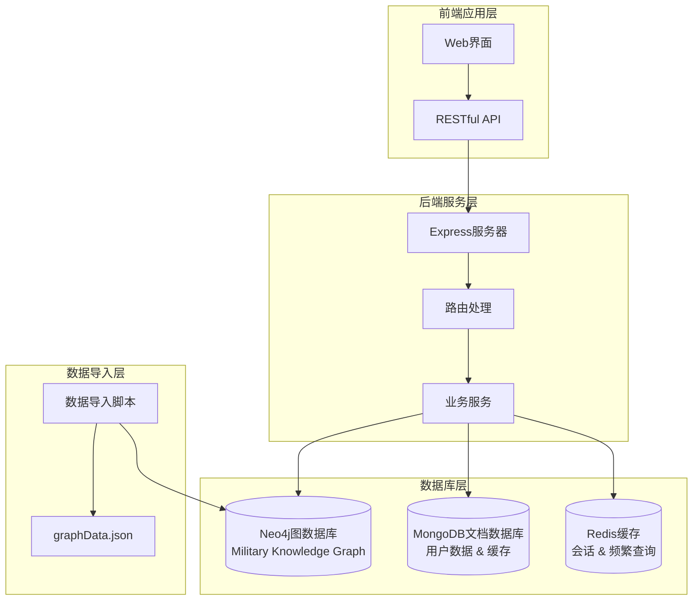
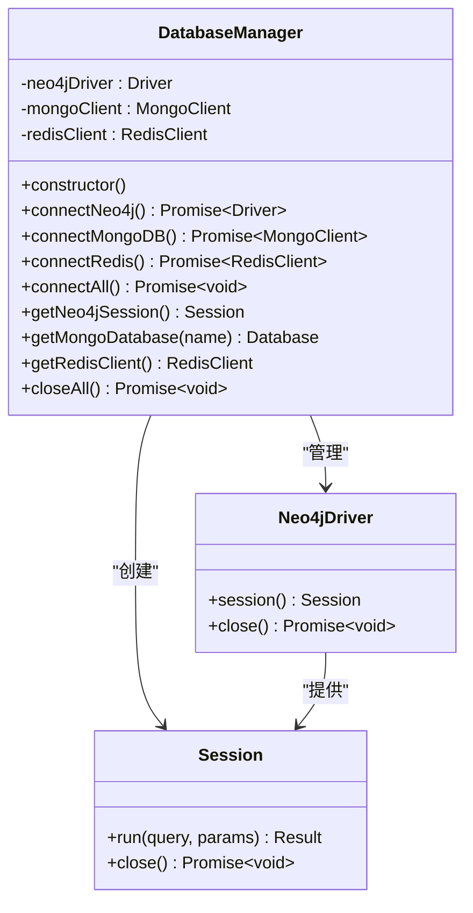
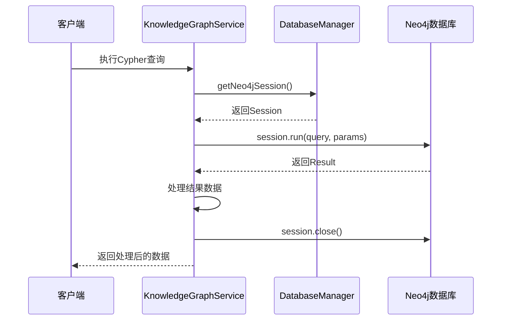
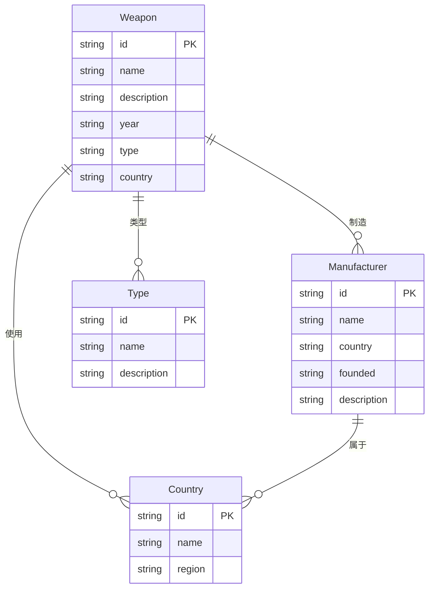
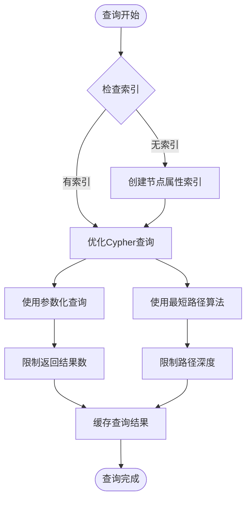
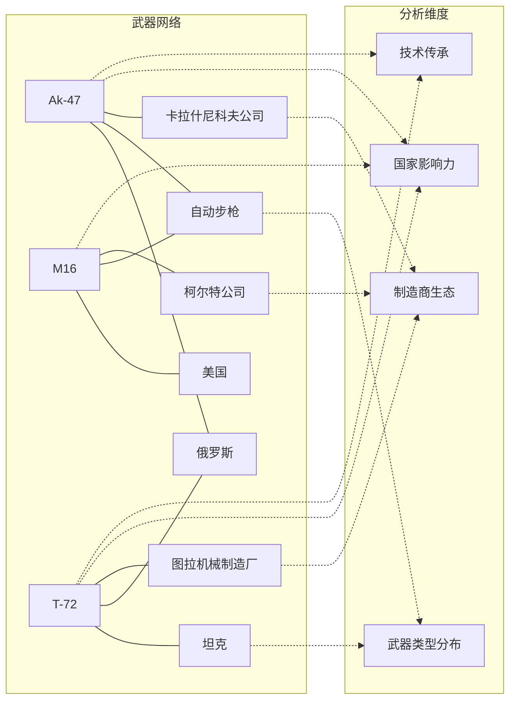
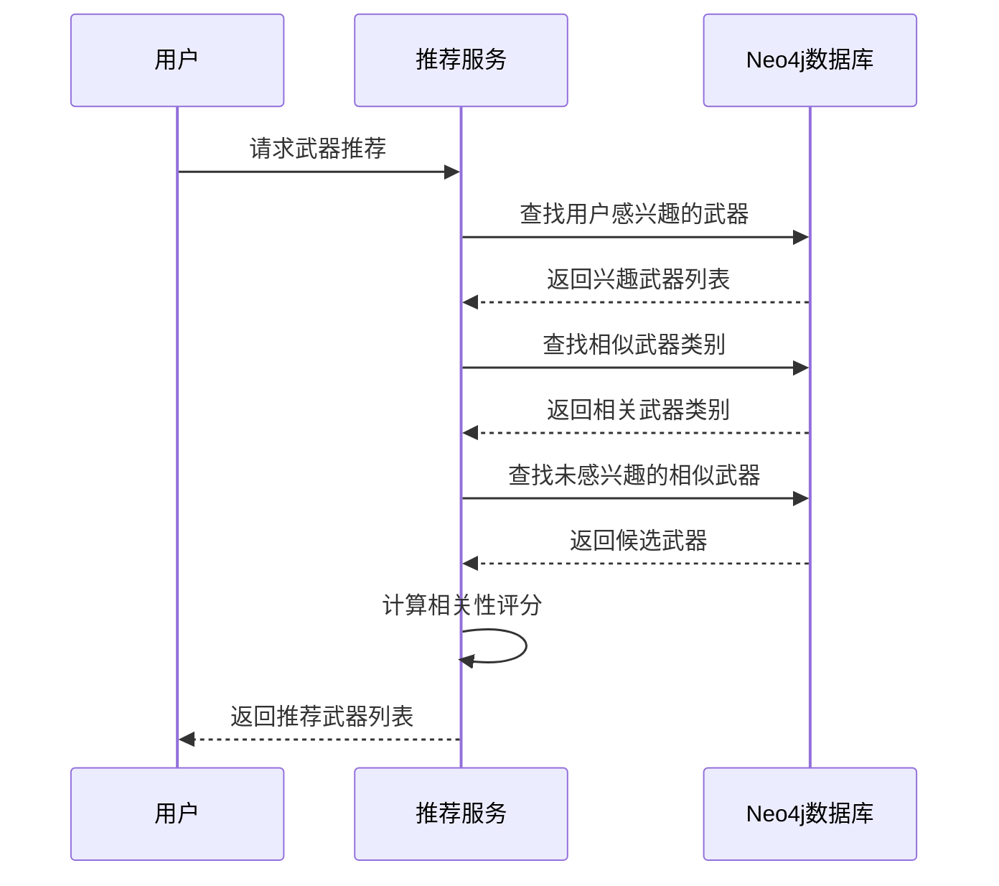
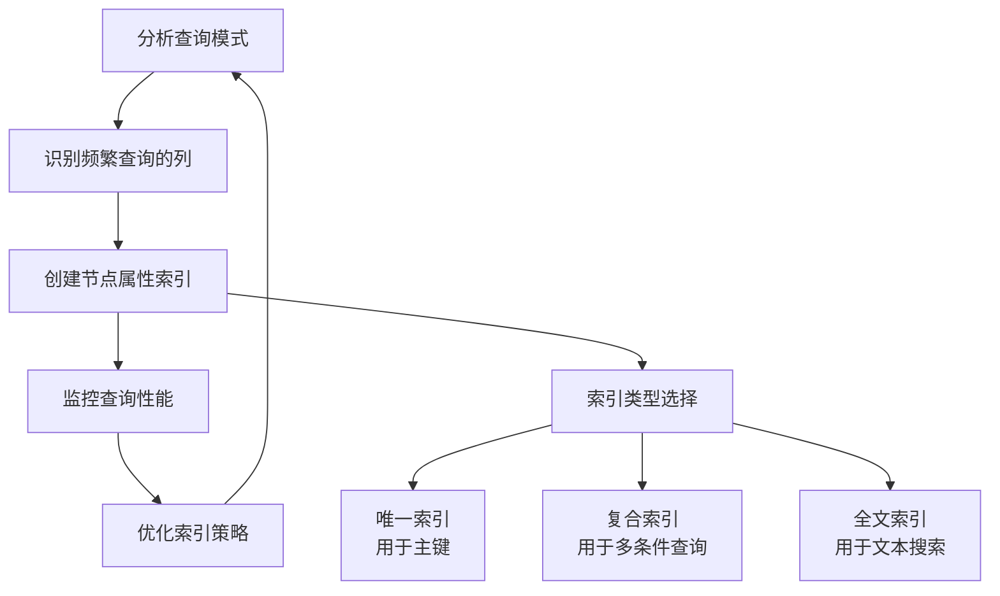
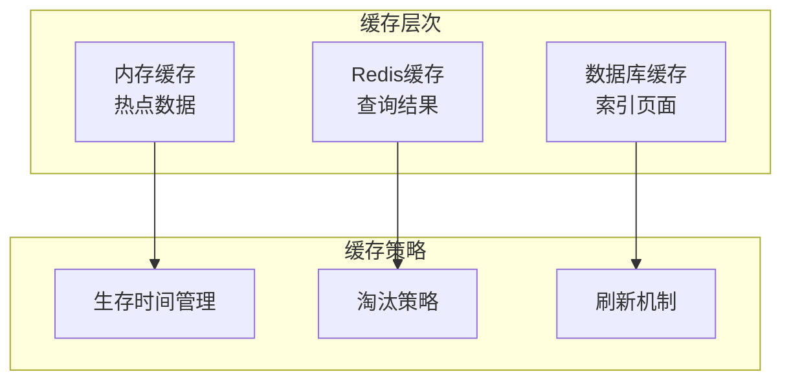
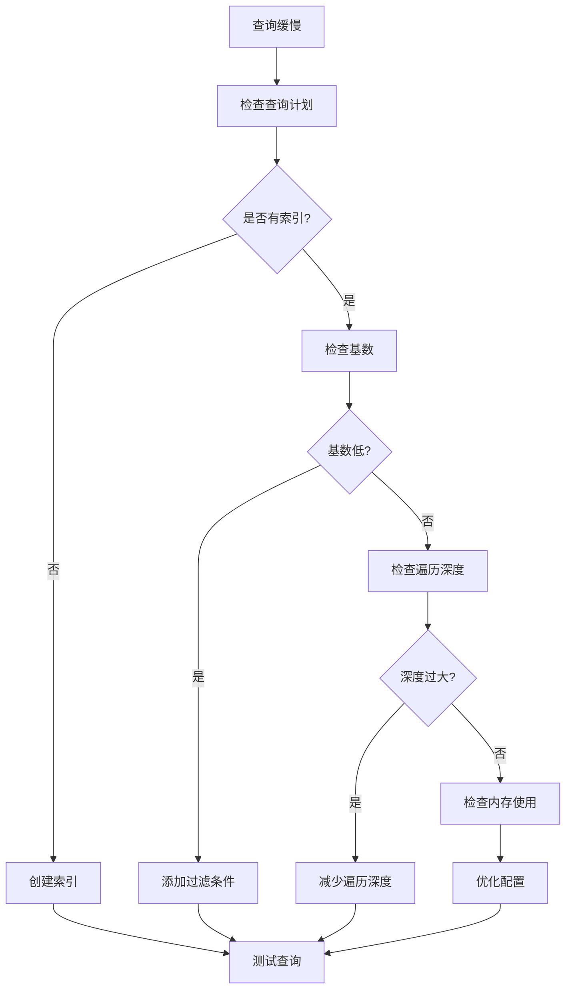

# Neo4j图数据库模型

<cite>
**本文档引用的文件**
- [database_Neo4j.js](file://backend/src/config/database_Neo4j.js)
- [graphData.json](file://data/graphData.json)
- [knowledgeGraphService.js](file://backend/src/services/knowledgeGraphService.js)
- [knowledge-graph.js](file://backend/src/routes/knowledge-graph.js)
- [index.js](file://backend/src/config/index.js)
- [.env](file://backend/.env)
- [knowledge-graph.js](file://scripts/knowledge-graph.js)
- [import-graph-data.js](file://scripts/import-graph-data.js)
</cite>

## 目录
1. [引言](#引言)
2. [项目架构概述](#项目架构概述)
3. [Neo4j连接管理](#neo4j连接管理)
4. [知识图谱数据模型](#知识图谱数据模型)
5. [节点与关系结构](#节点与关系结构)
6. [Cypher查询优化](#cypher查询优化)
7. [图数据库应用场景](#图数据库应用场景)
8. [性能调优建议](#性能调优建议)
9. [故障排除指南](#故障排除指南)
10. [总结](#总结)

## 引言

Neo4j作为领先的图数据库，在军事知识图谱中发挥着至关重要的作用。本文档深入分析了兵智世界项目中Neo4j图数据库的建模策略，包括连接管理、会话获取、多数据库协同机制，以及基于graphData.json文件的节点和关系数据结构规范。

该项目采用多数据库架构，结合Neo4j的图查询能力与传统关系数据库的优势，构建了一个完整的军事武器知识图谱系统。

## 项目架构概述

兵智世界的数据库架构采用了混合存储策略，充分利用各种数据库的优势：



**图表来源**
- [database_Neo4j.js](file://backend/src/config/database_Neo4j.js#L1-L141)
- [index.js](file://backend/src/config/index.js#L15-L35)

**章节来源**
- [database_Neo4j.js](file://backend/src/config/database_Neo4j.js#L1-L141)
- [index.js](file://backend/src/config/index.js#L1-L73)

## Neo4j连接管理

### 单例连接管理器

项目实现了DatabaseManager类作为Neo4j连接的统一管理器，采用单例模式确保连接的一致性和效率。



**图表来源**
- [database_Neo4j.js](file://backend/src/config/database_Neo4j.js#L6-L141)

### 连接配置与认证

系统通过环境变量管理数据库连接配置，支持多种部署场景：

| 配置项 | 默认值 | 描述 |
|--------|--------|------|
| NEO4J_URI | bolt://localhost:7687 | Neo4j Bolt协议连接地址 |
| NEO4J_USERNAME | neo4j | 数据库用户名 |
| NEO4J_PASSWORD | neo4j123456 | 数据库密码 |
| MONGODB_URI | mongodb://localhost:27017/military-knowledge | MongoDB连接字符串 |
| REDIS_HOST | localhost | Redis服务器主机 |
| REDIS_PORT | 6379 | Redis服务器端口 |

### 会话管理策略

KnowledgeGraphService类展示了如何正确管理Neo4j会话：



**图表来源**
- [knowledgeGraphService.js](file://backend/src/services/knowledgeGraphService.js#L6-L40)
- [database_Neo4j.js](file://backend/src/config/database_Neo4j.js#L60-L65)

**章节来源**
- [database_Neo4j.js](file://backend/src/config/database_Neo4j.js#L1-L141)
- [index.js](file://backend/src/config/index.js#L15-L35)
- [.env](file://backend/.env#L10-L12)

## 知识图谱数据模型

### 节点标签体系

基于graphData.json文件，系统定义了四个核心节点标签：



**图表来源**
- [graphData.json](file://data/graphData.json#L1-L206)

### 节点属性定义

| 节点类型 | 主要属性 | 数据类型 | 示例值 |
|----------|----------|----------|--------|
| Weapon | id, name, description, year, type, country | string | "1", "AK-47", "卡拉什尼科夫自动步枪", "1947", "自动步枪", "俄罗斯" |
| Manufacturer | id, name, country, founded, description | string | "4", "卡拉什尼科夫公司", "俄罗斯", "1948", "卡拉什尼科夫自动步枪制造商" |
| Country | id, name, region | string | "6", "俄罗斯", "欧亚大陆" |
| Type | id, name, description | string | "8", "自动步枪", "自动射击步枪类别" |

### 关系类型语义

系统定义了四种主要关系类型，每种都有明确的语义含义：

| 关系类型 | 语义描述 | 方向性 | 示例 |
|----------|----------|--------|------|
| 制造 | 表示武器由制造商生产 | Weapon → Manufacturer | AK-47 → 卡拉什尼科夫公司 |
| 使用 | 表示武器被某个国家使用 | Weapon → Country | AK-47 → 俄罗斯 |
| 类型 | 表示武器属于某种武器类型 | Weapon → Type | AK-47 → 自动步枪 |
| 属于 | 表示制造商属于某个国家 | Manufacturer → Country | 卡拉什尼科夫公司 → 俄罗斯 |

**章节来源**
- [graphData.json](file://data/graphData.json#L1-L206)

## Cypher查询优化

### 基础查询模式

KnowledgeGraphService提供了多种优化的Cypher查询模式：

#### 图谱概览查询
```cypher
MATCH (n)
RETURN labels(n) as labels, count(n) as count
ORDER BY count DESC
```

#### 路径查询优化
```cypher
MATCH path = (w:Weapon {id: $weaponId})-[*1..$depth]-(related)
RETURN w as center_weapon,
       nodes(path) as path_nodes,
       relationships(path) as path_relationships
LIMIT 100
```

#### 搜索查询优化
```cypher
MATCH (n)
WHERE (n.name CONTAINS $searchTerm OR n.description CONTAINS $searchTerm)
AND ($label0 IN labels(n) OR $label1 IN labels(n))
RETURN n, labels(n) as node_labels
LIMIT $limit
```

### 性能优化策略



**图表来源**
- [knowledgeGraphService.js](file://backend/src/services/knowledgeGraphService.js#L85-L130)
- [knowledgeGraphService.js](file://backend/src/services/knowledgeGraphService.js#L132-L180)

**章节来源**
- [knowledgeGraphService.js](file://backend/src/services/knowledgeGraphService.js#L6-L430)

## 图数据库应用场景

### 武器关联分析

Neo4j在武器关联分析方面具有天然优势，能够快速识别复杂的武器生态系统：



### 推荐系统实现

基于用户兴趣的武器推荐系统利用图数据库的路径查询能力：



**图表来源**
- [knowledgeGraphService.js](file://backend/src/services/knowledgeGraphService.js#L343-L390)

### 路径查询应用

图数据库在寻找武器间关系路径方面表现出色：

| 查询场景 | Cypher查询示例 | 应用价值 |
|----------|----------------|----------|
| 武器溯源 | `MATCH path=(start)-[*1..5]-(end) RETURN path` | 追踪武器技术传承 |
| 国家武器网络 | `MATCH (country)-[*1..3]-(:Weapon) RETURN country` | 分析国防能力 |
| 制造商生态 | `MATCH (man)-[*1..2]-(:Weapon) RETURN man` | 评估产业链 |
| 技术关联分析 | `MATCH (weapon1)-[:TYPE]->(type)<-[:TYPE]-(weapon2) RETURN weapon1, weapon2` | 发现技术相似性 |

**章节来源**
- [knowledgeGraphService.js](file://backend/src/services/knowledgeGraphService.js#L343-L430)

## 性能调优建议

### 数据库配置优化

#### Neo4j配置参数
```properties
# 内存配置
dbms.memory.heap.initial_size=4g
dbms.memory.heap.max_size=8g
dbms.memory.pagecache.size=2g

# 存储配置
dbms.directories.data=/var/lib/neo4j/data
dbms.backup.enabled=true

# 网络配置
dbms.connector.bolt.listen_address=:7687
dbms.security.auth_enabled=false
```

#### 索引优化策略



### 查询优化技巧

#### 1. 参数化查询
```cypher
// 推荐写法
MATCH (w:Weapon {id: $weaponId})
RETURN w

// 避免写法
MATCH (w:Weapon {id: "1"})
RETURN w
```

#### 2. 限制返回结果
```cypher
// 限制结果数量
MATCH (w:Weapon)
RETURN w
LIMIT 100

// 限制遍历深度
MATCH path = (w:Weapon)-[*1..3]-(related)
RETURN path
```

#### 3. 使用索引提示
```cypher
// 强制使用索引
MATCH (w:Weapon)
USING INDEX w:Weapon(id)
WHERE w.id = $weaponId
RETURN w
```

### 缓存策略



**章节来源**
- [index.js](file://backend/src/config/index.js#L45-L55)

## 故障排除指南

### 常见连接问题

#### 1. 连接超时
**症状**: 数据库连接失败，出现超时错误
**解决方案**:
- 检查网络连接状态
- 验证防火墙设置
- 确认Neo4j服务运行状态

#### 2. 认证失败
**症状**: 登录认证错误，权限被拒绝
**解决方案**:
- 验证用户名密码正确性
- 检查数据库用户权限
- 确认认证机制配置

#### 3. 内存不足
**症状**: 查询缓慢，系统内存告警
**解决方案**:
- 增加JVM堆内存大小
- 优化查询复杂度
- 启用查询计划缓存

### 性能问题诊断



### 监控指标

| 监控指标 | 正常范围 | 告警阈值 | 处理措施 |
|----------|----------|----------|----------|
| 连接数 | < 100 | > 200 | 检查连接池配置 |
| 查询响应时间 | < 100ms | > 1s | 优化查询或增加索引 |
| 内存使用率 | < 80% | > 90% | 增加内存或优化查询 |
| 磁盘I/O | < 70% | > 90% | 优化存储配置 |

**章节来源**
- [database_Neo4j.js](file://backend/src/config/database_Neo4j.js#L15-L65)

## 总结

兵智世界项目中的Neo4j图数据库建模展现了现代知识图谱系统的最佳实践。通过合理的节点标签设计、关系语义定义和查询优化策略，系统实现了高效的武器知识关联分析和智能推荐功能。

### 核心优势

1. **强大的关联分析能力**: 图数据库天然适合处理复杂的多对多关系，能够快速发现武器间的隐性联系
2. **灵活的查询模式**: 支持深度路径查询、相似性分析和推荐算法的高效实现
3. **优秀的扩展性**: 基于标签的模型设计便于添加新的节点类型和关系类型
4. **高性能的查询**: 通过索引优化和缓存策略，确保大规模数据集的查询性能

### 最佳实践总结

- 采用单例模式管理数据库连接，确保资源的有效利用
- 实现完善的错误处理和日志记录机制
- 使用参数化查询防止SQL注入攻击
- 建立多层次的缓存策略提升系统响应速度
- 定期监控和优化查询性能

这个项目为军事知识图谱的建设提供了宝贵的参考经验，展示了图数据库在复杂领域知识管理中的巨大潜力。