# Neo4j连接管理机制

<cite>
**本文档中引用的文件**
- [database_Neo4j.js](file://backend/src/config/database_Neo4j.js)
- [index.js](file://backend/src/config/index.js)
- [database-simple.js](file://backend/src/config/database-simple.js)
- [knowledgeGraphService.js](file://backend/src/services/knowledgeGraphService.js)
- [database-health-check.js](file://backend/scripts/database-health-check.js)
- [.env](file://backend/.env)
- [knowledge-graph.js](file://backend/src/routes/knowledge-graph.js)
</cite>

## 目录
1. [简介](#简介)
2. [项目结构概述](#项目结构概述)
3. [DatabaseManager类架构](#databasemanager类架构)
4. [单例模式实现](#单例模式实现)
5. [连接初始化流程](#连接初始化流程)
6. [多数据库协同架构](#多数据库协同架构)
7. [会话管理机制](#会话管理机制)
8. [错误处理策略](#错误处理策略)
9. [连接配置参数](#连接配置参数)
10. [性能优化建议](#性能优化建议)
11. [故障恢复机制](#故障恢复机制)
12. [最佳实践](#最佳实践)
13. [总结](#总结)

## 简介

本文档深入分析了兵智世界项目中实现的Neo4j连接管理架构，重点关注`database_Neo4j.js`文件中`DatabaseManager`类的设计与实现。该架构采用单例模式管理多个数据库连接（Neo4j、MongoDB、Redis），提供统一的连接池管理和生命周期控制，确保系统的稳定性和性能。

## 项目结构概述

兵智世界项目采用了多数据库协同架构，支持Neo4j图数据库、MongoDB文档数据库和Redis缓存的统一管理：

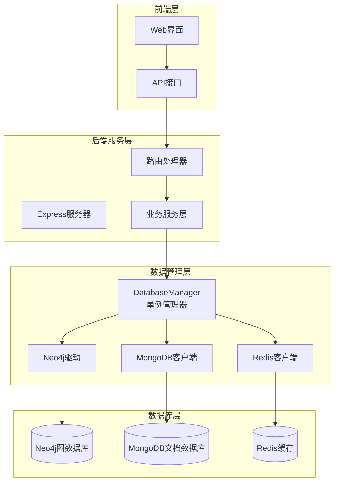

**图表来源**
- [database_Neo4j.js](file://backend/src/config/database_Neo4j.js#L1-L141)
- [index.js](file://backend/src/config/index.js#L1-L73)

**章节来源**
- [database_Neo4j.js](file://backend/src/config/database_Neo4j.js#L1-L141)
- [index.js](file://backend/src/config/index.js#L1-L73)

## DatabaseManager类架构

`DatabaseManager`类是整个数据库连接管理的核心组件，采用面向对象设计模式实现统一的数据库连接管理：

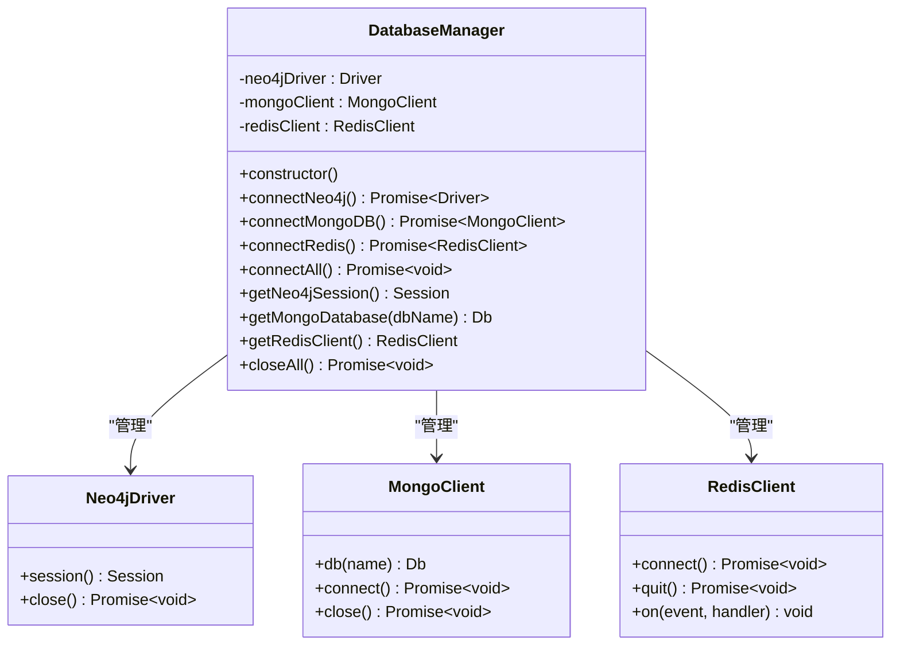

**图表来源**
- [database_Neo4j.js](file://backend/src/config/database_Neo4j.js#L5-L141)

### 类成员变量

DatabaseManager类维护三个核心连接实例：

| 成员变量 | 类型 | 描述 | 默认值 |
|---------|------|------|--------|
| `neo4jDriver` | `neo4j.Driver` | Neo4j数据库驱动实例 | `null` |
| `mongoClient` | `MongoClient` | MongoDB客户端实例 | `null` |
| `redisClient` | `RedisClient` | Redis客户端实例 | `null` |

**章节来源**
- [database_Neo4j.js](file://backend/src/config/database_Neo4j.js#L5-L10)

## 单例模式实现

项目采用经典的单例模式实现DatabaseManager类的唯一实例化：

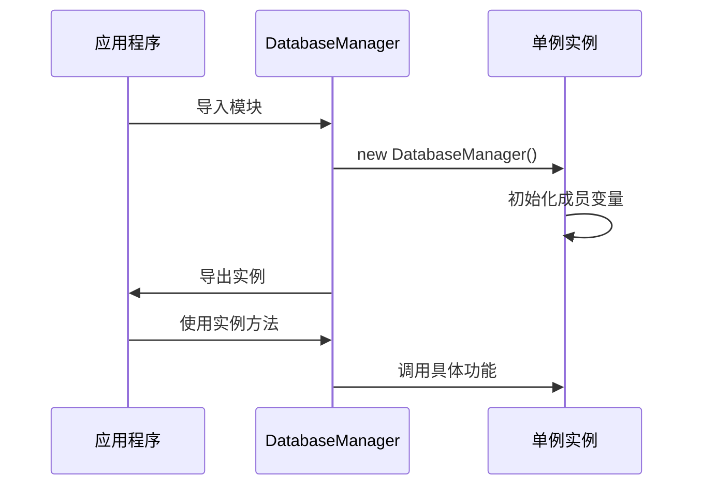

**图表来源**
- [database_Neo4j.js](file://backend/src/config/database_Neo4j.js#L138-L141)

### 单例实现细节

单例模式的实现非常简洁而有效：

1. **构造函数初始化**：在实例化时清空所有连接变量
2. **全局导出**：通过`module.exports`导出唯一的DatabaseManager实例
3. **线程安全**：Node.js模块系统保证了单例的线程安全性

**章节来源**
- [database_Neo4j.js](file://backend/src/config/database_Neo4j.js#L138-L141)

## 连接初始化流程

### connectNeo4j()方法详解

`connectNeo4j()`方法实现了Neo4j数据库的完整连接初始化流程：

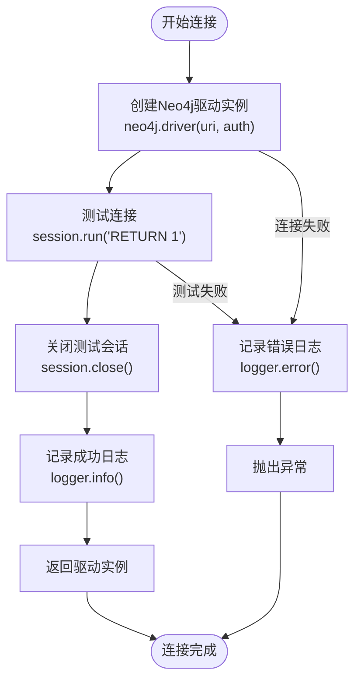

**图表来源**
- [database_Neo4j.js](file://backend/src/config/database_Neo4j.js#L12-L32)

#### 连接参数配置

| 参数 | 来源 | 描述 | 默认值 |
|------|------|------|--------|
| `uri` | `process.env.NEO4J_URI` | Neo4j数据库连接URI | `bolt://localhost:7687` |
| `username` | `process.env.NEO4J_USERNAME` | 数据库用户名 | `neo4j` |
| `password` | `process.env.NEO4J_PASSWORD` | 数据库密码 | `password` |

### connectMongoDB()方法

MongoDB连接采用MongoClient的标准连接模式：

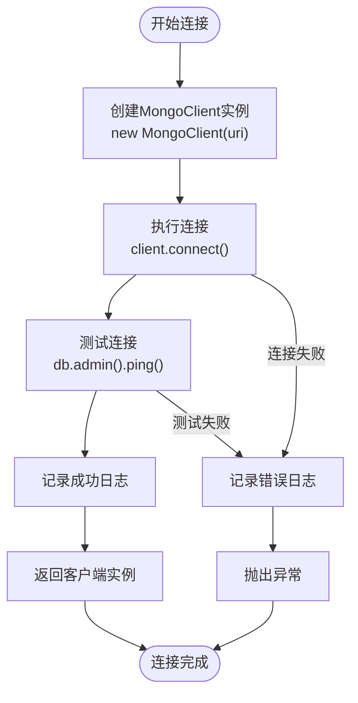

**图表来源**
- [database_Neo4j.js](file://backend/src/config/database_Neo4j.js#L34-L52)

### connectRedis()方法

Redis连接使用现代的异步连接方式：

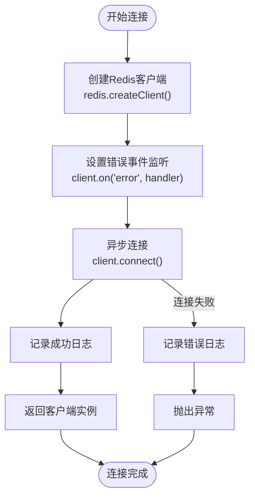

**图表来源**
- [database_Neo4j.js](file://backend/src/config/database_Neo4j.js#L54-L76)

**章节来源**
- [database_Neo4j.js](file://backend/src/config/database_Neo4j.js#L12-L76)

## 多数据库协同架构

### connectAll()方法

`connectAll()`方法实现了并发连接所有数据库的功能：

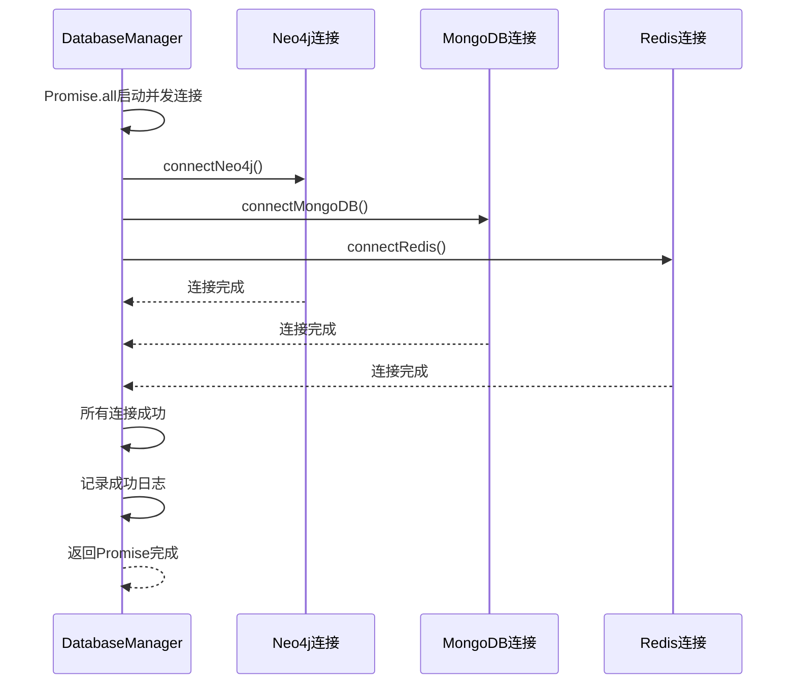

**图表来源**
- [database_Neo4j.js](file://backend/src/config/database_Neo4j.js#L78-L87)

### 数据库实例获取方法

每个数据库都有对应的实例获取方法：

| 方法名 | 功能 | 参数 | 返回值 |
|--------|------|------|--------|
| `getNeo4jSession()` | 获取Neo4j会话 | 无 | `neo4j.Session` |
| `getMongoDatabase()` | 获取MongoDB数据库实例 | `dbName` (默认'military-knowledge') | `mongodb.Db` |
| `getRedisClient()` | 获取Redis客户端 | 无 | `redis.RedisClient` |

**章节来源**
- [database_Neo4j.js](file://backend/src/config/database_Neo4j.js#L78-L137)

## 会话管理机制

### getNeo4jSession()方法

Neo4j会话管理采用简单而有效的模式：

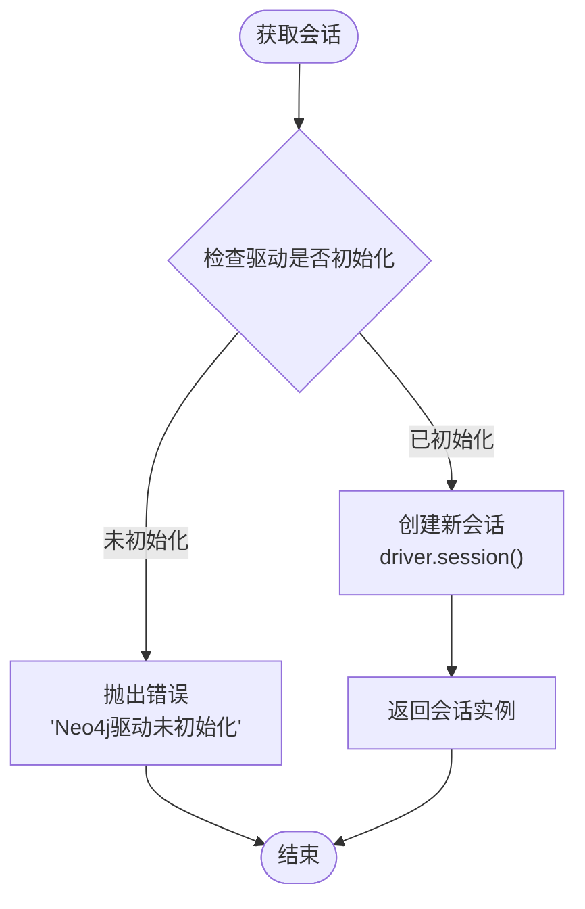

**图表来源**
- [database_Neo4j.js](file://backend/src/config/database_Neo4j.js#L89-L95)

### 会话生命周期管理

在知识图谱服务中，会话的典型使用模式：

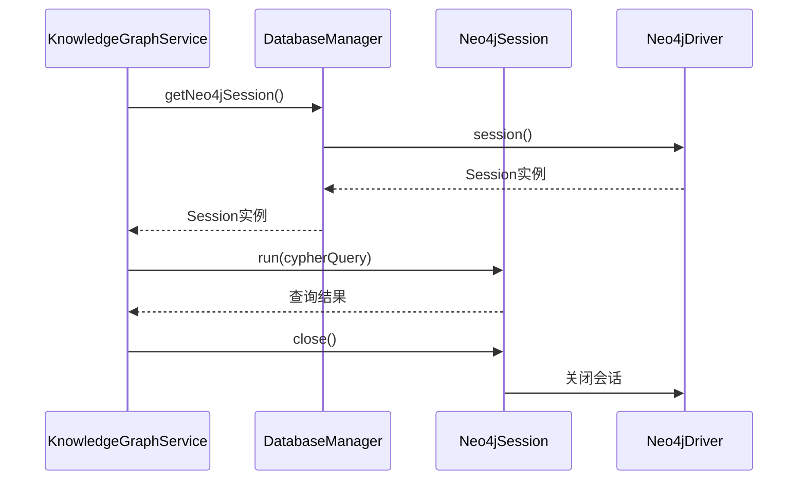

**图表来源**
- [knowledgeGraphService.js](file://backend/src/services/knowledgeGraphService.js#L5-L37)

**章节来源**
- [database_Neo4j.js](file://backend/src/config/database_Neo4j.js#L89-L95)
- [knowledgeGraphService.js](file://backend/src/services/knowledgeGraphService.js#L5-L37)

## 错误处理策略

### 统一错误处理模式

所有连接方法都采用相同的错误处理模式：

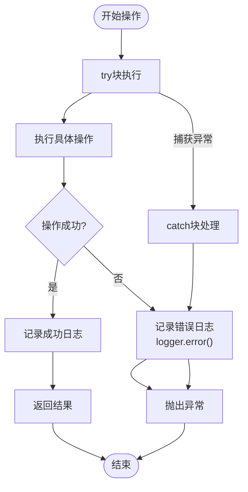

**图表来源**
- [database_Neo4j.js](file://backend/src/config/database_Neo4j.js#L12-L32)

### 错误类型与处理

| 错误类型 | 处理策略 | 示例场景 |
|----------|----------|----------|
| 连接超时 | 记录日志并抛出异常 | 网络不稳定、服务器无响应 |
| 认证失败 | 记录详细错误信息 | 用户名密码错误 |
| 配置错误 | 立即终止初始化 | URI格式错误、端口不可用 |
| 资源不足 | 记录警告并重试 | 内存不足、连接数超限 |

**章节来源**
- [database_Neo4j.js](file://backend/src/config/database_Neo4j.js#L12-L76)

## 连接配置参数

### 环境变量配置

项目通过`.env`文件集中管理所有数据库连接配置：

| 配置项 | 环境变量 | 默认值 | 描述 |
|--------|----------|--------|------|
| Neo4j URI | `NEO4J_URI` | `bolt://localhost:7687` | Bolt协议连接地址 |
| Neo4j 用户名 | `NEO4J_USERNAME` | `neo4j` | 数据库认证用户名 |
| Neo4j 密码 | `NEO4J_PASSWORD` | `password` | 数据库认证密码 |
| MongoDB URI | `MONGODB_URI` | `mongodb://localhost:27017/military-knowledge` | MongoDB连接字符串 |
| Redis 主机 | `REDIS_HOST` | `localhost` | Redis服务器地址 |
| Redis 端口 | `REDIS_PORT` | `6379` | Redis服务器端口 |
| Redis 密码 | `REDIS_PASSWORD` | `undefined` | Redis认证密码（可选） |

### 配置验证机制

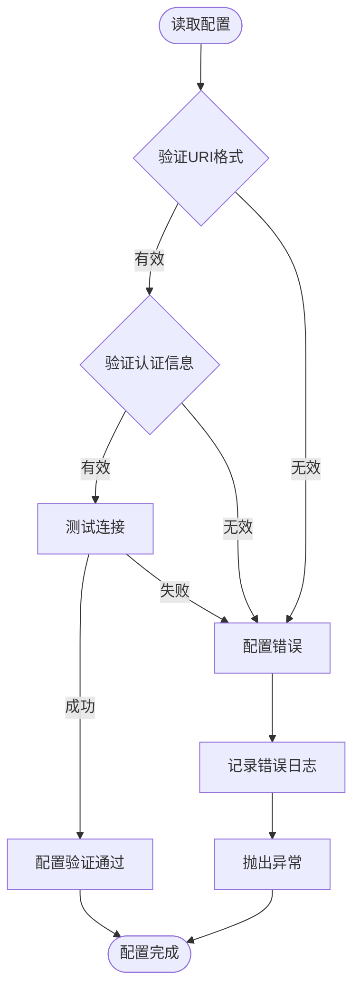

**图表来源**
- [index.js](file://backend/src/config/index.js#L15-L42)
- [.env](file://backend/.env#L1-L35)

**章节来源**
- [index.js](file://backend/src/config/index.js#L15-L42)
- [.env](file://backend/.env#L1-L35)

## 性能优化建议

### 连接池管理

虽然当前实现没有显式的连接池配置，但各数据库驱动本身都内置了连接池管理：

| 数据库 | 内置连接池特性 | 优化建议 |
|--------|---------------|----------|
| Neo4j | 自动连接池管理 | 设置合理的会话超时时间 |
| MongoDB | 内置连接池 | 配置合适的连接池大小 |
| Redis | 单连接模式 | 考虑使用连接池客户端 |

### 会话复用策略

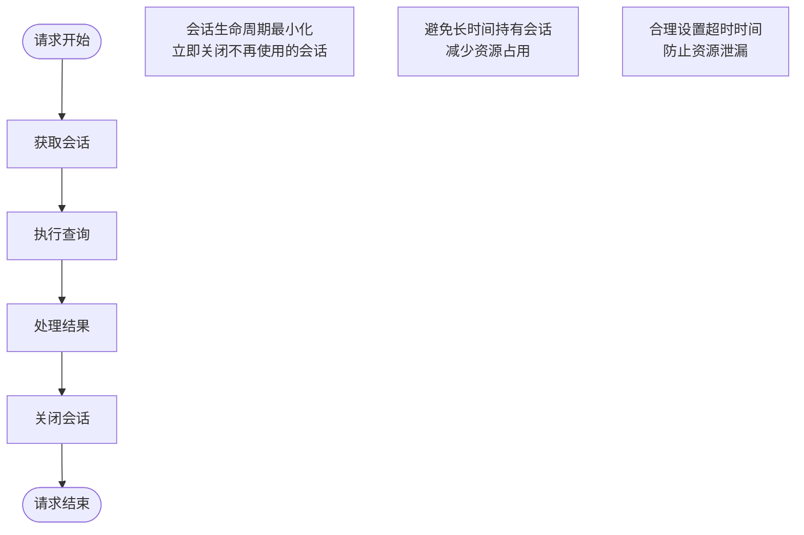

### 缓存策略

项目中Redis主要用于缓存，建议的缓存策略：

| 缓存类型 | TTL设置 | 使用场景 |
|----------|---------|----------|
| 知识图谱数据 | 2小时 | 频繁访问的图数据 |
| 用户数据 | 30分钟 | 用户基本信息 |
| 通用数据 | 1小时 | 不经常变化的数据 |

**章节来源**
- [database_Neo4j.js](file://backend/src/config/database_Neo4j.js#L89-L137)

## 故障恢复机制

### 连接健康检查

项目提供了完整的数据库健康检查机制：

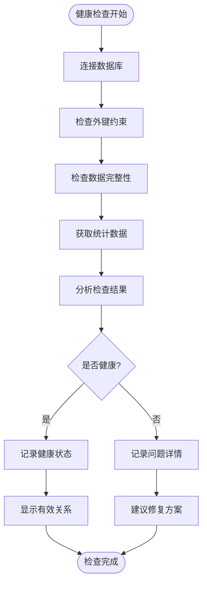

**图表来源**
- [database-health-check.js](file://backend/scripts/database-health-check.js#L125-L175)

### 异常处理与恢复

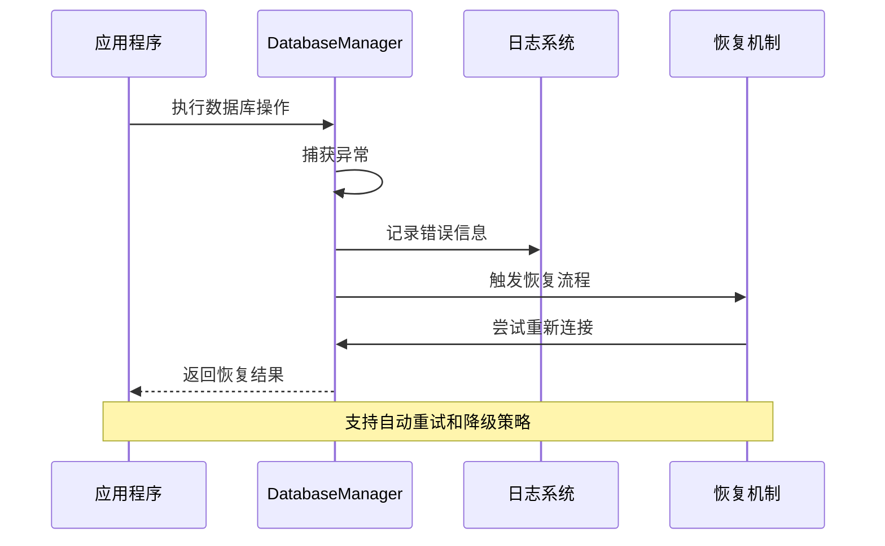

**图表来源**
- [database_Neo4j.js](file://backend/src/config/database_Neo4j.js#L115-L137)

**章节来源**
- [database-health-check.js](file://backend/scripts/database-health-check.js#L125-L175)

## 最佳实践

### 连接管理最佳实践

1. **及时关闭连接**：每次使用完数据库连接后立即关闭
2. **异常安全编程**：使用try-catch确保资源正确释放
3. **配置外部化**：通过环境变量管理所有配置参数
4. **监控与日志**：完善的日志记录和监控机制

### 代码使用示例

```javascript
// 获取Neo4j会话的最佳实践
const session = databaseManager.getNeo4jSession();
try {
    const result = await session.run(query, parameters);
    // 处理结果
} finally {
    await session.close(); // 确保会话关闭
}

// 并发连接初始化
await databaseManager.connectAll();
```

### 性能监控指标

| 监控指标 | 监控方法 | 告警阈值 |
|----------|----------|----------|
| 连接成功率 | 日志统计 | < 99% |
| 平均响应时间 | 请求计时 | > 100ms |
| 连接池使用率 | 驱动内置监控 | > 80% |
| 错误率 | 异常统计 | > 1% |

**章节来源**
- [database_Neo4j.js](file://backend/src/config/database_Neo4j.js#L115-L137)
- [knowledgeGraphService.js](file://backend/src/services/knowledgeGraphService.js#L5-L37)

## 总结

兵智世界的Neo4j连接管理架构展现了优秀的软件设计原则：

1. **单一职责**：DatabaseManager类专注于数据库连接管理
2. **开闭原则**：易于扩展新的数据库类型
3. **依赖注入**：通过单例模式提供统一的访问接口
4. **异常处理**：完善的错误处理和恢复机制
5. **配置管理**：灵活的环境变量配置系统

该架构不仅满足了当前的业务需求，还为未来的扩展和优化奠定了坚实的基础。通过合理的抽象和封装，开发者可以专注于业务逻辑的实现，而不必担心底层数据库连接的复杂性。