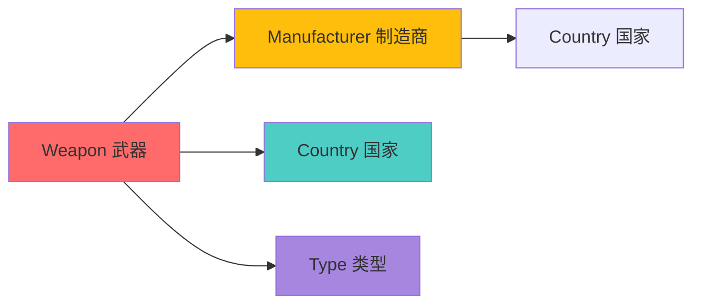
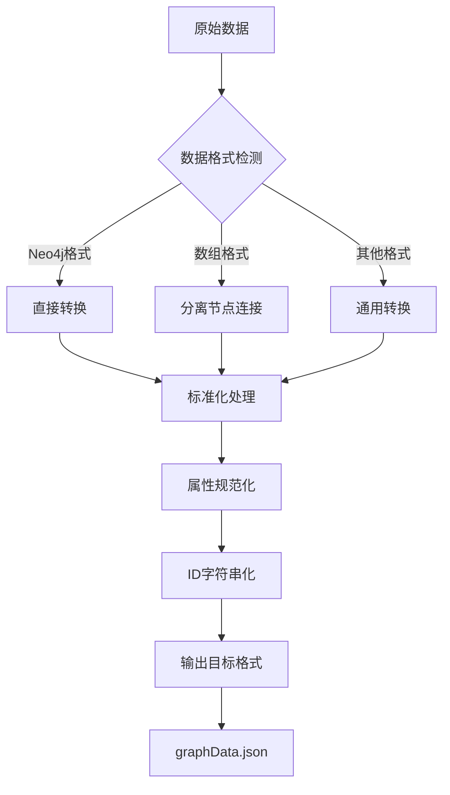

# 图数据模型设计

<cite>
**本文档引用的文件**
- [graphData.json](file://data/graphData.json)
- [knowledge-graph.js](file://scripts/knowledge-graph.js)
- [knowledge-graph-analysis.js](file://scripts/knowledge-graph-analysis.js)
- [convert-graph-format.js](file://scripts/convert-graph-format.js)
- [countries.json](file://data/countries.json)
- [knowledgeGraphService.js](file://backend/src/services/knowledgeGraphService.js)
- [knowledge-graph.js](file://backend/src/routes/knowledge-graph.js)
- [knowledge-graph-analysis-fixed.js](file://scripts/knowledge-graph-analysis-fixed.js)
</cite>

## 目录
1. [项目概述](#项目概述)
2. [核心节点模型设计](#核心节点模型设计)
3. [关系模型设计](#关系模型设计)
4. [数据结构规范](#数据结构规范)
5. [节点标签命名规范](#节点标签命名规范)
6. [属性命名约定](#属性命名约定)
7. [关系方向设计原则](#关系方向设计原则)
8. [数据转换与格式化](#数据转换与格式化)
9. [实际应用示例](#实际应用示例)
10. [模型扩展性考虑](#模型扩展性考虑)

## 项目概述

军事知识图谱项目采用基于Neo4j图数据库的知识表示方法，构建了一个全面的军事装备知识网络。该模型通过四个核心节点类型（Weapon、Manufacturer、Country、Type）和四种关系类型（制造、使用、类型、属于），实现了对军事装备全生命周期的完整建模。

## 核心节点模型设计

### Weapon节点（武器节点）

Weapon节点是知识图谱的核心实体，代表各种军事装备和武器系统。

**属性结构：**
| 属性名 | 数据类型 | 必填 | 语义定义 | 示例值 |
|--------|----------|------|----------|--------|
| id | string | 是 | 唯一标识符 | "1", "weapon_123" |
| name | string | 是 | 武器名称 | "AK-47", "F-22猛禽" |
| description | string | 否 | 武器描述信息 | "卡拉什尼科夫自动步枪" |
| year | string | 否 | 投入服役年份 | "1947", "2005" |
| type | string | 否 | 武器类型标识 | "自动步枪", "战斗机" |
| country | string | 否 | 使用国家 | "俄罗斯", "美国" |

**节点示例：**
```json
{
    "id": "1",
    "labels": ["Weapon"],
    "properties": {
        "name": "AK-47",
        "description": "卡拉什尼科夫自动步枪",
        "year": "1947"
    }
}
```

### Manufacturer节点（制造商节点）

Manufacturer节点表示武器的生产制造企业或机构。

**属性结构：**
| 属性名 | 数据类型 | 必填 | 语义定义 | 示例值 |
|--------|----------|------|----------|--------|
| id | string | 是 | 唯一标识符 | "4", "manufacturer_567" |
| name | string | 是 | 制造商名称 | "卡拉什尼科夫公司", "洛克希德·马丁" |
| description | string | 否 | 制造商描述 | "俄罗斯著名武器制造商" |
| country | string | 否 | 所属国家 | "俄罗斯", "美国" |
| founded | string | 否 | 成立年份 | "1948", "1995" |

**节点示例：**
```json
{
    "id": "4",
    "labels": ["Manufacturer"],
    "properties": {
        "name": "卡拉什尼科夫公司",
        "country": "俄罗斯",
        "founded": "1948"
    }
}
```

### Country节点（国家节点）

Country节点代表武器使用或生产的国家实体。

**属性结构：**
| 属性名 | 数据类型 | 必填 | 语义定义 | 示例值 |
|--------|----------|------|----------|--------|
| id | string | 是 | 唯一标识符 | "6", "country_8" |
| name | string | 是 | 国家名称 | "俄罗斯", "美国" |
| region | string | 否 | 地区归属 | "欧亚大陆", "北美洲" |

**节点示例：**
```json
{
    "id": "6",
    "labels": ["Country"],
    "properties": {
        "name": "俄罗斯",
        "region": "欧亚大陆"
    }
}
```

### Type节点（类型节点）

Type节点定义武器的分类体系和类型层次结构。

**属性结构：**
| 属性名 | 数据类型 | 必填 | 语义定义 | 示例值 |
|--------|----------|------|----------|--------|
| id | string | 是 | 唯一标识符 | "8", "type_15" |
| name | string | 是 | 类型名称 | "自动步枪", "战斗机" |
| description | string | 否 | 类型描述 | "单兵轻武器" |

**节点示例：**
```json
{
    "id": "8",
    "labels": ["Type"],
    "properties": {
        "name": "自动步枪"
    }
}
```

## 关系模型设计

### 制造关系（Manufacturing Relationship）

**语义含义：** 表示武器与制造商之间的生产制造关系。

**关系特性：**
- 方向：Weapon → Manufacturer
- 语义：某武器由特定制造商生产
- 应用场景：追踪武器的生产来源

**示例：**
```json
{
    "source": "1",
    "target": "4",
    "type": "制造"
}
```

### 使用关系（Usage Relationship）

**语义含义：** 表示武器与使用国家之间的部署使用关系。

**关系特性：**
- 方向：Weapon → Country
- 语义：某武器被特定国家使用
- 应用场景：分析武器的国际部署情况

**示例：**
```json
{
    "source": "1",
    "target": "6",
    "type": "使用"
}
```

### 类型关系（Classification Relationship）

**语义含义：** 表示武器与其分类类型之间的隶属关系。

**关系特性：**
- 方向：Weapon → Type
- 语义：某武器属于特定的武器类型
- 应用场景：武器分类和检索

**示例：**
```json
{
    "source": "1",
    "target": "8",
    "type": "类型"
}
```

### 属于关系（Belonging Relationship）

**语义含义：** 表示制造商与所属国家之间的组织归属关系。

**关系特性：**
- 方向：Manufacturer → Country
- 语义：某制造商位于特定国家
- 应用场景：分析制造商的地理分布

**示例：**
```json
{
    "source": "18",
    "target": "7",
    "type": "属于"
}
```

## 数据结构规范

### 节点数据结构

每个节点遵循统一的结构规范：

```json
{
    "id": "节点唯一标识符",
    "labels": ["节点标签数组"],
    "properties": {
        "属性名": "属性值"
    }
}
```

### 关系数据结构

每条关系包含以下要素：

```json
{
    "source": "源节点ID",
    "target": "目标节点ID",
    "type": "关系类型"
}
```

### 数据完整性约束

1. **唯一性约束：** 每个节点的id必须唯一
2. **存在性约束：** 关系的source和target必须指向存在的节点
3. **类型约束：** labels数组不能为空，至少包含一个有效标签
4. **属性约束：** 必填属性必须提供有效值

## 节点标签命名规范

### 标签命名原则

1. **首字母大写：** 使用PascalCase命名法
2. **语义明确：** 标签名称应准确反映节点类型
3. **避免歧义：** 标签应具有清晰的业务含义

### 推荐标签列表

| 标签名称 | 适用场景 | 示例 |
|----------|----------|------|
| Weapon | 武器实体 | AK-47, F-22 |
| Manufacturer | 制造商实体 | 卡拉什尼科夫公司 |
| Country | 国家实体 | 俄罗斯, 美国 |
| Type | 类型分类 | 自动步枪, 战斗机 |

## 属性命名约定

### 命名规范

1. **驼峰命名法：** 使用camelCase命名属性
2. **语义化命名：** 属性名应直观反映其含义
3. **避免缩写：** 除非是广泛认可的缩写

### 属性命名示例

| 属性类型 | 命名示例 | 说明 |
|----------|----------|------|
| 基础属性 | name, description | 基本描述信息 |
| 数值属性 | year, quantity | 数字类型属性 |
| 关联属性 | country, type | 引用其他节点的属性 |
| 时间属性 | founded, created_at | 时间戳相关 |

## 关系方向设计原则

### 方向性设计

1. **语义驱动：** 关系方向应符合现实世界的语义逻辑
2. **查询效率：** 方向设计应优化常见查询模式
3. **一致性原则：** 同类关系应保持一致的方向性

### 方向性示例



**图表来源**
- [graphData.json](file://data/graphData.json#L1-L206)

### 关系方向决策表

| 关系类型 | 方向 | 理由 | 查询示例 |
|----------|------|------|----------|
| 制造 | Weapon → Manufacturer | 武器由制造商生产 | 查找某武器的制造商 |
| 使用 | Weapon → Country | 武器被国家使用 | 查找某武器的使用国家 |
| 类型 | Weapon → Type | 武器属于某种类型 | 查找某武器的分类 |
| 属于 | Manufacturer → Country | 制造商属于某国家 | 查找某制造商的归属 |

## 数据转换与格式化

### 格式转换流程

项目提供了完整的数据格式转换工具链：



**图表来源**
- [convert-graph-format.js](file://scripts/convert-graph-format.js#L95-L196)

### 转换规则

1. **节点转换：**
   - 保留原始ID
   - 标签转换为数组格式
   - 属性标准化处理

2. **关系转换：**
   - 保持source和target结构
   - 类型字段标准化
   - ID确保字符串格式

**章节来源**
- [convert-graph-format.js](file://scripts/convert-graph-format.js#L95-L196)

## 实际应用示例

### 武器与制造商关联模式

**示例1：AK-47与卡拉什尼科夫公司的关系**
```json
{
    "nodes": [
        {
            "id": "1",
            "labels": ["Weapon"],
            "properties": {"name": "AK-47"}
        },
        {
            "id": "4",
            "labels": ["Manufacturer"],
            "properties": {"name": "卡拉什尼科夫公司"}
        }
    ],
    "links": [
        {
            "source": "1",
            "target": "4",
            "type": "制造"
        }
    ]
}
```

**示例2：F-22与洛克希德·马丁的关系**
```json
{
    "nodes": [
        {"id": "10", "labels": ["Weapon"], "properties": {"name": "F-22猛禽"}},
        {"id": "18", "labels": ["Manufacturer"], "properties": {"name": "洛克希德·马丁"}}
    ],
    "links": [
        {"source": "10", "target": "18", "type": "制造"}
    ]
}
```

### 国家使用关系示例

**示例：AK-47在俄罗斯的使用**
```json
{
    "nodes": [
        {"id": "1", "labels": ["Weapon"], "properties": {"name": "AK-47"}},
        {"id": "6", "labels": ["Country"], "properties": {"name": "俄罗斯"}}
    ],
    "links": [
        {"source": "1", "target": "6", "type": "使用"}
    ]
}
```

### 类型分类体系

**示例：武器类型层次**
```json
{
    "nodes": [
        {"id": "1", "labels": ["Weapon"], "properties": {"name": "AK-47"}},
        {"id": "8", "labels": ["Type"], "properties": {"name": "自动步枪"}}
    ],
    "links": [
        {"source": "1", "target": "8", "type": "类型"}
    ]
}
```

**章节来源**
- [graphData.json](file://data/graphData.json#L1-L206)

## 模型扩展性考虑

### 可扩展的节点类型

当前模型支持以下扩展节点类型：

1. **User节点：** 用户实体，支持用户交互功能
2. **Category节点：** 更细粒度的武器分类
3. **Technology节点：** 技术专利和创新
4. **Event节点：** 武器相关的历史事件

### 关系类型的扩展

可以添加更多关系类型：
- **研发关系：** Weapon → Researcher
- **出口关系：** Weapon → Country (出口)
- **技术转让：** Manufacturer → Technology
- **竞争关系：** Weapon ↔ Weapon (相似度)

### 属性扩展策略

1. **版本控制：** 支持属性的历史版本记录
2. **多语言支持：** 添加国际化属性
3. **质量评分：** 为武器添加性能评分属性
4. **成本属性：** 添加武器的成本相关信息

### 性能优化建议

1. **索引策略：** 为常用查询属性建立索引
2. **分层存储：** 区分高频访问和低频访问的数据
3. **缓存机制：** 缓存常用的查询结果
4. **分区设计：** 按国家或武器类型进行数据分区

**章节来源**
- [knowledgeGraphService.js](file://backend/src/services/knowledgeGraphService.js#L1-L430)
- [knowledge-graph.js](file://backend/src/routes/knowledge-graph.js#L43-L120)

## 结论

军事知识图谱的数据模型设计体现了现代知识图谱的最佳实践，通过四个核心节点类型和四种关系类型，构建了一个完整、一致且可扩展的军事装备知识网络。该模型不仅满足了当前的业务需求，还为未来的功能扩展和技术演进奠定了坚实的基础。

模型的设计充分考虑了军事领域的特殊性，确保了数据的准确性、一致性和可维护性。同时，通过标准化的数据格式和完善的转换工具，保证了系统的可集成性和可扩展性。