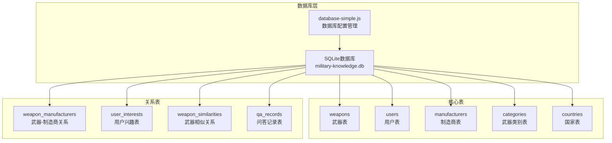
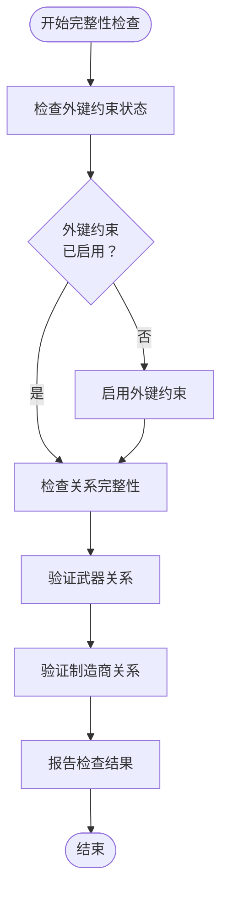
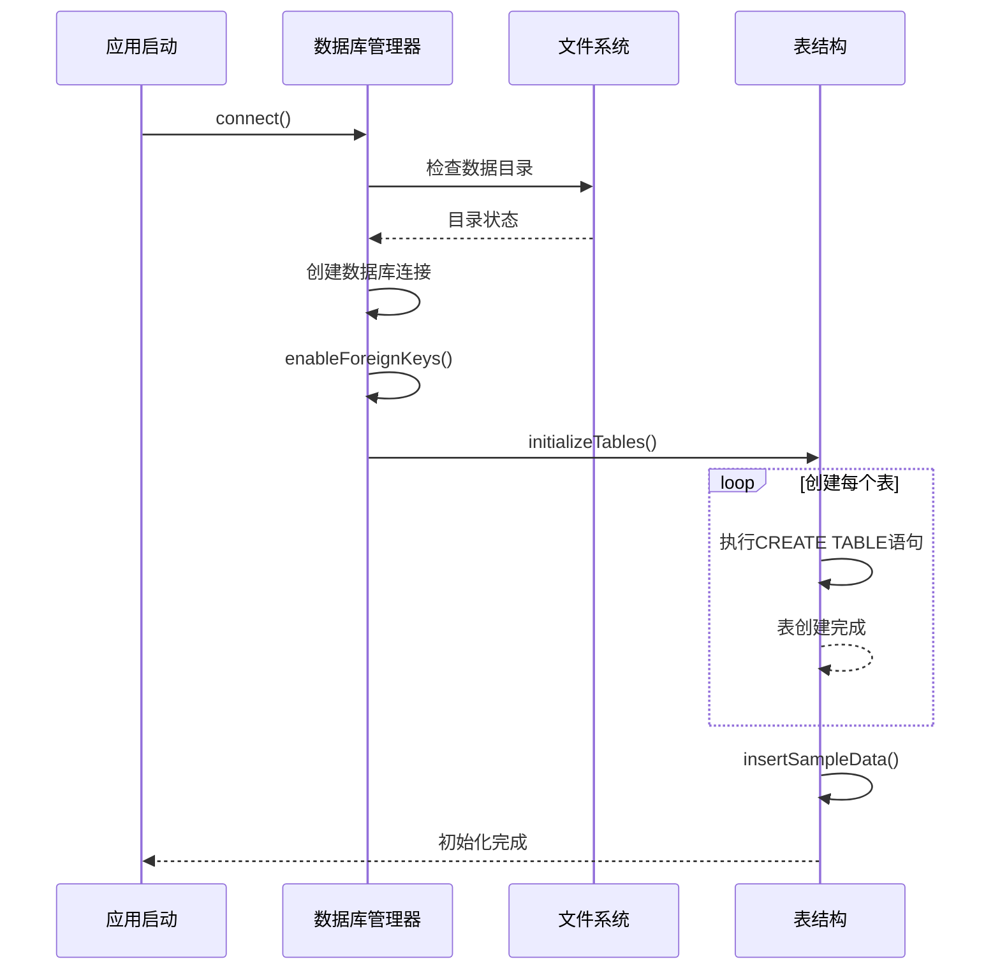
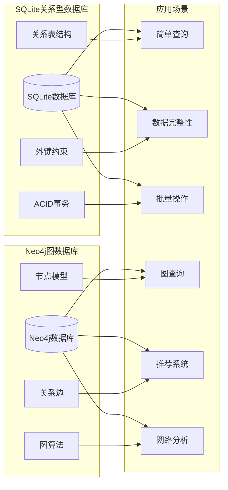

# SQLite关系型数据库设计

<cite>
**本文档中引用的文件**
- [database-simple.js](file://backend/src/config/database-simple.js)
- [init-db.js](file://backend/init-db.js)
- [init-database.js](file://backend/scripts/init-database.js)
- [weapons-simple.js](file://backend/src/routes/weapons-simple.js)
- [weaponService.js](file://backend/src/services/weaponService.js)
- [userService-simple.js](file://backend/src/services/userService-simple.js)
- [database-health-check.js](file://backend/scripts/database-health-check.js)
- [fix-database-integrity.js](file://backend/scripts/fix-database-integrity.js)
- [populate-weapon-manufacturer-relations.js](file://backend/scripts/populate-weapon-manufacturer-relations.js)
- [manufacturer-statistics.js](file://backend/src/routes/manufacturer-statistics.js)
- [index.js](file://backend/src/config/index.js)
</cite>

## 目录
1. [简介](#简介)
2. [项目结构概览](#项目结构概览)
3. [核心表结构设计](#核心表结构设计)
4. [外键约束与数据完整性](#外键约束与数据完整性)
5. [辅助表与关系设计](#辅助表与关系设计)
6. [数据库初始化流程](#数据库初始化流程)
7. [内存缓存机制](#内存缓存机制)
8. [SQL查询优化](#sql查询优化)
9. [事务处理模式](#事务处理模式)
10. [SQLite与Neo4j对比](#sqlite与neo4j对比)
11. [故障排除指南](#故障排除指南)
12. [总结](#总结)

## 简介

兵智世界v1.3项目采用SQLite作为核心关系型数据库，配合内存缓存机制，构建了一个高效的知识管理体系。该数据库设计专注于武器知识的结构化存储，支持复杂的查询和关系管理，同时通过外键约束确保数据完整性。

## 项目结构概览



**图表来源**
- [database-simple.js](file://backend/src/config/database-simple.js#L48-L157)

**章节来源**
- [database-simple.js](file://backend/src/config/database-simple.js#L1-L323)

## 核心表结构设计

### 武器表 (weapons)

武器表是整个数据库的核心实体表，存储所有武器的基本信息。

| 字段名 | 数据类型 | 约束 | 说明 |
|--------|----------|------|------|
| id | INTEGER | PRIMARY KEY AUTOINCREMENT | 主键，自增ID |
| name | TEXT | NOT NULL | 武器名称 |
| type | TEXT | NOT NULL | 武器类型（步枪、手枪等） |
| country | TEXT | NOT NULL | 生产国家 |
| year | INTEGER | - | 生产年份 |
| description | TEXT | - | 武器描述 |
| specifications | TEXT | DEFAULT '{}' | 规格参数（JSON格式） |
| images | TEXT | DEFAULT '[]' | 图片列表（JSON数组） |
| performance_data | TEXT | DEFAULT '{}' | 性能数据（JSON格式） |
| created_at | DATETIME | DEFAULT CURRENT_TIMESTAMP | 创建时间 |
| updated_at | DATETIME | DEFAULT CURRENT_TIMESTAMP | 更新时间 |

### 用户表 (users)

用户表管理系统的用户账户信息和权限。

| 字段名 | 数据类型 | 约束 | 说明 |
|--------|----------|------|------|
| id | INTEGER | PRIMARY KEY AUTOINCREMENT | 主键，自增ID |
| username | TEXT | UNIQUE NOT NULL | 用户名 |
| email | TEXT | UNIQUE NOT NULL | 邮箱地址 |
| password_hash | TEXT | NOT NULL | 密码哈希值 |
| name | TEXT | - | 真实姓名 |
| phone | TEXT | - | 联系电话 |
| bio | TEXT | - | 个人简介 |
| avatar | TEXT | - | 头像URL |
| role | TEXT | DEFAULT 'user' | 用户角色 |
| status | TEXT | DEFAULT 'active' | 账户状态 |
| preferences | TEXT | DEFAULT '{}' | 用户偏好设置 |
| created_at | DATETIME | DEFAULT CURRENT_TIMESTAMP | 注册时间 |
| updated_at | DATETIME | DEFAULT CURRENT_TIMESTAMP | 最后更新 |
| last_login | DATETIME | - | 最后登录时间 |

### 制造商表 (manufacturers)

制造商表存储武器制造企业的基本信息。

| 字段名 | 数据类型 | 约束 | 说明 |
|--------|----------|------|------|
| id | INTEGER | PRIMARY KEY AUTOINCREMENT | 主键，自增ID |
| name | TEXT | UNIQUE NOT NULL | 制造商名称 |
| country | TEXT | - | 所属国家 |
| founded | INTEGER | - | 成立年份 |
| description | TEXT | - | 公司描述 |
| created_at | DATETIME | DEFAULT CURRENT_TIMESTAMP | 创建时间 |
| updated_at | DATETIME | DEFAULT CURRENT_TIMESTAMP | 更新时间 |

**章节来源**
- [database-simple.js](file://backend/src/config/database-simple.js#L48-L157)

## 外键约束与数据完整性

### 外键约束启用

SQLite数据库通过PRAGMA语句启用外键约束，这是确保数据完整性的关键机制。

```javascript
// 启用外键约束
async enableForeignKeys() {
  return new Promise((resolve, reject) => {
    this.db.run('PRAGMA foreign_keys = ON', (err) => {
      if (err) {
        logger.error('启用外键约束失败:', err);
        reject(err);
      } else {
        logger.info('✅ 外键约束已启用，数据完整性得到保障');
        resolve();
      }
    });
  });
}
```

### 级联删除机制

武器-制造商关系表展示了SQLite的级联删除功能：

```sql
CREATE TABLE IF NOT EXISTS weapon_manufacturers (
  id INTEGER PRIMARY KEY AUTOINCREMENT,
  weapon_id INTEGER NOT NULL,
  manufacturer_id INTEGER NOT NULL,
  created_at DATETIME DEFAULT CURRENT_TIMESTAMP,
  FOREIGN KEY (weapon_id) REFERENCES weapons (id) ON DELETE CASCADE,
  FOREIGN KEY (manufacturer_id) REFERENCES manufacturers (id) ON DELETE CASCADE,
  UNIQUE(weapon_id, manufacturer_id)
)
```

当删除武器或制造商时，相关的关联记录会自动被删除，避免了孤立的数据。

### 外键约束验证

系统提供了完整的外键约束验证机制：



**图表来源**
- [fix-database-integrity.js](file://backend/scripts/fix-database-integrity.js#L40-L129)

**章节来源**
- [database-simple.js](file://backend/src/config/database-simple.js#L48-L60)
- [fix-database-integrity.js](file://backend/scripts/fix-database-integrity.js#L40-L129)

## 辅助表与关系设计

### 武器类别表 (categories)

武器类别表提供武器分类体系，支持多维度查询。

```sql
CREATE TABLE IF NOT EXISTS categories (
  id INTEGER PRIMARY KEY AUTOINCREMENT,
  name TEXT UNIQUE NOT NULL,
  description TEXT
)
```

### 国家表 (countries)

国家表存储武器生产国家信息，支持地理相关的查询。

```sql
CREATE TABLE IF NOT EXISTS countries (
  id INTEGER PRIMARY KEY AUTOINCREMENT,
  name TEXT UNIQUE NOT NULL,
  code TEXT
)
```

### 用户兴趣表 (user_interests)

用户兴趣表替代了Neo4j中的关系存储，记录用户的武器浏览和交互行为。

```sql
CREATE TABLE IF NOT EXISTS user_interests (
  id INTEGER PRIMARY KEY AUTOINCREMENT,
  user_id INTEGER NOT NULL,
  weapon_id INTEGER NOT NULL,
  interaction_type TEXT DEFAULT 'view',
  count INTEGER DEFAULT 1,
  created_at DATETIME DEFAULT CURRENT_TIMESTAMP,
  updated_at DATETIME DEFAULT CURRENT_TIMESTAMP,
  FOREIGN KEY (user_id) REFERENCES users (id),
  FOREIGN KEY (weapon_id) REFERENCES weapons (id),
  UNIQUE(user_id, weapon_id)
)
```

### 武器相似关系表 (weapon_similarities)

记录武器之间的相似度关系，支持推荐算法。

```sql
CREATE TABLE IF NOT EXISTS weapon_similarities (
  id INTEGER PRIMARY KEY AUTOINCREMENT,
  weapon1_id INTEGER NOT NULL,
  weapon2_id INTEGER NOT NULL,
  similarity_score REAL DEFAULT 0.8,
  reason TEXT,
  created_at DATETIME DEFAULT CURRENT_TIMESTAMP,
  FOREIGN KEY (weapon1_id) REFERENCES weapons (id),
  FOREIGN KEY (weapon2_id) REFERENCES weapons (id)
)
```

### 问答记录表 (qa_records)

记录用户与系统的问答交互，支持知识管理。

```sql
CREATE TABLE IF NOT EXISTS qa_records (
  id INTEGER PRIMARY KEY AUTOINCREMENT,
  user_id INTEGER,
  question TEXT NOT NULL,
  answer TEXT NOT NULL,
  context TEXT,
  feedback INTEGER,
  created_at DATETIME DEFAULT CURRENT_TIMESTAMP,
  FOREIGN KEY (user_id) REFERENCES users (id)
)
```

**章节来源**
- [database-simple.js](file://backend/src/config/database-simple.js#L84-L157)

## 数据库初始化流程

### 初始化步骤

数据库初始化遵循严格的顺序，确保所有表结构正确建立：



**图表来源**
- [database-simple.js](file://backend/src/config/database-simple.js#L15-L47)

### 基础数据插入

初始化过程中会插入预定义的基础数据：

```javascript
// 插入武器类别
const categories = [
  '步枪', '手枪', '机枪', '狙击枪', '火箭筒', 
  '坦克', '战斗机', '军舰', '导弹', '火炮'
];

// 插入国家
const countries = [
  '美国', '俄罗斯', '中国', '德国', '法国', 
  '英国', '以色列', '瑞典', '意大利', '日本', '奥地利'
];

// 插入制造商
const manufacturers = [
  { name: '卡拉什尼科夫集团', country: '俄罗斯', founded: 1807, description: '俄罗斯著名军工企业' },
  { name: '柯尔特公司', country: '美国', founded: 1855, description: '美国历史悠久的枪械制造商' },
  // ... 更多制造商
];
```

**章节来源**
- [database-simple.js](file://backend/src/config/database-simple.js#L159-L230)

## 内存缓存机制

### Map替代Redis

为了简化部署和减少外部依赖，系统使用JavaScript的Map对象实现内存缓存：

```javascript
class SimpleDatabaseManager {
  constructor() {
    this.db = null;
    this.cache = new Map(); // 简单内存缓存替代Redis
  }
  
  // 缓存操作
  setCache(key, value, ttl = 3600) {
    this.cache.set(key, {
      value,
      expires: Date.now() + (ttl * 1000)
    });
  }

  getCache(key) {
    const item = this.cache.get(key);
    if (!item) return null;
    
    if (Date.now() > item.expires) {
      this.cache.delete(key);
      return null;
    }
    
    return item.value;
  }
}
```

### 缓存策略

| 缓存类型 | TTL | 用途 |
|----------|-----|------|
| 默认缓存 | 3600秒 | 一般查询结果 |
| 知识图谱缓存 | 7200秒 | 复杂关系查询 |
| 用户数据缓存 | 1800秒 | 用户信息和偏好 |

### 缓存清理机制

```javascript
clearCache(pattern) {
  if (pattern) {
    for (const key of this.cache.keys()) {
      if (key.includes(pattern)) {
        this.cache.delete(key);
      }
    }
  } else {
    this.cache.clear();
  }
}
```

**章节来源**
- [database-simple.js](file://backend/src/config/database-simple.js#L245-L295)

## SQL查询优化

### 查询性能优化策略

#### 1. 索引设计原则

虽然SQLite自动为主键和唯一约束创建索引，但在复杂查询中仍需注意：

```sql
-- 为频繁查询的字段创建索引
CREATE INDEX idx_weapons_type ON weapons(type);
CREATE INDEX idx_weapons_country ON weapons(country);
CREATE INDEX idx_user_interests_user ON user_interests(user_id);
CREATE INDEX idx_user_interests_weapon ON user_interests(weapon_id);
```

#### 2. 查询优化示例

武器搜索查询的优化：

```sql
-- 优化前：全表扫描
SELECT * FROM weapons 
WHERE name LIKE '%search_term%' 
   OR description LIKE '%search_term%';

-- 优化后：使用全文搜索（如果需要）
CREATE VIRTUAL TABLE weapon_search USING fts5(name, description);
```

#### 3. 连接查询优化

武器列表查询的优化：

```sql
-- 使用LEFT JOIN获取制造商信息
SELECT w.id, w.name, w.type, w.country, w.year, w.description, 
       m.name as manufacturer
FROM weapons w
LEFT JOIN weapon_manufacturers wm ON w.id = wm.weapon_id
LEFT JOIN manufacturers m ON wm.manufacturer_id = m.id
WHERE w.type = ?
ORDER BY w.created_at DESC 
LIMIT ? OFFSET ?
```

### 分页查询优化

```javascript
// 分页查询实现
router.get('/', optionalAuth, async (req, res) => {
  const { category, country, page = 1, limit = 20 } = req.query;
  const offset = (parseInt(page) - 1) * parseInt(limit);
  
  // 使用LIMIT和OFFSET进行分页
  const weapons = await new Promise((resolve, reject) => {
    db.all(
      `SELECT w.id, w.name, w.type, w.country, w.year, w.description, m.name as manufacturer
       FROM weapons w
       LEFT JOIN weapon_manufacturers wm ON w.id = wm.weapon_id
       LEFT JOIN manufacturers m ON wm.manufacturer_id = m.id
       ${whereClause} 
       ORDER BY w.created_at DESC 
       LIMIT ? OFFSET ?`,
      [...params, parseInt(limit), offset],
      (err, rows) => {
        if (err) reject(err);
        else resolve(rows);
      }
    );
  });
});
```

**章节来源**
- [weapons-simple.js](file://backend/src/routes/weapons-simple.js#L15-L50)

## 事务处理模式

### SQLite事务特性

SQLite支持ACID事务，但需要注意以下特性：

1. **自动提交模式**：默认情况下每个SQL语句都是一个独立事务
2. **显式事务控制**：可以通过BEGIN、COMMIT、ROLLBACK控制事务
3. **并发控制**：使用WAL模式提高并发性能

### 事务处理最佳实践

```javascript
// 使用Promise包装事务操作
async function createWeaponWithManufacturer(weaponData) {
  const db = databaseManager.getDatabase();
  
  return new Promise((resolve, reject) => {
    // 开始事务
    db.run('BEGIN TRANSACTION', (err) => {
      if (err) return reject(err);
      
      // 创建武器
      db.run(
        'INSERT INTO weapons (name, type, country, year, description) VALUES (?, ?, ?, ?, ?)',
        [weaponData.name, weaponData.type, weaponData.country, weaponData.year, weaponData.description],
        function(err) {
          if (err) {
            db.run('ROLLBACK', () => reject(err));
            return;
          }
          
          const weaponId = this.lastID;
          
          // 创建制造商
          db.run(
            'INSERT INTO manufacturers (name, country) VALUES (?, ?)',
            [weaponData.manufacturer, weaponData.manufacturerCountry],
            function(err) {
              if (err) {
                db.run('ROLLBACK', () => reject(err));
                return;
              }
              
              const manufacturerId = this.lastID;
              
              // 创建关联关系
              db.run(
                'INSERT INTO weapon_manufacturers (weapon_id, manufacturer_id) VALUES (?, ?)',
                [weaponId, manufacturerId],
                (err) => {
                  if (err) {
                    db.run('ROLLBACK', () => reject(err));
                  } else {
                    // 提交事务
                    db.run('COMMIT', (commitErr) => {
                      if (commitErr) {
                        db.run('ROLLBACK', () => reject(commitErr));
                      } else {
                        resolve({ weaponId, manufacturerId });
                      }
                    });
                  }
                }
              );
            }
          );
        }
      );
    });
  });
}
```

### 批量操作优化

```javascript
// 批量插入优化
async function batchInsertWeapons(weapons) {
  const db = databaseManager.getDatabase();
  
  return new Promise((resolve, reject) => {
    db.serialize(() => {
      db.run('BEGIN TRANSACTION');
      
      const stmt = db.prepare(
        'INSERT INTO weapons (name, type, country, year, description) VALUES (?, ?, ?, ?, ?)'
      );
      
      for (const weapon of weapons) {
        stmt.run([
          weapon.name,
          weapon.type,
          weapon.country,
          weapon.year,
          weapon.description
        ]);
      }
      
      stmt.finalize();
      db.run('COMMIT', (err) => {
        if (err) {
          db.run('ROLLBACK');
          reject(err);
        } else {
          resolve();
        }
      });
    });
  });
}
```

## SQLite与Neo4j对比

### 技术架构对比



### 适用场景对比

| 特性 | SQLite | Neo4j |
|------|--------|-------|
| 数据完整性 | ✅ 外键约束 | ❌ 无内置约束 |
| 查询复杂度 | 中等 | 高效 |
| 性能 | 快速简单查询 | 强大的图遍历 |
| 学习成本 | 低 | 中等 |
| 维护成本 | 低 | 中等 |
| 扩展性 | 有限 | 高 |
| 适用场景 | 结构化数据、简单关系 | 复杂关系、推荐系统 |

### 设计决策分析

**选择SQLite的原因：**
1. **简化部署**：单文件数据库，无需额外服务
2. **数据完整性**：外键约束确保数据一致性
3. **性能优势**：对于结构化查询性能优异
4. **维护成本**：较低的运维复杂度

**选择Neo4j的原因（在其他模块中使用）：**
1. **复杂关系处理**：图数据库天然适合复杂关系
2. **推荐算法**：高效的路径查找和推荐
3. **网络分析**：强大的图算法支持

**章节来源**
- [weaponService.js](file://backend/src/services/weaponService.js#L1-L50)

## 故障排除指南

### 常见问题及解决方案

#### 1. 外键约束问题

**问题症状：**
```
SQLITE_CONSTRAINT_FOREIGNKEY: FOREIGN KEY constraint failed
```

**解决方案：**
```javascript
// 检查外键约束状态
async function checkForeignKeyStatus() {
  return new Promise((resolve, reject) => {
    this.db.get('PRAGMA foreign_keys', (err, row) => {
      if (err) reject(err);
      else resolve(row.foreign_keys === 1);
    });
  });
}

// 修复外键约束
async function fixForeignKeyConstraint() {
  await this.enableForeignKeys();
  // 重建有问题的表
  await this.recreateProblematicTables();
}
```

#### 2. 数据完整性检查

```javascript
// 完整性检查工具
class DatabaseHealthChecker {
  async checkWeaponManufacturerRelations() {
    const invalidRelations = await new Promise((resolve, reject) => {
      this.db.all(`
        SELECT COUNT(*) as count FROM weapon_manufacturers wm 
        LEFT JOIN weapons w ON wm.weapon_id = w.id 
        WHERE w.id IS NULL
      `, (err, row) => {
        if (err) reject(err);
        else resolve(row.count);
      });
    });
    
    return invalidRelations === 0;
  }
}
```

#### 3. 性能问题诊断

**慢查询识别：**
```sql
-- 启用查询日志
PRAGMA journal_mode=WAL;
PRAGMA synchronous=NORMAL;
PRAGMA temp_store=MEMORY;

-- 分析查询计划
EXPLAIN QUERY PLAN SELECT * FROM weapons WHERE type = '步枪';
```

**索引优化：**
```sql
-- 创建复合索引
CREATE INDEX idx_weapons_type_country ON weapons(type, country);

-- 分析表统计信息
ANALYZE;
```

### 数据恢复策略

#### 1. 备份策略

```javascript
// 自动备份机制
async function backupDatabase() {
  const now = new Date();
  const backupPath = `backup/military-knowledge-${now.toISOString().split('T')[0]}.db`;
  
  // 使用SQLite的备份API
  const backup = new sqlite3.Database(backupPath);
  db.backup(backup, (err) => {
    backup.close();
  });
}
```

#### 2. 数据修复脚本

```javascript
// 自动修复脚本
class DatabaseRepairTool {
  async repairWeaponManufacturerRelations() {
    // 备份数据
    await this.backupInvalidRelations();
    
    // 删除无效关系
    await this.removeInvalidRelations();
    
    // 重新创建有效关系
    await this.recreateValidRelations();
  }
}
```

**章节来源**
- [database-health-check.js](file://backend/scripts/database-health-check.js#L40-L132)
- [fix-database-integrity.js](file://backend/scripts/fix-database-integrity.js#L40-L266)

## 总结

兵智世界v1.3项目的SQLite数据库设计体现了关系型数据库在知识管理领域的优势：

### 核心优势

1. **数据完整性**：通过外键约束和级联删除确保数据一致性
2. **性能优化**：合理的设计和索引策略支持高效查询
3. **维护简便**：单文件数据库降低运维复杂度
4. **扩展性强**：支持未来功能扩展和性能优化

### 技术亮点

1. **内存缓存**：使用Map对象实现高性能缓存
2. **事务处理**：完整的ACID事务支持
3. **自动化初始化**：完整的数据库初始化流程
4. **完整性检查**：全面的数据完整性验证机制

### 应用价值

该数据库设计为兵智世界提供了稳定可靠的知识管理基础设施，支持复杂的武器知识查询、用户交互记录和推荐系统等功能，为军事知识的学习和研究提供了强有力的技术支撑。

通过SQLite的简洁性和可靠性，结合精心设计的表结构和关系模型，该项目成功实现了从传统关系型数据库到现代知识管理系统的演进，为类似项目提供了优秀的参考范例。