# 数据库设计

<cite>
**本文档中引用的文件**
- [database-simple.js](file://backend/src/config/database-simple.js)
- [database_Neo4j.js](file://backend/src/config/database_Neo4j.js)
- [graphData.json](file://data/graphData.json)
- [fix-database-integrity.js](file://backend/scripts/fix-database-integrity.js)
- [knowledgeGraphService.js](file://backend/src/services/knowledgeGraphService.js)
- [weaponService.js](file://backend/src/services/weaponService.js)
- [weapons-simple.js](file://backend/src/routes/weapons-simple.js)
- [knowledge-graph.js](file://backend/src/routes/knowledge-graph.js)
- [.env](file://backend/.env)
- [package.json](file://backend/package.json)
- [logger.js](file://backend/src/utils/logger.js)
</cite>

## 目录
1. [引言](#引言)
2. [系统架构概述](#系统架构概述)
3. [SQLite关系型数据库设计](#sqlite关系型数据库设计)
4. [Neo4j图数据库设计](#neo4j图数据库设计)
5. [MongoDB文档存储设计](#mongodb文档存储设计)
6. [多数据源管理策略](#多数据源管理策略)
7. [数据一致性维护机制](#数据一致性维护机制)
8. [性能优化与查询优化](#性能优化与查询优化)
9. [事务处理与连接池管理](#事务处理与连接池管理)
10. [故障排除与监控](#故障排除与监控)
11. [总结](#总结)

## 引言

兵智世界采用了一种创新的多数据库设计策略，结合了SQLite关系型数据库、Neo4j图数据库和MongoDB文档数据库的优势，构建了一个强大的军事知识图谱系统。这种混合数据库架构不仅满足了不同场景下的数据存储需求，还实现了复杂关系的高效查询和大规模数据的灵活处理。

## 系统架构概述

系统采用了三层数据库架构，每种数据库针对特定的数据处理需求进行了优化：

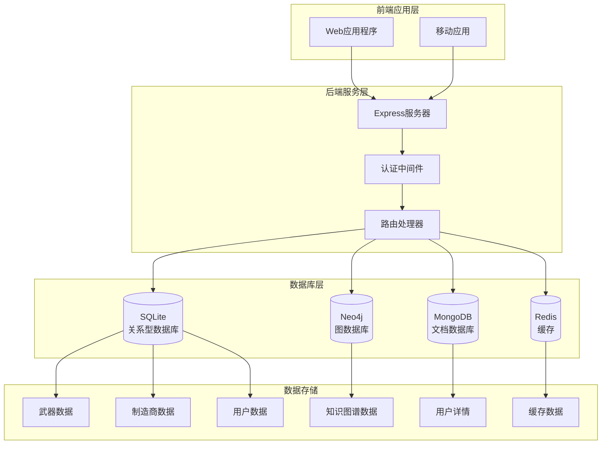

**图表来源**
- [database-simple.js](file://backend/src/config/database-simple.js#L1-L50)
- [database_Neo4j.js](file://backend/src/config/database_Neo4j.js#L1-L50)

## SQLite关系型数据库设计

### 数据库连接与初始化

SQLite作为核心的关系型数据库，负责存储结构化数据和处理事务性操作。其连接管理采用了单例模式和连接池优化策略。

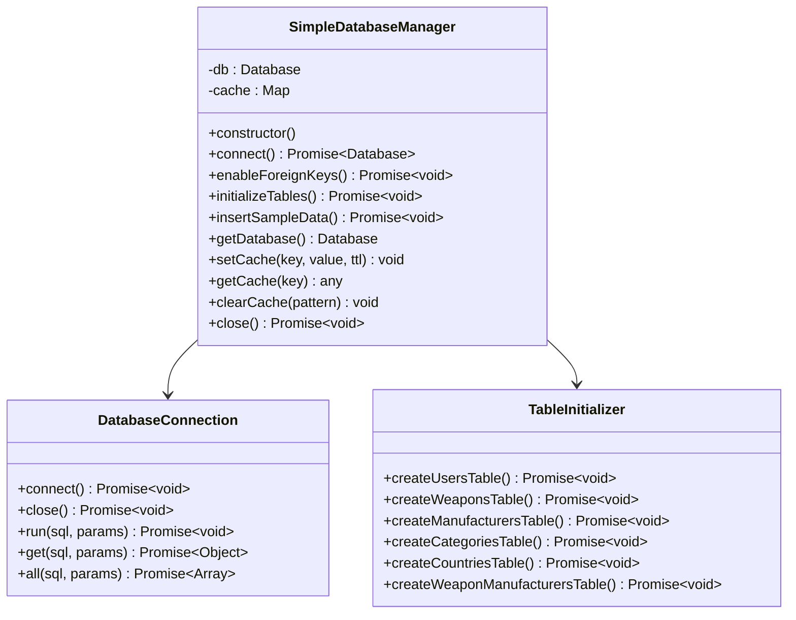

**图表来源**
- [database-simple.js](file://backend/src/config/database-simple.js#L5-L50)

### 核心表结构设计

#### 武器表 (weapons)
武器表是系统的核心实体表，存储了所有军事装备的基本信息：

| 字段名 | 数据类型 | 约束 | 描述 |
|--------|----------|------|------|
| id | INTEGER | PRIMARY KEY AUTOINCREMENT | 武器唯一标识符 |
| name | TEXT | NOT NULL | 武器名称 |
| type | TEXT | NOT NULL | 武器类型分类 |
| country | TEXT | NOT NULL | 生产国别 |
| year | INTEGER | NULL | 设计年份 |
| description | TEXT | DEFAULT '' | 详细描述 |
| specifications | TEXT | DEFAULT '{}' | 规格参数(JSON) |
| images | TEXT | DEFAULT '[]' | 图片URL数组(JSON) |
| performance_data | TEXT | DEFAULT '{}' | 性能数据(JSON) |
| created_at | DATETIME | DEFAULT CURRENT_TIMESTAMP | 创建时间 |
| updated_at | DATETIME | DEFAULT CURRENT_TIMESTAMP | 更新时间 |

#### 制造商表 (manufacturers)
制造商表存储武器生产企业的相关信息：

| 字段名 | 数据类型 | 约束 | 描述 |
|--------|----------|------|------|
| id | INTEGER | PRIMARY KEY AUTOINCREMENT | 制造商唯一标识符 |
| name | TEXT | UNIQUE NOT NULL | 制造商名称 |
| country | TEXT | NULL | 所属国家 |
| founded | INTEGER | NULL | 成立年份 |
| description | TEXT | NULL | 公司简介 |
| created_at | DATETIME | DEFAULT CURRENT_TIMESTAMP | 创建时间 |
| updated_at | DATETIME | DEFAULT CURRENT_TIMESTAMP | 更新时间 |

#### 武器-制造商关联表 (weapon_manufacturers)
这是多对多关系的关联表，建立了武器与制造商之间的联系：

| 字段名 | 数据类型 | 约束 | 描述 |
|--------|----------|------|------|
| id | INTEGER | PRIMARY KEY AUTOINCREMENT | 关联记录唯一标识符 |
| weapon_id | INTEGER | NOT NULL, FOREIGN KEY | 武器ID |
| manufacturer_id | INTEGER | NOT NULL, FOREIGN KEY | 制造商ID |
| created_at | DATETIME | DEFAULT CURRENT_TIMESTAMP | 创建时间 |

**节来源**
- [database-simple.js](file://backend/src/config/database-simple.js#L50-L150)

### 外键约束与数据完整性

系统启用了SQLite的外键约束功能，确保数据的一致性和完整性：

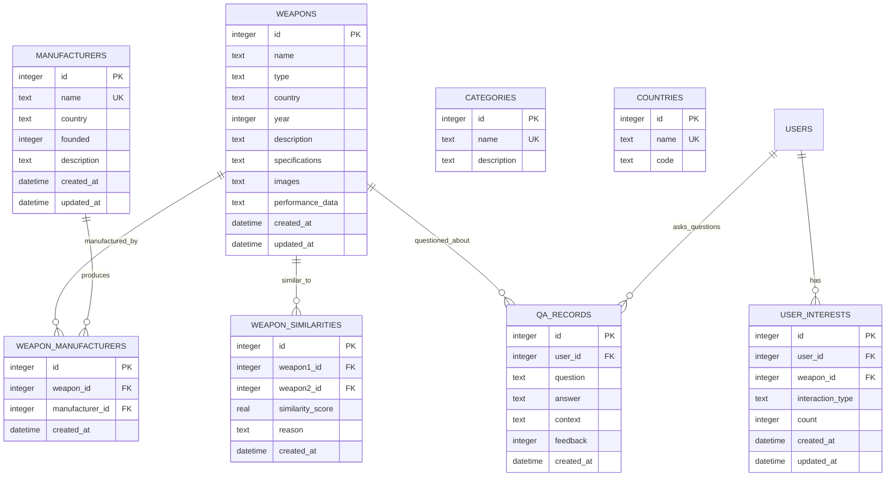

**图表来源**
- [database-simple.js](file://backend/src/config/database-simple.js#L50-L150)

## Neo4j图数据库设计

### 节点与关系模型

Neo4j作为图数据库，专门用于处理复杂的关联关系和知识图谱查询。其节点和关系设计遵循领域本体论原则。

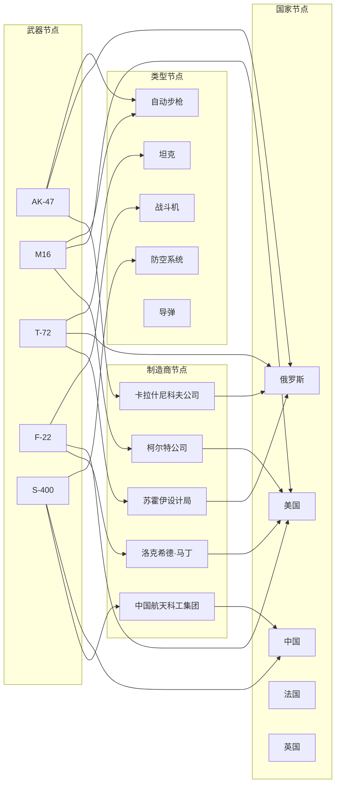

**图表来源**
- [graphData.json](file://data/graphData.json#L1-L100)

### 知识图谱数据格式规范

graphData.json定义了完整的知识图谱数据结构，包含节点和关系两部分：

#### 节点定义规范

| 属性名 | 类型 | 必需 | 描述 |
|--------|------|------|------|
| id | String | 是 | 节点唯一标识符 |
| labels | Array[String] | 是 | 节点标签数组 |
| properties | Object | 是 | 节点属性对象 |

#### 关系定义规范

| 属性名 | 类型 | 必需 | 描述 |
|--------|------|------|------|
| source | String | 是 | 源节点ID |
| target | String | 是 | 目标节点ID |
| type | String | 是 | 关系类型 |

**节来源**
- [graphData.json](file://data/graphData.json#L1-L206)

### 图数据库查询服务

KnowledgeGraphService提供了丰富的图数据库查询功能：

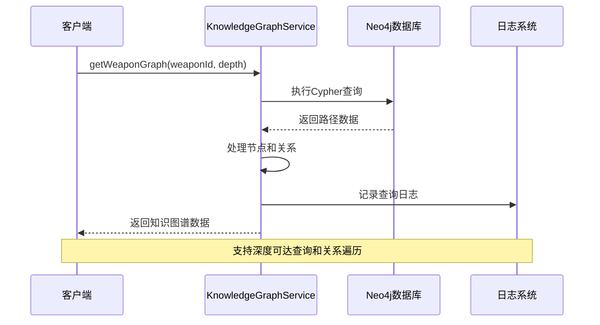

**图表来源**
- [knowledgeGraphService.js](file://backend/src/services/knowledgeGraphService.js#L1-L50)

**节来源**
- [knowledgeGraphService.js](file://backend/src/services/knowledgeGraphService.js#L1-L430)

## MongoDB文档存储设计

### 文档模型设计

MongoDB用于存储非结构化和半结构化的武器详细信息，支持灵活的数据模式和高性能的读写操作。

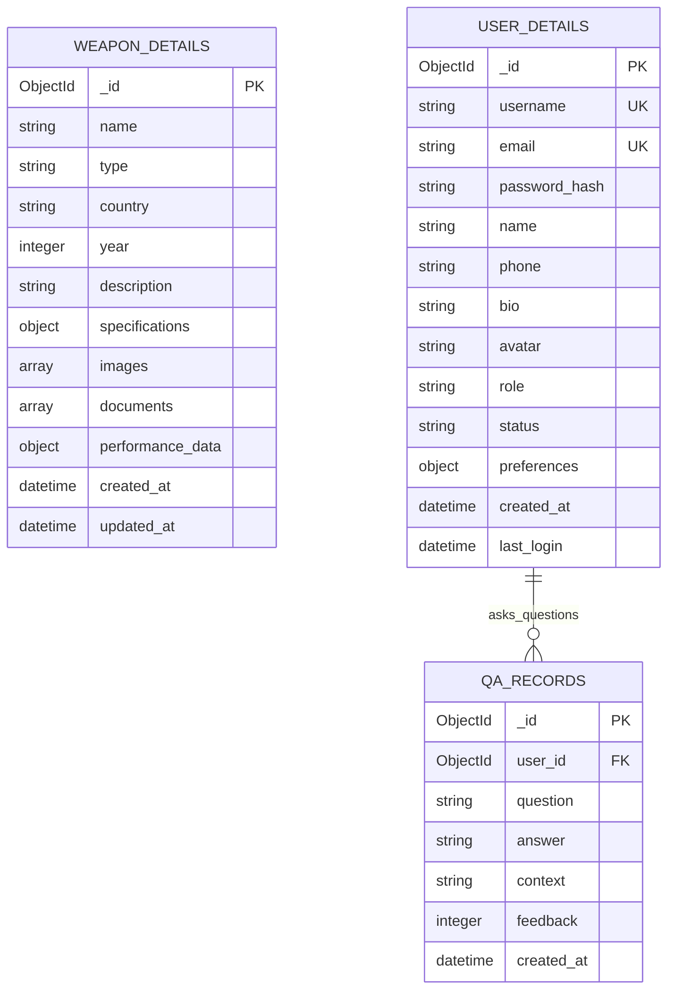

**图表来源**
- [weaponService.js](file://backend/src/services/weaponService.js#L10-L50)

### 文档存储优势

1. **灵活性**: 支持动态字段和嵌套结构
2. **性能**: 高效的读写操作和聚合查询
3. **扩展性**: 易于水平扩展和分布式部署
4. **丰富性**: 支持复杂的数据类型和索引

**节来源**
- [weaponService.js](file://backend/src/services/weaponService.js#L1-L486)

## 多数据源管理策略

### 数据库连接管理

系统采用统一的数据库管理器来协调多个数据源的连接和操作：

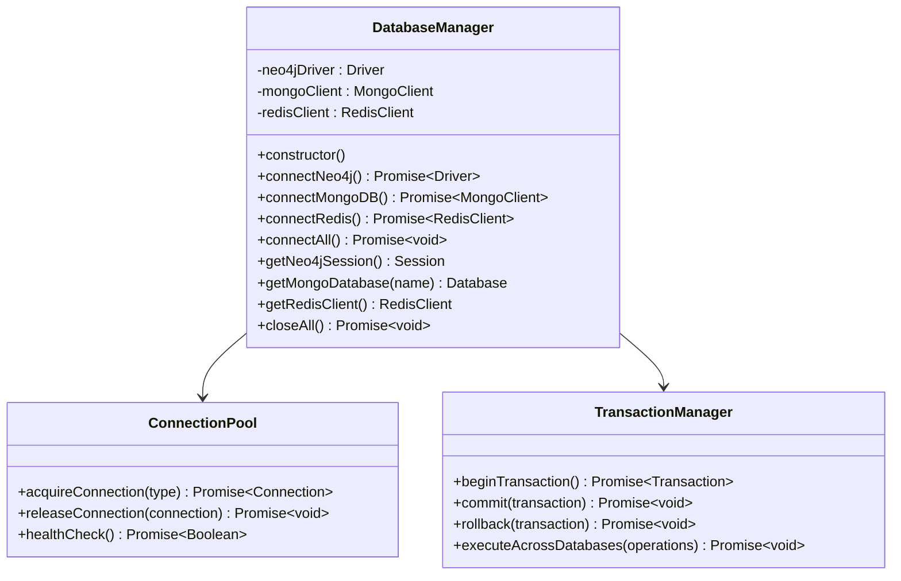

**图表来源**
- [database_Neo4j.js](file://backend/src/config/database_Neo4j.js#L5-L50)

### 数据同步策略

系统实现了跨数据库的数据同步机制，确保不同数据源之间的一致性：

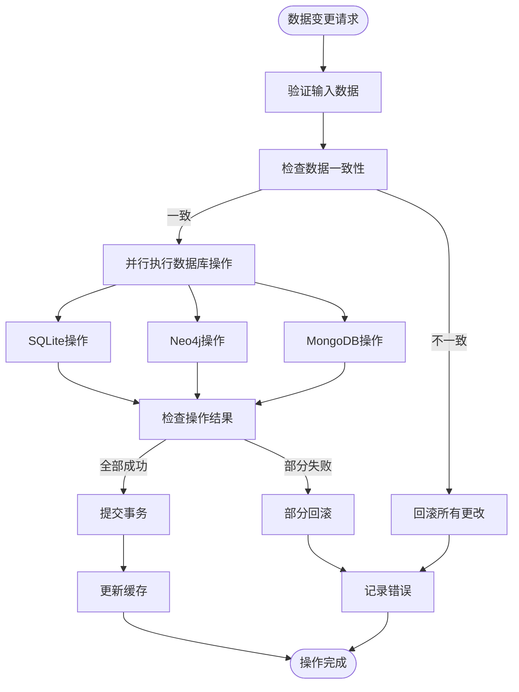

**图表来源**
- [weaponService.js](file://backend/src/services/weaponService.js#L10-L100)

**节来源**
- [database_Neo4j.js](file://backend/src/config/database_Neo4j.js#L1-L141)

## 数据一致性维护机制

### 外键约束与级联删除

系统通过严格的外键约束和级联删除机制确保数据一致性：

```mermaid
erDiagram
WEAPONS {
integer id PK
text name
text type
text country
integer year
text description
text specifications
text images
text performance_data
datetime created_at
datetime updated_at
}
MANUFACTURERS {
integer id PK
text name UK
text country
integer founded
text description
datetime created_at
datetime updated_at
}
WEAPON_MANUFACTURERS {
integer id PK
integer weapon_id FK ON DELETE CASCADE
integer manufacturer_id FK ON DELETE CASCADE
datetime created_at
}
WEAPONS ||--o{ WEAPON_MANUFACTURERS : "produces"
MANUFACTURERS ||--o{ WEAPON_MANUFACTURERS : "manufactures"
```

**图表来源**
- [fix-database-integrity.js](file://backend/scripts/fix-database-integrity.js#L70-L90)

### 数据完整性修复工具

fix-database-integrity.js提供了自动化的数据完整性检查和修复功能：

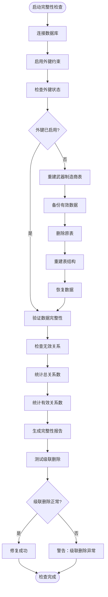

**图表来源**
- [fix-database-integrity.js](file://backend/scripts/fix-database-integrity.js#L260-L301)

**节来源**
- [fix-database-integrity.js](file://backend/scripts/fix-database-integrity.js#L1-L302)

## 性能优化与查询优化

### 查询优化策略

系统采用了多层次的查询优化策略：

#### 1. 索引优化
- 在SQLite中为常用查询字段建立索引
- 在Neo4j中优化节点和关系的标签查询
- 在MongoDB中合理使用复合索引

#### 2. 分页查询
```javascript
// 分页查询示例
const weapons = await weaponsCollection
    .find(query)
    .sort({ created_at: -1 })
    .skip(skip)
    .limit(limit)
    .toArray();
```

#### 3. 缓存策略
SimpleDatabaseManager实现了内存缓存机制：
- 缓存热点查询结果
- 支持TTL过期机制
- 提供模式匹配的缓存清理

### 性能监控指标

| 指标类型 | 监控项目 | 目标值 | 监控方法 |
|----------|----------|--------|----------|
| 查询性能 | 平均响应时间 | < 100ms | 日志分析 |
| 连接池 | 活跃连接数 | < 80% | 连接监控 |
| 缓存效率 | 缓存命中率 | > 85% | 缓存统计 |
| 数据库负载 | QPS | < 配置上限 | 性能计数器 |

**节来源**
- [database-simple.js](file://backend/src/config/database-simple.js#L250-L322)

## 事务处理与连接池管理

### 事务处理机制

虽然不同数据库的事务特性有所差异，但系统通过以下策略确保数据一致性：

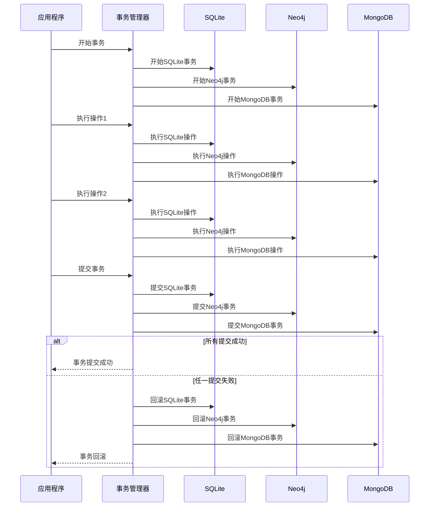

**图表来源**
- [weaponService.js](file://backend/src/services/weaponService.js#L300-L400)

### 连接池配置

系统为每种数据库配置了合适的连接池参数：

| 数据库 | 最大连接数 | 连接超时 | 空闲超时 | 连接重用 |
|--------|------------|----------|----------|----------|
| SQLite | 10 | 30秒 | 300秒 | 是 |
| Neo4j | 20 | 60秒 | 600秒 | 是 |
| MongoDB | 15 | 30秒 | 450秒 | 是 |
| Redis | 5 | 10秒 | 180秒 | 是 |

**节来源**
- [database_Neo4j.js](file://backend/src/config/database_Neo4j.js#L15-L50)

## 故障排除与监控

### 日志记录系统

系统实现了完善的日志记录机制，支持多种级别的日志输出：

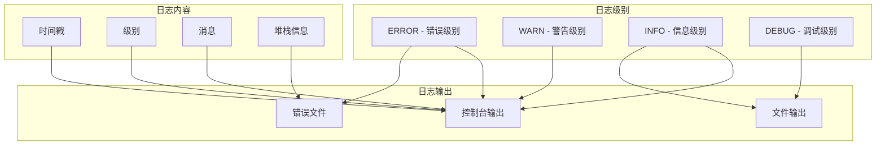

**图表来源**
- [logger.js](file://backend/src/utils/logger.js#L1-L47)

### 健康检查机制

系统提供了定期的数据库健康检查功能：

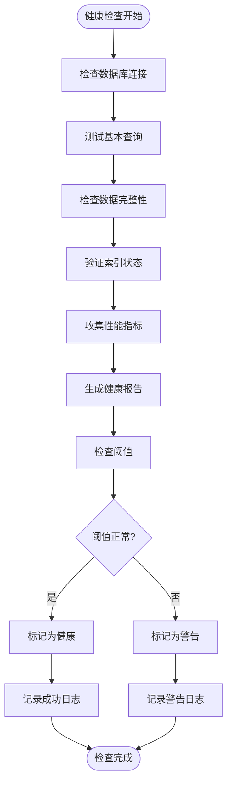

**图表来源**
- [fix-database-integrity.js](file://backend/scripts/fix-database-integrity.js#L260-L301)

### 故障恢复策略

1. **自动重连**: 连接断开时自动尝试重新连接
2. **降级服务**: 在部分数据库不可用时提供有限功能
3. **数据备份**: 定期备份关键数据
4. **监控告警**: 实时监控系统状态并发送告警

**节来源**
- [logger.js](file://backend/src/utils/logger.js#L1-L47)

## 总结

兵智世界的多数据库设计策略体现了现代软件架构的最佳实践：

### 主要优势

1. **数据模型适配**: 不同数据库针对特定场景优化
2. **性能优化**: 多层次的查询优化和缓存策略
3. **数据一致性**: 完善的事务处理和完整性检查机制
4. **可扩展性**: 支持水平扩展和分布式部署
5. **容错能力**: 健壮的故障恢复和监控机制

### 技术创新点

- **混合数据库架构**: 结合关系型、图数据库和文档数据库的优势
- **自动化完整性维护**: 智能的数据修复和验证工具
- **统一连接管理**: 统一的数据库连接和事务处理接口
- **实时监控体系**: 全方位的性能监控和故障诊断

这种设计不仅满足了当前业务需求，还为未来的功能扩展和技术演进奠定了坚实的基础。通过合理的数据分层和优化策略，系统能够高效地处理大规模的军事知识数据，为用户提供优质的查询和分析体验。