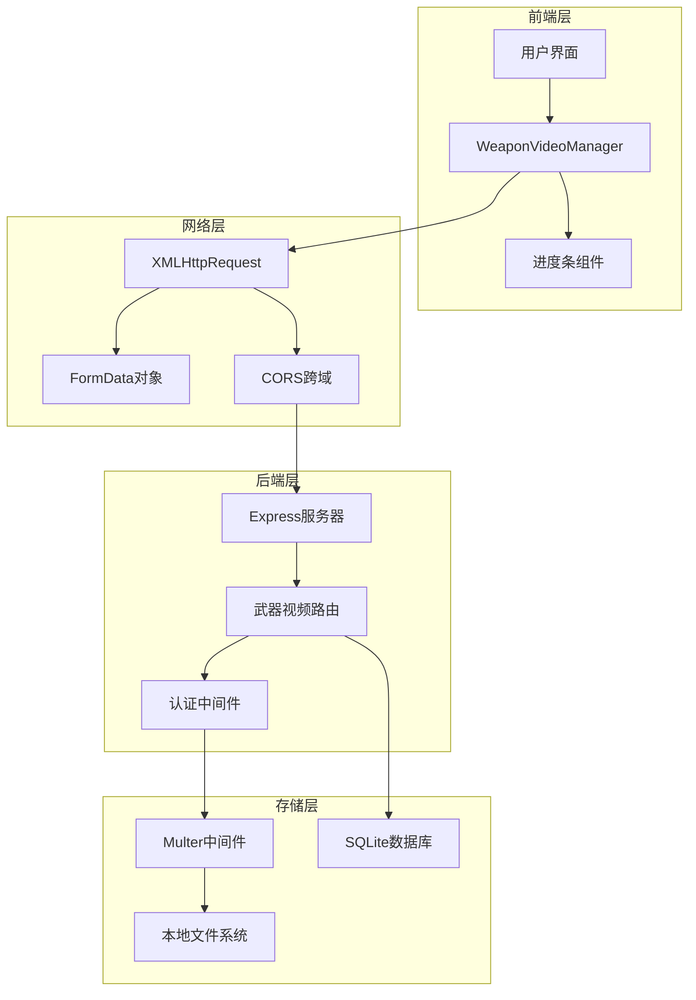
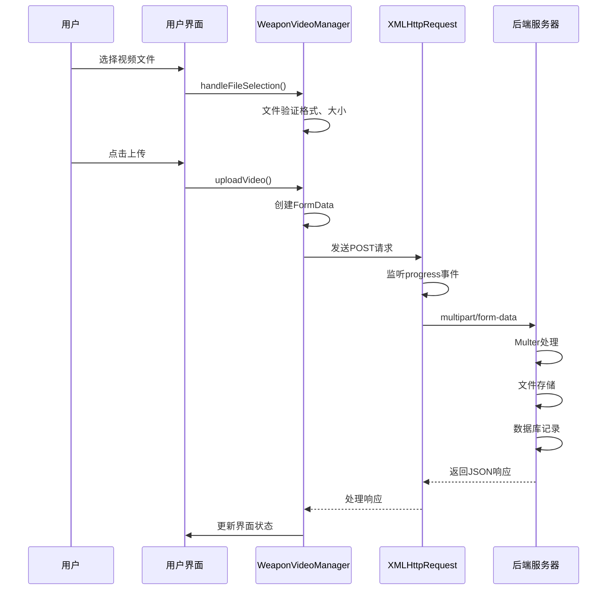
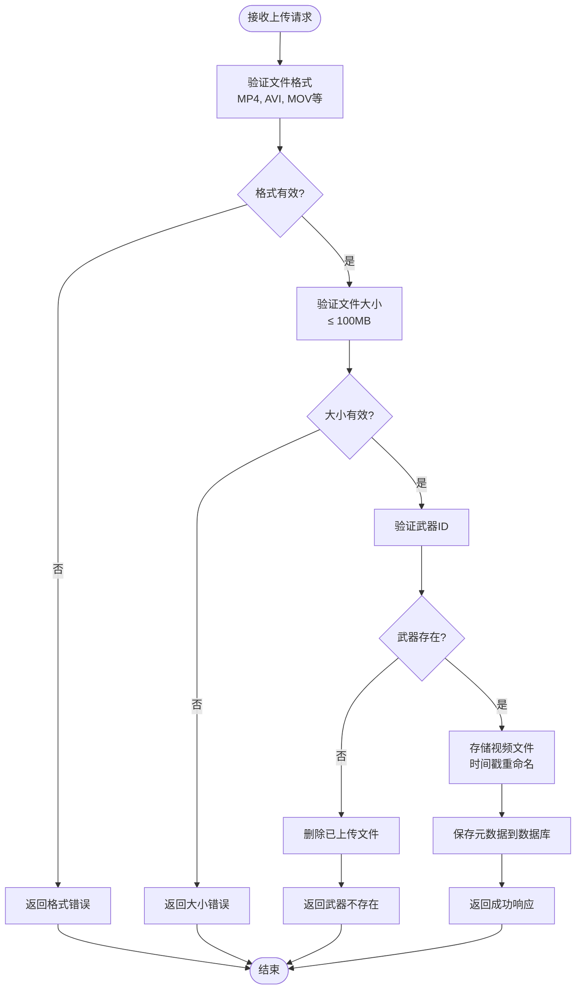
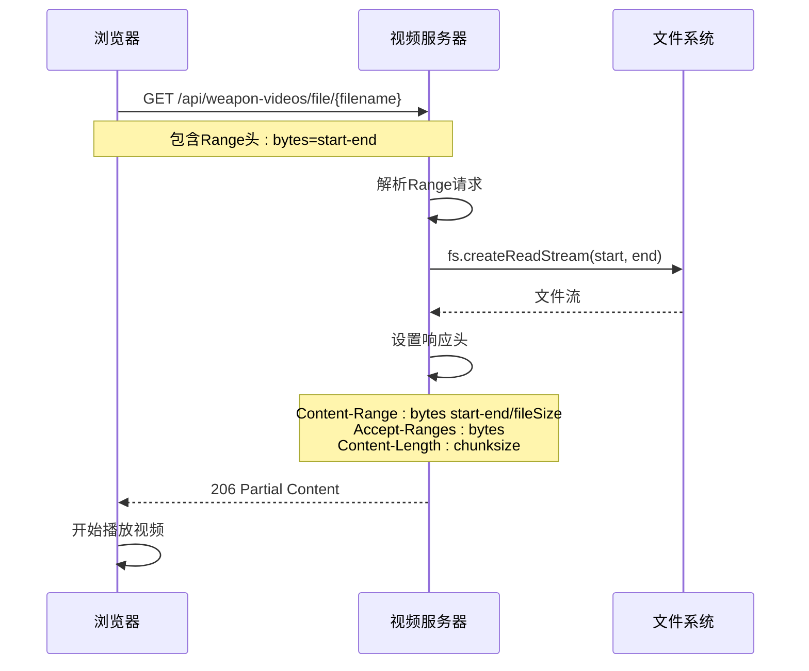
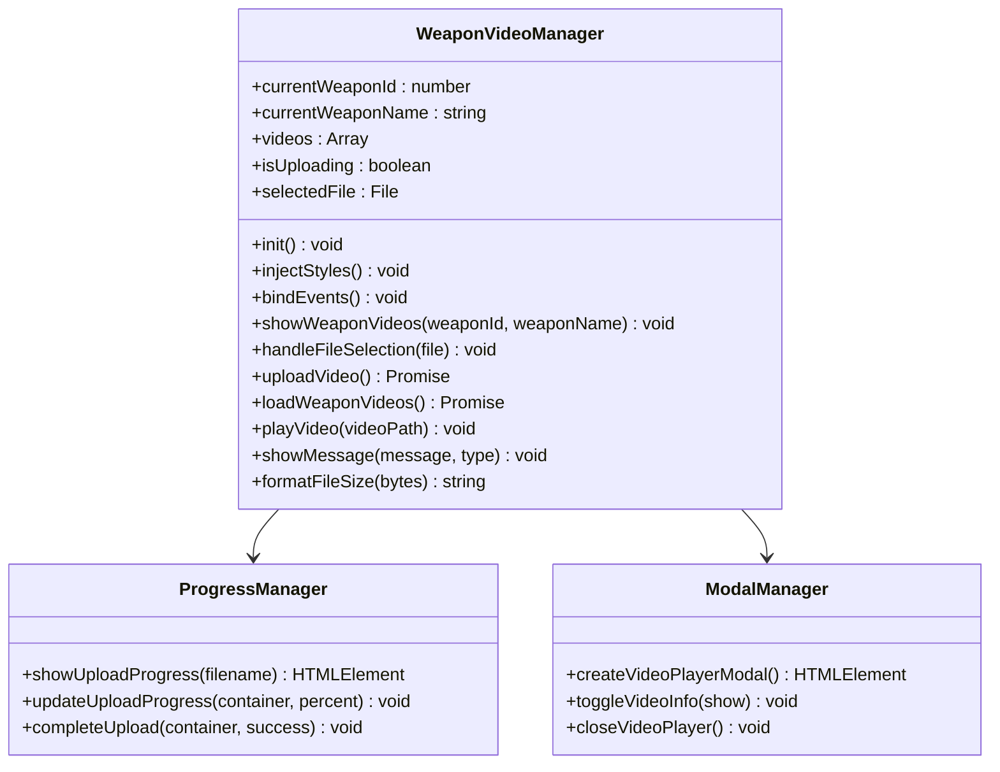
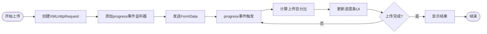
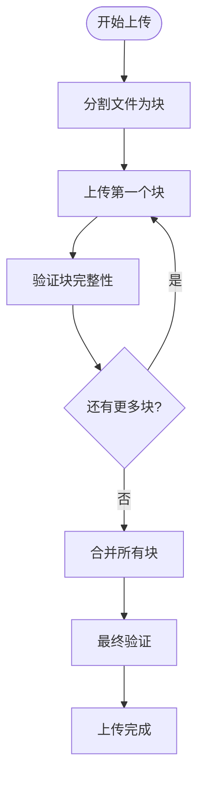

# 多媒体资源集成功能文档

<cite>
**本文档引用的文件**
- [武器视频管理系统实现说明.md](file://function_description/武器视频管理系统实现说明.md)
- [weapon-videos.js](file://backend/src/routes/weapon-videos.js)
- [test-weapon-video.html](file://test_pages/test-weapon-video.html)
- [weapon-video-integration.js](file://scripts/weapon-video-integration.js)
- [weapon-video-integration.css](file://styles/weapon-video-integration.css)
- [app-simple.js](file://backend/src/app-simple.js)
- [auth.js](file://backend/src/middleware/auth.js)
</cite>

## 目录
1. [系统概述](#系统概述)
2. [架构设计](#架构设计)
3. [视频上传流程](#视频上传流程)
4. [视频流式传输机制](#视频流式传输机制)
5. [核心API接口](#核心api接口)
6. [前端集成实现](#前端集成实现)
7. [安全策略与访问控制](#安全策略与访问控制)
8. [性能优化建议](#性能优化建议)
9. [故障排除指南](#故障排除指南)
10. [总结](#总结)

## 系统概述

武器视频管理系统是"兵智世界"项目的核心功能模块，为每个武器节点提供完整的视频上传、管理、播放和展示功能。系统采用前后端分离架构，实现了文件上传、进度显示、视频流播放等完整功能。

### 核心特性

- **多格式支持**：支持MP4、AVI、MOV、WMV、FLV、WebM等主流视频格式
- **文件大小限制**：最大100MB，确保系统性能
- **实时进度反馈**：0%-100%实时上传进度条
- **断点续传**：基于HTTP Range请求的视频流播放
- **知识图谱集成**：与武器节点无缝集成
- **管理界面**：现代化的视频管理界面

## 架构设计

### 系统架构图



**架构图源文件**
- [weapon-video-integration.js](file://scripts/weapon-video-integration.js#L1-L50)
- [weapon-videos.js](file://backend/src/routes/weapon-videos.js#L1-L30)
- [app-simple.js](file://backend/src/app-simple.js#L1-L50)

### 技术栈

- **前端**：原生JavaScript + HTML5 Video API + XMLHttpRequest
- **后端**：Node.js + Express.js + Multer + SQLite3
- **文件存储**：本地文件系统（`backend/uploads/weapons/videos/`）
- **数据库**：SQLite (`backend/data/military-knowledge.db`)

**章节源文件**
- [武器视频管理系统实现说明.md](file://function_description/武器视频管理系统实现说明.md#L15-L30)

## 视频上传流程

### 前端上传实现

前端使用FormData构造请求，通过XMLHttpRequest实现文件上传和进度监听。



**序列图源文件**
- [weapon-video-integration.js](file://scripts/weapon-video-integration.js#L750-L850)
- [weapon-videos.js](file://backend/src/routes/weapon-videos.js#L100-L180)

### 后端处理流程

后端通过Multer中间件处理multipart/form-data请求，实现文件存储和元数据记录。



**流程图源文件**
- [weapon-videos.js](file://backend/src/routes/weapon-videos.js#L100-L180)

### 文件存储策略

系统采用以下文件存储策略：

1. **时间戳重命名**：`weapon-video-{timestamp}-{random}.extension`
2. **相对路径存储**：数据库中存储相对路径，提高可移植性
3. **目录结构**：`uploads/weapons/videos/`
4. **文件验证**：MIME类型检查和文件大小限制

**章节源文件**
- [weapon-videos.js](file://backend/src/routes/weapon-videos.js#L20-L40)

## 视频流式传输机制

### HTTP Range请求支持

系统支持HTTP Range请求，实现视频流式传输和断点续传功能。



**序列图源文件**
- [weapon-videos.js](file://backend/src/routes/weapon-videos.js#L200-L250)

### 断点续传实现

系统通过以下机制实现断点续传：

1. **Range头解析**：解析客户端的Range请求
2. **字节范围计算**：计算起始位置和结束位置
3. **部分响应**：返回206状态码和Content-Range头
4. **流式传输**：使用Node.js流式读取文件

### Express静态文件服务配置

```javascript
// 静态文件服务配置
app.use('/uploads', express.static('uploads'));
```

该配置允许直接访问上传的视频文件，同时保持安全性和性能。

**章节源文件**
- [weapon-videos.js](file://backend/src/routes/weapon-videos.js#L200-L250)
- [app-simple.js](file://backend/src/app-simple.js#L60-L70)

## 核心API接口

### 视频上传API

| 接口 | 方法 | URL | 描述 | 参数 |
|------|------|-----|------|------|
| 上传视频 | POST | `/api/weapon-videos/weapon/:weaponId/upload` | 上传视频文件 | `video`: 视频文件<br/>`description`: 视频描述 |
| 获取视频列表 | GET | `/api/weapon-videos/weapon/:weaponId` | 获取指定武器的所有视频 | 无 |
| 视频文件服务 | GET | `/api/weapon-videos/file/:filename` | 提供视频文件流 | Range请求支持 |
| 更新视频信息 | PUT | `/api/weapon-videos/:videoId` | 更新视频描述 | `description`: 新描述 |
| 删除视频 | DELETE | `/api/weapon-videos/:videoId` | 删除视频文件和记录 | 无 |

### API参数说明

#### 上传视频接口参数
- **weaponId**：目标武器的唯一标识符（整数）
- **video**：视频文件（multipart/form-data）
- **description**：视频描述（可选）

#### 视频文件服务参数
- **filename**：视频文件名（字符串）
- **Range**：HTTP Range请求头（可选）

### 响应格式

所有API接口都遵循统一的成功/失败响应格式：

```javascript
// 成功响应
{
    "success": true,
    "message": "操作成功",
    "data": {...}
}

// 失败响应
{
    "success": false,
    "message": "错误描述"
}
```

**章节源文件**
- [weapon-videos.js](file://backend/src/routes/weapon-videos.js#L60-L400)

## 前端集成实现

### WeaponVideoManager类

前端核心类负责视频管理的所有功能：



**类图源文件**
- [weapon-video-integration.js](file://scripts/weapon-video-integration.js#L1-L50)

### 前端上传进度条实现

前端使用XMLHttpRequest的progress事件监听实现实时上传进度：



**流程图源文件**
- [weapon-video-integration.js](file://scripts/weapon-video-integration.js#L785-L820)

### 播放模态窗口创建

系统提供全屏视频播放体验：

1. **模态窗口**：黑色背景，居中播放
2. **信息叠加**：渐变遮罩，可控显示
3. **播放控件**：支持所有HTML5视频控件
4. **键盘快捷键**：ESC关闭播放器

### 错误处理反馈机制

前端实现了完整的错误处理机制：

- **文件验证错误**：格式不支持、大小超限
- **网络错误**：连接失败、超时
- **服务器错误**：上传失败、权限不足
- **用户反馈**：彩色状态指示（蓝色上传中→绿色成功→红色失败）

**章节源文件**
- [weapon-video-integration.js](file://scripts/weapon-video-integration.js#L750-L900)
- [test-weapon-video.html](file://test_pages/test-weapon-video.html#L400-L500)

## 安全策略与访问控制

### MIME类型检查

系统对上传的视频文件进行严格的MIME类型验证：

```javascript
const allowedTypes = [
    'video/mp4', 
    'video/avi', 
    'video/mov', 
    'video/wmv', 
    'video/flv', 
    'video/webm'
];
```

### 文件大小限制

- **前端限制**：50MB（测试页面）
- **后端限制**：100MB（生产环境）
- **验证时机**：文件选择时和上传时双重验证

### 访问控制策略

#### x-admin-user头部验证

系统使用简化的管理员验证机制：

```javascript
// 简化管理员模式
const adminHeader = req.headers['x-admin-user'];
if (adminHeader === 'true') {
    // 直接设置管理员用户
    req.user = {
        id: 1,
        username: 'admin',
        role: 'admin'
    };
    return next();
}
```

#### 权限检查

- **视频上传**：需要管理员权限
- **视频管理**：需要管理员权限
- **视频播放**：无需特殊权限（公开访问）

### 文件安全策略

1. **文件名安全**：时间戳重命名，避免路径遍历攻击
2. **路径安全**：相对路径存储，防止绝对路径泄露
3. **内容安全**：MIME类型检查，防止恶意文件上传
4. **存储安全**：独立的上传目录，限制访问权限

**章节源文件**
- [weapon-videos.js](file://backend/src/routes/weapon-videos.js#L30-L50)
- [auth.js](file://backend/src/middleware/auth.js#L10-L50)

## 性能优化建议

### 前端性能优化

#### 上传性能优化

1. **进度显示**：使用原生XMLHttpRequest，避免第三方库开销
2. **内存管理**：及时清理DOM元素，避免内存泄漏
3. **事件绑定**：使用防抖处理，减少不必要的重绘
4. **状态管理**：上传锁定机制，防止重复提交

#### 视频播放优化

1. **流式传输**：利用HTTP Range请求实现流式播放
2. **缓存策略**：合理设置缓存头，减少重复下载
3. **预加载**：智能预加载下一个视频片段
4. **分辨率适配**：根据设备能力调整视频质量

### 后端性能优化

#### 数据库优化

```sql
-- weapon_videos表索引优化
CREATE INDEX idx_weapon_videos_weapon_id ON weapon_videos(weapon_id);
```

#### 文件系统优化

1. **静态文件服务**：Express静态文件服务缓存
2. **流式读取**：Node.js流式读取，减少内存占用
3. **并发处理**：Multer支持并发上传
4. **垃圾回收**：定期清理临时文件

#### 网络优化

1. **压缩传输**：启用gzip压缩
2. **CDN支持**：考虑部署CDN加速视频访问
3. **负载均衡**：多实例部署，分担负载
4. **连接池**：数据库连接池优化

### 大文件上传优化

#### 分块上传策略

对于大于100MB的文件，建议实现分块上传：



#### 断点续传实现

1. **块状态跟踪**：记录每个块的上传状态
2. **断点检测**：检查上次上传的进度
3. **增量上传**：只上传未完成的块
4. **错误恢复**：网络中断后的自动恢复

### 监控与日志

#### 性能监控指标

- **上传速度**：平均上传速度和峰值速度
- **成功率**：上传成功和失败的比例
- **响应时间**：API响应时间和文件传输时间
- **错误率**：各类错误的发生频率

#### 日志记录

- **上传操作日志**：记录每次上传的详细信息
- **播放访问统计**：记录视频播放次数和时长
- **错误异常记录**：记录系统错误和异常情况
- **性能指标**：记录系统性能关键指标

**章节源文件**
- [weapon-videos.js](file://backend/src/routes/weapon-videos.js#L350-L400)

## 故障排除指南

### 常见问题及解决方案

#### 上传失败问题

**问题**：视频上传失败，返回400错误
**原因**：武器ID无效或文件格式不支持
**解决方案**：
1. 检查武器ID是否存在
2. 验证文件格式是否在支持列表中
3. 确认文件大小不超过限制

**问题**：上传进度卡住不动
**原因**：网络连接不稳定或服务器负载过高
**解决方案**：
1. 检查网络连接状态
2. 重启后端服务
3. 减少并发上传数量

#### 播放问题

**问题**：视频无法播放，浏览器报错
**原因**：MIME类型不匹配或文件损坏
**解决方案**：
1. 检查文件是否完整
2. 验证MIME类型设置
3. 尝试重新上传视频

**问题**：视频播放卡顿
**原因**：网络带宽不足或文件过大
**解决方案**：
1. 优化网络连接
2. 考虑视频压缩
3. 实现自适应码率

#### 权限问题

**问题**：访问被拒绝，返回403错误
**原因**：缺少管理员权限
**解决方案**：
1. 确认x-admin-user头部设置
2. 检查认证中间件配置
3. 验证用户权限设置

### 调试技巧

#### 前端调试

1. **开发者工具**：使用浏览器开发者工具查看网络请求
2. **控制台日志**：检查JavaScript错误和警告
3. **进度监听**：监听XMLHttpRequest的progress事件
4. **DOM检查**：验证UI元素是否正确渲染

#### 后端调试

1. **日志分析**：查看服务器日志了解错误详情
2. **数据库查询**：检查数据库记录是否正确
3. **文件系统**：验证文件是否正确存储
4. **中间件调试**：检查认证和授权中间件

### 性能诊断

#### 上传性能诊断

1. **网络分析**：测量上传速度和延迟
2. **服务器负载**：监控CPU和内存使用率
3. **磁盘I/O**：检查文件写入性能
4. **数据库性能**：分析数据库查询效率

#### 播放性能诊断

1. **视频编码**：检查视频编码格式和质量
2. **网络带宽**：测量可用带宽和缓冲区大小
3. **浏览器兼容性**：测试不同浏览器的播放效果
4. **设备性能**：评估移动设备的播放能力

**章节源文件**
- [test-weapon-video.html](file://test_pages/test-weapon-video.html#L100-L200)

## 总结

武器视频管理系统是一个功能完善、架构合理的多媒体资源集成解决方案。系统具备以下优势：

### 技术优势

1. **前后端分离**：清晰的职责划分，便于维护和扩展
2. **流式传输**：支持断点续传，提升用户体验
3. **安全可靠**：多重验证机制，保障系统安全
4. **性能优化**：合理的架构设计，支持高并发访问

### 功能特点

1. **完整的视频生命周期管理**：从上传到播放的全流程支持
2. **实时进度反馈**：让用户随时掌握上传状态
3. **知识图谱集成**：与武器系统无缝对接
4. **现代化用户界面**：提供良好的用户体验

### 扩展建议

1. **云存储集成**：考虑迁移到云存储服务
2. **视频转码**：支持多种格式和分辨率
3. **CDN加速**：提升全球访问性能
4. **用户权限细化**：实现更精细的权限控制

该系统为"兵智世界"项目提供了强大的多媒体资源管理能力，为用户提供优质的视频体验，同时为系统的未来发展奠定了坚实的基础。