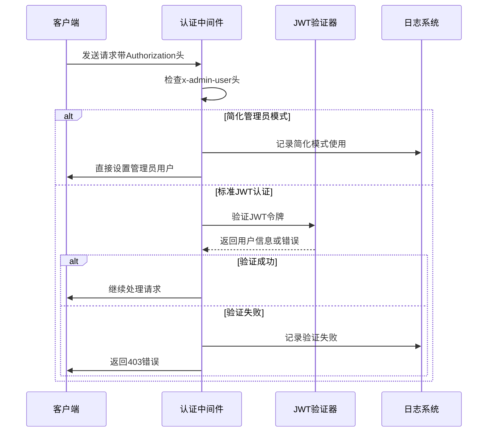
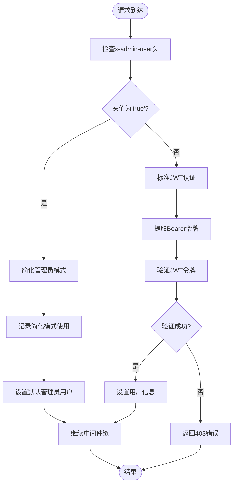
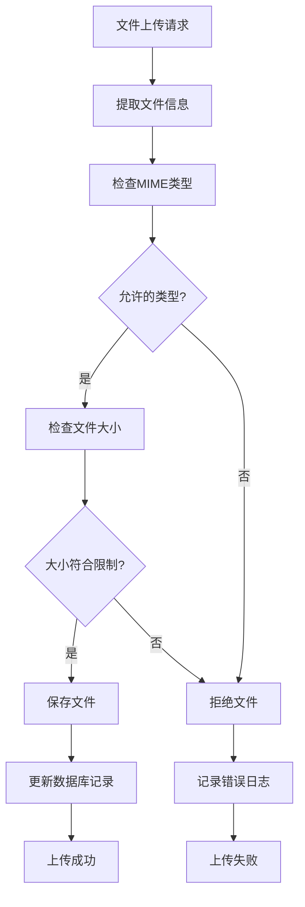
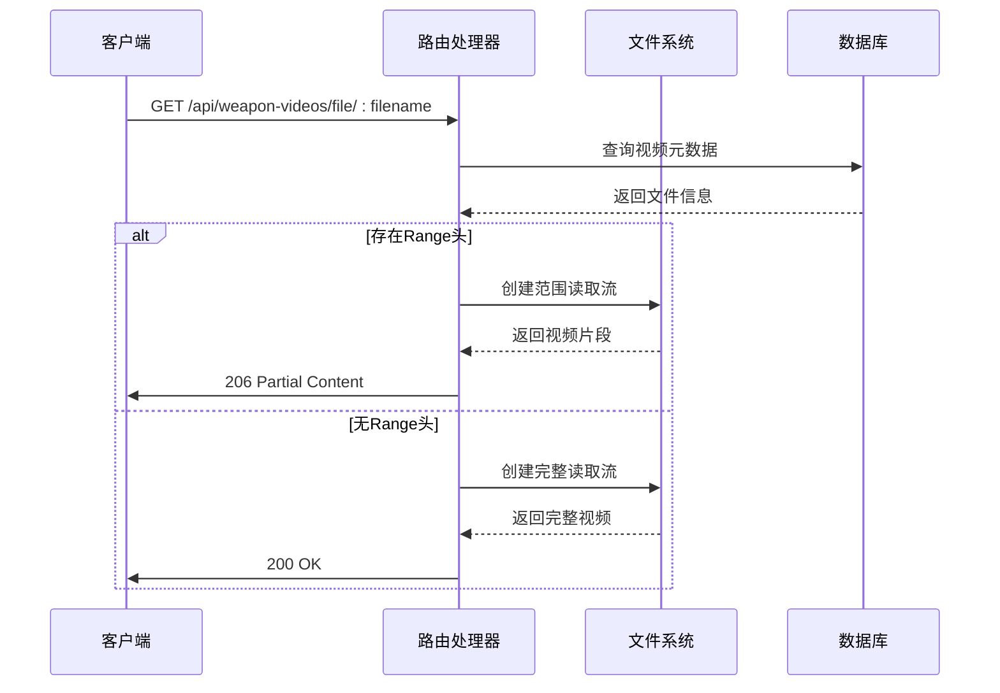
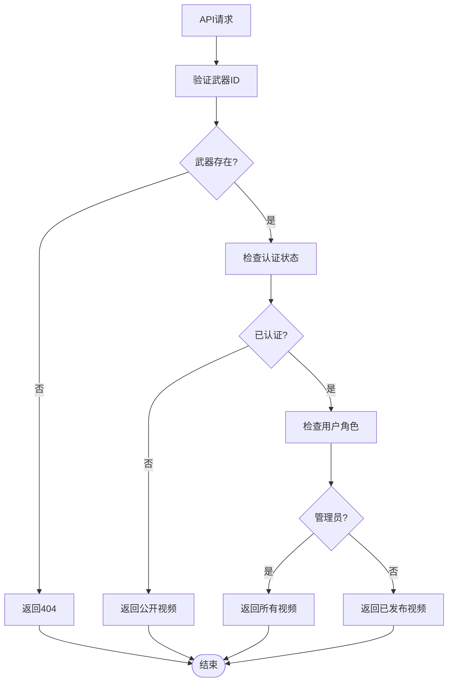
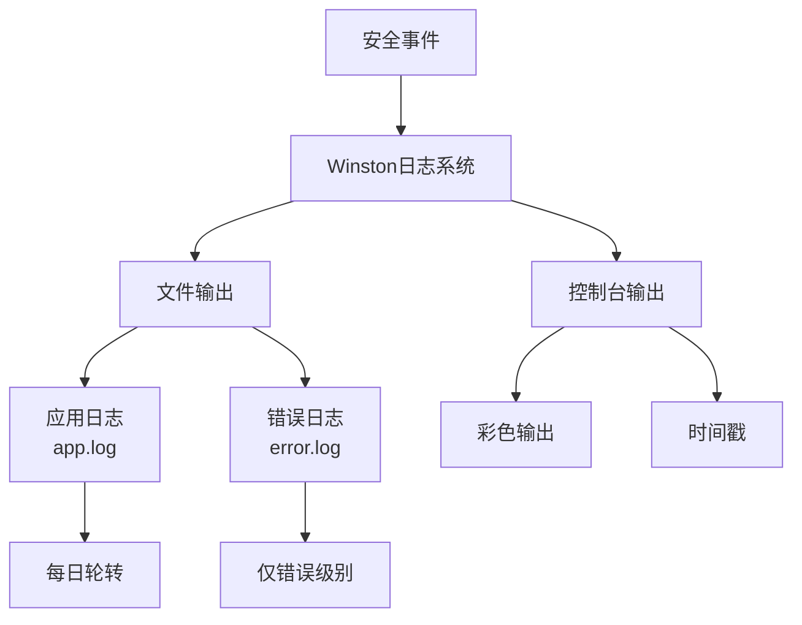
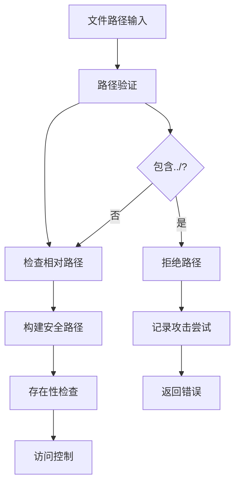

# 安全与权限控制

<cite>
**本文档引用的文件**
- [auth.js](file://backend/src/middleware/auth.js)
- [weapon-videos.js](file://backend/src/routes/weapon-videos.js)
- [logger.js](file://backend/src/utils/logger.js)
- [app.js](file://backend/src/app.js)
- [index.js](file://backend/src/config/index.js)
- [app-simple.js](file://backend/src/app-simple.js)
</cite>

## 目录
1. [简介](#简介)
2. [JWT身份认证机制](#jwt身份认证机制)
3. [管理员权限控制系统](#管理员权限控制系统)
4. [文件上传安全防护](#文件上传安全防护)
5. [视频访问保护策略](#视频访问保护策略)
6. [敏感接口访问控制](#敏感接口访问控制)
7. [安全审计与日志记录](#安全审计与日志记录)
8. [常见安全漏洞防范](#常见安全漏洞防范)
9. [总结](#总结)

## 简介

本文档详细阐述了兵智世界视频管理模块的安全防护机制，涵盖身份认证、权限控制、文件安全、访问保护等多个层面的安全措施。系统采用多层次的安全架构，确保视频数据的安全性和访问的可控性。

## JWT身份认证机制

### 认证流程设计

系统实现了基于JWT（JSON Web Token）的身份认证机制，支持简化管理员模式和标准JWT认证两种方式。



**图表来源**
- [auth.js](file://backend/src/middleware/auth.js#L7-L48)

### 认证中间件实现

认证中间件提供了三种核心功能：
- **authenticateToken**: 主要认证逻辑，支持JWT和简化模式
- **optionalAuth**: 可选认证，用于不需要严格认证的接口
- **requireAdmin**: 管理员权限验证

**章节来源**
- [auth.js](file://backend/src/middleware/auth.js#L1-L106)

### JWT配置与安全特性

系统配置了合理的JWT安全参数：

| 配置项 | 默认值 | 安全考虑 |
|--------|--------|----------|
| secret | default-secret-key | 生产环境必须替换为强密钥 |
| expiresIn | 7天 | 平衡用户体验与安全性 |
| 令牌格式 | Bearer TOKEN | 符合RFC 6750标准 |

## 管理员权限控制系统

### 自定义头部验证机制

系统通过`x-admin-user`请求头实现管理员权限控制，提供灵活的权限验证方案。



**图表来源**
- [auth.js](file://backend/src/middleware/auth.js#L7-L48)

### 权限分离设计

系统实现了严格的权限分离：
- **普通用户**: 只能访问公开的视频资源
- **管理员**: 可以管理视频内容，包括删除和更新操作
- **简化模式**: 开发和测试环境下的快速管理员访问

**章节来源**
- [auth.js](file://backend/src/middleware/auth.js#L67-L85)

## 文件上传安全防护

### MIME类型验证机制

系统实现了严格的服务端MIME类型验证，防止恶意文件上传。



**图表来源**
- [weapon-videos.js](file://backend/src/routes/weapon-videos.js#L35-L45)

### 文件扩展名白名单

系统定义了严格的视频文件类型白名单：

| 允许的MIME类型 | 文件扩展名 | 安全考虑 |
|----------------|------------|----------|
| video/mp4 | .mp4 | 广泛兼容，安全性高 |
| video/avi | .avi | 支持传统格式 |
| video/mov | .mov | Apple生态系统支持 |
| video/wmv | .wmv | Windows Media支持 |
| video/flv | .flv | Flash视频格式 |
| video/webm | .webm | 开源Web格式 |

### 文件大小限制

系统设置了合理的文件大小限制：
- **最大文件大小**: 100MB
- **限制原因**: 平衡功能需求与服务器资源消耗

**章节来源**
- [weapon-videos.js](file://backend/src/routes/weapon-videos.js#L35-L50)

### 病毒扫描建议

虽然当前系统未集成病毒扫描功能，但建议实施以下措施：
- **实时扫描**: 使用ClamAV等开源防病毒软件
- **异步扫描**: 将扫描任务放入队列，避免阻塞主流程
- **文件隔离**: 将待扫描文件存储在隔离区域
- **扫描结果缓存**: 避免重复扫描相同文件

## 视频访问保护策略

### Range请求支持

系统支持HTTP Range请求，实现视频流媒体播放功能，同时提供访问控制。



**图表来源**
- [weapon-videos.js](file://backend/src/routes/weapon-videos.js#L210-L250)

### 相对路径处理

系统采用相对路径存储，增强安全性：

```javascript
// 构建相对路径而非绝对路径
const relativePath = path.relative(path.join(__dirname, '../..'), file.path);
```

这种设计的好处：
- **路径隔离**: 防止路径遍历攻击
- **部署灵活性**: 支持不同的部署环境
- **安全性提升**: 减少暴露系统路径的风险

### 文件存在性验证

系统在提供文件访问前进行严格的存在性验证：

**章节来源**
- [weapon-videos.js](file://backend/src/routes/weapon-videos.js#L210-L250)

## 敏感接口访问控制

### `/api/weapon-videos/weapon/:weaponId` 接口保护

该接口实现了分级访问控制：



**图表来源**
- [weapon-videos.js](file://backend/src/routes/weapon-videos.js#L80-L105)

### 权限级别控制

| 用户类型 | 可访问视频 | 操作权限 |
|----------|------------|----------|
| 匿名用户 | 已发布视频 | 只读访问 |
| 普通用户 | 已发布视频 | 只读访问 |
| 管理员 | 所有视频（包括草稿） | 读取、编辑、删除 |

### 数据库级约束

系统在数据库层面实现了外键约束，确保数据完整性：

**章节来源**
- [weapon-videos.js](file://backend/src/routes/weapon-videos.js#L55-L75)

## 安全审计与日志记录

### Winston日志系统集成

系统集成了Winston日志框架，提供全面的安全事件记录。



**图表来源**
- [logger.js](file://backend/src/utils/logger.js#L15-L46)

### 日志记录策略

系统记录以下安全相关事件：

| 事件类型 | 记录级别 | 内容 |
|----------|----------|------|
| JWT验证失败 | WARN | 验证错误详情、时间戳 |
| 管理员模式使用 | INFO | 简化模式启用记录 |
| 文件上传失败 | ERROR | 文件名、错误原因 |
| 权限验证失败 | WARN | 用户尝试、目标资源 |
| 视频访问异常 | ERROR | 访问路径、错误详情 |

### 日志配置优化

系统配置了合理的日志轮转策略：
- **单文件大小**: 5MB
- **保留文件数**: 5个
- **日志级别**: 可通过环境变量配置

**章节来源**
- [logger.js](file://backend/src/utils/logger.js#L1-L47)

## 常见安全漏洞防范

### 路径遍历攻击防护

系统通过多种措施防范路径遍历攻击：



**防范措施**:
1. **相对路径存储**: 避免绝对路径暴露
2. **路径规范化**: 使用`path.normalize()`处理路径
3. **存在性验证**: 严格检查文件是否存在
4. **访问控制**: 基于用户权限的访问限制

### DoS攻击防护

系统实现了多层DoS防护机制：

| 防护层级 | 实现方式 | 配置参数 |
|----------|----------|----------|
| API限流 | express-rate-limit | 15分钟内1000次请求 |
| 请求大小限制 | express.json() | 10MB |
| 文件大小限制 | multer | 100MB |
| 并发连接限制 | 服务器配置 | Nginx/负载均衡器 |

### 其他安全措施

1. **CORS配置**: 严格控制跨域请求
2. **Helmet中间件**: 提供HTTP头部安全保护
3. **压缩传输**: 减少带宽消耗
4. **健康检查**: 监控系统状态

**章节来源**
- [app.js](file://backend/src/app.js#L35-L79)

## 总结

兵智世界的视频管理模块建立了完善的安全防护体系，涵盖了身份认证、权限控制、文件安全、访问保护等多个维度。主要安全特性包括：

### 核心安全优势

1. **双重认证机制**: 支持JWT和简化管理员模式
2. **细粒度权限控制**: 基于角色的访问控制（RBAC）
3. **严格文件验证**: MIME类型检查和大小限制
4. **安全路径处理**: 相对路径存储和存在性验证
5. **全面日志记录**: 安全事件的完整追踪

### 持续改进建议

1. **定期安全审计**: 至少每季度进行一次安全评估
2. **入侵检测**: 部署IDS/IPS系统监控异常行为
3. **备份恢复**: 建立完善的备份和灾难恢复计划
4. **安全培训**: 定期对开发团队进行安全意识培训

这套安全防护机制为兵智世界的视频管理提供了坚实的安全保障，有效防范了常见的Web安全威胁，确保系统的可靠性和用户数据的安全性。