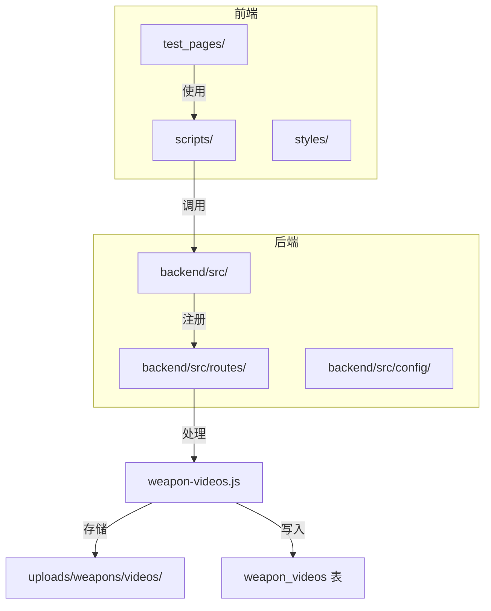
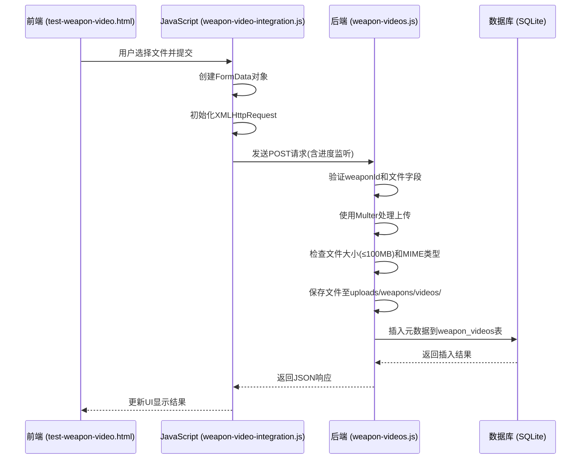
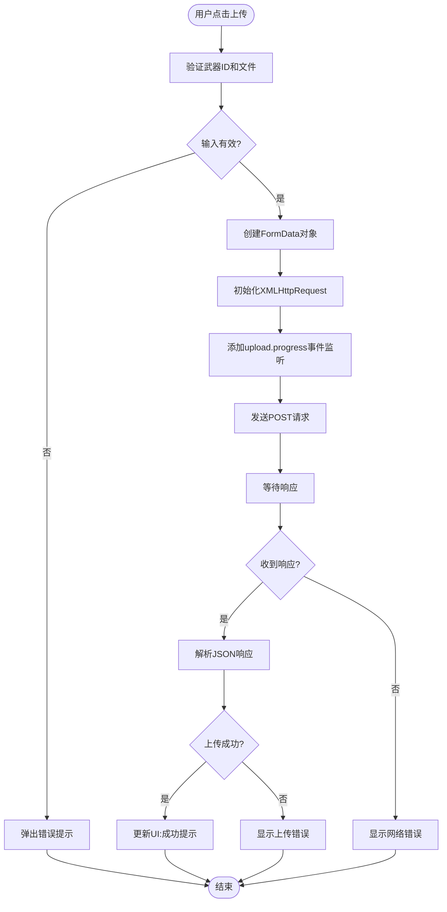
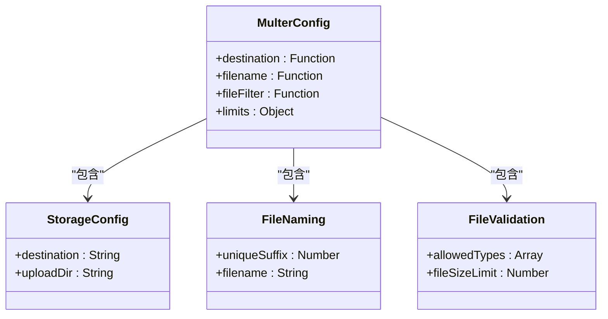
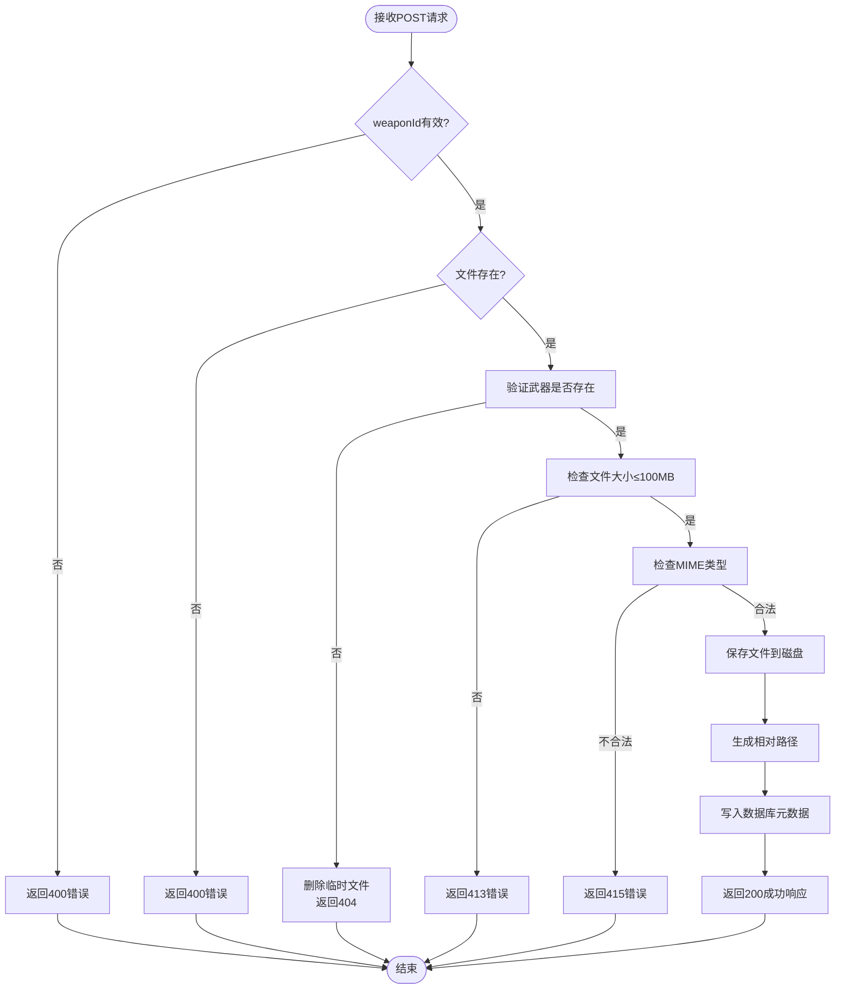

# 视频上传

<cite>
**本文档中引用的文件**  
- [test-weapon-video.html](file://test_pages/test-weapon-video.html)
- [weapon-videos.js](file://backend/src/routes/weapon-videos.js)
- [app.js](file://backend/src/app.js)
- [weapon-video-integration.js](file://scripts/weapon-video-integration.js)
</cite>

## 目录
1. [简介](#简介)
2. [项目结构](#项目结构)
3. [核心组件](#核心组件)
4. [架构概述](#架构概述)
5. [详细组件分析](#详细组件分析)
6. [依赖分析](#依赖分析)
7. [性能考虑](#性能考虑)
8. [故障排除指南](#故障排除指南)
9. [结论](#结论)

## 简介
本文档详细阐述了兵智世界系统中武器视频上传功能的实现机制。该功能允许用户为特定武器上传相关视频内容，支持前端进度监听、后端文件处理、数据库元数据持久化以及完整的错误处理机制。系统采用前后端分离架构，前端使用HTML5 FormData和XMLHttpRequest实现文件上传与进度监控，后端基于Express框架配合Multer中间件处理文件接收，并将视频元数据存储于SQLite数据库中。

## 项目结构
系统采用模块化设计，前端页面、JavaScript逻辑、后端路由与服务分离清晰。视频上传功能涉及多个关键目录和文件，包括测试页面、前端脚本、后端API路由等。



**Diagram sources**
- [test-weapon-video.html](file://test_pages/test-weapon-video.html)
- [weapon-videos.js](file://backend/src/routes/weapon-videos.js)

**Section sources**
- [test-weapon-video.html](file://test_pages/test-weapon-video.html)
- [weapon-videos.js](file://backend/src/routes/weapon-videos.js)

## 核心组件
武器视频上传功能由四个核心部分构成：前端表单界面、上传逻辑控制、后端API接口和数据库持久化层。前端通过`test-weapon-video.html`提供用户交互界面，利用`FormData`构造`multipart/form-data`请求体；`weapon-video-integration.js`负责上传过程中的进度监听与状态反馈；后端`weapon-videos.js`路由使用Multer中间件处理文件接收与验证；最终视频元数据通过SQLite写入`weapon_videos`表完成持久化。

**Section sources**
- [test-weapon-video.html](file://test_pages/test-weapon-video.html)
- [weapon-videos.js](file://backend/src/routes/weapon-videos.js)
- [weapon-video-integration.js](file://scripts/weapon-video-integration.js)

## 架构概述
整个视频上传流程遵循典型的客户端-服务器架构模式。前端发起POST请求至`/api/weapon-videos/weapon/:weaponId/upload`接口，携带视频文件及描述信息；后端接收请求后执行字段验证、MIME类型检查、大小限制判断等安全措施；通过验证后，文件被保存至指定目录并生成唯一文件名，同时元数据写入数据库；最后返回JSON格式响应告知上传结果。



**Diagram sources**
- [test-weapon-video.html](file://test_pages/test-weapon-video.html)
- [weapon-videos.js](file://backend/src/routes/weapon-videos.js)
- [weapon-video-integration.js](file://scripts/weapon-video-integration.js)

## 详细组件分析

### 前端上传机制分析
前端通过HTML表单收集武器ID和视频文件，使用JavaScript动态构建上传请求。核心在于利用`FormData`接口封装文件数据，并通过`XMLHttpRequest`实现可监听的上传过程。

#### 上传流程实现


**Diagram sources**
- [test-weapon-video.html](file://test_pages/test-weapon-video.html)
- [weapon-video-integration.js](file://scripts/weapon-video-integration.js)

**Section sources**
- [test-weapon-video.html](file://test_pages/test-weapon-video.html)
- [weapon-video-integration.js](file://scripts/weapon-video-integration.js)

### 后端处理逻辑分析
后端使用Express框架的路由系统处理视频上传请求，核心依赖Multer中间件完成文件接收与存储。

#### Multer配置分析


**Diagram sources**
- [weapon-videos.js](file://backend/src/routes/weapon-videos.js)

**Section sources**
- [weapon-videos.js](file://backend/src/routes/weapon-videos.js)

### 接口处理流程分析
`/api/weapon-videos/weapon/:weaponId/upload`接口的POST请求处理流程包含多个关键步骤，确保数据完整性与系统安全性。

#### 请求处理流程


**Diagram sources**
- [weapon-videos.js](file://backend/src/routes/weapon-videos.js)

**Section sources**
- [weapon-videos.js](file://backend/src/routes/weapon-videos.js)

### 数据库持久化分析
上传成功后，系统将视频元数据写入`weapon_videos`表，确保信息可追溯与管理。

#### weapon_videos表结构
| 字段名 | 类型 | 说明 |
|--------|------|------|
| id | INTEGER | 主键，自增 |
| weapon_id | INTEGER | 外键，关联weapons表 |
| filename | VARCHAR(255) | 存储的文件名（含时间戳） |
| original_name | VARCHAR(255) | 原始文件名 |
| file_path | VARCHAR(500) | 文件路径（相对路径） |
| file_size | INTEGER | 文件大小（字节） |
| mime_type | VARCHAR(100) | MIME类型 |
| duration | INTEGER | 视频时长（秒） |
| description | TEXT | 视频描述 |
| created_at | DATETIME | 创建时间，默认当前时间 |

**Diagram sources**
- [weapon-videos.js](file://backend/src/routes/weapon-videos.js)

**Section sources**
- [weapon-videos.js](file://backend/src/routes/weapon-videos.js)

## 依赖分析
视频上传功能依赖多个前后端组件协同工作，形成完整的调用链路。

```mermaid
graph TD
test_html[test-weapon-video.html] --> |调用| weapon_js[weapon-video-integration.js]
weapon_js --> |发送请求| api_endpoint[/api/weapon-videos/weapon/:id/upload]
api_endpoint --> |注册于| app_js[app.js]
app_js --> |使用| weapon_videos[weapon-videos.js]
weapon_videos --> |使用| multer[Multer中间件]
weapon_videos --> |操作| db[weapon_videos表]
weapon_videos --> |存储至| upload_dir[uploads/weapons/videos/]
```

**Diagram sources**
- [test-weapon-video.html](file://test_pages/test-weapon-video.html)
- [app.js](file://backend/src/app.js)
- [weapon-videos.js](file://backend/src/routes/weapon-videos.js)

**Section sources**
- [app.js](file://backend/src/app.js)
- [weapon-videos.js](file://backend/src/routes/weapon-videos.js)

## 性能考虑
系统在设计时考虑了多项性能与安全因素：
- 文件大小限制为100MB，防止过大文件占用过多磁盘空间
- 支持视频流式播放（HTTP Range请求），提升大文件播放体验
- 使用相对路径存储，便于部署迁移
- 错误处理机制完善，上传失败时自动清理临时文件
- 前端提供上传进度反馈，提升用户体验

## 故障排除指南
### 常见问题及解决方案

| 问题现象 | 可能原因 | 解决方案 |
|---------|--------|--------|
| 上传失败，提示"无效的武器ID" | weaponId为空或非正整数 | 检查前端传入的weaponId是否正确 |
| 上传失败，提示"请选择要上传的视频文件" | 文件字段缺失 | 确保FormData中包含名为'video'的文件字段 |
| 上传失败，提示"武器不存在" | weapon_id在weapons表中不存在 | 验证武器ID是否存在于数据库 |
| 上传失败，无具体错误信息 | 服务器内部异常 | 检查后端日志，确认Multer配置和目录权限 |
| 网络中断导致上传失败 | 连接不稳定 | 实现断点续传或增加重试机制 |
| 重复文件名问题 | Multer已通过时间戳+随机数避免 | 无需额外处理，系统自动保证唯一性 |
| 服务器磁盘空间不足 | 长期积累大量视频文件 | 定期清理或扩展存储空间 |

**Section sources**
- [test-weapon-video.html](file://test_pages/test-weapon-video.html)
- [weapon-videos.js](file://backend/src/routes/weapon-videos.js)

## 结论
兵智世界系统的武器视频上传功能实现了从前端交互到后端处理再到数据持久化的完整闭环。系统采用现代化Web技术栈，具备良好的用户体验和稳定的数据保障机制。通过Multer中间件实现安全的文件上传，结合SQLite数据库完成元数据管理，整体架构清晰、可维护性强。未来可进一步优化方向包括：增加视频转码支持、实现分布式存储、引入CDN加速播放等。