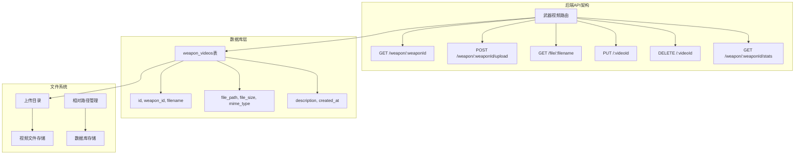
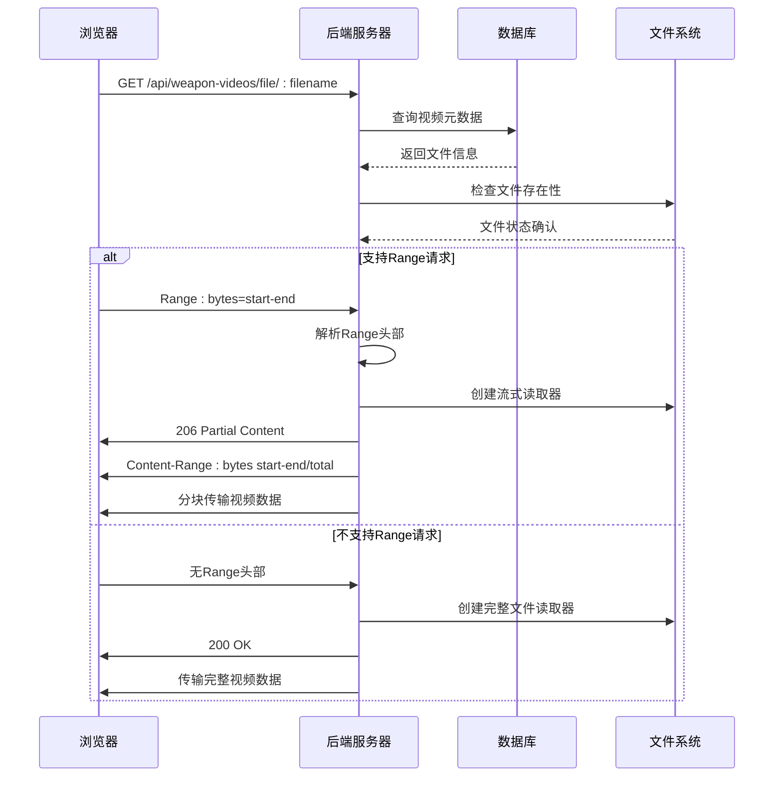
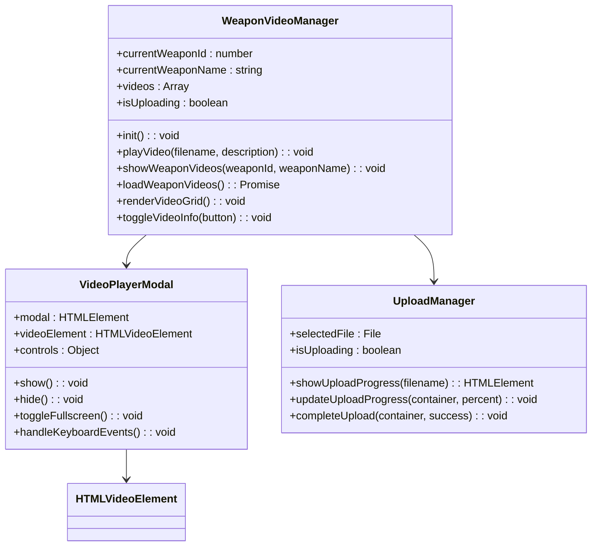
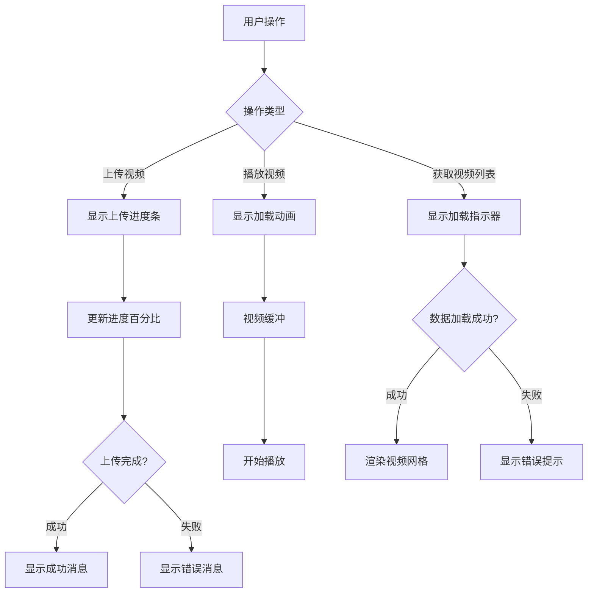
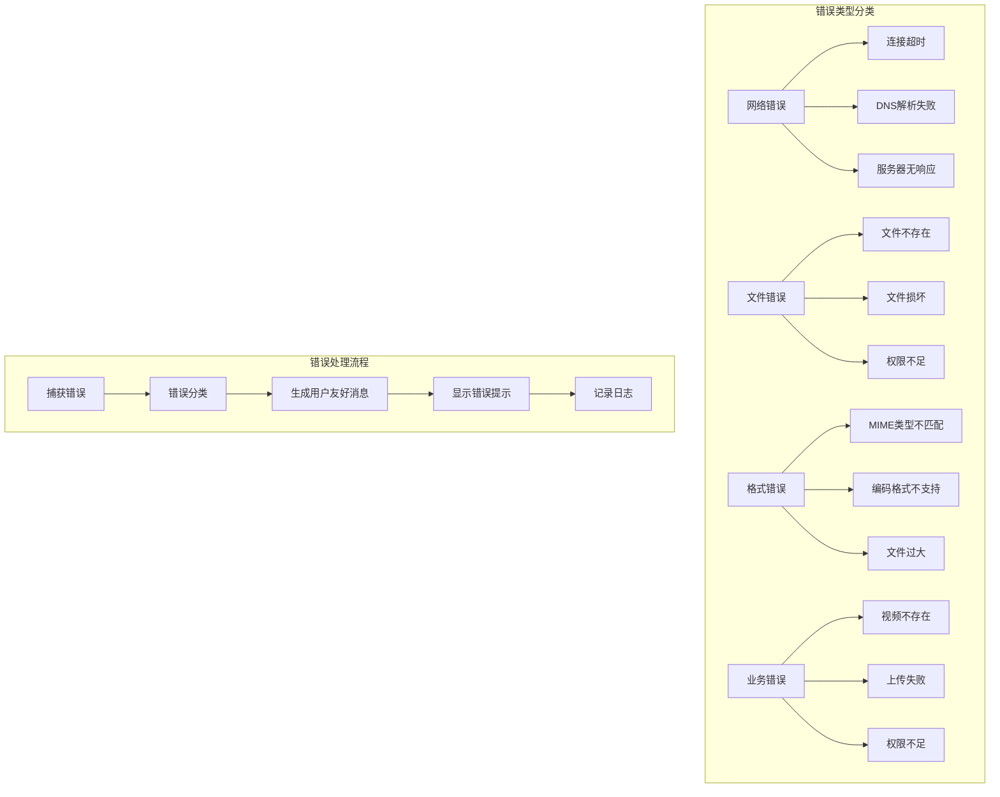

# 视频播放与流媒体

<cite>
**本文档引用的文件**
- [backend/src/routes/weapon-videos.js](file://backend/src/routes/weapon-videos.js)
- [test_pages/test-weapon-video.html](file://test_pages/test-weapon-video.html)
- [knowledge-graph.html](file://knowledge-graph.html)
- [scripts/weapon-video-integration.js](file://scripts/weapon-video-integration.js)
- [backend/app.py](file://backend/app.py)
- [backend/package.json](file://backend/package.json)
- [backend/package-lock.json](file://backend/package-lock.json)
</cite>

## 目录
1. [系统概述](#系统概述)
2. [后端架构设计](#后端架构设计)
3. [视频流式传输机制](#视频流式传输机制)
4. [前端播放器实现](#前端播放器实现)
5. [性能优化策略](#性能优化策略)
6. [错误处理与用户体验](#错误处理与用户体验)
7. [安全考虑](#安全考虑)
8. [部署与维护](#部署与维护)

## 系统概述

兵智世界视频播放系统是一个基于现代Web技术构建的武器视频管理系统，支持视频上传、存储、流式播放和管理功能。系统采用前后端分离架构，后端使用Express.js提供RESTful API服务，前端通过HTML5 video标签和自定义播放器实现视频播放功能。

### 核心特性

- **流式视频传输**：支持HTTP Range请求实现断点续传和随机访问
- **多格式支持**：兼容MP4、AVI、MOV、WMV、FLV、WebM等视频格式
- **大文件处理**：针对大视频文件的分块读取和内存优化
- **全屏播放**：集成全屏控制和键盘快捷键支持
- **实时反馈**：上传进度显示和错误状态提示
- **跨平台兼容**：支持主流浏览器的HTML5 video标准

## 后端架构设计

### API路由结构

系统的核心视频功能通过专门的路由模块实现，主要包含以下端点：



**图表来源**
- [backend/src/routes/weapon-videos.js](file://backend/src/routes/weapon-videos.js#L1-L404)

### 数据库设计

视频信息存储在`weapon_videos`表中，包含以下字段：

| 字段名 | 类型 | 描述 |
|--------|------|------|
| id | INTEGER | 主键标识符 |
| weapon_id | INTEGER | 关联的武器ID |
| filename | VARCHAR(255) | 服务器文件名 |
| original_name | VARCHAR(255) | 原始文件名 |
| file_path | VARCHAR(500) | 文件存储路径 |
| file_size | INTEGER | 文件大小（字节） |
| mime_type | VARCHAR(100) | MIME类型 |
| duration | INTEGER | 视频时长（秒） |
| description | TEXT | 视频描述 |
| created_at | DATETIME | 创建时间 |

**章节来源**
- [backend/src/routes/weapon-videos.js](file://backend/src/routes/weapon-videos.js#L45-L65)

## 视频流式传输机制

### HTTP Range请求处理

系统核心的流式传输功能通过处理HTTP Range请求实现，支持视频的断点续传和随机访问。



**图表来源**
- [backend/src/routes/weapon-videos.js](file://backend/src/routes/weapon-videos.js#L199-L280)

### Content-Range响应头构造

后端通过精确计算和构造Content-Range响应头来支持流式播放：

```javascript
// Range请求处理逻辑
if (range) {
    const parts = range.replace(/bytes=/, "").split("-");
    const start = parseInt(parts[0], 10);
    const end = parts[1] ? parseInt(parts[1], 10) : fileSize - 1;
    const chunksize = (end - start) + 1;
    
    const file = fs.createReadStream(fullPath, { start, end });
    const head = {
        'Content-Range': `bytes ${start}-${end}/${fileSize}`,
        'Accept-Ranges': 'bytes',
        'Content-Length': chunksize,
        'Content-Type': video.mime_type,
    };
    res.writeHead(206, head);
    file.pipe(res);
}
```

### 大文件分块读取策略

对于大视频文件，系统采用流式读取避免内存溢出：

- **缓冲区管理**：使用Node.js的Stream API进行分块读取
- **内存优化**：每次只读取一小部分数据到内存
- **并发控制**：限制同时处理的Range请求数量
- **超时处理**：设置合理的请求超时时间

**章节来源**
- [backend/src/routes/weapon-videos.js](file://backend/src/routes/weapon-videos.js#L199-L280)

## 前端播放器实现

### HTML5 Video标签集成

前端播放器基于HTML5 video标准构建，提供原生的视频播放体验：



**图表来源**
- [scripts/weapon-video-integration.js](file://scripts/weapon-video-integration.js#L1-L1239)

### 全屏控制与键盘支持

播放器实现了完整的全屏控制功能：

- **ESC键退出**：按下ESC键可退出全屏模式
- **双击切换**：视频区域双击可切换全屏状态
- **鼠标悬停控制栏**：显示播放、暂停、音量等控制按钮
- **触摸设备适配**：移动端手势控制支持

### 加载状态反馈

系统提供多层次的加载状态反馈：



**图表来源**
- [scripts/weapon-video-integration.js](file://scripts/weapon-video-integration.js#L800-L950)

**章节来源**
- [scripts/weapon-video-integration.js](file://scripts/weapon-video-integration.js#L1000-L1200)

## 性能优化策略

### Gzip压缩配置

虽然当前代码中没有显式的Gzip配置，但建议在生产环境中启用Gzip压缩：

```javascript
// Express中间件示例
const compression = require('compression');
app.use(compression({
    level: 6,
    threshold: 1024,
    filter: (req, res) => {
        if (req.headers['x-no-compression']) {
            return false;
        }
        return compression.filter(req, res);
    }
}));
```

### 缓存策略优化

系统应实施多层缓存策略：

| 缓存层级 | 缓存内容 | 过期时间 | 实现方式 |
|----------|----------|----------|----------|
| 浏览器缓存 | 视频文件 | 1小时 | Cache-Control: public, max-age=3600 |
| CDN缓存 | 静态资源 | 1天 | CDN边缘节点缓存 |
| 应用缓存 | 元数据 | 5分钟 | Redis缓存 |
| 数据库缓存 | 查询结果 | 10分钟 | 查询缓存 |

### CDN加速方案

建议部署CDN来优化视频文件的传输性能：

- **地理位置分布**：在全球多个节点部署CDN边缘服务器
- **智能路由**：根据用户位置选择最优的CDN节点
- **预热策略**：定期预热热门视频内容
- **监控告警**：实时监控CDN性能指标

**章节来源**
- [backend/package.json](file://backend/package.json#L1-L20)

## 错误处理与用户体验

### 错误分类与处理

系统实现了完善的错误处理机制：



### 用户体验设计

系统注重用户体验的每一个细节：

- **渐进式增强**：基础功能在所有浏览器中可用
- **优雅降级**：不支持HTML5 video的浏览器提供替代方案
- **响应式设计**：适应不同屏幕尺寸和设备类型
- **无障碍支持**：提供键盘导航和屏幕阅读器支持

**章节来源**
- [scripts/weapon-video-integration.js](file://scripts/weapon-video-integration.js#L1100-L1239)

## 安全考虑

### 文件上传安全

视频上传功能实施了多重安全措施：

- **文件类型验证**：严格限制允许的视频格式
- **文件大小限制**：防止大文件攻击，默认限制100MB
- **路径遍历防护**：确保文件存储路径的安全性
- **恶意文件检测**：扫描上传的视频文件

### 访问控制

系统实现了细粒度的访问控制：

- **身份验证**：需要管理员权限才能上传和删除视频
- **权限检查**：验证用户对特定武器视频的访问权限
- **IP白名单**：可配置的IP访问控制
- **速率限制**：防止暴力攻击和DDoS攻击

### 数据保护

敏感数据得到妥善保护：

- **加密存储**：数据库连接使用SSL加密
- **传输安全**：HTTPS强制使用
- **日志脱敏**：敏感信息不在日志中记录
- **备份恢复**：定期备份重要数据

## 部署与维护

### 环境配置

系统支持多种部署环境：

- **开发环境**：本地开发和测试
- **测试环境**：功能验证和性能测试
- **生产环境**：高可用性和负载均衡

### 监控指标

建议监控以下关键指标：

| 指标类别 | 监控项目 | 告警阈值 | 处理建议 |
|----------|----------|----------|----------|
| 性能指标 | 响应时间 | >2秒 | 优化数据库查询 |
| 性能指标 | 并发连接数 | >1000 | 增加服务器实例 |
| 存储指标 | 磁盘使用率 | >80% | 清理旧文件 |
| 存储指标 | 网络带宽 | >90% | 启用CDN加速 |
| 错误指标 | 5xx错误率 | >5% | 检查服务器健康状态 |

### 维护计划

制定定期维护计划：

- **每日**：检查服务器日志和错误报告
- **每周**：清理临时文件和过期数据
- **每月**：更新依赖包和安全补丁
- **每季度**：性能调优和容量规划

**章节来源**
- [backend/app.py](file://backend/app.py#L1-L43)

## 总结

兵智世界的视频播放与流媒体系统是一个功能完善、性能优异的现代化Web应用。通过合理的架构设计、先进的流式传输技术和优秀的用户体验设计，系统能够满足大规模视频内容管理和播放的需求。建议在实际部署时重点关注性能优化、安全防护和运维监控，确保系统的稳定性和可靠性。