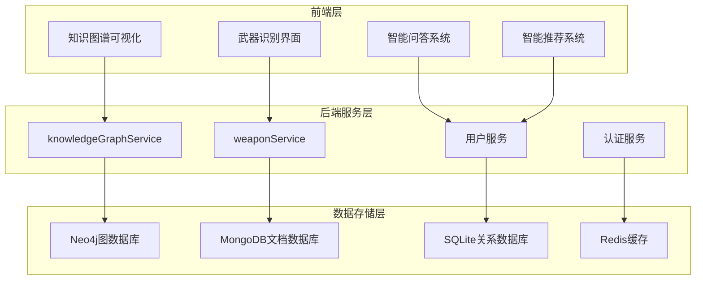
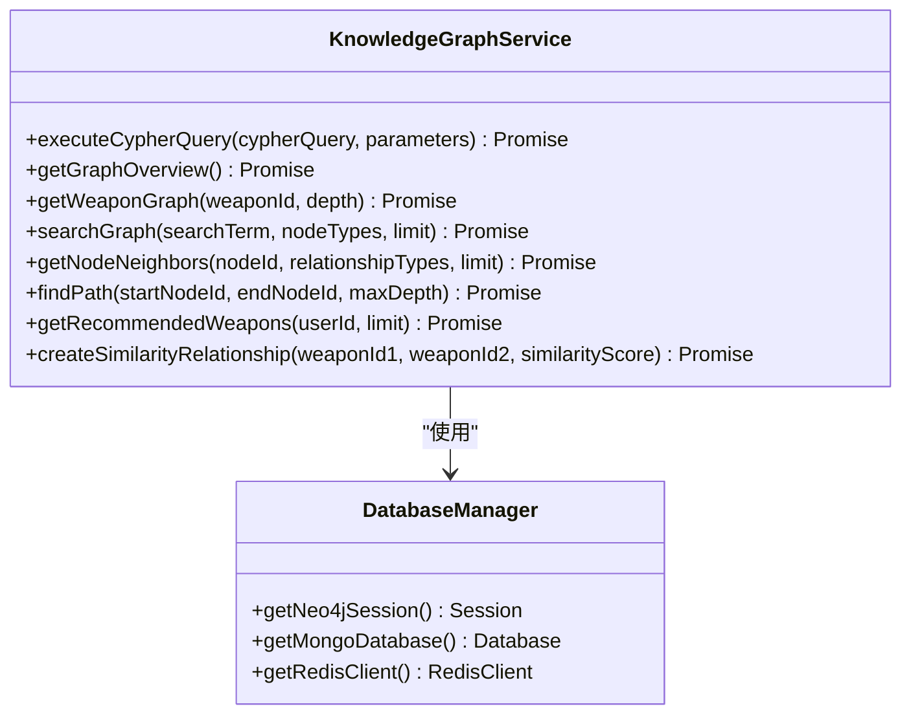
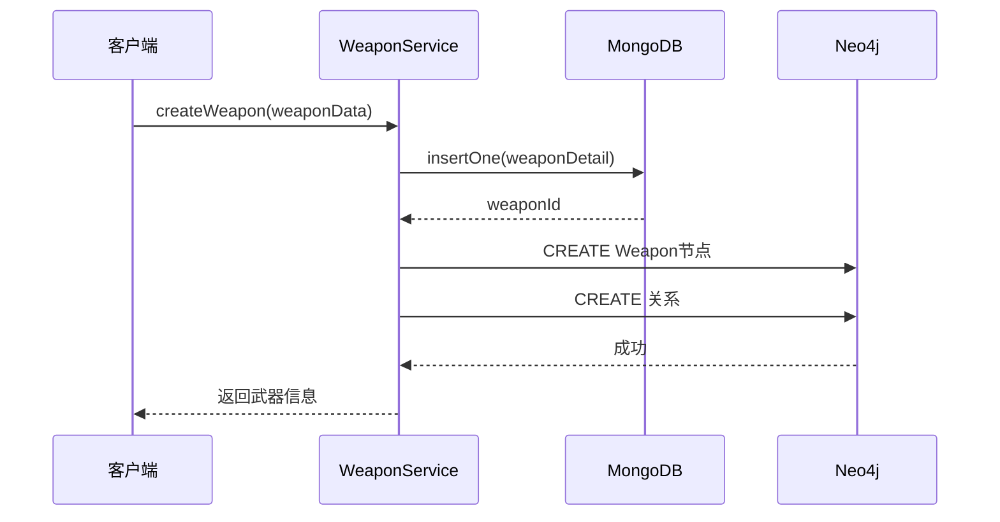
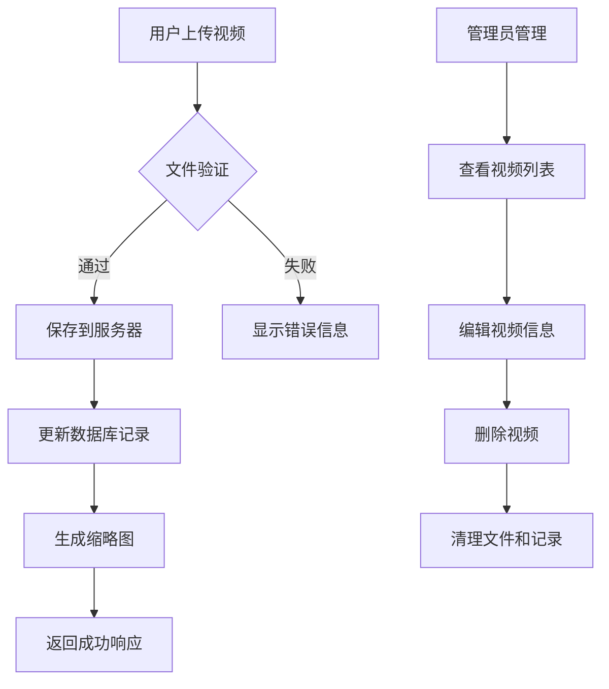
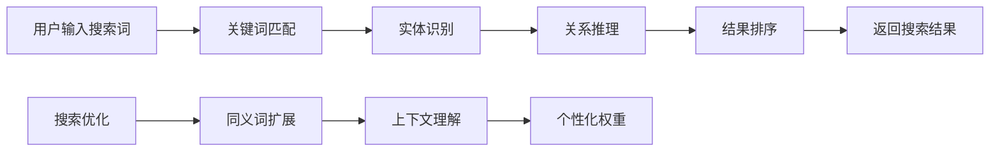
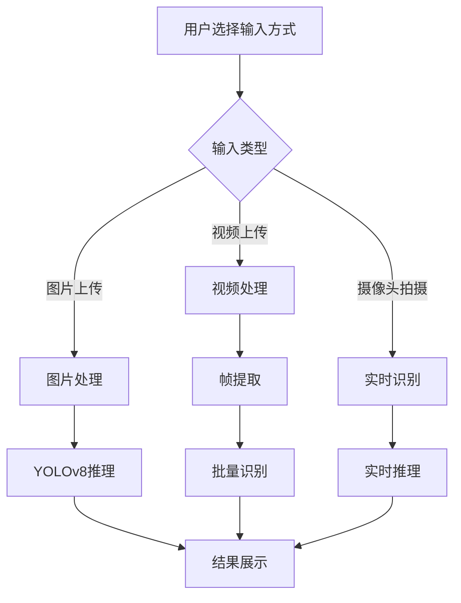
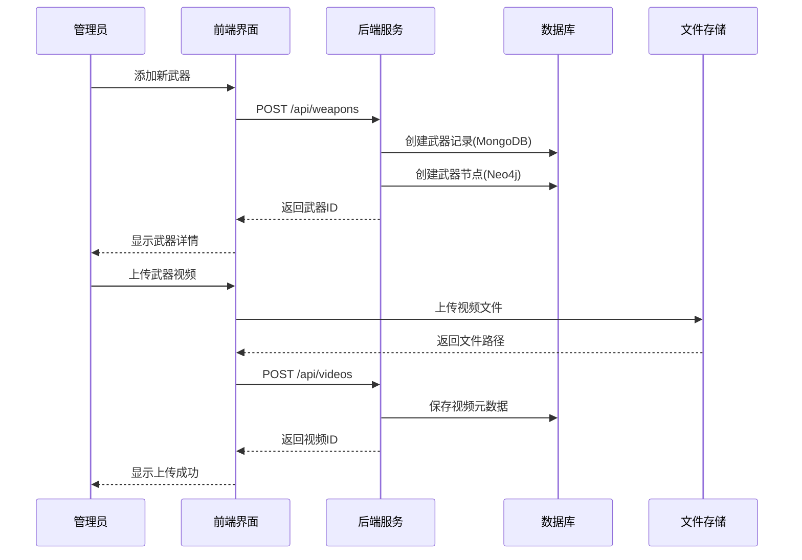

# 核心功能

<cite>
**本文档中引用的文件**
- [knowledgeGraphService.js](file://backend/src/services/knowledgeGraphService.js)
- [weaponService.js](file://backend/src/services/weaponService.js)
- [knowledge-graph.js](file://knowledge-graph.js)
- [weapon-recognition.js](file://scripts/weapon-recognition.js)
- [database_Neo4j.js](file://backend/src/config/database_Neo4j.js)
- [database-simple.js](file://backend/src/config/database-simple.js)
- [graphData.json](file://data/graphData.json)
- [test-weapon-video.html](file://test_pages/test-weapon-video.html)
- [recommendation.html](file://recommendation.html)
- [qa.html](file://qa.html)
</cite>

## 目录
1. [项目概述](#项目概述)
2. [知识图谱可视化引擎](#知识图谱可视化引擎)
3. [武器全生命周期管理](#武器全生命周期管理)
4. [多媒体资源集成](#多媒体资源集成)
5. [智能搜索与推荐系统](#智能搜索与推荐系统)
6. [武器识别功能](#武器识别功能)
7. [功能协同流程](#功能协同流程)
8. [技术架构分析](#技术架构分析)
9. [总结](#总结)

## 项目概述

兵智世界是一个综合性的军事知识管理平台，采用前后端分离架构，集成了知识图谱可视化、武器全生命周期管理、多媒体资源集成等三大核心功能模块。系统支持多种数据库技术，包括Neo4j图数据库、MongoDB文档数据库和SQLite关系数据库，为不同场景提供最优的数据存储方案。

### 核心功能架构

**图表来源**
- [knowledgeGraphService.js](file://backend/src/services/knowledgeGraphService.js#L1-L50)
- [weaponService.js](file://backend/src/services/weaponService.js#L1-L50)
- [database_Neo4j.js](file://backend/src/config/database_Neo4j.js#L1-L50)
- [database-simple.js](file://backend/src/config/database-simple.js#L1-L50)

## 知识图谱可视化引擎

知识图谱可视化引擎是兵智世界的核心功能之一，基于Neo4j图数据库构建，提供直观的武器装备关系展示和智能分析功能。

### 核心组件

#### 1. 知识图谱服务 (knowledgeGraphService.js)

知识图谱服务提供了完整的图数据库操作接口，支持复杂的图查询和分析功能：

**图表来源**
- [knowledgeGraphService.js](file://backend/src/services/knowledgeGraphService.js#L3-L430)
- [database_Neo4j.js](file://backend/src/config/database_Neo4j.js#L10-L140)

#### 2. 前端可视化 (knowledge-graph.js)

前端知识图谱可视化采用D3.js框架，提供交互式的图谱展示和分析功能：

**主要特性：**
- 力导向布局算法，自动优化节点分布
- 支持节点拖拽和缩放操作
- 实时搜索和过滤功能
- 节点详情面板，显示武器详细信息
- 导出SVG格式图谱功能

**交互功能：**
- 节点点击查看详情
- 拖拽节点重新定位
- 缩放和平移操作
- 搜索和过滤节点
- 导出图谱为SVG格式

**章节来源**
- [knowledge-graph.js](file://knowledge-graph.js#L1-L796)
- [knowledgeGraphService.js](file://backend/src/services/knowledgeGraphService.js#L1-L430)

### 数据模型

知识图谱采用实体-关系模型，主要包含以下节点类型：

| 节点类型 | 属性 | 关系 |
|---------|------|------|
| Weapon | name, description, year | BELONGS_TO, MANUFACTURED_BY, SIMILAR_TO |
| Manufacturer | name, country, founded | 制造武器, 属于国家 |
| Country | name, region | 使用武器, 生产武器 |
| Type | name, description | 武器类型分类 |

**章节来源**
- [graphData.json](file://data/graphData.json#L1-L206)

## 武器全生命周期管理

武器全生命周期管理模块提供完整的武器装备信息管理功能，支持CRUD操作和高级查询。

### 核心功能

#### 1. 武器服务 (weaponService.js)

武器服务封装了武器装备的完整生命周期管理：

**图表来源**
- [weaponService.js](file://backend/src/services/weaponService.js#L5-L100)

#### 2. 数据库架构

系统采用混合数据库架构：

**MongoDB存储：**
- 武器详细信息（规格、描述、图片等）
- 用户交互数据
- 文件元数据

**Neo4j存储：**
- 武器实体关系
- 制造商关系
- 国家使用关系
- 相似性关系

**SQLite存储：**
- 用户账户信息
- 基础配置数据
- 缓存数据

**章节来源**
- [weaponService.js](file://backend/src/services/weaponService.js#L1-L486)
- [database_Neo4j.js](file://backend/src/config/database_Neo4j.js#L1-L141)
- [database-simple.js](file://backend/src/config/database-simple.js#L1-L323)

### CRUD操作流程

| 操作类型 | 数据库 | 主要步骤 | 特殊处理 |
|---------|--------|----------|----------|
| 创建武器 | MongoDB+Neo4j | 1. 存储详细信息 2. 创建图节点 3. 建立关系 | 自动同步到图数据库 |
| 查询武器 | MongoDB+Neo4j | 1. 查询基本信息 2. 获取关系信息 | 合并文档和图数据 |
| 更新武器 | MongoDB+Neo4j | 1. 更新详细信息 2. 更新图节点属性 3. 重建关系 | 保持数据一致性 |
| 删除武器 | MongoDB+Neo4j | 1. 删除文档 2. 删除图节点及关系 | 级联删除相关数据 |

## 多媒体资源集成

多媒体资源集成模块支持武器装备的图片、视频和3D模型管理，提供完整的媒体资源生命周期管理。

### 视频管理系统

#### 1. 视频上传与管理

视频管理系统提供完整的武器视频处理流程：

**图表来源**
- [test-weapon-video.html](file://test_pages/test-weapon-video.html#L1-L100)

#### 2. 媒体资源架构

| 资源类型 | 存储位置 | 处理方式 | 访问控制 |
|---------|----------|----------|----------|
| 图片 | 服务器文件系统 | 自动生成缩略图 | 基于权限验证 |
| 视频 | 服务器文件系统 | 转码和压缩 | 用户认证 |
| 3D模型 | 服务器文件系统 | 格式转换 | 权限控制 |

**章节来源**
- [test-weapon-video.html](file://test_pages/test-weapon-video.html#L1-L565)

### 3D模型管理

系统支持多种3D模型格式，提供在线预览和交互功能。

## 智能搜索与推荐系统

智能搜索与推荐系统基于用户行为和武器特征，提供个性化的内容推荐和智能搜索功能。

### 搜索功能

#### 1. 知识图谱搜索

知识图谱搜索支持语义查询和关系推理：

**图表来源**
- [knowledgeGraphService.js](file://backend/src/services/knowledgeGraphService.js#L150-L200)

#### 2. 推荐系统

推荐系统采用协同过滤和内容过滤相结合的方法：

**推荐算法：**
- 基于用户兴趣的武器推荐
- 基于武器相似性的推荐
- 基于流行度的推荐

**推荐维度：**
- 武器类型偏好
- 国家/地区偏好
- 技术特征偏好

**章节来源**
- [knowledgeGraphService.js](file://backend/src/services/knowledgeGraphService.js#L350-L400)
- [recommendation.html](file://recommendation.html#L1-L119)

## 武器识别功能

武器识别功能基于YOLOv8深度学习模型，支持图片和视频中的武器自动识别。

### 识别流程

#### 1. 前端识别界面

武器识别界面提供多种输入方式：

**图表来源**
- [weapon-recognition.js](file://scripts/weapon-recognition.js#L1-L100)

#### 2. 识别技术实现

**支持的识别模式：**
- 单张图片识别
- 视频序列识别
- 实时摄像头识别
- 批量文件处理

**识别精度：**
- 置信度评分系统
- 多武器同时识别
- 实时结果反馈

**章节来源**
- [weapon-recognition.js](file://scripts/weapon-recognition.js#L1-L608)

### 识别结果展示

识别结果包含以下信息：
- 武器名称和类型
- 生产国家和地区
- 生产年份
- 制造商信息
- 相关武器推荐
- 置信度评分

## 功能协同流程

### 管理员添加武器并上传视频的完整流程

**图表来源**
- [weaponService.js](file://backend/src/services/weaponService.js#L5-L100)
- [test-weapon-video.html](file://test_pages/test-weapon-video.html#L200-L300)

### 用户使用体验流程

1. **知识探索阶段**
   - 访问知识图谱页面
   - 浏览武器关系网络
   - 使用搜索功能查找特定武器

2. **深度了解阶段**
   - 点击武器节点查看详细信息
   - 查看相关图片和视频
   - 浏览3D模型

3. **互动学习阶段**
   - 使用武器识别功能
   - 参与智能问答
   - 接收个性化推荐

4. **内容消费阶段**
   - 查看相关文章
   - 下载学习资料
   - 分享发现内容

**章节来源**
- [knowledge-graph.js](file://knowledge-graph.js#L400-L600)
- [weapon-recognition.js](file://scripts/weapon-recognition.js#L200-L400)

## 技术架构分析

### 数据库技术栈

| 技术 | 用途 | 优势 | 适用场景 |
|------|------|------|----------|
| Neo4j | 图数据存储 | 强大的关系查询能力 | 武器关系图谱 |
| MongoDB | 文档存储 | 灵活的JSON结构 | 武器详细信息 |
| SQLite | 关系数据库 | 轻量级部署 | 用户数据和配置 |
| Redis | 缓存存储 | 高性能读写 | 热点数据缓存 |

### 前端技术栈

| 技术 | 用途 | 特点 |
|------|------|------|
| D3.js | 图形可视化 | 强大的数据可视化能力 |
| Canvas/WebGL | 实时渲染 | 高性能图形处理 |
| WebRTC | 摄像头访问 | 浏览器原生支持 |
| Fetch API | 数据通信 | 现代异步通信 |

### 后端技术栈

| 技术 | 用途 | 特点 |
|------|------|------|
| Node.js | 运行环境 | 高性能异步I/O |
| Express.js | Web框架 | 轻量级Web服务 |
| Socket.IO | 实时通信 | WebSocket支持 |
| JWT | 认证授权 | 无状态认证 |

**章节来源**
- [database_Neo4j.js](file://backend/src/config/database_Neo4j.js#L1-L141)
- [database-simple.js](file://backend/src/config/database-simple.js#L1-L323)

## 总结

兵智世界通过三大核心功能模块的有机结合，构建了一个完整的军事知识管理生态系统：

### 核心优势

1. **知识图谱可视化**：提供直观的武器装备关系展示，支持复杂查询和智能分析
2. **全生命周期管理**：完整的武器信息管理，支持多种数据库技术
3. **多媒体集成**：丰富的媒体资源管理，支持图片、视频、3D模型
4. **智能功能**：基于AI的武器识别和个性化推荐
5. **用户体验**：现代化的交互界面和流畅的操作体验

### 技术特色

- **混合数据库架构**：根据数据特点选择最适合的存储方案
- **前后端分离**：清晰的职责划分，便于维护和扩展
- **模块化设计**：功能独立，易于测试和部署
- **可扩展性**：支持功能模块的灵活组合和扩展

### 应用价值

兵智世界不仅是一个知识管理平台，更是一个智能化的军事学习工具，为用户提供：
- 深入的武器装备知识
- 直观的关系分析视角
- 个性化的学习体验
- 实时的智能辅助功能

通过这些核心功能的协同工作，系统能够有效支持军事教育、研究和决策等多种应用场景，为用户提供全面、准确、及时的军事知识服务。