# 权限管理与用户交互

<cite>
**本文档引用的文件**
- [backend/src/middleware/auth.js](file://backend/src/middleware/auth.js)
- [backend/src/routes/weapons.js](file://backend/src/routes/weapons.js)
- [backend/src/services/userService.js](file://backend/src/services/userService.js)
- [backend/src/services/weaponService.js](file://backend/src/services/weaponService.js)
- [backend/src/middleware/validation.js](file://backend/src/middleware/validation.js)
- [backend/src/routes/auth.js](file://backend/src/routes/auth.js)
- [backend/models/user.py](file://backend/models/user.py)
- [backend/routes/weapon.py](file://backend/routes/weapon.py)
- [scripts/auth.js](file://scripts/auth.js)
- [index.html](file://index.html)
- [login.html](file://login.html)
- [backend/src/app.js](file://backend/src/app.js)
</cite>

## 目录
1. [简介](#简介)
2. [系统架构概览](#系统架构概览)
3. [JWT认证中间件](#jwt认证中间件)
4. [用户收藏功能](#用户收藏功能)
5. [optionalAuth中间件](#optionalauth中间件)
6. [权限验证机制](#权限验证机制)
7. [安全加固措施](#安全加固措施)
8. [完整用例分析](#完整用例分析)
9. [故障排除指南](#故障排除指南)
10. [总结](#总结)

## 简介

本文档全面分析了兵智世界武器管理系统中的权限控制机制和用户交互功能。该系统采用分层认证体系，通过JWT令牌验证实现精细化权限管理，同时提供了完整的用户收藏功能和安全防护机制。

系统的核心特点包括：
- 基于JWT的分层认证体系
- 支持简化管理员模式的权限控制
- 完整的用户收藏和兴趣追踪功能
- 多层次的安全防护机制
- 优雅的错误处理和响应机制

## 系统架构概览

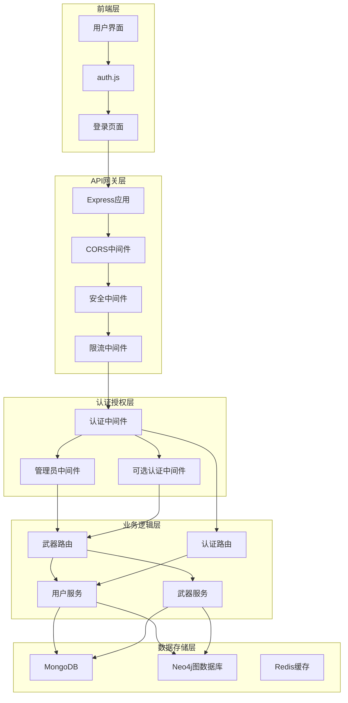

**图表来源**
- [backend/src/app.js](file://backend/src/app.js#L1-L50)
- [backend/src/middleware/auth.js](file://backend/src/middleware/auth.js#L1-L106)
- [backend/src/routes/weapons.js](file://backend/src/routes/weapons.js#L1-L50)

## JWT认证中间件

### authenticateToken中间件

authenticateToken是系统的核心认证中间件，负责验证JWT令牌的有效性并提取用户信息。

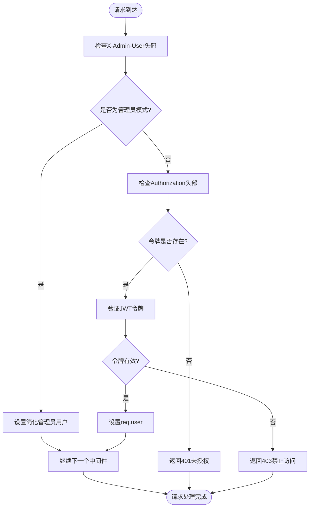

**图表来源**
- [backend/src/middleware/auth.js](file://backend/src/middleware/auth.js#L5-L40)

#### 关键特性

1. **简化管理员模式**：支持通过`X-Admin-User: true`头部启用简化管理员模式
2. **JWT令牌验证**：使用配置的密钥验证JWT令牌的有效性
3. **错误处理**：提供详细的错误信息和适当的HTTP状态码
4. **日志记录**：记录认证过程的关键事件

**章节来源**
- [backend/src/middleware/auth.js](file://backend/src/middleware/auth.js#L5-L40)

### requireAdmin中间件

requireAdmin中间件专门用于验证管理员权限，确保只有具有管理员角色的用户才能访问受保护的资源。

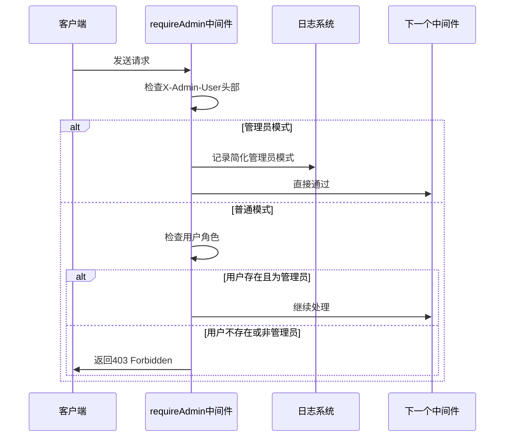

**图表来源**
- [backend/src/middleware/auth.js](file://backend/src/middleware/auth.js#L55-L70)

#### 权限验证流程

1. **管理员模式检测**：优先检查`X-Admin-User`头部
2. **角色验证**：确认用户角色为`admin`
3. **错误响应**：提供清晰的权限不足提示
4. **日志记录**：记录权限检查过程

**章节来源**
- [backend/src/middleware/auth.js](file://backend/src/middleware/auth.js#L55-L70)

## 用户收藏功能

### 收藏API端点

系统提供了两个核心的收藏相关API端点：

| 端点 | 方法 | 功能 | 权限要求 |
|------|------|------|----------|
| `/api/weapons/:id/favorite` | POST | 用户收藏武器 | 已登录用户 |
| `/api/weapons/:id/favorite` | DELETE | 用户取消收藏 | 已登录用户 |

### 收藏实现原理

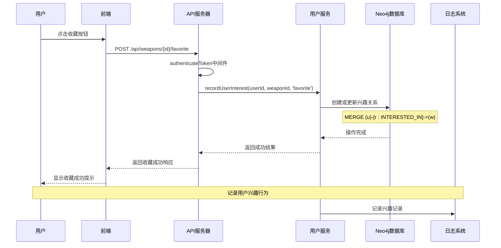

**图表来源**
- [backend/src/routes/weapons.js](file://backend/src/routes/weapons.js#L150-L170)
- [backend/src/services/userService.js](file://backend/src/services/userService.js#L284-L317)

### recordUserInterest调用机制

recordUserInterest方法是用户兴趣追踪的核心实现：

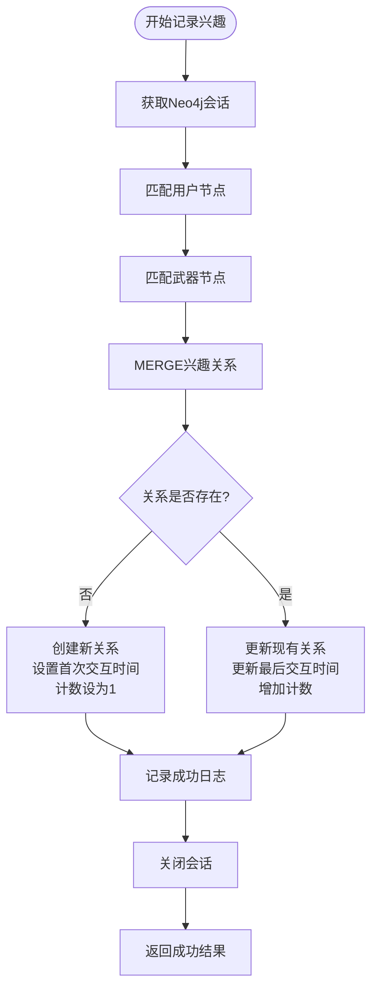

**图表来源**
- [backend/src/services/userService.js](file://backend/src/services/userService.js#L284-L317)

#### 关键特性

1. **图数据库集成**：使用Neo4j存储用户-武器兴趣关系
2. **关系状态管理**：区分首次交互和重复交互
3. **计数统计**：跟踪用户的交互频率
4. **时间戳记录**：记录首次和最后交互时间
5. **错误处理**：完善的异常处理和日志记录

**章节来源**
- [backend/src/services/userService.js](file://backend/src/services/userService.js#L284-L317)

### 收藏状态管理

系统通过多种方式管理收藏状态：

1. **前端状态同步**：收藏操作后立即更新UI状态
2. **后端持久化**：将收藏信息持久化到Neo4j图数据库
3. **推荐系统集成**：收藏数据用于个性化推荐算法
4. **用户偏好追踪**：作为用户兴趣偏好的重要指标

**章节来源**
- [backend/src/routes/weapons.js](file://backend/src/routes/weapons.js#L150-L170)

## optionalAuth中间件

### 应用场景

optionalAuth中间件专为非强制登录场景设计，在不影响用户体验的同时提供基本的功能支持。

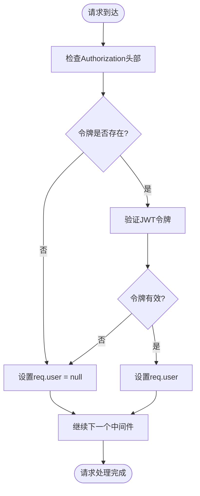

**图表来源**
- [backend/src/middleware/auth.js](file://backend/src/middleware/auth.js#L42-L54)

### 视图优化与行为追踪

optionalAuth在以下场景中发挥重要作用：

#### 1. 武器详情页面
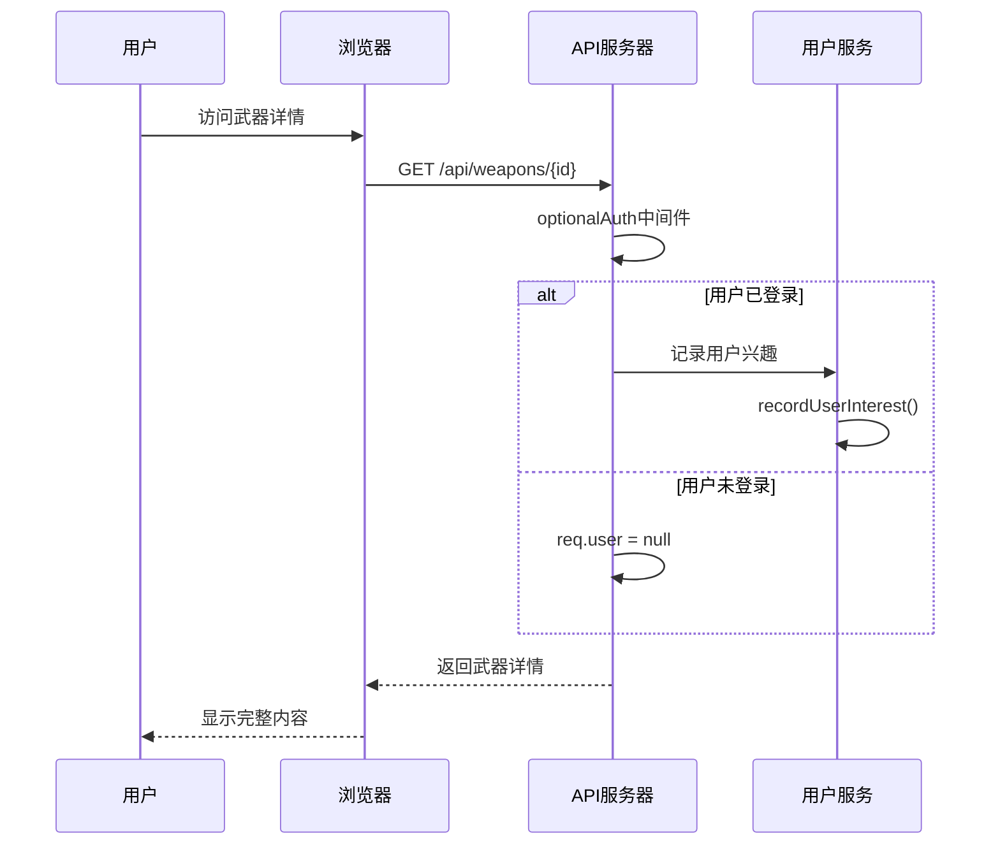

**图表来源**
- [backend/src/routes/weapons.js](file://backend/src/routes/weapons.js#L60-L80)

#### 2. 搜索和浏览功能
- **匿名用户**：可以浏览武器列表和搜索结果
- **已登录用户**：获得个性化推荐和兴趣追踪
- **性能优化**：减少不必要的认证开销

**章节来源**
- [backend/src/routes/weapons.js](file://backend/src/routes/weapons.js#L10-L30)

## 权限验证机制

### 分层认证体系

系统采用三层认证架构：

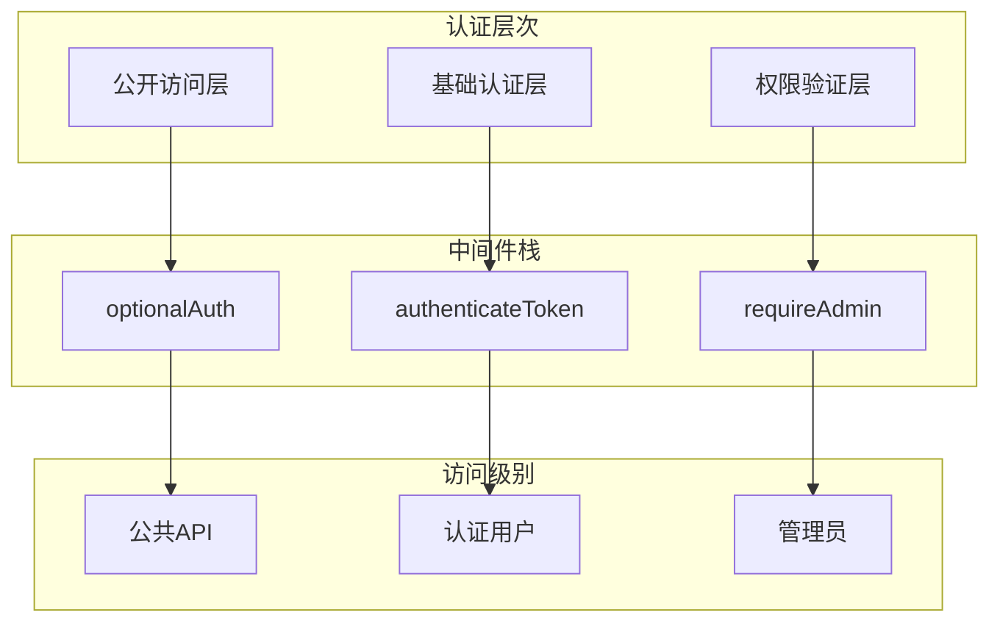

**图表来源**
- [backend/src/middleware/auth.js](file://backend/src/middleware/auth.js#L1-L106)

### 权限矩阵

| API端点 | optionalAuth | authenticateToken | requireAdmin | 说明 |
|---------|--------------|-------------------|--------------|------|
| GET /api/weapons | ✓ | ✗ | ✗ | 公开武器列表 |
| GET /api/weapons/:id | ✓ | ✗ | ✗ | 武器详情（含兴趣记录） |
| POST /api/weapons/:id/favorite | ✗ | ✓ | ✗ | 用户收藏 |
| DELETE /api/weapons/:id/favorite | ✗ | ✓ | ✗ | 用户取消收藏 |
| POST /api/weapons | ✗ | ✓ | ✓ | 创建武器（管理员） |
| PUT /api/weapons/:id | ✗ | ✓ | ✓ | 更新武器（管理员） |
| DELETE /api/weapons/:id | ✗ | ✓ | ✓ | 删除武器（管理员） |

**章节来源**
- [backend/src/routes/weapons.js](file://backend/src/routes/weapons.js#L1-L217)

### 错误响应处理

系统提供统一的错误响应格式：

```mermaid
flowchart TD
Error([认证/授权错误]) --> CheckType{"错误类型"}
CheckType --> |令牌缺失| Status401["401 Unauthorized"]
CheckType --> |令牌无效| Status403["403 Forbidden"]
CheckType --> |权限不足| Status403_2["403 Forbidden"]
CheckType --> |用户不存在| Status404["404 Not Found"]
Status401 --> ErrorResponse1["{
\"success\": false,
\"message\": \"访问令牌缺失\"
}"]
Status403 --> ErrorResponse2["{
\"success\": false,
\"message\": \"访问令牌无效或已过期\"
}"]
Status403_2 --> ErrorResponse3["{
\"success\": false,
\"message\": \"需要管理员权限\"
}"]
Status404 --> ErrorResponse4["{
\"success\": false,
\"message\": \"用户不存在\"
}"]
```

**图表来源**
- [backend/src/middleware/auth.js](file://backend/src/middleware/auth.js#L15-L40)

**章节来源**
- [backend/src/middleware/auth.js](file://backend/src/middleware/auth.js#L15-L70)

## 安全加固措施

### CSRF防护

虽然系统主要面向API使用，但仍实施了多层安全防护：

1. **CORS配置**：严格限制跨域请求来源
2. **Helmet中间件**：提供标准的安全头设置
3. **令牌验证**：JWT令牌防止伪造请求
4. **速率限制**：防止暴力攻击和滥用

### 防止越权访问

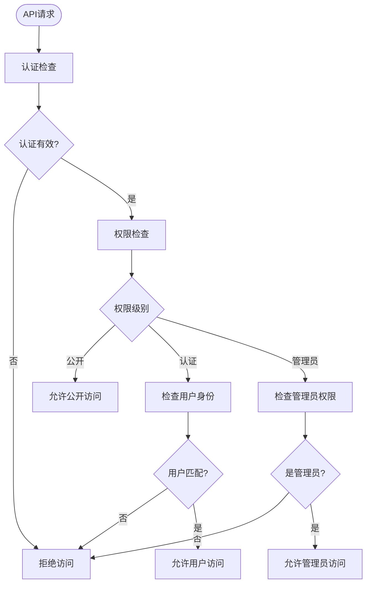

**图表来源**
- [backend/src/middleware/auth.js](file://backend/src/middleware/auth.js#L55-L70)

### 安全最佳实践

1. **令牌管理**：
   - 使用HTTPS传输令牌
   - 实施令牌刷新机制
   - 设置合理的过期时间

2. **数据验证**：
   - Joi验证框架确保数据完整性
   - 输入过滤防止注入攻击
   - 输出编码防止XSS攻击

3. **日志监控**：
   - 记录所有认证和授权事件
   - 监控异常访问模式
   - 实施审计跟踪

**章节来源**
- [backend/src/middleware/validation.js](file://backend/src/middleware/validation.js#L1-L178)
- [backend/src/app.js](file://backend/src/app.js#L30-L50)

## 完整用例分析

### 管理员添加武器用例

这是一个典型的前后端数据流协同工作用例：

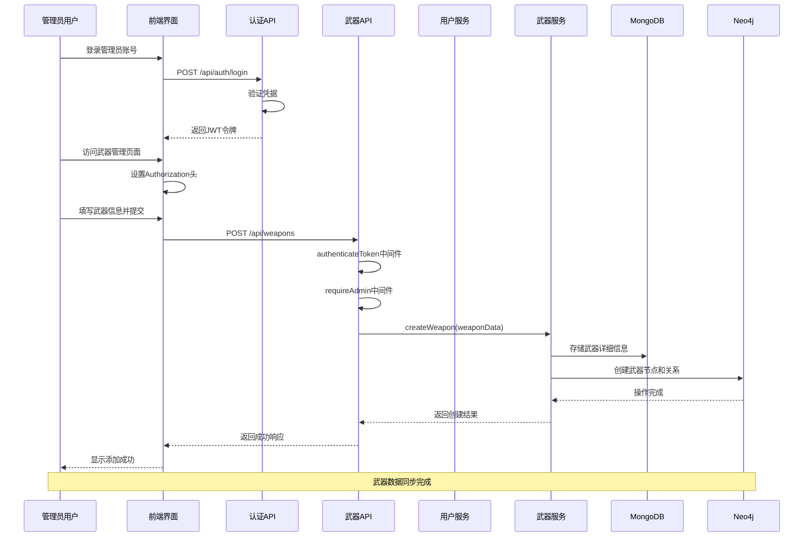

**图表来源**
- [backend/src/routes/auth.js](file://backend/src/routes/auth.js#L15-L25)
- [backend/src/routes/weapons.js](file://backend/src/routes/weapons.js#L100-L120)
- [backend/src/services/weaponService.js](file://backend/src/services/weaponService.js#L10-L80)

### 用户收藏武器用例

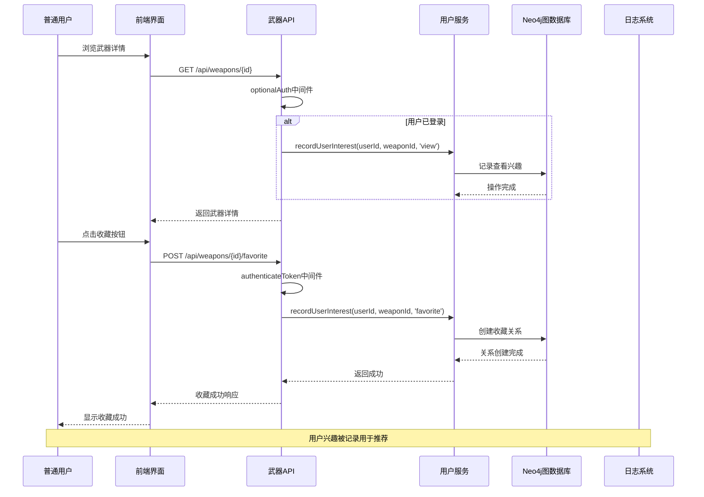

**图表来源**
- [backend/src/routes/weapons.js](file://backend/src/routes/weapons.js#L60-L80)
- [backend/src/routes/weapons.js](file://backend/src/routes/weapons.js#L150-L170)

**章节来源**
- [backend/src/routes/weapons.js](file://backend/src/routes/weapons.js#L100-L170)
- [backend/src/services/weaponService.js](file://backend/src/services/weaponService.js#L10-L80)

## 故障排除指南

### 常见权限验证失败案例

#### 1. 访问令牌缺失
**症状**：返回401状态码
**原因**：请求中缺少Authorization头部
**解决方案**：
- 确保前端正确设置Authorization头
- 检查令牌是否已过期
- 验证请求头格式：`Bearer <token>`

#### 2. 令牌无效或已过期
**症状**：返回403状态码
**原因**：
- JWT签名验证失败
- 令牌已过期
- 密钥不匹配

**解决方案**：
- 重新登录获取新令牌
- 检查服务器时间同步
- 验证JWT密钥配置

#### 3. 权限不足
**症状**：返回403状态码
**原因**：
- 用户角色不是管理员
- 简化管理员模式未启用
- 令牌中缺少管理员权限

**解决方案**：
- 确认用户具有管理员角色
- 在请求中添加`X-Admin-User: true`头部
- 检查用户权限配置

### 性能优化建议

1. **令牌缓存**：在客户端缓存有效的JWT令牌
2. **会话管理**：合理设置令牌过期时间
3. **数据库优化**：对用户兴趣关系进行索引优化
4. **CDN加速**：静态资源使用CDN分发

### 监控和调试

#### 日志分析
```javascript
// 关键日志模式
logger.info('使用简化管理员模式访问');
logger.warn('JWT验证失败:', err.message);
logger.error('记录用户兴趣失败:', interestError);
```

#### 调试技巧
1. **检查网络请求**：使用浏览器开发者工具
2. **验证令牌格式**：确保Bearer前缀正确
3. **测试中间件**：单独测试认证中间件
4. **数据库连接**：验证Neo4j连接状态

**章节来源**
- [backend/src/middleware/auth.js](file://backend/src/middleware/auth.js#L15-L40)
- [backend/src/services/userService.js](file://backend/src/services/userService.js#L295-L305)

## 总结

兵智世界的权限管理和用户交互系统展现了现代Web应用的最佳实践：

### 核心优势

1. **分层认证体系**：通过authenticateToken、requireAdmin和optionalAuth实现精细化权限控制
2. **用户体验优化**：optionalAuth确保匿名用户也能获得良好体验
3. **数据驱动推荐**：recordUserInterest提供强大的兴趣追踪能力
4. **安全防护完善**：多层安全机制防止越权访问和恶意攻击
5. **前后端协作**：完整的API设计确保系统的一致性和可靠性

### 技术亮点

- **JWT令牌机制**：提供无状态的身份验证
- **图数据库集成**：Neo4j支持复杂的关系查询
- **响应式设计**：前端JavaScript提供流畅的用户体验
- **错误处理机制**：统一的错误响应格式和日志记录

### 应用价值

该系统不仅满足了武器管理的基本需求，还为未来的功能扩展奠定了坚实的基础。通过用户收藏和兴趣追踪功能，系统能够逐步构建个性化的推荐引擎，提升用户的参与度和粘性。