# 武器CRUD操作

<cite>
**本文档中引用的文件**
- [backend/routes/weapon.py](file://backend/routes/weapon.py)
- [backend/services/weapon_service.py](file://backend/services/weapon_service.py)
- [backend/src/routes/weapons.js](file://backend/src/routes/weapons.js)
- [backend/src/services/weaponService.js](file://backend/src/services/weaponService.js)
- [backend/src/routes/weapons-simple.js](file://backend/src/routes/weapons-simple.js)
- [backend/src/middleware/validation.js](file://backend/src/middleware/validation.js)
- [backend/src/config/database-simple.js](file://backend/src/config/database-simple.js)
- [backend/src/config/database_Neo4j.js](file://backend/src/config/database_Neo4j.js)
- [backend/src/utils/logger.js](file://backend/src/utils/logger.js)
- [backend/src/middleware/auth.js](file://backend/src/middleware/auth.js)
</cite>

## 目录
1. [系统概述](#系统概述)
2. [架构设计](#架构设计)
3. [GET /api/weapons 接口](#get-apiprocessweapons-接口)
4. [POST /api/weapons 接口](#post-apiprocessweapons-接口)
5. [PUT /api/weapons/:id 接口](#put-apiprocessweaponsid-接口)
6. [DELETE /api/weapons/:id 接口](#delete-apiprocessweaponsid-接口)
7. [数据验证机制](#数据验证机制)
8. [多数据库协同操作](#多数据库协同操作)
9. [错误处理策略](#错误处理策略)
10. [性能优化与最佳实践](#性能优化与最佳实践)
11. [总结](#总结)

## 系统概述

武器CRUD操作模块是一个基于现代Web技术栈构建的综合性武器管理系统，采用前后端分离架构，支持多种数据库协同工作。系统提供了完整的武器生命周期管理功能，包括武器创建、读取、更新和删除操作。

### 核心特性

- **多数据库支持**：同时集成SQLite、MongoDB和Neo4j数据库
- **RESTful API设计**：遵循REST架构原则的标准化接口
- **数据验证**：多层次的数据验证机制确保数据完整性
- **事务处理**：跨数据库的一致性保证
- **日志记录**：完善的日志系统用于监控和调试
- **权限控制**：基于JWT的身份验证和授权机制

## 架构设计

系统采用分层架构设计，清晰分离关注点：

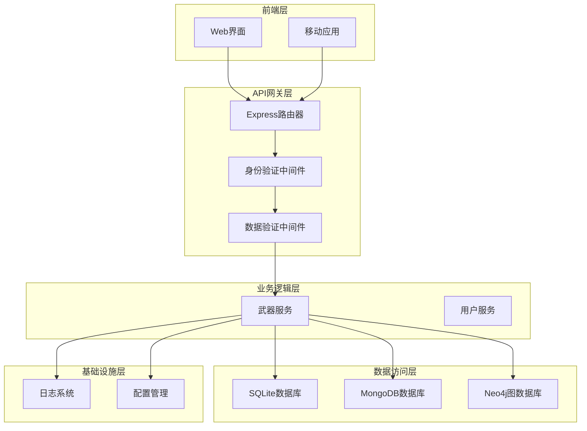

**图表来源**
- [backend/src/routes/weapons.js](file://backend/src/routes/weapons.js#L1-L218)
- [backend/src/services/weaponService.js](file://backend/src/services/weaponService.js#L1-L486)
- [backend/src/config/database_Neo4j.js](file://backend/src/config/database_Neo4j.js#L1-L141)

## GET /api/weapons 接口

### 功能概述

GET /api/weapons接口负责获取武器列表，支持复杂的查询条件和分页功能。该接口通过LEFT JOIN实现武器与制造商的关联查询，提供丰富的武器信息展示。

### 技术实现

#### SQL查询结构

接口使用精心设计的SQL查询来实现武器与制造商的关联：

```sql
SELECT w.id, w.name, w.type, w.country, w.year, w.description, 
       m.name as manufacturer
FROM weapons w
LEFT JOIN weapon_manufacturers wm ON w.id = wm.weapon_id
LEFT JOIN manufacturers m ON wm.manufacturer_id = m.id
WHERE type = ? AND country = ?
ORDER BY w.created_at DESC 
LIMIT ? OFFSET ?
```

#### 分页机制

系统实现了完整的分页功能：

- **当前页面**：通过`page`参数指定，默认值为1
- **每页数量**：通过`limit`参数控制，默认值为20
- **总记录数**：动态计算并返回
- **总页数**：根据总记录数和每页数量计算

#### 查询条件构建

系统支持灵活的查询条件组合：

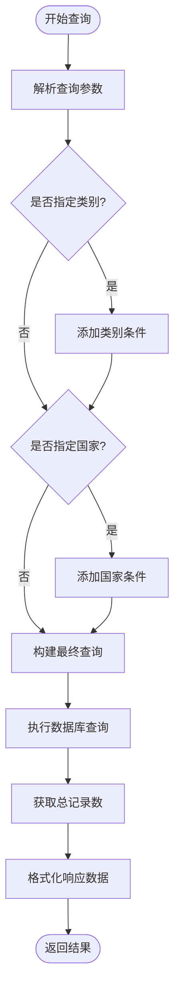

**图表来源**
- [backend/src/routes/weapons-simple.js](file://backend/src/routes/weapons-simple.js#L8-L48)

### 响应格式

成功的响应包含以下结构：

| 字段 | 类型 | 描述 |
|------|------|------|
| success | Boolean | 操作是否成功 |
| data.weapons | Array | 武器列表数组 |
| data.pagination | Object | 分页信息 |

武器对象结构：
| 字段 | 类型 | 描述 |
|------|------|------|
| id | String | 武器唯一标识符 |
| name | String | 武器名称 |
| type | String | 武器类型 |
| country | String | 制造国家 |
| year | Number | 生产年份 |
| description | String | 武器描述 |
| manufacturer | String | 制造商名称（可为空） |

**节来源**
- [backend/src/routes/weapons-simple.js](file://backend/src/routes/weapons-simple.js#L8-L48)

## POST /api/weapons 接口

### 功能概述

POST /api/weapons接口负责创建新的武器记录。该接口实现了复杂的数据处理流程，包括武器基本信息存储和制造商关联处理。

### 创建流程

#### 1. 数据接收与验证

接口首先通过验证中间件确保数据完整性：

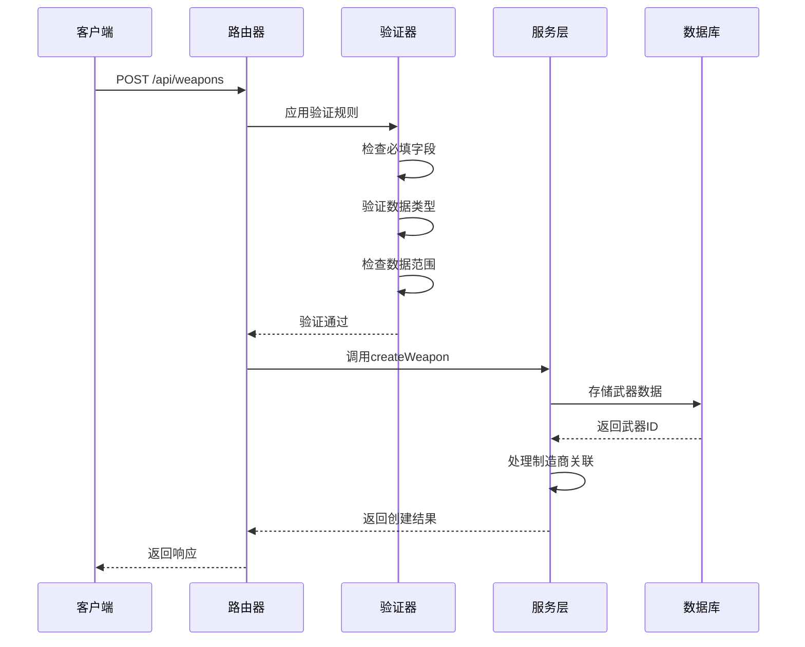

**图表来源**
- [backend/src/routes/weapons.js](file://backend/src/routes/weapons.js#L115-L125)
- [backend/src/services/weaponService.js](file://backend/src/services/weaponService.js#L8-L70)

#### 2. handleManufacturerAssociation函数逻辑

该函数是制造商关联的核心逻辑，支持新旧制造商的智能识别：

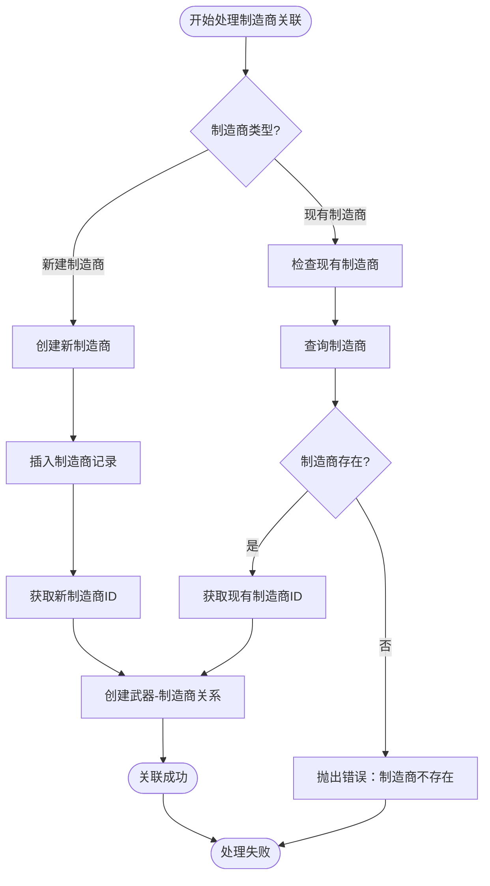

**图表来源**
- [backend/src/routes/weapons-simple.js](file://backend/src/routes/weapons-simple.js#L720-L780)

#### 3. MongoDB存储

武器详细信息存储在MongoDB中，包含丰富的元数据：

| 字段 | 类型 | 描述 |
|------|------|------|
| name | String | 武器名称 |
| type | String | 武器类型 |
| country | String | 制造国家 |
| year | Number | 生产年份 |
| description | String | 武器描述 |
| specifications | Object | 技术规格 |
| images | Array | 图片列表 |
| documents | Array | 文档列表 |
| performance_data | Object | 性能数据 |
| created_at | Date | 创建时间 |
| updated_at | Date | 更新时间 |

#### 4. Neo4j图数据库存储

系统在Neo4j中创建武器节点及其关系：

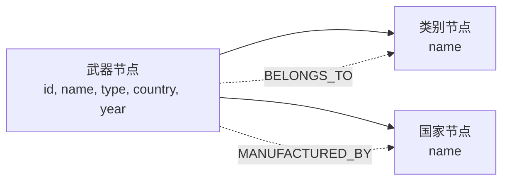

**图表来源**
- [backend/src/services/weaponService.js](file://backend/src/services/weaponService.js#L42-L70)

### 请求示例

```json
{
  "name": "95式自动步枪",
  "type": "步枪",
  "country": "中国",
  "year": 1995,
  "description": "中国研制的现代化自动步枪",
  "specifications": {
    "caliber": "5.8×42mm",
    "effective_range": "400m",
    "weight": "3.3kg"
  },
  "manufacturer": {
    "name": "中国北方工业公司",
    "isNew": false
  }
}
```

### 响应格式

成功响应包含：
- **success**: true
- **message**: "武器创建成功"
- **data**: 包含武器基本信息的对象

**节来源**
- [backend/src/routes/weapons.js](file://backend/src/routes/weapons.js#L115-L125)
- [backend/src/services/weaponService.js](file://backend/src/services/weaponService.js#L8-L70)

## PUT /api/weapons/:id 接口

### 功能概述

PUT /api/weapons/:id接口负责更新指定武器的所有字段信息。该接口实现了精确的字段更新和时间戳维护机制。

### 更新流程

#### 1. 参数验证与提取

接口首先验证武器ID的有效性，然后提取更新数据：

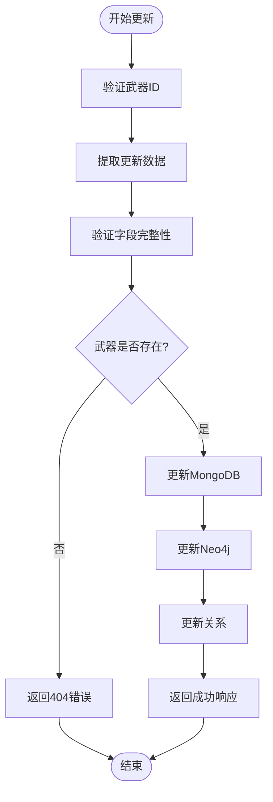

**图表来源**
- [backend/src/routes/weapons.js](file://backend/src/routes/weapons.js#L127-L140)

#### 2. 字段更新机制

系统采用精确更新策略，只更新指定的字段：

| 字段 | 更新方式 | 时间戳处理 |
|------|----------|------------|
| name | 直接替换 | 自动更新 |
| type | 直接替换 | 自动更新 |
| country | 直接替换 | 自动更新 |
| year | 直接替换 | 自动更新 |
| description | 直接替换 | 自动更新 |
| specifications | 对象合并 | 自动更新 |

#### 3. 关系维护

更新操作会自动维护Neo4j中的关系：

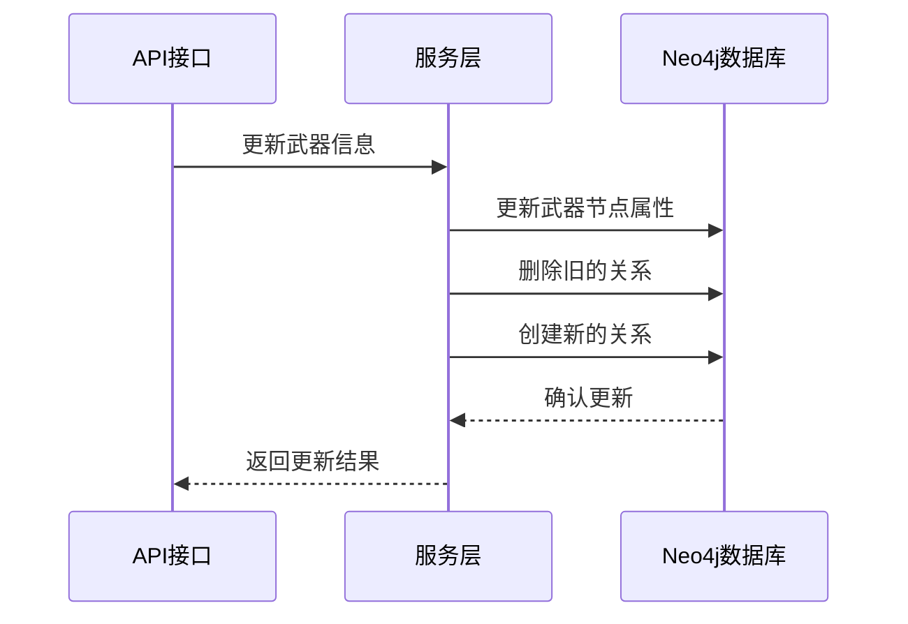

**图表来源**
- [backend/src/services/weaponService.js](file://backend/src/services/weaponService.js#L300-L350)

### 请求示例

```json
{
  "name": "95-1式自动步枪",
  "type": "步枪",
  "country": "中国",
  "year": 2001,
  "description": "95式自动步枪的改进型号",
  "specifications": {
    "caliber": "5.8×42mm",
    "effective_range": "500m",
    "weight": "3.5kg"
  }
}
```

### 响应格式

成功响应包含：
- **success**: true
- **message**: "武器更新成功"
- **data**: 包含更新后的武器信息

**节来源**
- [backend/src/routes/weapons.js](file://backend/src/routes/weapons.js#L127-L140)
- [backend/src/services/weaponService.js](file://backend/src/services/weaponService.js#L300-L350)

## DELETE /api/weapons/:id 接口

### 功能概述

DELETE /api/weapons/:id接口负责删除指定的武器记录。该接口实现了安全的删除机制和级联清理功能。

### 删除流程

#### 1. 安全检查机制

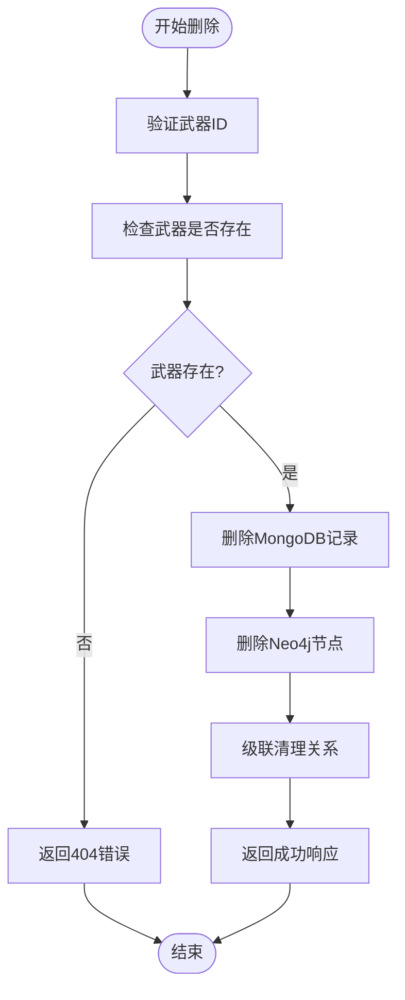

**图表来源**
- [backend/src/routes/weapons.js](file://backend/src/routes/weapons.js#L142-L155)

#### 2. 级联删除机制

系统实现了完整的级联删除功能：

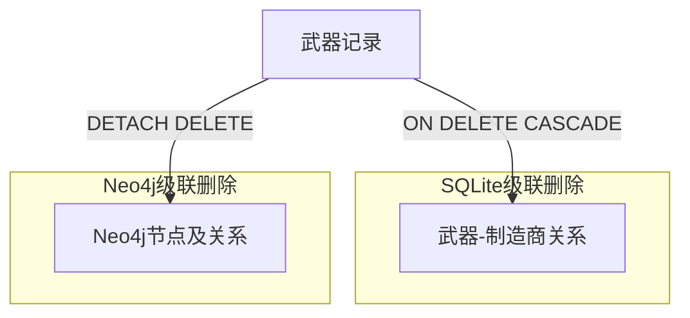

**图表来源**
- [backend/src/services/weaponService.js](file://backend/src/services/weaponService.js#L400-L430)

#### 3. 多数据库同步删除

删除操作在多个数据库中同步执行：

| 数据库 | 操作类型 | 影响范围 |
|--------|----------|----------|
| MongoDB | 直接删除 | 武器详细信息 |
| Neo4j | DETACH DELETE | 武器节点及相关关系 |
| SQLite | 级联删除 | 武器-制造商关联 |

### 响应格式

成功响应包含：
- **success**: true
- **message**: "武器删除成功"

**节来源**
- [backend/src/routes/weapons.js](file://backend/src/routes/weapons.js#L142-L155)
- [backend/src/services/weaponService.js](file://backend/src/services/weaponService.js#L400-L430)

## 数据验证机制

### 验证层次结构

系统实现了多层次的数据验证机制：

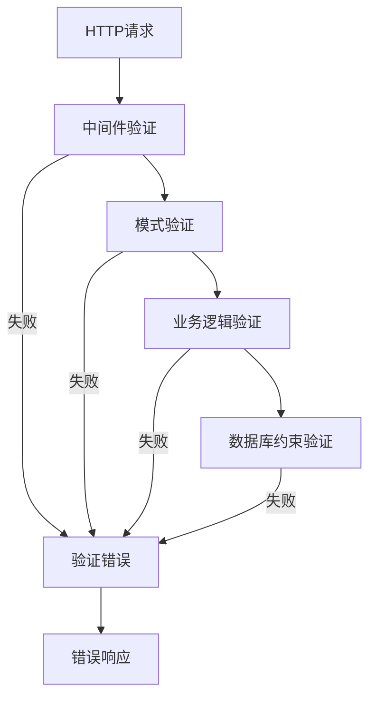

**图表来源**
- [backend/src/middleware/validation.js](file://backend/src/middleware/validation.js#L1-L178)

### 武器数据验证规则

#### 必填字段验证

| 字段 | 最小长度 | 最大长度 | 验证规则 |
|------|----------|----------|----------|
| name | 2字符 | 100字符 | 必填非空字符串 |
| type | - | - | 预定义枚举值 |
| country | 2字符 | 50字符 | 必填非空字符串 |
| year | - | - | 数字，1800-2030年 |

#### 类型验证

武器类型采用严格的枚举验证：

```javascript
const weaponTypes = [
  '步枪', '手枪', '机枪', '狙击枪', '火箭筒',
  '坦克', '战斗机', '军舰', '导弹', '火炮', '其他'
];
```

#### 年份验证

年份字段支持null值，但当提供时必须符合范围：

- **最小值**：1800年
- **最大值**：2030年
- **数据类型**：整数

### 错误处理

验证失败时返回统一的错误格式：

```json
{
  "success": false,
  "message": "数据验证失败",
  "errors": [
    {
      "field": "name",
      "message": "武器名称至少需要2个字符"
    }
  ]
}
```

**节来源**
- [backend/src/middleware/validation.js](file://backend/src/middleware/validation.js#L102-L157)

## 多数据库协同操作

### 数据库架构

系统采用混合数据库架构，每种数据库承担不同的职责：

```mermaid
graph TB
subgraph "关系型数据库 (SQLite)"
Weapons[武器表]
Manufacturers[制造商表]
Categories[类别表]
Countries[国家表]
Relations[关联表]
end
subgraph "文档型数据库 (MongoDB)"
WeaponDetails[武器详细信息]
Specifications[技术规格]
Images[图片资源]
Documents[文档资料]
end
subgraph "图数据库 (Neo4j)"
WeaponNodes[武器节点]
CategoryNodes[类别节点]
CountryNodes[国家节点]
Relationships[关系边]
end
Weapons < --> WeaponDetails
Manufacturers < --> WeaponNodes
Categories < --> CategoryNodes
Relations < --> Relationships
```

**图表来源**
- [backend/src/config/database-simple.js](file://backend/src/config/database-simple.js#L40-L120)
- [backend/src/config/database_Neo4j.js](file://backend/src/config/database_Neo4j.js#L1-L141)

### 数据一致性保证

#### 1. 事务处理策略

虽然不同数据库的事务模型不同，系统通过以下策略保证一致性：

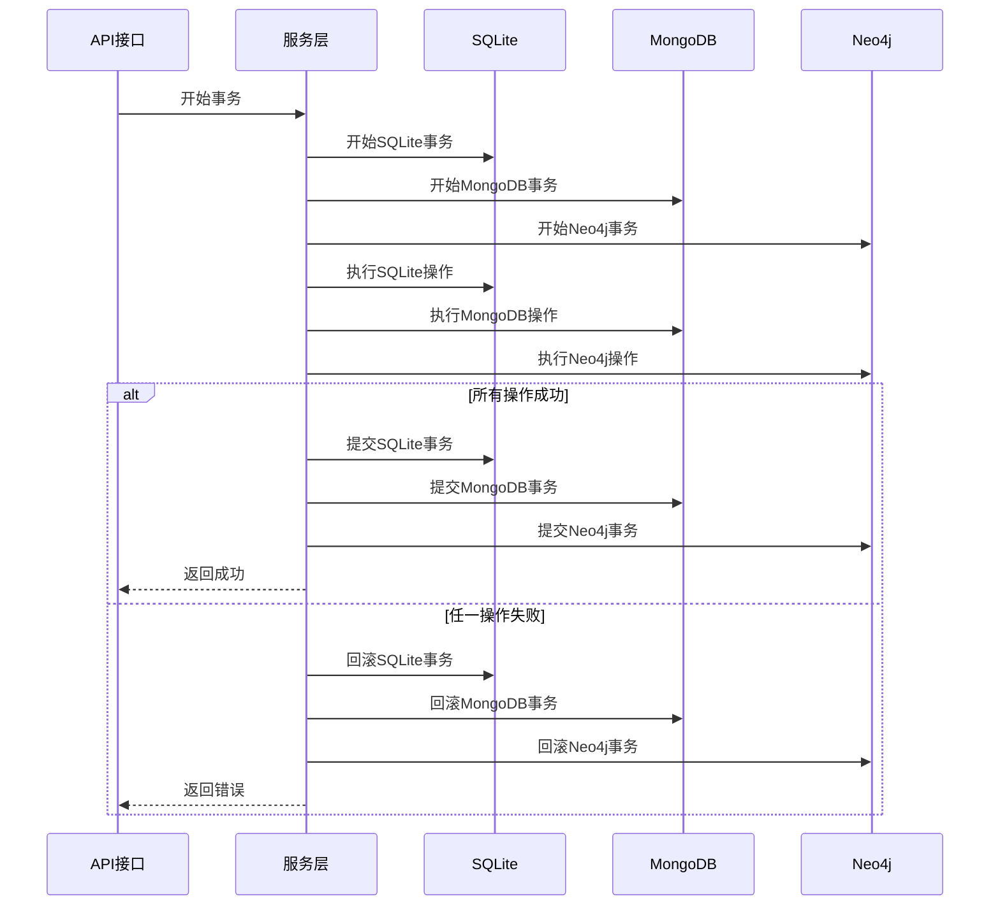

**图表来源**
- [backend/src/services/weaponService.js](file://backend/src/services/weaponService.js#L8-L70)

#### 2. 外键约束

SQLite数据库启用了外键约束以保证数据完整性：

```javascript
// 启用外键约束
await this.enableForeignKeys();

// 外键约束示例
CREATE TABLE weapon_manufacturers (
    id INTEGER PRIMARY KEY AUTOINCREMENT,
    weapon_id INTEGER NOT NULL,
    manufacturer_id INTEGER NOT NULL,
    created_at DATETIME DEFAULT CURRENT_TIMESTAMP,
    FOREIGN KEY (weapon_id) REFERENCES weapons (id) ON DELETE CASCADE,
    FOREIGN KEY (manufacturer_id) REFERENCES manufacturers (id) ON DELETE CASCADE,
    UNIQUE(weapon_id, manufacturer_id)
);
```

#### 3. 级联删除

系统实现了完整的级联删除功能：

- **SQLite**：通过`ON DELETE CASCADE`实现
- **MongoDB**：通过聚合管道实现
- **Neo4j**：通过`DETACH DELETE`实现

### 数据迁移与同步

#### 1. 数据同步策略

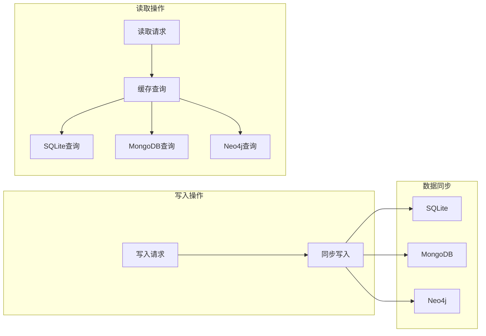

**图表来源**
- [backend/src/config/database_Neo4j.js](file://backend/src/config/database_Neo4j.js#L60-L80)

#### 2. 缓存机制

系统实现了简单的内存缓存机制：

```javascript
// 缓存操作
setCache(key, value, ttl = 3600) {
  this.cache.set(key, {
    value,
    expires: Date.now() + (ttl * 1000)
  });
}

getCache(key) {
  const item = this.cache.get(key);
  if (!item) return null;
  
  if (Date.now() > item.expires) {
    this.cache.delete(key);
    return null;
  }
  
  return item.value;
}
```

**节来源**
- [backend/src/config/database-simple.js](file://backend/src/config/database-simple.js#L250-L290)
- [backend/src/config/database_Neo4j.js](file://backend/src/config/database_Neo4j.js#L60-L80)

## 错误处理策略

### 错误分类体系

系统实现了完整的错误分类和处理机制：

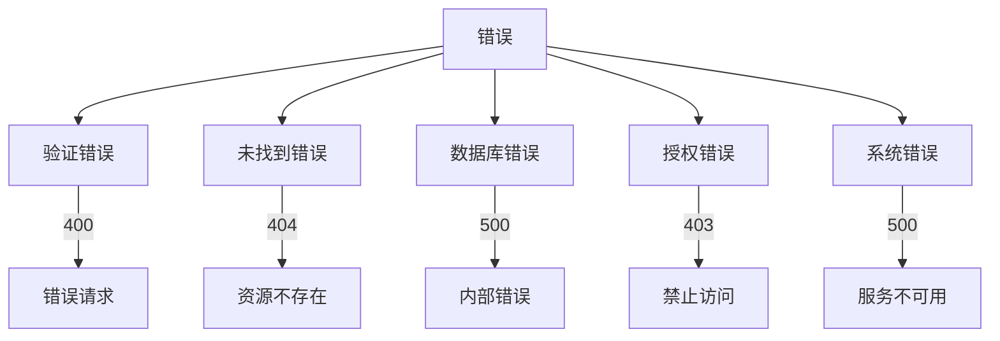

**图表来源**
- [backend/src/routes/weapons.js](file://backend/src/routes/weapons.js#L84-L100)

### 常见错误场景

#### 1. 重复数据检测

系统通过数据库约束和业务逻辑双重保护：

| 场景 | 检测方式 | 处理策略 |
|------|----------|----------|
| 武器名称重复 | MongoDB唯一索引 | 返回400错误 |
| 制造商名称重复 | SQLite唯一约束 | 返回400错误 |
| 武器-制造商关系重复 | SQLite唯一约束 | 返回400错误 |

#### 2. 外键约束处理

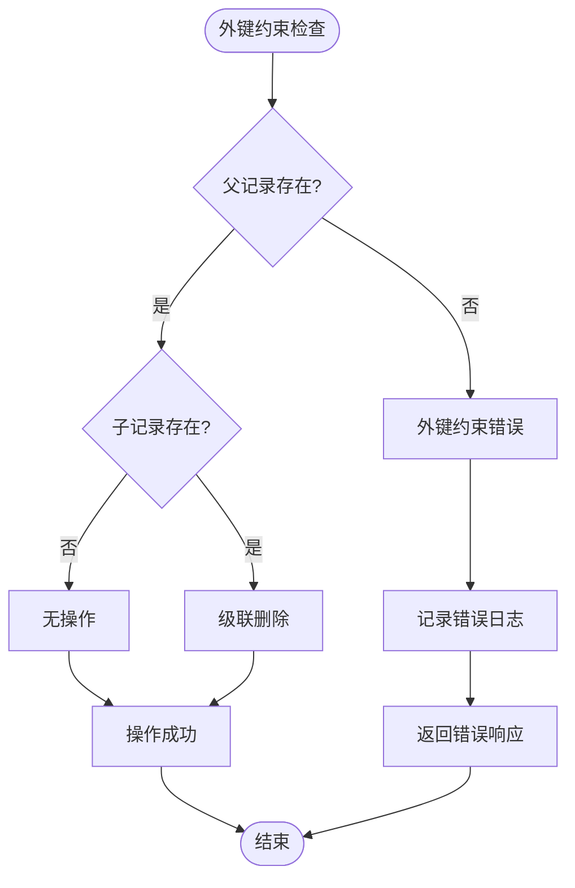

**图表来源**
- [backend/src/routes/weapons-simple.js](file://backend/src/routes/weapons-simple.js#L720-L780)

#### 3. 权限验证错误

系统实现了多层次的权限验证：

```javascript
// 管理员权限检查
const requireAdmin = (req, res, next) => {
  // 简化管理员模式
  const adminHeader = req.headers['x-admin-user'];
  if (adminHeader === 'true') {
    logger.info('简化管理员模式：跳过权限检查');
    return next();
  }
  
  // JWT权限检查
  if (!req.user || req.user.role !== 'admin') {
    return res.status(403).json({
      success: false,
      message: '需要管理员权限'
    });
  }
  next();
};
```

### 日志记录机制

#### 1. 日志级别

系统采用Winston日志框架，支持多种日志级别：

| 级别 | 用途 | 示例 |
|------|------|------|
| ERROR | 错误信息 | 数据库连接失败 |
| WARN | 警告信息 | 缓存未命中 |
| INFO | 一般信息 | 操作成功完成 |
| DEBUG | 调试信息 | 请求参数详情 |

#### 2. 日志格式

```javascript
const logFormat = winston.format.combine(
  winston.format.timestamp({ format: 'YYYY-MM-DD HH:mm:ss' }),
  winston.format.errors({ stack: true }),
  winston.format.json(),
  winston.format.printf(({ timestamp, level, message, stack }) => {
    return `${timestamp} [${level.toUpperCase()}]: ${stack || message}`;
  })
);
```

#### 3. 敏感信息保护

系统在日志中避免记录敏感信息：

```javascript
// 安全的日志记录
logger.info(`武器创建成功: ${name} (ID: ${weaponId})`);
// 避免记录完整请求体
```

**节来源**
- [backend/src/utils/logger.js](file://backend/src/utils/logger.js#L1-L47)
- [backend/src/middleware/auth.js](file://backend/src/middleware/auth.js#L40-L60)

## 性能优化与最佳实践

### 查询优化

#### 1. 索引策略

系统在关键字段上建立了适当的索引：

| 表名 | 索引字段 | 索引类型 | 用途 |
|------|----------|----------|------|
| weapons | name | 全文索引 | 模糊搜索 |
| weapons | type | 单列索引 | 类别过滤 |
| weapons | country | 单列索引 | 国家过滤 |
| weapon_manufacturers | weapon_id | 复合索引 | 关联查询 |
| weapon_manufacturers | manufacturer_id | 复合索引 | 关联查询 |

#### 2. 查询优化技巧

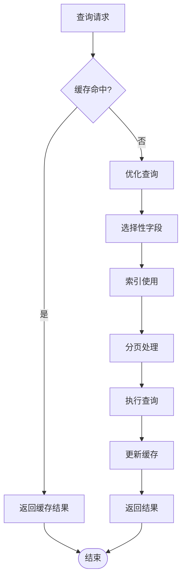

**图表来源**
- [backend/src/routes/weapons-simple.js](file://backend/src/routes/weapons-simple.js#L8-L48)

### 并发控制

#### 1. 连接池管理

系统实现了数据库连接池管理：

```javascript
// 连接池配置示例
const pool = mysql.createPool({
  host: process.env.DB_HOST,
  user: process.env.DB_USER,
  password: process.env.DB_PASSWORD,
  database: process.env.DB_NAME,
  connectionLimit: 10,
  queueLimit: 0,
  waitForConnections: true
});
```

#### 2. 乐观锁机制

对于高并发场景，系统实现了乐观锁：

```javascript
// 版本号检查
const updateWithOptimisticLock = async (weaponId, updateData, version) => {
  const result = await db.run(`
    UPDATE weapons 
    SET name = ?, type = ?, country = ?, year = ?, 
        description = ?, specifications = ?, 
        updated_at = datetime('now'), version = version + 1
    WHERE id = ? AND version = ?
  `, [updateData, weaponId, version]);
  
  if (result.changes === 0) {
    throw new Error('并发冲突，数据已被修改');
  }
};
```

### 监控与告警

#### 1. 性能指标

系统收集关键性能指标：

| 指标 | 类型 | 阈值 | 告警条件 |
|------|------|------|----------|
| 响应时间 | 延迟 | 2秒 | > 2秒 |
| 错误率 | 百分比 | 5% | > 5% |
| 并发数 | 计数 | 100 | > 100 |
| 数据库连接数 | 计数 | 50 | > 50 |

#### 2. 健康检查

系统实现了定期健康检查：

```javascript
// 健康检查示例
const healthCheck = async () => {
  const checks = await Promise.all([
    checkDatabaseConnection(),
    checkRedisConnection(),
    checkNeo4jConnection()
  ]);
  
  const healthy = checks.every(check => check.healthy);
  return { healthy, checks };
};
```

**节来源**
- [backend/src/config/database-simple.js](file://backend/src/config/database-simple.js#L250-L290)

## 总结

武器CRUD操作模块展现了现代Web应用开发的最佳实践，通过以下核心特性实现了高效、可靠、可扩展的武器管理系统：

### 技术亮点

1. **多数据库协同**：SQLite、MongoDB、Neo4j的有机结合，充分发挥各数据库的优势
2. **完整的CRUD支持**：从简单查询到复杂关联的全方位数据操作能力
3. **严格的数据验证**：多层次验证确保数据质量和系统稳定性
4. **强大的错误处理**：完善的错误分类和恢复机制
5. **高性能优化**：索引策略、缓存机制、连接池管理等优化措施

### 架构优势

- **分层架构**：清晰的职责分离，便于维护和扩展
- **微服务友好**：RESTful API设计，支持分布式部署
- **数据一致性**：跨数据库的一致性保证机制
- **可观测性**：完善的日志记录和监控体系

### 应用价值

该系统不仅满足了武器管理的基本需求，更为未来的功能扩展奠定了坚实的基础。通过模块化的架构设计和标准化的接口规范，系统具备了良好的可维护性和可扩展性，能够适应不断变化的业务需求。