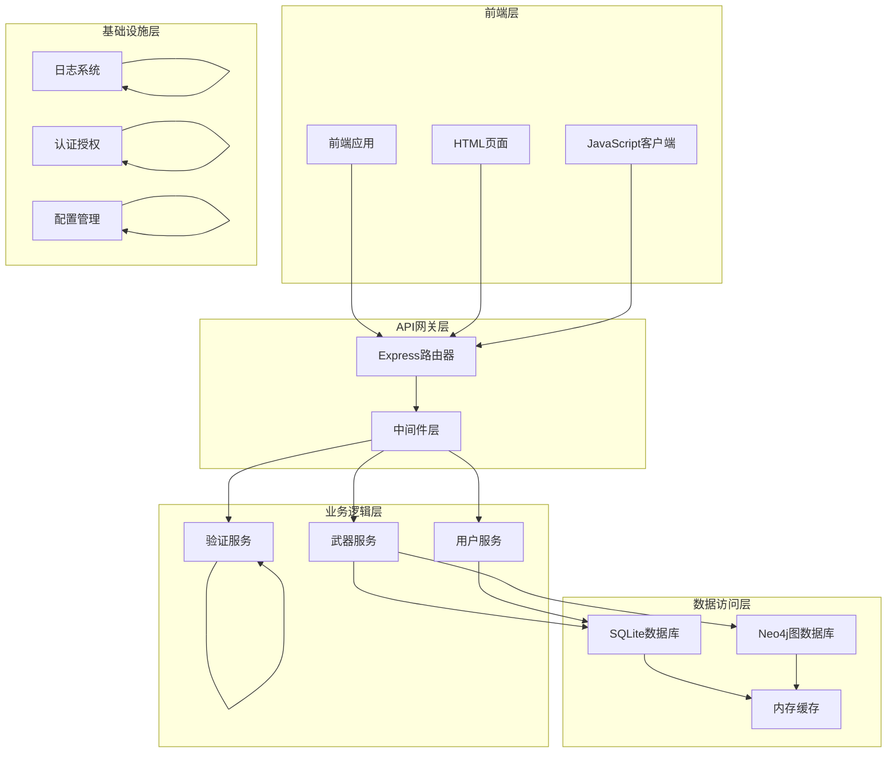
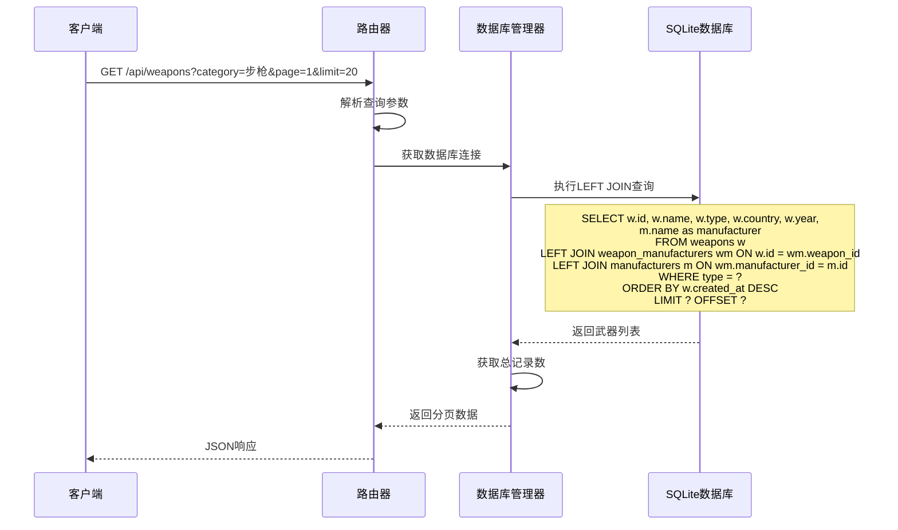
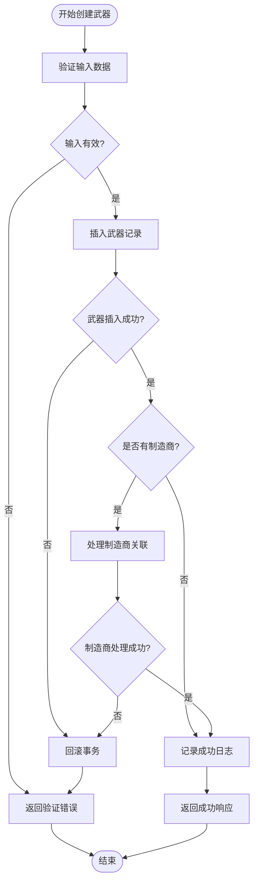
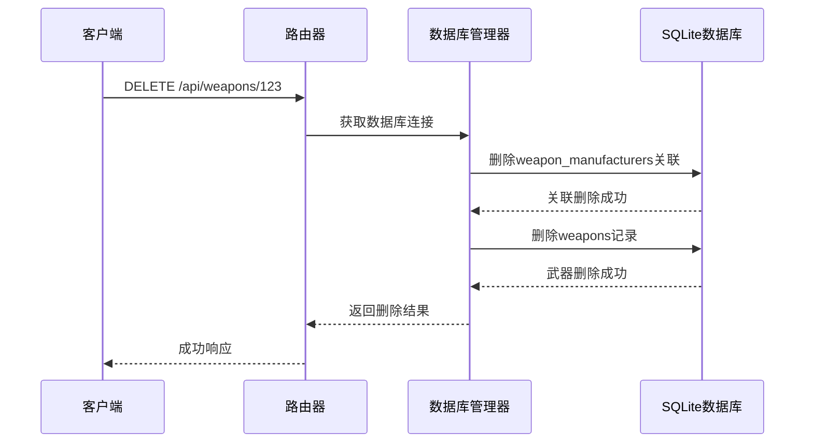
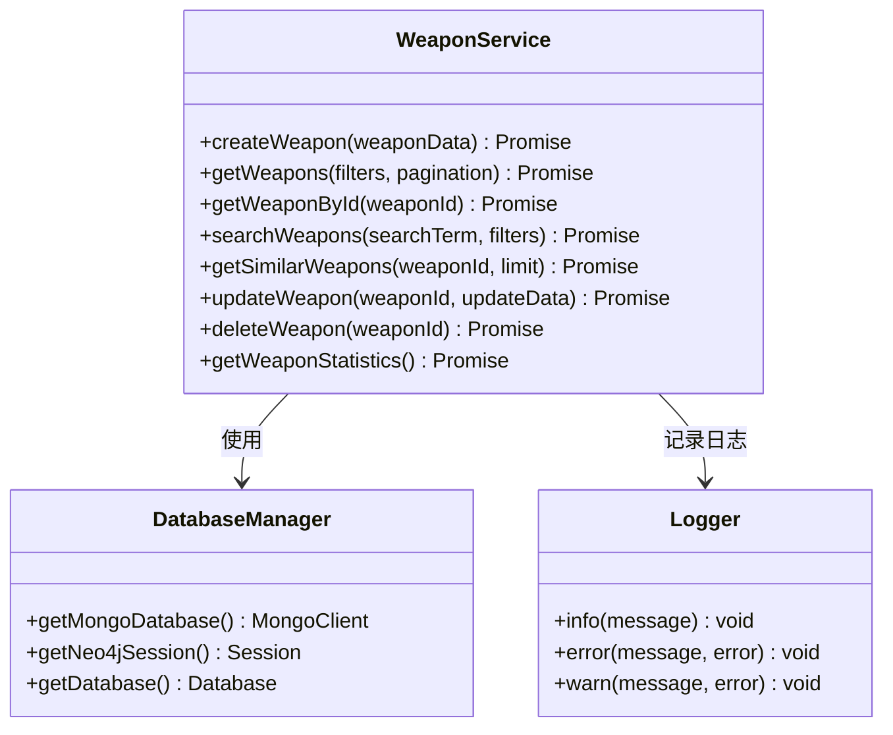
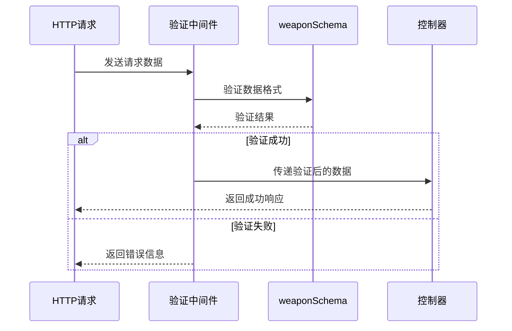
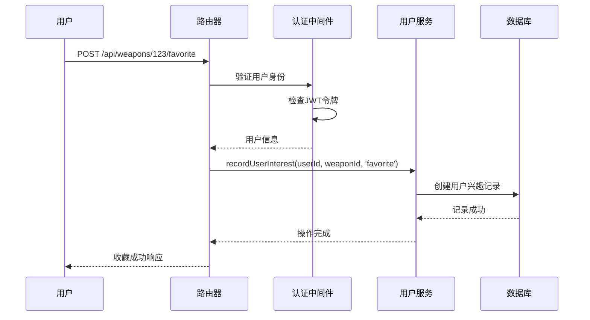
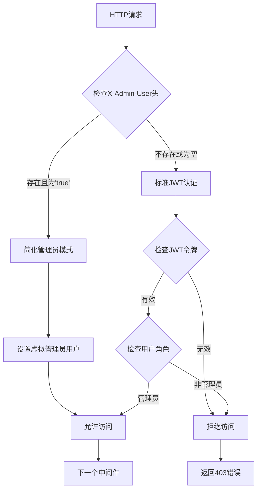
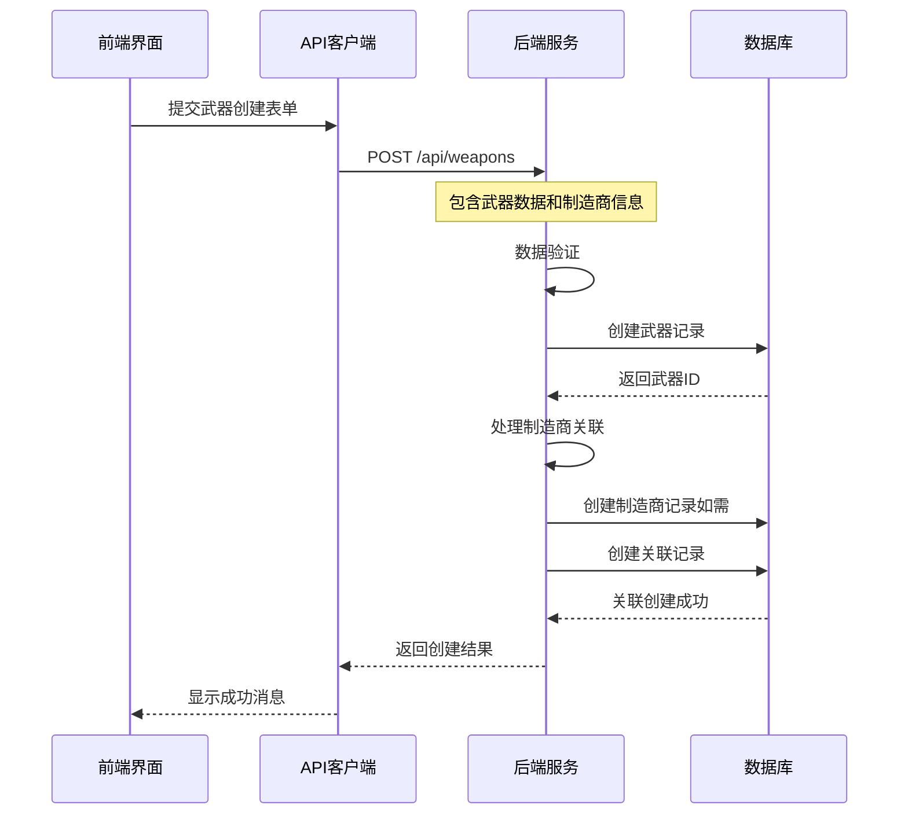
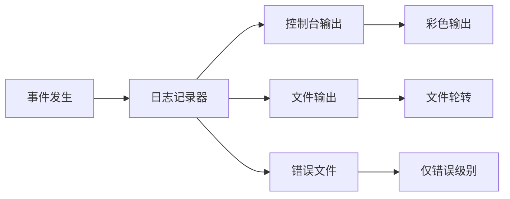

# 武器全生命周期管理功能文档

<cite>
**本文档中引用的文件**
- [weapons-simple.js](file://backend/src/routes/weapons-simple.js)
- [weaponService.js](file://backend/src/services/weaponService.js)
- [auth.js](file://backend/src/middleware/auth.js)
- [validation.js](file://backend/src/middleware/validation.js)
- [database-simple.js](file://backend/src/config/database-simple.js)
- [logger.js](file://backend/src/utils/logger.js)
- [test-frontend-backend-connection.html](file://test_pages/test-frontend-backend-connection.html)
</cite>

## 目录
1. [项目概述](#项目概述)
2. [系统架构](#系统架构)
3. [核心CRUD操作](#核心crud操作)
4. [业务逻辑层分析](#业务逻辑层分析)
5. [数据验证与安全](#数据验证与安全)
6. [用户收藏功能](#用户收藏功能)
7. [管理员权限控制](#管理员权限控制)
8. [前后端数据协同](#前后端数据协同)
9. [性能优化与最佳实践](#性能优化与最佳实践)
10. [故障排除指南](#故障排除指南)

## 项目概述

兵智世界武器管理系统是一个基于现代Web技术栈构建的武器全生命周期管理平台。系统采用前后端分离架构，后端使用Node.js + Express框架，数据库采用SQLite作为主存储，同时集成了Neo4j图数据库用于复杂关系查询。

### 核心功能特性

- **武器CRUD操作**：完整的武器生命周期管理，包括创建、查询、更新、删除
- **制造商关联**：支持武器与制造商的一对多关系管理
- **分页查询**：高效的数据分页显示机制
- **搜索功能**：全文搜索和高级筛选
- **用户收藏**：基于用户兴趣的个性化功能
- **权限控制**：细粒度的管理员权限管理
- **数据统计**：武器类型、制造商等多维度统计分析

## 系统架构



**图表来源**
- [weapons-simple.js](file://backend/src/routes/weapons-simple.js#L1-L50)
- [weaponService.js](file://backend/src/services/weaponService.js#L1-L50)
- [database-simple.js](file://backend/src/config/database-simple.js#L1-L100)

## 核心CRUD操作

### GET /api/weapons - 分页查询与LEFT JOIN制造商关联查询

系统实现了高效的武器列表查询功能，支持多种筛选条件和分页机制。

#### 查询实现机制



**图表来源**
- [weapons-simple.js](file://backend/src/routes/weapons-simple.js#L10-L50)

#### 关键特性

1. **动态查询条件构建**：根据传入的category和country参数动态构建WHERE子句
2. **LEFT JOIN关联查询**：确保即使没有制造商关联也能返回武器数据
3. **分页机制**：支持自定义页码和每页数量
4. **时间排序**：默认按创建时间降序排列
5. **数据转换**：将数据库结果转换为标准化的JSON格式

**章节来源**
- [weapons-simple.js](file://backend/src/routes/weapons-simple.js#L10-L50)

### POST /api/weapons - 武器创建与制造商关联处理

武器创建功能包含了复杂的业务逻辑，特别是制造商关联的处理。

#### 创建流程分析



**图表来源**
- [weapons-simple.js](file://backend/src/routes/weapons-simple.js#L350-L420)

#### handleManufacturerAssociation函数详解

该函数是武器创建过程中的关键组件，负责处理制造商的创建或关联逻辑。

##### 制造商处理策略

1. **新建制造商模式**：
   - 检查manufacturerData.isNew标志
   - 创建新的制造商记录
   - 返回新制造商ID

2. **现有制造商模式**：
   - 查询现有制造商
   - 验证制造商存在性
   - 返回现有制造商ID

3. **关联创建**：
   - 创建武器-制造商关联记录
   - 使用INSERT OR IGNORE防止重复关联

**章节来源**
- [weapons-simple.js](file://backend/src/routes/weapons-simple.js#L350-L420)
- [weapons-simple.js](file://backend/src/routes/weapons-simple.js#L750-L820)

### PUT /api/weapons/:id - 字段更新与时间戳维护

武器更新功能提供了精确的字段级更新能力，同时自动维护时间戳信息。

#### 更新机制特点

- **部分更新支持**：只更新指定的字段，保持其他字段不变
- **时间戳自动维护**：自动更新updated_at字段
- **JSON字段处理**：正确处理specifications等JSON格式字段
- **变更检测**：检查实际修改的记录数量

**章节来源**
- [weapons-simple.js](file://backend/src/routes/weapons-simple.js#L422-L470)

### DELETE /api/weapons/:id - 级联删除武器-制造商关系

系统实现了完整的级联删除机制，确保数据一致性。

#### 删除流程



**图表来源**
- [weapons-simple.js](file://backend/src/routes/weapons-simple.js#L472-L500)

**章节来源**
- [weapons-simple.js](file://backend/src/routes/weapons-simple.js#L472-L500)

## 业务逻辑层分析

### weaponService.js - 业务逻辑封装

weaponService.js提供了更高层次的业务逻辑抽象，封装了武器相关的复杂操作。

#### 核心业务方法



**图表来源**
- [weaponService.js](file://backend/src/services/weaponService.js#L4-L50)

#### 数据持久化策略

系统采用了混合存储架构：

1. **MongoDB存储**：用于武器详细信息和非结构化数据
2. **Neo4j存储**：用于武器实体关系和复杂查询
3. **SQLite存储**：用于传统关系数据和历史记录

**章节来源**
- [weaponService.js](file://backend/src/services/weaponService.js#L1-L100)

## 数据验证与安全

### weaponSchema - 输入验证规则

系统实现了严格的输入验证机制，确保数据质量和安全性。

#### 验证规则详解

| 字段 | 验证规则 | 错误消息 |
|------|----------|----------|
| name | 字符串，2-100字符，必填 | 武器名称至少需要2个字符 |
| type | 预定义枚举值，必填 | 武器类型必须是预定义的类型之一 |
| country | 字符串，2-50字符，必填 | 制造国家至少需要2个字符 |
| year | 数字，1800-2030年，可选 | 年份不能早于1800年 |
| description | 字符串，最大1000字符，可选 | 描述不能超过1000个字符 |
| specifications | 对象格式，可选 | 技术规格必须是对象格式 |

#### 验证中间件实现



**图表来源**
- [validation.js](file://backend/src/middleware/validation.js#L5-L25)

**章节来源**
- [validation.js](file://backend/src/middleware/validation.js#L70-L160)

## 用户收藏功能

### /api/weapons/:id/favorite - 收藏机制实现

用户收藏功能提供了个性化的武器关注机制，支持用户标记感兴趣的武器。

#### 收藏流程设计



**图表来源**
- [weapons-simple.js](file://backend/src/routes/weapons-simple.js#L502-L520)

#### 用户兴趣记录机制

系统通过两种方式实现用户兴趣记录：

1. **Neo4j图数据库**：建立用户-武器的直接关系
2. **SQLite关系表**：维护传统的用户-武器兴趣记录

**章节来源**
- [weapons-simple.js](file://backend/src/routes/weapons-simple.js#L502-L520)

## 管理员权限控制

### requireAdmin中间件 - 权限验证

系统实现了细粒度的管理员权限控制机制，支持简化管理员模式和标准JWT认证。

#### 权限控制流程



**图表来源**
- [auth.js](file://backend/src/middleware/auth.js#L40-L60)

#### 安全考虑

1. **双重认证机制**：支持简化管理员模式和标准JWT认证
2. **令牌验证**：使用JWT进行无状态认证
3. **角色检查**：严格的角色权限验证
4. **日志记录**：记录所有权限相关操作

**章节来源**
- [auth.js](file://backend/src/middleware/auth.js#L40-L70)

## 前后端数据协同

### 完整流程示例：添加新型武器并设置制造商

以下展示了从前端到后端的完整数据协同工作流程。

#### 前端实现示例



**图表来源**
- [test-frontend-backend-connection.html](file://test_pages/test-frontend-backend-connection.html#L400-L450)

#### 数据传输格式

系统采用标准化的JSON格式进行前后端数据交换：

**请求格式示例**：
```json
{
  "name": "新型突击步枪",
  "type": "步枪",
  "country": "中国",
  "year": 2024,
  "description": "最新研发的模块化突击步枪",
  "specifications": {
    "caliber": "5.8×42mm",
    "effective_range": "500m",
    "weight": "3.2kg"
  },
  "manufacturer": {
    "name": "中国北方工业公司",
    "isNew": false
  }
}
```

**响应格式示例**：
```json
{
  "success": true,
  "message": "武器创建成功",
  "data": {
    "id": "123",
    "name": "新型突击步枪",
    "type": "步枪",
    "country": "中国",
    "year": 2024,
    "description": "最新研发的模块化突击步枪",
    "manufacturer": "中国北方工业公司"
  }
}
```

**章节来源**
- [test-frontend-backend-connection.html](file://test_pages/test-frontend-backend-connection.html#L400-L500)

## 性能优化与最佳实践

### 数据库优化策略

1. **索引优化**：在weapons表的关键字段上建立了适当的索引
2. **连接池管理**：使用连接池提高数据库访问效率
3. **查询优化**：采用LEFT JOIN减少查询次数
4. **缓存机制**：实现了简单的内存缓存替代Redis

### 日志记录最佳实践

系统实现了结构化的日志记录机制：



**图表来源**
- [logger.js](file://backend/src/utils/logger.js#L15-L40)

### 错误处理策略

1. **统一错误响应格式**：所有API错误都返回标准化的JSON格式
2. **错误分类**：区分客户端错误（4xx）和服务端错误（5xx）
3. **日志记录**：所有错误都会记录到日志系统
4. **优雅降级**：在部分功能失效时提供基本服务

**章节来源**
- [logger.js](file://backend/src/utils/logger.js#L1-L47)

## 故障排除指南

### 常见问题及解决方案

#### 1. 数据库连接问题

**症状**：API请求返回500错误，数据库连接失败
**解决方案**：
- 检查数据库文件路径是否正确
- 验证数据库文件权限
- 确认SQLite扩展已正确安装

#### 2. 权限验证失败

**症状**：管理员操作返回403错误
**解决方案**：
- 检查JWT令牌有效性
- 验证用户角色设置
- 确认简化管理员模式配置

#### 3. 制造商关联失败

**症状**：武器创建成功但制造商关联丢失
**解决方案**：
- 检查制造商名称匹配
- 验证外键约束设置
- 确认数据库事务完整性

#### 4. 性能问题

**症状**：查询响应时间过长
**解决方案**：
- 优化查询语句
- 添加适当的索引
- 考虑启用查询缓存

### 调试工具和技巧

1. **日志分析**：查看应用日志和错误日志
2. **网络监控**：使用浏览器开发者工具检查API调用
3. **数据库调试**：启用SQLite的SQL跟踪功能
4. **性能分析**：使用Node.js内置的性能分析工具

**章节来源**
- [database-simple.js](file://backend/src/config/database-simple.js#L20-L50)
- [logger.js](file://backend/src/utils/logger.js#L20-L47)

## 结论

兵智世界的武器全生命周期管理系统展现了现代Web应用开发的最佳实践。通过合理的架构设计、严格的安全控制、完善的错误处理和优秀的用户体验，系统能够高效地管理复杂的武器数据和用户交互。

系统的主要优势包括：

1. **模块化设计**：清晰的分层架构便于维护和扩展
2. **数据一致性**：多重数据库保证数据完整性和可靠性
3. **安全性**：多层次的安全防护机制
4. **可扩展性**：灵活的插件式架构支持功能扩展
5. **易用性**：直观的API设计和丰富的前端交互

未来可以考虑的改进方向：
- 引入更高级的缓存机制
- 实现更精细的权限控制
- 增强数据分析和可视化功能
- 优化移动端用户体验