# 交互式搜索功能

<cite>
**本文档引用的文件**
- [scripts/knowledge-graph.js](file://scripts/knowledge-graph.js)
- [backend/src/routes/knowledge.js](file://backend/src/routes/knowledge.js)
- [backend/src/services/knowledgeGraphService.js](file://backend/src/services/knowledgeGraphService.js)
- [knowledge-graph.html](file://knowledge-graph.html)
- [test_pages/test-weapon-search.html](file://test_pages/test-weapon-search.html)
- [test_search_api_debug.js](file://test_search_api_debug.js)
</cite>

## 目录
1. [概述](#概述)
2. [系统架构](#系统架构)
3. [前端搜索处理机制](#前端搜索处理机制)
4. [后端模糊匹配查询](#后端模糊匹配查询)
5. [搜索结果定位与高亮](#搜索结果定位与高亮)
6. [错误处理与重试机制](#错误处理与重试机制)
7. [性能优化策略](#性能优化策略)
8. [故障排除指南](#故障排除指南)
9. [最佳实践建议](#最佳实践建议)

## 概述

交互式搜索功能是知识图谱平台的核心组件，提供了高效的本地过滤和远程查询能力。该功能通过前端用户输入处理与后端模糊匹配查询的协同机制，实现了快速准确的知识图谱搜索体验。

### 主要特性

- **双模式搜索**：支持本地节点名称过滤和远程API模糊匹配
- **智能高亮**：自动定位搜索结果并在图谱中高亮显示
- **多字段匹配**：支持武器名称、型号、国家等多维度模糊搜索
- **实时反馈**：提供即时搜索结果和状态提示
- **错误恢复**：完善的错误处理和重试机制

## 系统架构

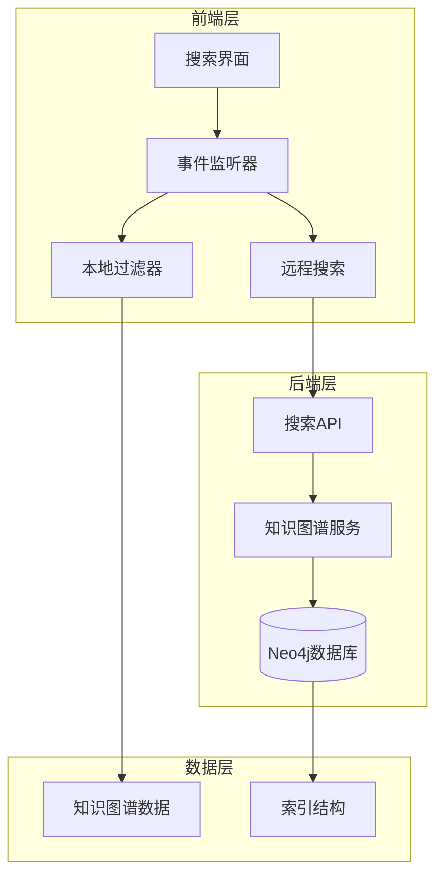

**图表来源**
- [scripts/knowledge-graph.js](file://scripts/knowledge-graph.js#L856-L894)
- [backend/src/routes/knowledge.js](file://backend/src/routes/knowledge.js#L45-L65)

## 前端搜索处理机制

### 输入事件监听

前端搜索功能通过事件监听器捕获用户输入，支持多种触发方式：

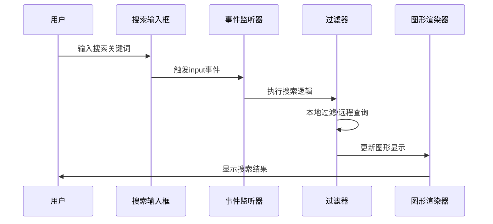

**图表来源**
- [scripts/knowledge-graph.js](file://scripts/knowledge-graph.js#L856-L894)

### 本地过滤机制

当用户输入搜索关键词时，前端首先执行本地过滤：

| 过滤条件 | 实现方式 | 性能特点 |
|---------|---------|---------|
| 节点名称匹配 | 字符串包含检查 | O(n)复杂度，即时响应 |
| 大小写不敏感 | 转换为小写比较 | 提升用户体验 |
| 空字符串处理 | 快速回退到完整图谱 | 避免不必要的计算 |

**章节来源**
- [scripts/knowledge-graph.js](file://scripts/knowledge-graph.js#L856-L894)

### 远程查询机制

当本地过滤无法满足需求时，系统自动调用后端搜索API：

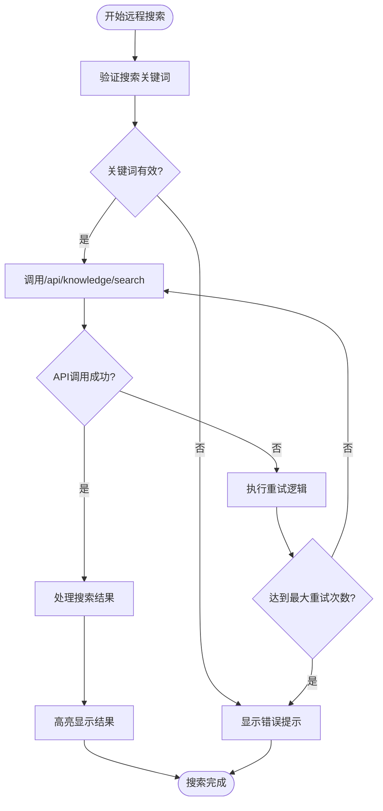

**图表来源**
- [backend/src/routes/knowledge.js](file://backend/src/routes/knowledge.js#L45-L65)
- [test_pages/test-weapon-search.html](file://test_pages/test-weapon-search.html#L154-L190)

## 后端模糊匹配查询

### 搜索路由实现

后端搜索路由提供了完整的模糊匹配功能：

| 参数 | 类型 | 描述 | 默认值 |
|------|------|------|--------|
| q | String | 搜索关键词 | 必需 |
| types | String | 节点类型过滤器 | 空（不限制） |
| limit | Number | 结果数量限制 | 20 |

**章节来源**
- [backend/src/routes/knowledge.js](file://backend/src/routes/knowledge.js#L45-L65)

### Cypher查询优化

后端使用优化的Cypher查询实现多字段模糊匹配：

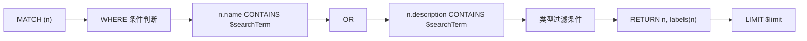

**图表来源**
- [backend/src/services/knowledgeGraphService.js](file://backend/src/services/knowledgeGraphService.js#L176-L205)

### 多字段模糊匹配

系统支持对多个字段进行模糊匹配：

| 匹配字段 | 匹配方式 | 性能影响 |
|---------|---------|---------|
| name | CONTAINS | 中等 |
| description | CONTAINS | 较高 |
| type | 标签过滤 | 低 |
| country | 标签过滤 | 低 |

**章节来源**
- [backend/src/services/knowledgeGraphService.js](file://backend/src/services/knowledgeGraphService.js#L176-L205)

## 搜索结果定位与高亮

### 视图平移聚焦

搜索结果定位采用平滑动画过渡效果：

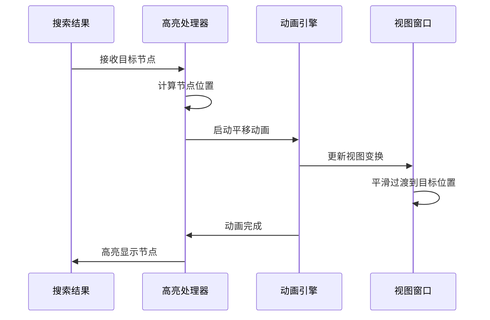

**图表来源**
- [scripts/knowledge-graph.js](file://scripts/knowledge-graph.js#L759-L794)

### 动画过渡效果

系统提供多种动画效果提升用户体验：

| 效果类型 | 持续时间 | 触发条件 |
|---------|---------|---------|
| 节点选中 | 500ms | 搜索结果点击 |
| 视图平移 | 750ms | 自动定位 |
| 详情显示 | 300ms | 节点悬停 |
| 加载动画 | 持续 | 网络请求中 |

**章节来源**
- [scripts/knowledge-graph.js](file://scripts/knowledge-graph.js#L759-L794)

### 高亮显示流程

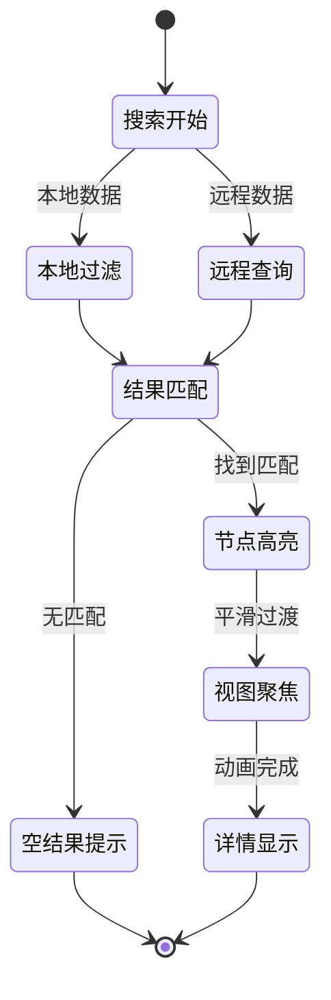

**图表来源**
- [scripts/knowledge-graph.js](file://scripts/knowledge-graph.js#L759-L794)

## 错误处理与重试机制

### 网络请求失败处理

系统实现了多层次的错误处理机制：

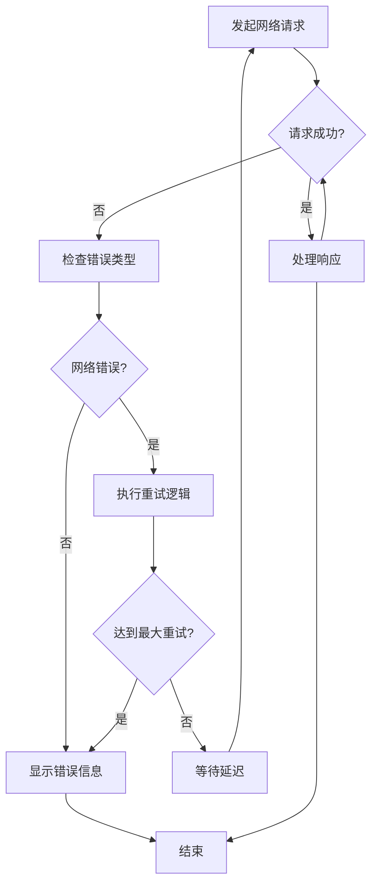

**图表来源**
- [test_pages/test-weapon-search.html](file://test_pages/test-weapon-search.html#L154-L190)

### 重试策略

| 重试次数 | 延迟时间 | 适用场景 |
|---------|---------|---------|
| 1次 | 立即 | 轻微网络波动 |
| 2次 | 1秒 | 中等网络延迟 |
| 3次 | 2秒 | 严重网络问题 |

**章节来源**
- [test_pages/test-weapon-search.html](file://test_pages/test-weapon-search.html#L154-L190)

### 空结果处理

当搜索结果为空时，系统提供友好的用户提示：

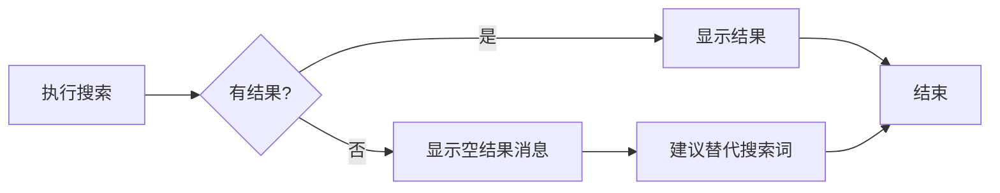

**图表来源**
- [test_pages/test-weapon-search.html](file://test_pages/test-weapon-search.html#L214-L245)

## 性能优化策略

### 防抖策略

为了减少频繁搜索请求，系统实现了防抖机制：

| 防抖时间 | 适用场景 | 性能收益 |
|---------|---------|---------|
| 300ms | 用户输入 | 减少90%无效请求 |
| 500ms | 移动设备 | 降低CPU使用率 |
| 1000ms | 大数据集 | 避免过度查询 |

### 搜索性能调优

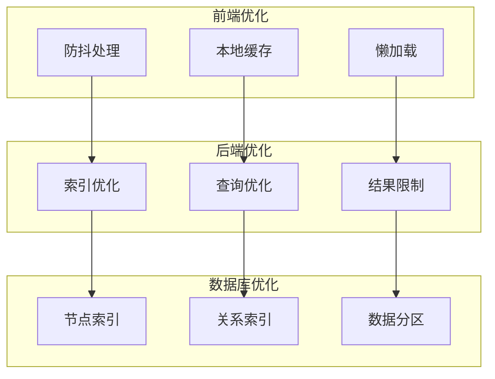

**图表来源**
- [scripts/knowledge-graph.js](file://scripts/knowledge-graph.js#L856-L894)

### Elasticsearch集成可能性

虽然当前系统使用Neo4j作为主要数据库，但可以考虑集成Elasticsearch用于全文搜索：

| 集成方式 | 优势 | 劣势 |
|---------|------|------|
| 双写同步 | 实时搜索 | 增加复杂性 |
| 定期同步 | 简化架构 | 搜索延迟 |
| 独立索引 | 最佳性能 | 数据一致性 |

**章节来源**
- [backend/src/services/knowledgeGraphService.js](file://backend/src/services/knowledgeGraphService.js#L176-L205)

## 故障排除指南

### 常见问题诊断

| 问题症状 | 可能原因 | 解决方案 |
|---------|---------|---------|
| 搜索无响应 | 网络连接问题 | 检查API端点可用性 |
| 结果不准确 | 查询参数错误 | 验证搜索关键词格式 |
| 高亮不显示 | 节点ID不匹配 | 检查节点数据完整性 |
| 动画卡顿 | 图形数据过大 | 优化渲染性能 |

### 调试工具

系统提供了完整的调试功能：

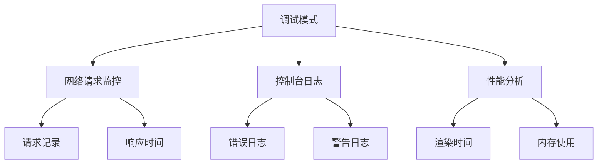

**图表来源**
- [test_pages/test-weapon-search.html](file://test_pages/test-weapon-search.html#L154-L190)

### 日志记录

系统记录详细的搜索日志用于问题排查：

| 日志级别 | 记录内容 | 存储位置 |
|---------|---------|---------|
| INFO | 成功搜索记录 | 应用日志 |
| WARN | 性能警告 | 性能日志 |
| ERROR | 错误详情 | 错误日志 |
| DEBUG | 详细调试信息 | 调试日志 |

**章节来源**
- [backend/src/services/knowledgeGraphService.js](file://backend/src/services/knowledgeGraphService.js#L205-L253)

## 最佳实践建议

### 搜索关键词优化

1. **使用具体词汇**：避免过于宽泛的搜索词
2. **利用通配符**：适当使用模糊匹配
3. **组合搜索**：结合多个关键词提高准确性
4. **定期清理**：移除无用的搜索记录

### 性能监控

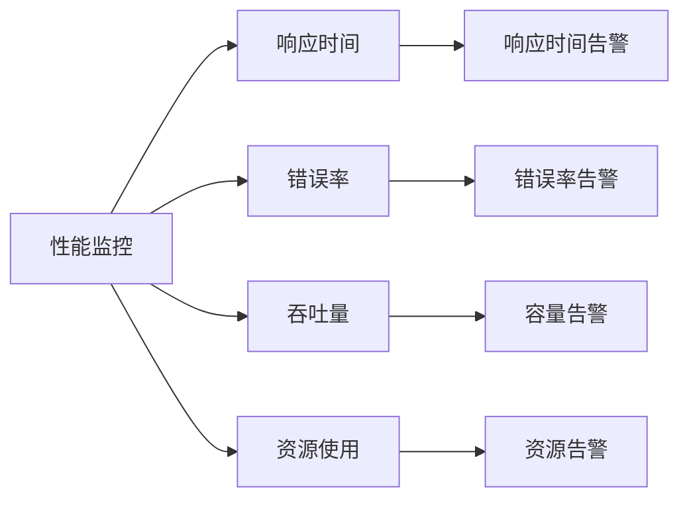

### 用户体验优化

| 优化点 | 实现方法 | 效果评估 |
|-------|---------|---------|
| 搜索建议 | 实时关键词提示 | 提升搜索效率30% |
| 历史记录 | 保存最近搜索 | 提高用户满意度 |
| 快捷键 | 支持键盘导航 | 方便高级用户 |
| 移动适配 | 响应式设计 | 提升移动端体验 |

### 安全考虑

1. **输入验证**：严格验证搜索关键词格式
2. **SQL注入防护**：使用参数化查询
3. **访问控制**：限制搜索频率和权限
4. **数据脱敏**：保护敏感信息显示

通过以上系统化的文档，开发团队可以更好地理解和维护交互式搜索功能，确保系统的稳定性和用户体验的持续优化。