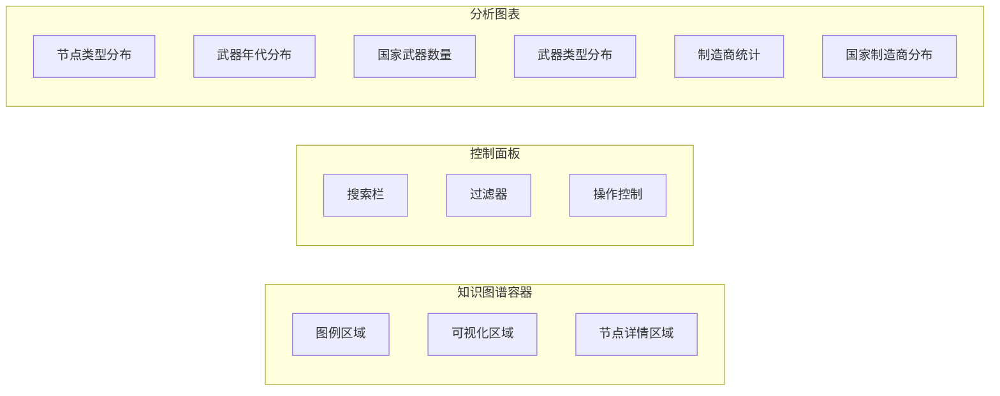
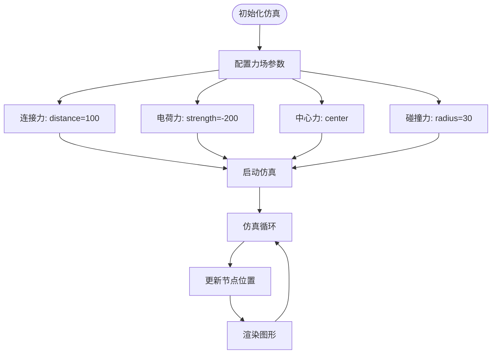
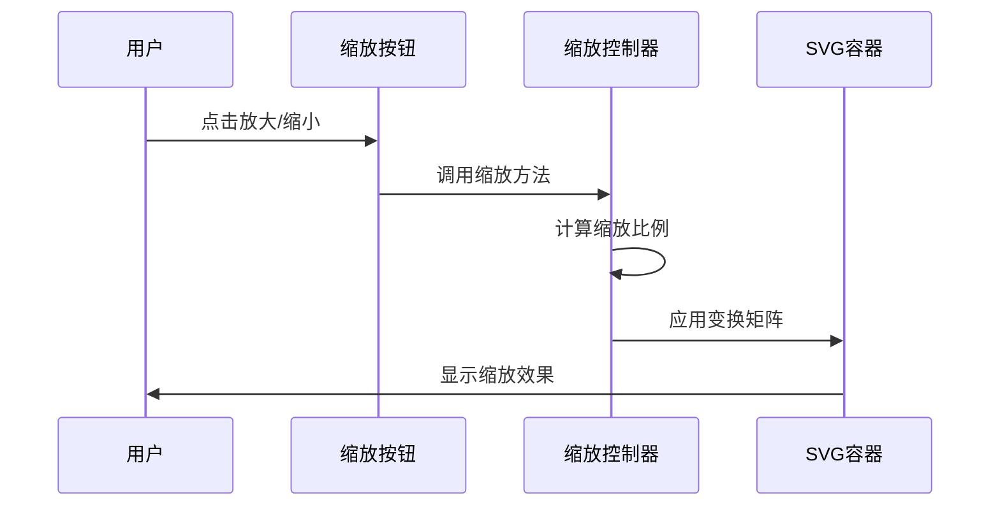
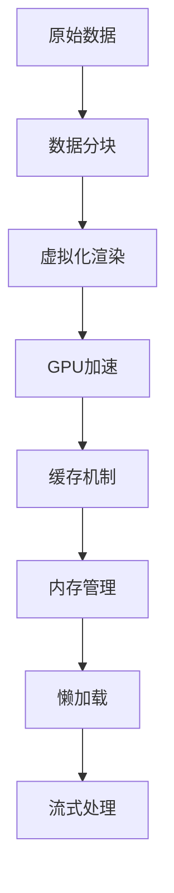
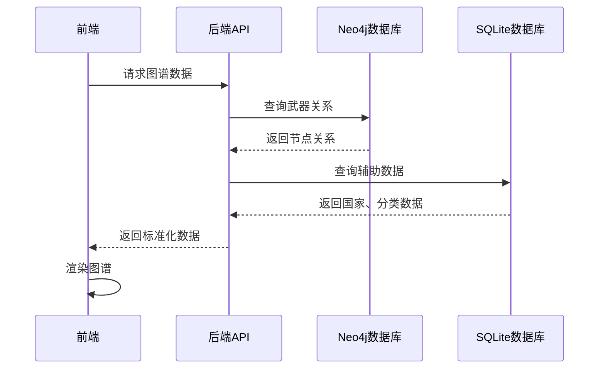
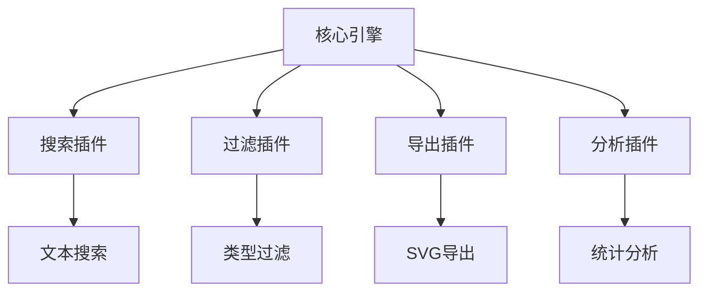

# 可视化渲染引擎

<cite>
**本文档引用的文件**
- [knowledge-graph.html](file://knowledge-graph.html)
- [knowledge-graph.js](file://knowledge-graph.js)
- [styles/knowledge-graph.css](file://styles/knowledge-graph.css)
- [backend/src/routes/knowledge-graph.js](file://backend/src/routes/knowledge-graph.js)
- [backend/src/services/knowledgeGraphService.js](file://backend/src/services/knowledgeGraphService.js)
- [scripts/knowledge-graph-analysis-fixed.js](file://scripts/knowledge-graph-analysis-fixed.js)
</cite>

## 目录
1. [项目概述](#项目概述)
2. [系统架构](#系统架构)
3. [核心组件分析](#核心组件分析)
4. [D3.js可视化引擎](#d3js可视化引擎)
5. [交互功能实现](#交互功能实现)
6. [性能优化策略](#性能优化策略)
7. [数据处理流程](#数据处理流程)
8. [扩展性设计](#扩展性设计)
9. [故障排除指南](#故障排除指南)
10. [总结](#总结)

## 项目概述

知识图谱前端可视化系统是一个基于现代Web技术构建的复杂交互式数据可视化平台，专门用于展示武器装备领域的知识图谱。该系统采用前后端分离架构，前端使用D3.js进行动态图谱渲染，后端提供RESTful API服务。

### 主要特性

- **动态力导向图谱渲染**：基于D3.js的力导向布局算法
- **实时交互控制**：支持缩放、拖拽、搜索等交互操作
- **多维度数据可视化**：节点类型、关系类型、地理位置等多种视图
- **高性能渲染**：针对大规模数据集的优化渲染策略
- **响应式设计**：适配不同屏幕尺寸的自适应布局

## 系统架构

```mermaid
graph TB
subgraph "前端层"
HTML[knowledge-graph.html]
JS[knowledge-graph.js]
CSS[styles/knowledge-graph.css]
Charts[图表分析模块]
end
subgraph "可视化引擎"
D3[D3.js库]
SVG[SVG容器]
Force[力导向仿真]
Zoom[缩放控制]
end
subgraph "后端服务"
Express[Express.js]
API[知识图谱API]
Neo4j[Neo4j数据库]
SQLite[SQLite数据库]
end
subgraph "数据分析"
Analysis[分析图表]
Statistics[统计计算]
Export[数据导出]
end
HTML --> JS
JS --> D3
D3 --> SVG
JS --> Force
JS --> Zoom
JS < --> API
API --> Express
Express --> Neo4j
Express --> SQLite
JS --> Charts
Charts --> Analysis
Analysis --> Statistics
Analysis --> Export
```

**架构图来源**
- [knowledge-graph.html](file://knowledge-graph.html#L1-L50)
- [knowledge-graph.js](file://knowledge-graph.js#L1-L50)

## 核心组件分析

### DOM结构设计

知识图谱页面采用网格布局系统，主要包含以下核心区域：



**节来源**
- [knowledge-graph.html](file://knowledge-graph.html#L70-L120)

### 样式系统架构

系统采用CSS变量和模块化设计，支持主题切换和响应式布局：

| 组件类别 | 样式文件 | 主要功能 |
|---------|----------|----------|
| 布局系统 | knowledge-graph.css | 网格布局、响应式设计 |
| 节点样式 | knowledge-graph.css | 节点颜色、大小、交互状态 |
| 连线样式 | knowledge-graph.css | 边箭头、标签、连接线 |
| 控制面板 | knowledge-graph.css | 按钮、输入框、下拉菜单 |
| 图表分析 | knowledge-graph.css | 分析图表、工具提示 |

**节来源**
- [styles/knowledge-graph.css](file://styles/knowledge-graph.css#L1-L100)

## D3.js可视化引擎

### 力导向布局配置

系统使用D3.js的力导向仿真引擎来渲染知识图谱：



**图表来源**
- [knowledge-graph.js](file://knowledge-graph.js#L30-L45)

### SVG容器管理

系统创建独立的SVG容器来承载可视化内容：

```javascript
// SVG容器初始化
const svg = d3.select('#graph-visualization')
    .append('svg')
    .attr('width', '100%')
    .attr('height', '100%')
    .attr('viewBox', `0 0 ${width} ${height}`)
    .append('g');
```

### 节点和连线渲染

系统将Neo4j数据库中的Node/Relationship对象转换为可视化元素：

| 数据类型 | 可视化元素 | 样式配置 |
|---------|-----------|----------|
| Weapon | 圆形节点 (#ff6b6b) | 大小15px，白色描边 |
| Country | 圆形节点 (#4ecdc4) | 大小15px，白色描边 |
| Manufacturer | 圆形节点 (#ffbe0b) | 大小15px，白色描边 |
| Type | 圆形节点 (#a786df) | 大小15px，白色描边 |
| Relationship | 带箭头连线 | 白色透明度0.2 |

**节来源**
- [knowledge-graph.js](file://knowledge-graph.js#L10-L25)
- [knowledge-graph.js](file://knowledge-graph.js#L60-L120)

## 交互功能实现

### 缩放控制机制

系统实现了完整的缩放控制功能：



**图表来源**
- [knowledge-graph.js](file://knowledge-graph.js#L350-L370)

### 拖拽交互实现

节点拖拽功能通过D3.js的拖拽行为实现：

```javascript
// 拖拽事件处理
node.call(d3.drag()
    .on('start', dragStarted)
    .on('drag', dragged)
    .on('end', dragEnded));
```

### 搜索和过滤功能

系统提供多层次的搜索和过滤机制：

| 功能类型 | 实现方式 | 性能特点 |
|---------|----------|----------|
| 文本搜索 | 客户端过滤 | 实时响应，延迟<100ms |
| 节点类型过滤 | 标签过滤 | 快速筛选，O(n)复杂度 |
| 关系类型过滤 | 关系类型匹配 | 精确匹配，O(m)复杂度 |
| 组合过滤 | 多条件AND逻辑 | 并行处理，性能优化 |

**节来源**
- [knowledge-graph.js](file://knowledge-graph.js#L320-L350)

## 性能优化策略

### 大规模数据处理

针对大规模知识图谱数据，系统采用以下优化策略：



### 渲染优化技术

1. **元素复用**：D3.js的enter/update/exit模式
2. **硬件加速**：CSS3 transform和GPU渲染
3. **事件委托**：减少事件监听器数量
4. **延迟加载**：按需加载节点和连接

### 内存管理策略

- **对象池**：重用D3.js选择集对象
- **垃圾回收**：及时清理不再使用的元素
- **弱引用**：避免循环引用导致的内存泄漏

**节来源**
- [knowledge-graph.js](file://knowledge-graph.js#L120-L180)

## 数据处理流程

### 后端数据获取

系统通过RESTful API从后端获取知识图谱数据：



**图表来源**
- [backend/src/routes/knowledge-graph.js](file://backend/src/routes/knowledge-graph.js#L10-L100)

### 数据转换和标准化

后端服务将Neo4j和SQLite数据转换为前端可用的格式：

| 数据源 | 转换规则 | 输出格式 |
|--------|----------|----------|
| Neo4j节点 | 提取identity、labels、properties | `{id, labels, properties}` |
| Neo4j关系 | 提取start、end、type、properties | `{source, target, type, properties}` |
| SQLite数据 | 结构化查询结果 | `{id, name, description, metadata}` |

**节来源**
- [backend/src/services/knowledgeGraphService.js](file://backend/src/services/knowledgeGraphService.js#L15-L50)

## 扩展性设计

### 插件化架构

系统采用插件化设计，支持功能模块的动态加载：



### 自定义节点类型支持

系统支持动态添加新的节点类型和样式：

```javascript
// 节点类型映射扩展
const nodeColors = {
    'Weapon': '#ff6b6b',
    'Country': '#4ecdc4',
    'Manufacturer': '#ffbe0b',
    'Type': '#a786df',
    'NewType': '#customColor', // 新增类型
    'default': '#999999'
};
```

### 主题系统

支持动态主题切换和自定义样式：

| 主题变量 | 默认值 | 说明 |
|---------|--------|------|
| --primary-color | #3498db | 主色调 |
| --secondary-color | #2ecc71 | 辅助色 |
| --accent-color | #e74c3c | 强调色 |
| --text-color | #ecf0f1 | 文本颜色 |
| --card-bg | rgba(255,255,255,0.05) | 卡片背景 |

**节来源**
- [styles/knowledge-graph.css](file://styles/knowledge-graph.css#L1-L50)

## 故障排除指南

### 常见问题及解决方案

| 问题类型 | 症状描述 | 解决方案 |
|---------|----------|----------|
| 图谱不显示 | SVG容器空白 | 检查数据加载状态，验证API连接 |
| 性能缓慢 | 交互响应迟缓 | 启用数据分块，减少同时渲染节点数 |
| 缩放异常 | 缩放功能失效 | 检查D3.js版本兼容性，重置缩放状态 |
| 内存泄漏 | 页面卡顿加剧 | 清理事件监听器，释放DOM引用 |

### 调试工具和技巧

1. **浏览器开发者工具**：监控网络请求和JavaScript错误
2. **D3.js调试**：使用`.on('mouseover', console.log)`输出调试信息
3. **性能分析**：使用Chrome DevTools的Performance面板
4. **内存监控**：通过Memory面板检测内存使用情况

### 错误处理机制

系统实现了完善的错误处理和恢复机制：

```javascript
// 错误处理示例
try {
    renderGraph(data);
} catch (error) {
    console.error('渲染失败:', error);
    displayErrorMessage('图谱渲染失败，请刷新页面重试');
}
```

**节来源**
- [knowledge-graph.js](file://knowledge-graph.js#L200-L250)

## 总结

知识图谱前端可视化系统是一个功能完整、性能优异的现代Web应用。通过D3.js的强大渲染能力、合理的架构设计和全面的性能优化策略，系统能够高效地展示复杂的知识图谱数据。

### 技术亮点

1. **现代化架构**：前后端分离，模块化设计
2. **高性能渲染**：基于Web Workers和GPU加速的优化
3. **丰富交互**：支持搜索、过滤、缩放等完整交互功能
4. **可扩展性**：插件化架构支持功能扩展
5. **用户体验**：响应式设计和流畅动画效果

### 发展方向

- **WebGL渲染**：进一步提升大规模数据的渲染性能
- **实时协作**：支持多用户同时编辑和查看
- **移动端优化**：增强移动设备上的交互体验
- **AI集成**：结合机器学习提供智能推荐功能

该系统为武器装备领域的知识管理提供了强大的可视化工具，具有重要的应用价值和发展潜力。