# 知识图谱系统文档

<cite>
**本文档引用的文件**
- [knowledgeGraphService.js](file://backend/src/services/knowledgeGraphService.js)
- [knowledge-graph.js](file://knowledge-graph.js)
- [database_Neo4j.js](file://backend/src/config/database_Neo4j.js)
- [knowledge.js](file://backend/src/routes/knowledge.js)
- [knowledge.py](file://backend/routes/knowledge.py)
- [knowledge-graph.html](file://knowledge-graph.html)
- [database-simple.js](file://backend/src/config/database-simple.js)
- [logger.js](file://backend/src/utils/logger.js)
</cite>

## 目录
1. [系统概述](#系统概述)
2. [架构设计](#架构设计)
3. [核心组件分析](#核心组件分析)
4. [API端点详解](#api端点详解)
5. [前端可视化实现](#前端可视化实现)
6. [数据流分析](#数据流分析)
7. [异常处理机制](#异常处理机制)
8. [性能优化策略](#性能优化策略)
9. [调试指南](#调试指南)
10. [最佳实践](#最佳实践)

## 系统概述

知识图谱系统是一个基于Neo4j图数据库的知识发现和可视化平台，旨在为用户提供武器装备领域的复杂关系网络分析能力。系统采用前后端分离架构，后端使用Express.js提供RESTful API服务，前端基于D3.js实现交互式图谱可视化。

### 主要功能特性

- **Cypher查询执行**：支持复杂的图数据库查询和数据检索
- **实时可视化**：基于D3.js的动态图谱渲染和交互
- **智能搜索**：全文模糊搜索和类型过滤
- **关系导航**：节点邻居探索和最短路径计算
- **数据分析**：多维度统计和可视化分析

## 架构设计

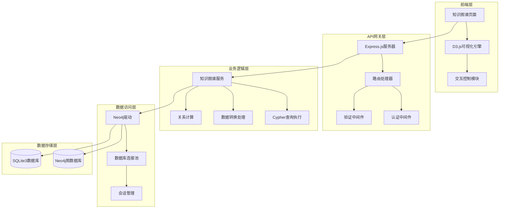

**架构图来源**
- [knowledge-graph.js](file://knowledge-graph.js#L1-L50)
- [knowledge.js](file://backend/src/routes/knowledge.js#L1-L20)
- [database_Neo4j.js](file://backend/src/config/database_Neo4j.js#L1-L30)

## 核心组件分析

### 知识图谱服务 (KnowledgeGraphService)

知识图谱服务是系统的核心业务逻辑组件，负责与Neo4j数据库交互并处理图数据。

#### Cypher查询执行机制

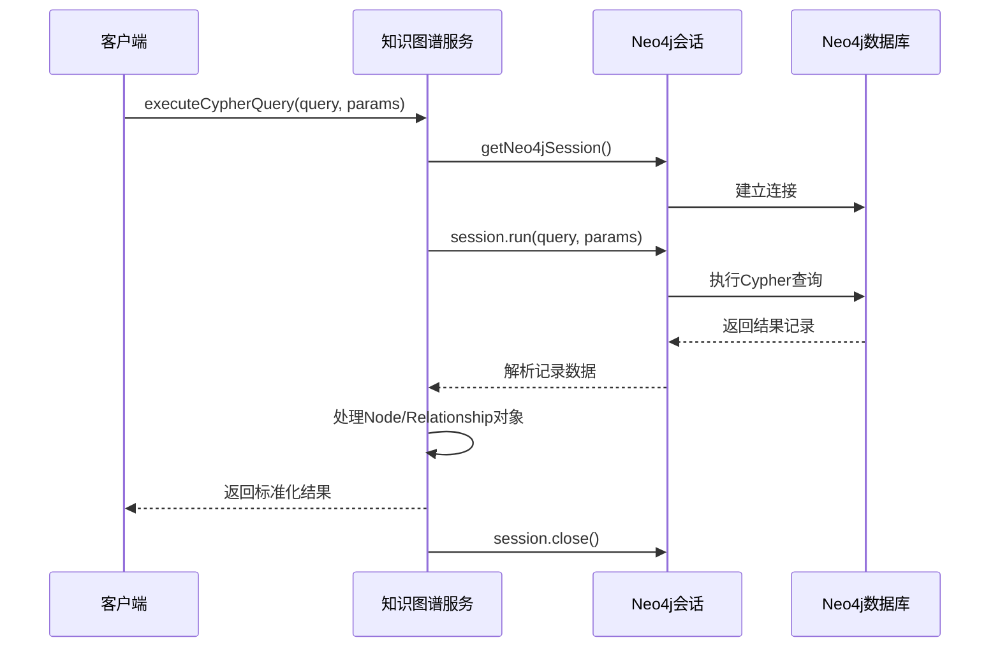

**序列图来源**
- [knowledgeGraphService.js](file://backend/src/services/knowledgeGraphService.js#L5-L45)

#### 节点关系处理逻辑

服务对Neo4j返回的复杂对象进行标准化处理：

| 对象类型 | 处理方式 | 输出结构 |
|---------|---------|---------|
| Node对象 | 提取identity、labels、properties | `{id, labels, properties}` |
| Relationship对象 | 提取identity、type、properties及方向 | `{id, type, properties, source, target}` |
| 基础数据类型 | 直接返回原始值 | `原始值` |

**节源**
- [knowledgeGraphService.js](file://backend/src/services/knowledgeGraphService.js#L10-L40)

#### 核心查询方法

系统提供了多种专门化的查询方法：

1. **图谱概览查询**：统计节点和关系分布
2. **武器图谱查询**：基于武器ID的邻域探索
3. **全文搜索查询**：支持关键词和类型过滤
4. **邻居节点查询**：获取指定节点的直接连接
5. **路径查找查询**：计算两点间的最短路径

**节源**
- [knowledgeGraphService.js](file://backend/src/services/knowledgeGraphService.js#L45-L120)

### 数据库连接管理

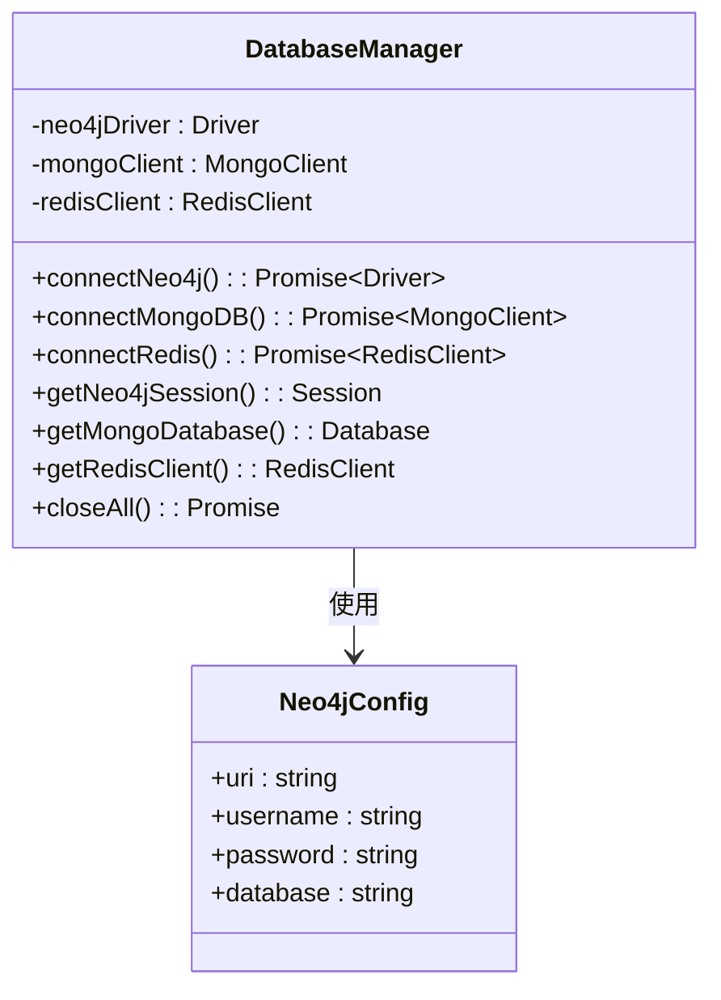

**类图来源**
- [database_Neo4j.js](file://backend/src/config/database_Neo4j.js#L5-L50)

**节源**
- [database_Neo4j.js](file://backend/src/config/database_Neo4j.js#L1-L141)

## API端点详解

### 后端API端点设计

系统提供了完整的RESTful API接口，支持知识图谱的各种操作需求。

#### 核心API端点表格

| 端点路径 | 方法 | 功能描述 | 请求参数 | 响应格式 |
|---------|------|---------|---------|---------|
| `/api/knowledge/overview` | GET | 获取图谱概览统计 | 无 | 统计信息 |
| `/api/knowledge/weapon/:id` | GET | 获取武器相关图谱 | id, depth | 图谱数据 |
| `/api/knowledge/search` | GET | 搜索知识图谱 | q, types, limit | 搜索结果 |
| `/api/knowledge/node/:id/neighbors` | GET | 获取节点邻居 | types, limit | 邻居列表 |
| `/api/knowledge/path` | GET | 查找节点间路径 | start, end, maxDepth | 路径信息 |
| `/api/knowledge/query` | POST | 执行自定义Cypher查询 | query, parameters | 查询结果 |
| `/api/knowledge/recommendations/:userId` | GET | 获取推荐武器 | limit | 推荐列表 |

**节源**
- [knowledge.js](file://backend/src/routes/knowledge.js#L1-L182)

#### 请求参数解析与验证

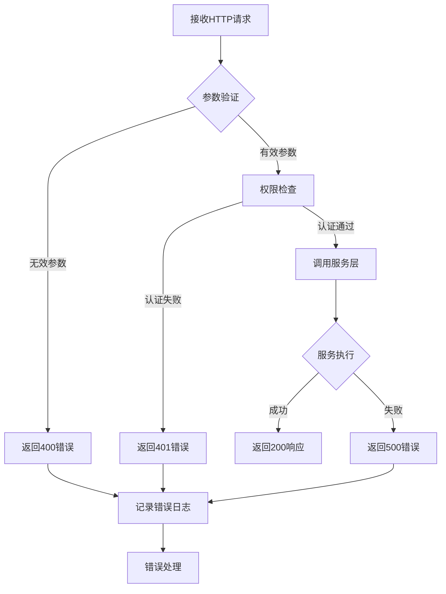

**流程图来源**
- [knowledge.js](file://backend/src/routes/knowledge.js#L15-L35)

#### 响应格式化策略

所有API端点都遵循统一的成功/失败响应格式：

```javascript
// 成功响应格式
{
  success: true,
  data: {...},
  message: "操作成功"
}

// 失败响应格式  
{
  success: false,
  message: "错误描述",
  error: "详细错误信息"
}
```

**节源**
- [knowledge.js](file://backend/src/routes/knowledge.js#L8-L25)

### 前端API调用流程

前端通过Fetch API与后端进行通信，实现了完整的异步数据加载和错误处理机制。

#### 图谱数据加载流程

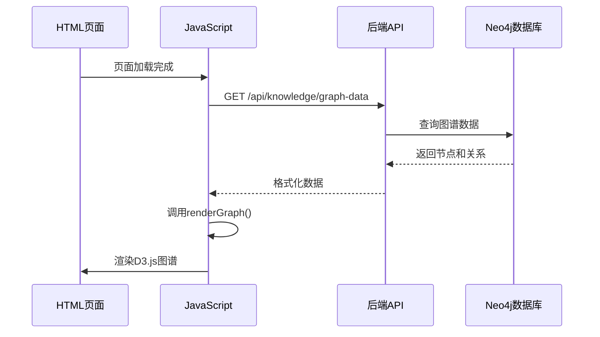

**序列图来源**
- [knowledge-graph.js](file://knowledge-graph.js#L400-L450)

**节源**
- [knowledge-graph.js](file://knowledge-graph.js#L300-L400)

## 前端可视化实现

### DOM加载与初始化

前端知识图谱页面采用事件驱动的初始化模式，确保DOM元素完全加载后再执行可视化操作。

#### 初始化流程

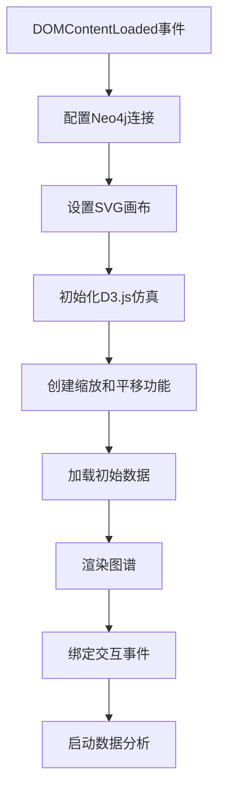

**流程图来源**
- [knowledge-graph.js](file://knowledge-graph.js#L1-L50)

#### 会话管理机制

前端维护了全局的图数据状态和用户交互状态：

| 全局变量 | 类型 | 用途 |
|---------|------|------|
| `graphData` | Object | 存储当前图谱数据 |
| `selectedNode` | Element | 记录当前选中的节点 |
| `simulation` | ForceSimulation | D3.js力导向仿真 |
| `nodeColors` | Object | 节点颜色映射表 |

**节源**
- [knowledge-graph.js](file://knowledge-graph.js#L50-L100)

### 数据结构转换

前端需要将后端返回的图数据转换为D3.js可识别的格式：

#### Node对象处理

```javascript
// 后端Node对象
{
  id: "123",
  labels: ["Weapon"],
  properties: {
    name: "AK-47",
    description: "卡拉什尼科夫自动步枪",
    year: "1947"
  }
}

// D3.js格式
{
  id: "123",
  labels: ["Weapon"],
  properties: {
    name: "AK-47",
    description: "卡拉什尼科夫自动步枪",
    year: "1947"
  }
}
```

#### Relationship对象处理

```javascript
// 后端Relationship对象
{
  id: "456",
  type: "MANUFACTURED_BY",
  properties: {},
  source: "123",
  target: "789"
}

// D3.js格式
{
  source: "123",
  target: "789",
  type: "MANUFACTURED_BY",
  properties: {}
}
```

**节源**
- [knowledge-graph.js](file://knowledge-graph.js#L100-L200)

### renderGraph调用流程

renderGraph函数是图谱渲染的核心，负责将数据转换为可视化的图形元素。

#### 渲染步骤

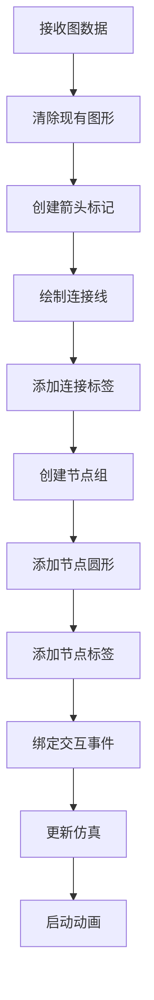

**流程图来源**
- [knowledge-graph.js](file://knowledge-graph.js#L150-L250)

**节源**
- [knowledge-graph.js](file://knowledge-graph.js#L150-L300)

## 数据流分析

### 前后端数据交互

系统采用RESTful API进行前后端数据交换，确保数据传输的安全性和效率。

#### 数据流向图

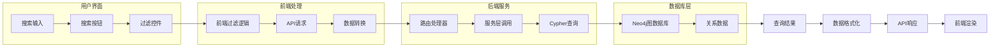

**流向图来源**
- [knowledge-graph.js](file://knowledge-graph.js#L350-L450)
- [knowledge.js](file://backend/src/routes/knowledge.js#L40-L80)

### 图谱搜索功能实现

#### 搜索交互示例

当用户输入关键词"AK-47"时，系统的工作流程如下：

1. **前端过滤逻辑**：
   - 监听搜索输入变化
   - 将输入文本转换为小写
   - 过滤节点名称匹配关键词

2. **后端模糊查询**：
   - Cypher查询语句：`MATCH (n) WHERE n.name CONTAINS $searchTerm`
   - 参数传递：`{searchTerm: "ak-47"}`
   - 结果返回：匹配的节点列表

3. **协同工作机制**：
   - 前端快速响应，提供即时反馈
   - 后端精确查询，保证数据完整性
   - 双重过滤，提升用户体验

**节源**
- [knowledge-graph.js](file://knowledge-graph.js#L350-L400)
- [knowledgeGraphService.js](file://backend/src/services/knowledgeGraphService.js#L140-L200)

## 异常处理机制

### 错误分类与处理策略

系统建立了完善的异常处理体系，涵盖数据库连接、查询执行、数据转换等各个环节。

#### 错误处理层次

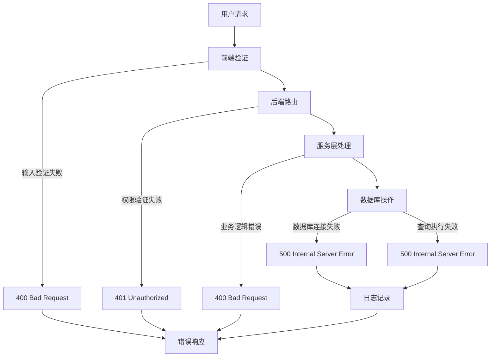

**层次图来源**
- [knowledge.js](file://backend/src/routes/knowledge.js#L10-L25)
- [knowledgeGraphService.js](file://backend/src/services/knowledgeGraphService.js#L45-L60)

#### 具体异常场景处理

| 异常类型 | 触发条件 | 处理方式 | 用户体验 |
|---------|---------|---------|---------|
| 数据库连接失败 | Neo4j连接超时 | 重试机制 + 错误提示 | 显示连接错误信息 |
| 查询参数无效 | 必填参数缺失 | 参数验证 + 400响应 | 表单提示错误 |
| 查询执行超时 | Cypher查询耗时过长 | 设置超时限制 | 显示加载等待 |
| 数据转换异常 | Node/Relationship对象解析失败 | 类型检查 + 默认值 | 跳过异常数据 |
| 权限不足 | 未授权用户访问受保护资源 | 认证检查 + 401响应 | 重定向登录页面 |

**节源**
- [database_Neo4j.js](file://backend/src/config/database_Neo4j.js#L15-L35)
- [knowledgeGraphService.js](file://backend/src/services/knowledgeGraphService.js#L15-L45)

### 调试指南

#### 常见错误场景

1. **数据库连接失败**
   - 检查环境变量配置
   - 验证网络连接状态
   - 确认数据库服务运行

2. **Cypher查询语法错误**
   - 使用Neo4j浏览器测试查询
   - 检查参数类型匹配
   - 验证节点和关系存在性

3. **前端渲染异常**
   - 检查数据格式正确性
   - 验证D3.js依赖加载
   - 查看浏览器控制台错误

**节源**
- [database_Neo4j.js](file://backend/src/config/database_Neo4j.js#L100-L141)
- [knowledge-graph.js](file://knowledge-graph.js#L320-L380)

## 性能优化策略

### 查询缓存机制

系统可以通过Redis实现查询结果缓存，减少重复查询的开销。

#### 缓存策略设计

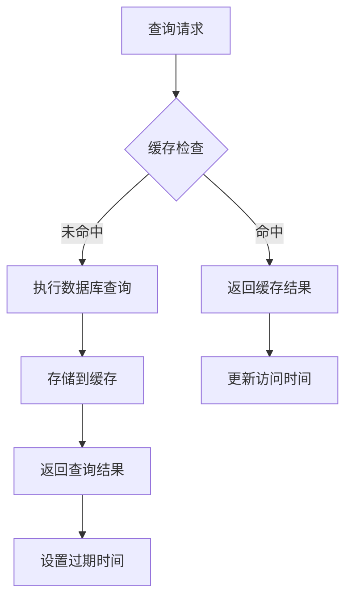

**流程图来源**
- [database_Neo4j.js](file://backend/src/config/database_Neo4j.js#L50-L70)

### 结果分页优化

对于大规模图数据查询，实施分页策略可以显著提升性能：

| 分页参数 | 默认值 | 最大值 | 用途 |
|---------|-------|-------|------|
| limit | 20 | 100 | 控制单次查询结果数量 |
| offset | 0 | 无限制 | 实现分页浏览 |
| depth | 2 | 5 | 限制图遍历深度 |
| maxDepth | 5 | 10 | 限制路径查找深度 |

**节源**
- [knowledgeGraphService.js](file://backend/src/services/knowledgeGraphService.js#L140-L180)

### 前端性能优化

1. **虚拟化渲染**：大量节点时使用虚拟滚动
2. **延迟加载**：按需加载图谱数据
3. **内存管理**：及时清理不需要的数据引用
4. **动画优化**：合理设置仿真参数

**节源**
- [knowledge-graph.js](file://knowledge-graph.js#L250-L350)

## 调试指南

### 开发环境调试

#### 日志配置

系统使用统一的日志记录机制，便于问题定位：

```javascript
// 日志级别：ERROR > WARN > INFO > DEBUG
logger.error('严重错误信息');
logger.warn('警告信息');
logger.info('一般信息');
logger.debug('调试信息');
```

#### 调试工具使用

1. **浏览器开发者工具**
   - Network面板监控API请求
   - Console面板查看JavaScript错误
   - Elements面板检查DOM结构

2. **Neo4j浏览器**
   - 直接执行Cypher查询验证
   - 查看查询计划和性能指标
   - 检查数据完整性和一致性

3. **后端日志**
   - 查看详细的错误堆栈信息
   - 监控数据库连接状态
   - 分析API请求处理时间

**节源**
- [logger.js](file://backend/src/utils/logger.js#L1-L20)

### 生产环境监控

#### 关键指标监控

| 指标类别 | 监控项目 | 告警阈值 | 处理措施 |
|---------|---------|---------|---------|
| 性能指标 | API响应时间 | >2秒 | 优化查询或扩容 |
| 性能指标 | 数据库连接数 | >80% | 增加连接池大小 |
| 错误指标 | 5xx错误率 | >5% | 检查服务健康状态 |
| 错误指标 | 查询失败率 | >10% | 分析查询语句优化 |

#### 故障排查流程

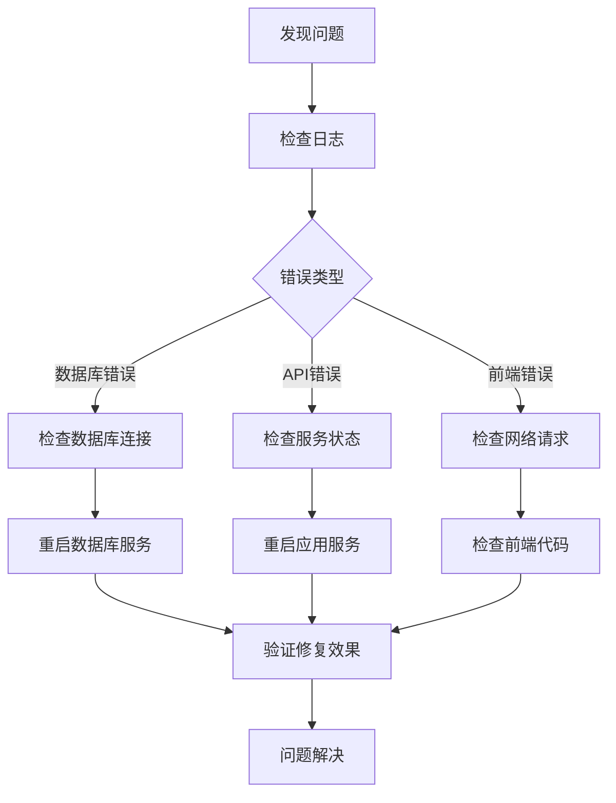

## 最佳实践

### 代码组织原则

1. **模块化设计**：每个功能模块独立封装
2. **单一职责**：每个函数只负责一个明确任务
3. **错误隔离**：不同层级的错误独立处理
4. **配置外化**：敏感信息通过环境变量管理

### 安全考虑

1. **输入验证**：严格验证所有用户输入
2. **权限控制**：实现细粒度的访问控制
3. **SQL注入防护**：使用参数化查询
4. **敏感数据保护**：避免在前端暴露数据库凭据

### 可扩展性设计

1. **插件化架构**：支持功能模块的动态加载
2. **配置驱动**：通过配置文件控制行为
3. **接口抽象**：解耦具体实现细节
4. **版本兼容**：保持API的向后兼容性

### 测试策略

1. **单元测试**：覆盖核心业务逻辑
2. **集成测试**：验证API接口功能
3. **性能测试**：评估大数据量处理能力
4. **安全测试**：检查潜在的安全漏洞

**节源**
- [knowledgeGraphService.js](file://backend/src/services/knowledgeGraphService.js#L1-L430)
- [knowledge.js](file://backend/src/routes/knowledge.js#L1-L182)