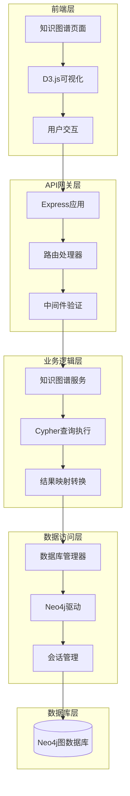
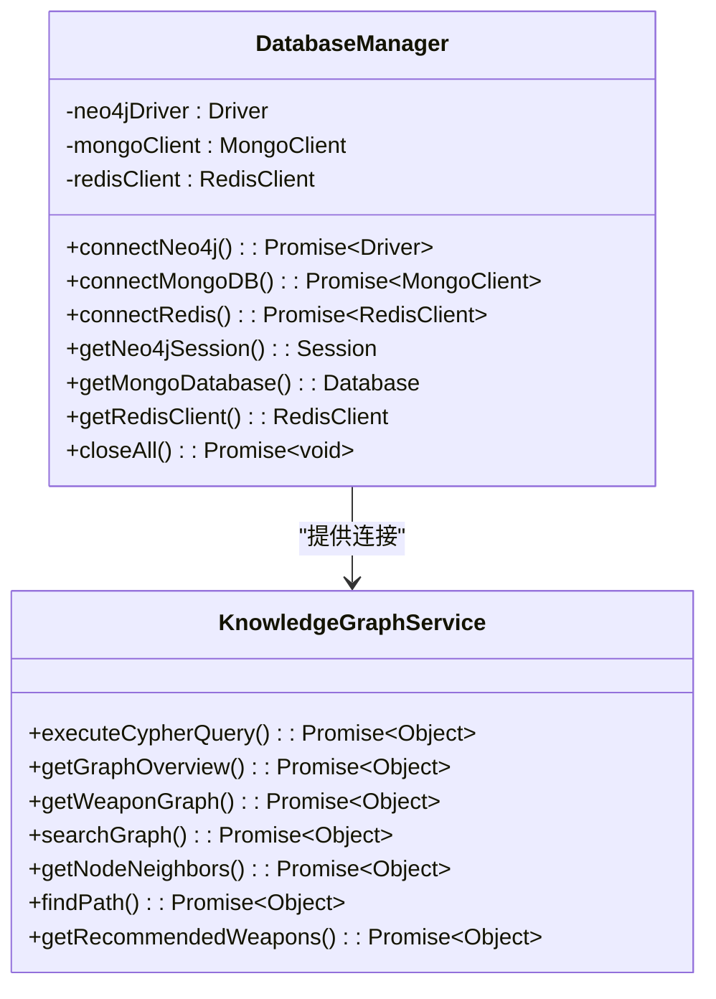
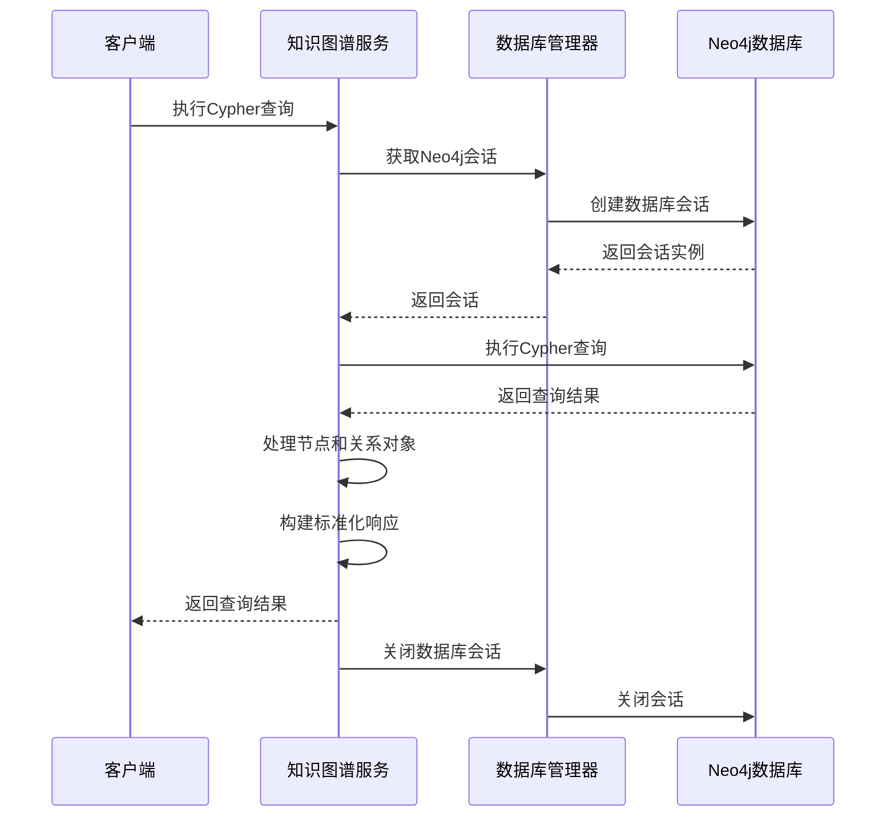
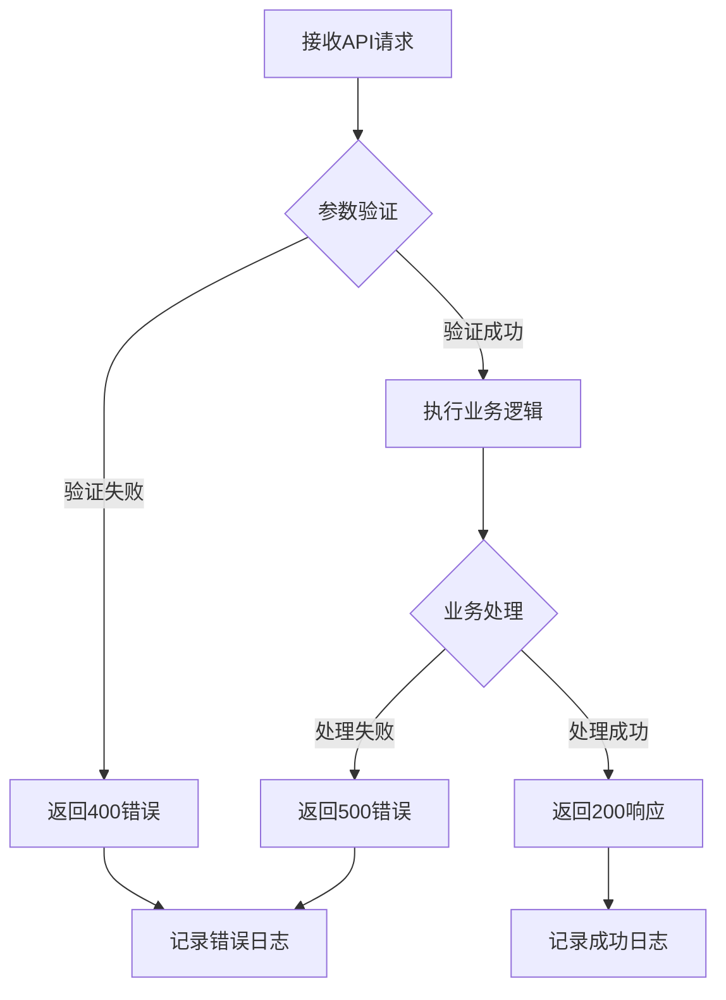
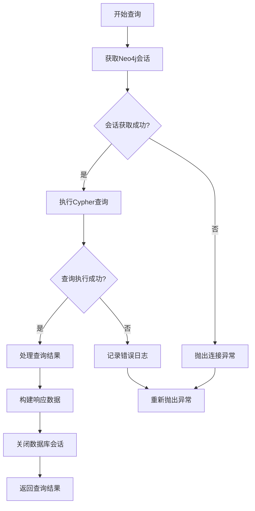
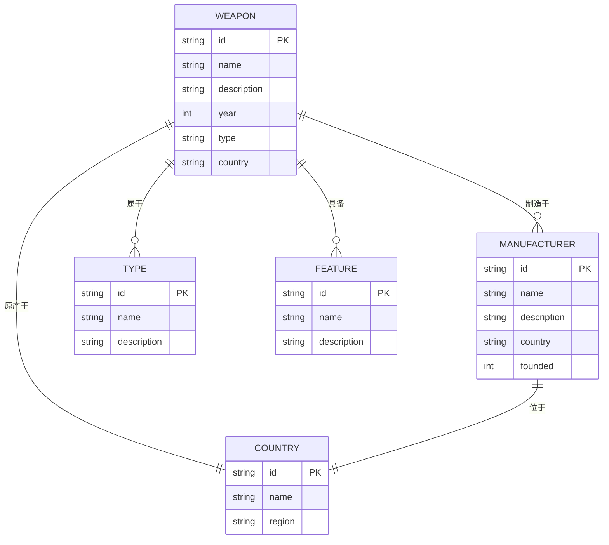
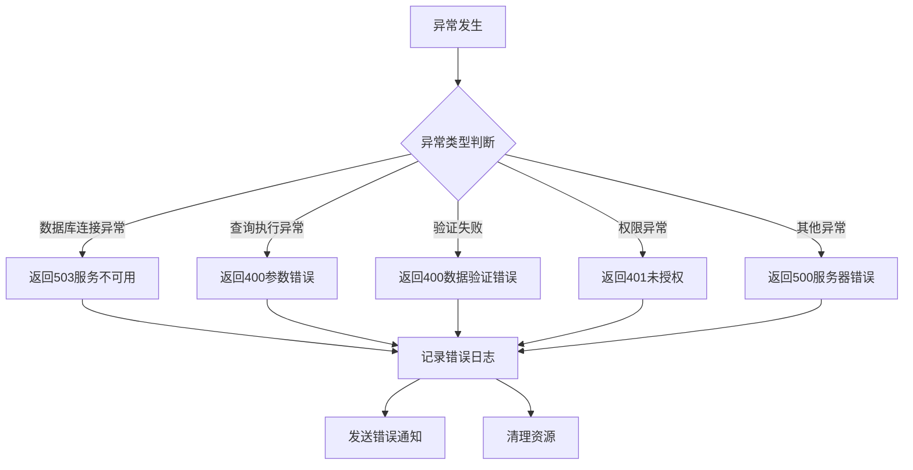
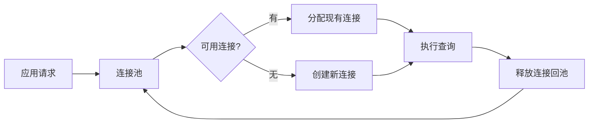
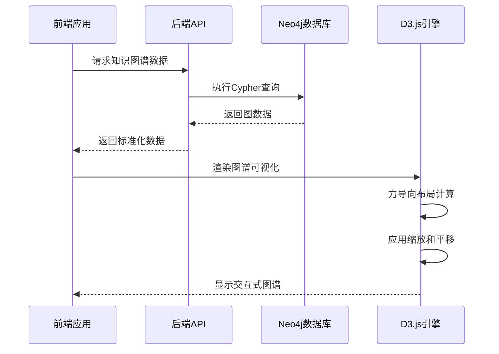

# 知识图谱数据查询机制深度解析

<cite>
**本文档引用的文件**
- [knowledgeGraphService.js](file://backend/src/services/knowledgeGraphService.js)
- [database_Neo4j.js](file://backend/src/config/database_Neo4j.js)
- [knowledge.js](file://backend/src/routes/knowledge.js)
- [knowledge-graph.js](file://backend/src/routes/knowledge-graph.js)
- [validation.js](file://backend/src/middleware/validation.js)
- [app.js](file://backend/src/app.js)
- [index.js](file://backend/src/config/index.js)
- [knowledge-graph.js](file://knowledge-graph.js)
</cite>

## 目录
1. [概述](#概述)
2. [系统架构](#系统架构)
3. [Neo4j数据库连接管理](#neo4j数据库连接管理)
4. [知识图谱服务核心机制](#知识图谱服务核心机制)
5. [API接口设计与实现](#api接口设计与实现)
6. [查询执行流程](#查询执行流程)
7. [数据模型与实体关系](#数据模型与实体关系)
8. [异常处理与错误管理](#异常处理与错误管理)
9. [性能优化策略](#性能优化策略)
10. [前端可视化集成](#前端可视化集成)
11. [最佳实践与建议](#最佳实践与建议)

## 概述

兵智世界知识图谱系统采用Neo4j作为核心图数据库，实现了复杂的武器、制造商、国家等实体间的关联关系查询。系统通过分层架构设计，将数据访问层、业务逻辑层和表现层有效分离，提供了完整的知识图谱数据查询解决方案。

### 核心特性

- **高性能图查询**：基于Neo4j的Cypher查询语言，支持复杂关系网络的快速检索
- **多维度实体建模**：涵盖武器、制造商、国家、类型等多个实体类别
- **灵活的查询接口**：提供多种查询方式，包括精确查询、模糊搜索、路径查找等
- **实时可视化**：集成D3.js实现动态知识图谱展示
- **完善的错误处理**：多层次的异常捕获和响应格式化机制

## 系统架构

**架构图来源**
- [app.js](file://backend/src/app.js#L1-L50)
- [knowledgeGraphService.js](file://backend/src/services/knowledgeGraphService.js#L1-L20)
- [database_Neo4j.js](file://backend/src/config/database_Neo4j.js#L1-L30)

## Neo4j数据库连接管理

### 连接池与会话管理

系统采用单例模式管理Neo4j连接，确保资源的有效利用和连接的安全性。

**类图来源**
- [database_Neo4j.js](file://backend/src/config/database_Neo4j.js#L6-L140)
- [knowledgeGraphService.js](file://backend/src/services/knowledgeGraphService.js#L3-L430)

### 连接配置与初始化

系统通过环境变量配置数据库连接参数，支持开发和生产环境的灵活切换。

**章节来源**
- [database_Neo4j.js](file://backend/src/config/database_Neo4j.js#L15-L50)
- [index.js](file://backend/src/config/index.js#L20-L40)

## 知识图谱服务核心机制

### Cypher查询执行引擎

知识图谱服务的核心是Cypher查询执行机制，负责处理各种类型的图查询操作。

**序列图来源**
- [knowledgeGraphService.js](file://backend/src/services/knowledgeGraphService.js#L5-L83)
- [database_Neo4j.js](file://backend/src/config/database_Neo4j.js#L120-L140)

### 查询结果处理机制

服务层对Neo4j返回的原始数据进行标准化处理，将节点和关系对象转换为统一的JSON格式。

**章节来源**
- [knowledgeGraphService.js](file://backend/src/services/knowledgeGraphService.js#L8-L37)

## API接口设计与实现

### 核心查询接口

系统提供了丰富的RESTful API接口，支持不同类型的知识图谱查询需求。

| 接口路径 | 方法 | 功能描述 | 参数要求 |
|---------|------|----------|----------|
| `/api/knowledge/overview` | GET | 获取知识图谱概览统计 | 无 |
| `/api/knowledge/weapon/:id` | GET | 获取指定武器的关联网络 | id: 武器ID, depth: 查询深度(可选) |
| `/api/knowledge/search` | GET | 搜索知识图谱中的实体 | q: 搜索关键词, types: 节点类型, limit: 结果数量 |
| `/api/knowledge/node/:id/neighbors` | GET | 获取节点的邻居节点 | id: 节点ID, types: 关系类型, limit: 结果数量 |
| `/api/knowledge/path` | GET | 查找两个节点之间的最短路径 | start: 起始节点, end: 结束节点, maxDepth: 最大深度 |
| `/api/knowledge/query` | POST | 执行自定义Cypher查询 | query: Cypher查询语句, parameters: 查询参数 |
| `/api/knowledge/recommendations/:userId` | GET | 获取基于用户兴趣的武器推荐 | userId: 用户ID, limit: 推荐数量 |

### 请求参数验证机制

系统采用Joi验证库对API请求参数进行严格验证，确保数据的完整性和安全性。

**流程图来源**
- [validation.js](file://backend/src/middleware/validation.js#L5-L30)
- [knowledge.js](file://backend/src/routes/knowledge.js#L20-L50)

**章节来源**
- [knowledge.js](file://backend/src/routes/knowledge.js#L1-L181)
- [validation.js](file://backend/src/middleware/validation.js#L154-L177)

## 查询执行流程

### 会话创建与事务管理

每个查询都遵循严格的会话管理流程，确保数据库连接的安全性和可靠性。

**流程图来源**
- [knowledgeGraphService.js](file://backend/src/services/knowledgeGraphService.js#L5-L83)

### 参数化查询构造

系统支持动态参数化查询，根据不同的查询需求构建相应的Cypher语句。

**章节来源**
- [knowledgeGraphService.js](file://backend/src/services/knowledgeGraphService.js#L85-L205)

## 数据模型与实体关系

### 实体类型定义

知识图谱系统定义了以下核心实体类型：

| 实体类型 | 标签 | 主要属性 | 关联关系 |
|---------|------|----------|----------|
| 武器 | Weapon | id, name, description, year, type, country | 制造商、国家、类型、特性 |
| 制造商 | Manufacturer | id, name, description, country, founded | 国家、武器 |
| 国家 | Country | id, name, region | 武器、制造商 |
| 类型 | Type | id, name, description | 武器 |
| 特性 | Feature | id, name, description | 武器 |

### 复杂关系建模

系统通过多种关系类型实现复杂的实体关联：

**实体关系图来源**
- [knowledge-graph.js](file://backend/src/routes/knowledge-graph.js#L50-L150)

**章节来源**
- [knowledge-graph.js](file://backend/src/routes/knowledge-graph.js#L1-L401)

## 异常处理与错误管理

### 多层次错误处理机制

系统实现了完善的异常处理体系，覆盖数据库连接、查询执行、参数验证等各个环节。

**错误处理流程图来源**
- [app.js](file://backend/src/app.js#L120-L180)

### 错误响应格式化

系统采用统一的错误响应格式，便于前端处理和用户理解。

**章节来源**
- [app.js](file://backend/src/app.js#L120-L180)
- [knowledgeGraphService.js](file://backend/src/services/knowledgeGraphService.js#L45-L83)

## 性能优化策略

### 查询优化技术

1. **索引使用策略**
   - 为常用查询字段建立索引
   - 利用Neo4j的智能索引功能
   - 避免全图扫描操作

2. **查询缓存机制**
   - 对高频查询结果进行缓存
   - 设置合理的缓存过期时间
   - 支持缓存失效和更新

3. **分页处理方案**
   - 限制单次查询返回的结果数量
   - 实现游标分页机制
   - 支持大数据集的渐进式加载

### 连接池管理

系统通过连接池管理数据库连接，提高并发处理能力：

**连接池管理图来源**
- [database_Neo4j.js](file://backend/src/config/database_Neo4j.js#L120-L140)

**章节来源**
- [index.js](file://backend/src/config/index.js#L50-L72)

## 前端可视化集成

### D3.js图谱渲染

前端采用D3.js库实现知识图谱的动态可视化展示，支持交互式探索。

**可视化流程图来源**
- [knowledge-graph.js](file://knowledge-graph.js#L100-L200)

### 交互功能实现

前端提供了丰富的交互功能：

- **节点拖拽**：支持手动调整节点位置
- **缩放控制**：提供放大、缩小和平移功能
- **搜索过滤**：支持按名称和类型筛选节点
- **详情显示**：点击节点显示详细信息
- **导出功能**：支持SVG格式导出

**章节来源**
- [knowledge-graph.js](file://knowledge-graph.js#L1-L796)

## 最佳实践与建议

### 开发建议

1. **查询设计原则**
   - 优先使用索引字段进行查询
   - 避免过于复杂的嵌套查询
   - 合理设置查询深度限制

2. **性能监控**
   - 监控查询执行时间
   - 跟踪数据库连接使用情况
   - 分析查询模式和热点数据

3. **安全考虑**
   - 对用户输入进行严格验证
   - 限制查询复杂度和返回结果数量
   - 实施适当的访问控制机制

### 部署优化

1. **资源配置**
   - 根据预期负载配置数据库资源
   - 设置合适的连接池大小
   - 优化内存和CPU使用

2. **监控告警**
   - 建立查询性能监控体系
   - 设置异常情况告警机制
   - 定期进行系统健康检查

3. **扩展性规划**
   - 考虑水平扩展的可能性
   - 设计合理的数据分区策略
   - 实现读写分离架构

通过以上深度解析，我们可以看到兵智世界知识图谱系统在架构设计、查询优化、异常处理等方面都体现了专业的软件工程实践。该系统不仅能够高效处理复杂的图查询任务，还提供了良好的用户体验和稳定的系统性能。