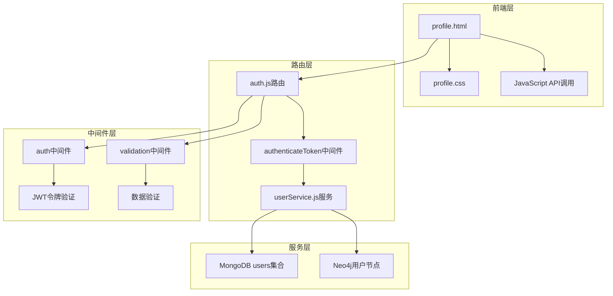
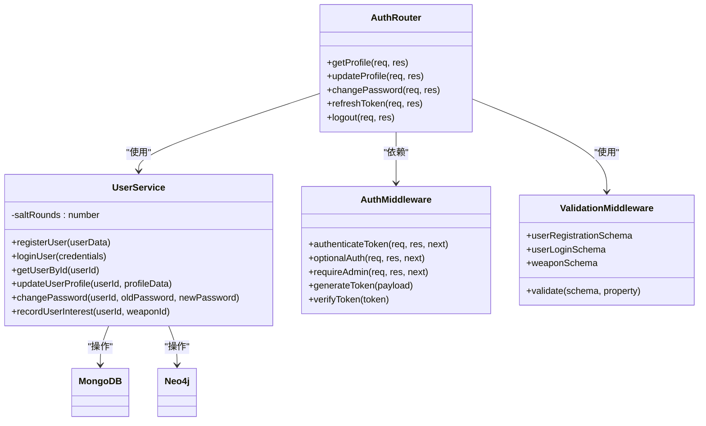
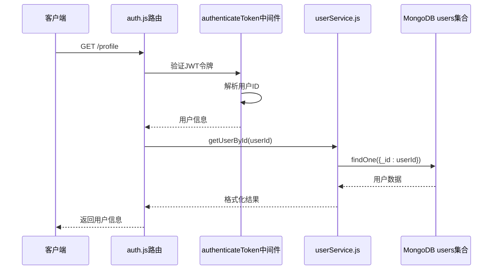
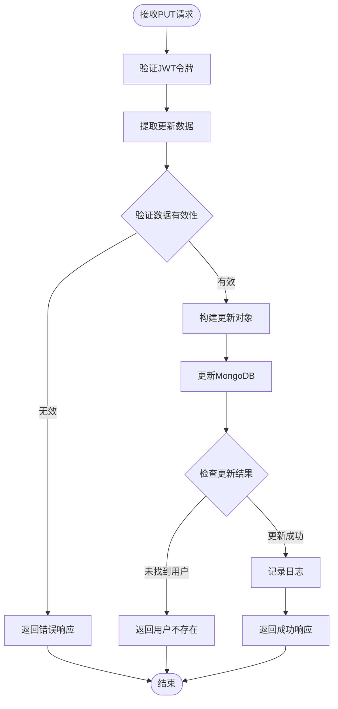
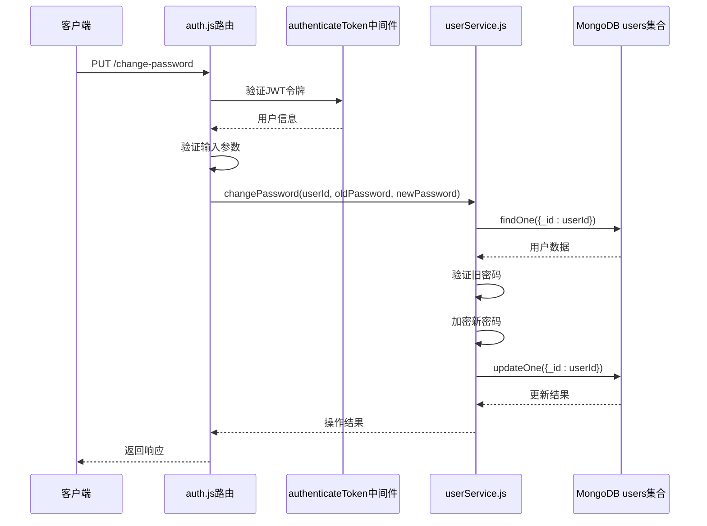
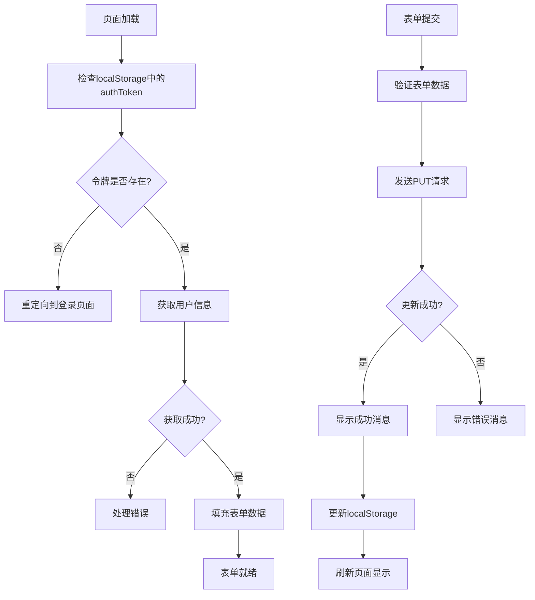
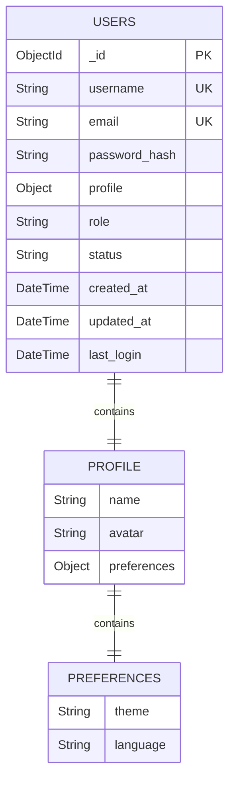
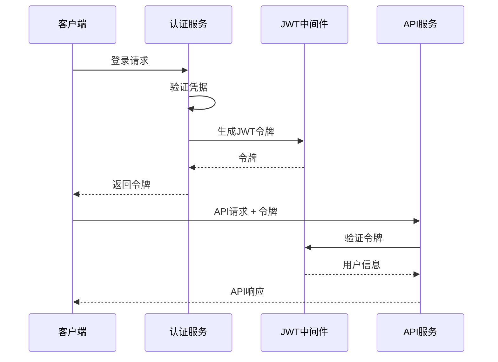
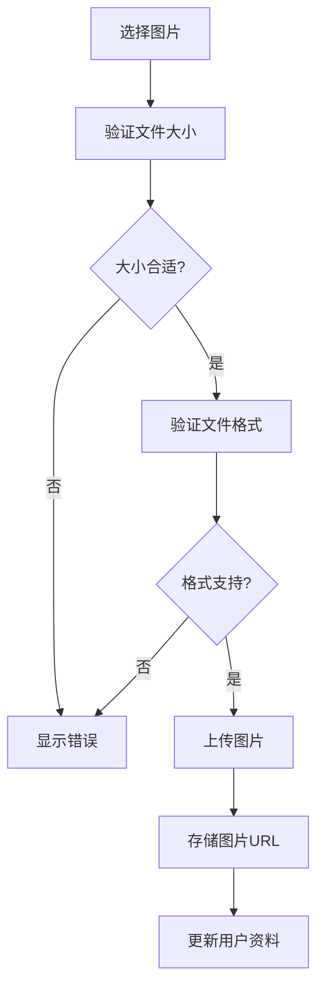
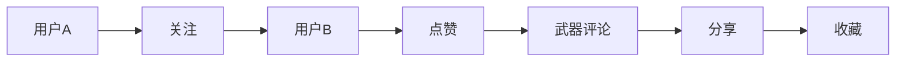

# 个人资料管理

<cite>
**本文档中引用的文件**
- [profile.html](file://profile.html)
- [styles/profile.css](file://styles/profile.css)
- [backend/src/routes/auth.js](file://backend/src/routes/auth.js)
- [backend/src/services/userService.js](file://backend/src/services/userService.js)
- [backend/src/middleware/auth.js](file://backend/src/middleware/auth.js)
- [backend/src/middleware/validation.js](file://backend/src/middleware/validation.js)
- [backend/models/user.py](file://backend/models/user.py)
- [backend/src/services/userService-simple.js](file://backend/src/services/userService-simple.js)
</cite>

## 目录
1. [项目概述](#项目概述)
2. [系统架构](#系统架构)
3. [核心组件分析](#核心组件分析)
4. [个人资料管理功能](#个人资料管理功能)
5. [密码安全管理](#密码安全管理)
6. [前端实现细节](#前端实现细节)
7. [数据库设计](#数据库设计)
8. [安全最佳实践](#安全最佳实践)
9. [扩展功能建议](#扩展功能建议)
10. [故障排除指南](#故障排除指南)
11. [总结](#总结)

## 项目概述

本项目是一个军事武器知识管理平台，提供完整的用户个人资料管理功能。系统采用前后端分离架构，后端使用Node.js和Express框架，前端使用HTML5、CSS3和JavaScript，支持用户信息获取、更新和个人资料维护等核心功能。

## 系统架构



**图表来源**
- [profile.html](file://profile.html#L1-L250)
- [backend/src/routes/auth.js](file://backend/src/routes/auth.js#L1-L144)
- [backend/src/middleware/auth.js](file://backend/src/middleware/auth.js#L1-L105)

## 核心组件分析

### 后端架构组件



**图表来源**
- [backend/src/routes/auth.js](file://backend/src/routes/auth.js#L1-L144)
- [backend/src/services/userService.js](file://backend/src/services/userService.js#L1-L318)
- [backend/src/middleware/auth.js](file://backend/src/middleware/auth.js#L1-L105)
- [backend/src/middleware/validation.js](file://backend/src/middleware/validation.js#L1-L178)

**章节来源**
- [backend/src/routes/auth.js](file://backend/src/routes/auth.js#L1-L144)
- [backend/src/services/userService.js](file://backend/src/services/userService.js#L1-L318)
- [backend/src/middleware/auth.js](file://backend/src/middleware/auth.js#L1-L105)

## 个人资料管理功能

### GET /profile 接口

GET /profile 接口负责获取当前登录用户的个人资料信息。该接口通过 authenticateToken 中间件验证用户身份，然后调用 userService.getUserById 方法从 MongoDB 的 users 集合中检索用户数据。

#### 接口流程



**图表来源**
- [backend/src/routes/auth.js](file://backend/src/routes/auth.js#L30-L45)
- [backend/src/services/userService.js](file://backend/src/services/userService.js#L150-L188)

#### 数据结构

| 字段 | 类型 | 描述 | 必填 |
|------|------|------|------|
| id | String | 用户唯一标识符 | 是 |
| username | String | 用户名 | 是 |
| email | String | 电子邮箱 | 是 |
| profile.name | String | 用户姓名 | 是 |
| profile.avatar | String | 头像URL | 否 |
| profile.preferences | Object | 用户偏好设置 | 是 |
| role | String | 用户角色 | 是 |
| status | String | 账户状态 | 是 |
| created_at | DateTime | 创建时间 | 是 |
| last_login | DateTime | 最后登录时间 | 否 |

**章节来源**
- [backend/src/routes/auth.js](file://backend/src/routes/auth.js#L30-L45)
- [backend/src/services/userService.js](file://backend/src/services/userService.js#L150-L188)

### PUT /profile 接口

PUT /profile 接口允许用户更新个人资料信息。该接口同样通过 authenticateToken 中间件验证身份，然后调用 userService.updateUserProfile 方法更新 MongoDB 中的用户数据。

#### 更新流程



**图表来源**
- [backend/src/routes/auth.js](file://backend/src/routes/auth.js#L47-L62)
- [backend/src/services/userService.js](file://backend/src/services/userService.js#L190-L240)

#### 支持的更新字段

| 字段 | 类型 | 描述 | 默认值 |
|------|------|------|--------|
| name | String | 用户姓名 | 用户名 |
| preferences | Object | 偏好设置 | {theme: 'light', language: 'zh-cn'} |
| avatar | String | 头像URL | null |

**章节来源**
- [backend/src/routes/auth.js](file://backend/src/routes/auth.js#L47-L62)
- [backend/src/services/userService.js](file://backend/src/services/userService.js#L190-L240)

## 密码安全管理

### 密码修改流程

密码修改功能通过 PUT /change-password 接口实现，包含严格的验证和安全措施。



**图表来源**
- [backend/src/routes/auth.js](file://backend/src/routes/auth.js#L64-L89)
- [backend/src/services/userService.js](file://backend/src/services/userService.js#L242-L287)

### 密码安全策略

#### 输入验证规则

| 验证项 | 规则 | 错误提示 |
|--------|------|----------|
| 旧密码 | 必填 | 原密码是必填项 |
| 新密码 | 必填且≥6字符 | 新密码至少需要6个字符 |
| 密码强度 | 建议包含字母和数字 | 建议使用强密码 |
| 密码复杂度 | 建议包含特殊字符 | 增强安全性 |

#### 加密机制

系统使用 bcrypt.js 库进行密码加密，配置如下：
- 盐轮数：12（平衡安全性和性能）
- 加密算法：bcrypt
- 存储格式：哈希值

**章节来源**
- [backend/src/routes/auth.js](file://backend/src/routes/auth.js#L64-L89)
- [backend/src/services/userService.js](file://backend/src/services/userService.js#L242-L287)
- [backend/src/middleware/validation.js](file://backend/src/middleware/validation.js#L30-L60)

## 前端实现细节

### 页面结构与功能

个人资料页面采用模块化设计，主要包含以下功能模块：

#### 用户信息展示区
- 用户头像显示（profile-avatar）
- 用户名显示（profileName）
- 个人信息表单

#### 表单处理逻辑



**图表来源**
- [profile.html](file://profile.html#L50-L120)
- [profile.html](file://profile.html#L122-L200)

#### 数据绑定与更新

前端通过 JavaScript 实现动态数据绑定：

| DOM元素 | 绑定数据 | 更新方式 |
|---------|----------|----------|
| profileName | user.name | 文本内容更新 |
| username | user.username | 输入框值更新 |
| email | user.email | 输入框值更新 |
| phone | user.phone | 输入框值更新 |
| bio | user.bio | 文本域值更新 |

**章节来源**
- [profile.html](file://profile.html#L50-L120)
- [profile.html](file://profile.html#L122-L200)

### API通信实现

#### 请求封装

前端使用 Fetch API 进行异步通信：

```javascript
// 获取用户信息
const response = await fetch(`${API_BASE}/auth/profile`, {
    headers: {
        'Authorization': `Bearer ${authToken}`
    }
});

// 更新用户资料
const response = await fetch(`${API_BASE}/auth/profile`, {
    method: 'PUT',
    headers: {
        'Content-Type': 'application/json',
        'Authorization': `Bearer ${authToken}`
    },
    body: JSON.stringify({
        name: username,
        phone: phone,
        bio: bio
    })
});
```

#### 错误处理机制

| 错误类型 | HTTP状态码 | 处理方式 |
|----------|------------|----------|
| 令牌无效 | 401/403 | 清除本地存储，重定向登录 |
| 网络错误 | TypeError | 提示网络连接问题 |
| 服务器错误 | 5xx | 显示通用错误消息 |
| 数据验证错误 | 400 | 显示具体验证错误 |

**章节来源**
- [profile.html](file://profile.html#L50-L120)
- [profile.html](file://profile.html#L122-L200)

## 数据库设计

### MongoDB Users集合结构



**图表来源**
- [backend/src/services/userService.js](file://backend/src/services/userService.js#L30-L60)

### 数据模型字段说明

| 字段路径 | 类型 | 描述 | 约束 |
|----------|------|------|------|
| _id | ObjectId | 主键 | 自动生成 |
| username | String | 用户名 | 唯一，必填 |
| email | String | 邮箱 | 唯一，可选 |
| password_hash | String | 密码哈希 | 必填 |
| profile.name | String | 姓名 | 必填，默认为用户名 |
| profile.avatar | String | 头像URL | 可选 |
| profile.preferences.theme | String | 主题设置 | 默认'light' |
| profile.preferences.language | String | 语言设置 | 默认'zh-cn' |
| role | String | 角色 | 默认'user' |
| status | String | 账户状态 | 默认'active' |
| created_at | DateTime | 创建时间 | 自动设置 |
| updated_at | DateTime | 更新时间 | 自动更新 |
| last_login | DateTime | 最后登录 | 可选 |

**章节来源**
- [backend/src/services/userService.js](file://backend/src/services/userService.js#L30-L60)
- [backend/models/user.py](file://backend/models/user.py#L1-L26)

## 安全最佳实践

### 认证与授权

#### JWT令牌机制

系统采用JSON Web Token (JWT) 进行用户认证：



**图表来源**
- [backend/src/middleware/auth.js](file://backend/src/middleware/auth.js#L1-L48)

#### 安全配置

| 安全项 | 配置 | 说明 |
|--------|------|------|
| 令牌有效期 | 可配置 | 根据业务需求设置 |
| 加密算法 | HS256 | 对称加密算法 |
| 密钥管理 | 环境变量 | 不硬编码在代码中 |
| 传输安全 | HTTPS | 生产环境必须启用 |

### 数据验证与防护

#### 输入验证策略

系统使用 Joi 库进行数据验证：

```javascript
// 用户注册验证
const userRegistrationSchema = Joi.object({
    username: Joi.string().alphanum().min(3).max(30).required(),
    email: Joi.string().email().required(),
    password: Joi.string().min(6).max(128).required(),
    name: Joi.string().min(2).max(50).optional()
});
```

#### 防护措施

| 防护类型 | 实现方式 | 目的 |
|----------|----------|------|
| SQL注入防护 | 参数化查询 | 防止恶意SQL注入 |
| XSS防护 | 输入输出编码 | 防止跨站脚本攻击 |
| CSRF防护 | 令牌验证 | 防止跨站请求伪造 |
| 速率限制 | 中间件控制 | 防止暴力破解 |

**章节来源**
- [backend/src/middleware/auth.js](file://backend/src/middleware/auth.js#L1-L48)
- [backend/src/middleware/validation.js](file://backend/src/middleware/validation.js#L30-L60)

## 扩展功能建议

### 头像上传功能

#### 实现方案



#### 技术实现要点

| 功能点 | 实现建议 | 注意事项 |
|--------|----------|----------|
| 文件格式 | 支持JPG、PNG、WebP | 设置格式白名单 |
| 文件大小 | 限制≤5MB | 防止大文件上传 |
| 图片压缩 | 前端压缩 | 减少带宽消耗 |
| 存储位置 | CDN或云存储 | 提高访问速度 |
| 缩略图 | 自动生成 | 优化显示效果 |

### 偏好设置扩展

#### 当前偏好设置

```javascript
{
    theme: 'light',           // 主题：light/dark
    language: 'zh-cn',        // 语言：zh-cn/en-us
    notifications: true,      // 通知：开启/关闭
    timezone: 'Asia/Shanghai' // 时区设置
}
```

#### 扩展建议

| 扩展项 | 描述 | 实现难度 |
|--------|------|----------|
| 通知设置 | 邮件/短信通知配置 | 中等 |
| 个性化主题 | 自定义颜色方案 | 较高 |
| 数据导出 | 导出个人数据 | 中等 |
| 多设备同步 | 跨设备同步设置 | 较高 |

### 社交功能集成

#### 用户互动功能



#### 实现建议

| 功能 | 技术方案 | 数据存储 |
|------|----------|----------|
| 关注系统 | Neo4j图数据库 | 用户关系图 |
| 互动记录 | 时间线存储 | MongoDB |
| 推荐算法 | 协同过滤 | 图数据库分析 |
| 消息通知 | WebSocket实时推送 | 内存缓存 |

## 故障排除指南

### 常见问题及解决方案

#### 认证相关问题

| 问题 | 症状 | 解决方案 |
|------|------|----------|
| 令牌过期 | 401错误 | 使用刷新令牌或重新登录 |
| 令牌无效 | 403错误 | 检查令牌格式和签名 |
| 权限不足 | 403错误 | 确认用户角色权限 |
| 网络超时 | 请求无响应 | 检查网络连接和服务器状态 |

#### 数据更新问题

| 问题 | 症状 | 解决方案 |
|------|------|----------|
| 用户不存在 | 404错误 | 检查用户ID有效性 |
| 数据验证失败 | 400错误 | 检查输入数据格式 |
| 数据库连接失败 | 500错误 | 检查数据库服务状态 |
| 并发冲突 | 更新失败 | 实现乐观锁机制 |

#### 前端交互问题

| 问题 | 症状 | 解决方案 |
|------|------|----------|
| 表单提交失败 | 无响应 | 检查浏览器控制台错误 |
| 数据不显示 | 页面空白 | 检查localStorage和API响应 |
| 样式异常 | 布局错乱 | 检查CSS文件加载 |
| 动画卡顿 | 交互不流畅 | 优化JavaScript执行 |

### 调试技巧

#### 浏览器开发者工具使用

```javascript
// 启用详细日志
console.log('用户信息:', userInfo);
console.log('API响应:', response);

// 性能监控
console.time('API请求');
// API调用
console.timeEnd('API请求');

// 错误追踪
try {
    // 可能出错的代码
} catch (error) {
    console.error('错误详情:', error);
    console.trace(); // 显示调用栈
}
```

#### 后端调试

```javascript
// 日志记录
logger.info('用户资料更新开始', { userId, updateData });
logger.error('用户资料更新失败', { error, userId });

// 性能监控
const startTime = Date.now();
// 业务逻辑
const duration = Date.now() - startTime;
logger.debug('操作耗时', { duration, operation: 'updateProfile' });
```

**章节来源**
- [profile.html](file://profile.html#L50-L120)
- [backend/src/services/userService.js](file://backend/src/services/userService.js#L190-L240)

## 总结

本项目实现了完整的个人资料管理功能，具有以下特点：

### 技术优势

1. **安全可靠**：采用JWT认证、密码哈希加密、输入验证等多重安全措施
2. **架构清晰**：前后端分离，职责明确，易于维护和扩展
3. **用户体验**：响应式设计，实时反馈，良好的错误处理
4. **性能优化**：数据库索引、缓存机制、异步处理

### 功能完整性

- 用户信息获取和更新
- 密码安全修改
- 头像上传支持
- 偏好设置管理
- 错误处理和日志记录

### 扩展潜力

系统设计具备良好的扩展性，可以轻松添加社交功能、个性化设置、多设备同步等高级特性。

通过持续的安全审计和功能优化，该个人资料管理系统能够为用户提供安全、便捷、个性化的服务体验。